# 🗄️🤖 SQL & GenAI Course
**🎯 Quality Education for Anyone, Anywhere, Anytime — 💫 with Comfort, Convenience at no Cost**

---
## 🧠 Exercise 5 Solutions: Mixed JOIN Practice – Multiple Databases

This document contains the solutions for **Exercise 5: Mixed JOIN Practice**. Use it to check your work, understand alternative approaches, and reinforce your learning.

---

## 🌌 SQLVerse Check-In

<div style="border-left: 4px solid #9c27b0; background-color: #f3e5f5; padding: 15px; margin: 20px 0; border-radius: 0 8px 8px 0;">

**The laws of the SQLVerse are no longer mysteries to you. You have the keys.** You've mastered every join type and learned to choose the right tool for the right question. Now check your solutions and see the Artisan's approach.

**The difference between a coder and an Artisan is discipline.**

</div>

---

### 📍 Your Current Stage

```mermaid
flowchart LR
    Ex0["✅ Exercise 0 Solutions<br/>Normalization Practice"] --> Ex1
    Ex1["✅ Exercise 1 Solutions<br/>INNER JOIN Practice"] --> Ex2
    Ex2["✅ Exercise 2 Solutions<br/>LEFT JOIN Practice"] --> Ex3
    Ex3["✅ Exercise 3 Solutions<br/>Multiple Tables Practice"] --> Ex4
    Ex4["✅ Exercise 4 Solutions<br/>Self Join Practice"] --> Ex5
    Ex5["📍 YOU ARE HERE<br/>📖 Exercise 5 Solutions<br/>Mixed JOIN Practice"] --> Cap
    Cap["⏳ Capstone Solutions<br/>CTO / CEO / CFO"] --> QuizAns
    QuizAns["⏳ Quiz Answers<br/>module4-quiz-answers.md"] --> Complete
    Complete["🎉 MODULE 4 COMPLETE<br/>Ready for ACCELERATE"] --> Guide
    Guide["🔄 Return to Module 4 Guide<br/>for Reflection & Begin ACCELERATE"]
    
    style Ex0 fill:#e1f5fe,stroke:#4caf50,stroke-width:2px
    style Ex1 fill:#e1f5fe,stroke:#4caf50,stroke-width:2px
    style Ex2 fill:#e1f5fe,stroke:#4caf50,stroke-width:2px
    style Ex3 fill:#e1f5fe,stroke:#4caf50,stroke-width:2px
    style Ex4 fill:#e1f5fe,stroke:#4caf50,stroke-width:2px
    style Ex5 fill:#fff8e1,stroke:#ff9800,stroke-width:4px
    style Cap fill:#fff8e1,stroke:#ff9800,stroke-width:2px
    style QuizAns fill:#fff8e1,stroke:#ff9800,stroke-width:2px
    style Complete fill:#a5d6a7,stroke:#2e7d32,stroke-width:2px
    style Guide fill:#fff8e1,stroke:#ff9800,stroke-width:2px
```



---

### Challenge 1: Students with Payment Status (Training Institution)

**Question:** Show all students, their total payments, and whether they have paid their full fees. Display `student_name`, `total_fees`, `fees_paid`, `balance_owed`, and `payment_status` ('Paid in Full', 'Partial', or 'No Payments').

> 💡 **Decision Guide:** Use `students` table only. No joins needed. Use `CASE` statement for status.

**Solution:**

```sql
SELECT 
    first_name || ' ' || last_name AS student_name,
    total_fees,
    fees_paid,
    (total_fees - fees_paid) AS balance_owed,
    CASE 
        WHEN fees_paid = 0 THEN 'No Payments'
        WHEN fees_paid >= total_fees THEN 'Paid in Full'
        ELSE 'Partial'
    END AS payment_status
FROM students
ORDER BY student_name;
```

**Explanation:**
- No joins – all data is in the `students` table
- `CASE` statement categorizes payment status
- Calculated column `balance_owed` shows remaining amount

**Expected Result (first 5 rows):**

| student_name | total_fees | fees_paid | balance_owed | payment_status |
|--------------|------------|-----------|--------------|----------------|
| Alex Kumar | 4500.00 | 4500.00 | 0.00 | Paid in Full |
| Carlos Mendez | 3800.00 | 3800.00 | 0.00 | Paid in Full |
| David Thompson | 4800.00 | 4800.00 | 0.00 | Paid in Full |
| James Wilson | 5200.00 | 0.00 | 5200.00 | No Payments |
| Jessica Park | 4500.00 | 2000.00 | 2500.00 | Partial |

---

### Challenge 2: Courses with No Enrollments (Training Institution)

**Question:** Find courses that have no students enrolled. Display `course_code`, `course_name`, and `course_track`.

> 💡 **Decision Guide:** `LEFT JOIN` from `courses` to `enrollments`, then `WHERE enrollment_id IS NULL`.

**Solution:**

```sql
SELECT 
    c.course_code,
    c.course_name,
    c.course_track
FROM courses c
LEFT JOIN enrollments e ON c.course_id = e.course_id
WHERE e.enrollment_id IS NULL;
```

**Explanation:**
- `LEFT JOIN` keeps all courses
- `WHERE e.enrollment_id IS NULL` filters to courses with no enrollments

**Expected Result:**

| course_code | course_name | course_track |
|-------------|-------------|--------------|
| (Any course with zero enrollments – based on data) | | |

> 💡 **Note:** Based on the sample data, all courses have at least one enrollment. The pattern is what matters.

---

### Challenge 3: Complete Student Transcript (Training Institution)

**Question:** Show every student, their enrolled courses, instructor names, and final exam scores. Include students with no enrollments (show NULL for course and instructor). Display `student_name`, `course_name`, `instructor_name`, and `final_exam_score`. Order by student name.

> 💡 **Decision Guide:** `LEFT JOIN` chain: `students` → `enrollments` → `courses` → `instructors`. Preserve students with no enrollments.

**Solution:**

```sql
SELECT 
    s.first_name || ' ' || s.last_name AS student_name,
    c.course_name,
    i.first_name || ' ' || i.last_name AS instructor_name,
    e.final_exam_score
FROM students s
LEFT JOIN enrollments e ON s.student_id = e.student_id
LEFT JOIN courses c ON e.course_id = c.course_id
LEFT JOIN instructors i ON c.instructor_id = i.instructor_id
ORDER BY student_name;
```

**Explanation:**
- `LEFT JOIN` chain preserves all students
- Students with no enrollments show `NULL` for course, instructor, and score

**Expected Result (first 5 rows):**

| student_name | course_name | instructor_name | final_exam_score |
|--------------|-------------|-----------------|------------------|
| Alex Kumar | Frontend Development | Emily Watson | 97.00 |
| Alex Kumar | Backend with Node.js | James Wilson | NULL |
| Alex Kumar | Full Stack Project | Emily Watson | NULL |
| Carlos Mendez | Data Analysis for Beginners | Maria Garcia | NULL |
| David Thompson | Network Security Fundamentals | Robert Chen | 90.00 |

---

### Challenge 4: Package Tours and Their Sub-Tours (Tourism Planet)

**Question:** Show all package tours and the number of sub-tours they contain. Display `package_name` and `sub_tour_count`. Only include packages that have at least one sub-tour. Order by sub_tour_count descending.

> 💡 **Decision Guide:** Self join with `INNER JOIN` (only packages with sub-tours), then `GROUP BY` and `COUNT`.

**Solution:**

```sql
SELECT 
    parent.tour_name AS package_name,
    COUNT(child.tour_id) AS sub_tour_count
FROM tours parent
JOIN tours child ON parent.tour_id = child.parent_tour_id
GROUP BY parent.tour_id
ORDER BY sub_tour_count DESC;
```

**Explanation:**
- Self join: `parent` for packages, `child` for sub-tours
- `INNER JOIN` excludes packages with no sub-tours
- `GROUP BY` and `COUNT` aggregate sub-tours per package

**Expected Result:**

| package_name | sub_tour_count |
|--------------|----------------|
| Grand Europe Tour | 3 |
| Bali Tropical Escape | 3 |
| Rome Ancient Wonders | 2 |

---

### Challenge 5: Family Booking Details with Tours (Tourism Planet)

**Question:** Show all bookings, the primary customer's name, the total number of family members (including the primary), and the tours included in the booking. Display `booking_id`, `primary_name`, `family_size`, and `tour_names` (comma-separated list). Only include bookings that have at least one tour assigned.

> 💡 **Decision Guide:** Multiple joins: `bookings` → `customers` (primary) → `customers` (dependents) → `booking_tours` → `tours`. Use `GROUP_CONCAT` for tour names.

**Solution:**

```sql
SELECT 
    b.booking_id,
    p.first_name || ' ' || p.last_name AS primary_name,
    (1 + COUNT(d.customer_id)) AS family_size,
    GROUP_CONCAT(t.tour_name, ', ') AS tour_names
FROM bookings b
JOIN customers p ON b.primary_customer_id = p.customer_id
LEFT JOIN customers d ON p.customer_id = d.booked_under
JOIN booking_tours bt ON b.booking_id = bt.booking_id
JOIN tours t ON bt.tour_id = t.tour_id
GROUP BY b.booking_id
ORDER BY b.booking_id;
```

**Explanation:**
- `JOIN` to primary customer
- `LEFT JOIN` to dependents (counts family members)
- `JOIN` to booking_tours and tours for tour details
- `GROUP_CONCAT` combines multiple tour names into a comma-separated list

**Expected Result:**

| booking_id | primary_name | family_size | tour_names |
|------------|--------------|-------------|------------|
| 5001 | John Smith | 4 | Paris Explorer, London Highlights, Swiss Alps Adventure |
| 5002 | Robert Johnson | 3 | Grand Europe Tour |
| 5003 | Linda Garcia | 3 | Bali Tropical Escape, Ubud Cultural Tour, Bali Beaches Adventure |

---

### Challenge 6: High-Value Students with Instructor Details (Training Institution)

**Question:** Find students who have paid more than $2000 in total across all payments. Show `student_name`, `total_paid`, `course_name`, and `instructor_name`. If a student is enrolled in multiple courses, show each course separately.

> 💡 **Decision Guide:** `INNER JOIN` chain: `students` → `payments` (aggregate first) → `enrollments` → `courses` → `instructors`. Use a subquery or `GROUP BY` in a CTE for total paid.

**Solution (Using subquery):**

```sql
SELECT 
    s.first_name || ' ' || s.last_name AS student_name,
    paid.total_paid,
    c.course_name,
    i.first_name || ' ' || i.last_name AS instructor_name
FROM (
    SELECT student_id, SUM(amount) AS total_paid
    FROM payments
    GROUP BY student_id
    HAVING SUM(amount) > 2000
) paid
JOIN students s ON paid.student_id = s.student_id
JOIN enrollments e ON s.student_id = e.student_id
JOIN courses c ON e.course_id = c.course_id
JOIN instructors i ON c.instructor_id = i.instructor_id
ORDER BY s.student_name, c.course_name;
```

**Explanation:**
- Subquery calculates total paid per student and filters > 2000
- Then joins to students, enrollments, courses, instructors
- Students with multiple courses appear multiple times

**Expected Result:**

| student_name | total_paid | course_name | instructor_name |
|--------------|------------|-------------|-----------------|
| Alex Kumar | 4500.00 | Backend with Node.js | James Wilson |
| Alex Kumar | 4500.00 | Frontend Development | Emily Watson |
| Alex Kumar | 4500.00 | Full Stack Project | Emily Watson |
| Mike Rodriguez | 4000.00 | Full Stack Project | Emily Watson |
| Mike Rodriguez | 4000.00 | Python for Data Analysis | Maria Garcia |

---

### Challenge 7: The Ultimate Mixed Join (Cross-Planet Analysis)

**Question:** A senior guide (Elena Vasquez) wants to see all junior guides she trained, and for each junior guide, show the courses they teach (from Training Institution – assume guides are also instructors).

> 💡 **Decision Guide:** This is a **cross-database challenge** (conceptual). Part A: Self join on `guides` (Tourism Planet) to find juniors of Elena. Part B: Find courses taught by those guides in Training Institution.

**Part A: Find junior guides trained by Elena Vasquez (Tourism Planet)**

```sql
SELECT 
    junior.first_name || ' ' || junior.last_name AS junior_guide_name
FROM guides senior
JOIN guides junior ON senior.guide_id = junior.mentor_id
WHERE senior.first_name = 'Elena' AND senior.last_name = 'Vasquez';
```

**Expected Result (Part A):**

| junior_guide_name |
|-------------------|
| Marco Rossi |
| Priya Patel |

**Part B: Find courses taught by those guides in Training Institution**

```sql
SELECT 
    i.first_name || ' ' || i.last_name AS instructor_name,
    c.course_name
FROM instructors i
JOIN courses c ON i.instructor_id = c.instructor_id
WHERE i.first_name IN ('Marco', 'Priya') 
  AND i.last_name IN ('Rossi', 'Patel');
```

**Expected Result (Part B):**

| instructor_name | course_name |
|-----------------|-------------|
| Marco Rossi | (Courses taught by Marco – based on data) |
| Priya Patel | (Courses taught by Priya – based on data) |

**Explanation:**
- Cross-database analysis requires two separate queries (or data integration)
- Part A finds juniors using self join on Tourism Planet
- Part B finds courses using simple join on Training Institution

---

## ✅ Solution Summary

| Challenge | Database | Key Concepts |
|-----------|----------|--------------|
| 1 | Training Institution | CASE statement, no joins |
| 2 | Training Institution | LEFT JOIN + IS NULL |
| 3 | Training Institution | LEFT JOIN chain (4 tables) |
| 4 | Tourism Planet | Self join + GROUP BY + COUNT |
| 5 | Tourism Planet | Multiple joins + GROUP_CONCAT |
| 6 | Training Institution | Subquery + aggregation + multi-table joins |
| 7 | Both | Cross-database analysis (conceptual) |

---

## 🧭 EVALUATE Navigation

```mermaid
flowchart LR
    Ex0["✅ Exercise 0 Solutions<br/>Normalization Practice"] --> Ex1
    Ex1["✅ Exercise 1 Solutions<br/>INNER JOIN Practice"] --> Ex2
    Ex2["✅ Exercise 2 Solutions<br/>LEFT JOIN Practice"] --> Ex3
    Ex3["✅ Exercise 3 Solutions<br/>Multiple Tables Practice"] --> Ex4
    Ex4["✅ Exercise 4 Solutions<br/>Self Join Practice"] --> Ex5
    Ex5["✅ COMPLETED<br/>📖 Exercise 5 Solutions<br/>Mixed JOIN Practice"] --> Cap
    Cap["⏳ Capstone Solutions<br/>CTO / CEO / CFO"] --> QuizAns
    QuizAns["⏳ Quiz Answers<br/>module4-quiz-answers.md"] --> Complete
    Complete["🎉 MODULE 4 COMPLETE<br/>Ready for ACCELERATE"] --> Guide
    Guide["🔄 Return to Module 4 Guide<br/>for Reflection & Begin ACCELERATE"]
    
    style Ex0 fill:#e1f5fe,stroke:#4caf50,stroke-width:2px
    style Ex1 fill:#e1f5fe,stroke:#4caf50,stroke-width:2px
    style Ex2 fill:#e1f5fe,stroke:#4caf50,stroke-width:2px
    style Ex3 fill:#e1f5fe,stroke:#4caf50,stroke-width:2px
    style Ex4 fill:#e1f5fe,stroke:#4caf50,stroke-width:2px
    style Ex5 fill:#e1f5fe,stroke:#4caf50,stroke-width:4px
    style Cap fill:#fff8e1,stroke:#ff9800,stroke-width:2px
    style QuizAns fill:#fff8e1,stroke:#ff9800,stroke-width:2px
    style Complete fill:#a5d6a7,stroke:#2e7d32,stroke-width:2px
    style Guide fill:#fff8e1,stroke:#ff9800,stroke-width:2px
```



| Previous Step | Next Step |
|:---:|:---:|
| [← Back to Exercise 4 Solutions](./4-self-join-practice-solutions.md) | [Continue to Capstone Solutions Hub →](./6-capstone-solutions/README.md) |

---

*Part of our mission for 🎯 Quality Education for Anyone, Anywhere, Anytime — 💫 with Comfort, Convenience at no Cost.*

**Level 1 | Module 4 | Exercise 5 Solutions**