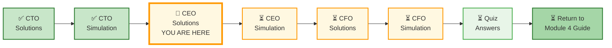
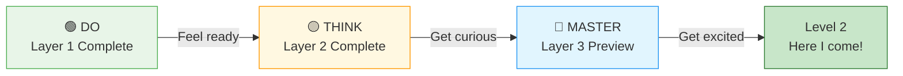
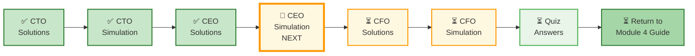

# 🗄️🤖 SQL & GenAI Course
**🎯 Quality Education for Anyone, Anywhere, Anytime — 💫 with Comfort, Convenience at no Cost**

## 📋 2-MODULE4-CEO-REPORT-SOLUTIONS – Banking Planet

This document contains **two different approaches** to the CEO Report. Use them to compare techniques, understand trade-offs, and deepen your mastery.

---

## 🌌 SQLVerse Check-In

<div style="border-left: 4px solid #9c27b0; background-color: #f3e5f5; padding: 15px; margin: 20px 0; border-radius: 0 8px 8px 0;">

**The laws of data enrichment are no longer mysteries to you.** Two paths lead to the same strategic insights – identifying high-value customers and mitigating risk through cross-domain joins.

**The difference between a coder and an Artisan is discipline.**

</div>

---

### 📍 Your Current Stage



---

## 🧭 The Student Journey



---

# 🟢 LAYER 1: DO (Level 1 – Must Complete)

## 🧭 What Changed in This Report

| Before (CTO Report) | Now (CEO Report) |
|---------------------|------------------|
| You designed schemas from reports | You **enrich** existing schemas with new domains |
| License plate was the golden key | License plate **links** banking and transportation |
| Focus on technical architecture | Focus on **strategic insights** |

> *This shift – from architect to strategist – is the next leap in your SQL journey.*

---

## ⚠️ Data Quality Constraint

- **15%** of toll records have **missing or incorrect** license plates
- **5%** of bank customers have **outdated** license plates on file

👉 Your queries must be robust to these gaps. Document how you handle them.

---

## ❌ The Anti-Pattern: What NOT to Do

```sql
-- Storing calculated customer lifetime value
CREATE TABLE customers_with_ltv (
    customer_id INTEGER,
    name TEXT,
    ltv_calculated REAL  -- ❌ DON'T STORE DERIVED VALUES
);
```

**Why this is wrong:**
- Derived values become stale
- No audit trail for how LTV was calculated
- Hard to recalculate when business rules change

> *Learn the anti-pattern first. Then you'll appreciate the solutions.*

---

## Approach 1: The Strategic View (Level 1)

**Philosophy:** Focus on high-value customer identification. Keep queries simple.

> ⚠️ **When This Design Fails**

| Scenario | Why Strategic View Breaks |
|----------|--------------------------|
| **Multiple license plates per customer** | Assumes one-to-one mapping |
| **Missing or incorrect license plate data** | Customers disappear from results |
| **Real-time enrichment needs** | Batch processing only |

*Use this approach for prototyping and small-scale analysis. Production systems need the Enriched View (Level 2).*

### Key Decisions
- One `bank_customers` table + one `toll_logs` view
- Calculate wallet share in a single query
- Prioritize readability over performance

### Sample Schema (Relevant Tables Only)

```sql
-- Banking domain (sample data)
CREATE TABLE bank_customers (
    customer_id INTEGER PRIMARY KEY,
    name TEXT NOT NULL,
    license_plate TEXT,
    segment TEXT,  -- 'Premium', 'Standard'
    credit_score INTEGER,
    delinquency_flag TEXT  -- 'Y' or 'N'
);

-- Credit cards
CREATE TABLE credit_cards (
    card_id INTEGER PRIMARY KEY,
    customer_id INTEGER,
    card_type TEXT,  -- 'Platinum', 'Gold', 'Elite Travel'
    credit_limit REAL,
    current_balance REAL,
    active BOOLEAN DEFAULT 1,
    FOREIGN KEY (customer_id) REFERENCES bank_customers(customer_id)
);

-- ITS domain (from CTO Report – simplified)
CREATE TABLE toll_transactions (
    toll_id INTEGER PRIMARY KEY,
    license_plate TEXT,
    timestamp DATETIME,
    amount REAL
);
```

### Key Queries (Level 1 – Defensive SQL)

**Elite Travel Card Prospects (with NULL handling):**

```sql
SELECT 
    bc.name,
    bc.license_plate,
    bc.segment,
    COALESCE(SUM(tt.amount), 0) AS total_toll_spend
FROM bank_customers bc
LEFT JOIN toll_transactions tt ON bc.license_plate = tt.license_plate
LEFT JOIN credit_cards cc ON bc.customer_id = cc.customer_id 
    AND cc.card_type = 'Elite Travel' 
    AND cc.active = 1
WHERE cc.card_id IS NULL
  AND bc.segment = 'Premium'
GROUP BY bc.customer_id
HAVING COALESCE(SUM(tt.amount), 0) > 5000
ORDER BY total_toll_spend DESC;
```

**Why this works:** 
- `LEFT JOIN` preserves customers with no toll activity
- `COALESCE` handles NULLs gracefully
- `HAVING` filters after aggregation

**What can go wrong:** Assumes license plate is unique per customer.

### 📊 Defend Your Design

Your approach may have missed some high-value customers.

**Question:** If your query missed 20% of actual Elite Travel prospects, what are the possible causes? How would you investigate and fix it?

**Your answer**
```
(Write your answer here)
```


**Delinquent Customers with High Toll Spend:**

```sql
SELECT 
    bc.name,
    COALESCE(SUM(tt.amount), 0) AS toll_spend
FROM bank_customers bc
LEFT JOIN toll_transactions tt ON bc.license_plate = tt.license_plate
WHERE bc.delinquency_flag = 'Y'
GROUP BY bc.customer_id
HAVING COALESCE(SUM(tt.amount), 0) > 3000
ORDER BY toll_spend DESC;
```

---

### 📊 Interpretation – Business Decision Output

Based on the Elite Travel Card Prospects query:

| Question | Your Answer |
|----------|-------------|
| **What action should the CEO take?** | Launch targeted campaign for top 10 customers by toll spend |
| **What is the estimated revenue impact?** | (Calculate based on your data) |
| **What risks should the CEO consider?** | License plate matching errors may miss or mis-target customers |

---

### Trade-Offs

| Strength | Weakness |
|----------|----------|
| Simple, readable queries | Assumes clean, consistent data |
| Fast to implement | Limited handling of data gaps |
| Good for prototyping | Single license plate assumption |

### Best For
- Initial proof-of-concept
- Small to medium customer base
- Teams prioritizing speed over completeness

---

## ✅ How to Evaluate Your Schema

| Criteria | Question | ✅ Good | ❌ Needs Work |
|----------|----------|---------|---------------|
| **Golden Key** | Is license plate used correctly? | Yes, consistent across domains | Missing or inconsistent |
| **Grain Alignment** | Are customer and transaction levels separated? | Yes, aggregated correctly | Mixed levels cause duplicates |
| **NULL Handling** | Are LEFT JOIN and COALESCE used? | Yes | Customers disappear |
| **Business Logic** | Does output answer the strategic question? | Yes, clear insights | Just data, no insight |

> *Real systems rarely have perfect data. Your schema must handle gaps, not ignore them.*

---

# 🟡 LAYER 2: THINK (Level 1.5 – Optional / Guided)

## ⚡ Performance Challenge

Your query runs on **50 million toll transactions per year**.

**Questions:**
1. Without indexes, which part of your query is slowest?
2. What indexes would you add?
3. Would you pre-aggregate toll spend by customer? Why or why not?

**Your answer:**

```
(Write your performance strategy here)
```

---

### ⚖️ Trade-off Conflict

There is no single "correct" design. Every choice has trade-offs.

| Approach | Pros | Cons |
|----------|------|------|
| **Pre-aggregated customer toll spend table** | Fast reads, simple queries | Stale data, extra storage, batch latency |
| **Raw transaction queries (current approach)** | Always fresh, no extra storage | Slow on large datasets, complex queries |
| **Bridge table for multiple plates** | Flexible, handles real-world complexity | More tables, more joins |

**Question:** Which approach would you choose for a production system with 50M transactions/year? Defend your choice.

**(Your answer)**

```
(Write your answer here)
```

---

## 🔴 Mandatory: Multiple License Plates Challenge

A customer may have:
- Personal car (license plate A)
- Family car (license plate B)
- Rental car (license plate C)

**Questions:**
1. Does your current query find all toll spend for this customer? Why or why not?
2. Redesign your schema to handle multiple plates per customer.
3. Write the modified query using your new schema.

**Your answer:**

```
(Your redesigned schema and query)
```

---

### ⚠️ Failure Mode Thinking

Your join logic using LEFT JOIN still silently loses customers because of:
- Missing license plates
- Incorrect license plate mappings

**Question:** How would you detect this data loss in production? What counters or validation queries would you run?

**Your answer**
```
(Write your answer here)
```

---

## 🧭 The Artisan's Data Enrichment Framework

### The Artisan's Mental Model

> **Operational Data** = What the system records (tolls, repairs, fuel)  
> **Enriched Data** = Operational data + Strategic context (banking profiles, customer value)

Your job is to **combine domains** – not just join tables, but **join business perspectives**.

---

### The Cross-Domain Data Pipeline


| Step | In CEO Report Context |
|------|----------------------|
| **INGEST** | Identify source domains (Banking customer data, Toll transactions) |
| **NORMALIZE** | Align grains, handle NULLs, standardize license plate format |
| **ENRICH** | JOIN banking + toll data (LEFT JOIN to preserve all customers) |
| **ACTIVATE** | Generate customer segments (Premium prospects, Delinquent spenders) |
| **ACT** | Recommend CEO action (Launch campaign, Review risk accounts) |

> *The enrichment step is where value is created — joining disparate data, inferring missing fields, scoring entities, and adding external context. The speed at which this loop completes is what separates reactive organizations from predictive ones.*


---

### 6 Steps to Cross-Domain Data Enrichment

| Step | Action | Key Question |
|------|--------|--------------|
| **1** | 🔍 **Identify the Golden Key** | What column links both domains? (License plate) |
| **2** | 📊 **Understand Each Domain's Grain** | Toll data = transaction. Banking data = customer. |
| **3** | 🧩 **Define the Enrichment Goal** | What business question are we answering? |
| **4** | 🔗 **Choose the Right Join Type** | LEFT JOIN to preserve all customers |
| **5** | 🧮 **Aggregate at Correct Level** | Customer-level totals, not transaction-level |
| **6** | ✅ **Validate Against Business Logic** | Does the output make strategic sense? |

---
### 🔴 Decision Point: LEFT JOIN vs INNER JOIN

If you use `INNER JOIN` instead of `LEFT JOIN` in the Elite Travel Card Prospects query:

1. Which customers disappear from the results?
2. Why would a data engineer ever choose `INNER JOIN` in this context?
3. What business risk does `LEFT JOIN` introduce (e.g., customers with no toll activity but high banking value)?

**Write your answers here:**

```
(Your answers)
```

---

### ⚠️ Common Mistakes to Avoid

| Mistake | Why It's Wrong |
|---------|----------------|
| Joining without understanding grain | Transaction × customer = double counting |
| Ignoring NULLs in LEFT JOIN | Customers with no toll activity disappear |
| Storing derived fields | Customer lifetime value should be calculated, not stored |
| Over-joining without clear business goal | Every join must answer a specific question |

---

### 🎯 Your Decision Point

If you were Geetha (CEO), which approach would you deploy and why?

| Scenario | Recommended Approach | Why? |
|----------|---------------------|------|
| **Proof-of-concept for board presentation** | Strategic View | Speed, clarity |
| **Production customer targeting system** | Enriched View (Level 2) | Handles data gaps |

> *There is no universal right answer – only the right answer for your context.*

---

# 🔵 LAYER 3: MASTER (Level 2 Preview – Advanced)

> *This section previews concepts you'll master in **Level 2**. Read it to see what's coming – don't worry if it feels advanced.*

---

## 🔵 Bridge Tables for Customer Matching (Level 2 Preview)

**Problem:** A customer may have multiple license plates (family cars, work vehicles). A license plate may be shared (family members).

**Solution:** Bridge table with confidence scoring.

```sql
-- Customer matching bridge (handles multiple license plates)
CREATE TABLE customer_vehicles (
    customer_id INTEGER,
    license_plate TEXT,
    confidence_score REAL,  -- How sure are we this is a match?
    PRIMARY KEY (customer_id, license_plate),
    FOREIGN KEY (customer_id) REFERENCES bank_customers(customer_id),
    FOREIGN KEY (license_plate) REFERENCES vehicles(license_plate)
);
```

> *Learned in Level 2 – Bridge tables handle many-to-many relationships across domains.*

---

## 🔵 Window Functions for Trend Analysis (Level 2 Preview)

The Level 1 query finds total toll spend per customer. But what if you need **month-over-month change**?

```sql
SELECT 
    bc.name,
    DATE_TRUNC('month', tt.timestamp) AS month,
    SUM(tt.amount) AS monthly_spend,
    LAG(SUM(tt.amount)) OVER (PARTITION BY bc.customer_id ORDER BY month) AS prev_month_spend,
    (SUM(tt.amount) - LAG(SUM(tt.amount)) OVER (...)) AS change
FROM bank_customers bc
JOIN toll_transactions tt ON bc.license_plate = tt.license_plate
GROUP BY bc.customer_id, month;
```

> *Learned in Level 2 – Window functions compare rows without self-joins.*

---

## 🔵 CTEs for Cleaner Queries (Level 2 Preview)

The Level 1 query works. CTEs make it cleaner and more maintainable:

```sql
WITH customer_toll_spend AS (
    SELECT 
        bc.customer_id,
        bc.name,
        COALESCE(SUM(tt.amount), 0) AS total_toll_spend
    FROM bank_customers bc
    LEFT JOIN toll_transactions tt ON bc.license_plate = tt.license_plate
    GROUP BY bc.customer_id
)
SELECT 
    name,
    total_toll_spend
FROM customer_toll_spend
WHERE total_toll_spend > 5000
ORDER BY total_toll_spend DESC;
```

> *Learned in Level 2 – CTEs make complex queries readable and reusable.*

---

## 🤖 AI Walkthrough (ACCELERATE Phase Preview)

In the ACCELERATE phase, you'll learn to use AI as a **Socratic partner** – not a code generator.

**Good Prompt (Socratic – Conceptual Guidance):**

> *"I have banking customer data and toll transaction data linked by license plate. I want to find Premium customers who don't have our Elite Travel card but have high toll spend. However, 15% of toll records have missing plates, and customers may have multiple vehicles. What join and aggregation strategy should I consider? Don't write code – explain the relationships and edge cases."*

**What AI Should Do (Not Generate Code):**

- Ask: "How do you handle missing plate data?"
- Ask: "What about customers with multiple vehicles?"
- Suggest: "Consider a bridge table for customer-vehicle mapping."

**What You Should NOT Ask AI:**

❌ *"Write me a query to find Elite Travel card prospects."*

> *Learned in ACCELERATE – AI is your Consultant, not your Ghostwriter.*

---

## 💎 DESIGNER'S PERIGON

### *The Art of Data Enrichment*

In the CTO Report, you learned **Reverse Engineering** – building schemas from messy reports. Here, you learned **Data Enrichment** – combining domains to create strategic value.

You took operational data (toll transactions) and enriched it with customer context (banking profiles). You identified high-value customers, flagged risks, and created targeting campaigns.

> *“A single table is a fact. Two joined tables are a story. Three joined tables are a strategy.”*

---

### *The Power of Cross-Pollination*

By cross-pollinating Tollgate and Banking planets, you created insights neither domain could provide alone:

- **Ghost Travelers** – Wealthy customers not using bank cards on highways
- **Risk Signals** – Delinquent customers still spending on tolls
- **Elite Prospects** – Premium customers ready for a new card

**Data enrichment isn't just joining tables – it's joining business perspectives.**

> *“Revenue is vanity. Profit is sanity. Insight is power.”*

---

### Why Data Enrichment Matters Across Domains

The core problem it solves: **a single data source almost never tells you enough.**

- **Healthcare:** A patient's vitals are just numbers. Enriched with medical history and lab results, they trigger a sepsis alert before deterioration.
- **Finance:** A card swipe in Lagos at 2 AM looks unremarkable. Enriched with geolocation and behavioral baseline, it becomes a fraud signal caught in milliseconds.
- **E-commerce:** A user browsing hiking boots is just a session ID. Enriched with past purchases and weather data, it becomes a sale.
- **Logistics:** A truck's GPS ping is just a coordinate. Enriched with traffic and weather radar, it becomes a rerouting decision that saves hours.
- **Cybersecurity:** A login from an unfamiliar IP is just a log entry. Enriched with threat intelligence, it becomes a confirmed intrusion attempt.

> *The difference between raw and enriched is often the difference between reaction and prediction – between a fire drill and a fire escape.*

---

### 🌍 Real‑World Application

| Skill | How You Used It |
|-------|-----------------|
| **Cross-domain joining** | Linked banking customer data with toll transactions |
| **Customer profiling** | Identified Premium segment with high toll spend |
| **Risk identification** | Found delinquent customers with ongoing spend |
| **Strategic recommendation** | Turned data into a targeting campaign |

#### The Artisan's Advantage

When an interviewer asks, *"How do you create value from data?"* – **you** will say:

> *"I enrich operational data with customer context. For example, I joined toll transactions with banking profiles to find 'Ghost Travelers' – wealthy customers not using their bank cards on highways – and created a targeted credit card campaign. I also handled edge cases like missing license plates (15% of records) and multiple vehicles per customer using a bridge table design."*

**That answer gets you hired.**

---

**The SQLVerse expands. Go build and conquer the world.** 🚀

---

## 🧭 EVALUATE Navigation



| Previous Step | Next Step |
|:---:|:---:|
| [← Back to CTO Interview Simulation](../simulations/1-CTO-INTERVIEW-SIMULATION.md) | [Continue to CEO Interview Simulation →](../simulations/2-CEO-INTERVIEW-SIMULATION.md) |

---

*Part of our mission for 🎯 Quality Education for Anyone, Anywhere, Anytime — 💫 with Comfort, Convenience at no Cost.*

**Level 1 | Module 4 | CEO Report Solutions | Next: [CEO Interview Simulation](../simulations/2-CEO-INTERVIEW-SIMULATION.md)**