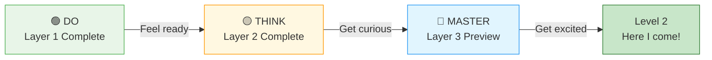

# 🗄️🤖 SQL & GenAI Course
**🎯 Quality Education for Anyone, Anywhere, Anytime — 💫 with Comfort, Convenience at no Cost**

---

## 📋 3-MODULE4-CFO-REPORT-SOLUTIONS – Library & Tourism Planet

This document contains **two different approaches** to the CFO Report. Use them to compare techniques, understand trade-offs, and deepen your mastery.

---

## 🌌 SQLVerse Check-In

<div style="border-left: 4px solid #9c27b0; background-color: #f3e5f5; padding: 15px; margin: 20px 0; border-radius: 0 8px 8px 0;">

**The laws of financial auditing are no longer mysteries to you.** Two paths lead to the same destination – a profitable, auditable, and future-proof investment decision.

**The difference between a coder and an Artisan is discipline.**

> *"This document will guide you. The simulations will test you. Do not expect help there."*

</div>

---

### 📍 Your Current Stage

```mermaid
flowchart LR
    A["✅ Exercise<br/>Solutions Complete"] --> B["✅ CTO<br/>Solutions"]
    B --> C["✅ CTO<br/>Simulation"]
    C --> D["✅ CEO<br/>Solutions"]
    D --> E["✅ CEO<br/>Simulation"]
    E --> F["📍 CFO<br/>Solutions<br/>YOU ARE HERE"]
    F --> G["⏳ CFO<br/>Simulation"]
    G --> H["⏳ Quiz<br/>Answers"]
    H --> I["⏳ Return to<br/>Module 4 Guide"]
    
    style A fill:#e1f5fe,stroke:#4caf50,stroke-width:2px
    style B fill:#c8e6c9,stroke:#2e7d32,stroke-width:2px
    style C fill:#c8e6c9,stroke:#2e7d32,stroke-width:2px
    style D fill:#c8e6c9,stroke:#2e7d32,stroke-width:2px
    style E fill:#c8e6c9,stroke:#2e7d32,stroke-width:2px
    style F fill:#fff8e1,stroke:#ff9800,stroke-width:4px
    style G fill:#fff8e1,stroke:#ff9800,stroke-width:2px
    style H fill:#e8f5e8,stroke:#4caf50,stroke-width:2px
    style I fill:#a5d6a7,stroke:#2e7d32,stroke-width:2px
```



---

## 🧭 The Student Journey



---

# 🟢 LAYER 1: DO (Level 1 – Must Complete)

## 🧭 What Changed in This Report

| Before (CEO Report) | Now (CFO Report) |
|---------------------|------------------|
| You enriched data with banking context | You **audit** financial health of a startup |
| Focus on customer acquisition | Focus on **profitability, margins, ROI** |
| Strategic recommendations | **Investment decision** (Buy / Don't Buy / Renegotiate) |

> *This shift – from strategist to financial auditor – is the final leap in your SQL journey.*

---

## ❌ The Anti-Pattern: What NOT to Do

```sql
-- Storing calculated net profit per tour
CREATE TABLE tours_with_profit (
    tour_id INTEGER,
    tour_name TEXT,
    net_profit REAL  -- ❌ DON'T STORE CALCULATED PROFIT
);
```

**Why this is wrong:**
- Profit changes with supplier costs and exchange rates
- No audit trail for how profit was calculated
- Hard to recalculate when business rules change

> *Learn the anti-pattern first. Then you'll appreciate the solutions.*

---

## Approach 1: The Direct Profit View (Level 1)

**Philosophy:** Calculate profit directly from revenue and costs. Keep queries simple. No pre-aggregation.

> ⚠️ **When This Design Fails**

| Scenario | Why Direct View Breaks |
|----------|------------------------|
| **Multi-currency tour legs** | Assumes all costs in same currency |
| **High volume (1M+ transactions)** | Performance degrades |
| **Frequent recalculations needed** | Recalculates from scratch every time |

*Use this approach for small datasets and ad-hoc analysis. Production systems need the Pre-aggregated View (Level 2).*

### Key Decisions
- Calculate net profit per tour on the fly using `JOIN` + `GROUP BY`
- No pre-aggregated profit tables
- Prioritize simplicity over performance

### Sample Schema (Relevant Tables Only)

```sql
-- Tours master table
CREATE TABLE tours (
    tour_id INTEGER PRIMARY KEY,
    tour_name TEXT NOT NULL,
    destination TEXT,
    duration_days INTEGER,
    base_price REAL
);

-- Tour legs (costs – flights, hotels, activities)
CREATE TABLE tour_legs (
    leg_id INTEGER PRIMARY KEY,
    tour_id INTEGER,
    leg_type TEXT,  -- 'Flight', 'Hotel', 'Activity'
    supplier_name TEXT,
    cost REAL,
    FOREIGN KEY (tour_id) REFERENCES tours(tour_id)
);

-- Bookings (revenue)
CREATE TABLE bookings (
    booking_id INTEGER PRIMARY KEY,
    tour_id INTEGER,
    customer_name TEXT,
    booking_date DATE,
    total_paid REAL,
    FOREIGN KEY (tour_id) REFERENCES tours(tour_id)
);
```

### Key Queries (Level 1 – Direct Calculation)

**Gross Profit per Tour:**

```sql
SELECT 
    t.tour_name,
    COALESCE(SUM(b.total_paid), 0) AS total_revenue,
    COALESCE(SUM(tl.cost), 0) AS total_costs,
    COALESCE(SUM(b.total_paid), 0) - COALESCE(SUM(tl.cost), 0) AS gross_profit
FROM tours t
LEFT JOIN bookings b ON t.tour_id = b.tour_id
LEFT JOIN tour_legs tl ON t.tour_id = tl.tour_id
GROUP BY t.tour_id
ORDER BY gross_profit DESC;
```

**Why this works:** Calculates profit on the fly. `LEFT JOIN` preserves tours with no bookings or legs.

**What can go wrong:** Joining bookings to legs creates multiplication effect (booking × legs). Use `COALESCE` to handle NULLs.

**Net Profit per Tour with Platform Fee (5%) and CFO Tax (2%):**

```sql
SELECT 
    t.tour_name,
    COALESCE(SUM(b.total_paid), 0) AS revenue,
    COALESCE(SUM(tl.cost), 0) AS costs,
    (COALESCE(SUM(b.total_paid), 0) - COALESCE(SUM(tl.cost), 0)) AS gross_profit,
    (COALESCE(SUM(b.total_paid), 0) * 0.05) AS platform_fee,
    ((COALESCE(SUM(b.total_paid), 0) - COALESCE(SUM(tl.cost), 0)) * 0.02) AS cfo_tax,
    (COALESCE(SUM(b.total_paid), 0) - COALESCE(SUM(tl.cost), 0) 
        - (COALESCE(SUM(b.total_paid), 0) * 0.05) 
        - ((COALESCE(SUM(b.total_paid), 0) - COALESCE(SUM(tl.cost), 0)) * 0.02)) AS net_profit
FROM tours t
LEFT JOIN bookings b ON t.tour_id = b.tour_id
LEFT JOIN tour_legs tl ON t.tour_id = tl.tour_id
GROUP BY t.tour_id
ORDER BY net_profit DESC;
```

**Why this works:** Adds standard deductions after gross profit calculation.

**What can go wrong:** Multiplication effect from multiple legs × multiple bookings.

---

### Trade-Offs

| Strength | Weakness |
|----------|----------|
| Simple, no pre-aggregation | Multiplication effect from JOINs |
| Always fresh data | Slow on large datasets |
| Easy to audit (raw data accessible) | Complex queries for non-technical users |

### Best For
- Small datasets (<10k rows)
- Ad-hoc analysis
- Single-currency tours

---

## Comparison Table (Level 1 Only)

| Criteria | Approach 1 (Direct View) |
|----------|--------------------------|
| **Schema Complexity** | Low (3 tables) |
| **Query Complexity** | Medium (multiple GROUP BY) |
| **Profit Calculation** | On-the-fly |
| **Performance** | Degrades with volume |
| **Best For** | Small scale, ad-hoc analysis |

---

## ✅ How to Evaluate Your Schema

| Criteria | Question | ✅ Good | ❌ Needs Work |
|----------|----------|---------|---------------|
| **Revenue-Cost Separation** | Are revenue and costs in separate tables? | Yes | Mixed in one table |
| **NULL Handling** | Are COALESCE or IFNULL used? | Yes | Tours disappear with no bookings |
| **Multiplication Effect** | Are you aware of row multiplication? | Yes | Double-counting revenue |
| **Auditability** | Can you trace profit to source data? | Yes | Calculated values stored |

> *Real financial systems require auditability. Every calculated number must be traceable to raw transactions.*

---

# 🟡 LAYER 2: THINK (Level 1.5 – Optional / Guided)

## 🧭 The Artisan's Financial Audit Framework

### The Artisan's Mental Model

> **Revenue** = What customers pay  
> **Costs** = What suppliers charge  
> **Gross Profit** = Revenue – Costs  
> **Net Profit** = Gross Profit – Fees – Taxes

Your job is to **calculate correctly, audit completely, and recommend confidently**.

---

### 6 Steps to Financial Audit

| Step | Action | Key Question |
|------|--------|--------------|
| **1** | 🔍 **Identify Revenue Streams** | What are we selling? (Tours) |
| **2** | 📊 **Identify Cost Streams** | What do we pay? (Flights, hotels, activities) |
| **3** | 🧩 **Define Profit Formula** | Revenue – Costs – Platform Fee – CFO Tax |
| **4** | 🔗 **Choose the Right Join Type** | LEFT JOIN to preserve tours with no bookings |
| **5** | 🧮 **Aggregate at Correct Level** | Tour-level totals, not leg-level |
| **6** | ✅ **Validate Against Business Rule** | Does net profit > 15% for investment? |

---

## ⚡ Performance Challenge

Your query runs on **1 million bookings and 500,000 tour legs per year**.

**Questions:**
1. Without indexes, which part of your query is slowest?
2. What indexes would you add?
3. Would you pre-aggregate profit by tour? Why or why not?

**Your answer:**

```
(Your performance strategy)
```

---

## ⚖️ Trade-off Conflict

| Approach | Pros | Cons |
|----------|------|------|
| **Direct calculation (current)** | Always fresh, no extra storage | Slow on large datasets |
| **Pre-aggregated profit table** | Fast reads, simple queries | Stale data, extra storage |
| **Materialized view** | Fresh at refresh time | Refresh latency, storage |

**Question:** Which approach would you choose for a production system with 1M annual bookings? Defend your choice.

**Your answer:**

```
(Your trade-off justification)
```

---

## 🔴 Mandatory: Multi-Currency Challenge

Tour legs may be in USD, EUR, INR. Bookings are in INR.

**Questions:**
1. How would you handle currency conversion without storing exchange rate history?
2. What would you add to your schema to support multi-currency?
3. If exchange rates change, should past profit recalculated? Why or why not?

**Your answer:**

```
(Your multi-currency strategy)
```

---

## 🧠 Investment Decision Framework

Raj's rule: **Invest if net profit margin > 15% for at least 3 tours.**

**Questions:**
1. What is the net profit margin for each tour in your calculation?
2. Which tours meet the 15% threshold?
3. Would you recommend Raj buy the startup? Why or why not?

**Your answer:**

```
(Your investment recommendation)
```

---

# 🔵 LAYER 3: MASTER (Level 2 Preview – Advanced)

> *This section previews concepts you'll master in **Level 2**. Read it to see what's coming – don't worry if it feels advanced.*

---

## 🔵 Window Functions for Margin Trends (Level 2 Preview)

The Level 1 query shows current profit. What if you need **quarter-over-quarter margin change**?

```sql
WITH quarterly_profit AS (
    SELECT 
        t.tour_name,
        DATE_TRUNC('quarter', b.booking_date) AS quarter,
        SUM(b.total_paid) - SUM(tl.cost) AS gross_profit
    FROM tours t
    JOIN bookings b ON t.tour_id = b.tour_id
    JOIN tour_legs tl ON t.tour_id = tl.tour_id
    GROUP BY t.tour_id, quarter
)
SELECT 
    tour_name,
    quarter,
    gross_profit,
    LAG(gross_profit) OVER (PARTITION BY tour_name ORDER BY quarter) AS prev_quarter_profit,
    (gross_profit - LAG(gross_profit) OVER (...)) / LAG(gross_profit) OVER (...) * 100 AS pct_change
FROM quarterly_profit;
```

> *Learned in Level 2 – Window functions compare time periods without self-joins.*

---

## 🔵 CTEs for Cleaner Audit (Level 2 Preview)

The Level 1 query works. CTEs make it auditable and maintainable:

```sql
WITH revenue AS (
    SELECT tour_id, SUM(total_paid) AS total_revenue
    FROM bookings
    GROUP BY tour_id
),
costs AS (
    SELECT tour_id, SUM(cost) AS total_costs
    FROM tour_legs
    GROUP BY tour_id
),
profit AS (
    SELECT 
        t.tour_id,
        t.tour_name,
        COALESCE(r.total_revenue, 0) AS revenue,
        COALESCE(c.total_costs, 0) AS costs,
        COALESCE(r.total_revenue, 0) - COALESCE(c.total_costs, 0) AS gross_profit
    FROM tours t
    LEFT JOIN revenue r ON t.tour_id = r.tour_id
    LEFT JOIN costs c ON t.tour_id = c.tour_id
)
SELECT 
    tour_name,
    revenue,
    costs,
    gross_profit,
    gross_profit * 0.05 AS platform_fee,
    gross_profit * 0.02 AS cfo_tax,
    gross_profit - (gross_profit * 0.05) - (gross_profit * 0.02) AS net_profit
FROM profit
WHERE gross_profit > 0;
```

> *Learned in Level 2 – CTEs make complex queries readable and auditable.*

---

## 🤖 AI Walkthrough (ACCELERATE Phase Preview)

In the ACCELERATE phase, you'll learn to use AI as a **Socratic partner** – not a code generator.

**Good Prompt (Socratic – Conceptual Guidance):**

> *"I have a tours database with bookings (revenue) and tour legs (costs). I need to calculate net profit margin for each tour, apply a 5% platform fee and 2% CFO tax, and recommend investment if margin > 15%. What join and aggregation strategy should I use? Don't write code – explain the relationships and potential pitfalls like the multiplication effect."*

**What AI Should Do (Not Generate Code):**

- Ask: "What happens if a tour has multiple legs and multiple bookings?"
- Ask: "How do you handle tours with no bookings or no legs?"
- Suggest: "Use LEFT JOIN to preserve all tours, then COALESCE for NULLs."

**What You Should NOT Ask AI:**

❌ *"Write me a query to calculate net profit for each tour."*

> *Learned in ACCELERATE – AI is your Consultant, not your Ghostwriter.*

---

## 💎 DESIGNER'S PERIGON

### *The Art of Financial Auditing*

In the CTO Report, you learned **Reverse Engineering**. In the CEO Report, you learned **Data Enrichment**. Here, you learned **Financial Auditing** – the skill of calculating profit, identifying risk, and making investment decisions.

You took raw revenue and costs, applied fees and taxes, and produced a clear recommendation: **Buy, Don't Buy, or Renegotiate**.

> *“Revenue is vanity. Profit is sanity. Cash flow is reality.”*

---

### *The CFO's Clairvoyance*

You have moved from **Reverse Engineering** (Arjun) to **Strategic Enrichment** (Geetha) and finally to **Financial Auditing** (Raj).

In this phase, you applied the **Cost-Benefit Principle**. You learned that a database isn't just a place to store data; it's a tool to calculate **EBITDA** (Earnings Before Interest, Taxes, Depreciation, and Amortization).

> *“A programmer sees a NULL. A CFO sees a missing invoice. An Artisan sees a risk to be mitigated.”*

---

### 🏛️ Financial Auditing and Database Design

Financial auditing and database design are tightly intertwined because the structure of your database either **enables or breaks auditability**.

For an external auditor, these must be true:

- All transactions are recorded, never lost.
- Every change is traceable: who did it, when, and why.
- Balances should reconcile to source‑level data (no "magic" numbers in dashboards).
- No silent overwrites: if you change a transaction, the old value is still visible.

If any of these fail, the auditor will flag the system as non‑compliant and may require a full manual reconciliation.

In short:

- **If you design the database with audit requirements first** → the auditor can trust the system.
- **If you design for "just making the app work"** → the auditor has to distrust the data and rebuild history manually.

This is why modern financial systems (bank ledgers, payment rails, stock‑trading platforms) treat the **audit trail as the core data model**, not an optional log table.


---

### 🌍 Real‑World Application

| Skill | How You Used It |
|-------|-----------------|
| **Financial calculation** | Calculated gross profit, net profit, margin |
| **Fee application** | Applied platform fee (5%) and CFO tax (2%) |
| **Investment decision** | Applied 15% margin rule to recommend buy |
| **Audit readiness** | Traced all calculations to source data |

#### The Artisan's Advantage

When an interviewer asks, *"How do you evaluate a company for investment?"* – **you** will say:

> *"I analyze revenue and costs, apply standard deductions (platform fees, risk taxes), calculate net profit margin, and compare against a threshold. I also consider multi-currency complexity and performance at scale. The final output is a clear recommendation: Buy, Don't Buy, or Renegotiate."*

**That answer gets you hired.**

---

**The SQLVerse expands. Go build and conquer the world.** 🚀

---

## 🧭 EVALUATE Navigation

```mermaid
flowchart LR
    A["✅ Exercise<br/>Solutions Complete"] --> B["✅ CTO<br/>Solutions"]
    B --> C["✅ CTO<br/>Simulation"]
    C --> D["✅ CEO<br/>Solutions"]
    D --> E["✅ CEO<br/>Simulation"]
    E --> F["✅ CFO<br/>Solutions"]
    F --> G["📍 CFO<br/>Simulation<br/>NEXT"]
    G --> H["⏳ Quiz<br/>Answers"]
    H --> I["⏳ Return to<br/>Module 4 Guide"]
    
    style A fill:#e1f5fe,stroke:#4caf50,stroke-width:2px
    style B fill:#c8e6c9,stroke:#2e7d32,stroke-width:2px
    style C fill:#c8e6c9,stroke:#2e7d32,stroke-width:2px
    style D fill:#c8e6c9,stroke:#2e7d32,stroke-width:2px
    style E fill:#c8e6c9,stroke:#2e7d32,stroke-width:2px
    style F fill:#c8e6c9,stroke:#2e7d32,stroke-width:2px
    style G fill:#fff8e1,stroke:#ff9800,stroke-width:4px
    style H fill:#e8f5e8,stroke:#4caf50,stroke-width:2px
    style I fill:#a5d6a7,stroke:#2e7d32,stroke-width:2px
```



| Previous Step | Next Step |
|:---:|:---:|
| [← Back to CEO Interview Simulation](../simulations/2-CEO-INTERVIEW-SIMULATION.md) | [Continue to CFO Interview Simulation →](../simulations/3-CFO-INTERVIEW-SIMULATION.md) |

---

*Part of our mission for 🎯 Quality Education for Anyone, Anywhere, Anytime — 💫 with Comfort, Convenience at no Cost.*

**Level 1 | Module 4 | CFO Report Solutions | Next: [CFO Interview Simulation](../simulations/3-CFO-INTERVIEW-SIMULATION.md)**