# 🗄️🤖 SQL & GenAI Course
**🎯 Quality Education for Anyone, Anywhere, Anytime — 💫 with Comfort, Convenience at no Cost**

---

## 🧭 Capstone Solutions & Interview Simulations – Navigation Hub

Welcome to the **Capstone Solutions Hub**.

**You are in the Capstone Solutions Hub.** Your path:

CTO Solutions → CTO Simulation → CEO Solutions → CEO Simulation → CFO Solutions → CFO Simulation → Quiz Answers

---

### 📍 Your Current Stage

---

## 📋 Solutions (Two Approaches Each)

| Report | What You'll Learn | The Two Approaches |
|--------|-------------------|---------------------|
| **CTO Report** | Reverse Engineering – Schema design from reports | **Minimalist:** Unified transactions table (5 tables total) – simpler queries, less auditability. **Enterprise:** Domain-separated tables (8 tables total) – complex queries, full auditability. |
| **CEO Report** | Data Enrichment – Cross-domain joins | **Strategic:** Focus on high-value customer identification and cross-sell opportunities. **Tactical:** Granular analysis of revenue leaks and operational inefficiencies. |
| **CFO Report** | Financial Auditing – ROI and margin analysis | **Direct:** Simple profit calculations per tour (quick, less detail). **Cascading:** Multi-layered margin analysis with platform fees, CFO tax, and synergy projections. |

---

## 🎯 Interview Simulations (Test Yourself)

| Simulation | File | Skills Tested |
|------------|------|---------------|
| **CTO Interview** | simulations/CTO-INTERVIEW-SIMULATION.md | Schema design, trade-offs, edge cases |
| **CEO Interview** | simulations/CEO-INTERVIEW-SIMULATION.md | Strategic thinking, cross-domain joins |
| **CFO Interview** | simulations/CFO-INTERVIEW-SIMULATION.md | Financial modeling, investment decisions |

> *Complete the simulation before moving to the next report solution.*

---

## 📝 How to Use This Hub

1. **Start here** after completing `5-mixed-joins-practice-solutions.md`
2. **Read CTO Solutions** – Understand the two approaches
3. **Take CTO Interview Simulation** – Test yourself before moving on
4. **Repeat for CEO and CFO** – Solutions → Simulation → Next
5. **Take the Module 4 Quiz** – Final assessment
6. **Return to Module 4 Guide** – Reflect and celebrate

---

## 🧭 EVALUATE CAPSTONE Navigation

```mermaid
flowchart LR
    A["✅ Exercise<br/>Solutions Complete"] --> B["📍 CTO<br/>Solutions<br/>NEXT"]
    B --> C["⏳ CTO<br/>Simulation"]
    C --> D["⏳ CEO<br/>Solutions"]
    D --> E["⏳ CEO<br/>Simulation"]
    E --> F["⏳ CFO<br/>Solutions"]
    F --> G["⏳ CFO<br/>Simulation"]
    G --> H["⏳ Quiz<br/>Answers"]
    H --> I["⏳ Return to<br/>Module 4 Guide"]
    
    style A fill:#e1f5fe,stroke:#4caf50,stroke-width:2px
    style B fill:#fff8e1,stroke:#ff9800,stroke-width:4px
    style C fill:#fff8e1,stroke:#ff9800,stroke-width:2px
    style D fill:#fff8e1,stroke:#ff9800,stroke-width:2px
    style E fill:#fff8e1,stroke:#ff9800,stroke-width:2px
    style F fill:#fff8e1,stroke:#ff9800,stroke-width:2px
    style G fill:#fff8e1,stroke:#ff9800,stroke-width:2px
    style H fill:#e8f5e8,stroke:#4caf50,stroke-width:2px
    style I fill:#a5d6a7,stroke:#2e7d32,stroke-width:2px
```

| Previous Step | Next Step |
|:---:|:---:|
| [← Back to Exercise 5 Solutions](../5-mixed-joins-practice-solutions.md) | [Continue to CTO Report Solutions →](./1-MODULE4-CTO-REPORT-SOLUTIONS.md) |

---

*Part of our mission for 🎯 Quality Education for Anyone, Anywhere, Anytime — 💫 with Comfort, Convenience at no Cost.*

**Level 1 | Module 4 | Capstone Solutions Hub**
 