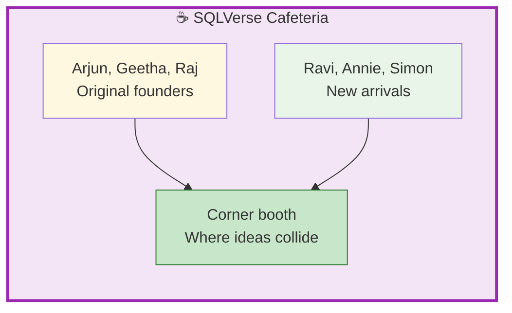
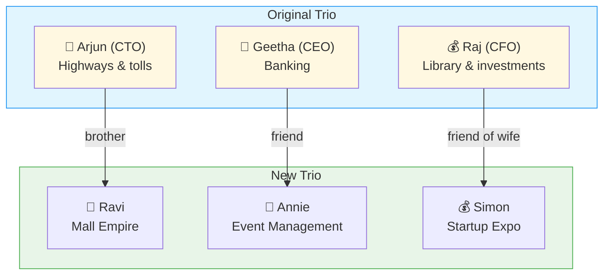

# 🗄️🤖 SQL & GenAI Course
**🎯 Quality Education for Anyone, Anywhere, Anytime — 💫 with Comfort, Convenience at no Cost**

## ☕ 1-CAPSTONE-STORY: The SQLVerse Expansion

The SQLVerse Cafeteria’s corner booth has seen many meetings. Arjun, Geetha, and Raj built an empire from their laptops. But the SQLVerse doesn’t stay small for long. New planets emerge. New problems arrive. And new friends step into the booth.

This is the story of **three new protagonists** – connected to the original trio, each bringing their own domain, their own chaos, and their own hunger for data-driven solutions.

---

## 🌌 Setting the Scene: The SQLVerse Cafeteria (Extended)

The original trio – Arjun (CTO), Geetha (CEO), Raj (CFO) – turned the SQLVerse into a thriving ecosystem. But every ecosystem needs fresh energy. Enter **Ravi, Annie, and Simon** – three executives who show up at the Cafeteria one rainy evening, each with a laptop, a problem, and a request for the Artisan.

> *“We heard you fix data. We need help. And we’re not leaving until you say yes.”*

---

## 👥 The New Protagonists

### 🔧 Ravi – The Mall Empire (CTO Simulation)

| Aspect | Detail |
|--------|--------|
| **Role** | Owner of Brew Haven, Slice Squad, Daily Mart (3 businesses in a mall) |
| **Domain** | Quick commerce – coffee, pizza, grocery, dark stores, on‑demand delivery |
| **Personality** | Practical, resourceful, loves logistics |
| **Connection** | Arjun’s brother – called in a family favor |
| **Current Challenge** | Siloed POS systems, no unified customer view, wants to cross‑sell and retain customers |
| **Secret Superpower** | Turns a pizza shop into a dark store in 48 hours |

**Ravi’s Voice:** *“My brother Arjun fixed highways. I need you to fix my mall. Same license plate? No. Same phone number? Maybe. Let’s figure it out.”*

---

### 👔 Annie – The Event Management CEO (CEO Simulation)

| Aspect | Detail |
|--------|--------|
| **Role** | CEO of “Celebrate India” – event management company |
| **Domain** | Weddings, corporate events, conferences, logistics |
| **Personality** | Ambitious, people‑focused, growth‑hungry |
| **Connection** | Friend of Geetha (banking CEO) – met at a leadership summit |
| **Current Challenge** | Profit margins shrinking, needs to identify financial leaks, wants to expand via partnerships |
| **Secret Superpower** | Negotiates hotel contracts like a master chess player |

**Annie’s Voice:** *“Margins are bleeding. I have data from hotels, vendors, even a bakery chain. But nothing connects. Geetha said you can make sense of it all.”*

---

### 💰 Simon – The Startup Hub CFO (CFO Simulation)

| Aspect | Detail |
|--------|--------|
| **Role** | CFO of a consultancy firm |
| **Domain** | Startup expos, investor matching, event finance |
| **Personality** | Analytical, detail‑obsessed, risk‑aware |
| **Connection** | Close friend of Raj’s wife – recommended by the CFO himself |
| **Current Challenge** | Organising an expo with 200 investors + 400 startups, data trapped in emails, needs profitability analysis |
| **Secret Superpower** | Spots a dollar‑saving opportunity in a messy spreadsheet before anyone else |

**Simon’s Voice:** *“Raj said you’re the Artisan. I have emails – hundreds of them. Investors, startups, flight bookings, dark stores, delivery SLAs. I need to know: was this expo profitable? Should I run it again?”*

---

## 🔗 The Web of Connections

Each new protagonist faces a **different type of data mess**:

| Character | Core Problem | Key Data Challenge |
|-----------|--------------|---------------------|
| **Ravi** | Three businesses, no unified view | Linking customers without a common key (phone number optional) |
| **Annie** | Shrinking margins, multiple vendors | Joining event costs with hotel and bakery data |
| **Simon** | 600+ unstructured emails, real‑time orders | Entity resolution, cost tracking, SLA monitoring |

---

## ☕ The Meeting That Changed Everything

One evening, the three of them found themselves at the SQLVerse Cafeteria. Ravi had just finished a disastrous quarterly review. Annie had printed out six months of invoices, hoping to find the leak. Simon had a USB drive full of parsed emails – raw, unorganised, but full of potential.

They didn’t know each other well, but they all knew the same person: **the SQLVerse Artisan**.

Ravi pulled out his phone. *“Arjun, I need that person you used for the toll data.”*  
Annie typed a message to Geetha. *“Remember the banking analyst who found those ghost travelers? Send them my way.”*  
Simon simply smiled. *“Raj already said you’re the best. No pressure.”*

The Artisan walked in, ordered a latte, and sat down.

> *“Three problems. Three databases. One solution. Let’s begin.”*

---

## 🧭 The Road Ahead

The tasks waiting for the Artisan:

| Report | Character | Domain | Key Output |
|--------|-----------|--------|-------------|
| **CTO Simulation** | Ravi | Mall quick commerce | Normalized schema + cross‑selling queries |
| **CEO Simulation** | Annie | Event management | Margin analysis + campaign recommendations |
| **CFO Simulation** | Simon | Startup hub expo | Profitability model + repeat/stop decision |

Each simulation is **standalone** – but together, they form a complete data‑driven transformation for three businesses.

---

## 💎 The Closing Quote

> *“The SQLVerse was never just about one highway or one bank. It’s about every place where data is messy and the people who need it cleaned. Ravi, Annie, Simon – they’re not characters. They’re your next clients.”*

**The SQLVerse expands. Go build and conquer the world.** 🚀

---

*Part of our mission for 🎯 Quality Education for Anyone, Anywhere, Anytime — 💫 with Comfort, Convenience at no Cost.*

**Level 1 | Module 4 | Capstone Story – New Protagonists | Next: [CTO Simulation](./simulations/1-CTO-INTERVIEW-SIMULATION.md)**