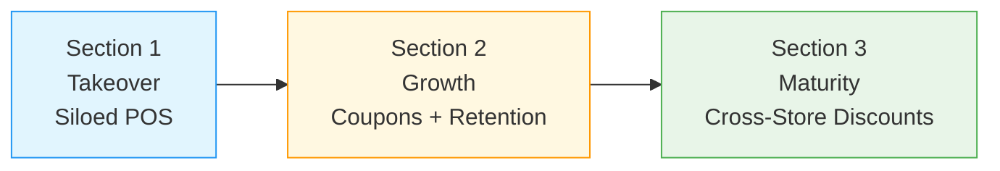

# 🗄️🤖 SQL & GenAI Course
**🎯 Quality Education for Anyone, Anywhere, Anytime — 💫 with Comfort, Convenience at no Cost**

---

## 🎯 CTO INTERVIEW SIMULATION – Mall Empire

**Role:** Senior Data Engineer (Interview Round)  
**Estimated Time:** 90–120 minutes

This simulation has **three sections**. No schema hints. No query scaffolds. You decide the design, defend your trade-offs, and handle real-world edge cases.

**The difference between a coder and an Artisan is discipline.**

---

## 🌌 SQLVerse Check-In

<div style="border-left: 4px solid #9c27b0; background-color: #f3e5f5; padding: 15px; margin: 20px 0; border-radius: 0 8px 8px 0;">

**You are in the interview room. Ravi's mall empire is counting on you.**

Three sections. Three challenges. One story.

**The difference between a coder and an Artisan is discipline.**

</div>

---

## 📂 Template for Simulation Vault Instructions

### 📂 Before You Begin

**First, create your answer file in your Vault.**

Create the following folder in your **Vault (Tab 4)** :

```
Projects/Level-1-beginner/Module4/CTO-INTERVIEW-SIMULATION/
```
Save a file named `cto_simulation_answers.md`  in the folder. You will write all your answers in the file.


---

### 📍 Your Current Stage

```mermaid
flowchart LR
    A["✅ Exercise<br/>Solutions Complete"] --> B["✅ CTO<br/>Solutions"]
    B --> C["📍 CTO<br/>Simulation<br/>YOU ARE HERE"]
    C --> D["⏳ CEO<br/>Solutions"]
    D --> E["⏳ CEO<br/>Simulation"]
    E --> F["⏳ CFO<br/>Solutions"]
    F --> G["⏳ CFO<br/>Simulation"]
    G --> H["⏳ Quiz<br/>Answers"]
    H --> I["⏳ Return to<br/>Module 4 Guide"]
    
    style A fill:#e1f5fe,stroke:#4caf50,stroke-width:2px
    style B fill:#c8e6c9,stroke:#2e7d32,stroke-width:2px
    style C fill:#fff8e1,stroke:#ff9800,stroke-width:4px
    style D fill:#fff8e1,stroke:#ff9800,stroke-width:2px
    style E fill:#fff8e1,stroke:#ff9800,stroke-width:2px
    style F fill:#fff8e1,stroke:#ff9800,stroke-width:2px
    style G fill:#fff8e1,stroke:#ff9800,stroke-width:2px
    style H fill:#e8f5e8,stroke:#4caf50,stroke-width:2px
    style I fill:#a5d6a7,stroke:#2e7d32,stroke-width:2px
```



---

## 🎬 The Mall Empire – Complete Narrative Arc



---

## ☕ The Story

Arjun's brother, **Ravi**, has taken over three businesses in the same mall:

- **Brew Haven** – A coffee shop (lattes, espressos, pastries)
- **Slice Squad** – A pizza shop (dine-in and takeout)
- **Daily Mart** – A specialty food store (essentials, snacks, beverages – accepts online orders from customers who reside within 5km)

Each business has its own POS system. They don't talk to each other.

Ravi calls Arjun: *"I know you're the tech genius. My customers buy coffee, then grab pizza, then pick up groceries. I need to see the full picture."*

Arjun sighs. *"Ravi, I'm busy. But I know someone..."*

He looks at you.

**This is where you come in.**

---

## 📊 The Raw Reports (Same for All Sections)

### Report 1: Brew Haven (Coffee Shop)

| sale_id | timestamp | phone | item | amount | payment_method |
|---------|-----------|-------|------|--------|----------------|
| 1001 | 2025-04-28 09:30:00 | 555-0101 | Latte | 180.00 | Card |
| 1002 | 2025-04-28 09:35:00 | NULL | Espresso | 120.00 | Cash |
| 1003 | 2025-04-28 10:00:00 | 555-0202 | Cappuccino | 200.00 | Card |

---

### Report 2: Slice Squad (Pizza Shop)

| sale_id | timestamp | phone | order_type | items | amount | payment_method |
|---------|-----------|-------|------------|-------|--------|----------------|
| 2001 | 2025-04-28 10:15:00 | 555-0101 | Dine-in | Margherita | 450.00 | Card |
| 2002 | 2025-04-28 10:30:00 | 555-0202 | Takeout | Pepperoni | 500.00 | Cash |
| 2003 | 2025-04-28 11:00:00 | NULL | Dine-in | Veggie | 420.00 | Card |

---

### Report 3: Daily Mart (Grocery Store)

| order_id | timestamp | phone | channel | items | total_amount | delivery_timestamp |
|----------|-----------|-------|---------|-------|--------------|---------------------|
| 3001 | 2025-04-28 08:00:00 | 555-0303 | Online | Milk, Bread | 250.00 | 2025-04-28 10:00:00 |
| 3002 | 2025-04-28 11:00:00 | 555-0101 | Instore | Snacks | 120.00 | NULL |
| 3003 | 2025-04-28 12:30:00 | NULL | Instore | Juice | 80.00 | NULL |

---

## ⚠️ Base Constraints (Apply to All Sections)

| Constraint | Description |
|------------|-------------|
| **Time Window** | A "visit" is 2 hours. Purchases within 2 hours of each other are the same visit. |
| **Voluntary ID** | Phone number is given only if customer uses loyalty card. Cash customers leave no ID. |
| **Online Orders** | Daily Mart has `delivery_timestamp`. For visit analysis, use `delivery_timestamp` or `timestamp`? You decide. |
| **Dine-in vs Takeout** | Slice Squad has both. Does a takeout customer count as "in the mall"? |
| **Identity Resolution** | Customers may use different phones, pay cash, or use family cards. How do you match them? |

---


# 🟢 SECTION 1: TAKEOVER – Clean Up the Mess

**Scenario:** Ravi has just taken over. Data is siloed. Nothing connects.

---

## 🔴 Mandatory: Define Visit Logic

Before writing any queries, explicitly define:

- How do you group transactions into a visit?
- Is it a rolling window or fixed session?
- What happens if transactions overlap? (e.g., 9:00-11:00, 10:30-12:30)
- How do you handle NULL phone numbers for visit grouping?

**Write your definition here:**

```
(Your visit logic definition)
```

---

## ⚠️ System Constraints

Your design must account for:

- **Volume:** 10,000 transactions per day
- **Performance:** Queries must run under 2 seconds
- **Audit:** No silent data overwrites – every change must be traceable

👉 Your schema choices must justify how they meet these constraints.

---

## Your Task

### Part 1A: Design a Normalized Schema (No hints – you decide)

- What tables will you create?
- Primary keys and foreign keys?
- How do you handle customers with no phone number?
- How do you handle the possibility that the same person uses different phone numbers?
- How does your design meet the system constraints above?

**Write your schema here:**

```
(Your schema design)
```

---

### Part 1B: Write Key Queries

1. Which customers bought coffee AND pizza in the same visit (within 2 hours)?
2. Which online grocery customers also visited the coffee shop?
3. What is the average spend per visit across all three outlets?

**Write your queries here:**

```
(Your SQL queries)
```

---

### Part 1C: Trade-off Question

> *Did you create a separate `customers` table or store customer data in each sales table? Defend your choice. What are the trade-offs for data consistency vs query simplicity?*

**Your answer:**

```
(Your trade-off justification)
```

---

### 📝 Explain Your Thinking Process

In 5–6 lines:

- What assumptions did you make in this section?
- What did you optimize for?
- What did you consciously ignore?

**Your answer:**

```
(Your explanation)
```

---

# 🟡 SECTION 2: GROWTH – Coupons & Customer Retention

**Scenario:** Ravi moves Brew Haven and Slice Squad to the same floor. He wants to issue **2% discount coupons** to regular customers and track retention.

### New Business Requirements

- Track which customers received coupons
- Track which coupons were redeemed
- Analyze whether coupon users return more often

**You decide the schema. No hints.**

---

### Part 2A: Design Coupon & Retention Tracking

**Decide:**
- Do you store coupons as a separate table or add a column to sales?
- How do you track redemption status?
- What happens if a customer never uses the coupon?
- How do you handle a customer using multiple coupons?

*(Write your schema and justification)*

```
(Your schema design)
```

---

### Part 2B: Write Coupon & Retention Queries

1. What percentage of coupons are redeemed within 7 days of issue?
2. Do customers who use coupons return more often than those who don't?
   - Show average days between visits for coupon users vs non-users
3. What is the average spend of coupon users vs non-users?

*(Write your queries here)*

```
(Your SQL queries)
```

---

### Part 2C: Identity Resolution Challenge

> *A customer buys coffee at 9:30 AM with phone 555-0101, then pizza at 12:00 PM with phone 555-0202, then groceries at 1:00 PM with cash and no phone.*

**Questions:**
1. How would you determine if these are the same person?
2. What additional data would help?
3. What are the risks of false positives (wrongly linking different people)?

*(Your answer)*

```
(Your identity resolution strategy)
```

---

### Part 2D: Trade-off Question

> *Your coupon design: did you store discounts as a percentage or fixed amount? Why? What happens if Ravi changes the discount to 5% next quarter? Does your design break?*

*(Your answer)*

```
(Your trade-off justification)
```
---

### Part 2E: Edge Cases – Coupons

What happens if:

- A customer applies **2 coupons** in one transaction?
- A coupon is **partially used** (e.g., 2% discount on ₹500 = ₹10, but only ₹8 remaining)?
- A coupon is **expired** but still applied due to POS bug?

How does your schema handle these without breaking auditability?

*(Your answer)*


---

### 📝 Explain Your Thinking Process

In 5–6 lines:

- What assumptions did you make in this section?
- What did you optimize for?
- What did you consciously ignore?

**Your answer:**

```
(Your explanation)
```

---

# 🔵 SECTION 3: MATURITY – Cross-Store Discounts

**Scenario:** Ravi now offers a **3% discount** to customers who shop at Daily Mart within 2 hours of buying coffee or pizza.

### New Business Requirements

- Identify customers who shopped at 2 or 3 stores in one visit
- Apply 3% discount to eligible Daily Mart purchases
- Track total discount given per customer per month

**You decide the schema. No hints.**

---

### Part 3A: Design Cross-Store Discount Tracking

**Decide:**
- Do you store the discount as a column in a sales table or calculate it on the fly?
- How do you identify "eligible" purchases?
- How do you handle a customer who qualifies for multiple discounts?

*(Write your schema and justification)*

```
(Your schema design)
```

---

### Part 3B: Write Cross-Store Queries

1. List customers who shopped at all 3 stores in one visit (within 2 hours)
2. List customers who shopped at exactly 2 stores
3. What is the total discount amount given per month (assuming 3% discount on Daily Mart purchase after coffee/pizza)?

*(Write your queries here)*

```
(Your SQL queries)
```

---

### Part 3C: Visit Logic Edge Case

> *A customer buys coffee at 9:00 AM, pizza at 10:30 AM, and groceries at 12:15 PM.*

**Questions:**
1. Is this one visit or two? Define your rule.
2. Will you store visit boundaries in a `visits` table, or compute them on the fly? Why?
3. What if a customer buys coffee at 9:00 AM, groceries at 10:30 AM, and pizza at 12:15 PM? Does your rule change?

*(Your answer)*

```
(Your visit logic and justification)
```

---

### Part 3D: Trade-off Question

> *Your cross-store discount design: defend your choice against these pressures:*
> - **Audit requirements** – Can you prove the discount was applied correctly?
> - **Performance** – Your design must handle 10,000 transactions per day
> - **Future changes** – Discount percentage may vary by customer tier (e.g., 5% for premium, 2% for standard)

*(Your answer)*

```
(Your trade-off justification under pressure)
```

---

### ⚠️ Clarification Required – Discount Eligibility

Define your rule for discount eligibility:

- Does the coffee/pizza purchase need to happen **BEFORE** Daily Mart?
- What if a customer buys groceries **first**, then coffee?
- What if a customer buys **coffee twice** before groceries?

Write your rule here:

```
(Your eligibility rule)
```

---

### 📝 Explain Your Thinking Process

In 5–6 lines:

- What assumptions did you make in this section?
- What did you optimize for?
- What did you consciously ignore?

**Your answer:**

```
(Your explanation)
```

---

## 📋 How to Evaluate Your Answer (Self-Assessment)

| Skill | Section 1 | Section 2 | Section 3 |
|-------|-----------|-----------|-----------|
| **Schema clarity** | /5 | /5 | /5 |
| **Query correctness** | /5 | /5 | /5 |
| **Constraint handling** | /5 | /5 | /5 |
| **Identity resolution** | /5 | /5 | /5 |
| **Visit logic** | /5 | /5 | /5 |
| **Trade-off justification** | /5 | /5 | /5 |

**Total Score:** ___ /90

---

# 🔮 PRELUDE TO LEVEL 2 – Scale Awareness

> *You are not required to implement this fully. Explain your thinking clearly.*

---

## 🧠 Indexing Strategy

### Where indexes matter

```sql
-- Customer lookup (used in ALL joins)
CREATE INDEX idx_sales_phone ON unified_sales(phone);

-- Time-based visit analysis (critical for 2-hour window)
CREATE INDEX idx_sales_timestamp ON unified_sales(timestamp);

-- Combined index (best for visit queries)
CREATE INDEX idx_sales_phone_time 
ON unified_sales(phone, timestamp);
```

### Why this matters

Your core query pattern is: `WHERE phone = ? AND timestamp BETWEEN ? AND ?`

👉 Composite index = massive speedup

**Which query becomes slow without this index?** Explain using one of your queries from Section 1 or 2.

```sql
-- Example: Find customers who bought coffee AND pizza in the same visit
-- Without an index on (phone, timestamp), this query scans the entire table
CREATE INDEX idx_sales_phone_time ON unified_sales(phone, timestamp);
```

👉 *Write your answer here*

---

## 🧠 Partitioning Strategy

**Problem:** Table grows to millions of rows

**Simple Level 1 Answer:** Partition by date

```
sales_2025_apr
sales_2025_may
sales_2025_jun
```

**Why?** Most queries are time-based – reduces scan size dramatically.

---

## 🧠 Handling Scale (Conceptual Only)

### Step 1: Separate OLTP vs Analytics

| System | Purpose |
|--------|---------|
| OLTP DB | Store transactions (fast inserts) |
| Analytics DB | Run heavy queries |

### Step 2: Precompute Visits

Instead of recalculating 2-hour windows every time:

```sql
CREATE TABLE visits (
    visit_id,
    customer_id,
    visit_start,
    visit_end
);
```

### Step 3: Handle Missing Customers (Cash Users)

At scale, introduce `guest_id` (session-based) or payment pattern clustering.

---

## 🧠 Trade-Off Awareness (This is GOLD in interviews)

Say this clearly:

> *“At Level 1 scale, I optimize for clarity and correctness. At production scale, I would introduce indexing, partitioning, and pre-aggregation to ensure performance.”*

---

## 🎯 What This Signals to an Interviewer

| Skill | Signal |
|-------|--------|
| Indexing | You understand query patterns |
| Partitioning | You think in data volume |
| Precomputation | You understand cost of computation |
| System separation | You think beyond SQL |

👉 This moves you from **"SQL student" → "Data Engineer in the making"**

---

## 💬 If You Say This in an Interview

> *“My design works correctly at small scale. If data grows, I would add a composite index on (phone, timestamp), partition by date, and precompute visit sessions to avoid repeated window calculations.”*

👉 That's a **hire signal sentence**.

---

## 📋 Self-Assessment for Prelude to Level 2

| Skill | Self-Rating (1-5) |
|-------|-------------------|
| Indexing awareness | /5 |
| Partitioning awareness | /5 |
| Precomputation logic | /5 |
| Trade-off articulation | /5 |


---

## 🎉 You’ve Completed the CTO Simulation

You stepped into Ravi’s chaotic mall – three businesses, siloed POS systems, cash customers with no phone number. You reverse-engineered the mess, linked sales across coffee, pizza, and grocery.

**Ravi now knows:**  
☕ Who buys coffee *and* pizza in the same visit  
🍕 Which customers are worth a 2% coupon  
🛒 How to cross‑sell between his stores

The Mall Empire is no longer a data nightmare.

**Read how Ravi, Annie, and Simon joined the SQLVerse:**  
👉 [0-CAPSTONE-STORY-EXPANSION.md](./0-CAPSTONE-STORY-EXPANSION.md)

---


## 🧭 EVALUATE Navigation

```mermaid
flowchart LR
    A["✅ Exercise<br/>Solutions Complete"] --> B["✅ CTO<br/>Solutions"]
    B --> C["✅ CTO<br/>Simulation"]
    C --> D["📍 CEO<br/>Solutions<br/>NEXT"]
    D --> E["⏳ CEO<br/>Simulation"]
    E --> F["⏳ CFO<br/>Solutions"]
    F --> G["⏳ CFO<br/>Simulation"]
    G --> H["⏳ Quiz<br/>Answers"]
    H --> I["⏳ Return to<br/>Module 4 Guide"]
    
    style A fill:#e1f5fe,stroke:#4caf50,stroke-width:2px
    style B fill:#c8e6c9,stroke:#2e7d32,stroke-width:2px
    style C fill:#c8e6c9,stroke:#2e7d32,stroke-width:2px
    style D fill:#fff8e1,stroke:#ff9800,stroke-width:4px
    style E fill:#fff8e1,stroke:#ff9800,stroke-width:2px
    style F fill:#fff8e1,stroke:#ff9800,stroke-width:2px
    style G fill:#fff8e1,stroke:#ff9800,stroke-width:2px
    style H fill:#e8f5e8,stroke:#4caf50,stroke-width:2px
    style I fill:#a5d6a7,stroke:#2e7d32,stroke-width:2px
```




| Previous Step | Next Step |
|:---:|:---:|
| [← Back to CTO Report Solutions](../6-capstone-solutions/1-MODULE4-CTO-REPORT-SOLUTIONS.md) | [Continue to CEO Report Solutions →](../6-capstone-solutions/2-MODULE4-CEO-REPORT-SOLUTIONS.md) |

---

*Part of our mission for 🎯 Quality Education for Anyone, Anywhere, Anytime — 💫 with Comfort, Convenience at no Cost.*

**Level 1 | Module 4 | CTO Interview Simulation | Next: [CEO Report Solutions](./2-MODULE4-CEO-REPORT-SOLUTIONS.md)**