# 🗄️🤖 SQL & GenAI Course
**🎯 Quality Education for Anyone, Anywhere, Anytime — 💫 with Comfort, Convenience at no Cost**

---

## 🎯 CEO INTERVIEW SIMULATION – Event Management Turnaround

**Role:** Senior Data Engineer (Interview Round)  
**Format:** Open-ended. No step-by-step hints. No schema templates.  
**Estimated Time:** 90 minutes

This simulation tests **judgment, problem-framing, and trade-off reasoning** – not just SQL syntax.

**The difference between a coder and an Artisan is discipline.**

---

## 🌌 SQLVerse Check-In

<div style="border-left: 4px solid #9c27b0; background-color: #f3e5f5; padding: 15px; margin: 20px 0; border-radius: 0 8px 8px 0;">

**You are in the interview room. The interviewer will interrupt you. Constraints will change. Your design will break. That's the test.**

**The difference between a coder and an Artisan is discipline.**

</div>

---

## 🏢 Company Profile – "Celebrate India"

Annie has been promoted from Vice-President to CEO of **"Celebrate India"** – an event management company handling:

| Event Type | Examples |
|------------|----------|
| **Personal Events** | Weddings, Birthdays, Anniversaries, Baby Showers, Housewarming |
| **Corporate Events** | Conferences, Product Launches, Team Offsites, Festivals, Award Ceremonies |

### Business Operations

- **Venue Tie-ups:** Hotels, Banquet Halls, Resorts, Open Lawns
- **Vendor Network:** Caterers, Decorators, Photographers, Entertainers, Florists
- **Service Offerings:** Event planning, Venue booking, Catering, Decoration, Entertainment, Logistics

### Current Challenges

- Profit margin has shrunk for the past **2 quarters**
- Customer acquisition cost is rising
- Cross-selling across service lines is weak
- Data from different vendors is siloed

### Strategic Goal

Annie needs to **prove herself in the next quarter** by showing improved numbers. She has access to new data sources (bakery chain database) and wants to leverage them for growth.

---

## 📂 Before You Begin

**First, create your answer file in your Vault.**

Create the following folder in your **Vault (Tab 4)** :

```
Projects/Level-1-beginner/Module4/CEO-INTERVIEW-SIMULATION/
```

Save a file named `ceo_simulation_answers.md`.

As you go through this simulation, write your answers in your Vault file. The interviewer (you) will evaluate your responses.

---

### 📍 Your Current Stage

```mermaid
flowchart LR
    A["✅ Exercise<br/>Solutions Complete"] --> B["✅ CTO<br/>Solutions"]
    B --> C["✅ CTO<br/>Simulation"]
    C --> D["✅ CEO<br/>Solutions"]
    D --> E["📍 CEO<br/>Simulation<br/>YOU ARE HERE"]
    E --> F["⏳ CFO<br/>Solutions"]
    F --> G["⏳ CFO<br/>Simulation"]
    G --> H["⏳ Quiz<br/>Answers"]
    H --> I["⏳ Return to<br/>Module 4 Guide"]
    
    style A fill:#e1f5fe,stroke:#4caf50,stroke-width:2px
    style B fill:#c8e6c9,stroke:#2e7d32,stroke-width:2px
    style C fill:#c8e6c9,stroke:#2e7d32,stroke-width:2px
    style D fill:#c8e6c9,stroke:#2e7d32,stroke-width:2px
    style E fill:#fff8e1,stroke:#ff9800,stroke-width:4px
    style F fill:#fff8e1,stroke:#ff9800,stroke-width:2px
    style G fill:#fff8e1,stroke:#ff9800,stroke-width:2px
    style H fill:#e8f5e8,stroke:#4caf50,stroke-width:2px
    style I fill:#a5d6a7,stroke:#2e7d32,stroke-width:2px
```



---

## ☕ The Story: Annie's Challenge

Annie has been promoted to CEO.  Her friend Geetha (the banker) is thrilled. 
But Annie is worried. She calls Geetha:

> *"Geetha, I'm excited about the promotion, but the numbers are not looking good. Our profit margin has shrunk for the past two quarters. I have access to new data – a bakery chain database with customer details (phone, cake occasion, order date). We also have tie-ups with hotels, vendors, and flight booking agents.*

Geetha listens carefully.

> *I want to capture 60% market share in the city within the next 2 quarters. We have internal event data, but it's messy. Some costs are missing. Some customers have multiple phone numbers. I need someone who can extract all the customer details from the bakery database, match them with our event bookings, and identify opportunities.* 

> *"Please recommend a tech-savvy database expert to handle all the technicalities."*

Geetha smiles. *"I know someone..."*

**This is where you come in.**

Annie gives you the following brief:

> *Design a system to identify margin leakage, find high-value customers, and enable targeted campaigns. I need to prove myself next quarter."*

**No hints. No schema. No steps.**

> *"The interviewer will interrupt you. Constraints will change. Your design will break. That's the test."*

Your job: Ask clarifying questions, define metrics, design a solution, handle edge cases, and defend trade-offs.

---

## 🔴 PHASE 1: CLARIFICATION (10 minutes)

**You are in the interview room. The interviewer is silent.**

**Your task:** Ask clarifying questions. Write them down.

Consider:
- What is profit margin? How is it calculated?
- What data is reliable? What data is suspect?
- What are the constraints (budget, time, data quality)?
- What does "60% market share" mean? How is it measured?

**Write your clarifying questions here:**

```
(Your questions)
```

---

## 🔴 PHASE 2: INITIAL DESIGN (20 minutes)

Based on the answers you would expect, propose:

1. **Data model** – What tables do you need? Primary keys? Foreign keys?
2. **Key metrics** – How will you measure margin leakage? Customer value?
3. **Join strategy** – How will you link event data, bakery data, and vendor data?
4. **Assumptions** – What are you assuming? List them explicitly.

**Write your initial design here:**

```
(Your design)
```

---

## 🔴 PHASE 3: INTERVIEWER PUSHBACK 1 – Missing Data

**The interviewer interrupts:**

> *"Your design assumes all costs are captured. What if 20% of vendor costs are missing? How does that affect your margin calculation? How would you detect this?"*

**Your response:**

```
(Your answer)
```

---

## 🔴 PHASE 4: INTERVIEWER PUSHBACK 2 – Phone Matching

**The interviewer interrupts again:**

> *"New constraint: 30% of phone numbers are missing across all databases. Your join logic fails. How do you still identify high-value customers?"*

**Your response:**

```
(Your answer)
```

---

## 🔴 PHASE 5: TWIST – Scalability

**The interviewer adds:**

> *"This needs to run on 50 million records daily across all data sources. Your query takes 2 minutes. Fix it."*

**Your response:**

```
(Your answer)
```

---

## 🔴 PHASE 6: BUSINESS TRADE-OFF

**The interviewer says:**

> *"You have ₹50,000 budget for the next quarter. You can only fix ONE of these: data quality (missing phone numbers), query performance, or campaign execution. What do you prioritize and why?"*

**Your response:**

```
(Your answer)
```

---

## 🔴 PHASE 7: BAR RAISER QUESTION

**The interviewer asks:**

> *"What would you do differently if you were Annie, the CEO, instead of the data engineer?"*

**Your response:**

```
(Your answer)
```

---

## 🔴 PHASE 8: THE FINAL TWIST – Customer Acquisition Partnership

**The interviewer interrupts one last time:**

> *"New development. Annie calls Geetha and asks for Ravi's contact details. She wants to collaborate with him."*

### The Conversation

Annie calls Ravi:

> *"Today's students will be tomorrow's customers. I want to catch them now. Your **Slice Squad** is the go-to place for college students – meetings, weekend celebrations.*

> *"Let's announce a discount deal for students who want to celebrate birthday parties at Slice Squad. If they book a table for a group of 6-10, we offer a flat 15% discount. You supply the pizzas, snacks, and sodas. I'll provide the cake and decorators to set the ambience.*

> *"It will be a cherished memory for them. Five years down the line, after college, they'll be our customers. Customer acquisition for me. Customer retention for you. Win-win."*

### Your Task

Ravi agrees. Now you must integrate this partnership into your design.

**New requirements:**

1. Track group birthday bookings (size: 6-10 people)
2. Calculate discounted revenue (15% off)
3. Track which bookings came from the partnership
4. Project 5-year customer lifetime value (LTV) for students acquired today

**How does this change your schema? Your queries? Your metrics?**

**Your response:**

```
(Your answer)
```

---

## 📊 Data Sources (Reference – Provided Only If Asked)

*The interviewer will not volunteer this. You must ask for specific data details as needed.*

<details>
<summary>Click to reveal data sources (only if you get stuck)</summary>

### Internal Events Database

| event_id | customer_phone | event_type | event_date | venue_cost | catering_cost | decoration_cost | total_revenue |
|----------|----------------|------------|------------|------------|---------------|-----------------|---------------|

### Bakery Chain Database

| order_id | customer_phone | cake_occasion | order_date | amount |
|----------|----------------|---------------|------------|--------|

### Hotel Tie-up Bookings

| hotel_id | booking_id | customer_phone | check_in | check_out | room_rate | commission_rate |

### Vendor Services

| vendor_id | customer_phone | service_type | service_date | cost |

</details>

---

## ⚠️ Base Constraints (Provided Only If Asked)

<details>
<summary>Click to reveal constraints (only if you get stuck)</summary>

| Constraint | Description |
|------------|-------------|
| **Phone Number Matching** | 15% of phone numbers are missing or incorrect across databases |
| **Duplicate Customers** | Same customer may use different phone numbers (work vs personal) |
| **Data Latency** | Bakery data is 48 hours old |
| **Event Types** | Personal (Wedding, Birthday, Anniversary) vs Corporate (Conference, Offsite) |
| **Cost Allocation** | Some costs (venue, catering) may be shared across multiple events for the same customer |

</details>

---

## 📋 Self-Assessment for Interviewer (Evaluate the Candidate)

| Skill | What to Look For | Score (1-5) |
|-------|------------------|--------------|
| **Clarifying questions** | Did they ask about margin definition, data reliability, constraints? | /5 |
| **Initial design** | Is schema logical? Are assumptions explicit? | /5 |
| **Missing data handling** | Did they detect phantom margin leakage? | /5 |
| **Phone matching** | Did they propose fuzzy matching or alternative keys? | /5 |
| **Scalability** | Did they mention indexing, partitioning, pre-aggregation? | /5 |
| **Business trade-off** | Did they justify priority based on ROI? | /5 |
| **Bar raiser** | Did they think beyond data (strategy, people, process)? | /5 |

**Total Score:** ___ /35

**Hire recommendation:** ___ /35

---

## 🧭 EVALUATE Navigation

```mermaid
flowchart LR
    A["✅ Exercise<br/>Solutions Complete"] --> B["✅ CTO<br/>Solutions"]
    B --> C["✅ CTO<br/>Simulation"]
    C --> D["✅ CEO<br/>Solutions"]
    D --> E["✅ CEO<br/>Simulation"]
    E --> F["📍 CFO<br/>Solutions<br/>NEXT"]
    F --> G["⏳ CFO<br/>Simulation"]
    G --> H["⏳ Quiz<br/>Answers"]
    H --> I["⏳ Return to<br/>Module 4 Guide"]
    
    style A fill:#e1f5fe,stroke:#4caf50,stroke-width:2px
    style B fill:#c8e6c9,stroke:#2e7d32,stroke-width:2px
    style C fill:#c8e6c9,stroke:#2e7d32,stroke-width:2px
    style D fill:#c8e6c9,stroke:#2e7d32,stroke-width:2px
    style E fill:#c8e6c9,stroke:#2e7d32,stroke-width:2px
    style F fill:#fff8e1,stroke:#ff9800,stroke-width:4px
    style G fill:#fff8e1,stroke:#ff9800,stroke-width:2px
    style H fill:#e8f5e8,stroke:#4caf50,stroke-width:2px
    style I fill:#a5d6a7,stroke:#2e7d32,stroke-width:2px
```



| Previous Step | Next Step |
|:---:|:---:|
| [← Back to CEO Report Solutions](../6-capstone-solutions/2-MODULE4-CEO-REPORT-SOLUTIONS.md) | [Continue to CFO Report Solutions →](../6-capstone-solutions/3-MODULE4-CFO-REPORT-SOLUTIONS.md) |

---

*Part of our mission for 🎯 Quality Education for Anyone, Anywhere, Anytime — 💫 with Comfort, Convenience at no Cost.*

**Level 1 | Module 4 | CEO Interview Simulation | Next: [CFO Report Solutions](../6-capstone-solutions/3-MODULE4-CFO-REPORT-SOLUTIONS.md)**