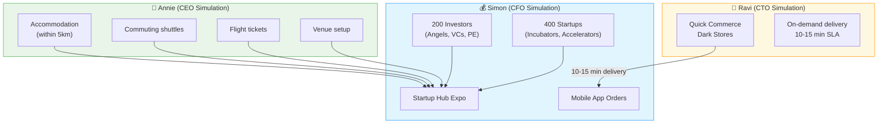

# 🗄️🤖 SQL & GenAI Course
**🎯 Quality Education for Anyone, Anywhere, Anytime — 💫 with Comfort, Convenience at no Cost**

---

## 🎯 CFO INTERVIEW SIMULATION – Startup Hub Expo

**Role:** Senior Data Engineer / Financial Analyst  
**Duration:** 90 minutes  
**Format:** Google-style open-ended interview with interviewer pushbacks

This simulation evaluates your ability to:

* **Translate** messy business problems into structured data systems
* **Integrate** cross-domain datasets (logistics + finance + operations)
* **Apply** financial reasoning under ambiguity
* **Defend** your decisions when challenged

**The SQLVerse Artisan is trusted by Raj. Now Simon needs you.**

---

## 🌌 SQLVerse Check-In

<div style="border-left: 4px solid #9c27b0; background-color: #f3e5f5; padding: 15px; margin: 20px 0; border-radius: 0 8px 8px 0;">


**You are in a live interview.**

* The interviewer will interrupt you
* Constraints will change
* Your design will break
* Your assumptions will be challenged

**Respond as if you are in the room. Do not skip rounds.**

> **Think out loud. Stay structured. Adapt fast.**

</div>

---

## 📂 Before You Begin

Create a file in your Vault: `cf_simulation_answers.md`. 

You will capture:

* Assumptions
* Schema design
* SQL queries
* Business decisions

---

## 📍 Your Current Stage

```mermaid
flowchart LR
    A["✅ Exercise<br/>Solutions Complete"] --> B["✅ CTO<br/>Solutions"]
    B --> C["✅ CTO<br/>Simulation"]
    C --> D["✅ CEO<br/>Solutions"]
    D --> E["✅ CEO<br/>Simulation"]
    E --> F["✅ CFO<br/>Solutions"]
    F --> G["📍 CFO<br/>Simulation<br/>YOU ARE HERE"]
    G --> H["⏳ Quiz<br/>Answers"]
    H --> I["⏳ Return to<br/>Module 4 Guide"]
    
    style A fill:#e1f5fe,stroke:#4caf50
    style B fill:#c8e6c9,stroke:#2e7d32
    style C fill:#c8e6c9,stroke:#2e7d32
    style D fill:#c8e6c9,stroke:#2e7d32
    style E fill:#c8e6c9,stroke:#2e7d32
    style F fill:#c8e6c9,stroke:#2e7d32
    style G fill:#fff8e1,stroke:#ff9800,stroke-width:4px
    style H fill:#e8f5e8,stroke:#4caf50
    style I fill:#a5d6a7,stroke:#2e7d32
```



---

## ☕ The Story

**Simon**, CFO of a consultancy firm and a close friend of Raj's wife, is organizing a **Startup Hub Expo**.  
- **200 investors** (Angel Investors, Venture Capitalists, Private Equity)  
- **400 startups** (Incubators, Accelerators, Mentorship seekers)

The data is scattered across **emails** – unstructured, inconsistent, messy.  
Simon has hired **Annie** (Event Management CEO) for logistics:  
- Accommodation within 5km of venue  
- Commuting shuttles (hotel ↔ venue)  
- Flight ticket booking (return)  
- Venue setup

Simon has also partnered with **Ravi** (from the CTO Simulation – Mall Empire) for a **cutting-edge quick commerce operation**.

> Simon doesn’t care about dashboards.
> He cares about one thing:
>
> **“Did we make money—and is it worth repeating?”**

---

### 📦 Ravi's Quick Commerce – The Unique Concept

Ravi deploys a **micro-fulfillment network inside the venue** powering real-time app orders.

| Component | Detail |
|-----------|--------|
| **Dark Stores** | 3 small warehouse units inside the venue (each 200 sq ft) |
| **Inventory** | Pre-staged items: Sandwich, Burger, Energy Drink, Protein Bar, Hand Sanitizer, Powerbank, Notepad, Pen, Folder |
| **Ordering** | Expo mobile app (developed by Simon's team) – attendees scan QR code, order, pay |
| **Delivery SLA** | 10-15 minutes from order to delivery at attendee's booth or common area |
| **Runners** | 5 delivery staff per dark store, using electric scooters or walking |
| **Cost Structure** | Fixed cost per dark store (rent, staff, equipment) + variable cost per item (ingredients, packaging) |
| **Pricing** | Items sold at 20% markup over cost (except powerbanks – rental model) |
| **Data Tracking** | Order timestamp, delivery timestamp, SLA met (Y/N), item popularity, peak hours |

**Why this matters to Simon:**  
- Generates **additional revenue** (20% margin on food, rental fees for powerbanks)  
- Improves **attendee experience** – no one misses breakfast, runs out of power, or loses notes  
- Creates **data** to analyze: What items are most popular? Which hours need more runners? Should dark stores be permanent?

---

### 🏨 Annie's Expanded Logistics

Annie is responsible for **all travel and stay** for out‑of‑town attendees (approx 60% of investors, 40% of startups).

| Service | Details | Cost Tracking |
|---------|---------|----------------|
| **Accommodation** | Hotels within 5km radius of venue; 3 tiers (budget, mid‑range, premium) | Rate per room per night, number of nights, room type |
| **Commuting** | Shuttles every 30 minutes from 7 AM to 9 PM; dedicated cars for VIP investors | Per shuttle trip (fixed cost), per car hire (variable) |
| **Flight Tickets** | Economy class return tickets; changes allowed up to 48 hours before departure | Base fare + taxes + change fee (if any) |

**Constraint:** Annie must book hotels within 5km. If all rooms within that radius are full, she must request exception – tracked in data.

---

### 📧 The Data Mess – Email Example

Here is a **realistic email** Simon receives:

```
From: alex@greenlight.vc
Subject: Confirmation for Startup Hub Expo

Hi Simon,

Alex Chen from Greenlight Ventures (VC, $200M AUM) will attend.
Interested in: AI, Fintech, SaaS.

Please arrange accommodation (premium) and flight from Mumbai (arriving 5 May, departing 7 May).

Thanks.
```

**Another email from a startup:**

```
From: priya@ecofresh.com
Subject: Startup registration

EcoFresh – sustainable packaging. Seeking $1M seed.
Stage: Incubator (IIT Delhi).

Can you share booth details? 
```

Your job is to convert this into:

* **Structured** participant data
* **Linked** financial + operational **datasets**

---
### 📱 On-Demand Ordering (Mobile App)

During the expo, attendees open the mobile app and order items as needed:

- **Morning rush (8–10 AM):** Sandwiches, energy drinks, protein bars (missed breakfast)
- **Afternoon (1–3 PM):** Burgers, sodas, hand sanitizers
- **Throughout the day:** Powerbanks (when battery runs low), notepads, pens, folders

Each order generates a timestamp, item, quantity, delivery time, and SLA status (10-15 min).

---


### 📊 What Simon Needs to Know (The CFO Lens)

Simon will ask you to produce:

1. **Expo Profit & Loss Statement**  
   - Revenue: Sponsorships + app orders + powerbank rentals  
   - Costs: Annie (hotels, shuttles, flights, venue) + Ravi (dark stores + items) + Simon's team (marketing, app development)  
   - Net profit and margin

2. **Participant Matchmaking Effectiveness**  
   - How many investors met startups?  
   - Which investor types (Angel/VC/PE) made the most matches?  
   - Which startup stages (Incubator/Accelerator) got the most interest?

3. **Quick Commerce Performance**  
   - Which items had highest sales?  
   - What was the SLA adherence (delivered within 10‑15 minutes)?  
   - Were 3 dark stores enough? Should we add more?

4. **Attendee Satisfaction Proxy**  
   - Did app orders correlate with attendees staying longer?  
   - Did powerbank rentals reduce early departures? (Hypothesis: dead phone = leave early)

---

### 🧠 The Final Question (Bar Raiser)

*"If you were Simon, what would you change about the quick commerce model to make it more profitable next year?"*

Strong answers might include:
- Dynamic pricing based on demand (e.g., energy drinks cost more at 4 PM)
- Subscription model for frequent attendees (e.g., ₹500 for unlimited coffee+snacks)
- Partnerships with Uber Eats/Zomato to outsource delivery during peak hours
- Use order data to predict inventory needs – reduce waste
- Use Google forms to capture participants' requirements data instead of messy emails


> This is not a SQL question.
> This is a **decision-making question**.


Simon needs **you** – the SQLVerse Artisan – to organize all data, track costs, and answer: **Was the expo profitable? Should we repeat it?**

---

## 🌐 The Complete Narrative Web



---

## 🟢 ROUND 1: PROBLEM FRAMING (10 mins)


### 🎙️ Interviewer

*"You have 600+ messy emails. Build a system to classify participants, track money, and determine profitability."*

**What do you clarify before starting?**


> *(The interviewer is testing how you think—not what you list.)*

---

## 🟡 ROUND 2: DATA MODELING (15 mins)

### 🎙️ Interviewer Prompt


*"Design the database schema you would use."*

📌 Capture your design clearly enough that another engineer can implement it.

### 🔴 INTERVIEWER PUSHBACK

*"What if a startup is also an investor (corporate venture arm)? What breaks in your design?"*

📌 Respond and adjust your model if needed.

---

## 🔴 ROUND 3: SQL + METRICS (20 mins)

### 🎙️ Interviewer Prompt


*"Calculate total revenue, total cost, net profit, and profit margin for the expo."*

📌 Write your query.

### ⚠️ INTERVIEWER PUSHBACK


*"Your revenue looks inflated. Walk me through your logic."*

📌 Diagnose the issue and correct it.

---

## 🔵 ROUND 4: SYSTEM STRESS TEST (15 mins)

### 🎙️ Interviewer Prompt

*"The expo now has 5,000 participants. Orders are 50,000 per day. Your query takes 2 minutes. Simon needs results in under 5 seconds. Fix it."*

📌 Explain your approach.


### 🔴 INTERVIEWER PUSHBACK

*"You can only implement ONE optimization this week. What do you choose?"*

📌 What do you prioritize?

---

## 🟣 ROUND 5: BUSINESS DECISION (10 mins)

### 🎙️ Interviewer Prompt


*"You have ₹20 lakh to improve next year’s expo.*

*Where do you invest?"*

📌 Justify your decision.

### 🔴 INTERVIEWER PUSHBACK (Optional)


*"You cannot increase ticket prices."*

📌 Re-evaluate your answer.

---

## 🟠 ROUND 6: BAR RAISER (10 mins)

### 🎙️ Interviewer Prompt


*"Forget the system.*

*If you were Simon, what would you change to make this expo more profitable next year?"*


📌 Think beyond data. Answer as a business leader.

---

## 📘 Note

> *You've completed the simulation. Your answers are saved in your Vault. After you learn **CTEs, Window Functions, and Indexing** in Level 2, you will receive a detailed **Interviewer Guide** with expected answers, common mistakes, and evaluation rubrics. For now, trust your instincts. Struggle is part of learning.*

---

## 🎉 You’ve Completed the CFO Simulation

You helped Simon turn 600+ messy emails into a structured database. You tracked accommodation, shuttles, flights, dark store inventory, and 10‑minute delivery SLAs. You calculated net profit, survived interviewer pushbacks, and decided whether the expo was worth repeating.

**Simon now knows:**  
📊 Whether the expo made money (net profit margin)  
⚡ Which quick‑commerce items deliver the best ROI  
🔁 If he should run the expo again – and what to fix first

The Startup Hub Expo is no longer a financial black box.

Three simulations. Three new friends. One SQLVerse.

- **Ravi** unified his mall empire.
- **Annie** found her margin leaks.
- **Simon** now knows if the expo made money – and whether to run it again.

You didn’t just write SQL. You fixed real businesses. You:

* Structured chaos
* Modeled a business
* Made financial decisions

**That’s what real data work looks like.**

> **“SQL answers questions. Judgment builds businesses.”**
> 


**Read how Ravi, Annie, and Simon joined the SQLVerse:**  
👉 [0-CAPSTONE-STORY-EXPANSION.md](./0-CAPSTONE-STORY-EXPANSION.md)

---


## 🧭 EVALUATE NAVIGATION

```mermaid
flowchart LR
    A["✅ Exercise<br/>Solutions Complete"] --> B["✅ CTO<br/>Solutions"]
    B --> C["✅ CTO<br/>Simulation"]
    C --> D["✅ CEO<br/>Solutions"]
    D --> E["✅ CEO<br/>Simulation"]
    E --> F["✅ CFO<br/>Solutions"]
    F --> G["✅ CFO<br/>Simulation"]
    G --> H["📍 Quiz<br/>Answers<br/>NEXT"]
    H --> I["⏳ Return to<br/>Module 4 Guide"]
    
    style A fill:#e1f5fe,stroke:#4caf50
    style B fill:#c8e6c9,stroke:#2e7d32
    style C fill:#c8e6c9,stroke:#2e7d32
    style D fill:#c8e6c9,stroke:#2e7d32
    style E fill:#c8e6c9,stroke:#2e7d32
    style F fill:#c8e6c9,stroke:#2e7d32
    style G fill:#c8e6c9,stroke:#2e7d32
    style H fill:#fff8e1,stroke:#ff9800,stroke-width:4px
    style I fill:#a5d6a7,stroke:#2e7d32
```



| Previous Step | Next Step |
|:---:|:---:|
| [← Back to CFO Report Solutions](../6-capstone-solutions/3-MODULE4-CFO-REPORT-SOLUTIONS.md) | [Continue to Quiz Answers →](../module4-quiz-answers.md) |


---

*Part of our mission for 🎯 Quality Education for Anyone, Anywhere, Anytime — 💫 with Comfort, Convenience at no Cost.*

**Level 1 | Module 4 | CFO Interview Simulation | Next: [Quiz Answers](../module4-quiz-answers.md)**