# 🗄️🤖 SQL & GenAI Course
**🎯 Quality Education for Anyone, Anywhere, Anytime — 💫 with Comfort, Convenience at no Cost**

---

## 📘 Module 4 Quiz – Answers & Explanations

Welcome to the answer key for the Module 4 quiz. Use this to check your work and deepen your understanding. For each question, we provide the correct answer and a brief explanation.

---

## 🌌 SQLVerse Check-In

<div style="border-left: 4px solid #9c27b0; background-color: #f3e5f5; padding: 15px; margin: 20px 0; border-radius: 0 8px 8px 0;">

**The laws of joins and normalization are no longer mysteries to you. You have the keys.** You've completed the quiz – now check your answers and see the Artisan's reasoning.

**The difference between a coder and an Artisan is discipline.**

</div>

---

### 📍 Your Current Stage

```mermaid
flowchart LR
    A["✅ Exercise<br/>Solutions Complete"] --> B["✅ CTO<br/>Solutions"]
    B --> C["✅ CTO<br/>Simulation"]
    C --> D["✅ CEO<br/>Solutions"]
    D --> E["✅ CEO<br/>Simulation"]
    E --> F["✅ CFO<br/>Solutions"]
    F --> G["✅ CFO<br/>Simulation"]
    G --> H["📍 Quiz<br/>Answers<br/>YOU ARE HERE"]
    H --> I["⏳ Return to<br/>Module 4 Guide"]
    
    style A fill:#c8e6c9,stroke:#2e7d32
    style B fill:#c8e6c9,stroke:#2e7d32
    style C fill:#c8e6c9,stroke:#2e7d32
    style D fill:#c8e6c9,stroke:#2e7d32
    style E fill:#c8e6c9,stroke:#2e7d32
    style F fill:#c8e6c9,stroke:#2e7d32
    style G fill:#c8e6c9,stroke:#2e7d32
    style H fill:#fff8e1,stroke:#ff9800,stroke-width:4px
    style I fill:#e8f5e8,stroke:#4caf50
```




---

## Section 1: Normalization & Keys (Conceptual)

### Q1. The Three Gates
**Answer:**  
- **1NF:** Each cell contains a single atomic value (no repeating groups).  
- **2NF:** In 1NF + no partial dependencies (every non‑key column depends on the whole primary key).  
- **3NF:** In 2NF + no transitive dependencies (non‑key columns depend only on the primary key).  

**Explanation:** These normal forms progressively eliminate redundancy and prevent update/insertion/deletion anomalies. The E‑Store refactoring lab demonstrated moving from a flat products table to 3NF.

---

### Q2. The Golden Key
**Answer:** The `license_plate` column is the golden key because it appears in toll logs, café receipts, repair tickets, and fuel transactions, allowing you to join all revenue streams into a unified customer view.

**Explanation:** In the CTO Report, license plate served as the common identifier across disparate legacy systems, just as a foreign key links tables in a normalized database.

---

### Q3. Foreign Keys
**Answer:** A foreign key is a column (or set of columns) in one table that refers to the primary key of another table. They are essential for joins because they define the relationship between tables and enforce referential integrity, ensuring that every value in the foreign key column has a matching value in the referenced primary key.

**Explanation:** Without foreign keys, joins would rely on implicit assumptions, and data consistency would be at risk.

---

## Section 2: Join Types (Technical)

### Q4. INNER vs LEFT
**Answer:** `INNER JOIN` returns only rows that have matching values in both tables. `LEFT JOIN` returns all rows from the left table, with `NULL`s in the right‑table columns where there is no match.  

*Business scenario for LEFT JOIN:* Finding all customers – even those who have never placed an order – requires a `LEFT JOIN` from customers to orders.

**Explanation:** In the Training Institution database, `LEFT JOIN` helped find students with no enrollments or courses with no students.

---

### Q5. The Mirror Bridge
**Answer:** A `SELF JOIN` is joining a table to itself using table aliases. Example: finding employees and their managers when `manager_id` references `employee_id` in the same `employees` table.

**Explanation:** The Tourism Planet self‑join exercise used self joins to reveal guide mentorship hierarchies and package tour → sub‑tour relationships.

---

### Q6. Spot the Error
**Answer:** The query uses `WHERE p.price > 100` after a `LEFT JOIN`. This filters out rows where `p.price IS NULL` (categories with no products), effectively turning the `LEFT JOIN` into an `INNER JOIN`.  

**Fix:** Move the price condition into the `ON` clause:  
```sql
LEFT JOIN products p ON c.category_id = p.category_id AND p.price > 100
```  
Or accept that categories without products will be excluded.

**Explanation:** The distinction between `ON` (controls which rows are joined) and `WHERE` (filters final result) is critical for `LEFT JOIN`.

---

## Section 3: Join Conditions & ON vs WHERE (Applied)

### Q7. The Critical Distinction
**Answer:** In a `LEFT JOIN`, conditions in the `ON` clause affect which rows from the **right** table are joined – left table rows are preserved even if the condition fails. Conditions in the `WHERE` clause are applied **after** the join and can eliminate left table rows when they refer to the right table and the condition fails (because `NULL` never satisfies a non‑null condition).  

**Example:**  
- `ON ... AND p.price > 100` → all categories appear (Toys has `NULL` in product columns).  
- `WHERE p.price > 100` → categories with no products disappear.

**Explanation:** Understanding this prevents accidental data loss in reports.

---

### Q8. Non-Equi Join
**Answer:** A non‑equi join uses operators other than `=` in the `ON` clause (e.g., `<`, `>`, `BETWEEN`).  

**Example:** Finding products that are cheaper than another product in the same category:  
```sql
SELECT p1.product_name, p2.product_name
FROM products p1
JOIN products p2 ON p1.category_id = p2.category_id AND p1.price < p2.price;
```  
This is also a self join.

**Explanation:** Non‑equi joins are powerful for range‑based comparisons and “cheaper alternative” analyses.

---

## Section 4: Cartesian Products (Troubleshooting)

### Q9. The Infinite Void
**Answer:** A Cartesian product (CROSS JOIN) pairs every row from the first table with every row from the second table, producing `rows(A) × rows(B)` rows. It is dangerous because large tables can generate millions or billions of rows, crashing the database or browser.  

**Accidental creation:** Forgetting the `ON` clause in a `JOIN` (e.g., `FROM products p JOIN categories c` without `ON`) creates a Cartesian product.

**Explanation:** Always check your `ON` conditions – the `CROSS JOIN` example in File 6 warned about this “Infinite Void.”

---

## Section 5: Write the Query (Training Institution)

### Q10. Students with No Enrollments
```sql
SELECT s.first_name || ' ' || s.last_name AS student_name,
       s.email
FROM students s
LEFT JOIN enrollments e ON s.student_id = e.student_id
WHERE e.enrollment_id IS NULL;
```
**Explanation:** `LEFT JOIN` preserves all students; `WHERE e.enrollment_id IS NULL` filters to those with no enrollments.

---

### Q11. Complete Student Transcript
```sql
SELECT s.first_name || ' ' || s.last_name AS student_name,
       c.course_name,
       i.first_name || ' ' || i.last_name AS instructor_name,
       e.completion_status
FROM students s
LEFT JOIN enrollments e ON s.student_id = e.student_id
LEFT JOIN courses c ON e.course_id = c.course_id
LEFT JOIN instructors i ON c.instructor_id = i.instructor_id
ORDER BY s.student_name;
```
**Explanation:** Chaining `LEFT JOIN`s preserves all students, even those with no enrollments or when course/instructor data is missing.

---

### Q12. Instructor Course Load
```sql
SELECT i.first_name || ' ' || i.last_name AS instructor_name,
       COUNT(c.course_id) AS courses_taught
FROM instructors i
JOIN courses c ON i.instructor_id = c.instructor_id
GROUP BY i.instructor_id
ORDER BY courses_taught DESC;
```
**Explanation:** `INNER JOIN` because we only want instructors who actually teach courses. `GROUP BY` aggregates the count.

---

### Q13. High-Value Students (Total Payments > 3000)
```sql
SELECT s.first_name || ' ' || s.last_name AS student_name,
       SUM(p.amount) AS total_paid
FROM students s
JOIN payments p ON s.student_id = p.student_id
GROUP BY s.student_id
HAVING SUM(p.amount) > 3000
ORDER BY total_paid DESC;
```
**Explanation:** `JOIN` links students to payments, `GROUP BY` aggregates per student, `HAVING` filters groups after aggregation.

---

### Q14. Courses with at least 2 students (Preview of advanced joins)
```sql
SELECT c.course_name,
       i.first_name || ' ' || i.last_name AS instructor_name,
       COUNT(e.student_id) AS student_count
FROM courses c
JOIN instructors i ON c.instructor_id = i.instructor_id
JOIN enrollments e ON c.course_id = e.course_id
GROUP BY c.course_id
HAVING COUNT(e.student_id) >= 2
ORDER BY student_count DESC;
```
**Explanation:** This query uses multiple joins, grouping, and a `HAVING` clause. It previews the kind of reporting you'll build in the Capstone Reports.

---

## Section 6: The Artisan’s Challenge (Conceptual – Sample Answers)

### Q15. Most important insight from reverse engineering (CTO Report)
**Sample answer:** The CTO Report taught me that schemas are not given – they must be discovered from messy reports. I learned to treat every report as a clue to the underlying data model, not as the final schema.

---

### Q16. Business value of cross‑domain join (CEO Report)
**Sample answer:** Joining banking customer data with toll transactions identified “ghost travelers” – wealthy customers not using bank cards on highways. This directly led to a targeted credit card campaign, turning data into revenue.

---

### Q17. Why profitability matters more than revenue
**Sample answer:** Revenue tells you how much money comes in; profit tells you how much you keep. A startup can have high revenue but negative profit, which means it is losing money on every sale. As a CFO, you invest based on sustainable profit, not top‑line hype.

---

### Q18. Communicating with business stakeholders
**Sample answer:** The three reports forced me to translate SQL results into executive language: CTO cares about architecture, CEO about strategy, CFO about margins. This ability to switch lenses is essential when presenting to non‑technical leaders.

---

### Q19. What it means to be a Data Artisan
**Sample answer:** A Data Artisan doesn’t just write queries that work; they design systems that resist corruption, handle real‑world data gaps, and answer strategic questions. This mindset transforms technical exercises into portfolio pieces that impress interviewers.

---

## ✅ Next Steps

- Review any answers you missed and revisit the relevant concept files (Files 1–6) or practice exercises (Exercises 0–5).
- Once confident, you are ready to move to the **ACCELERATE** phase (Module 5).

## 🎉 Congratulations!

You've completed the **EVALUATE** stage for Module 4. Your portfolio now includes:

- ✅ **CTO Report** – Reverse‑engineering a transportation system
- ✅ **CEO Report** – Cross‑domain data enrichment
- ✅ **CFO Report** – Financial auditing & investment decision
- ✅ **Three interview simulations** (CTO, CEO, CFO)
- ✅ All **practice exercises** (0–5) and the **module quiz** with verified solutions

You are now ready to move on to **ACCELERATE** (Level 2 begins). The SQLVerse expands – go build the next layer of your skills!

Take a moment to celebrate for successfully completing Module 4! 🎉

---

### 🧭 EVALUATE Navigation


| Previous Step | Next Step |
|:---:|:---:|
| [← Back to CFO Interview Simulation](../6-capstone-solutions/simulations/3-CFO-INTERVIEW-SIMULATION.md) | [Return to Module 4 Guide →](../MODULE4_GUIDE.md) |

---

*Part of our mission for 🎯 Quality Education for Anyone, Anywhere, Anytime — 💫 with Comfort, Convenience at no Cost.*

**Level 1 | Module 4 | Quiz Answers**