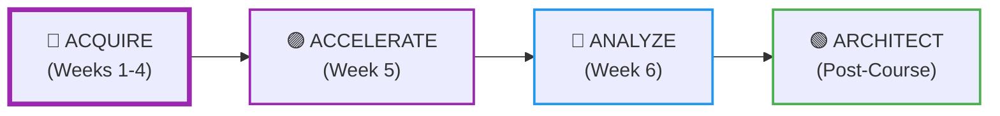
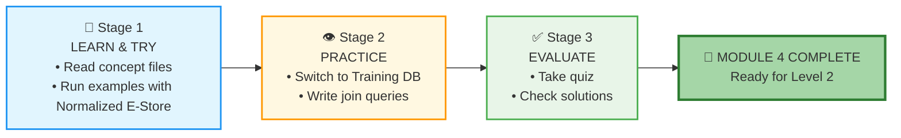
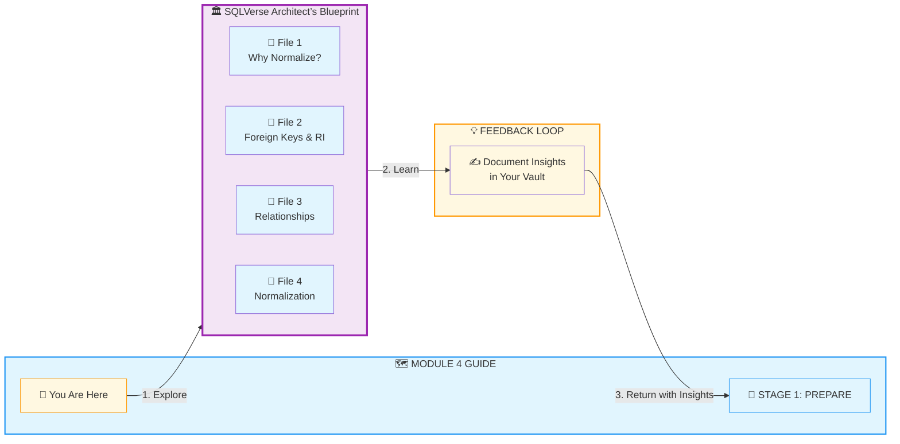
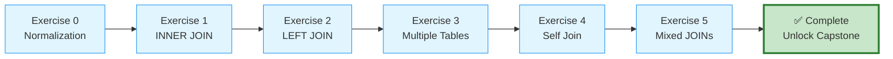
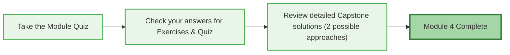

# 🗄️🤖 SQL & GenAI Course
**🎯 Quality Education for Anyone, Anywhere, Anytime — 💫 with Comfort, Convenience at no Cost**

## 🗺️ Module 4 Guide: Joining Tables – The Connector

Welcome to Module 4! You've mastered sorting, aggregating, and grouping data within a single table. Now it's time to connect multiple tables – to combine the stories of customers, orders, products, and more into a single, unified view. In this guide, you'll follow the **PREPARE → PRACTICE → EVALUATE** rhythm to master joins. By the end, you'll be able to answer questions like *“Which customers bought the most expensive product?”* and *“What are the top‑selling product categories?”* with elegant, multi‑table queries.

---

### 📍 Your Position in the 4 A's Journey

| Phase | Current Module | AI Role |
|-------|----------------|---------|
| **🔴 ACQUIRE** (Weeks 1-4) | **Module 4: Joining Tables** | **Conceptual Guide Only** |

**📍 You are here:** Module 4 of ACQUIRE – connecting tables and normalizing data.

---

## 🏢 **The Browser Office: Your Universal Launchpad**

**🚀 Kickstart: Any Computer, Any Browser, Anytime.**  
**🌍 Destination: Any country, Any city, Any Platform.**

### **📋 The Standard Four-Tab Setup (Levels 1 & 2)**
The Browser Office transforms any computer with a browser into a complete learning environment.

| Tab | Purpose | Tools & Examples | Description |
| :--- | :--- | :--- | :--- |
| **1: The Map** | Learning content & navigation | Course Repository (GitHub) | Your central hub for all course materials, module guides, and resources. |
| **2: The Factory** | Hands-on practice | SQLite Online | An online SQL environment where you'll run queries and experiment with databases. |
| **3: The Consultant** | AI assistance & explanations | ChatGPT, Claude, Gemini | Your AI learning partner, configured to provide conceptual guidance without writing code for you. |
| **4: The Vault** | Progress tracking & portfolio | GitHub Web, notes | Your personal GitHub repository where you'll store all your work, reflections, and completed exercises. |

> **Keyboard Shortcuts:** `Ctrl+1` / `Cmd+1` for Tab 1, `Ctrl+2` / `Cmd+2` for Tab 2, `Ctrl+3` / `Cmd+3` for Tab 3, `Ctrl+4` / `Cmd+4` for Tab 4.

---

### 🔧 **Need Help?**

| 🔧 Troubleshooting | 🔄 Workflow | ⌨️ Tab Operations |
| :---: | :---: | :---: |
| [Troubleshooting Common Issues](../../../Setup/STEP1_COMMISSION_BROWSER_OFFICE.md) | [Browser Office Workflow](../../../Setup/STEP2_ESTABLISH_LEARNING_RITUAL.md) | [Tab Operations & Shortcuts](../../../Setup/STEP3_MASTER_TAB_OPERATIONS.md) |

---

## 🏢 **Your Browser Office for Module 4 (Connection Mode)**

🚀 Foundation First, AI Next, Projects Last.  
💎 Gemstone by Gemstone, Skill by Skill.

For this module, here's exactly how to use each tab:

| Tab | Purpose | What to Do |
| :--- | :--- | :--- |
| **1: The Map** | Read concept files | Work through `1-sqlCommands/` in order. |
| **2: The Factory** | Run queries | **Demonstration:** Keep the **Normalized E‑Store** (`level1_estore_normalized_MODULE4.db`) loaded while studying join concepts. **Practice:** Switch to **Training Institution** (`training_institution_sample.db`) for exercises. |
| **3: The Consultant** | Conceptual Q&A only | Ask about join types, foreign keys, normalization, or why a query returns unexpected results. ❌ Never ask for full code. |
| **4: The Vault** | Save your queries | Save every successful query in the appropriate folder: `.../Module4/2-practiceExercises/` (or keep notes in `1-sqlCommands/`). |

---

### 🔴 **Your ACQUIRE Foundation**

| 🗄️ Database Ecosystem | 📚 Knowledge Base | 🧠 Mindset Tuning |
| :---: | :---: | :---: |
| [Database Ecosystem](../../Guides/Section1-ACQUIRE/2_Database_Ecosystem.md) | [Knowledge Base (Vault)](../../Guides/Section1-ACQUIRE/3_Knowledge_Base.md) | [Mindset Tuning](../../Guides/Section1-ACQUIRE/4_Mindset.md) |

---

## 📚 **Deep Philosophy: From Analyst to Architect**

In Module 3, you learned to see patterns within a single table. Now you’ll learn to see how tables relate. This is the shift from **analyst** to **architect** – designing systems where data lives in the right place and is effortlessly reconnected when needed.

- **Normalization** is like organizing a library: each book is in one place, but you can find it through the catalog.
- **Foreign keys** are the catalog numbers that link books to shelves, authors, and subjects.
- **Joins** are the queries that let you pull together all the information about a book, its author, and its location in a single report.

Your AI Consultant is your patient tutor, but **you** are the one doing the work.

---

## 📈 The PREPARE → PRACTICE → EVALUATE Rhythm

| Stage | Folder | Purpose |
|-------|--------|---------|
| **📘 LEARN & TRY** | `1-sqlCommands/` | Read concept files and run examples with the Normalized E‑Store. |
| **👁️ PRACTICE** | `2-practiceExercises/` | Write your own queries using the Training Institution database. |
| **✅ EVALUATE** | `3-quizCheckpoint/` + `4-exerciseAndQuizSolutions/` | Test your skills and review solutions. |

---

## 🏛️ **The SQLVerse Architect’s Blueprint – Your Conceptual Foundation**

**Before** writing a single join, you’ll step into the **“SQLVerse Architect’s Blueprint”** – a dedicated space for the **fundamental concepts** that make joins meaningful.

### 🏗️ **The Architect’s Foundation**

Located in `1-sqlCommands/SQLVerse-Architects-Blueprint/`, this folder contains four essential reference files:

| File | What You'll Discover |
|------|----------------------|
| **`1-Why-Normalize.md`** | The problem with flat tables: redundancy, update anomalies, and inconsistency. Real‑world examples. |
| **`2-Foreign-Keys-Referential-Integrity.md`** | How we link tables; the concept of foreign keys; what happens when a key points to nothing. |
| **`3-Relationships.md`** | One‑to‑one, one‑to‑many, many‑to‑many; how they map to tables. |
| **`4-Normalization.md`** | 1NF, 2NF, 3NF with the E‑Store as a running example; trade‑offs. |

These aren't just theory – they're the **strategic insights** that explain ***why*** we split tables and how to join them back together. Think of this folder as your **reference library**. Return to it whenever you need to strengthen your understanding of the fundamentals.

> 💡 **Artisan's Tip:** Don't rush through these. A few minutes with the Blueprint will save you hours of confusion later.

### 🔄 **The Blueprint Roundtrip**

**Your Journey Through the Blueprint:**

| Step | Action | Purpose |
|------|--------|---------|
| **1️⃣ Explore** | Click into the SQLVerse Architect’s Blueprint files | Build your conceptual foundation |
| **2️⃣ Learn** | Study each file at your own pace | Understand the "why" behind joins and normalization |
| **3️⃣ Return** | Come back to this Guide with insights | Document your learnings in the reflection box below |
| **4️⃣ Begin PREPARE** | Start Stage 1 with a solid foundation | Write join queries with true understanding |

➡️ **[Explore the Blueprint Now](./1-sqlCommands/SQLVerse-Architects-Blueprint/1-Why-Normalize.md)** – *Your foundation awaits.*

---

### 🧠 **BLUEPRINT REFLECTION**

### 📝 **Before You Begin Stage 1**

After exploring the SQLVerse Architect’s Blueprint, come back here and document your key takeaways:

**What was the most powerful insight you gained from the Blueprint?**

_______________________________________________________
_______________________________________________________

**Which concept do you think will be most valuable when writing joins?**

_______________________________________________________

*These insights are your foundation. Keep them in your Vault.*

---

# 📘 STAGE 1: PREPARE (The Knowledge)

```mermaid
flowchart LR
    A["✅ COMPLETED<br/>🏛️ SQLVerse Architect’s Blueprint<br/>Conceptual Foundation"] --> B["🧪 Refactoring Lab<br/>(Guided Normalization)"]
    B --> C[File 1<br/>Intro to Joins]
    C --> D[File 2<br/>Inner Join]
    D --> E[File 3<br/>Left Join]
    E --> F[File 4<br/>Joining Multiple Tables]
    F --> G[File 5<br/>Self Join]
    G --> H[File 6<br/>Join Conditions & Advanced]
    
    style A fill:#f3e5f5,stroke:#4caf50,stroke-width:4px
    style B fill:#fff8e1,stroke:#ff9800,stroke-width:2px
    style C fill:#e1f5fe,stroke:#2196f3,stroke-width:2px
    style D fill:#e1f5fe,stroke:#2196f3,stroke-width:2px
    style E fill:#e1f5fe,stroke:#2196f3,stroke-width:2px
    style F fill:#e1f5fe,stroke:#2196f3,stroke-width:2px
    style G fill:#e1f5fe,stroke:#2196f3,stroke-width:2px
    style H fill:#e1f5fe,stroke:#2196f3,stroke-width:2px
```

Start with the **SQLVerse Architect’s Blueprint** to build your conceptual foundation. Then, watch the **Refactoring Lab** – a guided demonstration where the Architect transforms the flat E‑Store into a normalized schema. After that, work through the join concept files in order. Keep the **Normalized E‑Store database** (`level1_estore_normalized_MODULE4.db`) open in Tab 2 and run every example query you see. 

Watch the Architect **transform** the E‑Store in the **Refactoring** Lab, then use those same patterns to solve the Training Institution puzzle on your own in Stage 2 **PRACTICE**.

| File | What You'll Learn | Outcome |
|------|-------------------|---------|
| **🏛️ SQLVerse Architect’s Blueprint** | Why normalize? Foreign keys, relationships, normalization forms. | You understand the blueprint behind the connections. |
| **🧪 Refactoring Lab** | Guided demonstration: transform the flat E‑Store into a normalized schema. | You watch the Architect refactor a table, creating the database used for all join demonstrations. |
| **File 1** | What joins are and why we need them. | You see the problem that joins solve. |
| **File 2** | `INNER JOIN` – matching rows from both tables. | You can combine related data with precision. |
| **File 3** | `LEFT JOIN` – including unmatched rows from the left table. | You can handle missing data in reports. |
| **File 4** | Chaining multiple joins in one query. | You can answer complex business questions. |
| **File 5** | `SELF JOIN` – joining a table to itself. | You can handle hierarchies (e.g., employees and managers). |
| **File 6** | Non‑equi joins, complex `ON` conditions, and a preview of `RIGHT JOIN` / `FULL OUTER JOIN`. | You can craft advanced join conditions. |

---

### 🚀 Kickstart Your Journey

➡️ **[Begin Stage 1 with File 1](./1-sqlCommands/1-IntroToJoins.md)**  
*Build your foundation before you build your queries.*

---

### ✅ STAGE 1 COMPLETE – READY FOR NEXT STAGE

**🎉 Great!** You've learned the concepts. Now it's time to apply them with hands-on exercises.

**Proceed to Next Stage:**
➡️ **📖 Next Step:** Read the **STAGE 2** section below  
   **🎯 Action:** Switch to the Training Institution database and start the exercises.

### ✅ **BEFORE YOU BEGIN STAGE 2**

**What are the 3 most important insights you gained from the SQLVerse Architect’s Blueprint?**

1. _________________________________________
2. _________________________________________
3. _________________________________________

**Document these insights in your Vault.**

*This step marks your official completion of STAGE 1.*

**Ready for the next stage? Proceed to STAGE 2 below.**  

---

# 👁️ STAGE 2: PRACTICE – The Hands-on

**STAGE 2: PRACTICE – Exercises 0-5 (Complete in order)**

| Exercise | Focus | Database |
|----------|-------|----------|
| **Exercise 0** | Independent Normalization Practice | Library spreadsheet (no database) |
| **Exercise 1** | `INNER JOIN` Practice | Training Institution |
| **Exercise 2** | `LEFT JOIN` Practice | Training Institution |
| **Exercise 3** | Multiple Tables Practice | Training Institution |
| **Exercise 4** | Self Join Practice | Tourism Planet |
| **Exercise 5** | Mixed JOIN Practice | Multiple Databases |

**Complete exercises 0-5 in order. Each builds on the last.**

➡️ **[Begin Stage 2 with Exercise 0 →](./2-practiceExercises/0-normalization-practice.md)**

**✅ Complete Exercises 0-5 → Unlock Capstone Reports**

---

### 🏆 Capstone Reports – The Executive Suite

*Available after completing all six practice exercises.*

These are not exercises. They are **career accelerators**.

| Report | Role | Domain | Market Value – What This Proves to Employers |
|--------|------|--------|-----------------------------------------------|
| **CTO Report** | Technical Leader | Transportation | You can reverse-engineer a system from its outputs – a skill senior engineers use to audit and rebuild legacy systems. |
| **CEO Report** | Business Leader | Banking | You can translate complex data into strategic recommendations – the difference between a data analyst and a data leader. |
| **CFO Report** | Financial Leader | Library | You can model financial scenarios and justify investment decisions – the skill that gets you a seat at the executive table. |

**Complete these reports. Add them to your portfolio. Show them in interviews.**

➡️ **[Begin Your Capstone Journey with the CTO Report →](./2-practiceExercises/Capstone%20Reports/1-MODULE4-CTO-REPORT.md)**

> *“These reports are the difference between 'I know SQL' and 'I own SQL & can drive business value.'”*

---

### ✅ STAGE 2 COMPLETE – READY FOR FINAL STAGE

**🎉 Excellent!** You've written join queries, completed six practice exercises, and built three executive-level Capstone Reports. Now let's check your understanding.

**Proceed to Next Stage:**
➡️ **📖 Next Step:** Read the **STAGE 3** section below  
   **🎯 Action:** Take the quiz and review solutions.

### ✅ **BEFORE YOU BEGIN STAGE 3**

**What was the most powerful insight you gained from writing joins across multiple planets?**

_______________________________________________________

**Which Capstone Report challenged you the most? What did it teach you?**

_______________________________________________________

**Document this reflection in your Vault.**

*This step marks your official completion of STAGE 2.*

**Ready for the final stage? Proceed to STAGE 3 below.**  

---

# ✅ STAGE 3: EVALUATE – The Assessment

### ✅ Your Evaluation Tasks

1. **Take the Module Quiz:** Go to `3-quizCheckpoint/module4-sql-quiz.md`.
   - Answer the questions – some may ask you to write join queries.
   - Write your answers in a new file `quiz_answers.sql` (or `.md`) inside your Vault.

2. **Check your answers for Exercises & Quiz:** Open the solutions in `4-exerciseAndQuizSolutions/`.
   - Compare your queries and reasoning for Exercises 0-5 and the Module Quiz.

3. **Review detailed Capstone solutions (2 possible approaches):** Each Capstone Report (CTO, CEO, CFO) includes two possible solution approaches – study them to deepen your understanding.

4. **Module 4 Complete:** Celebrate your mastery of joins and normalization!

---

### 🚀 Complete Your Journey

➡️ **[Begin Stage 3: Take the Quiz](./3-quizCheckpoint/module4-sql-quiz.md)**  
*Evaluation turns practice into mastery.*

---

### ✅ STAGE 3 COMPLETE – MODULE 4 FINISHED

**🎉 Outstanding!** You've mastered joins and normalization. You can now connect tables and design scalable databases.

### ✅ **REFLECT BEFORE MOVING ON**

**What was the most satisfying query you wrote in this module? What business insight did it reveal?**

_______________________________________________________

**Document this reflection in your Vault.**

*This step marks your official completion of Module 4.*

---

## 💎 DESIGNER'S PERIGON

### *The Executive Artisan*

You have completed Module 4. You have normalized flat tables, written every type of join, and solved complex business questions across four planets. Now you stand at a new threshold – not of syntax, but of **perspective**.

The **CEO** asks: *"What does this mean for our business?"*  
The **CTO** asks: *"How was this built, and can it scale?"*  
The **CFO** asks: *"Does this make financial sense?"*

You have learned to answer all three. That is not just SQL mastery. That is **executive readiness**.

---

### 🧭 The Three Lenses of the Artisan

| Lens | Question | Report |
|------|----------|--------|
| **Strategic** | What decisions should we make? | CEO Report |
| **Technical** | How was this built? | CTO Report |
| **Financial** | What is the value? | CFO Report |

> *“The Artisan doesn't just write queries. The Artisan translates data into decisions.”*

---

### 🏛️ Beyond Syntax

You've learned that a well‑normalized database is invisible – when it's built correctly, users never see the corruption, the errors, or the maintenance headaches. They only see a system that works, every single time.

You've learned that the right join is the invisible join – the one that answers the question and disappears into the background. No one praises a query for being clever; they praise it for being correct.

You've learned that reverse engineering is a superpower – every report hides a schema. The Artisan can see the blueprint behind the finished product.

---

### 🚀 The SQLVerse Awaits

In the **ACCELERATE** phase, you'll learn to wield AI as your co‑pilot – but you'll never outsource your judgment.

In **ANALYZE**, you'll study professional projects and learn from their architecture.

In **ARCHITECT**, you'll build your own worlds from scratch.

> *“The SQLVerse expands. Go build and conquer the world.”*

---

## 🎉 MODULE 4 COMPLETE

### ✅ Congratulations, You've Mastered Joining Tables!

**You have successfully:**
- Understood why flat tables are problematic and how normalization solves it.
- Defined foreign keys and referential integrity.
- Normalized a flat table into a professional schema.
- Written `INNER JOIN`, `LEFT JOIN`, and chained multiple joins.
- Used `SELF JOIN` to model hierarchies.
- Learned about advanced join conditions and previewed `RIGHT JOIN` and `FULL OUTER JOIN`.
- Built three capstone reports (CEO, CTO, CFO) using joins.

### 🎓 **Your Achievement Awaits**

You've successfully completed Module 4! You are now ready to move into **ACCELERATE** and **ANALYZE** phases, where you'll apply these skills to larger projects.

**View your official certificate here:**  
[📜 **MODULE 4 CERTIFICATE →**](./MODULE4_GRADUATION.md)

*Print it, share it, celebrate it. Then return here to continue your journey.*

---

### 💎 **REFLECT BEFORE YOU PROCEED**

**What was the most powerful insight you gained from normalization and joins?**

_______________________________________________________
_______________________________________________________

**How will you use joins in your future projects?**

_______________________________________________________

*Document these reflections in your Vault. They're the evidence of your evolution from Analyst to Architect.*

---

### 🚀 Ready for the Next Adventure?

**You have now completed all four ACQUIRE modules!** You’ve mastered the fundamentals of SQL – from single‑table queries to joins and normalization. Your foundation is solid.

Your next step is to visit the **ACQUIRE Completion** file, where you'll complete a final set of tasks. After that, you'll return to the **Master Guide** to reflect on your journey and officially conclude the ACQUIRE phase. Then, you'll be ready to begin the **ACCELERATE** phase.

### ✅ Complete Your ACQUIRE Phase

# [▶️ **GO TO ACQUIRE COMPLETION**](../../../Guides/SECTION1_COMPLETION.md)

*Reflect on what you’ve built, document your milestones, and prepare for the next phase.*

---

*Part of our mission for 🎯 Quality Education for Anyone, Anywhere, Anytime — 💫 with Comfort, Convenience at no Cost.*

**Level 1 | Module 4 Guide | Next: ACQUIRE Completion**