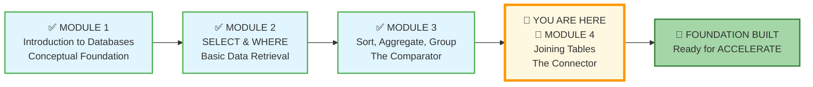
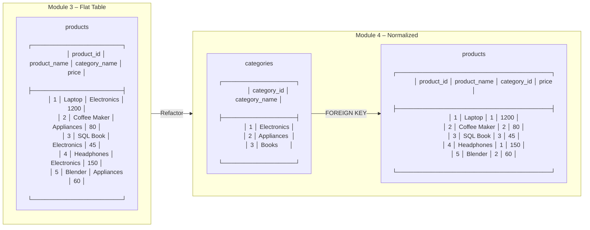
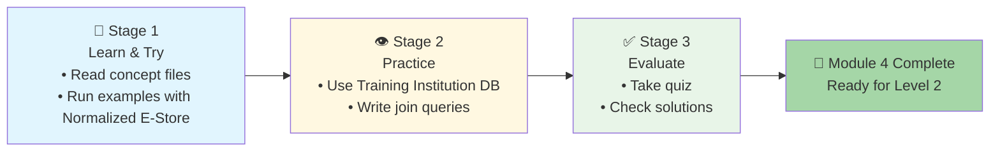

# 🗄️🤖 SQL & GenAI Course
**🎯 Quality Education for Anyone, Anywhere, Anytime — 💫 with Comfort, Convenience at no Cost**

## 📖 Module 4: Joining Tables – The Connector

Welcome to Module 4! You've mastered sorting, aggregating, and grouping data within a single table. Now it's time to connect multiple tables – to combine the stories of customers, orders, products, and more into a single, unified view. By the end of this module, you'll be able to answer questions like *“Which customers bought the most expensive product?”* and *“What are the top‑selling product categories?”* with elegant, multi‑table queries.

💎 **The Artisan's Insight:** *“A single table is a sketch. Joins turn it into a masterpiece – combining colors, textures, and dimensions to reveal the full picture.”*

---

## 📊 **Your ACQUIRE Journey – Where You Are Now**

### 📍 You Are Here
- **Phase:** 🔴 ACQUIRE (Weeks 1‑4)
- **Module:** 4 of 4 – Joining Tables
- **Mode:** Hands‑on SQL with multi‑table relationships

---

## 🎯 Quick Overview

| Goal | Learn to combine data from multiple tables using joins. Understand normalization, foreign keys, and how to design a scalable database. |
|------|----------------------------------------------------------------------------------------|
| Time | 5‑6 hours (learn + practice) |
| Structure | **Learn & Try → Practice → Evaluate** (the proven rhythm) |

---

## 🧭 **Your Learning Compass for This Module**

**Journey Stage:** Foundation Building – **Multi‑Table Operations**  
**AI Co-pilot Role:** Conceptual Explainer only (no code generation)  
**Primary Goal:** Understand why we split data into multiple tables (normalization) and how to recombine it using joins.

**What This Means for You:**
- **🧠 Mindset Focus:** Data in the real world is rarely in one perfect table. You'll learn to navigate relationships, not just rows.
- **🤖 AI Guidelines:** Your Consultant (Tab 3) can explain concepts, clarify syntax, and help you understand error messages, but **will never write the query for you**. This discipline builds genuine mastery.
- **🎯 Success Metric:** By module's end, you can confidently write `INNER JOIN`, `LEFT JOIN`, and multi‑table joins; you understand foreign keys, referential integrity, and basic normalization.

> **Philosophical Anchor:** *“The Artisan doesn't just see tables – they see relationships. They know that data is most powerful when it's connected.”*

---

## 🎯 **Learning Objectives**

By completing this module, you will be able to:

1. **Explain** why flat tables are problematic (redundancy, anomalies) and why normalization is the Artisan’s solution.
2. **Define** foreign keys, referential integrity, and the different types of relationships (one‑to‑one, one‑to‑many, many‑to‑many).
3. **Perform** a guided refactoring to normalize a flat table into a multi‑table schema.
4. **Write** `INNER JOIN` queries to combine related data.
5. **Write** `LEFT JOIN` queries to include unmatched rows from one side.
6. **Chain** multiple joins to answer complex business questions.
7. **Use** self‑joins to relate rows within the same table.
8. **Understand** the differences between `RIGHT JOIN` and `FULL OUTER JOIN` (preview for Level 3).
9. **Apply** joins to create professional reports and continue building your portfolio.

#### 🏛️ **The SQLVerse Architect’s Blueprint**

Before writing a single join, you’ll step into the **“SQLVerse Architect’s Blueprint”** – a conceptual foundation where we explore:
- **Why Normalize?** – The dangers of flat tables and the need for integrity.
- **Foreign Keys & Referential Integrity** – The glue that connects tables.
- **Relationships** – One‑to‑one, one‑to‑many, many‑to‑many.
- **Normalization in Practice** – 1NF, 2NF, 3NF with real‑world examples.

This blueprint will make every join you write feel **natural** and **purposeful**. 

> *“This is the **hidden curriculum** – the knowledge that separates the craftsman from the crowd. Bootcamps teach you how to join tables; Artisans learn **why** the tables were built that way in the first place. Master the blueprint, and you master the art.”*

> 💡 **Located in:** `1-sqlCommands/SQLVerse-Architects-Blueprint/` – your reference for these core concepts throughout the module and beyond.

---

### 🔍 The Big Reveal

In Module 3, you used a flat `products` table with a text column for categories. It worked beautifully. But now, as the E‑Store grows, the CTO warns of “data integrity nightmares.” The simple table you mastered is a ticking time bomb.  

**The Plot Twist:** you’ll learn to refactor it into a normalized schema – creating a `categories` table and linking it with foreign keys. Then, you’ll use joins to put the data back together, unlocking new superpowers.

*The E‑Store Evolution.*

---

## 🏢 **The Browser Office: Your Universal Launchpad**

**🚀 Kickstart: Any Computer, Any Browser, Anytime.**  
**🌍 Destination: Any country, Any city, Any Platform.**

### **📋 The Standard Four-Tab Setup (Levels 1 & 2)**
The Browser Office transforms any computer with a browser into a complete learning environment.

| Tab | Purpose | Tools & Examples | Keyboard Shortcut |
| :--- | :--- | :--- | :--- |
| **1: The Map** | Learning content & navigation | Course Repository (GitHub) | `Ctrl+1` / `Cmd+1` |
| **2: The Factory** | Hands-on practice | SQLite Online | `Ctrl+2` / `Cmd+2` |
| **3: The Consultant** | AI assistance & explanations | ChatGPT, Claude, Gemini | `Ctrl+3` / `Cmd+3` |
| **4: The Vault** | Progress tracking & portfolio | GitHub Web, notes | `Ctrl+4` / `Cmd+4` |

---

## 📋 **Prerequisites**

Before beginning Module 4, ensure you have:

- [ ] **Module 3 Complete:** You've finished all concept files, exercises, and the quiz.
- [ ] **Browser Office Open:** All four tabs configured and accessible.
- [ ] **Databases Ready:**
   - **Normalized E‑Store** (`level1_estore_normalized_MODULE4.db`) – will be created during the refactoring lab and used for join demonstrations.
   - **Training Institution Database** (`training_institution_sample.db`) – already normalized; used for all practice exercises.
- [ ] **Student Mode Active:** Your Consultant (Tab 3) configured with the Student Mode prompt.
- [ ] **Vault Ready:** Your GitHub repository structure matches the updated Module 4 layout.

---

## 🏛️ The Databases You’ll Work With

### 1. Normalized E‑Store (Demonstration Database)

In Module 3, you used a **flat** version of the E‑Store – one `products` table with a text column for categories. It was perfect for learning `GROUP BY` and aggregates because everything you needed was in one place.

But as the business grows, so do the problems: redundancy, update anomalies, and the risk of inconsistent data.  

#### 📉 The Evolution: From Flat to Relational

| Module 3 (Flat) | Module 4 (Normalized) |
|-----------------|-----------------------|
| `products` table: `product_id`, `product_name`, `category_name`, `price` | `products` table: `product_id`, `product_name`, `category_id`, `price` |
| *Risk:* A typo ("Electonrics") creates a duplicate category. | `categories` table: `category_id`, `category_name` |
| To rename a category, you must update **every** product row. | *Benefit:* Change "Electronics" to "Tech" in **one** row; all products update instantly. |

In this module, you’ll experience **The Big Reveal**. You’ll perform a guided **refactoring lab** to transform the flat `products` table into this normalized schema. The result is a **clean, professional database** – `level1_estore_normalized_MODULE4.db` – that eliminates redundancy and protects data integrity.

This normalized E‑Store becomes your **demonstration database** for all join concept files. You’ll see how joins reconnect the pieces you just split apart, and you’ll understand why this structure is the foundation of every production‑grade application.

---

### 2. Training Institution Database (Practice Database)

You already know this database from Modules 1–3. It was **already normalized** from the start – with `students`, `courses`, `enrollments`, `instructors`, and `payments` properly linked by foreign keys. It mirrors the structure you just built in the refactoring lab, but on a larger, richer dataset.

**Why practice here?**  
- It’s familiar – you’ve already written `SELECT`, `WHERE`, and `GROUP BY` queries on it.  
- It’s already normalized – no extra setup. You can jump straight into writing joins.  
- It’s rich – with multiple related tables (`students` ↔ `enrollments` ↔ `courses` ↔ `instructors`), you’ll practice realistic join scenarios.

Every practice exercise in this module uses the Training Institution database. This separation ensures you first **watch** joins being performed on the freshly normalized E‑Store (demonstration), then **do** joins yourself on a trusted, normalized database (practice).

| Table | Key Columns for Joins |
|-------|-----------------------|
| `students` | `student_id` |
| `courses` | `course_id`, `instructor_id` |
| `enrollments` | `student_id`, `course_id` |
| `instructors` | `instructor_id` |
| `payments` | `student_id` |

> 💡 **Pro Tip:** The structure of the Training Institution database is intentionally similar to the normalized E‑Store, so the skills you learn on one transfer directly to the other.

---

## 🧠 **Mindset: From Analyst to Architect**

In Module 3, you learned to see patterns within a single table. Now you’ll learn to see how tables relate. This is the shift from **analyst** to **architect** – designing systems where data lives in the right place and is effortlessly reconnected when needed.

- **Normalization** is like organizing a library: each book is in one place, but you can find it through the catalog.
- **Foreign keys** are the catalog numbers that link books to shelves, authors, and subjects.
- **Joins** are the queries that let you pull together all the information about a book, its author, and its location in a single report.

> 💡 **Visualizing Joins:** Picture two tables as overlapping circles. The `INNER JOIN` gives you the overlap. The `LEFT JOIN` gives you everything from the left circle, plus any overlap. The `RIGHT JOIN` does the opposite. The `FULL OUTER JOIN` gives you everything from both.

> ⚠️ **The Artisan’s Warning: The Multiplier Trap**  
> If you forget your `ON` clause (e.g., `FROM tableA JOIN tableB`), SQL will match *every* row of A with *every* row of B. A 100‑row table joined to a 100‑row table suddenly becomes **10,000 rows of garbage**. Always double‑check your “Tether” (the `ON` statement)!

**Remember the 3‑Attempt Rule:**  
1. Write the query from memory/intuition.  
2. If it fails, check the syntax in the concept file.  
3. Still stuck? Ask the Consultant (Tab 3) for a conceptual hint – never for the full code.

---

## 📈 Your Three‑Stage Journey

**📘 Stage 1: Learn & Try** – Start with the **SQLVerse Architect’s Blueprint** to understand why we normalize. Then, step through the join concept files in `1-sqlCommands/`. As you read, open the **Normalized E‑Store** in Tab 2 and run every example query yourself. This builds muscle memory and confidence.

**👁️ Stage 2: Practice** – Switch to the **Training Institution database** and work through the exercises in `2-practiceExercises/`. Apply what you've learned to a familiar, rich dataset. Struggle, succeed, and grow. You'll also complete **three capstone reports** (CEO, CTO, CFO) that showcase your join mastery.

**✅ Stage 3: Evaluate** – Test your knowledge with the quiz in `3-quizCheckpoint/`. Then check your answers and review the solutions in `4-exerciseAndQuizSolutions/`.

---

### 📊 Your Portfolio Capstones

As you practice joins, you'll also create **three professional reports**, each tailored to a different stakeholder. These reports will showcase your ability to combine data and tell compelling stories.

| Report | Audience | Guiding Question |
|--------|----------|------------------|
| **📊 CEO Report** | Business Leadership | *“Which regions are our ‘High‑Value’ hubs?”*   *(Requires: `customers` + `orders` + `order_items`)* |
| **💻 CTO Report** | Technical Leadership | *“Are there any ‘Orphaned’ categories with zero products?”*   *(Requires: `categories` + `LEFT JOIN` + `products`)* |
| **💰 CFO Report** | Financial Leadership | *“What is our actual profit after supplier costs?”*   *(Requires: `order_items` + `products` + `suppliers`)* |

These reports are your opportunity to demonstrate not just SQL fluency, but strategic thinking – the hallmark of a true Artisan.

---

## 🚀 **Ready to Begin?**

The data is waiting to be connected. The relationships are ready to be explored.

**Your journey from analyst to architect begins now.**

# [▶️ **GO TO MODULE 4 GUIDE**](./MODULE4_GUIDE.md)

---

*Part of our mission for 🎯 Quality Education for Anyone, Anywhere, Anytime — 💫 with Comfort, Convenience at no Cost.*

**Level 1 | Module 4: Joining Tables | Next: [Module 4 Guide](./MODULE4_GUIDE.md)**