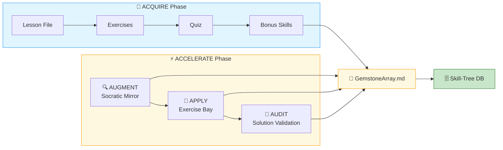

# 🗄️🤖 SQL & GenAI Course
**🎯 Quality Education for Anyone, Anywhere, Anytime — 💫 with Comfort, Convenience at no Cost**

---

## 📘 File 1: The SELECT Clause – Your First Command (powered with AI Augmentation)

Welcome back to the Socratic Mirror. You have already completed the **ACQUIRE** phase for this file and mastered the mechanics of relational projection. In this **ACCELERATE** cycle, we exit the sandbox of basic syntax to interrogate the invisible costs of unguided AI code generation, quantify data payloads at scale, and challenge your architectural judgment.

> 📐 **Scope Reminder:** This AUGMENT file covers only the **SELECT clause** (projection, column selection, aliasing). Do not introduce filtering (`WHERE`), grouping (`GROUP BY`), sorting (`ORDER BY`), or joins. Respect the spiral. Master one cognitive layer before descending deeper.

---
## ⚠️ REMINDER – ACQUIRE Foundation First

Before you enter this AUGMENT chamber, you must complete the ACQUIRE foundation for this concept:

1. **Read ACQUIRE Materials** – Open the ACQUIRE lesson file mirroring this ACCELERATE file, along with its exercises, quiz, and solutions. Read them thoroughly for complete conceptual understanding.

2. **Extract ACQUIRE Gemstones** – Collect gems (skill name, objective, your viewpoint, quiz scores, exercise completions) and add them to `GemstoneArray.md` using the **ETL Workflow** described in [`SKILL_TREE_ARCHITECTURE.md`](../../../Guides/SKILL_TREE_ARCHITECTURE.md).

> 🔁 **Spiral Rule:** ACQUIRE builds foundation. ACCELERATE builds judgment. Do not skip the foundation.

###  🔗 Mirror Bridge Reference

The ACQUIRE version of this file lives at:  
`Level-1-beginner/Module2-BasicRetrieval-SelectAndWhere/1-sqlCommands/1-the-sieve-select.md`

---

## 📍 Your Current Stage – AUGMENT Journey

```mermaid
flowchart LR
    A["📍 YOU ARE HERE<br/>📘 File 1<br/>The SELECT Clause<br/>(AUGMENT)"] --> B["📘 File 2<br/>The WHERE Clause"] --> C["📘 File 3<br/>Logical Operators"] --> D["📘 File 4<br/>IN & BETWEEN"] --> E["📘 File 5<br/>LIKE & Wildcards"] --> F["📘 File 6<br/>NULL Handling"] --> G["📘 File 7<br/>DISTINCT & Aliases"] --> H["✅ AUGMENT COMPLETE"] --> I["🔄 RETURN TO CYCLE GUIDE<br/>TO BEGIN APPLY PHASE"]
    
    style A fill:#fff8e1,stroke:#ff9800,stroke-width:4px
    style B fill:#e1f5fe,stroke:#2196f3
    style C fill:#e1f5fe,stroke:#2196f3
    style D fill:#e1f5fe,stroke:#2196f3
    style E fill:#e1f5fe,stroke:#2196f3
    style F fill:#e1f5fe,stroke:#2196f3
    style G fill:#e1f5fe,stroke:#2196f3
    style H fill:#c8e6c9,stroke:#2e7d32
    style I fill:#c8e6c9,stroke:#2e7d32
```



You're in **AUGMENT** – the abstraction layer of the spiral. You will interrogate AI logic, analyse architectural costs, and build mental models. After completing all 7 files, return to the Cycle Guide to begin the APPLY phase.

---

## 🔧 Enhanced Browser Office for AUGMENT

**🚀 Kickstart: Any Computer, Any Browser, Anytime.**  
**🌍 Destination: Any country, Any city, Any Platform.**

| Tab | Purpose | What to Do |
| :--- | :--- | :--- |
| **1: The Map** | Read AUGMENT files | You're here – reading this file. Next: `2-the-where-clause.md`. |
| **2: The Factory** | Run queries | Keep [`training_institution_sample.db`](../../../../Resources/sample_databases/training_institution_sample.db) loaded. Run every query you see in this file. |
| **3: The Consultant** | Socratic questioning | Configured with [`BROWSER-OFFICE-ACCELERATE.md`](../../BROWSER-OFFICE-ACCELERATE.md) – Persona prompt, SQLVerse characters. Configured with [`SCHEMA_ANCHOR_TRAINING_INSTITUTION_SAMPLE.md`](../../../SCHEMA_ANCHOR_TRAINING_INSTITUTION_SAMPLE.md). Ask about logic, never code. |
| **4: The Vault** | Save reflections & gemstones | Save all your Socratic logs in your Vault at `Learning/Level-1-beginner/ACCELERATE/01-The-Socratic-Mirror/ACQUIRE-MODULE2/1-the-sieve-select.md` using the template provided in [`SOCRATIC_LOG_TEMPLATE.md`](../../SOCRATIC_LOG_TEMPLATE.md).<br><br>If you spot any AI hallucinations, missed edge cases, or other mistakes made by the AI, save those unusual occurrences in your Vault at `Learning/Level-1-beginner/ACCELERATE/Socratic_Journals/` as a separate markdown file (e.g., `hallucination_log_1.md`, `edge_case_anomalies_1.md`). |


---

## 🛠️ ACQUIRE Module 2 Toolkit

🚀 **Foundation First, AI Next, Projects Last.**  
💎 **Gemstone by Gemstone, Skill by Skill.**

| | | |
|---|---|---|
| [Browser Office Workflow](../../../../Setup/STEP2_ESTABLISH_LEARNING_RITUAL.md) | [Knowledge Base](../../../Guides/Section1-ACQUIRE/3_Knowledge_Base.md) | [Mindset Tuning](../../../Guides/Section1-ACQUIRE/4_Mindset.md) |

---

## 🛠️ ACCELERATE Module 2 Toolkit

🚀 **AUGMENT First, APPLY Next, AUDIT Last.**  
💎 **Gemstone by Gemstone, Skill by Skill.**

| Core Pillar Guides | Optimization Strategy | Systemic Architecture |
|--------------------|----------------------|------------------------|
| 🏎️ [Query Optimization](../../../Guides/Section2-ACCELERATE/2_Query_Optimization.md) | 🧭 [ACCELERATE Atlas](../../MODULE5_GUIDE.md) | 🔄 [ACCELERATE Vision](../../ACCELERATE_VISION.md) |
| 🧠 [Socratic Method](../../../Guides/Section2-ACCELERATE/3_Socratic_Method.md) | 🪞 [Mirror Bridge](../../../Guides/Section2-ACCELERATE/4a_ACCELERATE_MIRROR.md) | 🌳 [Skill Tree Map](../../../Guides/SKILL_TREE_ARCHITECTURE.md) |

---

## 🚀 ACCELERATE MANDATE

**Socratic Guidance | No Code Generation | Strategy Over Syntax | Dialogue Logging**

**ACCELERATE GOLDEN RULE:**  
*You write every line of SQL manually. AI explains logic only. Never ask for code.*

---

## 🧭 Cognitive Operating Modes

| Phase | Operating Mode |
|-------|----------------|
| **ACQUIRE** | Learn |
| **AUGMENT** | Interrogate |
| **APPLY** | Struggle |
| **AUDIT** | Calibrate |

---

## 🧠 Cognitive Compression Notice

ACQUIRE prioritised clarity and guided explanation.

AUGMENT intentionally compresses information density.

You are expected to:
- pause frequently,
- interrogate assumptions,
- replay queries multiple times,
- and reflect before advancing.

Confusion under pressure is part of the spiral.

---

## 🎯 What You'll Learn


By completing this Socratic Mirror, you will be able to:

- **Identify and bypass** the hidden logic trap of implicit column aliasing.
- **Quantify** the mechanical and network resource penalties of wildcard projections (`SELECT *`).
- **Trace structural coupling defects** down to application layers caused by brittle data contracts.
- **Leverage Socratic reasoning prompts** to cross‑examine AI‑generated projection scripts.

---

## 🎯 Mirror Objective

In ACQUIRE, you learned how to write a SELECT query.

In AUGMENT, your objective is different:
- detect hidden defects,
- interrogate AI assumptions,
- evaluate production consequences,
- and determine whether a query is architecturally trustworthy.

This chamber does not measure whether SQL executes.

It measures whether your reasoning survives pressure.

---

## 🔒 Scope Lock

This mirror is intentionally restricted to the conceptual boundaries of the ACQUIRE version.

This chamber explores:
- projection (selecting columns)
- column selection and ordering
- wildcard (`SELECT *`) risks
- alias defects (missing commas)
- SELECT architecture

This chamber does NOT yet include:
- filtering (`WHERE` clause)
- logical operators (`AND`, `OR`, `NOT`)
- range filtering (`IN`, `BETWEEN`)
- pattern matching (`LIKE`)
- `NULL` handling
- `DISTINCT` or aliases
- sorting (`ORDER BY`)
- aggregation (`GROUP BY`, `HAVING`)
- joins (`INNER JOIN`, `LEFT JOIN`)

Respect the spiral. Master one cognitive layer before descending deeper.

---

## 📊 Our Practice Table: `students`

| Column | Type | Coupling Threat | Why |
|--------|------|----------------|-----|
| `student_id` | INTEGER | **HIGH** | Primary key – referenced everywhere |
| `first_name` | TEXT | **MEDIUM** | Displayed in UI, used in search |
| `last_name` | TEXT | **MEDIUM** | Displayed in UI, used in search |
| `email` | TEXT | **HIGH** | Used for login, notifications |
| `phone` | TEXT | **LOW** | Optional field, rarely critical |
| `enrollment_date` | DATE | **MEDIUM** | Used for reporting, segmentation |
| `total_fees` | DECIMAL | **HIGH** | Financial calculations |
| `fees_paid` | DECIMAL | **HIGH** | Financial calculations |

> ⚠️ **Data Contract Warning:** Any change to a `HIGH` coupling column will break existing applications. `SELECT *` inherits all coupling risks – including future columns you haven't seen yet.

---

## 🔍 Cognitive Reorientation Layer

### The Socratic Mirror for The SELECT Clause

You know how to write SELECT queries. You have mastered the SELECT syntax in ACQUIRE.

This file is no longer about syntax.

This mirror exists to interrogate:
- hidden assumptions
- AI-generated defects
- architectural consequences
- production fragility

Your objective is not to make SQL run.
Your objective is to determine whether the query is **trustworthy**.

---

## 🔍 Opening Reflection: The Autopilot Trap

An unguided AI assistant is asked to provide a directory of student first names and emails for an active dashboard component. It instantly defaults to this approach:

```sql
SELECT * FROM students;
```

The user only asked for:
- first name
- email

### 🧠 Critical Cross‑Examination

- **The Core Defect:** What structural overhead data is retrieved that the user never requested?
- **The Scale Penalty:** Why does this exact query become an active infrastructure hazard when scaled to millions of rows?
- **The AI Blindspot:** What assumption did the AI make about the table width and column contents?
- **The Syntactic Illusion:** Is this query syntactically perfect yet architecturally bankrupt?

---
## 🧩 Failure Classification

| Failure Type | Description |
|--------------|-------------|
| **Syntax Failure** | Query cannot compile |
| **Logical Failure** | Query runs but produces wrong meaning |
| **Architectural Failure** | Query works but creates scalability, maintainability, or coupling risks |
| **Operational Failure** | Query damages application/system behavior under production conditions |


---

## 🔍 Probing Questions for Your AI Consultant (Tab 3)

Paste these investigative prompts into Tab 3 to deconstruct relational projection principles. **Do not ask for SQL code**; focus entirely on the architectural reasoning.

1. *“What is the structural difference between selecting all columns (`SELECT *`) versus selecting specific columns? How does this choice affect cache line utilisation and physical disk block extraction inside a relational engine?”*

2. *“What does the sequencing of columns in a `SELECT` clause physically dictate? Can an application safely depend on the underlying physical ordinal position of columns in a table, or must it explicitly map queries by key identifiers?”*

3. *“What is the absolute structural role of the `FROM` clause during compilation? What does the engine use it for before processing the projection targets?”*

4. *“What is a syntax error versus a logical error in a `SELECT` statement? Give me an example of each without writing SQL.”*

5. *“How does a database engine decide between using an index scan versus a full table scan when processing a `SELECT` query? What role does projection play in that decision?”*

6. *“If a schema contains 50 distinct columns, but an operational system only requires 3, what are the precise memory pooling and network transmission implications of running a wildcard query at scale?”*

7. *“What is a cost‑based optimiser? How does selecting unnecessary columns (`SELECT *`) affect the optimiser’s ability to choose an efficient execution plan?”*

8. *“How does an implicit aliasing error (omitting a comma) bypass early syntax compilers while causing destructive downstream logic failures in runtime environments?”*

9. *“What is the difference between a compile‑time error and a runtime logical failure? Give an example of each in the context of a `SELECT` statement.”*

10. *“Why do production SQL queries rarely use `SELECT *`? What risks does it introduce to schema evolution, application coupling, and long‑term maintainability?”*

---
## 🔗 The Architectural Guardrail: Production Reality

In ACQUIRE, you learned the Artisan's Warning regarding `SELECT *`. Let's quantify that warning using systemic constraints of hardware architecture.

When you execute a query against a DBMS, data must be fetched from disk storage into memory (RAM) before being processed and transmitted over a network.

### The Cost Matrix

| Metric | `SELECT * FROM massive_table;` | `SELECT user_id, email FROM massive_table;` |
|--------|--------------------------------|------------------------------------------------|
| **Disk I/O Overhead** | High (Reads every single data block across the entire row width) | Low (Sequentially reads only the targeted data segments) |
| **Network Payload** | Massive (Transmits structural bloat, binary attachments, large text fields) | Lean (Transmits minimal bytes necessary for the transaction) |
| **Cache Pollution** | High (Erases useful memory pages to store discarded columns) | Zero (Maximises cache hit rates for frequent lookups) |

---

## 🎭 The Copilot's Script: The Invisible Poison

To optimise the request, Arjun creates a customised script using an automated code assistant to render a clean contact interface.

```sql
-- Generated by AI assistant for student dashboard contact link
SELECT student_id first_name, email 
FROM students;
```


## A Panoramic View of the Copilot's Script

### 🧠 Socratic Interrogation Loop

#### Interrogation Questions

Execute the **Copilot's Script code snippet** inside **Tab 2 (The Factory)** against the loaded `training_institution_sample.db`.

**Interrogation Question 1:** The database engine executes this command seamlessly without returning any syntax error codes. Look closely at your output table layout. What did the engine do with the data from the `first_name` column? Why is it missing?

**Interrogation Question 2:** If an application interface or an upstream software framework calls this query expecting a standalone, distinct column named `first_name`, how will the system layer behave? What configuration rule caused this behaviour?

> 💡 **Artisan Insight:** A query that does not throw an error can still be completely broken – logical poison. Leaving out a comma transforms a secondary column name into an **implicit alias** for the primary column.

### 💡 Mirror Insight Callout

Omitting a comma between two column names flags the second column as an implicit Alias for the first. The database assumes your logic is intentional and renames student_id to first_name, completely blinding itself to the actual first_name data block.

> 💡 **MIRROR INSIGHT**
> 
> *A database engine validates syntax. It does not validate architectural wisdom. A query can run perfectly and still be dangerously wrong.*

---

## 🧪 Socratic Reflection Probe

Before you cross the bridge to the Exercise Bay, paste this exact **Golden Calibration Prompt** into your Consultant (**Tab 3**) to stress-test your baseline mental models:

> **Golden Prompt:** *“I am evaluating relational projection boundaries. Explain how an un‑aliased `SELECT *` query introduces an invisible **structural coupling defect** between the physical database schema and the application layer when downstream migrations alter column counts or ordering, and detail how explicit column mapping breaks this dependency.”*

---

## 💎 GEMSTONE EXTRACTION WINDOW

Before you proceed to the next file, capture your architectural insights into `EXTRACTION_BAY/SkillTree/GemstoneArray.md`.

| Extraction Field | Your Response |
|-----------------|---------------|
| **Skill Extracted** | Detecting implicit aliasing mutations caused by structural punctuation omissions. |
| **Objective Mastered** | Designing resilient data communication contracts through absolute column isolation. |
| **Viewpoint Shifted** | Migrating from the sandbox question *“Does my query execute?”* to the architectural metric *“What hardware footprint does this payload demand?”* |
| **Anti-pattern Defeated** | `SELECT *` in production (over‑fetching, coupling, cache pollution) |
| **Production Constraint Validated** | Disk I/O, memory saturation, and network payload matter at scale |

> 📎 **Gemstone Taxonomy:** `Skill` = diagnostic ability | `Objective` = structural capability | `Viewpoint` = mental model shift | `Anti-pattern` = dangerous assumption defeated | `Constraint` = production limitation validated

---

## ✅ Progress Check (AUGMENT)


Can you confidently answer the following before descending to the next layer?

- [ ] Do you look for implicit naming aliases when commas are omitted?
- [ ] Can you map the network payload variance between a wildcard and a selective statement?
- [ ] Do you understand why structural coupling occurs when an API depends on a wildcard query?

**If yes → You're ready for File 2: The WHERE Clause (AUGMENT).**

---

## 🧭 The Artisan Shift

ACQUIRE taught you: *“How to write the query.”*

AUGMENT teaches you: *“How to distrust the query.”*

This is the transition from **operator** to **architect**.

---

## 💎 DESIGNER'S PERIGON

<div style="border: 3px solid #9c27b0; border-radius: 10px; padding: 20px; margin: 25px 0; background: linear-gradient(135deg, #f3e5f5 0%, #e1bee7 100%);">

### *The Art of Architectural Judgment*

You have just completed your first AUGMENT chamber. You did not learn new syntax. You learned something rarer: **how to interrogate a query**.

The AI gave you a query that ran without errors. But it was still wrong – architecturally fragile, logically poisoned, and dangerously coupled.

When you sit down with an AI Copilot, its default prompt parameters favour immediate, unoptimised completion over long‑term structural efficiency. It will hand you `SELECT *` because it is easy, fast, and guaranteed to run on current schema configurations.

But as an Artisan of the SQLVerse, you recognise that code generation without structural boundaries is **debt drawn on future computing power**. The discipline of explicit column naming is not a formatting preference; it is a defensive wall constructed to keep your data pipelines predictable, fast, and insulated against systemic drift.

> *“An Artisan is not measured by whether the query executes. An Artisan is measured by whether the query deserves to exist.”*

In ACQUIRE, you learned to speak SQL. In AUGMENT, you learn to judge it.

This is the shift from **operator** to **architect**. From **correctness** to **judgment**.

### 🔍 Your Own Google: The Accumulation Engine

At the start of this file, you studied the ACQUIRE lesson file mirroring this ACCELERATE file, along with its exercises, quiz, and solutions. You extracted the **ACQUIRE Gemstones** and added them to `GemstoneArray.md`.

Towards the end, you collected the **ACCELERATE Gemstones** for this mirror file and added them to `GemstoneArray.md`. You will do the same in the APPLY and AUDIT cycles.

When you complete the **ACQUIRE-MODULE2 spiral**, your Vault will be richer and your gem collection will have accumulated.



What you are building is not just a Vault – it is **Your Personalized Google in the cloud**, which will aid you in your interview preparations. Every gemstone you extract is a searchable, queryable piece of your professional identity.

> *“The SQLVerse expands. Your portfolio is proof.”*

</div>

---

## 🔁 Bridge Forward


You have interrogated the SELECT clause.

Next, you will move to the next AUGMENT lesson: **The WHERE Clause** – where you will interrogate filtering logic, hidden assumptions about row selection, and the cost of imprecise conditions.

---


## 🧭 File Navigation

```mermaid
flowchart LR
    A["✅ COMPLETED<br/>📘 File 1<br/>The SELECT Clause"] --> B["📘 File 2<br/>The WHERE Clause"] --> C["📘 File 3<br/>Logical Operators"] --> D["📘 File 4<br/>IN & BETWEEN"] --> E["📘 File 5<br/>LIKE & Wildcards"] --> F["📘 File 6<br/>NULL Handling"] --> G["📘 File 7<br/>DISTINCT & Aliases"] --> H["✅ AUGMENT COMPLETE"] --> I["🔄 RETURN TO CYCLE GUIDE"]
    
    style A fill:#c8e6c9,stroke:#2e7d32
    style B fill:#e1f5fe,stroke:#2196f3
    style C fill:#e1f5fe,stroke:#2196f3
    style D fill:#e1f5fe,stroke:#2196f3
    style E fill:#e1f5fe,stroke:#2196f3
    style F fill:#e1f5fe,stroke:#2196f3
    style G fill:#e1f5fe,stroke:#2196f3
    style H fill:#c8e6c9,stroke:#2e7d32
    style I fill:#c8e6c9,stroke:#2e7d32
```



| Previous Step | Next Step |
|:---:|:---:|
| [← Return to Cycle Guide](../CYCLE1_GUIDE.md) | [Continue to File 2: The WHERE Clause →](./2-the-where-clause.md) |

---

*Part of our mission for 🎯 Quality Education for Anyone, Anywhere, Anytime — 💫 with Comfort, Convenience at no Cost.*

**Level 1 | ACCELERATE Phase | AUGMENT | Next: The WHERE Clause**
