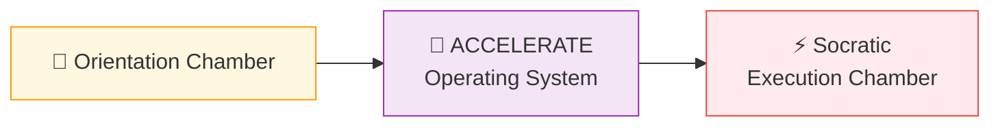
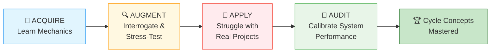
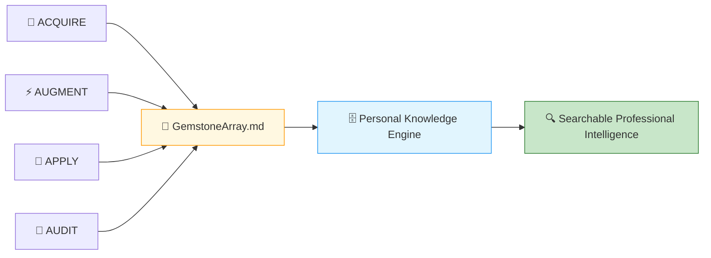

# 🗄️🤖 SQL & GenAI Course
**🎯 Quality Education for Anyone, Anywhere, Anytime — 💫 with Comfort, Convenience at no Cost**

---

## 📘 File 2: The WHERE Clause (powered with AI Augmentation)

Welcome back to the Socratic Mirror. You have already completed the **ACQUIRE** phase for this file and mastered row-filtering with standard comparison operators (=, >, <, >=, <=, <>). 

 In this **ACCELERATE** cycle, we exit the sandbox of basic syntax to interrogate how an AI Copilot handles filtering logic, calculate the hidden processing cost of full table scans, evaluate data access safety boundaries, and challenge your architectural judgment.
 
> 📐 **Scope Reminder:** This AUGMENT file covers only the **`WHERE` clause** with comparison operators (`=`, `<>`, `>`, `<`, `>=`, `<=`). Do not introduce logical operators (`AND`, `OR`, `NOT`), range filtering (`IN`, `BETWEEN`), pattern matching (`LIKE`), `NULL` handling, or aggregation. Respect the spiral. Master one cognitive layer before descending deeper.

---

## 📍 Your Current Stage – AUGMENT Journey

```mermaid
flowchart LR
    A["✅ COMPLETED<br/>📘 File 1<br/>The SELECT Clause"] --> B["📍 YOU ARE HERE<br/>📘 File 2<br/>The WHERE Clause<br/>(AUGMENT)"] --> C["📘 File 3<br/>Logical Operators"] --> D["📘 File 4<br/>IN & BETWEEN"] --> E["📘 File 5<br/>LIKE & Wildcards"] --> F["📘 File 6<br/>NULL Handling"] --> G["📘 File 7<br/>DISTINCT & Aliases"] --> H["✅ AUGMENT COMPLETE"] --> I["🔄 RETURN TO CYCLE GUIDE<br/>TO BEGIN APPLY PHASE"]
    
    style A fill:#c8e6c9,stroke:#2e7d32
    style B fill:#fff8e1,stroke:#ff9800,stroke-width:4px
    style C fill:#e1f5fe,stroke:#2196f3
    style D fill:#e1f5fe,stroke:#2196f3
    style E fill:#e1f5fe,stroke:#2196f3
    style F fill:#e1f5fe,stroke:#2196f3
    style G fill:#e1f5fe,stroke:#2196f3
    style H fill:#c8e6c9,stroke:#2e7d32
    style I fill:#c8e6c9,stroke:#2e7d32
```



---
## 🌀 Immersive Cognitive Traversal

You are not moving through numbered sections. You are **descending through cognitive layers**.

ACCELERATE is not a linear syllabus. It is a **spiral chamber** where each phase strips away a different veil: preparation, vocabulary, execution.



| Chamber | What You Do Here | What Leaves Your System |
|---------|------------------|-------------------------|
| **🏁 Orientation Chamber** | Load toolkits, lock scope, anchor the practice table | Confusion about where files live and what is allowed |
| **🧠 ACCELERATE Operating System** | Absorb failure taxonomy, cognitive modes, the mandate | Uncertainty about the rules of engagement |
| **⚡ Socratic Execution Chamber** | Interrogate AI scripts, analyse production echoes, extract gemstones | Passive consumption – you become an active judge |

**You cannot interrogate what you have not prepared. You cannot judge what you have not named.**

Each chamber is a **gate**. Pass through all three. Descend with intention. Emerge with judgment.

> *“Syntax teaches you to speak. These chambers teach you to judge what is worth saying.”*

**Start your SQLVerse Spiral Immersive journey.**

---

# 🏁 Phase 1: Pre‑requisites and Preparation
## 🏁 Orientation Chamber

### ⚠️ REMINDER – ACQUIRE Foundation First

Before you enter this AUGMENT chamber, you must complete the ACQUIRE foundation for this concept:

1. **Read ACQUIRE Materials** – Open the ACQUIRE lesson file mirroring this ACCELERATE file, along with its exercises, quiz, and solutions. Read them thoroughly for complete conceptual understanding.

2. **Extract ACQUIRE Gemstones** – Collect gems (skill name, objective, your viewpoint, quiz scores, exercise completions) and add them to `GemstoneArray.md` using the **ETL Workflow** described in [`SKILL_TREE_ARCHITECTURE.md`](../../../Guides/SKILL_TREE_ARCHITECTURE.md).

> 🔁 **Spiral Rule:** ACQUIRE builds foundation. ACCELERATE builds judgment. Do not skip the foundation.

**Mirror Bridge Reference:** Level-1-beginner/Module2-BasicRetrieval-SelectAndWhere/1-sqlCommands/2-the-where-clause.md

---

### 🔧 Enhanced Browser Office for AUGMENT

**🚀 Kickstart: Any Computer, Any Browser, Anytime.**  
**🌍 Destination: Any country, Any city, Any Platform.**

| Tab | Purpose | What to Do |
| :--- | :--- | :--- |
| **1: The Map** | Read AUGMENT files | You're here – reading this file. Next: `3-logical-operators.md`. |
| **2: The Factory** | Run queries | Keep [`training_institution_sample.db`](../../../../Resources/sample_databases/training_institution_sample.db) loaded. Run every query you see in this file. |
| **3: The Consultant** | Socratic questioning | Configured with [`BROWSER-OFFICE-ACCELERATE.md`](../../BROWSER-OFFICE-ACCELERATE.md) – Persona prompt, SQLVerse characters. Configured with [`SCHEMA_ANCHOR_TRAINING_INSTITUTION_SAMPLE.md`](../../../SCHEMA_ANCHOR_TRAINING_INSTITUTION_SAMPLE.md). Ask about logic, never code. |
| **4: The Vault** | Save reflections & gemstones | Save all your Socratic logs in your Vault at `Learning/Level-1-beginner/ACCELERATE/01-The-Socratic-Mirror/ACQUIRE-MODULE2/1-the-sieve-select.md` using the template provided in [`SOCRATIC_LOG_TEMPLATE.md`](../../SOCRATIC_LOG_TEMPLATE.md).<br><br>If you spot any AI hallucinations, missed edge cases, or other mistakes made by the AI, save those unusual occurrences in your Vault at `Learning/Level-1-beginner/ACCELERATE/Socratic_Journals/` as a separate markdown file (e.g., `hallucination_log_1.md`, `edge_case_anomalies_1.md`). |

---

### 🛠️ ACQUIRE Module 2 Toolkit

🚀 **Foundation First, AI Next, Projects Last.**  
💎 **Gemstone by Gemstone, Skill by Skill.**

| | | |
|---|---|---|
| [Browser Office Workflow](../../../../Setup/STEP2_ESTABLISH_LEARNING_RITUAL.md) | [Knowledge Base](../../../Guides/Section1-ACQUIRE/3_Knowledge_Base.md) | [Mindset Tuning](../../../Guides/Section1-ACQUIRE/4_Mindset.md) |

---

### 🛠️ ACCELERATE Module 2 Toolkit

🚀 **AUGMENT First, APPLY Next, AUDIT Last.**  
💎 **Gemstone by Gemstone, Skill by Skill.**

| Core Pillar Guides | Optimization Strategy | Systemic Architecture |
|--------------------|----------------------|------------------------|
| 🏎️ [Query Optimization](../../../Guides/Section2-ACCELERATE/2_Query_Optimization.md) | 🧭 [ACCELERATE Atlas](../../MODULE5_GUIDE.md) | 🔄 [ACCELERATE Vision](../../ACCELERATE_VISION.md) |
| 🧠 [Socratic Method](../../../Guides/Section2-ACCELERATE/3_Socratic_Method.md) | 🪞 [Mirror Bridge](../../../Guides/Section2-ACCELERATE/4a_ACCELERATE_MIRROR.md) | 🌳 [Skill Tree Map](../../../Guides/SKILL_TREE_ARCHITECTURE.md) |


---

### 🧠 Cognitive Compression Notice

ACQUIRE prioritised clarity and guided explanation.

AUGMENT intentionally compresses information density.

You are expected to:
- pause frequently,
- interrogate assumptions,
- replay queries multiple times,
- and reflect before advancing.

Confusion under pressure is part of the spiral.

---

### 🎯 Mirror Objective

By completing this Socratic Mirror, you will be able to:

- **Identify and bypass** the hidden logic trap of missing `WHERE` clauses that cause full table scans.
- **Quantify** the mechanical and network resource penalties of unfiltered row retrieval at scale.
- **Trace structural coupling defects** down to application layers caused by reliance on unbounded data streams.
- **Leverage Socratic reasoning prompts** to cross‑examine AI‑generated filtering scripts.

In ACQUIRE, you learned how to write a `WHERE` clause.

In AUGMENT, your objective is different:
- detect hidden defects in AI‑generated filters,
- interrogate AI assumptions about row selection,
- evaluate production consequences of missing or incorrect filters,
- and determine whether a filtering query is architecturally trustworthy.

This chamber does not measure whether SQL executes.

It measures whether your reasoning survives pressure.

---

### 🔒 Scope Lock

This mirror is intentionally restricted to the conceptual boundaries of the ACQUIRE version.

This chamber explores:
- `WHERE` clause syntax and placement
- comparison operators (`=`, `<>`, `>`, `<`, `>=`, `<=`)
- filtering numbers, text, and dates
- column-to-column comparisons

This chamber does NOT yet include:
- logical operators (`AND`, `OR`, `NOT`)
- range filtering (`IN`, `BETWEEN`)
- pattern matching (`LIKE`)
- `NULL` handling (`IS NULL`, `IS NOT NULL`)
- aggregation (`GROUP BY`, `HAVING`)

Respect the spiral. Master one cognitive layer before descending deeper.

---

### 📊 Our Practice Table: `students`

| Column | Type | Coupling Threat | Why |
|--------|------|----------------|-----|
| `student_id` | INTEGER | **HIGH** | Primary key – referenced everywhere |
| `first_name` | TEXT | **MEDIUM** | Displayed in UI, used in search |
| `last_name` | TEXT | **MEDIUM** | Displayed in UI, used in search |
| `email` | TEXT | **HIGH** | Used for login, notifications |
| `phone` | TEXT | **LOW** | Optional field, rarely critical |
| `enrollment_date` | DATE | **MEDIUM** | Used for reporting, segmentation |
| `total_fees` | DECIMAL | **HIGH** | Financial calculations |
| `fees_paid` | DECIMAL | **HIGH** | Financial calculations |

> ⚠️ **Data Contract Warning:** Any change to a `HIGH` coupling column will break existing applications. An unfiltered `SELECT` (no `WHERE`) inherits all coupling risks **and** all rows – a double hazard.

---

# 🧠 Phase 2: ACCELERATE Technical Terminologies

## 🧠 ACCELERATE Operating System


### 🧭 Cognitive Operating Modes

Each phase of your journey demands a different mental posture. The table below shows what you do and where your focus should lie as you progress from learning syntax to calibrating system performance.

| Phase | Operating Mode | Focus |
|-------|----------------|-------|
| **ACQUIRE** | Learn Mechanics | Syntax, execution order, basic query writing |
| **AUGMENT** | Interrogate & Stress‑Test | Architectural judgment, AI auditing, production constraints |
| **APPLY** | Struggle with Real Projects | Implementation pressure, debugging, anti‑pattern detection |
| **AUDIT** | Calibrate System Performance | Validation, golden prompts, reasoning calibration |




---

### 🚀 ACCELERATE MANDATE

**Socratic Guidance | No Code Generation | Strategy Over Syntax | Dialogue Logging**

**ACCELERATE GOLDEN RULE:**  
*You write every line of SQL manually. AI explains logic only. Never ask for code.*

---
## 🔍 Your Personalized Google Engine

**Philosophy for Skill‑Tree Building:** *Capture first, Structure next, Persist forever.*

Every gemstone you extract becomes part of a growing, searchable intelligence archive.

Across ACQUIRE, AUGMENT, APPLY, and AUDIT, you continuously accumulate:

* architectural insights,
* debugging patterns,
* production constraints,
* Socratic reflections,
* anti-pattern discoveries,
* optimisation viewpoints,
* and implementation scars.

These are stored in:

* `GemstoneArray.md`
* Socratic journals
* Vault reflections
* solution validations
* architectural notes

Over time, this evolves into:

* your interview preparation system,
* your professional reasoning archive,
* your searchable engineering memory.



> *“The SQLVerse expands. Your portfolio becomes searchable proof of your evolution.”*

**Your Persistent Permanent Portfolio expands with every ACCELERATE file.**

---
### 📓 Socratic Error Logging

Whenever the AI hallucinates, misses an edge case, or makes a logical mistake, you must log it. These entries become proof of your AI auditing skill – a portfolio asset.

**Location:** `Learning/Level-1-beginner/ACCELERATE/Socratic_Journals/`

**Naming Convention:** Use descriptive names like `hallucination_log_2.md`, `edge_case_anomaly_where_clause.md`, or `type_coercion_error.md`.

**What to log:**
- What the AI said (quote)
- What was actually correct
- How you caught it
- What you learned

> **Why this matters:** A portfolio of AI mistakes you caught is more impressive than a portfolio of perfect queries. It proves you lead the AI, not the other way around.

---

## 🧭 ACCELERATE Extraction Compass

Before you enter the Socratic Execution Chamber, understand what you will extract and where to find it. Keep `GemstoneArray.md` open as you work through Phase 3.

There is a  major difference between ACQUIRE extraction and ACCELERATE extraction.

> **ACQUIRE = Harvesting** – The file tells you: *"These are the skills."*  
> **ACCELERATE = Mining** – The file says: *"Here is a defect. Find the skill."*

In ACCELERATE, the skill is **hidden inside the reasoning**. You must mine it from Phase 3 sections – the `🔍 Opening Reflection`, the `🛰️ Production Echo`, the `🎭 The Copilot's Script`, and the `💡 Mirror Insight Callout`. The answer is not handed to you. You must extract it through interrogation and judgment.

---

### 💎 GEMSTONE EXTRACTION WINDOW

| Extraction Field | Your Response |
|-----------------|---------------|
| **Skill Extracted** | [To be filled during Phase 3] |
| **Objective Mastered** | [To be filled during Phase 3] |
| **Viewpoint Shifted** | [To be filled during Phase 3] |
| **Anti-pattern Defeated** | [To be filled during Phase 3] |
| **Production Constraint Validated** | [To be filled during Phase 3] |

---

### 📋 Extraction Source Map

| Extraction Field | Where It Maps in the Schema | Where to Find It | What to Capture |
|-----------------|-----------------------------|------------------|-----------------|
| **Skill Extracted** | `skills_level1` | `🎭 The Copilot's Script` + `💡 Artisan's Insight` | The core diagnostic skill (e.g., "Detecting implicit type coercion in WHERE clauses") |
| **Objective Mastered** | `skills_level1` (objective_text) | `🎯 Mirror Objective` | The capability you built (e.g., "Design row‑filtering logic that scales with data volume") |
| **Viewpoint Shifted** | `insights_level1` | `🔗 The Architectural Guardrail` | The mental shift (e.g., "From 'Does my query return the right rows?' to 'What is the row‑retrieval footprint at production scale?'") |
| **Anti-pattern Defeated** | `bonus_skills_level1` | `🛰️ Production Echo` | The dangerous pattern you learned to avoid (e.g., "Loose inequality filter – `!= 'discharged'`") |
| **Production Constraint Validated** | `bonus_skills_level1` | `🔗 The Architectural Guardrail` | The physical limitation confirmed (e.g., "Disk I/O, memory saturation, network payload matter at scale") |
| **Probing Question & AI Guidance** | `socratic_logs_level1` | `🔍 Probing Questions for Your AI Consultant (Tab 3)` | The question you asked and the AI's logical guidance (no code) |
| **Designer's Wisdom** | `insights_level1` | `💎 DESIGNER'S PERIGON` | The philosophical takeaway, architectural ethics, or closing reflection |

---

#### 📝 Socratic Log Extraction (for `socratic_logs_level1`)

All your `🔍 Probing Questions` are available in your Vault under `01-The-Socratic-Mirror/ACQUIRE-MODULEX/Lesson file` .

**Selection Rule:** From those questions, select only the ones that provide **unique and rare insights** for your Skill‑Tree mining.

- ✅ **Add to `socratic_logs_level1`** – if the question reveals a new perspective, edge case, or architectural nuance not already captured in `🎭 The Copilot's Script`, `🔗 The Architectural Guardrail`, or `🛰️ Production Echo`.
- ❌ **Skip** – if the question reveals the same skill or insight already documented elsewhere.

**Avoid duplication:** Your gem collection should be rich with diverse insights, not cluttered with repetitive entries.

| Field | Where It Maps in the Schema | Where to Find It | What to Capture |
|-------|-----------------------------|------------------|-----------------|
| **Structural Question** | `socratic_logs_level1` (structural_question) | Your Vault – `01-The-Socratic-Mirror/...` | The probing question that gave you a unique insight |
| **AI Guidance** | `socratic_logs_level1` (ai_guidance) | Your conversation with Tab 3 | The logic/strategy the AI suggested (no code) |
| **Final SQL** | `socratic_logs_level1` (final_sql) | Your corrected version of `🎭 The Copilot's Script` | The SQL you wrote manually after the AI's guidance |
| **Initial Understanding** | `socratic_logs_level1` (initial_understanding) | Your own reflection | What you thought before asking the probing question |
| **Realised Insight** | `socratic_logs_level1` (realised_insight) | `💡 Mirror Insight Callout` | The architectural wisdom you gained from the exchange |

**Curate your gem collection; don't just dump everything.**

---

### 🧩 Failure Classification

Not every error is the same. Understanding the **type of failure** helps you **diagnose** problems **faster** and communicate risks more precisely. Use this table to classify any issue you encounter during interrogation or implementation.

| Failure Type | Description |
|--------------|-------------|
| **Syntax Failure** | Query cannot compile (e.g., misspelled column name) |
| **Logical Failure** | Query runs but produces wrong meaning (e.g., `=` instead of `<>`) |
| **Architectural Failure** | Query works but creates scalability, maintainability, or coupling risks (e.g., missing `WHERE` on large table) |
| **Operational Failure** | Query damages application/system behaviour under production conditions (e.g., timeout, crash, data flood) |

---

# ⚡ Phase 3: Enter the AUGMENT Chamber and Execute

## ⚡ Socratic Execution Chamber

### 🔍 Cognitive Reorientation Layer

### The Socratic Mirror for The WHERE Clause

This mirror exists to challenge your underlying technical assumptions. We step past simple syntax to analyze the physical performance costs and logical cracks embedded inside automated code structures.

In a tiny database like ours, a filter executes instantaneously. If we want to find students with outstanding fees, we might be tempted to run this query:

```sql
SELECT student_id, total_fees - fees_paid AS outstanding
FROM students;
```

The query runs perfectly. No syntax errors. No logical errors. In our database, it returns 4-6 rows – perfectly acceptable.

But as an **SQLVerse Artisan**, you must question the prudence behind the query. What is wrong with it?

- In a production environment with thousands of students, this query returns **every row** – including students who owe nothing (`outstanding = 0`).
- The database scans the entire table. The network transmits every row. The application processes useless data.

Now add the missing filter:

```sql
SELECT student_id, total_fees - fees_paid AS outstanding
FROM students
WHERE total_fees - fees_paid > 0;
```

This query returns only students who actually owe money.

The first query was **syntactically perfect**. The second query is **architecturally responsible**. The difference is **judgment** – not syntax.

---

### 🔍 Opening Reflection: The Autopilot Trap

An unguided AI assistant is asked to provide a list of students who have paid nothing towards their fees. It generates this query:

```sql
SELECT student_id, first_name, last_name, total_fees, fees_paid
FROM students
WHERE total_fees - fees_paid = total_fees;
```

The query runs. It returns James Wilson (fees_paid = 0). In a tiny training database, it works perfectly.

But as an **SQLVerse Artisan**, you notice something: the condition `total_fees - fees_paid = total_fees` is mathematically equivalent to `fees_paid = 0`.

The AI gave you a working query. But it gave you a **needlessly complex** one. The simpler, clearer version is:

```sql
SELECT student_id, first_name, last_name, total_fees, fees_paid
FROM students
WHERE fees_paid = 0;
```

- **The AI's version** – syntactically correct, logically correct, but obscure.
- **The Artisan's version** – clear, maintainable, immediately understandable.

AI generates **working code**, not necessarily clean code. The difference is **judgment**. Always ask: *“Can this be simpler?”*

### 🧠 Critical Cross‑Examination

- **The Core Defect:** What happens when this query runs against a table with 10 million rows? What does the AI assume about data volume?
- **The Scale Penalty:** How does the absence of a `WHERE` clause transform a simple lookup into an infrastructure hazard?
- **The AI Blindspot:** What assumption did the AI make about the business requirement (filtering, pagination, recency)?
- **The Syntactic Illusion:** Is this query syntactically perfect yet architecturally bankrupt?

---

### 🛰️ Production Echo

**Business Scenario:** A digital healthcare application needed to populate an active patient emergency dashboard. The original `patientStatus` enum contained these values:*

> `'Pre-admission'`, `'Admitted'`, `'Surgery Scheduled'`, `'In Surgery'`, `'ICU'`, `'Discharged'`

**The Query:** `WHERE status != 'discharged'` – a loose inequality filter assuming any status other than `'discharged'` was active.

**New Enhancement:** During a database maintenance cycle, new status values were added: `'Discharged and Review within a week'`, `'Left Against Medical Advice'`, `'Deceased'`.

**Problem Encountered:** Pandemonium. Every patient with the new status flooded the active triage screens – even though they were clinically discharged. Nurses were overwhelmed with irrelevant data, blinded to critical code‑blue alerts. The system failed catastrophically.

**Analysis:** The query relied on a **loose inequality filter** (`!= 'discharged'`) instead of **explicit positive validation**. New, semantically discharged statuses bypassed the filter. The dashboard became useless.

**The Modified Query:** `WHERE status IN ('Admitted', 'In Surgery', 'ICU')` – explicit positive validation that only includes truly active statuses.

**The Lesson:** Explicit positive validation is safer than loose inequality. Never assume you know all possible values.

**The Footprint:** A single imprecise conditional rule can trigger massive downstream data pollution.


### 🧩 Failure Evaluation Matrix

| Failure Type | Did this failure occur? | Explanation |
|--------------|------------------------|-------------|
| **Syntax Failure** | ❌ No | The query compiled without errors |
| **Logical Failure** | ❌ No | The query produced the intended result set (before the new values) |
| **Architectural Failure** | ✅ Yes | The query relied on a loose inequality filter – fragile when new values appeared |
| **Operational Failure** | ✅ Yes | The dashboard became useless, nurses overwhelmed, patient safety compromised |

---

### 🔗 The Architectural Guardrail: Production Reality

In ACQUIRE, you learned the Artisan's Warning regarding missing `WHERE` clauses. Let's quantify that warning using systemic constraints of hardware architecture.

When you execute an unfiltered query against a DBMS, every single row must be read from disk, processed, and transmitted.

Let us look at the cost involved between an **Unfiltered Wildcard Scan** (SELECT *)	and a **Precise Horizontal Filter** (WHERE id = 123)

### The Cost Matrix

| Metric | `SELECT * FROM massive_table;` (no WHERE) | `SELECT * FROM massive_table WHERE id = 123;` |
|--------|-------------------------------------------|------------------------------------------------|
| **Disk I/O Overhead** | Full table scan – reads every data block | Index/row scan – reads only the target block(s) |
| **Network Payload** | Transmits all rows – potentially gigabytes | Transmits a single row – bytes |
| **Cache Pollution** | Saturates memory with entire table | Minimal cache footprint |

---

### 🎭 The Copilot's Script

To pull high‑value revenue students from the tracking registry, a junior developer relies on an automated AI script to quickly isolate profiles:

```sql
-- Generated by AI assistant to find premium student accounts
SELECT first_name, last_name, total_fees 
FROM students 
WHERE total_fees > '4500.00';
```

### A Panoramic View of the Copilot's Script

#### Interrogation Questions

Execute the **Copilot's Script code snippet** inside **Tab 2 (The Factory)** against the loaded `training_institution_sample.db`.

**Interrogation Question 1:** The query runs and returns the correct rows. But look closely at the `WHERE` clause. What is the data type of `total_fees`? What is the data type of `'4500.00'`? Why does SQLite allow this comparison?

**Interrogation Question 2:** What happens if this query is migrated to a stricter database system (like PostgreSQL or SQL Server) that does not allow implicit type coercion between numeric and string? How would it fail?

> 💡 **Artisan's Insight:** A query that runs today may break tomorrow when moved to a different environment. Relying on implicit type coercion is a hidden assumption – and hidden assumptions are architectural poison.

#### 💡 Mirror Insight Callout

Comparing a numeric column to a string is syntactically valid in SQLite, but it is **logically fragile** and **Architecturally poor**. The database engine coerces the string to a number – silently. No error. No warning. Just a hidden dependency on SQLite's loose typing.

> 💡 **MIRROR INSIGHT**
>
> *A database engine may forgive your type mismatch. The next one will not. Write queries that are explicit, portable, and leave nothing to assumption.*

---
### 🔍 Probing Questions for Your AI Consultant (Tab 3)

Paste these investigative prompts into Tab 3 to deconstruct row‑filtering principles. **Do not ask for SQL code**; focus entirely on the architectural reasoning.

1. *“What is the structural role of the `WHERE` clause in the execution order? What happens to query performance when a `WHERE` clause is omitted on a large table?”*

2. *“How does a database engine evaluate a comparison condition like `total_fees > 5000`? What happens inside the storage engine for each row?”*

3. *“What is the difference between filtering on a numeric column versus a text column? Are there any index implications?”*

4. *“What is the difference between a compile‑time error (e.g., misspelled column name) and a logical error (e.g., wrong operator) in a `WHERE` clause?”*

5. *“If a `WHERE` clause uses `enrollment_date > '2024-01-01'`, how does the engine handle date comparisons? What assumptions does it make about string format?”*

6. *“What is a column‑to‑column comparison (e.g., `fees_paid = total_fees`)? How does the engine evaluate this? What happens if both columns are `NULL`?”*

7. *“How does a cost‑based optimiser decide whether to use an index for a `WHERE` condition? What factors influence this decision?”*

8. *“How does an AI‑generated `WHERE` clause that omits row limits (e.g., no pagination, no date range) become a production hazard at scale?”*

9. *“What is the difference between a runtime error (e.g., division by zero) and a logical error (e.g., using `=` when you meant `<>`) in a `WHERE` clause?”*

10. *“Why do production SQL queries almost always include a `WHERE` clause? What risks does a missing filter introduce to application stability, network latency, and user experience?”*

---

### 🧪 Socratic Reflection Probe

Before you cross the bridge to the Exercise Bay, paste this exact **Golden Calibration Prompt** into your Consultant (**Tab 3**) to stress-test your baseline mental models:

> **Golden Prompt:** *“I am evaluating row‑filtering boundaries. Explain how an unqualified `SELECT` query (without a `WHERE` clause) introduces an invisible operational defect in a production system when data volume grows from hundreds to millions of rows, and detail how intentional row filtering protects application stability, network resources, and user experience.”*

---

### 💎 GEMSTONE EXTRACTION WINDOW

Before you proceed to the next file, capture your architectural insights into `EXTRACTION_BAY/SkillTree/GemstoneArray.md`.

| Extraction Field | Your Response |
|-----------------|---------------|
| **Skill Extracted** | Detecting missing `WHERE` clauses that cause full table scans. |
| **Objective Mastered** | Designing row‑filtering logic that scales with data volume. |
| **Viewpoint Shifted** | Migrating from “Does my query return the right rows?” to “What is the row‑retrieval footprint at production scale?” |
| **Anti-pattern Defeated** | Unfiltered `SELECT` in production (full table scan, network saturation, cache pollution). |
| **Production Constraint Validated** | Disk I/O, memory saturation, and network payload matter – even more when rows are unfiltered. |

> 📎 **Gemstone Taxonomy:** `Skill` = diagnostic ability | `Objective` = structural capability | `Viewpoint` = mental model shift | `Anti-pattern` = dangerous assumption defeated | `Constraint` = production limitation validated

---

## 📝 Example Portfolio Entry – File 1: The SELECT Clause

Below is an example of how a completed extraction might look for File 1. Use this as a model when filling your own `GemstoneArray.md` and `socratic_logs_level1`.

### 💎 Gemstone Extraction Window (Example)

| Extraction Field | Example Response |
|-----------------|------------------|
| **Skill Extracted** | Detecting implicit aliasing mutations caused by structural punctuation omissions |
| **Objective Mastered** | Designing resilient data communication contracts through absolute column isolation |
| **Viewpoint Shifted** | From “Does my query execute?” to “What hardware footprint does this payload demand?” |
| **Anti-pattern Defeated** | `SELECT *` in production (over‑fetching, coupling, cache pollution) |
| **Production Constraint Validated** | Disk I/O, memory saturation, and network payload matter at scale |

### 📝 Socratic Log Entry (Example)

```sql
-- Example entry for socratic_logs_level1
INSERT INTO socratic_logs_level1 (
    module_id, sub_module, cycle, filename,
    structural_question, ai_guidance, final_sql,
    initial_understanding, realised_insight
) VALUES (
    2, 'ACQUIRE-MODULE2', 'AUGMENT', '1-the-sieve-select.md',
    'What is the difference between selecting all columns vs specific columns?',
    'SELECT * reads every column, which wastes memory and network bandwidth. Always project only the columns you need.',
    'SELECT student_id, first_name, last_name FROM students;',
    'I thought SELECT * was fine for exploration.',
    'A database engine validates syntax. It does not validate architectural wisdom. A query can run perfectly and still be dangerously wrong.'
);
```

---

## 📝 Example Portfolio Entry – File 2: The WHERE Clause

Below is a concrete example of how to populate your Skill‑Tree tables from the insights and skills you extract in this file. Use this as a model when creating your own entries.

**Source File:** `2-the-where-clause.md`

---

### 💎 Insert into `skills_level1`

```sql
-- Inserting the evaluative skill learned in ACCELERATE
INSERT INTO skills_level1 (module_id, filename, skill_name, objective_text, student_viewpoint)
VALUES (
    2,
    '2-the-where-clause.md',
    'Detecting missing WHERE clauses that cause full table scans',
    'Identify and question SQL queries that lack row filters, especially when they run against production tables with large data volumes.',
    'I used to think a query was fine if it returned the right rows. Now I look for missing WHERE clauses and calculate the infrastructure cost of retrieving every row.'
);
```

---

### 💡 Insert into `insights_level1`

```sql
-- Inserting the production lesson from the Architectural Guardrail
INSERT INTO insights_level1 (module_id, source_filename, insight_text, student_viewpoint)
VALUES (
    2,
    '2-the-where-clause.md',
    'A query that returns all rows is not inherently wrong. A query that returns all rows in production when only a subset is needed is an architectural failure.',
    'I realised that a missing WHERE clause is not merely a performance issue. It creates an architectural defect that becomes visible only when data volume increases.'
);
```

---

### 🏆 Insert into `achievements_level1`

```sql
-- Logging the Socratic interrogation session as an achievement
INSERT INTO achievements_level1 (achievement_type, module_id, source_filename, score_or_status, student_viewpoint)
VALUES (
    'Simulation',
    2,
    '2-the-where-clause.md',
    'Socratic Log Saved',
    'Successfully executed the Golden Calibration Prompt against the AI consultant. Calibrated my understanding of row‑filtering boundaries and production scale.'
);
```

---

### 📝 Insert into `socratic_logs_level1`

```sql
-- Logging the probing question and AI guidance
INSERT INTO socratic_logs_level1 (
    module_id, sub_module, cycle, filename,
    structural_question, ai_guidance, final_sql,
    initial_understanding, realised_insight
) VALUES (
    2, 'ACQUIRE-MODULE2', 'AUGMENT', '2-the-where-clause.md',
    'What is the difference between filtering on a numeric column versus a text column?',
    'Comparing a numeric column to a string is syntactically valid in SQLite but logically fragile. The engine coerces the string to a number silently – a hidden dependency.',
    'SELECT student_id, first_name, last_name, total_fees FROM students WHERE total_fees > 4500;',
    'I thought comparing a number to a string would always cause an error.',
    'A database engine may forgive your type mismatch. The next one will not. Write queries that are explicit, portable, and leave nothing to assumption.'
);
```

---

> **Your Turn:** After completing this file, create your own INSERT statements following the patterns above. Replace the example values with your own insights, skills, and reflections.

---

## ✅ Progress Check (AUGMENT)

Can you confidently answer the following before descending to the next layer?

- [ ] Do you look for missing `WHERE` clauses that would cause full table scans in production?
- [ ] Can you map the network payload variance between a filtered and an unfiltered query at scale?
- [ ] Do you understand why omitting row filters creates an operational defect that the database cannot detect?

**If yes → You're ready for File 3: Logical Operators (AUGMENT).**


---

# 💎 DESIGNER'S PERIGON

<div style="border: 3px solid #9c27b0; border-radius: 10px; padding: 20px; margin: 25px 0; background: linear-gradient(135deg, #f3e5f5 0%, #e1bee7 100%);">

### *The Art of Architectural Judgment*

You have just interrogated the `WHERE` clause. You did not learn new syntax. You learned something rarer: **how to judge whether a filter belongs at all**.

The AI gave you a query that returned all rows. In a small training database, it worked. In production, it would have been a disaster.

When you sit down with an AI Copilot, its default prompt parameters favour immediate, unoptimised completion over long‑term structural efficiency. It will omit `WHERE` because it assumes small data, perfect networks, and infinite resources.

But as an Artisan of the SQLVerse, you recognise that code generation without filtering boundaries is **debt drawn on future computing power**. The discipline of explicit row filtering is not a performance preference; it is a defensive wall constructed to keep your data pipelines predictable, fast, and insulated against volume explosions.

A beginner looks at a `WHERE` clause as an aesthetic tool – a way to clean up the visual output on a screen. 
An Artisan views the `WHERE` clause as a vital firewall protecting infrastructure from resource exhaustion.

> *“A basic programmer filters records to change what an interface shows. An absolute systems architect filters records to protect how infrastructure runs.”*

## ⚡ The SQLVerse Witness


**Business Requirement:** Geetha needs to check outstanding loan amounts for all Home loans.

**The Artisan's Edge:**
```sql
SELECT account_id, customer_name, outstanding_amount
FROM loan_accounts
WHERE loan_type = 'Home';
```

A careless query would scan the entire `loan_accounts` table. The SQLVerse Artisan writes a precise `WHERE` clause – intentional, scalable, and production‑ready.

In ACQUIRE, you learned to speak SQL. In AUGMENT, you learn to judge it.

This is the shift from **operator** to **architect**. From **correctness** to **judgment**.


</div>

---

## 🔁 Bridge Forward

You have interrogated the `WHERE` clause.

Next, you will move to the next AUGMENT lesson: **Logical Operators** – where you will interrogate how `AND`, `OR`, and `NOT` combine conditions, the hidden complexity of operator precedence, and the cost of imprecise multi‑condition logic.

---

## 🧭 File Navigation

```mermaid
flowchart LR
    A["✅ COMPLETED<br/>📘 File 1<br/>The SELECT Clause"] --> B["✅ COMPLETED<br/>📘 File 2<br/>The WHERE Clause"] --> C["📘 File 3<br/>Logical Operators"] --> D["📘 File 4<br/>IN & BETWEEN"] --> E["📘 File 5<br/>LIKE & Wildcards"] --> F["📘 File 6<br/>NULL Handling"] --> G["📘 File 7<br/>DISTINCT & Aliases"] --> H["✅ AUGMENT COMPLETE"] --> I["🔄 RETURN TO CYCLE GUIDE"]
    
    style A fill:#c8e6c9,stroke:#2e7d32
    style B fill:#c8e6c9,stroke:#2e7d32
    style C fill:#e1f5fe,stroke:#2196f3
    style D fill:#e1f5fe,stroke:#2196f3
    style E fill:#e1f5fe,stroke:#2196f3
    style F fill:#e1f5fe,stroke:#2196f3
    style G fill:#e1f5fe,stroke:#2196f3
    style H fill:#c8e6c9,stroke:#2e7d32
    style I fill:#c8e6c9,stroke:#2e7d32
```



| Previous Step | Next Step |
|:---:|:---:|
| [← Return to File 1: The SELECT Clause](./1-the-sieve-select.md) | [Continue to File 3: Logical Operators →](./3-logical-operators.md) |


---

*Part of our mission for 🎯 Quality Education for Anyone, Anywhere, Anytime — 💫 with Comfort, Convenience at no Cost.*

**Level 1 | ACCELERATE Phase | AUGMENT | Next: Logical Operators**


