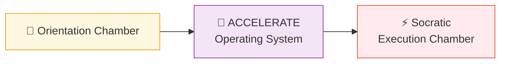
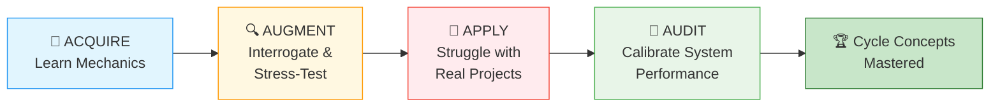
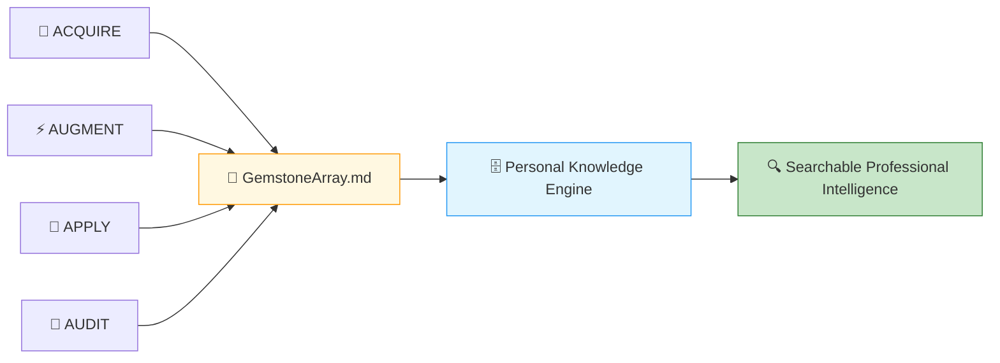
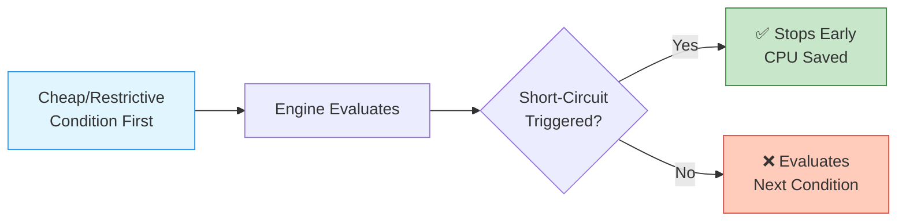

# 🗄️🤖 SQL & GenAI Course
**🎯 Quality Education for Anyone, Anywhere, Anytime — 💫 with Comfort, Convenience at no Cost**

---

## 📘 File 3: Logical Operators (powered with AI Augmentation)

Welcome back to the Socratic Mirror. You have already completed the **ACQUIRE** phase for this file and mastered combining combining multiple row-filtering criteria with `AND`, `OR`, and `NOT`. 

In this ACCELERATE cycle, we move beyond basic true/false filters to look at how database engines **evaluate** compound logic under the hood. We will examine how order of operations can cause logic errors, explore how short-circuit evaluation saves processing power, and practice finding defects in AI-generated filters.

> 📐 **Scope Reminder:** This AUGMENT file covers only **logical operators** (`AND`, `OR`, `NOT`) and their precedence. Do not introduce range filtering (`IN`, `BETWEEN`), pattern matching (`LIKE`), `NULL` handling, or aggregation. Respect the spiral. Master one cognitive layer before descending deeper.

---

## 📍 Your Current Stage – AUGMENT Journey

```mermaid
flowchart LR
    A["✅ COMPLETED<br/>📘 File 1<br/>The SELECT Clause"] --> B["✅ COMPLETED<br/>📘 File 2<br/>The WHERE Clause"] --> C["📍 YOU ARE HERE<br/>📘 File 3<br/>Logical Operators<br/>(AUGMENT)"] --> D["📘 File 4<br/>IN & BETWEEN"] --> E["📘 File 5<br/>LIKE & Wildcards"] --> F["📘 File 6<br/>NULL Handling"] --> G["📘 File 7<br/>DISTINCT & Aliases"] --> H["✅ AUGMENT COMPLETE"] --> I["🔄 RETURN TO CYCLE GUIDE<br/>TO BEGIN APPLY PHASE"]
    
    style A fill:#c8e6c9,stroke:#2e7d32
    style B fill:#c8e6c9,stroke:#2e7d32
    style C fill:#fff8e1,stroke:#ff9800,stroke-width:4px
    style D fill:#e1f5fe,stroke:#2196f3
    style E fill:#e1f5fe,stroke:#2196f3
    style F fill:#e1f5fe,stroke:#2196f3
    style G fill:#e1f5fe,stroke:#2196f3
    style H fill:#c8e6c9,stroke:#2e7d32
    style I fill:#c8e6c9,stroke:#2e7d32
```



---

## 🌀 Immersive Cognitive Traversal

You are not moving through numbered sections. You are **descending through cognitive layers**.

ACCELERATE is not a linear syllabus. It is a **spiral chamber** where each phase strips away a different veil: preparation, vocabulary, execution.



| Chamber | What You Do Here | What Leaves Your System |
|---------|------------------|-------------------------|
| **🏁 Orientation Chamber** | Load toolkits, lock scope, anchor the practice table | Confusion about where files live and what is allowed |
| **🧠 ACCELERATE Operating System** | Absorb failure taxonomy, cognitive modes, the mandate | Uncertainty about the rules of engagement |
| **⚡ Socratic Execution Chamber** | Interrogate AI scripts, analyse production echoes, extract gemstones | Passive consumption – you become an active judge |

**You cannot interrogate what you have not prepared. You cannot judge what you have not named.**

Each chamber is a **gate**. Pass through all three. Descend with intention. Emerge with judgment.

> *“Syntax teaches you to speak. These chambers teach you to judge what is worth saying.”*

**Start your SQLVerse Spiral Immersive journey.**

---

# 🏁 Phase 1: Pre‑requisites and Preparation

## 🏁 Orientation Chamber

### ⚠️ REMINDER – ACQUIRE Foundation First

Before you enter this AUGMENT chamber, you must complete the ACQUIRE foundation for this concept:

1. **Read ACQUIRE Materials** – Open the ACQUIRE lesson file mirroring this ACCELERATE file, along with its exercises, quiz, and solutions. Read them thoroughly for complete conceptual understanding.

2. **Extract ACQUIRE Gemstones** – Collect gems (skill name, objective, your viewpoint, quiz scores, exercise completions) and add them to `GemstoneArray.md` using the **ETL Workflow** described in [`SKILL_TREE_ARCHITECTURE.md`](../../../Guides/SKILL_TREE_ARCHITECTURE.md).

> 🔁 **Spiral Rule:** ACQUIRE builds foundation. ACCELERATE builds judgment. Do not skip the foundation.

**Mirror Bridge Reference:** `Level-1-beginner/Module2-BasicRetrieval-SelectAndWhere/1-sqlCommands/3-logical-operators.md`

---

### 🔧 Enhanced Browser Office for AUGMENT

**🚀 Kickstart: Any Computer, Any Browser, Anytime.**  
**🌍 Destination: Any country, Any city, Any Platform.**

| Tab | Purpose | What to Do |
| :--- | :--- | :--- |
| **1: The Map** | Read AUGMENT files | You're here – reading this file. Next: `4-in-between.md`. |
| **2: The Factory** | Run queries | Keep [`training_institution_sample.db`](../../../../Resources/sample_databases/training_institution_sample.db) loaded. Run every query you see in this file. |
| **3: The Consultant** | Socratic questioning | Configured with [`BROWSER-OFFICE-ACCELERATE.md`](../../BROWSER-OFFICE-ACCELERATE.md) – Persona prompt, SQLVerse characters. Configured with [`SCHEMA_ANCHOR_TRAINING_INSTITUTION_SAMPLE.md`](../../../SCHEMA_ANCHOR_TRAINING_INSTITUTION_SAMPLE.md). Ask about logic, never code. |
| **4: The Vault** | Save reflections & gemstones | Save all your Socratic logs in your Vault at `Learning/Level-1-beginner/ACCELERATE/01-The-Socratic-Mirror/ACQUIRE-MODULE2/1-the-sieve-select.md` using the template provided in [`SOCRATIC_LOG_TEMPLATE.md`](../../SOCRATIC_LOG_TEMPLATE.md).<br><br>If you spot any AI hallucinations, missed edge cases, or other mistakes made by the AI, save those unusual occurrences in your Vault at `Learning/Level-1-beginner/ACCELERATE/Socratic_Journals/` as a separate markdown file (e.g., `hallucination_log_1.md`, `edge_case_anomalies_1.md`). |

---

### 🛠️ ACQUIRE Module 2 Toolkit

🚀 **Foundation First, AI Next, Projects Last.**  
💎 **Gemstone by Gemstone, Skill by Skill.**

| | | |
|---|---|---|
| [Browser Office Workflow](../../../../Setup/STEP2_ESTABLISH_LEARNING_RITUAL.md) | [Knowledge Base](../../../Guides/Section1-ACQUIRE/3_Knowledge_Base.md) | [Mindset Tuning](../../../Guides/Section1-ACQUIRE/4_Mindset.md) |

---

### 🛠️ ACCELERATE Module 2 Toolkit

🚀 **AUGMENT First, APPLY Next, AUDIT Last.**  
💎 **Gemstone by Gemstone, Skill by Skill.**

| Core Pillar Guides | Optimization Strategy | Systemic Architecture |
|--------------------|----------------------|------------------------|
| 🏎️ [Query Optimization](../../../Guides/Section2-ACCELERATE/2_Query_Optimization.md) | 🧭 [ACCELERATE Atlas](../../MODULE5_GUIDE.md) | 🔄 [ACCELERATE Vision](../../ACCELERATE_VISION.md) |
| 🧠 [Socratic Method](../../../Guides/Section2-ACCELERATE/3_Socratic_Method.md) | 🪞 [Mirror Bridge](../../../Guides/Section2-ACCELERATE/4a_ACCELERATE_MIRROR.md) | 🌳 [Skill Tree Map](../../../Guides/SKILL_TREE_ARCHITECTURE.md) |

---

### 🧠 Cognitive Compression Notice

ACQUIRE prioritised clarity and guided explanation.

AUGMENT intentionally compresses information density.

You are expected to:
- pause frequently,
- interrogate assumptions,
- replay queries multiple times,
- and reflect before advancing.

Confusion under pressure is part of the spiral.

---

### 🎯 Mirror Objective

By completing this Socratic Mirror, you will be able to:

- **Identify and bypass** the hidden logic trap of operator precedence misuse.
- **Quantify** the performance cost of poorly structured `OR` chains versus `IN` clauses.
- **Trace structural coupling defects** down to application layers caused by ambiguous logical grouping.
- **Leverage Socratic reasoning prompts** to cross‑examine AI‑generated conditional logic.

In ACQUIRE, you learned how to write `AND`, `OR`, and `NOT` conditions.

In AUGMENT, your objective is different:
- detect hidden defects in AI‑generated logical conditions,
- interrogate AI assumptions about operator precedence,
- evaluate production consequences of ambiguous or inefficient logic,
- and determine whether a conditional query is architecturally trustworthy.

This chamber does not measure whether SQL executes.

It measures whether your reasoning survives pressure.

---

### 🔒 Scope Lock

This mirror is intentionally restricted to the conceptual boundaries of the ACQUIRE version.

This chamber explores:
- `AND`, `OR`, `NOT` operators
- operator precedence (`NOT` > `AND` > `OR`)
- parentheses for explicit grouping
- logical truth tables

This chamber does NOT yet include:
- range filtering (`IN`, `BETWEEN`)
- pattern matching (`LIKE`)
- `NULL` handling (`IS NULL`, `IS NOT NULL`)
- aggregation (`GROUP BY`, `HAVING`)

Respect the spiral. Master one cognitive layer before descending deeper.

---

### 📊 Our Practice Table: `students`

| Column | Type | Coupling Threat | Why |
|--------|------|----------------|-----|
| `student_id` | INTEGER | **HIGH** | Primary key – referenced everywhere |
| `first_name` | TEXT | **MEDIUM** | Displayed in UI, used in search |
| `last_name` | TEXT | **MEDIUM** | Displayed in UI, used in search |
| `email` | TEXT | **HIGH** | Used for login, notifications |
| `phone` | TEXT | **LOW** | Optional field, rarely critical |
| `enrollment_date` | DATE | **MEDIUM** | Used for reporting, segmentation |
| `total_fees` | DECIMAL | **HIGH** | Financial calculations |
| `fees_paid` | DECIMAL | **HIGH** | Financial calculations |

> ⚠️ **Data Contract Warning:** Any change to a `HIGH` coupling column will break existing applications. Ambiguous logical conditions (without parentheses) can produce unintended results that cascade through downstream systems.

---

# 🧠 Phase 2: ACCELERATE Technical Terminologies

## 🧠 ACCELERATE Operating System

### 🧭 Cognitive Operating Modes

Each phase of your journey demands a different mental posture. The table below shows what you do and where your focus should lie as you progress from learning syntax to calibrating system performance.

| Phase | Operating Mode | Focus |
|-------|----------------|-------|
| **ACQUIRE** | Learn Mechanics | Syntax, execution order, basic query writing |
| **AUGMENT** | Interrogate & Stress‑Test | Architectural judgment, AI auditing, production constraints |
| **APPLY** | Struggle with Real Projects | Implementation pressure, debugging, anti‑pattern detection |
| **AUDIT** | Calibrate System Performance | Validation, golden prompts, reasoning calibration |



---

### 🚀 ACCELERATE MANDATE

**Socratic Guidance | No Code Generation | Strategy Over Syntax | Dialogue Logging**

**ACCELERATE GOLDEN RULE:**  
*You write every line of SQL manually. AI explains logic only. Never ask for code.*

---

### 🔍 Your Personalized Google Engine

**Philosophy for Skill‑Tree Building:** *Capture first, Structure next, Persist forever.*

Every gemstone you extract becomes part of a growing, searchable intelligence archive.

Across ACQUIRE, AUGMENT, APPLY, and AUDIT, you continuously accumulate:

- architectural insights,
- debugging patterns,
- production constraints,
- Socratic reflections,
- anti-pattern discoveries,
- optimisation viewpoints,
- and implementation scars.

These are stored in:
- `GemstoneArray.md`
- Socratic journals
- Vault reflections
- solution validations
- architectural notes

Over time, this evolves into:
- your interview preparation system,
- your professional reasoning archive,
- your searchable engineering memory.



> *“The SQLVerse expands. Your portfolio becomes searchable proof of your evolution.”*

**Your Persistent Permanent Portfolio expands with every ACCELERATE file.**

---

### 🧭 ACCELERATE Extraction Compass

> **ACQUIRE = Harvesting** – The file tells you: *"These are the skills."*  
> **ACCELERATE = Mining** – The file says: *"Here is a defect. Find the skill."*

In ACCELERATE, the skill is **hidden inside the reasoning**. You must mine it from Phase 3 sections – the `🔍 Opening Reflection`, the `🛰️ Production Echo`, the `🎭 The Copilot's Script`, and the `💡 Mirror Insight Callout`. The answer is not handed to you. You must extract it through interrogation and judgment.

---

#### 💎 GEMSTONE EXTRACTION WINDOW

| Extraction Field | Your Response |
|-----------------|---------------|
| **Skill Extracted** | [To be filled during Phase 3] |
| **Objective Mastered** | [To be filled during Phase 3] |
| **Viewpoint Shifted** | [To be filled during Phase 3] |
| **Anti-pattern Defeated** | [To be filled during Phase 3] |
| **Production Constraint Validated** | [To be filled during Phase 3] |

---

#### 📋 Extraction Source Map

| Extraction Field | Where It Maps in the Schema | Where to Find It | What to Capture |
|-----------------|-----------------------------|------------------|-----------------|
| **Skill Extracted** | `skills_level1` | `🎭 The Copilot's Script` + `💡 Artisan's Insight` | The core diagnostic skill (e.g., "Detecting operator precedence misuse in `AND`/`OR` conditions") |
| **Objective Mastered** | `skills_level1` (objective_text) | `🎯 Mirror Objective` | The capability you built (e.g., "Design explicit logical conditions using parentheses") |
| **Viewpoint Shifted** | `insights_level1` | `🔗 The Architectural Guardrail` | The mental shift (e.g., "From 'Does this logic work?' to 'What is the cost of this `OR` chain at scale?'") |
| **Anti-pattern Defeated** | `bonus_skills_level1` | `🛰️ Production Echo` | The dangerous pattern you learned to avoid (e.g., "Ambiguous `AND`/`OR` logic without parentheses") |
| **Production Constraint Validated** | `bonus_skills_level1` | `🔗 The Architectural Guardrail` | The physical limitation confirmed (e.g., "Poorly structured `OR` chains can cause full table scans") |
| **Probing Question & AI Guidance** | `socratic_logs_level1` | `🔍 Probing Questions for Your AI Consultant (Tab 3)` | The question you asked and the AI's logical guidance (no code) |
| **Designer's Wisdom** | `insights_level1` | `💎 DESIGNER'S PERIGON` | The philosophical takeaway, architectural ethics, or closing reflection |

---

#### 📝 Socratic Log Extraction (for `socratic_logs_level1`)

All your `🔍 Probing Questions` are available in your Vault under `01-The-Socratic-Mirror/ACQUIRE-MODULE2/3-logical-operators.md`.

**Selection Rule:** From those questions, select only the ones that provide **unique and rare insights** for your Skill‑Tree mining.

- ✅ **Add to `socratic_logs_level1`** – if the question reveals a new perspective, edge case, or architectural nuance not already captured in `🎭 The Copilot's Script`, `🔗 The Architectural Guardrail`, or `🛰️ Production Echo`.
- ❌ **Skip** – if the question reveals the same skill or insight already documented elsewhere.

**Curate your gem collection; don't just dump everything.**

| Field | Where It Maps in the Schema | Where to Find It | What to Capture |
|-------|-----------------------------|------------------|-----------------|
| **Structural Question** | `socratic_logs_level1` (structural_question) | Your Vault – `01-The-Socratic-Mirror/...` | The probing question that gave you a unique insight |
| **AI Guidance** | `socratic_logs_level1` (ai_guidance) | Your conversation with Tab 3 | The logic/strategy the AI suggested (no code) |
| **Student Final SQL** | `socratic_logs_level1` (student_final_sql) | Your corrected version of `🎭 The Copilot's Script` | The SQL you wrote manually after the AI's guidance |
| **Initial Understanding** | `socratic_logs_level1` (initial_understanding) | Your own reflection | What you thought before asking the probing question |
| **Realised Insight** | `socratic_logs_level1` (realised_insight) | `💡 Mirror Insight Callout` | The architectural wisdom you gained from the exchange |

---

### 📓 Socratic Error Logging

Whenever the AI hallucinates, misses an edge case, or makes a logical mistake, you must log it. These entries become proof of your AI auditing skill – a portfolio asset.

**Location:** `Learning/Level-1-beginner/ACCELERATE/Socratic_Journals/`

**Naming Convention:** Use descriptive names like `hallucination_log_3.md`, `edge_case_anomaly_or_chain.md`, or `precedence_error.md`.

**What to log:**
- What the AI said (quote)
- What was actually correct
- How you caught it
- What you learned

> **Why this matters:** A portfolio of AI mistakes you caught is more impressive than a portfolio of perfect queries. It proves you lead the AI, not the other way around.

---

### 🧩 Failure Classification

Not every error is the same. Understanding the type of failure helps you diagnose problems faster and communicate risks more precisely. Use this table to classify any issue you encounter during interrogation or implementation.

| Failure Type | Description |
|--------------|-------------|
| **Syntax Failure** | Query cannot compile (e.g., misspelled column name) |
| **Logical Failure** | Query runs but produces wrong meaning (e.g., `AND` instead of `OR`) |
| **Architectural Failure** | Query works but creates scalability, maintainability, or coupling risks (e.g., poorly structured `OR` chain causing full table scan) |
| **Operational Failure** | Query damages application/system behaviour under production conditions (e.g., ambiguous logic causing incorrect data extraction) |

---

# ⚡ Phase 3: Enter the AUGMENT Chamber and Execute

## ⚡ Socratic Execution Chamber

### 🔍 Cognitive Reorientation Layer

#### The Socratic Mirror for Logical Operators

In a small sandbox environment, combining search terms seems simple. If you write a filter using mixed operators without **explicit grouping**, the database engine will still return an answer.

However, as an SQLVerse Artisan, you must understand that database engines evaluate logical conditions in a strict order. Just as in mathematics where multiplication happens before addition, SQL engine parsers evaluate `AND` conditions before `OR` conditions. If you **mix** these operators **without using parentheses** to set the grouping, the engine will group them implicitly, which can easily lead to incorrect data filtering.


**The Artisan's response is not to accept the implicit grouping, but to make it explicit.**

If we need to find students who are either high‑fee payers or early enrollees, we might be tempted to write:

```sql
SELECT first_name, last_name, total_fees, enrollment_date
FROM students
WHERE total_fees > 5000 OR enrollment_date < '2024-02-01';
```

The query runs perfectly. No syntax errors. In our database, it returns a handful of rows – perfectly acceptable.

But as an **SQLVerse Artisan**, you must question the prudence behind the query. What is wrong with it?

- In a production environment with millions of rows, an unoptimised `OR` chain can force a full table scan if neither side uses an index effectively.
- The query returns **every row** that satisfies either condition – which might be the entire table.
- The database scans the entire table. The network transmits every row. The application processes useless data.

Now consider the optimised version – with explicit parentheses and index‑friendly conditions:

```sql
SELECT first_name, last_name, total_fees, enrollment_date
FROM students
WHERE (total_fees > 5000 OR enrollment_date < '2024-02-01')
  AND fees_paid > 0;
```

The first query was **syntactically perfect**. The second query is **architecturally responsible**. The difference is **judgment** – not syntax.

---

### 🔍 Opening Reflection: The Operator Precedence Trap

An unguided AI assistant is asked to find all students who either have high total fees (greater than 5000) or low total fees (less than 2000), but only if they have actually paid something towards their balance (`fees_paid > 0`). It delivers this filter structure:

```sql
SELECT student_id, total_fees, fees_paid 
FROM students 
WHERE total_fees > 5000 OR total_fees < 2000 AND fees_paid > 0;
```

The query runs. In a tiny training database, it returns results. But as an **SQLVerse Artisan**, you notice the ambiguity.

### 🧠 Critical Cross‑Examination

- **The Structural Flaw:** Because the database evaluates `AND` before `OR`, it processes the condition as:  
  `total_fees > 5000 OR (total_fees < 2000 AND fees_paid > 0)`

- **The Logic Error:** Did this filter accidentally include students with high fees who have paid absolutely nothing?

- **The Solution:** How does adding clear grouping parentheses change the query plan to enforce your intended business logic?

```sql
SELECT student_id, total_fees, fees_paid 
FROM students 
WHERE (total_fees > 5000 OR total_fees < 2000) AND fees_paid > 0;
```
- **The AI's version** – syntactically correct, logically correct (depending on intention), but **ambiguous**.
- **The Artisan's version** – explicit, maintainable, immediately understandable.

AI generates **working code**, not necessarily unambiguous code. The difference is **judgment**. Always ask: *“Is the grouping clear?”*

---

### 🛰️ Production Echo

### Case 1 – Banking Premium Customer Dashboard

**Business Scenario:** A digital banking application used `WHERE account_type = 'savings' OR balance > 10000 AND active = TRUE` to populate a premium customer dashboard. The original filtering logic relied on the `AND` having higher precedence than `OR`.

**The Query:** `WHERE account_type = 'savings' OR balance > 10000 AND active = TRUE`

**New Enhancement:** During a regulatory update, a new `account_type` value (`'joint_savings'`) was introduced.

**Problem Encountered:** The query returned only savings accounts (regardless of balance) or active high‑balance accounts. The newly introduced `'joint_savings'` accounts were never included because the precedence rule grouped `balance > 10000 AND active = TRUE` together.

**Analysis:** The query relied on implicit operator precedence instead of explicit grouping. The ambiguous logic caused incorrect customer segmentation.

**The Corrected Strategy:** `WHERE (account_type = 'savings' OR account_type = 'joint_savings') AND active = TRUE` – or better, with explicit parentheses.

**The Lesson:** Never rely on implicit precedence. Always use parentheses to make your logical intent explicit.

**The Footprint:** A single ambiguous logical condition caused incorrect customer segmentation for thousands of joint savings account holders.

---

### Case 2 – Enterprise Billing Collection

**Business Scenario:** An enterprise billing application generated collection reports for commercial accounts. The system was designed to find accounts with overdue balances where the account status was either active or suspended.

**The Query:** `WHERE status = 'Active' OR status = 'Suspended' AND overdue_days > 90`

**Problem Encountered:** The application sent automated collection notices to thousands of perfectly fine, active accounts that owed nothing. This caused a massive wave of customer complaints and overwhelmed the support team.

**Analysis:** The lack of grouping parentheses caused the engine to evaluate the `AND` condition first. As a result, the filter pulled every single account with an `'Active'` status, completely ignoring the 90‑day overdue requirement for those rows.

**The Corrected Strategy:** `WHERE (status = 'Active' OR status = 'Suspended') AND overdue_days > 90` – adding parentheses explicitly forces the engine to evaluate the status options together before applying the overdue tracking condition.

**The Lesson:** Never rely on implicit precedence. Always use parentheses to make your logical grouping explicit.

**The Footprint:** Unfiltered data caused an automated system to email the wrong clients, disrupting business operations and damaging customer trust.

---

### 🧩 Failure Evaluation Matrix

| Failure Type | Case 1 (Banking) | Case 2 (Billing) | Explanation |
|--------------|------------------|------------------|-------------|
| **Syntax Failure** | ❌ No | ❌ No | Both queries compiled without errors |
| **Logical Failure** | ❌ No | ✅ Yes | Case 2 returned incorrect rows due to precedence; Case 1 returned correct rows before new `account_type` was added |
| **Architectural Failure** | ✅ Yes | ❌ No | Case 1 relied on implicit precedence – fragile when new values appeared |
| **Operational Failure** | ✅ Yes | ✅ Yes | Both caused real-world damage: incorrect customer segmentation, customer complaints flooded support |

---

### 🔗 The Architectural Guardrail: Production Reality

In ACQUIRE, you learned the Artisan's Warning regarding operator precedence. Let's quantify that warning using systemic constraints of hardware architecture.

When you execute a complex logical query against a DBMS, the engine must evaluate each condition in the correct order. Poorly structured `OR` chains can prevent index usage.

Let us look at the cost involved between an **Optimised Index‑Aware Condition** and an **Ambiguous `OR` Chain**.

### 🔗 The Architectural Guardrail: Short‑Circuit Performance

Database engines use a performance optimization called **Short‑Circuit Evaluation** when processing filters.

| Operator | Short‑Circuit Rule | Benefit |
|----------|-------------------|---------|
| **`AND`** | If the first condition is `FALSE`, the engine stops and ignores the second condition | Saves CPU cycles – avoids evaluating expensive conditions unnecessarily |
| **`OR`** | If the first condition is `TRUE`, the engine stops and ignores the second condition | Saves CPU cycles – avoids evaluating expensive conditions unnecessarily |

### The Artisan's Edge: Condition Ordering

An experienced engineer can use this behavior to write **highly efficient queries**.



**The Rule:** Place the **most restrictive** or **lowest‑cost** condition first in an `AND` block. This prevents the database engine from wasting CPU cycles evaluating more complex conditions for rows that will be filtered out anyway.

**Example:**
```sql
-- ❌ Inefficient: Expensive condition first
WHERE LOWER(last_name) LIKE '%son' AND fees_paid > 0

-- ✅ Efficient: Restrictive condition first
WHERE fees_paid > 0 AND LOWER(last_name) LIKE '%son'
```

> 💡 **Artisan's Insight:** Short‑circuit evaluation is not a hidden trick – it is a **performance lever**. Use it intentionally. Write conditions in order of restrictiveness, not convenience.


---

### 🎭 The Copilot's Script

A developer needs to review high-value student records that require immediate financial attention. They want to find profiles where the total fees are high (greater than 4000) and the student has not made any payments yet. The AI assistant returns this query:


```sql
-- Generated by AI assistant to find high-value unpaid accounts
SELECT student_id, total_fees, fees_paid 
FROM students 
WHERE NOT fees_paid > 0 AND total_fees > 4000;
```

### A Panoramic View of the Copilot's Script

#### Interrogation Questions

Execute the **Copilot's Script code snippet** inside **Tab 2 (The Factory)** against the loaded `training_institution_sample.db`.

**Interrogation Question 1:** Look at the NOT fees_paid > 0 condition. While this works perfectly fine, how can you rewrite this using standard comparison operators to make the query easier to read and maintain?

**Interrogation Question 2:** Based on the rules of short-circuit evaluation, if most students in your database have already paid some fees (fees_paid > 0), does placing this condition first help the query run faster?


> 💡 **Artisan's Insight:** Negative logic (`NOT fees_paid > 0`) is syntactically valid but cognitively expensive. The Artisan simplifies: `fees_paid = 0`. Clear conditions are faster to read, faster to maintain, and – when placed first in an `AND` block – can trigger short‑circuit evaluation to save CPU cycles.

#### 💡 Mirror Insight Callout

```sql
-- How the AI wrote it (using complex negative logic):
WHERE NOT fees_paid > 0 AND total_fees > 4000
```

-- How an experienced engineer writes it for clarity and portability:
```sql
WHERE fees_paid = 0 AND total_fees > 4000
```

> 💡 **MIRROR INSIGHT**
>
> *The query planner will evaluate your logic conditions in a specific order. Writing explicit conditions and structuring your query to take advantage of short-circuit evaluation saves processing power and makes your code much easier to maintain.*

---

### 🔍 Probing Questions for Your AI Consultant (Tab 3)

Paste these investigative prompts into Tab 3 to deconstruct logical operator principles. **Do not ask for SQL code**; focus entirely on the architectural reasoning.

1. *“How does an SQL parsing engine determine the evaluation priority when a `WHERE` clause contains a mix of `AND`, `OR`, and `NOT` operators without any parentheses?”*

2. *“Can you explain how short‑circuit evaluation works in relational database engines, and how the order of conditions in an `AND` block can affect CPU utilization?”*

3. *“What are the performance differences between using a `NOT` operator combined with a comparison operator versus using the opposite comparison operator directly?”*

4. *“What is the structural difference between `AND` and `OR` in terms of query result sets? How does each affect the number of rows returned?”*

5. *“How does an AI‑generated `WHERE` clause with ambiguous `AND`/`OR` grouping become a production hazard at scale?”*

6. *“What happens when you combine `NOT` with `AND` and `OR`? How does `NOT` affect precedence and the overall evaluation order?”*

7. *“What is the difference between a logical error (e.g., using `AND` instead of `OR`) and an architectural error (e.g., ambiguous precedence) in a `WHERE` clause?”*

8. *“If a `WHERE` clause uses `OR` with multiple conditions, how does the query optimiser decide whether to use an index? What factors influence this decision?”*

9. *“How would you rewrite a query with multiple `OR` conditions to improve performance and clarity without using `IN`?”*

10. *“Why do production SQL queries almost always use parentheses when mixing `AND` and `OR`? What risks does ambiguous grouping introduce to application stability, data correctness, and maintainability?”*

---

### 🧪 Socratic Reflection Probe

Before you cross the bridge to the Exercise Bay, paste this exact **Golden Calibration Prompt** into your Consultant (**Tab 3**) to stress-test your baseline mental models:

> **Golden Prompt:** *“I am evaluating logical grouping boundaries. Explain how an ambiguous `WHERE` clause (without parentheses) introduces an invisible operational defect in a production system when new conditions are added, and detail how explicit grouping protects application stability, data correctness, and maintainability.”*

---

### 💎 GEMSTONE EXTRACTION WINDOW

| Extraction Field | Your Response |
|-----------------|---------------|
| **Skill Extracted** | Detecting ambiguous `AND`/`OR` grouping without parentheses |
| **Objective Mastered** | Designing explicit logical conditions using parentheses |
| **Viewpoint Shifted** | From “Does this logic work?” to “What is the cost of this `OR` chain at scale?” |
| **Anti-pattern Defeated** | Ambiguous `AND`/`OR` logic without parentheses (operator precedence reliance) |
| **Production Constraint Validated** | Index usage, network payload, and maintainability matter – even more when logical grouping is ambiguous |

---

### ✅ Progress Check (AUGMENT)

Can you confidently answer the following before descending to the next layer?

- [ ] Do you look for ambiguous `AND`/`OR` grouping without parentheses?
- [ ] Can you map the performance variance between an optimised `IN` clause and a poorly structured `OR` chain?
- [ ] Do you understand why ambiguous grouping creates an operational defect that the database cannot detect?

**If yes → You're ready for File 4: IN & BETWEEN (AUGMENT).**

---

## 📝 Example Portfolio Entry – File 3: Logical Operators

Below is a concrete example of how to populate your Skill‑Tree tables from the insights and skills you extract in this file. Use this as a model when creating your own entries.

**Source File:** `3-logical-operators.md`

---

### 💎 Insert into `skills_level1`

```sql
INSERT INTO skills_level1 (module_id, filename, skill_name, objective_text, student_viewpoint)
VALUES (
    2, '3-logical-operators.md',
    'Detecting ambiguous AND/OR grouping without parentheses',
    'Identify and question SQL queries that mix `AND` and `OR` without explicit parentheses, especially when the logic is ambiguous or relies on precedence.',
    'I used to think operator precedence was a reliable rule. Now I look for ambiguous grouping and add parentheses to make the logic undeniable.'
);
```

### 💡 Insert into `insights_level1`

```sql
INSERT INTO insights_level1 (module_id, source_filename, insight_text, student_viewpoint)
VALUES (
    2, '3-logical-operators.md',
    'A database engine follows precedence rules. It does not know your intention. Write queries where the intention is undeniable.',
    'I realised that operator precedence is not a style choice – it is a structural contract. Ambiguous grouping creates hidden dependencies that break when new conditions are added.'
);
```

### 🏆 Insert into `achievements_level1`

```sql
INSERT INTO achievements_level1 (achievement_type, module_id, source_filename, score_or_status, student_viewpoint)
VALUES (
    'Simulation', 2, '3-logical-operators.md', 'Socratic Log Saved',
    'Successfully executed the Golden Calibration Prompt against the AI consultant. Calibrated my understanding of logical grouping boundaries and production scale.'
);
```

### 💎 Insert into `bonus_skills_level1`

```sql
-- Case 1: Banking Premium Customer Dashboard
INSERT INTO bonus_skills_level1 (module_id, bonus_skill_name, source_filename)
VALUES (
    2,
    'Explicit grouping for AND/OR logic – implicit precedence causes fragility when new values appear',
    '3-logical-operators.md'
);

-- Case 2: Enterprise Billing Collection
INSERT INTO bonus_skills_level1 (module_id, bonus_skill_name, source_filename)
VALUES (
    2,
    'Always use parentheses to make logical grouping explicit – ambiguous AND/OR logic leads to operational disasters',
    '3-logical-operators.md'
);
```

### 📝 Insert into `socratic_logs_level1`

```sql
INSERT INTO socratic_logs_level1 (
    module_id, sub_module, cycle, filename,
    structural_question, ai_guidance, student_final_sql,
    initial_understanding, realised_insight
) VALUES (
    2, 'ACQUIRE-MODULE2', 'AUGMENT', '3-logical-operators.md',
    'What is the difference between an ambiguous `AND`/`OR` condition and an explicit one with parentheses?',
    'Relying on precedence creates fragile code. Explicit parentheses make your intention clear to both the database and other engineers.',
    'SELECT student_id, first_name, last_name, total_fees, fees_paid FROM students WHERE (total_fees > 5000 OR enrollment_date < ''2024-02-01'') AND fees_paid > 0;',
    'I thought precedence rules were reliable enough.',
    'A database engine follows precedence rules. It does not know your intention. Write queries where the intention is undeniable.'
);
```


> 📌 **Note:** Example Portfolio Entries have been provided for **File 1**, **File 2**, and **File 3** as guidance. From **File 4 onwards**, you are expected to extract gemstones independently into `GemstoneArray.md` as you work through each file. At the end of the module, you will apply the **ETL Workflow** (Export → CSV → Import) to update your Skill‑Tree database in one batch.

---

# 💎 DESIGNER'S PERIGON

<div style="border: 3px solid #9c27b0; border-radius: 10px; padding: 20px; margin: 25px 0; background: linear-gradient(135deg, #f3e5f5 0%, #e1bee7 100%);">

### *The Art of Logical Precision*

You have just interrogated logical operators. You did not learn new syntax. You learned something rarer: **how to judge whether a condition is clear**.

The AI gave you a query with ambiguous grouping. In a small training database, it worked. In production, it would have caused incorrect data extraction. The role of a true developer isn't simply to get a query to execute successfully; it is to implement deliberate boundaries that protect application stability, minimize resource utilization, and maximize performance under heavy system load.

When you sit down with an AI Copilot, its default prompt parameters favour immediate completion over long‑term clarity. It will omit parentheses because it assumes the reader understands precedence rules.

But as an Artisan of the SQLVerse, you recognise that ambiguous logic is **debt drawn on future maintainability**. The discipline of explicit parentheses is not a formatting preference; it is a defensive wall constructed to keep your data pipelines predictable, accurate, and insulated against logic drift.

> *“A beginner relies on precedence. An Artisan makes their intent undeniable.”*

In ACQUIRE, you learned to speak SQL. In AUGMENT, you learn to judge it.

This is the shift from **operator** to **architect**. From **correctness** to **judgment**.

---

## ⚡ The SQLVerse Witness

**Business Requirement:** Arjun wants to identify high‑spending vehicles at the toll plaza – those that have purchased fuel, shopped at the convenience store, and had coffee or snacks at the cafe.

**The Artisan's Edge:**
```sql
SELECT license_plate, 
       SUM(toll_fee + fuel_amount + store_amount + cafe_amount) AS total_revenue
FROM toll_transactions
WHERE (fuel_amount > 0 OR store_amount > 0 OR cafe_amount > 0)
  AND total_revenue > 5000;
```

A careless query would rely on implicit precedence or miss the grouping. The SQLVerse Artisan uses explicit parentheses to ensure the logic is undeniable – intentional, scalable, and production‑ready.

</div>

---

## 🔁 Bridge Forward

You have interrogated logical operators.

Next, you will move to the next AUGMENT lesson: **IN & BETWEEN** – where you will interrogate range filtering, the cost of multiple `OR` conditions versus `IN`, and the precision of boundary conditions.

---

## 🧭 File Navigation

```mermaid
flowchart LR
    A["✅ COMPLETED<br/>📘 File 1<br/>The SELECT Clause"] --> B["✅ COMPLETED<br/>📘 File 2<br/>The WHERE Clause"] --> C["✅ COMPLETED<br/>📘 File 3<br/>Logical Operators"] --> D["📘 File 4<br/>IN & BETWEEN"] --> E["📘 File 5<br/>LIKE & Wildcards"] --> F["📘 File 6<br/>NULL Handling"] --> G["📘 File 7<br/>DISTINCT & Aliases"] --> H["✅ AUGMENT COMPLETE"] --> I["🔄 RETURN TO CYCLE GUIDE"]
    
    style A fill:#c8e6c9,stroke:#2e7d32
    style B fill:#c8e6c9,stroke:#2e7d32
    style C fill:#c8e6c9,stroke:#2e7d32
    style D fill:#e1f5fe,stroke:#2196f3
    style E fill:#e1f5fe,stroke:#2196f3
    style F fill:#e1f5fe,stroke:#2196f3
    style G fill:#e1f5fe,stroke:#2196f3
    style H fill:#c8e6c9,stroke:#2e7d32
    style I fill:#c8e6c9,stroke:#2e7d32
```



| Previous Step | Next Step |
|:---:|:---:|
| [← Return to File 2: The WHERE Clause](./2-the-where-clause.md) | [Continue to File 4: IN & BETWEEN →](./4-in-between.md) |

---

*Part of our mission for 🎯 Quality Education for Anyone, Anywhere, Anytime — 💫 with Comfort, Convenience at no Cost.*

**Level 1 | ACCELERATE Phase | AUGMENT | Next: IN & BETWEEN**


