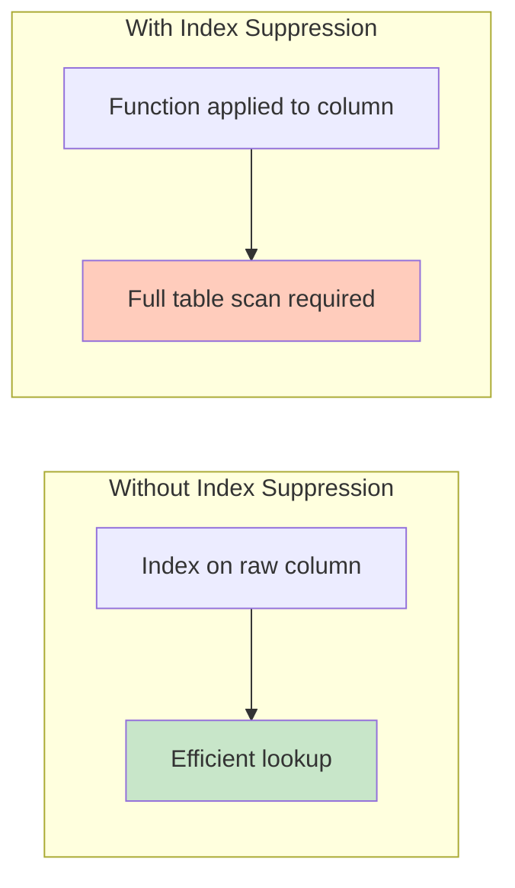

# 🗄️🤖 SQL & GenAI Course
**🎯 Quality Education for Anyone, Anywhere, Anytime — 💫 with Comfort, Convenience at no Cost**

---

## 📘 File 4: IN & BETWEEN – Cleaner Filters (powered with AI Augmentation)

Welcome back to the Socratic Mirror. You have already completed the **ACQUIRE** phase for this file and mastered filtering with `IN` and `BETWEEN`. In this **ACCELERATE** cycle, we exit the sandbox of basic syntax to interrogate how an AI Copilot handles set membership and range filtering, evaluate the hidden cost of poorly structured `IN` lists, and challenge your architectural judgment.

> 📐 **Scope Reminder:** This AUGMENT file covers only **`IN`** and **`BETWEEN`** operators (set membership, inclusive ranges). Do not introduce pattern matching (`LIKE`), `NULL` handling, or aggregation. Respect the spiral. Master one cognitive layer before descending deeper.

---

## 📍 Your Current Stage – AUGMENT Journey


---

## 🌀 Immersive Cognitive Traversal

ACCELERATE is not a linear syllabus. It is a **spiral chamber** where each phase strips away a different veil: preparation, vocabulary, execution.

| Chamber | What You Do Here | What Leaves Your System |
|---------|------------------|-------------------------|
| **🏁 Orientation Chamber** | Load toolkits, lock scope | Confusion about what is allowed |
| **🧠 ACCELERATE Operating System** | Absorb the mandate | Uncertainty about the rules of engagement |
| **⚡ Socratic Execution Chamber** | Interrogate AI scripts, analyse production echoes | Passive consumption – you become an active judge |

**You cannot interrogate what you have not prepared. You cannot judge what you have not named.**

Each chamber is a **gate**. Pass through all three. Descend with intention. Emerge with judgment.

**Start your SQLVerse Spiral Immersive journey.**

---
<div style="border: 2px solid #ff9800; border-radius: 10px; padding: 15px; margin: 20px 0; background: linear-gradient(135deg, #fff8e1 0%, #ffe0b2 100%);">

### 📘 Framework Reference

The complete **Phase 1 (Orientation Chamber)** and **Phase 2 (ACCELERATE Operating System)** – including Browser Office, Toolkits, Cognitive Compression Notice, Extraction Compass, Failure Classification, and all other framework content – has been compiled into a single reference document.

You do not need to read it every time. Keep it handy and refer to it whenever you need to revisit the ACCELERATE setup or terminologies.

📁 [`ACCELERATE_FRAMEWORK_REFERENCE.md`](./ACCELERATE_FRAMEWORK_REFERENCE.md)

</div>

---

# 🏁 Phase 1: Pre‑requisites and Preparation

## 🏁 Orientation Chamber

### ⚠️ REMINDER – ACQUIRE Foundation First

Before you enter this AUGMENT chamber, you must complete the ACQUIRE foundation for this concept:

1. **Read ACQUIRE Materials** – Open the ACQUIRE lesson file mirroring this ACCELERATE file, along with its exercises, quiz, and solutions. Read them thoroughly for complete conceptual understanding.

2. **Extract ACQUIRE Gemstones** – Collect gems and add them to `GemstoneArray.md` using the **ETL Workflow** described in `SKILL_TREE_ARCHITECTURE.md`.

> 🔁 **Spiral Rule:** ACQUIRE builds foundation. ACCELERATE builds judgment. Do not skip the foundation.

**Mirror Bridge Reference:** `Level-1-beginner/Module2-BasicRetrieval-SelectAndWhere/1-sqlCommands/4-in-between.md`

---

### 🎯 Mirror Objective

By completing this Socratic Mirror, you will be able to:

- **Identify and bypass** the hidden logic trap of expensive, unoptimised `IN` lists.
- **Quantify** the performance cost of large `IN` lists versus `JOIN` or `EXISTS` alternatives.
- **Trace structural coupling defects** down to application layers caused by hard‑coded value lists that drift over time.
- **Leverage Socratic reasoning prompts** to cross‑examine AI‑generated set membership and range filters.

In ACQUIRE, you learned how to write `IN` and `BETWEEN` conditions.

In AUGMENT, your objective is different:
- detect hidden defects in AI‑generated set membership logic,
- interrogate AI assumptions about list size and data distribution,
- evaluate production consequences of large or unbounded `IN` lists,
- and determine whether a range filter is architecturally trustworthy.

This chamber does not measure whether SQL executes. It measures whether your reasoning survives pressure.

---

### 🔒 Scope Lock

This mirror is intentionally restricted to the conceptual boundaries of the ACQUIRE version.

This chamber explores:
- `IN` operator (set membership)
- `BETWEEN` operator (inclusive range)
- `NOT IN` and `NOT BETWEEN`
- Performance implications of large `IN` lists

This chamber does NOT yet include:
- pattern matching (`LIKE`)
- `NULL` handling (`IS NULL`, `IS NOT NULL`)
- aggregation (`GROUP BY`, `HAVING`)

Respect the spiral. Master one cognitive layer before descending deeper.

---

# 🧠 Phase 2: ACCELERATE Technical Terminologies

## 🧠 ACCELERATE Operating System

### 🚀 ACCELERATE MANDATE

**Socratic Guidance | No Code Generation | Strategy Over Syntax | Dialogue Logging**

**ACCELERATE GOLDEN RULE:**  
*You write every line of SQL manually. AI explains logic only. Never ask for code.*

---
## 🧩 High-Density Glossary : New Buzzwords

### Query Execution Plan (QEP)

The **Query Execution Plan** is the database engine's internal roadmap for running your query. It describes:
- Which **indexes** are used (or not)
- The **order** of operations (e.g., scan, filter, join)
- The **cost** estimates for each step

Think of it as the engine's strategy for retrieving your data efficiently.

> 💡 **You can see the execution plan** in SQLite Online by prefixing your query with `EXPLAIN QUERY PLAN`. Example:
> ```sql
> EXPLAIN QUERY PLAN SELECT * FROM students WHERE total_fees > 4000;
> ```
> This shows you whether the database is using an index or performing a full table scan.

 **Why this matters:** When you understand the execution plan, you can predict how your query will perform before you run it. This is the difference between guessing and engineering.

---

### API Gateway

An **API Gateway** is a server that acts as a single entry point for all client requests to a backend system. It routes requests to the appropriate services, handles authentication, rate limiting, and often manages load balancing.

**Why this matters:** When a query runs slowly, it can cause timeouts at the API Gateway level – meaning the entire request fails before the database even finishes executing. This is why query performance is not just a database concern; it is a **system‑wide architectural concern**.

> 💡 **Production Echo Connection:** In the logistics case, the massive `IN` list caused CPU spikes, which led to webhook timeouts at the API Gateway. The symptom appeared as a network failure – but the root cause was a poorly structured query.

---

### Why These Buzzwords Matter

Understanding these terms helps you:
- **Diagnose performance issues** at the system level
- **Communicate** with backend engineers and architects
- **Design queries** that respect the entire data pipeline, not just the database

---


# ⚡ Phase 3: Enter the AUGMENT Chamber and Execute

## ⚡ Socratic Execution Chamber

### 🔍 Cognitive Reorientation Layer

#### The Set vs. Contiguous Range Paradox

To a beginner, `IN` and `BETWEEN` feel interchangeable under certain conditions. For instance, filtering IDs 1, 2, and 3 can be written as a discrete explicit array set: `IN (1, 2, 3)` – or as a contiguous line bounds: `BETWEEN 1 AND 3`.

But underneath the parser, the database engine treats these structures completely differently.

| Pattern | Execution Strategy | Index Impact |
|---------|-------------------|--------------|
| `BETWEEN 1 AND 3` | Bounded range scan – evaluates lower and upper constraints | Can leverage index effectively |
| `IN (1, 2, 3)` | Set membership – translates to a series of discrete equality evaluations (OR logic) | May force multiple index lookups or full scan |

When your data scaling factors shift from single units to hundreds of thousands, selecting the wrong abstraction breaks index utilization and destroys query performance.

> 💡 **Artisan's Insight:** `BETWEEN` and `IN` are syntactically similar, but architecturally distinct. One is a range boundary. The other is a membership test. Know the difference.

---

In a small sandbox environment, filtering by a short list of values or a simple range seems trivial. If you write `WHERE column IN (1, 2, 3)`, the database returns the correct rows instantly.

But as an **SQLVerse Artisan**, you must look beyond the query itself.

- What happens when the `IN` list contains hundreds or thousands of values?
- What is the database doing internally – is it using an index, or is it scanning the entire table?
- How does `BETWEEN` behave with dates that span years, and what is the memory footprint of that range?

`IN` and `BETWEEN` are not just syntax – they are **performance contracts**. When you use them, you are making assumptions about data volume, index availability, and query execution plans.

The Artisan's response is not to accept the default execution, but to **understand the cost**.

---
## 🔍 Opening Reflection

### The Trusted Filter Trap


A developer needs to check if a customer is from one of the approved regions for a promotional campaign. They write:

```sql
SELECT customer_id, name, region
FROM customers
WHERE region IN ('North', 'South', 'East', 'West');
```

**Business Context:** The list of approved regions is derived from a business document and manually maintained.

**Reflection Question 1:** What happens when a new region is added to the business document – or a region is renamed? How does the hard‑coded `IN` list handle schema or business rule changes?

**Reflection Question 2:** If the approved regions list grows to 50 or 100 values, how does query performance degrade? What happens to the query execution plan?

### 🧠 Critical Cross‑Examination

- **The Structural Flaw:** A hard‑coded `IN` list is static – it does not evolve with the business. It assumes the set of values is known and stable.

- **The Logic Error:** If a new region is added and the query is not updated, the application may exclude valid customers without any error.

- **The Solution:** Consider storing the approved regions in a lookup table and using a `JOIN` or subquery. This makes the list dynamic and queryable.

```sql
SELECT c.customer_id, c.name, c.region
FROM customers c
JOIN approved_regions ar ON c.region = ar.region_name;
```

- **The AI's version** – syntactically correct, logically correct (for the current set), but **brittle**.
- **The Artisan's version** – dynamic, maintainable, and adaptable to change.

AI generates **working code**, not necessarily resilient code. The difference is **judgment**. Always ask: *“Is this list stable, or will it change?”*

---
### The Boundary Edge Inclusion Failure

An automation routine needs to extract student profiles enrolled in a specific operational window: anytime from the start of February up to the final second of April. The automated assistant produces this filter:

```sql
SELECT student_id, first_name, enrollment_date 
FROM students 
WHERE enrollment_date BETWEEN '2026-02-01' AND '2026-04-30';
```

### 🧠 Critical Cross‑Examination

- **The Implicit Trap:** The `BETWEEN` operator is strictly inclusive of both endpoints.

- **The Silent Edge Case Failure:** If the `enrollment_date` column is altered in production to a `DATETIME` stamp, does this query capture a student who registers on `'2026-04-30 14:30:00'`?

- **The Architectural Consequence:** Because a plain string text date literal translates implicitly to `'2026-04-30 00:00:00'`, every record created during the final day of the target range is silently omitted. The query is syntactically flawless but operationally broken.

- **The Solution:** Use an explicit upper bound that excludes the following day:

```sql
SELECT student_id, first_name, enrollment_date 
FROM students 
WHERE enrollment_date >= '2026-02-01' 
  AND enrollment_date < '2026-05-01';
```

- **The AI's version** – syntactically correct, logically correct (for `DATE` columns), but **fragile** when data types evolve.
- **The Artisan's version** – explicit, safe, and resilient to schema changes.

AI generates **working code**, not necessarily future‑proof code. The difference is **judgment**. Always ask: *“What happens if this data type changes?”*

---

## 🛰️ Production Echo

### Case 1 – Digital Payments Platform

**Business Scenario:** A digital payments platform used `WHERE country IN ('US', 'UK', 'CA')` to determine which transactions qualified for a new feature.

**The Query:** `WHERE country IN ('US', 'UK', 'CA')`

**New Enhancement:** The business expanded to Germany (`'DE'`) and France (`'FR'`). The `IN` list was updated – but the database index wasn't. The query performance degraded rapidly as the list grew.

**Problem Encountered:** The query performed a full table scan because the `IN` list was too large for the optimiser to use the index effectively. Response times increased from milliseconds to seconds.

**Analysis:** The query relied on a static `IN` list that grew unchecked. The performance bottleneck was not the query syntax – it was the data volume.

**The Corrected Strategy:** Replace the hard‑coded `IN` list with a `JOIN` to a `eligible_countries` table.

**The Lesson:** Static `IN` lists do not scale. When lists grow, performance degrades. Use `JOIN` or `EXISTS` for dynamic, maintainable filtering.

**The Footprint:** A single static `IN` list caused widespread performance degradation across the platform.

---

### Case 2 – International Logistics Platform

**Business Scenario:** An international logistics platform tracked package dispatches using state code identifiers. A query was generated to filter shipments traveling through core transport corridors.

**The Query:** `WHERE route_state_id IN ('NY', 'NJ', 'PA', 'CT', 'MA', 'RI', 'VT', 'NH', 'ME', ... up to 45 more states ...)`

**Problem Encountered:** As the set within the `IN` clause grew to contain dozens of elements, database CPU consumption spiked to 100%, causing webhook timeouts across the API gateway.

**Analysis:** The database query optimizer struggled to evaluate a massive discrete set. Instead of executing an efficient range scan, the engine was forced to convert the internal execution plan into an immense, nested tree of evaluation operations.

**The Corrected Strategy:** When sets become massive and sequential, the architecture must transition either to a normalized lookup table or a bounded range filter (`BETWEEN`) to avoid memory pool saturation.

**The Lesson:** Large `IN` lists are not free. They consume CPU, memory, and execution time. Use lookup tables or range filters when sets grow beyond a handful of values.

**The Footprint:** A massive `IN` list caused CPU spikes and API timeouts, disrupting logistics operations.

---

### 🧩 Failure Evaluation Matrix

| Failure Type | Case 1 (Payments) | Case 2 (Logistics) | Explanation |
|--------------|-------------------|--------------------|-------------|
| **Syntax Failure** | ❌ No | ❌ No | Both queries compiled without errors |
| **Logical Failure** | ❌ No | ❌ No | Both returned correct rows for their current lists |
| **Architectural Failure** | ✅ Yes | ✅ Yes | Both relied on hard‑coded `IN` lists that grew beyond optimal size |
| **Operational Failure** | ✅ Yes | ✅ Yes | Query timeouts and CPU spikes disrupted operations |

---

## 🔗 The Architectural Guardrail

### The True Cost of IN Lists

When you write `WHERE column IN (value1, value2, ...)`, the database engine must evaluate the list. For small lists, this is fine. For large lists, it can be expensive.

### The Cost Matrix

| Metric | Small `IN` List (1-10 values) | Large `IN` List (100-1000+ values) |
|--------|-------------------------------|-------------------------------------|
| **Index Usage** | Likely uses index | May force full table scan |
| **Memory Footprint** | Minimal | Significant – list must be stored and evaluated |
| **Execution Plan** | Simple | Complex – may need to sort or hash the list |
| **Maintainability** | Manageable | Prone to errors and omissions |

### The Artisan's Edge

- **For small, stable lists** – `IN` is appropriate.
- **For large or dynamic lists** – use a `JOIN` to a lookup table.
- **For lists derived from application logic** – consider whether the database should know these values.

---
###  Index Suppression

When writing range parameters, look out for **Index Suppression**. If you wrap a filtered column in a scalar manipulation function to clean up data inconsistencies, you destroy the storage engine's ability to locate values using an index.

```sql
-- ❌ Inefficient: Column manipulation suppresses index utilization
WHERE INT(student_id) BETWEEN 100 AND 500
```

### Why This Happens

The database stores indexes on the **raw column values**. When you apply a function like `INT()`, `UPPER()`, `DATE()`, or `CAST()` to the column, the engine cannot use the index because it would need to compute the function for every row before comparing.



### The Artisan's Edge

- **Before filtering**, clean the data in a separate step (e.g., via `UPDATE` or `ALTER`).
- **Use `BETWEEN` on the raw column** without wrapping it in a function.
- **Design your schema** so that data is stored in the format you need for filtering.

```sql
-- ✅ Efficient: Raw column used directly
WHERE student_id BETWEEN 100 AND 500
```

> 💡 **Artisan's Insight:** Indexes are your most powerful performance tool. Never sabotage them by wrapping columns in functions inside your `WHERE` clause.

---

## 🎭 The Copilot's Script

###  The Trusted Filter Trap

A developer needs to review student records for a specific set of courses:

```sql
-- Generated by AI assistant to find students in specific courses
SELECT student_id, first_name, last_name, course_id
FROM students
WHERE course_id IN (101, 102, 103, 104, 105);
```

### A Panoramic View of the Copilot's Script

#### Interrogation Questions

Execute the **Copilot's Script code snippet** inside **Tab 2 (The Factory)**.

**Interrogation Question 1:** The `IN` list is small. What happens when the course list grows to 50 or 100 values? How does the query plan change?

**Interrogation Question 2:** If the course list is derived from a business rule (e.g., "active courses"), how could this query be rewritten to avoid hard‑coding the list?

> 💡 **Artisan's Insight:** Hard‑coding `IN` lists is convenient – until the list changes. The Artisan uses dynamic sources: lookup tables, subqueries, or views.

#### 💡 Mirror Insight Callout

```sql
-- How the AI wrote it (hard‑coded):
WHERE course_id IN (101, 102, 103, 104, 105)

-- How an experienced engineer writes it (dynamic):
WHERE course_id IN (SELECT course_id FROM active_courses)
```

> 💡 **MIRROR INSIGHT**
>
> A hard‑coded `IN` list is a snapshot of reality. Reality changes. Write queries that adapt to change.

---
### The Range Misinterpretation

A support script needs to flag accounts within a specific automated billing collection category code range (codes 100 to 200 inclusive) to generate delinquency notices. The AI assistant ships this optimized routine:

```sql
-- Generated by AI assistant to isolate collection accounts
SELECT student_id, total_fees
FROM students
WHERE student_id IN (100, 200) AND total_fees > 3000;
```

### A Panoramic View of the Copilot's Script

#### 🧠 Socratic Interrogation Loop

**Interrogation Question 1:** The business goal requires finding all accounts with codes from 100 to 200 inclusive. Look closely at the generated `IN (100, 200)` condition. Does this statement look at the continuous block of numbers, or does it only select two individual accounts?

**Interrogation Question 2:** If the automated script executes this query exactly as written, what happens to accounts with IDs like 105 or 199 that owe substantial balances?

> 💡 **Artisan's Insight:** An AI often misinterprets conversational human language boundaries. Phrases like "between 100 and 200" are frequently translated into discrete set configurations (`IN`) rather than boundary ranges (`BETWEEN`). Never assume an AI maps human logic definitions to the correct algebraic operator.

#### 💡 Mirror Insight Callout

```sql
-- How the AI wrote it (misinterpreting range as a set):
WHERE student_id IN (100, 200)

-- How an experienced engineer writes it (correct range):
WHERE student_id BETWEEN 100 AND 200
```

> 💡 **MIRROR INSIGHT**
>
> An automated assistant often misinterprets conversational human language boundaries. Phrases like "between 100 and 200" are frequently translated into discrete set configurations (`IN`) rather than boundary ranges (`BETWEEN`). Never assume an AI maps human logic definitions to the correct algebraic operator.

---

### 🔍 Probing Questions for Your AI Consultant (Tab 3)

Paste these investigative prompts into Tab 3 to deconstruct set membership and range filtering principles. **Do not ask for SQL code**; focus entirely on the architectural reasoning.

1. *“What is the fundamental difference between using `IN` and multiple `OR` conditions? How does the database optimise an `IN` list internally?”*

2. *“How does a database engine evaluate a `BETWEEN` condition? Does it use an index? How does it handle inclusive boundaries?”*

3. *“What happens to performance when an `IN` list contains hundreds or thousands of values? What alternatives exist for large lists?”*

4. *“How does an optimizer's internal execution plan differ when evaluating a column against an explicit list of 50 discrete constants via an IN clause versus a contiguous BETWEEN range?”*

5. *“What is the difference between a static `IN` list and a dynamic subquery? When would you choose one over the other?”*

6. *“How does `NOT IN` behave differently from `NOT EXISTS` when the subquery returns `NULL` values?”*

7. *“If the lower boundary value in a BETWEEN clause is greater than the upper boundary value (e.g., BETWEEN 500 AND 100), how does the database parse the instruction, and what row footprint returns?”*

8. *“How would you rewrite a query with a very large `IN` list to improve performance and maintainability?”*

9. *“Under what specific storage engine conditions does an IN clause trigger a full table scan instead of an index range seek?”*

10. *“Why do production SQL queries often use lookup tables or `EXISTS` instead of hard‑coded `IN` lists?”*

---

### 🧪 Socratic Reflection Probe

Before you cross the bridge to the Exercise Bay, paste this exact **Golden Calibration Prompt** into your Consultant (**Tab 3**) to stress-test your baseline mental models:

> **Golden Prompt:** *“I am evaluating set membership boundaries. Explain how a hard‑coded `IN` list introduces an invisible coupling defect between the database and application logic, and detail how dynamic membership (via subqueries or lookup tables) decouples this dependency and improves maintainability and performance.”*

---

### 💎 GEMSTONE EXTRACTION WINDOW

| Extraction Field | Your Response |
|-----------------|---------------|
| **Skill Extracted** | Detecting hard‑coded `IN` lists that create performance bottlenecks |
| **Objective Mastered** | Designing dynamic set membership logic using subqueries or lookup tables |
| **Viewpoint Shifted** | From “Is this list correct?” to “Is this list maintainable and performant at scale?” |
| **Anti-pattern Defeated** | Hard‑coded `IN` lists in production (brittle, unscalable, prone to drift) |
| **Production Constraint Validated** | Large `IN` lists cause full table scans and degrade performance |

---

### ✅ Progress Check (AUGMENT)

Can you confidently answer the following before descending to the next layer?

- [ ] Do you identify hard‑coded `IN` lists as potential performance bottlenecks?
- [ ] Can you explain the performance difference between a small `IN` list and a large one?
- [ ] Do you understand why dynamic membership (subquery or lookup table) is preferable to hard‑coded lists?

**If yes → You're ready for File 5: LIKE & Wildcards (AUGMENT).**

---

> 📘 **Gemstone Reminder:** Before you close this file, ensure you have collected all ACCELERATE gemstones from this chamber and updated `EXTRACTION_BAY/SkillTree/GemstoneArray.md`. Refer to the Extraction Compass in [`ACCELERATE_FRAMEWORK_REFERENCE.md`](./ACCELERATE_FRAMEWORK_REFERENCE.md) if you need guidance on what to extract.

---

# 💎 DESIGNER'S PERIGON

<div style="border: 3px solid #9c27b0; border-radius: 10px; padding: 20px; margin: 25px 0; background: linear-gradient(135deg, #f3e5f5 0%, #e1bee7 100%);">

### *The Art of Dynamic Boundaries*

You have just interrogated `IN` and `BETWEEN`. You did not learn new syntax. You learned something rarer: **how to judge whether a list should be static or dynamic**.

The AI gave you a hard‑coded `IN` list. In a small training database, it worked. In production, as the list grew, it would have caused performance degradation.

> *“A hard‑coded `IN` list is a snapshot of reality. Reality changes. Write queries that adapt.”*

When you sit down with an AI Copilot, its default prompt parameters favour immediate completion over long‑term maintainability. It will hard‑code lists because it assumes the data is stable.

---

### The Geometry of Scan Footprints

In a production database environment, ranges are **spatial boundaries.** When you use the BETWEEN operator, you draw an **unbroken geometric hallway** through your disk storage index blocks. The storage engine can quickly drop directly onto the starting record and scan straight to the finish line.

Conversely, an excessively long IN clause forces the query optimizer to evaluate multiple separate points across your data tables. By recognizing this underlying mechanical reality, you can avoid building fragile, CPU-intensive data queries and instead design predictable, high-performance database interactions.

“A naive developer picks IN or BETWEEN based on typing convenience. An SQLVerse artisan selects them based on how the disk index must be searched.”

---

## ⚡ The SQLVerse Witness

**Business Requirement:** Arjun needs to identify vehicles that have used specific toll lanes during a promotional period.

**The Artisan's Edge:**
```sql
SELECT t.license_plate, t.lane_id, t.toll_fee
FROM toll_transactions t
JOIN promotional_lanes p ON t.lane_id = p.lane_id
WHERE p.active = TRUE;
```

A careless query would hard‑code lane IDs directly in the `IN` list. The SQLVerse Artisan uses a `JOIN` to a lookup table (`promotional_lanes`) – making the filtering logic dynamic, maintainable, and insulated from business rule changes. When a lane is added or removed, the lookup table is updated, not the query.

</div>

---

## 🔁 Bridge Forward

You have interrogated `IN` and `BETWEEN`.

Next, you will move to the next AUGMENT lesson: **LIKE & Wildcards** – where you will interrogate pattern matching, the cost of leading wildcards, and the architecture of text search.

---

## 🧭 File Navigation


| Previous Step | Next Step |
|:---:|:---:|
| [← Return to File 3: Logical Operators](./3-logical-operators.md) | [Continue to File 5: LIKE & Wildcards →](./5-like-wildcards.md) |

---

*Part of our mission for 🎯 Quality Education for Anyone, Anywhere, Anytime — 💫 with Comfort, Convenience at no Cost.*

**Level 1 | ACCELERATE Phase | AUGMENT | Next: LIKE & Wildcards**

