# 🗄️🤖 SQL & GenAI Course
**🎯 Quality Education for Anyone, Anywhere, Anytime — 💫 with Comfort, Convenience at no Cost**

---

## 📘 File 5: LIKE & Wildcards – Finding Patterns (powered with AI Augmentation)

Welcome back to the Socratic Mirror. You have already completed the **ACQUIRE** phase for this file and mastered pattern matching with `LIKE`, `%`, and `_`. In this **ACCELERATE** cycle, we exit the sandbox of basic syntax to interrogate how an AI Copilot handles fuzzy text search, evaluate the hidden cost of leading wildcards, and challenge your architectural judgment.

You are now entering the ACCELERATE pattern‑matching cycle. In this session, we exploit the mechanics of **standard B‑Tree indexes** under text evaluation conditions. We will **analyze** why left‑wildcard queries (`%text`) **cripple database scan speeds,** look under the hood at how query planners calculate collation lookups, and strip down a silent logical optimization bug introduced by AI pattern‑matching assistants.

> 📐 **Scope Reminder:** This AUGMENT file covers only **`LIKE`** pattern matching with wildcards (`%`, `_`), `NOT LIKE`, and case sensitivity considerations. Do not introduce `NULL` handling, aggregation, or `IN`/`BETWEEN`. Respect the spiral. Master one cognitive layer before descending deeper.

---

## 📍 Your Current Stage – AUGMENT Journey


---

## 🌀 Immersive Cognitive Traversal

ACCELERATE is not a linear syllabus. It is a **spiral chamber** where each phase strips away a different veil: preparation, vocabulary, execution.

| Chamber | What You Do Here | What Leaves Your System |
|---------|------------------|-------------------------|
| **🏁 Orientation Chamber** | Load toolkits, lock scope | Confusion about what is allowed |
| **🧠 ACCELERATE Operating System** | Absorb the mandate | Uncertainty about the rules of engagement |
| **⚡ Socratic Execution Chamber** | Interrogate AI scripts, analyse production echoes | Passive consumption – you become an active judge |

**You cannot interrogate what you have not prepared. You cannot judge what you have not named.**

Each chamber is a **gate**. Pass through all three. Descend with intention. Emerge with judgment.

**Start your SQLVerse Spiral Immersive journey.**

---

<div style="border: 2px solid #ff9800; border-radius: 10px; padding: 15px; margin: 20px 0; background: linear-gradient(135deg, #fff8e1 0%, #ffe0b2 100%);">

### 📘 Framework Reference

The complete **Phase 1 (Orientation Chamber)** and **Phase 2 (ACCELERATE Operating System)** – including Browser Office, Toolkits, Cognitive Compression Notice, Extraction Compass, Failure Classification, and all other framework content – has been compiled into a single reference document.

You do not need to read it every time. Keep it handy and refer to it whenever you need to revisit the ACCELERATE setup or terminologies.

📁 [`ACCELERATE_FRAMEWORK_REFERENCE.md`](./ACCELERATE_FRAMEWORK_REFERENCE.md)

</div>

---

# 🏁 Phase 1: Pre‑requisites and Preparation

## 🏁 Orientation Chamber

### ⚠️ REMINDER – ACQUIRE Foundation First

Before you enter this AUGMENT chamber, you must complete the ACQUIRE foundation for this concept:

1. **Read ACQUIRE Materials** – Open the ACQUIRE lesson file mirroring this ACCELERATE file, along with its exercises, quiz, and solutions. Read them thoroughly for complete conceptual understanding.

2. **Extract ACQUIRE Gemstones** – Collect gems and add them to `GemstoneArray.md` using the **ETL Workflow** described in `SKILL_TREE_ARCHITECTURE.md`.

> 🔁 **Spiral Rule:** ACQUIRE builds foundation. ACCELERATE builds judgment. Do not skip the foundation.

**Mirror Bridge Reference:** `Level-1-beginner/Module2-BasicRetrieval-SelectAndWhere/1-sqlCommands/5-like-pattern-matching.md`

---

### 🎯 Mirror Objective

By completing this Socratic Mirror, you will be able to:

- **Identify and bypass** the hidden logic trap of leading wildcards that destroy index performance.
- **Quantify** the performance cost of `LIKE '%pattern%'` versus `LIKE 'pattern%'`.
- **Trace performance degradation** up to application‑layer APIs caused by unthrottled, dual‑sided character searches.
- **Deploy precise escape mechanics** to eliminate wildcard interpretation ambiguities when searching literal schema markers.
- **Leverage Socratic reasoning prompts** to cross‑examine AI‑generated pattern‑matching logic.


In ACQUIRE, you learned how to write `LIKE` pattern matches.

In AUGMENT, your objective is different:
- detect hidden defects in AI‑generated pattern logic,
- interrogate AI assumptions about case sensitivity and index usage,
- evaluate production consequences of leading wildcards,
- and determine whether a pattern match is architecturally trustworthy.

This chamber does not measure whether SQL executes. It measures whether your reasoning survives pressure.

---

### 🔒 Scope Lock

This mirror is intentionally restricted to the conceptual boundaries of the ACQUIRE version.

This chamber explores:
- `LIKE` operator with `%` and `_` wildcards
- `NOT LIKE`
- Case sensitivity considerations
- Performance impact of leading wildcards

This chamber does NOT yet include:
- `NULL` handling (`IS NULL`, `IS NOT NULL`)
- aggregation (`GROUP BY`, `HAVING`)
- `IN` or `BETWEEN`

Respect the spiral. Master one cognitive layer before descending deeper.

---

# 🧠 Phase 2: ACCELERATE Technical Terminologies

## 🧠 ACCELERATE Operating System

### 🚀 ACCELERATE MANDATE

**Socratic Guidance | No Code Generation | Strategy Over Syntax | Dialogue Logging**

**ACCELERATE GOLDEN RULE:**  
*You write every line of SQL manually. AI explains logic only. Never ask for code.*

---
## 🧩 High-Density Glossary – New Buzzwords

### Index Seek vs. Full Table Scan

When you write a query, the database engine must find the rows you need. There are two fundamentally different ways it can do this:

| Access Method | What It Does | When It Happens |
|---------------|--------------|-----------------|
| **Index Seek** | Uses an index to jump directly to the matching rows – like using the alphabetical tabs in a dictionary | When your `WHERE` clause is **sargable** (can use an index) |
| **Full Table Scan** | Reads every single row from the table – like reading every page of a dictionary | When your `WHERE` clause prevents index usage (e.g., leading wildcard) |

**Why this matters:** A full table scan on a table with millions of rows can take seconds or minutes. An index seek on the same table takes milliseconds. The difference is often the difference between a responsive application and a timeout.

---
### B‑Tree Index Suffix Traversal

The operational mechanism where an engine searches data lexicographically. B‑Trees require deterministic starting characters (e.g., `'A%'`) to execute an $O(\log N)$ root‑to‑leaf index binary seek. If the starting character is unknown, traversal fails.

**Example:**
```sql
-- ✅ Index Seek – deterministic prefix
WHERE name LIKE 'Smith%'  -- Uses B‑Tree traversal

-- ❌ Full Table Scan – unknown starting character
WHERE name LIKE '%Smith'  -- B‑Tree traversal fails
```

---

### Full Table Scan ($O(N)$ Cost)

The fallback plan executed by a query optimizer when a search pattern blinds the index mechanism. This forces the disk read head to evaluate every single string payload block sequentially across the storage engine architecture.

**Why this matters:** A full table scan is not a bug – it is the database's last resort. When you write a query that cannot use an index, the database has no choice but to read every row. The cost grows linearly with data volume.

---

### Sargable

**Sargable** is a term derived from "Search ARGument ABLE." A query condition is sargable if the database engine can use an index to satisfy it.

**Examples:**
- ✅ Sargable: `WHERE last_name LIKE 'Smith%'` – can use index on `last_name`
- ❌ Not Sargable: `WHERE last_name LIKE '%Smith'` – cannot use index (leading wildcard)

> 💡 **Rule of thumb:** If you wrap a column in a function or start a `LIKE` pattern with `%`, you break sargability. The index becomes useless.

---

### Engine Portability

**Engine Portability** refers to whether your SQL query will run correctly and efficiently on different database systems (SQLite, PostgreSQL, MySQL, SQL Server, etc.).

**Example:** `LIKE` is case‑insensitive in SQLite but case‑sensitive in PostgreSQL. A query that works correctly in SQLite may return different results in PostgreSQL.

> 💡 **Artisan's Insight:** Write queries that are explicit about case sensitivity (use `UPPER()` or `LOWER()`) to ensure consistent behaviour across database engines.

---

# ⚡ Phase 3: Enter the AUGMENT Chamber and Execute


## ⚡ Socratic Execution Chamber

### 🔍 Cognitive Reorientation Layer

#### The Deterministic Traversal Anchor Paradox

To a beginner, `LIKE 'A%'` and `LIKE '%A'` look like symmetrical variations of a single concept. To a database storage engine, they represent the operational difference between lightspeed binary search lookups and system‑wide disk thrashing.

In a small sandbox environment, pattern matching seems simple. If you write `WHERE name LIKE '%Smith%'`, the database returns the correct rows instantly.

When a database index tracks a string column, it organises the entries alphabetically within its node tree. A trailing wildcard statement (`LIKE 'Smith%'`) provides a clear, deterministic baseline. The storage engine targets the "Smi" prefix block and traverses directly to its location. This is an **Index Range Seek**.

When you place a leading wildcard instead (`LIKE '%Smith'`), you blind the search engine. Because the engine cannot determine the starting character of the text string, it cannot select a tree branch. The index layout becomes structurally useless, forcing an expensive table scan.

**The paradox:** The same pattern operator, the same column, the same data – but the placement of a single wildcard determines whether the query runs in milliseconds or minutes.

### The Cost of Pattern Placement

| Pattern | Internal Parse Strategy | Index Utilization | Cost Impact |
|---------|------------------------|-------------------|-------------|
| `LIKE 'A%'` | Fixed Prefix Bound | Index Range Seek ($O(\log N)$) – **B‑Tree Index Suffix Traversal** | Minimal I/O footprint |
| `LIKE '%A'` | Open‑ended Suffix Match | Full Table Scan ($O(N)$) | Exhaustive disk traversal |
| `LIKE '%A%'` | Containment Scan | Full Table Scan ($O(N)$) | Severe CPU/Memory overhead |


> 💡 **Artisan's Insight:** The wildcard is not just a pattern matcher – it is a **performance lever**. Placing it at the start is a choice. A choice that trades index efficiency for convenience. Know the cost before you write it.

---

### 🔍 Opening Reflection

### The Leading Wildcard Trap

**Business Scenario:** The educational institution has decided to provide discounts for students who wish to upgrade to AI courses. The criteria defined are:

1. The student should have scored more than 85% in their previous course.
2. The student name should contain the letters `"ai"`.

A developer writes this query:

```sql
SELECT student_id, first_name, last_name, previous_score
FROM students
WHERE previous_score > 85
  AND first_name LIKE '%ai%';
```

The query runs. It returns students like "Sarah" and "Maria". In a small training database, it works instantly.

But as an **SQLVerse Artisan**, you must interrogate this approach.

**Reflection Question 1:** What happens when this query runs against a table with millions of rows? How does the leading wildcard (`%ai%`) affect the database's ability to use an index on `first_name`?

**Reflection Question 2:** If the business requirement is "student name contains 'ai'", what alternatives exist that are more performant and maintainable?

### 🧠 Critical Cross‑Examination

- **The Structural Flaw:** The leading wildcard on `first_name LIKE '%ai%'` forces a full table scan. The database cannot use an index on `first_name` because the pattern starts with `%`.

- **The Logic Error:** The query is correct for a small dataset, but it does not scale. The developer chose convenience over architecture.

- **The Solution:** Consider whether the business can accept a prefix‑based search (`first_name LIKE 'Ai%'`), or use a full‑text search engine for large‑scale text matching.

- **The AI's version** – syntactically correct, logically correct (for small data), but **non‑scalable**.
- **The Artisan's version** – considers data volume, index usage, and alternative search strategies.

The query may be acceptable in a **one‑off promotional campaign** as in this case, but not for everyday business occurrence. The performance cost of a full table scan is tolerable if run once. It is not tolerable if run hundreds of times per day. This is exactly the kind of **judgment** ACCELERATE aims to build.

AI generates **working code**, not necessarily scalable code. The difference is **judgment**. Always ask: *“What happens at scale?”*

---

#### The Case Sensitivity Trap

A developer needs to find all students whose first names start with "s". They write:

```sql
SELECT student_id, first_name
FROM students
WHERE first_name LIKE 's%';
```

In SQLite, this query returns Sarah and any other names starting with 's' or 'S'. The developer moves the query to a production PostgreSQL environment, where it returns **zero rows** because PostgreSQL's `LIKE` is case‑sensitive.

**Reflection Question:** What assumptions did the developer make about case sensitivity? How can the query be rewritten to work consistently across different database engines?

### 🧠 Critical Cross‑Examination

- **The Structural Flaw:** The query relied on SQLite's default case‑insensitive `LIKE` behaviour.

- **The Logic Error:** The query is correct in SQLite, but it is not portable. When moved to a different database, it fails silently.

- **The Solution:** Use `UPPER()` or `LOWER()` to normalise case before matching:

```sql
WHERE UPPER(first_name) LIKE 'S%';
```

This ensures consistent behaviour across all database engines.

- **The AI's version** – syntactically correct, logically correct (in SQLite), but **not portable**.
- **The Artisan's version** – explicit, portable, and resilient to engine differences.

AI generates **working code**, not necessarily portable code. The difference is **judgment**. Always ask: *“Will this work the same way on every database?”*

---

### 🛰️ Production Echo

### Case 1 – The Broken E‑Commerce Auto‑Complete

**Business Scenario:** An online parts wholesaler implemented a live search box designed to match SKU numbers dynamically as customers typed.

**The Query:**
```sql
WHERE sku_number LIKE '%' || user_input || '%'
```

**Problem Encountered:** As inventory grew and concurrent user traffic scaled, database CPU utilisation surged to 100%. This caused a cascading failure that knocked out the checkout API gateway.

**Analysis:** The double‑sided wildcard (`'%input%'`) stripped away the index optimisation strategy entirely. Even if a user typed a precise prefix, the leading `%` forced a full table scan on every keypress event.

**The Corrected Strategy:** The engineering team forced an application‑layer constraint requiring a minimum of three characters, changed the SQL query to a strict trailing pattern anchor (`user_input || '%'`), and applied an explicit index matching model.

**The Lesson:** Live search is a performance‑sensitive operation. Leading wildcards are not acceptable in user‑facing, high‑traffic features.

**The Footprint:** A single double‑sided wildcard caused CPU saturation and took down the checkout API gateway, disrupting revenue.

---

### Case 2 – The Hidden Single‑Character Escalation

**Business Scenario:** A logistics enterprise ran nightly audits to isolate anomalous freight containers using an internal serial pattern.

**The Query:**
```sql
WHERE serial_id LIKE '___-99'
```

**Problem Encountered:** While the query target looked precise, nightly batch processing times drifted past their allocated window, delaying early morning sorting procedures.

**Analysis:** Multiple contiguous single‑character wildcards (`___`) create significant combinatorial work for the parser if no starting anchor is present. The database engine had to evaluate string structures across the entire table to verify length and literal suffix positioning.

**The Corrected Strategy:** Restructure the search to use a static prefix where possible, or anchor the pattern with known characters to enable index usage.

**The Lesson:** Even single‑character wildcards (`_`) cause serious index degradation if they dominate the prefix of a search parameter. To maintain performance, text search criteria must be anchored by static alphanumeric characters whenever possible.

**The Footprint:** A nightly batch job drifted past its window, delaying morning logistics operations.

---

### 🧩 Failure Evaluation Matrix

| Failure Type | Case 1 (Auto‑Complete) | Case 2 (Logistics Audit) | Explanation |
|--------------|------------------------|--------------------------|-------------|
| **Syntax Failure** | ❌ No | ❌ No | Both strings compiled successfully without syntax alerts |
| **Logical Failure** | ❌ No | ❌ No | Both returned the expected rows during isolated unit testing phases |
| **Architectural Failure** | ✅ Yes | ✅ Yes | Left‑side wildcard configurations completely invalidated index usage |
| **Operational Failure** | ✅ Yes | ✅ Yes | CPU saturation and execution bottlenecks disrupted dependent production services |

---

### 🔗 The Architectural Guardrail

#### The True Cost of Leading Wildcards

When you write `WHERE column LIKE '%pattern%'`, the database engine must read **every row** in the table. This is called a **full table scan**.

### The Cost Matrix

| Metric | `LIKE 'pattern%'` (Index Seek) | `LIKE '%pattern%'` (Full Scan) |
|--------|-------------------------------|--------------------------------|
| **Index Usage** | ✅ Can use index | ❌ Cannot use index |
| **Time Complexity** | O(log n) – fast | O(n) – scans every row |
| **Rows Scanned** | Only matching rows | Every row in the table |
| **Scalability** | Scales with data | Breaks at scale |

### The Artisan's Edge

- **For known prefixes** – use `LIKE 'pattern%'` (sargable).
- **For unknown positions** – consider full‑text search (FTS) or alternative search architectures.
- **For multi‑engine deployments** – normalise case with `UPPER()` or `LOWER()`.

---
#### Index Suppression via Predicate Transformation

When optimising pattern matches, watch out for **index suppression**. If you modify a filtered column with case transformation functions to fix data inconsistencies, you destroy the storage engine's ability to use a standard index range seek.

```sql
-- ❌ INSUFFICIENT: Lowercase transformation function suppresses index range seeking
WHERE LOWER(email) LIKE 'admin%'

-- ✅ OPTIMISED: Column kept clean; the engine reads the index tree directly
WHERE email LIKE 'admin%' OR email LIKE 'Admin%'
```

**Why this matters:** The database stores indexes on the **raw column values**. When you apply a function like `LOWER()`, `UPPER()`, or `DATE()` to the column, the engine cannot use the index because it would need to compute the function for every row before comparing.

---

### The Cost Matrix of Wildcard Seeks

| Metric | Trailing Match (`'ABC%'`) | Leading Match (`'%XYZ'`) | Dual‑Sided Match (`'%MNO%'`) |
|--------|---------------------------|--------------------------|------------------------------|
| **Execution Path** | Index Range Seek | Full Table Scan | Full Table Scan / Block Filter |
| **Algorithmic Cost** | $O(\log N)$ | $O(N)$ | $O(N)$ |
| **I/O Footprint** | Minimal (Targeted Blocks) | Exhaustive (All Blocks) | High (All Blocks + CPU Parsing) |
| **Scaling Profile** | Linear‑Stable | Explosive Drift | Exponential CPU Load |

> 💡 **Artisan's Insight:** Index suppression is not a bug – it is a consequence of design decisions. Every function you apply to a column in a `WHERE` clause is a trade‑off. Know when to pay that price.

---

### 🎭 The Copilot's Script

### The Leading Wildcard Trap

A developer needs to find all students whose names contain "son" anywhere. The AI assistant generates:

```sql
-- Generated by AI assistant to find names containing "son"
SELECT student_id, first_name, last_name
FROM students
WHERE last_name LIKE '%son%';
```

### A Panoramic View of the Copilot's Script

#### Interrogation Questions

Execute the **Copilot's Script code snippet** inside **Tab 2 (The Factory)**.

**Interrogation Question 1:** The query returns correct results. What happens when this query runs against a table with 10 million rows? Can the database use an index on `last_name`?

**Interrogation Question 2:** If the business requirement is "find last names containing 'son'", what architectural alternatives exist that are more performant?

> 💡 **Artisan's Insight:** A leading wildcard is a convenience that becomes a liability at scale. The Artisan asks: "Is this search pattern necessary, or can we design for index usage?"

#### 💡 Mirror Insight Callout

```sql
-- How the AI wrote it (leading wildcard – full scan):
WHERE last_name LIKE '%son%'

-- How an experienced engineer writes it (prefix – index‑friendly):
WHERE last_name LIKE 'son%'
```

> 💡 **MIRROR INSIGHT**
>
> A leading wildcard is not a bug – it is a decision. A decision that trades performance for convenience. Know when to pay that price.

---

### 🔍 Probing Questions for Your AI Consultant (Tab 3)

Paste these investigative prompts into Tab 3 to deconstruct pattern‑matching principles. **Do not ask for SQL code**; focus entirely on the architectural reasoning.

1. *“How does a database engine evaluate a `LIKE` condition with a leading wildcard (`%pattern`)? What is the difference in execution strategy compared to a prefix pattern (`pattern%`)?”*

2. *“What is sargability? Why does `LIKE '%pattern%'` break sargability while `LIKE 'pattern%'` does not?”*

3. *“What is the performance impact of a full table scan on a table with millions of rows? How does it affect CPU, memory, and I/O?”*

4. *“How does case sensitivity in `LIKE` differ across database engines (SQLite, PostgreSQL, MySQL, SQL Server)? How can you write portable queries?”*

5. *“What alternatives exist for text search beyond `LIKE`? When would you use full‑text search instead of `LIKE`?”*

6. *“How does an AI‑generated `LIKE` query with a leading wildcard become a production hazard at scale?”*

7. *“What is the difference between a logical error (e.g., wrong pattern) and an architectural error (e.g., non‑sargable condition) in a `LIKE` clause?”*

8. *“If a `LIKE` query uses `UPPER(column) LIKE '%PATTERN%'`, does it break sargability? Why or why not?”*

9. *“How would you design a search feature that balances flexibility and performance for a large dataset?”*

10. *“Why do production SQL queries often avoid leading wildcards? What risks do they introduce to application stability and user experience?”*

---

### 🧪 Socratic Reflection Probe

Before you cross the bridge to the Exercise Bay, paste this exact **Golden Calibration Prompt** into your Consultant (**Tab 3**) to stress-test your baseline mental models:

> **Golden Prompt:** *“I am evaluating pattern‑matching boundaries. Explain how a leading wildcard (`LIKE '%pattern%'`) introduces an invisible performance defect in a production system when data volume grows, and detail how prefix‑based matching or full‑text search protects application stability and user experience.”*

---

### 💎 GEMSTONE EXTRACTION WINDOW

| Extraction Field | Your Response |
|-----------------|---------------|
| **Skill Extracted** | Detecting leading wildcards that destroy index performance |
| **Objective Mastered** | Designing pattern‑matching logic that scales with data volume |
| **Viewpoint Shifted** | From “Does this pattern find the right rows?” to “What is the performance cost of this pattern at scale?” |
| **Anti-pattern Defeated** | Leading wildcards in production (full table scans, performance degradation) |
| **Production Constraint Validated** | Full table scans are expensive – avoid them with sargable conditions |

---

### ✅ Progress Check (AUGMENT)

Can you confidently answer the following before descending to the next layer?

- [ ] Do you identify leading wildcards as potential performance bottlenecks?
- [ ] Can you explain why `LIKE '%pattern%'` cannot use an index?
- [ ] Do you understand the importance of writing portable, case‑explicit `LIKE` queries?

**If yes → You're ready for File 6: NULL Handling (AUGMENT).**

---

> 📘 **Gemstone Reminder:** Before you close this file, ensure you have collected all ACCELERATE gemstones from this chamber and updated `EXTRACTION_BAY/SkillTree/GemstoneArray.md`. Refer to the Extraction Compass in [`ACCELERATE_FRAMEWORK_REFERENCE.md`](./ACCELERATE_FRAMEWORK_REFERENCE.md) if you need guidance on what to extract.

---

# 💎 DESIGNER'S PERIGON

<div style="border: 3px solid #9c27b0; border-radius: 10px; padding: 20px; margin: 25px 0; background: linear-gradient(135deg, #f3e5f5 0%, #e1bee7 100%);">

### *The Art of Scalable Search*

You have just interrogated `LIKE` and wildcards. You did not learn new syntax. You learned something rarer: **how to judge whether a pattern search will survive production.**

The AI gave you a leading wildcard. In a small training database, it worked instantly. In production, with millions of rows, it would have brought the system to its knees.

> *“A leading wildcard is not a bug – it is a decision. A decision that trades performance for convenience. Know when to pay that price.”*

When you sit down with an AI Copilot, its default prompt parameters favour immediate completion over long‑term scalability. It will use leading wildcards because they are easy and "work" on small data.

But as an Artisan of the SQLVerse, you recognise that leading wildcards are **debt drawn on future performance**. The discipline of sargable conditions – writing queries that can use indexes – is not a performance trick; it is a **defensive wall** constructed to keep your data pipelines fast, scalable, and resilient to data growth.

### The Typography of Disk Seeks

To a database system, words are not text – they are **sorted paths across your storage drives**. When you configure a pattern‑matching filter using trailing constraints, you provide a clear roadmap that lets the engine step quickly through its data tables. When you use an open‑ended leading wildcard, you turn your search into an exhaustive page‑by‑page hunt.

Writing professional, production‑ready SQL requires looking past your screen layout to visualise how the storage hardware must interact with your code. By designing text patterns that respect index architectures, you can create resilient database systems that remain fast and efficient as data scales.

> *“A naive developer treats wildcards like an easy textual catch‑all. An SQLVerse Artisan views them as a calculated architectural decision that directly impacts disk performance.”*

---

## ⚡ The SQLVerse Witness

**Business Requirement:** Raj wants to find all book titles with the text `'data'` embedded anywhere.

**The Artisan's Edge:**
```sql
SELECT book_id, title, author
FROM books
WHERE title LIKE '%data%';
```

A careless query would use a leading wildcard without considering the performance cost. The SQLVerse Artisan knows that `LIKE '%data%'` forces a full table scan – acceptable for a one‑time occurrence report, but not for a production search feature.

Think of it like dining out. Normally, you strictly consider the funds allocated in your monthly budget and avoid up‑scale restaurants. But on special occasions – like when your child wins first prize in a national tennis competition – you don't look at the budget. You celebrate at the finest restaurant in the city.

The Artisan chooses the right tool for the context.


</div>

---

## 🔁 Bridge Forward

You have interrogated `LIKE` and wildcards.

Next, you will move to the next AUGMENT lesson: **NULL Handling** – where you will interrogate the absence of data, the three‑valued logic trap, and the architectural cost of unhandled `NULL`s.

---

## 🧭 File Navigation

```mermaid
flowchart LR
    A["✅ COMPLETED<br/>📘 File 1<br/>The SELECT Clause"] --> B["✅ COMPLETED<br/>📘 File 2<br/>The WHERE Clause"] --> C["✅ COMPLETED<br/>📘 File 3<br/>Logical Operators"] --> D["✅ COMPLETED<br/>📘 File 4<br/>IN & BETWEEN"] --> E["✅ COMPLETED<br/>📘 File 5<br/>LIKE & Wildcards"] --> F["📘 File 6<br/>NULL Handling"] --> G["📘 File 7<br/>DISTINCT & Aliases"] --> H["✅ AUGMENT COMPLETE"] --> I["🔄 RETURN TO CYCLE GUIDE"]
    
    style A fill:#c8e6c9,stroke:#2e7d32
    style B fill:#c8e6c9,stroke:#2e7d32
    style C fill:#c8e6c9,stroke:#2e7d32
    style D fill:#c8e6c9,stroke:#2e7d32
    style E fill:#c8e6c9,stroke:#2e7d32
    style F fill:#e1f5fe,stroke:#2196f3
    style G fill:#e1f5fe,stroke:#2196f3
    style H fill:#c8e6c9,stroke:#2e7d32
    style I fill:#c8e6c9,stroke:#2e7d32
```



| Previous Step | Next Step |
|:---:|:---:|
| [← Return to File 4: IN & BETWEEN](./4-in-between.md) | [Continue to File 6: NULL Handling →](./6-null-handling.md) |

---

*Part of our mission for 🎯 Quality Education for Anyone, Anywhere, Anytime — 💫 with Comfort, Convenience at no Cost.*

**Level 1 | ACCELERATE Phase | AUGMENT | Next: NULL Handling**

