# 🗄️🤖 SQL & GenAI Course
**🎯 Quality Education for Anyone, Anywhere, Anytime — 💫 with Comfort, Convenience at no Cost**

---

## 📘 File 6: NULL Handling – The Unknown (powered with AI Augmentation)

Welcome back to the Socratic Mirror. You have already completed the **ACQUIRE** phase for this file and mastered handling `NULL` values with `IS NULL`, `IS NOT NULL`, and understood how `NULL` propagates in expressions. You are now entering the **ACCELERATE logical anomaly phase** .

In this lesson, we break down the **operational mechanics** of Three-Valued Logic (3VL). We will analyze why standard arithmetic operations crash into silent non-execution states when processing missing data values, evaluate how query engines compute containment filters across mixed datasets, and expose a critical logical failure mode routinely injected into production environments by automated coding assistants.


> 📐 **Scope Reminder:** This AUGMENT file covers only **`NULL` handling** (`IS NULL`, `IS NOT NULL`, `NULL` propagation in expressions). Do not introduce aggregation (`GROUP BY`, `HAVING`), joins, or subqueries. Respect the spiral. Master one cognitive layer before descending deeper.

---

## 📍 Your Current Stage – AUGMENT Journey

```mermaid
flowchart LR
    A["✅ COMPLETED<br/>📘 File 1<br/>The SELECT Clause"] --> B["✅ COMPLETED<br/>📘 File 2<br/>The WHERE Clause"] --> C["✅ COMPLETED<br/>📘 File 3<br/>Logical Operators"] --> D["✅ COMPLETED<br/>📘 File 4<br/>IN & BETWEEN"] --> E["✅ COMPLETED<br/>📘 File 5<br/>LIKE & Wildcards"] --> F["📍 YOU ARE HERE<br/>📘 File 6<br/>NULL Handling<br/>(AUGMENT)"] --> G["📘 File 7<br/>DISTINCT & Aliases"] --> H["✅ AUGMENT COMPLETE"] --> I["🔄 RETURN TO CYCLE GUIDE<br/>TO BEGIN APPLY PHASE"]
    
    style A fill:#c8e6c9,stroke:#2e7d32
    style B fill:#c8e6c9,stroke:#2e7d32
    style C fill:#c8e6c9,stroke:#2e7d32
    style D fill:#c8e6c9,stroke:#2e7d32
    style E fill:#c8e6c9,stroke:#2e7d32
    style F fill:#fff8e1,stroke:#ff9800,stroke-width:4px
    style G fill:#e1f5fe,stroke:#2196f3
    style H fill:#c8e6c9,stroke:#2e7d32
    style I fill:#c8e6c9,stroke:#2e7d32
```



---

## 🌀 Immersive Cognitive Traversal

ACCELERATE is not a linear syllabus. It is a **spiral chamber** where each phase strips away a different veil: preparation, vocabulary, execution.

| Chamber | What You Do Here | What Leaves Your System |
|---------|------------------|-------------------------|
| **🏁 Orientation Chamber** | Load toolkits, lock scope | Confusion about what is allowed |
| **🧠 ACCELERATE Operating System** | Absorb the mandate | Uncertainty about the rules of engagement |
| **⚡ Socratic Execution Chamber** | Interrogate AI scripts, analyse production echoes | Passive consumption – you become an active judge |

**You cannot interrogate what you have not prepared. You cannot judge what you have not named.**

Each chamber is a **gate**. Pass through all three. Descend with intention. Emerge with judgment.

**Start your SQLVerse Spiral Immersive journey.**

---

<div style="border: 2px solid #ff9800; border-radius: 10px; padding: 15px; margin: 20px 0; background: linear-gradient(135deg, #fff8e1 0%, #ffe0b2 100%);">

### 📘 Framework Reference

The complete **Phase 1 (Orientation Chamber)** and **Phase 2 (ACCELERATE Operating System)** – including Browser Office, Toolkits, Cognitive Compression Notice, Extraction Compass, Failure Classification, and all other framework content – has been compiled into a single reference document.

You do not need to read it every time. Keep it handy and refer to it whenever you need to revisit the ACCELERATE setup or terminologies.

📁 [`ACCELERATE_FRAMEWORK_REFERENCE.md`](./ACCELERATE_FRAMEWORK_REFERENCE.md)

</div>

---

# 🏁 Phase 1: Pre‑requisites and Preparation

## 🏁 Orientation Chamber

### ⚠️ REMINDER – ACQUIRE Foundation First

Before you enter this AUGMENT chamber, you must complete the ACQUIRE foundation for this concept:

1. **Read ACQUIRE Materials** – Open the ACQUIRE lesson file mirroring this ACCELERATE file, along with its exercises, quiz, and solutions. Read them thoroughly for complete conceptual understanding.

2. **Extract ACQUIRE Gemstones** – Collect gems and add them to `GemstoneArray.md` using the **ETL Workflow** described in `SKILL_TREE_ARCHITECTURE.md`.

> 🔁 **Spiral Rule:** ACQUIRE builds foundation. ACCELERATE builds judgment. Do not skip the foundation.

**Mirror Bridge Reference:** `Level-1-beginner/Module2-BasicRetrieval-SelectAndWhere/1-sqlCommands/6-null-handling.md`

---

### 🎯 Mirror Objective

By completing this Socratic Mirror, you will be able to:

- **Identify and bypass** the hidden logic trap of `NULL` propagation in calculations.
- **Quantify** the cost of unhandled `NULL`s in production reports and dashboards.
- **Trace structural coupling defects** down to application layers caused by implicit `NULL` handling assumptions.
- **Leverage Socratic reasoning prompts** to cross‑examine AI‑generated `NULL` handling logic.

In ACQUIRE, you learned how to handle `NULL` with `IS NULL` and `IS NOT NULL`.

In AUGMENT, your objective is different:
- detect hidden defects in AI‑generated `NULL` logic,
- interrogate AI assumptions about data completeness,
- evaluate production consequences of unhandled `NULL`s,
- and determine whether a `NULL` handling strategy is architecturally trustworthy.

This chamber does not measure whether SQL executes. It measures whether your reasoning survives pressure.

---

### 🔒 Scope Lock

This mirror is intentionally restricted to the conceptual boundaries of the ACQUIRE version.

This chamber explores:
- `IS NULL` and `IS NOT NULL`
- `NULL` propagation in expressions
- `NULL` in `WHERE` clauses with `AND`/`OR`
- `COUNT(*)` vs `COUNT(column)`

This chamber does NOT yet include:
- `COALESCE` (covered in later modules)
- aggregation (`GROUP BY`, `HAVING`)
- joins

Respect the spiral. Master one cognitive layer before descending deeper.

---

# 🧠 Phase 2: ACCELERATE Technical Terminologies

## 🧠 ACCELERATE Operating System

### 🚀 ACCELERATE MANDATE

**Socratic Guidance | No Code Generation | Strategy Over Syntax | Dialogue Logging**

**ACCELERATE GOLDEN RULE:**  
*You write every line of SQL manually. AI explains logic only. Never ask for code.*

---

## 🧩 High-Density Glossary – New Buzzwords

### Three‑Valued Logic (3VL)

SQL does not use the familiar two‑valued logic (TRUE / FALSE) from traditional programming. It uses **Three‑Valued Logic (3VL)** :

| Value | Meaning |
|-------|---------|
| `TRUE` | The condition is definitely true |
| `FALSE` | The condition is definitely false |
| `UNKNOWN` | The condition cannot be determined (usually due to `NULL`) |

**Why this matters:** When a comparison involves `NULL`, the result is `UNKNOWN`, not `TRUE` or `FALSE`. In a `WHERE` clause, `UNKNOWN` is treated as `FALSE` – the row is excluded. This is why `NULL = NULL` does not return `TRUE`.

### NULL Propagation

When you perform an operation (addition, subtraction, concatenation, etc.) and any operand is `NULL`, the result is `NULL`. This is called **NULL propagation**.

**Example:** `5 + NULL` = `NULL`  
**Consequence:** If you don't handle `NULL`s in calculations, your results will be `NULL` – often silently.

### NULL Semantics

**NULL Semantics** refers to the meaning and behaviour of `NULL` in a given context. A `NULL` in a `phone` column means "no phone number provided." A `NULL` in a `commission` column might mean "not applicable." The semantics depend on the business context.

> 💡 **Artisan's Insight:** `NULL` is not a value – it is a state. Treat it with respect. Always decide what `NULL` means in your context before you write a query.

### The Predicate Exclusion Filter

The relational engine rule stating that a row is only returned if the total conditional expression in the `WHERE` clause evaluates to exactly `TRUE`. Rows resolving to `FALSE` or `UNKNOWN` are silently dropped.

**Why this matters:** When you write `WHERE phone = NULL`, the expression evaluates to `UNKNOWN` – not `TRUE`. The row is excluded. No error. No warning. Just silence. This is why `NULL` comparisons fail without any indication.

**Implication:** You must write your queries to ensure the predicate evaluates to `TRUE` for the rows you want. Use `IS NULL` and `IS NOT NULL` to explicitly handle `NULL` states.

---

# ⚡ Phase 3: Enter the AUGMENT Chamber and Execute

## ⚡ Socratic Execution Chamber

### 🔍 Cognitive Reorientation Layer

#### The Illusion of Identity vs. Equality

To a novice developer, a `NULL` marker represents a blank value or a zero string literal. They write conditional statements assuming they can find missing data points by typing an algebraic equation like `WHERE phone = NULL`.

Underneath the query parser, `NULL` is **not a value**; it is a **structural designation of state** indicating the complete absence of a value.

Because a state of absence cannot be quantified, it cannot be compared to another entity. If you ask a database engine if an unknown phone number equals another unknown phone number ($UNKNOWN = UNKNOWN$), the system cannot reply with validation. It answers with a state of structural uncertainty: `UNKNOWN`.

This is why `NULL = NULL` does not return `TRUE` – it returns `UNKNOWN`. And in a `WHERE` clause, `UNKNOWN` is treated as `FALSE`. The row is silently excluded.

> 💡 **Artisan's Insight:** `NULL` is not a value – it is a state. You cannot compare states. You can only test for their presence or absence.

---

#### The Socratic Mirror for NULL Handling

In a small sandbox environment, `NULL` values seem harmless. If you write `SELECT * FROM students WHERE phone = NULL`, the query returns zero rows – and you might not even notice.

But as an **SQLVerse Artisan**, you must look beyond the query itself.

- What happens when `NULL` appears in a `WHERE` clause with `AND` or `OR`?
- How does `NULL` affect aggregate functions like `COUNT()` and `AVG()`?
- What happens when `NULL` is used in a calculation in a production report?

`NULL` is not just a missing value – it is a **silent failure mode**. Unhandled `NULL`s can corrupt calculations, break reports, and hide data quality issues.

> 💡 **Artisan's Insight:** `NULL` is not a bug – it is a signal. It tells you that something is missing. Your job is to decide what to do about it.

---

#### The NULL Comparison Trap

To a beginner, `NULL` feels like a value that should be comparable. To a database engine, `NULL` is a state – and it cannot be compared.

```sql
-- ❌ Inefficient: Attempting to compare NULL with = or <>
WHERE phone = NULL

-- ✅ Correct: Explicit NULL test
WHERE phone IS NULL
```

**The trap:** The query runs – but returns zero rows. No error. No warning. Just silence. This is why `NULL` is called "the ghost in the machine."

---

### 🔍 Opening Reflection

#### The Ghost in the Machine

A developer needs to find all students who have not provided a phone number. They write:

```sql
SELECT student_id, first_name, last_name, phone
FROM students
WHERE phone = NULL;
```

The query runs. It returns zero rows. The developer assumes no students are missing phone numbers – but Ben and Sam have `NULL` phones.

**Reflection Question 1:** Why does `phone = NULL` return zero rows, even when `NULL` values exist? What does the database engine actually evaluate?

**Reflection Question 2:** If the developer had used `WHERE phone IS NULL`, what would the query return?

### 🧠 Critical Cross‑Examination

- **The Structural Flaw:** The developer used `=` instead of `IS NULL`. The query is syntactically correct but logically broken.

- **The Logic Error:** The query returns zero rows, giving the false impression that all students have phone numbers.

- **The Solution:** Always use `IS NULL` and `IS NOT NULL` for `NULL` tests.

```sql
-- Corrected:
WHERE phone IS NULL
```

- **The AI's version** – syntactically correct, but **logically broken**.
- **The Artisan's version** – explicit, correct, and reliable.

AI generates **working code**, not necessarily correct code. The difference is **judgment**. Always ask: *“What happens if there are NULLs?”*

---

#### The Silent Calculation Corruption

A developer needs to calculate the outstanding balance for each student:

```sql
SELECT student_id, total_fees, fees_paid, total_fees - fees_paid AS outstanding
FROM students;
```

The query runs. Most rows show the correct outstanding balance. But if `fees_paid` is `NULL`, the result is `NULL` – not zero. In a production report, this could be interpreted as "no data" rather than "zero balance."

**Reflection Question:** What happens to the calculation when `fees_paid` is `NULL`? How would you handle this in a production report?

### 🧠 Critical Cross‑Examination

- **The Structural Flaw:** The calculation assumes `fees_paid` is never `NULL`.

- **The Logic Error:** Students with `NULL` fees_paid show `NULL` outstanding – which is mathematically incorrect.

- **The Solution  (Query‑Time):** Use a function like `COALESCE` to replace `NULL` with a default value (covered in later modules), or ensure the data is cleaned before reporting.

```sql
-- Corrected (conceptual – COALESCE covered later):
SELECT student_id, total_fees, fees_paid, total_fees - COALESCE(fees_paid, 0) AS outstanding
FROM students;
```
- **The Solution (Schema‑Level):** When creating the table, you can prevent `NULL` values from being inserted in the first place by defining the column as `NOT NULL`:

```sql
CREATE TABLE students (
    ...
    fees_paid DECIMAL(10,2) NOT NULL DEFAULT 0,
    ...
);
```
> 💡 **Artisan's Insight:** Without understanding the underlying columns and how they are structured, you should never write a query assuming the data will be accurate.  This is a **critical principle.** The schema tells you what is possible – `NULL` or `NOT NULL`, `DEFAULT` values, constraints. The data tells you what is real. A query must respect both.

- **The AI's version** – syntactically correct, but **produces misleading results**.
- **The Artisan's version** – anticipates `NULL` and handles it explicitly, or ensures there will be no `NULL` values after checking the schema.

AI generates **working code**, not necessarily robust code. The difference is **judgment**. Always ask: *“What if a column contains NULL?”*

---

### 🛰️ Production Echo

### Case 1 – The Payment Tracking Disaster


**Business Scenario:** An educational institution used a simple payment tracking query to monitor outstanding fees. For this purpose, let us take the query from the previous section (*The Silent Calculation Corruption*) and look at how the query behaves in the application lifecycle.

Let us make a reasonable assumption that the columns `total_fees` and `fees_paid` are **non‑nullable** columns – there is no question of `NULL` values polluting the result.

```sql
SELECT student_id, total_fees, fees_paid, total_fees - fees_paid AS outstanding
FROM students;
```
When the institution was a startup, this query served its purpose well – returning manageable results for a small number of students.

**New Enhancement:** The institution grew to become one of the leading institutions in the country, with 30 branches catering to over 350,000 students per city. The database grew 100X in size. The institution also established a formal business process: when a student enrolls, the entire fee must be collected within 3 months of enrollment.

**Problem Encountered:** Managers across all 30 branches used this query on their dashboards to track pending fees. The query returned **all student records from the day the institution was founded** – 700 to 1,500 rows per branch. Managers had to scroll endlessly to find current records for their branch. The dashboard became a **Trashboard** – unusable, noisy, and counterproductive.

> 🧠 **Architectural Twist:** Assume the `NULL` problem has already been fixed. The query is now logically correct. **Can a logically correct query still fail in production?**
> 

**Analysis:** The query was logically correct but **architecturally** and **business-wise incomplete.** It failed on multiple layers:

| Failure Layer | Description |
|---------------|-------------|
| **🔧 Technical Failure** | Missing date filter and branch filter – the query returned all records regardless of relevance |
| **📋 Business Process Failure** | The query did not reflect the established 3‑month collection policy |
| **📈 Scalability Failure** | The query worked for a startup but collapsed when the institution grew 100X |

**The Corrected Strategy:** The query was rewritten with:
- A **date filter** (`enrollment_date >= DATE('now', '-3 months')`) to enforce the 3‑month business rule.
- A **branch filter** (a new `branch_id` column added to the schema) to scope results to the relevant branch.

The dashboard was restored to a **respectable status** – fast, relevant, and actionable for managers across all 30 branches.

**The Lesson:** Understanding the structure of the database – `NULL`, `DEFAULT`, and `CHECK` constraints – is essential. But it is not enough. You must also **understand the business process and logic** to make queries efficient and relevant.

**The Footprint:** Unfiltered queries caused dashboard overload, wasted manager time, and delayed fee collection across 30 branches.

### 📊 Key Takeaways from this case study

The perfect query today will not be that perfect when the application grows. Most beginners tend to think:

> *Query broken → Find bug → Fix bug → Query perfect*

But in real production systems, it does not work that way. In real‑time debugging, it boils down to **multi‑layer defect analysis**:

> *Query → Logical correctness → Business correctness → Architectural correctness → Operational correctness → Scalability correctness*

Fixing one `NULL` defect does not fix the problems in other layers. You fixed the `NULL` problem – still your dashboard is a disaster.

You fix the `NULL` in `fees_paid`. The query runs. But the dashboard still shows 5 years of data. The date filter is still missing. The branch filter is still missing. The `NULL` was never the only problem – it was just the first one you noticed.

This is the type of layered thinking architects use, and **ACCELERATE** attempts to develop. Even after `NULL` handling, the query may still be wrong and requires a multi‑faceted approach to fix the problem permanently. You need to look beyond the syntax and dataset and view the problem from the broader, intellectual, and architectural level.

The principle that *"Query returns correct rows = Good query"* will be shattered in production.

The Payment Tracking Disaster is not really about `NULL`; it is about **defect hierarchy**. You look at Problem A and fix it, and discover that Problem B, Problem C, and Problem D still exist. It is about **multi‑layer defect analysis**. That is exactly what happens in real production systems.

> *"I found the `NULL` bug" is often just the beginning of the investigation, not the end of it.*

**The biggest takeaway:** Fixing the visible `NULL` defect does **not** automatically eliminate architectural, operational, business‑process, and scalability defects.

---

### Case 2 – The Over‑Normalised Project Tracker

**Business Scenario:** A junior developer (without work and "warming the bench") was asked to design and maintain a database to track project status for 7 ongoing software projects. Senior developers and managers were overloaded with work and did not review the database design.

People working on the projects submitted a weekly report on time spent for each task assigned to them – including Project Managers, Business Analysts, Team Leaders, Operations Managers, Senior Developers, and Junior Developers.

The developer in charge collected all the reports, fed the relevant data into the database, and generated reports for every project. The developer **hated `NULL` values** and happily made **every column in every table a non‑nullable column**.

**Problem Encountered:** When reports were generated for different tasks in each project, every person's name appeared everywhere. In a report detailing the number of hours spent on Analysis and Design, only the Project Manager, Business Analyst, and Team Leaders should have appeared – with time spent for the selected task.

But because every column was made `NOT NULL`, the developer had inserted `0` in the `design_time` and `analysis_time` columns for Developers and other roles. Their names also appeared in the report – showing zero hours, but still cluttering the output.

**Analysis:** The developer confused `NULL` (not applicable) with `0` (zero hours). The report was technically correct but **business‑wrong**.  

Forcing `NOT NULL` everywhere can **create** problems – it distorts data, misrepresents reality, and breaks business logic. A Developer does not work on Analysis and Design – the value should be `NULL`, not `0`.

**The Corrected Strategy:** Allow `NULL` values for columns that are not applicable to all roles. Use `IS NULL` and `IS NOT NULL` to filter reports correctly. Reserve `0` for cases where the value is known and is zero.

**The Lesson:** Making a column `NOT NULL` is not the solution for everything. `NULL` exists for a reason – it represents **absence**, not **zero**. Understanding when to use `NULL` is as important as understanding when to avoid it.

**The Footprint:** Cluttered reports wasted manager time and obscured critical project insights.

---

### Case 3 – The Broken Filter

**Business Scenario:** A customer support team needed to call all customers who had provided a phone number. The query was:

```sql
SELECT customer_id, name, phone
FROM customers
WHERE phone != '';
```

**Problem Encountered:** The query returned all customers with non‑empty phone numbers – but missed customers with `NULL` phones. The support team assumed `NULL` phones were empty strings and filtered them out.

**Analysis:** The developer confused `NULL` with an empty string. `NULL` is not `''`.

**The Corrected Strategy:** Use `IS NOT NULL` to explicitly include non‑NULL phone numbers.

**The Lesson:** `NULL` is not empty. It is not zero. It is not `''`. Test for it explicitly.

**The Footprint:** Customers with `NULL` phone numbers were excluded from a support outreach campaign, reducing coverage.

---

### 🧩 Failure Evaluation Matrix

| Failure Type | Case 1 (Payment Tracking) | Case 2 (Project Tracker) | Case 3 (Broken Filter) | Explanation |
|--------------|---------------------------|--------------------------|------------------------|-------------|
| **Syntax Failure** | ❌ No | ❌ No | ❌ No | All queries compiled without syntax errors |
| **Logical Failure** | ❌ No | ✅ Yes | ❌ No | Case 2: `0` was misused to represent `NULL` – the report was mathematically correct but business‑wrong |
| **Architectural Failure** | ✅ Yes | ✅ Yes | ✅ Yes | Case 1: No date/branch filters; Case 2: Forced `NOT NULL` everywhere; Case 3: Confused `NULL` with empty string |
| **Operational Failure** | ✅ Yes | ✅ Yes | ✅ Yes | Case 1: Dashboard overload; Case 2: Cluttered reports; Case 3: Missed customer outreach |

---

### 🔗 The Architectural Guardrail

#### The Truth About NULL

When you write a query, you must consider: *“What if this column contains `NULL`?”*

#### The Cost Matrix

| Metric | `IS NULL` Check | Implicit Assumption | Silent `NULL` Failure |
|--------|-----------------|---------------------|------------------------|
| **Correctness** | ✅ Guaranteed | ❌ Risky | ❌ Disaster |
| **Performance** | Minimal | Minimal | Minimal |
| **Maintainability** | High | Low | Very Low |
| **Production Risk** | Low | High | Critical |

### The Artisan's Edge

- **Always test for `NULL` explicitly** – use `IS NULL` and `IS NOT NULL`.
- **Never assume** a column will be `NULL`‑free.
- **When in doubt**, add an `OR column IS NULL` clause to include `NULL`s.
- **Use `COALESCE`** to replace `NULL` with a default value in calculations.

---
#### Mathematical Propagation

Any standard math calculation, scalar aggregation, or equality string logic applied to a missing data state marker triggers **propagation**. The `NULL` element poisons the entire conditional block, short‑circuiting the output to `UNKNOWN`.

#### 3VL Truth Table – AND / OR Combinations

| Expression | Resolves To | Row Behaviour |
|------------|-------------|---------------|
| `TRUE AND UNKNOWN` | `UNKNOWN` | Row Excluded |
| `FALSE AND UNKNOWN` | `FALSE` | Row Excluded |
| `TRUE OR UNKNOWN` | `TRUE` | Row **Included** |
| `FALSE OR UNKNOWN` | `UNKNOWN` | Row Excluded |

**Why this matters:** The behaviour of `AND` and `OR` with `NULL` is not arbitrary – it follows strict logical rules. If you understand these rules, you can predict exactly which rows will be included or excluded when `NULL` appears in your `WHERE` clause.

> 💡 **Artisan's Insight:** `NULL` is not a value – it is a state. When you combine it with `AND` or `OR`, the result follows the laws of Three‑Valued Logic. Know these laws, or let them silently corrupt your queries.

---

### 🎭 The Copilot's Script

### The NULL Comparison Trap

A student registry administrator checks profiles to audit institutional account configurations. They need a list of every active record that has not uploaded an internal system communication email yet. The automated AI assistant drops this conditional filter script:

```sql
-- Generated by AI assistant to flag unconfigured student accounts
SELECT student_id, first_name, email
FROM students
WHERE email = NULL;
```

### A Panoramic View of the Copilot's Script

#### Interrogation Questions

Execute the **Copilot's Script code snippet** inside **Tab 2 (The Factory)**.

**Interrogation Question 1:** Does this statement return any rows? If the database contains profiles where the email field is visibly empty, why does the equality operator (=) fail to locate them?

**Interrogation Question 2:** How does the relational optimization engine parse the expression email = NULL during execution? What is the explicit truth state result of that equation, and how does that result impact rows trying to pass through the predicate exclusion layer?

> 💡 **Artisan's Insight:** `NULL` is not a value – it is a state. Comparing anything to `NULL` yields `NULL`, which is treated as `FALSE` in a `WHERE` clause. Use `IS NULL` to test for `NULL`.

#### 💡 Mirror Insight Callout

```sql
-- How the AI wrote it (broken):
WHERE email = NULL

-- How an experienced engineer writes it (correct):
WHERE email IS NULL
```

> 💡 **MIRROR INSIGHT**
>
> `Automated coding pipelines treat text variables and empty markers uniformly as values. Because AI models operate textually rather than semantically, they frequently output direct algebraic equality filters (= NULL). An experienced database developer structures conditions using explicit state operators (IS NULL) to avoid silent logic failures.

---

### 🔍 Probing Questions for Your AI Consultant (Tab 3)

Paste these investigative prompts into Tab 3 to deconstruct `NULL` handling principles. **Do not ask for SQL code**; focus entirely on the architectural reasoning.

1. *“What is `NULL` in SQL? How does it differ from zero, an empty string, or `FALSE`?”*

2. *“Why does `NULL = NULL` return `NULL` instead of `TRUE`? What is Three‑Valued Logic (3VL)?”*

3. *“What is `NULL` propagation? How does a `NULL` value affect arithmetic operations like `+`, `-`, `*`, and `/`?”*

4. *“How does a query optimizer evaluate short-circuit logic parameters when encountering an UNKNOWN value inside a deeply nested compound conditional statement?”*

5. *“What happens when you use `AND` or `OR` with `NULL`? How does `NULL` affect the result of a logical expression?”*

6. *“How does an AI‑generated query that assumes no `NULL`s become a production hazard when data quality is poor?”*

7. *“What are the performance differences inside an index search tree when executing WHERE column IS NULL versus a standard lookup on a known constant?”*

8. *“If a `WHERE` clause uses `column > 100`, what happens to rows where `column` is `NULL`? Are they included or excluded?”*

9. *“How would you design a query that explicitly handles `NULL` values in a financial report?”*

10. *“Why do production SQL queries often include explicit `NULL` checks? What risks does ignoring `NULL` introduce to application stability and data correctness?”*

11. *“Why does an inverse containment check (NOT IN) completely collapse and return zero rows if even a single record in the target evaluation subset evaluates to a NULL state?"*

---

### 🧪 Socratic Reflection Probe

Before you cross the bridge to the Exercise Bay, paste this exact **Golden Calibration Prompt** into your Consultant (**Tab 3**) to stress-test your baseline mental models:

> **Golden Prompt:** *“I am evaluating `NULL` handling boundaries. Explain how an unhandled `NULL` in a financial calculation introduces an invisible data corruption defect in a production report, and detail how explicit `NULL` testing and `COALESCE` functions protect data integrity and business decisions.”*

---

### 💎 GEMSTONE EXTRACTION WINDOW

| Extraction Field | Your Response |
|-----------------|---------------|
| **Skill Extracted** | Detecting unhandled `NULL`s that cause silent data corruption |
| **Objective Mastered** | Designing `NULL`‑safe queries that handle missing data explicitly |
| **Viewpoint Shifted** | From “Does this query run?” to “Does this query handle `NULL` correctly?” |
| **Anti-pattern Defeated** | Using `= NULL` instead of `IS NULL` (silent failure) |
| **Production Constraint Validated** | Unhandled `NULL`s cause silent inaccuracies in reports and calculations |

---

### ✅ Progress Check (AUGMENT)

Can you confidently answer the following before descending to the next layer?

- [ ] Do you test for `NULL` using `IS NULL` and `IS NOT NULL` instead of `= NULL`?
- [ ] Can you explain how `NULL` propagates in arithmetic operations?
- [ ] Do you understand the difference between `COUNT(*)` and `COUNT(column)` when `NULL` values are present?

**If yes → You're ready for File 7: DISTINCT & Aliases (AUGMENT).**

---

> 📘 **Gemstone Reminder:** Before you close this file, ensure you have collected all ACCELERATE gemstones from this chamber and updated `EXTRACTION_BAY/SkillTree/GemstoneArray.md`. Refer to the Extraction Compass in [`ACCELERATE_FRAMEWORK_REFERENCE.md`](./ACCELERATE_FRAMEWORK_REFERENCE.md) if you need guidance on what to extract.

---

# 💎 DESIGNER'S PERIGON

<div style="border: 3px solid #9c27b0; border-radius: 10px; padding: 20px; margin: 25px 0; background: linear-gradient(135deg, #f3e5f5 0%, #e1bee7 100%);">

### *The Art of Handling the Unknown*

You have just interrogated `NULL`. You did not learn new syntax. You learned something rarer: **how to judge whether a query will survive missing data.**

The AI gave you a query that compared `phone = NULL`. In a small training database, it returned zero rows – silently. In production, it would have hidden missing data from reports, audits, and business decisions.

> *“`NULL` is not a bug – it is a signal. It tells you that something is missing. Your job is to decide what to do about it.”*

When you sit down with an AI Copilot, its default prompt parameters favour immediate completion over robust handling. It will ignore `NULL`s because they are "edge cases."

But as an Artisan of the SQLVerse, you recognise that `NULL`s are not edge cases – they are **data reality**. The discipline of explicit `NULL` handling is not a preference; it is a defensive wall constructed to keep your data pipelines accurate, trustworthy, and resilient to data quality issues.

---
### The Logic of Absence

In software engineering, **bugs usually scream.** They throw stack traces, trigger compiler errors, or cause application routines to crash spectacularly. But inside relational database systems, the **failure of missing states** is **completely silent.** Your code executes smoothly, your APIs return clean 200 OK network responses, but your data set is incomplete.

Understanding Three-Valued Logic requires shifting your **perspective** from data matching to **system architecture.** When you design a database interface, you aren't just mapping values—you are defining structural invariants for information handling. By explicitly testing for data absence, you protect your system's integrity against silent execution failures.

“A naive developer treats an empty cell as a missing string that can be matched algebraically. An SQLVerse Artisan treats it as a distinct logical tier that requires explicit state evaluation.”

---

## ⚡ The SQLVerse Witness

**Business Requirement:** Geetha wants to identify customers who have used the newly upgraded Mobile Banking App but have not yet provided feedback.

**The Artisan's Edge:**
```sql
SELECT customer_id, customer_name, last_used_date
FROM mobile_banking_users
WHERE feedback IS NULL;
```

A careless query would use `feedback = NULL` – and return zero rows, falsely suggesting all customers provided feedback. A normal filter condition without `NULL`s is like a two‑state checkbox: checked and unchecked. But a filter condition using `IS NULL` is like a three‑state checkbox: checked, unchecked, and **indeterminate**.

The SQLVerse Artisan uses `IS NULL` – explicit, correct, and production‑ready.

---

## 🔁 Bridge Forward

You have interrogated `NULL` handling.

Next, you will move to the final AUGMENT lesson: **DISTINCT & Aliases** – where you will interrogate data uniqueness, the cost of deduplication, and the architecture of readable query outputs.

---

## 🧭 File Navigation

```mermaid
flowchart LR
    A["✅ COMPLETED<br/>📘 File 1<br/>The SELECT Clause"] --> B["✅ COMPLETED<br/>📘 File 2<br/>The WHERE Clause"] --> C["✅ COMPLETED<br/>📘 File 3<br/>Logical Operators"] --> D["✅ COMPLETED<br/>📘 File 4<br/>IN & BETWEEN"] --> E["✅ COMPLETED<br/>📘 File 5<br/>LIKE & Wildcards"] --> F["✅ COMPLETED<br/>📘 File 6<br/>NULL Handling"] --> G["📘 File 7<br/>DISTINCT & Aliases"] --> H["✅ AUGMENT COMPLETE"] --> I["🔄 RETURN TO CYCLE GUIDE"]
    
    style A fill:#c8e6c9,stroke:#2e7d32
    style B fill:#c8e6c9,stroke:#2e7d32
    style C fill:#c8e6c9,stroke:#2e7d32
    style D fill:#c8e6c9,stroke:#2e7d32
    style E fill:#c8e6c9,stroke:#2e7d32
    style F fill:#c8e6c9,stroke:#2e7d32
    style G fill:#e1f5fe,stroke:#2196f3
    style H fill:#c8e6c9,stroke:#2e7d32
    style I fill:#c8e6c9,stroke:#2e7d32
```



| Previous Step | Next Step |
|:---:|:---:|
| [← Return to File 5: LIKE & Wildcards](./5-like-pattern-matching.md) | [Continue to File 7: DISTINCT & Aliases →](./7-the-polish.md) |

---

*Part of our mission for 🎯 Quality Education for Anyone, Anywhere, Anytime — 💫 with Comfort, Convenience at no Cost.*

**Level 1 | ACCELERATE Phase | AUGMENT | Next: DISTINCT & Aliases**
