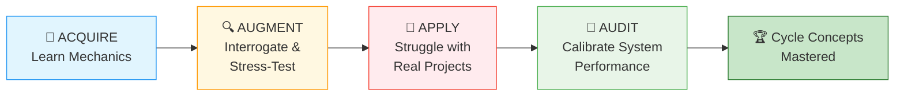
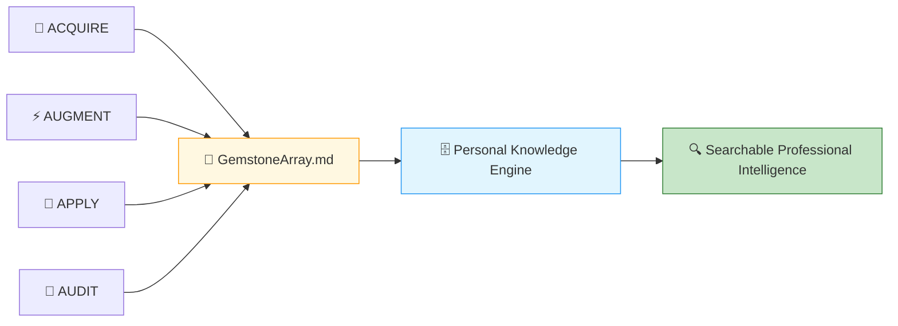

# 🗄️🤖 SQL & GenAI Course
**🎯 Quality Education for Anyone, Anywhere, Anytime — 💫 with Comfort, Convenience at no Cost**

---

## 📚 ACCELERATE FRAMEWORK REFERENCE

This document consolidates the **ACCELERATE framework** – the setup, toolkits, terminologies, and extraction guidance that you need to refer to as you work through AUGMENT files. You do not need to read this every time; keep it handy for reference.

---

# 🏁 Phase 1: Pre‑requisites and Preparation

## 🏁 Orientation Chamber

### ⚠️ REMINDER – ACQUIRE Foundation First

Before you enter any AUGMENT chamber, complete the ACQUIRE foundation for that concept:

1. **Read ACQUIRE Materials** – Open the ACQUIRE lesson file mirroring the ACCELERATE file, along with its exercises, quiz, and solutions. Read them thoroughly for complete conceptual understanding.

2. **Extract ACQUIRE Gemstones** – Collect gems (skill name, objective, your viewpoint, quiz scores, exercise completions) and add them to `GemstoneArray.md` using the **ETL Workflow** described in [`SKILL_TREE_ARCHITECTURE.md`](../../../Guides/SKILL_TREE_ARCHITECTURE.md).

> 🔁 **Spiral Rule:** ACQUIRE builds foundation. ACCELERATE builds judgment. Do not skip the foundation.

---

### 🔧 Enhanced Browser Office for AUGMENT

**🚀 Kickstart: Any Computer, Any Browser, Anytime.**  
**🌍 Destination: Any country, Any city, Any Platform.**

| Tab | Purpose | What to Do |
| :--- | :--- | :--- |
| **1: The Map** | Read AUGMENT files | Open the concept file from `01-The-Socratic-Mirror/`. |
| **2: The Factory** | Run queries | Keep [`training_institution_sample.db`](../../../../Resources/sample_databases/training_institution_sample.db) loaded. Run every query you see in this file. |
| **3: The Consultant** | Socratic questioning | Configured with [`BROWSER-OFFICE-ACCELERATE.md`](../../BROWSER-OFFICE-ACCELERATE.md) – Persona prompt, SQLVerse characters. Configured with [`SCHEMA_ANCHOR_TRAINING_INSTITUTION_SAMPLE.md`](../../../SCHEMA_ANCHOR_TRAINING_INSTITUTION_SAMPLE.md). Ask about logic, never code. |
| **4: The Vault** | Save reflections & gemstones | Save all your Socratic logs in your Vault at `Learning/Level-1-beginner/ACCELERATE/01-The-Socratic-Mirror/ACQUIRE-MODULE2/1-the-sieve-select.md` using the template provided in [`SOCRATIC_LOG_TEMPLATE.md`](../../SOCRATIC_LOG_TEMPLATE.md).  If you spot any AI hallucinations, missed edge cases, or other mistakes made by the AI, save those unusual occurrences in your Vault at `Learning/Level-1-beginner/ACCELERATE/Socratic_Journals/` as a separate markdown file (e.g., `hallucination_log_1.md`, `edge_case_anomalies_1.md`). |

---

### 🛠️ ACQUIRE Module 2 Toolkit

🚀 **Foundation First, AI Next, Projects Last.**  
💎 **Gemstone by Gemstone, Skill by Skill.**

| | | |
|---|---|---|
| [Browser Office Workflow](../../../../Setup/STEP2_ESTABLISH_LEARNING_RITUAL.md) | [Knowledge Base](../../../Guides/Section1-ACQUIRE/3_Knowledge_Base.md) | [Mindset Tuning](../../../Guides/Section1-ACQUIRE/4_Mindset.md) |

---

### 🛠️ ACCELERATE Module 2 Toolkit

🚀 **AUGMENT First, APPLY Next, AUDIT Last.**  
💎 **Gemstone by Gemstone, Skill by Skill.**

| Core Pillar Guides | Optimization Strategy | Systemic Architecture |
|--------------------|----------------------|------------------------|
| 🏎️ [Query Optimization](../../../Guides/Section2-ACCELERATE/2_Query_Optimization.md) | 🧭 [ACCELERATE Atlas](../../MODULE5_GUIDE.md) | 🔄 [ACCELERATE Vision](../../ACCELERATE_VISION.md) |
| 🧠 [Socratic Method](../../../Guides/Section2-ACCELERATE/3_Socratic_Method.md) | 🪞 [Mirror Bridge](../../../Guides/Section2-ACCELERATE/4a_ACCELERATE_MIRROR.md) | 🌳 [Skill Tree Map](../../../Guides/SKILL_TREE_ARCHITECTURE.md) |

---

### 🧠 Cognitive Compression Notice

ACQUIRE prioritised clarity and guided explanation.

AUGMENT intentionally compresses information density.

You are expected to:
- pause frequently,
- interrogate assumptions,
- replay queries multiple times,
- and reflect before advancing.

Confusion under pressure is part of the spiral.

---

### 🎯 Mirror Objective

In ACQUIRE, you learned how to write queries. In AUGMENT, your objective is different:
- detect hidden defects,
- interrogate AI assumptions,
- evaluate production consequences,
- and determine whether a query is architecturally trustworthy.

This chamber does not measure whether SQL executes. It measures whether your reasoning survives pressure.

---

### 🔒 Scope Lock

Each AUGMENT file is restricted to the conceptual boundaries of its ACQUIRE version. The file will explicitly state what is covered and what is not yet included.

---

### 📊 Our Practice Table: `students`

| Column | Type | Coupling Threat | Why |
|--------|------|----------------|-----|
| `student_id` | INTEGER | **HIGH** | Primary key – referenced everywhere |
| `first_name` | TEXT | **MEDIUM** | Displayed in UI, used in search |
| `last_name` | TEXT | **MEDIUM** | Displayed in UI, used in search |
| `email` | TEXT | **HIGH** | Used for login, notifications |
| `phone` | TEXT | **LOW** | Optional field, rarely critical |
| `enrollment_date` | DATE | **MEDIUM** | Used for reporting, segmentation |
| `total_fees` | DECIMAL | **HIGH** | Financial calculations |
| `fees_paid` | DECIMAL | **HIGH** | Financial calculations |

> ⚠️ **Data Contract Warning:** Any change to a `HIGH` coupling column will break existing applications.

---

# 🧠 Phase 2: ACCELERATE Technical Terminologies

## 🧠 ACCELERATE Operating System

### 🧭 Cognitive Operating Modes

Each phase of your journey demands a different mental posture. The table below shows what you do and where your focus should lie as you progress from learning syntax to calibrating system performance.

| Phase | Operating Mode | Focus |
|-------|----------------|-------|
| **ACQUIRE** | Learn Mechanics | Syntax, execution order, basic query writing |
| **AUGMENT** | Interrogate & Stress‑Test | Architectural judgment, AI auditing, production constraints |
| **APPLY** | Struggle with Real Projects | Implementation pressure, debugging, anti‑pattern detection |
| **AUDIT** | Calibrate System Performance | Validation, golden prompts, reasoning calibration |

---

### 🚀 ACCELERATE MANDATE

**Socratic Guidance | No Code Generation | Strategy Over Syntax | Dialogue Logging**

**ACCELERATE GOLDEN RULE:**  
*You write every line of SQL manually. AI explains logic only. Never ask for code.*

---

### 🔍 Your Personalized Google Engine

**Philosophy for Skill‑Tree Building:** *Capture first, Structure next, Persist forever.*

Every gemstone you extract becomes part of a growing, searchable intelligence archive. 

Across ACQUIRE, AUGMENT, APPLY, and AUDIT, you continuously accumulate:

- architectural insights,
- debugging patterns,
- production constraints,
- Socratic reflections,
- anti-pattern discoveries,
- optimisation viewpoints,
- and implementation scars.

These are stored in:
- `GemstoneArray.md`
- Socratic journals
- Vault reflections
- solution validations
- architectural notes

Over time, this evolves into:
- your interview preparation system,
- your professional reasoning archive,
- your searchable engineering memory.

> *“The SQLVerse expands. Your portfolio becomes searchable proof of your evolution.”*

**Your Persistent Permanent Portfolio expands with every ACCELERATE file.**

---

### 🧭 ACCELERATE Extraction Compass

> **ACQUIRE = Harvesting** – The file tells you: *"These are the skills."*  
> **ACCELERATE = Mining** – The file says: *"Here is a defect. Find the skill."*

In ACCELERATE, the skill is **hidden inside the reasoning**. You must mine it from Phase 3 sections – the `🔍 Opening Reflection`, the `🛰️ Production Echo`, the `🎭 The Copilot's Script`, and the `💡 Mirror Insight Callout`. The answer is not handed to you. You must extract it through interrogation and judgment.

---

#### 💎 GEMSTONE EXTRACTION WINDOW

| Extraction Field | Your Response |
|-----------------|---------------|
| **Skill Extracted** | [To be filled] |
| **Objective Mastered** | [To be filled] |
| **Viewpoint Shifted** | [To be filled] |
| **Anti-pattern Defeated** | [To be filled] |
| **Production Constraint Validated** | [To be filled] |

---

#### 📋 Extraction Source Map

| Extraction Field | Where It Maps in the Schema | Where to Find It | What to Capture |
|-----------------|-----------------------------|------------------|-----------------|
| **Skill Extracted** | `skills_level1` | `🎭 The Copilot's Script` + `💡 Artisan's Insight` | The core diagnostic skill |
| **Objective Mastered** | `skills_level1` (objective_text) | `🎯 Mirror Objective` | The capability you built |
| **Viewpoint Shifted** | `insights_level1` | `🔗 The Architectural Guardrail` | The mental shift |
| **Anti-pattern Defeated** | `bonus_skills_level1` | `🛰️ Production Echo` | The dangerous pattern you learned to avoid |
| **Production Constraint Validated** | `bonus_skills_level1` | `🔗 The Architectural Guardrail` | The physical limitation confirmed |
| **Probing Question & AI Guidance** | `socratic_logs_level1` | `🔍 Probing Questions for Your AI Consultant (Tab 3)` | The question you asked and the AI's logical guidance |
| **Designer's Wisdom** | `insights_level1` | `💎 DESIGNER'S PERIGON` | The philosophical takeaway |

---

#### 📝 Socratic Log Extraction (for `socratic_logs_level1`)

All your `🔍 Probing Questions` are available in your Vault under `01-The-Socratic-Mirror/ACQUIRE-MODULEX/`.

**Selection Rule:** Select only the questions that provide **unique and rare insights** — questions that changed your mental model, exposed a hidden production risk, revealed a new architectural principle, or corrected an incorrect assumption.

- ✅ **Add** – if the question reveals a new perspective not already captured elsewhere.
- ❌ **Skip** – if it duplicates a skill or insight already documented.

**Curate your gem collection; don't just dump everything.**

| Field | Where It Maps in the Schema | Where to Find It | What to Capture |
|-------|-----------------------------|------------------|-----------------|
| **Structural Question** | `socratic_logs_level1` (structural_question) | Your Vault | The probing question that gave you a unique insight |
| **AI Guidance** | `socratic_logs_level1` (ai_guidance) | Your conversation with Tab 3 | The logic/strategy the AI suggested |
| **Student Final SQL** | `socratic_logs_level1` (student_final_sql) | Your corrected version | The SQL you wrote after the AI's guidance |
| **Initial Understanding** | `socratic_logs_level1` (initial_understanding) | Your own reflection | What you thought before asking the question |
| **Realised Insight** | `socratic_logs_level1` (realised_insight) | `💡 Mirror Insight Callout` | The architectural wisdom you gained |

---

### 📓 Socratic Error Logging

Whenever the AI hallucinates, misses an edge case, or makes a logical mistake, log it. These entries become proof of your AI auditing skill.

**Location:** `Learning/Level-1-beginner/ACCELERATE/Socratic_Journals/`

**What to log:**
- What the AI said (quote)
- What was actually correct
- How you caught it
- What you learned

> **Why this matters:** A portfolio of AI mistakes you caught proves you lead the AI, not the other way around.

---

### 🧩 Failure Classification

Not every error is the same. Understanding the type of failure helps you diagnose problems faster and communicate risks more precisely. Use this table to classify any issue you encounter during interrogation or implementation.

| Failure Type | Description |
|--------------|-------------|
| **Syntax Failure** | Query cannot compile |
| **Logical Failure** | Query runs but produces wrong meaning |
| **Architectural Failure** | Query works but creates scalability, maintainability, or coupling risks |
| **Operational Failure** | Query damages application/system behaviour under production conditions |

---

*Part of our mission for 🎯 Quality Education for Anyone, Anywhere, Anytime — 💫 with Comfort, Convenience at no Cost.*

**Level 1 | ACCELERATE Phase | Framework Reference**

