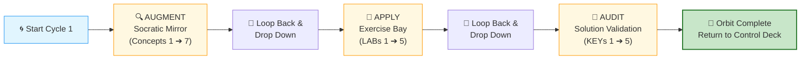

# 🗄️🤖 SQL & GenAI Course
**🎯 Quality Education for Anyone, Anywhere, Anytime — 💫 with Comfort, Convenience at no Cost**

---

## 🔄 ACCELERATE Cycle 1 Guide: Module 2 (Spiral Chamber)

You have entered the spiral. This is a self‑contained **spiral traversal chamber.** Work through the three phases in order. After completing all three, return to the Navigation Guide to log your Lap 1 Black Box Feedback.

> **Browser Office:** Your four tabs are already configured. Tab 3 is set up according to `BROWSER-OFFICE-ACCELERATE.md` – Socratic Mentor mode, no code generation.

---

## 🎯 Cycle 1 Learning Objectives

By completing this cycle, you will be able to:
- Apply Socratic questioning to all Module 2 concepts
- Diagnose and fix broken AI‑generated queries (5 LABs)
- Validate your reasoning against golden prompts (5 KEYs)
- Extract gemstones for your Skill‑Tree from both ACQUIRE and ACCELERATE

---

## 🗺️ The Spiral Flight Path

> **Flight Rule:** Complete an entire Pass horizontally across all concepts before dropping down to the next vertical layer. Never cross‑thread or jump ahead.

---

## 🔍 AUGMENT – The Socratic Mirror

**Cognitive Goal:** abstraction & logic formation

**Base path:** `01-The-Socratic-Mirror/ACQUIRE-MODULE2/`

| Concept Focus | Mirror Bridge File (1:1 mapping with ACQUIRE) |
|---------------|------------------------|
| The Sieve (SELECT Extraction) | `1-the-sieve-select.md` |
| The Filter (WHERE Boundaries) | `2-the-where-clause.md` |
| Truth Tables (AND/OR Logic) | `3-logical-operators.md` |
| The Ghost Value (NULL Mechanics) | `4-in-between.md` |
| Set Boundaries (IN & BETWEEN) | `5-like-wildcards.md` |
| Wildcard Patterns (LIKE) | `6-null-handling.md` |
| Distinct Boundaries (UNIQUE) | `7-distinct-aliases.md` |

> 💡 After completing each concept, extract gemstones (skill, objective, viewpoint) into `EXTRACTION_BAY/SkillTree/GemstoneArray.md`.

✅ **After completing all 7 concepts**, return here and proceed to **APPLY**.

---

## 🧪 APPLY – The Exercise Bay

**Cognitive Goal:** struggle & implementation

**Base path:** `02-Exercises/MODULE2/`

**Tab 2:** Load `level1_estore_basic.db`

| LAB Focus | Mirror Bridge File (1:1 mapping with ACQUIRE) |
|-----------|------------------------|
| Basic Extraction Defect Cleanup | `1-basic-select-LAB.md` |
| Compound Filter Boundary Debugging | `2-where-operators-LAB.md` |
| The Broken Ghost (NULL Value Triage) | `3-logical-and-in-between-LAB.md` |
| Set Exclusion & Pattern Errors | `4-like-and-null-LAB.md` |
| Distinct Deduping Structural Failures | `5-mixed-practice-LAB.md` |

> 💡 After completing each LAB, extract any anti‑pattern gemstones into `GemstoneArray.md`.

✅ **After completing all 5 LABs**, return here and proceed to **AUDIT**.

---

## 🔑 AUDIT – Solution Validation

**Cognitive Goal:** validation & calibration

**Base path:** `03-Solutions/MODULE2/`

| KEY Focus | Mirror Bridge File (1:1 mapping with ACQUIRE) |
|-----------|------------------------|
| Sieve Verification Metrics | `1-basic-select-KEY.md` |
| Filter Boundary Correctness Check | `2-where-operators-KEY.md` |
| Ghost Solution Audit Framework | `3-logical-and-in-between-KEY.md` |
| Patterns & Sets Golden Realignment | `4-like-and-null-KEY.md` |
| Unique Deduping Reasoning Baseline | `5-mixed-practice-KEY.md` |

> 💡 After completing each KEY, extract final validation gemstones into `GemstoneArray.md`.

---

 ## 📎 **Mirror Bridge Convention**
This section explains the underlying **file system symmetry** between ACQUIRE and ACCELERATE which is the foundation of the **Mirror Bridge Architecture.**
 
### **Folder Mapping**
 | ACQUIRE folder | ACCELERATE folder |
 |----------------|-------------------|
 | `1-sqlCommands` | `01-The-Socratic-Mirror` |
 | `2-practiceExercises` | `02-Exercises` |
 | `4-exerciseAndQuizSolutions` | `03-Solutions` |

 ### **File Naming Rules**
 
 - **AUGMENT files** are exact 1:1 mirrors of ACQUIRE concept files (same filename as in `1-sqlCommands`).
 - **APPLY files** mirror ACQUIRE practice exercises files with `-LAB` appended (e.g., `4-like-and-null.md` → `4-like-and-null-LAB.md`).
 - **AUDIT files** mirror ACQUIRE exercises and solution files with `-KEY` substituted instead of `-solutions` (e.g., `4-like-and-null-solutions.md` → `4-like-and-null-KEY.md`).

This ensures isomorphic mapping between **ACQUIRE** and **ACCELERATE** while clearly distinguishing the three passes.

✅ **After completing all 5 KEYs**, your Cycle 1 spiral is complete.

---

## 🏁 MISSION CLEARED: RETURN RUNWAY

**🔒 CYCLE 1 COMPLETE**

All horizontal passes are executed, and all internal cognitive checkpoints have been verified. Your orbit around Module 2 data domains is officially complete.

# [▶️ **RETURN TO FLIGHT CONTROL DECK**](../MODULE5_NAVIGATION_GUIDE.md)

**Log your Lap 1 Black Box Telemetry**

---

*Part of our mission for 🎯 Quality Education for Anyone, Anywhere, Anytime — 💫 with Comfort, Convenience at no Cost.*

**Level 1 | ACCELERATE Phase | Cycle 1 Guide (Module 2) | Next: Return to Navigation Guide**

