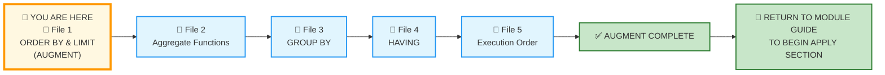

# 🗄️🤖 SQL & GenAI Course
**🎯 Quality Education for Anyone, Anywhere, Anytime — 💫 with Comfort, Convenience at no Cost**

---

## 📘 File 1: ORDER BY & LIMIT – Putting Things in Order (powered with AI Augmentation)

Welcome back to the Socratic Mirror. You have already completed the **ACQUIRE** phase for this file and mastered sorting rows using `ORDER BY`, ascending (`ASC`) vs. descending (`DESC`) modifiers, and multi-column sorting mechanics, row limiting with `LIMIT`, and pagination using `OFFSET`.  You are now entering the **ACCELERATE structural sequencing phase**.

> 📌 **Prerequisite:** Read the **[SQLVerse Business Multiverse Manifesto](./1-theArchitectsLedger/SQLVERSE_BUSINESS_MULTIVERSE.md)** before beginning this file. It establishes the philosophy, laws, and operational principles that govern everything you will learn from this point onward.

> 📐 **Scope Reminder:** This AUGMENT file covers only **Ordering Results** (`ORDER BY`, multi-column sorting, expression sorting, and sorting execution rules) with LIMIT and OFFSET. Do not introduce aggregation (`GROUP BY`, `HAVING`), complex joins, or subqueries yet. Respect the spiral.

---

## 📍 Your Current Stage – AUGMENT Journey



---
## 🌀 Immersive Cognitive Traversal

ACCELERATE is not a linear syllabus. It is a **spiral chamber** where each phase strips away a different veil: preparation, vocabulary, execution.

| Chamber | What You Do Here | What Leaves Your System |
|---------|------------------|-------------------------|
| **🏁 Orientation Chamber** | Load toolkits, lock scope | Confusion about what is allowed |
| **🧠 ACCELERATE Operating System** | Absorb the mandate | Uncertainty about the rules of engagement |
| **⚡ Socratic Execution Chamber** | Interrogate AI scripts, analyse production echoes | Passive consumption – you become an active judge |

**You cannot interrogate what you have not prepared. You cannot judge what you have not named.**

Each chamber is a **gate**. Pass through all three. Descend with intention. Emerge with judgment.

**Start your SQLVerse Spiral Immersive journey.**

---

<div style="border: 2px solid #ff9800; border-radius: 10px; padding: 15px; margin: 20px 0; background: linear-gradient(135deg, #fff8e1 0%, #ffe0b2 100%);">

### 📘 Framework Reference

The complete **Phase 1 (Orientation Chamber)** and **Phase 2 (ACCELERATE Operating System)** – including Browser Office, Toolkits, Cognitive Compression Notice, Extraction Compass, Failure Classification, and all other framework content – has been compiled into a single reference document.

You do not need to read it every time. Keep it handy and refer to it whenever you need to revisit the ACCELERATE setup or terminologies.

📁 [`ACCELERATE_FRAMEWORK_REFERENCE.md`](../ACQUIRE-MODULE2/ACCELERATE_FRAMEWORK_REFERENCE.md)

</div>

---

# 🏁 Phase 1: Pre‑requisites and Preparation

## 🏁 Orientation Chamber

### ⚠️ REMINDER – ACQUIRE Foundation First

Before you enter this AUGMENT chamber, you must complete the ACQUIRE foundation for this concept:

1. **Read the ACQUIRE lesson file** – understand the syntax and examples.
2. **Extract ACQUIRE Gemstones** – collect skills, insights, and achievements from the ACQUIRE file into `GemstoneArray.md`.

> 📌 **Prerequisite:** Study the three core concept files in the **Architect's Ledger** (ACQUIRE Module) thoroughly before beginning AUGMENT:
> - `1-RDBMS-Core-concepts.md`
> - `2-Domains-And-Entities.md`
> - `3-Primary-Key.md`
>
> These establish the foundational understanding of relational databases, data domains, entity relationships, and the uniqueness guarantee of Primary Keys—all of which are assumed knowledge in ACCELERATE.

> 🔁 **Spiral Rule:** ACQUIRE builds foundation. ACCELERATE builds judgment. Do not skip the foundation.

**Mirror Bridge Reference:** `Level-1-beginner/Module3-Sort-Aggregate-Group/1-sqlCommands/1-order-by.md`

---
### 🎯 Mirror Objective

By completing this Socratic Mirror, you will be able to:

- **Identify and bypass** the hidden logic trap of missing or misdirected `ORDER BY` clauses that fail to serve business priorities.
- **Quantify** the performance, memory, and user‑experience costs of sorting without `LIMIT` or pagination.
- **Trace presentation defects** down to incorrect sort direction (`ASC` vs `DESC`) or unstable tie‑breakers that cause inconsistent pagination.
- **Leverage Socratic reasoning prompts** to cross‑examine AI‑generated sorting and pagination scripts, exposing hidden assumptions about order, priority, and scale.
- **Deconstruct AI-generated scripts** that place aesthetic grouping before true logical priority.

In **ACQUIRE**, you learned how to write an `ORDER BY` clause.

In **AUGMENT**, your objective is different:
- detect hidden defects in AI‑generated sorting logic,
- interrogate AI assumptions about what the user wants to see first,
- evaluate production consequences of missing `ORDER BY`, wrong direction, or missing `LIMIT`,
- and determine whether a sorted query is architecturally trustworthy.

This chamber does not measure whether SQL executes.

It measures whether your reasoning survives pressure.


---

### 🔒 Scope Lock

This mirror is intentionally restricted to the conceptual boundaries of the ACQUIRE version.

This chamber explores:
- `ORDER BY` with `ASC` and `DESC`
- Multi‑column sorting
- `LIMIT` and `OFFSET`
- Pagination patterns
- Aliases in `ORDER BY`

Respect the spiral. **Master** one cognitive layer before descending deeper.

---


# 🧠 Phase 2: ACCELERATE Technical Terminologies

## 🧠 ACCELERATE Operating System

### 🚀 ACCELERATE MANDATE

**Socratic Guidance | No Code Generation | Strategy Over Syntax | Dialogue Logging**

**ACCELERATE GOLDEN RULE:**  
*You write every line of SQL manually. AI explains logic only. Never ask for code.*

---

## 🧩 High-Density Glossary – New Buzzwords

### Non-Deterministic Sorting

A state in which a query does not guarantee the exact same row arrangement across consecutive executions. If a primary sort key contains identical duplicate values, the execution engine passes back those tied records based on physical disk placement or arbitrary caching states unless forced by an explicit secondary structural tie-breaker.

### The Positional Execution Layer

The mechanical reality that the engine processes data sorting as the absolute final phase of query evaluation. Because it acts on the finalized stream, it has direct, unhindered visibility into the structural assignments declared in the SELECT projection statement.

[1] FROM ──> [2] WHERE ──> [3] SELECT (Aliases Made) ──> [4] ORDER BY (Uses Aliases)

### Multi-Column Sorting Hierarchy

The layout plan where columns are evaluated sequentially from left to right. The second column is completely inert unless the primary column outputs a tie.

---

# ⚡ Phase 3: Enter the AUGMENT Chamber and Execute

## ⚡ Socratic Execution Chamber

### 🌍 Business Universes: SQLVerse MultiVerse Suite

Throughout the **ACCELERATE** phase, all Socratic demonstrations will traverse the business universes described in the **SQLVerse Business Multiverse Manifesto**. Each universe is designed to teach you the same SQL patterns through different business languages—proving that **the nouns change, but the logic does not.**

All demonstration databases are located in:

```
Module5-GenAI-Walkthrough/02-Exercises/MODULE2/Module2-Schemas/
```

For this file, our journey begins in the **Training Institution**—the universe you already know. Subsequent demonstrations will expand to **FinVERSE**, **Hospital Planet**, and **Real Estate Planet**.

| Universe | Domain | Role in This File |
|----------|--------|-------------------|
| **Training Institution** | Education | Cognitive Reorientation & Opening Reflection |
| **Hospital Planet** | Healthcare | Production Echo – Case 1 |
| **Real Estate Planet** | Property | Production Echo – Case 2 |
| **FinVERSE** | Digital Banking | Production Echo – Case 3 |

> 💡 **Same SQL. Different business.**

---

### 🔍 Cognitive Reorientation Layer

#### The Socratic Mirror for ORDER BY

Before you interrogate this query, run it through the **Professional Pipeline**:

```text
[1] Business Question  ──> What does the stakeholder actually want to see first?
[2] The One-Row Rule   ──> What does one row represent in this sorted list?
[3] The Blueprint      ──> Is there a dimension or metric driving the sort?
[4] Domain Invariance  ──> Does the same `ORDER BY` logic apply to other tables?
[5] The Vehicle        ──> Now write the `ORDER BY` clause.
```

In a small sandbox environment, sorting seems trivial. You write `ORDER BY`, and the database returns rows in the order you asked for.

But as an **SQLVerse Artisan**, you must question the prudence behind the query.

Consider this query:

```sql
SELECT student_id, first_name, last_name, total_fees
FROM students
ORDER BY total_fees;
```

It returns students sorted by fees – ascending by default. In our database, it works perfectly.

But as an Artisan, you must ask:

- **What story is this order telling?** Ascending fees highlights the lowest first. Is that what the stakeholder needs?
- **What if the user wanted to see the top debtors first?** Would `DESC` be more appropriate?
- **What if they wanted to see both – highest fees first, and within that, alphabetically?** Multi‑column sorting.

The query is syntactically correct. But is it **architecturally responsible**?

> **Law #4 in action:** *"The Syntax Is the Vehicle. The Judgment Is the Destination."*

---

### 🔄 The NULL Sorting Boundary

A critical logical boundary exists when sorting fields that contain `NULL` values.

In a filtering context, the database discards rows where comparisons evaluate to `UNKNOWN`. But **sorting** cannot discard `NULL`—they must be placed somewhere.

Different database engines handle this differently:

| Database | `ASC` Sort | `DESC` Sort |
|----------|------------|-------------|
| **SQLite / MySQL** | `NULL` appears at the **top** | `NULL` appears at the **bottom** |
| **PostgreSQL / Oracle** | `NULL` appears at the **bottom** | `NULL` appears at the **top** |

**The Business Impact:** If a Finance Executive in a PostgreSQL environment runs `ORDER BY account_balance DESC`, all `NULL` balances will appear at the **top** of the dashboard—rendering the most important view useless.

**The Artisan's Judgment:** When `NULL` values do not carry **business meaning**, filter them using `WHERE column IS NOT NULL` before sorting critical metrics. Otherwise, make the placement of `NULL` values an explicit business decision rather than relying on the database's default behavior.

---

### 🔍 Opening Reflection: The Autopilot Trap

An unguided AI assistant is asked to provide a list of students ordered by enrollment date. It delivers this query:

```sql
SELECT student_id, first_name, last_name, enrollment_date
FROM students
ORDER BY enrollment_date;
```

The query runs. It returns students from earliest to latest enrollment. In a tiny training database, it works.

But as an **SQLVerse Artisan**, you notice something:

- **Why ascending?** The user didn't specify ascending or descending.
- **What if the user wanted the newest students first?** That would be `DESC`.
- **What if the user wanted to see a specific page of results?** That would require `LIMIT` and `OFFSET`.

**The AI made an assumption.** It assumed ascending order was the intended order.

The AI gave you a working query. But it gave you a query that may not serve the user's actual need.

> 💡 **Artisan's Insight:** *"A working query is not always the right query. The difference is judgment."*

### 🧠 Critical Cross‑Examination

- **The Core Defect:** What assumption did the AI make about the desired order?
- **The Scale Penalty:** What happens when this query returns thousands of rows with no `LIMIT`?
- **The AI Blindspot:** What did the AI assume about the user's intent?
- **The Syntactic Illusion:** Is this query syntactically perfect yet architecturally incomplete?

---

### 🛰️ Production Echo – Case 1

#### 🌍 Business Universe: Hospital Planet

**Business Scenario:** A hospital administrator requested a list of patients sorted by discharge date, with the most recent discharges first, to prepare a weekly discharge report.

**The Query:** The AI generated this:

```sql
SELECT patient_id, name, discharge_date
FROM patients
WHERE discharge_date IS NOT NULL
ORDER BY discharge_date;
```

**The Problem:** The administrator needed the *most recent* discharges first. The query sorted in ascending order, showing the oldest discharges first. The report was useless.

**The Analysis:** The AI generated a syntactically correct query. It applied the `WHERE` filter correctly. But it failed to understand the **business priority** – the administrator needed the most recent data first.

**The Corrected Query:**

```sql
SELECT patient_id, name, discharge_date
FROM patients
WHERE discharge_date IS NOT NULL
ORDER BY discharge_date DESC;
```

**The Lesson:** Sorting is not just about order – it is about **prioritisation**. The same data can tell very different stories depending on the sort order.

---

### 🛰️ Production Echo – Case 2

#### 🌍 Business Universe: Real Estate Planet

**Business Scenario:** A real estate investor requested a list of active properties sorted by list price, from highest to lowest, to identify premium investment opportunities.

**The Query:** The AI generated this:

```sql
SELECT property_id, address, list_price, status
FROM properties
WHERE status = 'Active'
ORDER BY list_price;
```

**The Problem:** The investor needed the *highest* prices first. The query sorted in ascending order, showing the cheapest properties first. The investor wasted time scrolling.

**The Corrected Query:**

```sql
SELECT property_id, address, list_price, status
FROM properties
WHERE status = 'Active'
ORDER BY list_price DESC;
```

**The Lesson:** Sorting direction matters. `ASC` and `DESC` are not interchangeable – they communicate different priorities.

---

### 🧩 Failure Evaluation Matrix

| Failure Type | Case 1 (Hospital) | Case 2 (Real Estate) | Explanation |
|--------------|-------------------|----------------------|-------------|
| **Syntax Failure** | ❌ No | ❌ No | Both queries compiled without errors |
| **Logical Failure** | ❌ No | ❌ No | Both returned the correct data for the query logic |
| **Architectural Failure** | ✅ Yes | ✅ Yes | Both used the wrong sort order for business priority |
| **Operational Failure** | ✅ Yes | ✅ Yes | Both caused real-world inefficiency—wrong reports, missed opportunities, wasted stakeholder time |

---

### 🛰️ Production Echo – Same Data, Three Lenses, Three Stories
#### 🌍 Business Universe: FinVERSE

**Same table. Same data. Same columns. Three different stakeholders. Three different stories.**

That is the SQLVerse Artisan's magic. `ORDER BY` is a **magic wand**—it transforms raw data into business intelligence by choosing what to highlight, what to prioritise, and what story to tell.

---

#### Case 1 – The Fraud Analyst

**Business Scenario:** A fraud analyst requested a list of the 10 largest transactions in the last 30 days, sorted by amount, to investigate suspicious activity.

```sql
SELECT is_fraud, transaction_id, account_id, amount, transaction_date
FROM transactions
WHERE transaction_date >= DATE('now', '-30 days')
ORDER BY is_fraud, amount DESC
LIMIT 10;
```

**The Story:** This query tells the fraud analyst: *"Here are the largest transactions. Fraudulent ones are grouped together so you can spot patterns."*

**The Artisan's Insight:** Notice the primary sort is `is_fraud`. This is a **business‑first decision**—the analyst needs to see flagged transactions first, not just the largest amounts. The AI might have sorted by amount alone, missing the fraud priority.

---

#### Case 2 – The Finance Executive

**Business Scenario:** A Finance Executive requested a list of all transactions in the past 3 months, appropriately sorted, to study transaction patterns. The sort criteria was not specified—open to interpretation with defensible logic.

```sql
SELECT status AS "Transaction Status",
       is_fraud AS "Fraud Flag",
       amount AS "Amount",
       transaction_id,
       account_id,
       transaction_date
FROM transactions
WHERE transaction_date >= DATE('now', '-90 days')
ORDER BY status, is_fraud, amount DESC;
```

**The Executive View:** This query tells the Finance Executive: *"Here are all transactions, grouped by status, then by fraud flags, then by amount—so you can see the health and risk profile of transaction activity at a glance."*

**The Artisan's Insight:** The Executive didn't specify a sort order. The Artisan chooses a hierarchy that serves the business: status first (Completed, Pending, Failed), then fraud flags, then amount. This tells a **story of operational health**, not just raw volume.

---

#### Case 3 – The Analytics Team

**Business Scenario:** The Analytics team wants to analyse the correlation between time and volume of transactions over a period of three months, and also to analyse what time fraudulent transactions occur. They requested a list of all transactions in the past 3 months.

```sql
SELECT status AS "Transaction Status",
       is_fraud AS "Fraud Flag",
       transaction_date,
       amount AS "Amount",
       transaction_id,
       account_id
FROM transactions
WHERE transaction_date >= DATE('now', '-90 days')
ORDER BY transaction_date, status, is_fraud, amount;
```

**The Pattern Revealed:** This query tells the Analytics team: *"Here are all transactions, arranged chronologically, so you can see patterns over time—when fraud occurs, how status changes, and how volume fluctuates."*

**The Artisan's Insight:** The Analytics team needs temporal patterns. Sorting by `transaction_date` first reveals daily, weekly, and monthly trends. The secondary sort by `status` and `is_fraud` allows them to correlate time with outcomes.

---

### 🧠 The SQLVerse Artisan's Magic

```text
Same Table
   ↓
Same Data
   ↓
Same Columns
   ↓
Three Different Sort Orders
   ↓
Three Different Perspectives
   ↓
Three Different Business Stories
```

`ORDER BY` is not a technical detail. It is a **business decision**.

| Stakeholder | Sort Priority | Business Question |
|-------------|---------------|-------------------|
| **Fraud Analyst** | `is_fraud`, `amount DESC` | "Where are the risks?" |
| **Finance Executive** | `status`, `is_fraud`, `amount DESC` | "How healthy is our transaction flow?" |
| **Analytics Team** | `transaction_date`, `status`, `is_fraud` | "What patterns emerge over time?" |

> 💡 **Law #4 in action:** *"The Syntax Is the Vehicle. The Judgment Is the Destination."*
>
> The SQL is the same. The columns are the same. The table is the same.
>
> The **order**—that is the judgment.

---

### 🔗 The Architectural Guardrail: Sorting and Pagination

In ACQUIRE, you learned the Artisan's Warning regarding default order. Let's quantify that warning using production constraints.

#### The Cost Matrix

| Metric | `ORDER BY` without `LIMIT` | `ORDER BY` with `LIMIT` |
|--------|---------------------------|-------------------------|
| **Disk I/O Overhead** | Sorts all rows – potentially millions | Sorts only enough rows to satisfy the `LIMIT` |
| **Memory Usage** | High – requires memory for full sort | Lower – can often use a partial sort |
| **Network Payload** | Transmits all rows – potentially gigabytes | Transmits only the requested rows |
| **User Experience** | Poor – user waits for full result set | Good – user sees the first page quickly |

> 💡 **Artisan's Insight:** *"Always pair `ORDER BY` with `LIMIT` when presenting data to users. Your stakeholders don't need to see every row – they need to see the most relevant rows."*

---
## 🎭 The Copilot's Script

### 🌍 Business Universe: E‑Store

The Product Manager requested a list of all products sorted by price. The AI assistant generated this query:

```sql
-- Generated by AI assistant for product price list
SELECT product_id, product_name, category, price
FROM products
ORDER BY price;
```

**The Problem:** The Product Manager did not specify that they wanted to view products sorted by price **within each product category**.

As an **SQLVerse Artisan**, you are not expected to wait for perfect specifications. You are expected to **anticipate the business need**.

---

### 🧠 Business First Philosophy in Action

**Law #1 — Business Before SQL**

You are paid to solve business problems, not to write SQL.

A Product Manager looking at a product catalogue does not think in raw data. They think in categories, hierarchies, and comparisons. They want to know:

- Which product is the most expensive in the Electronics category?
- How does the price of a Laptop compare to other products in the same category?
- Which categories have the widest price variance?

A simple `ORDER BY price` gives them a flat list—technically correct, but **business‑incomplete**. It forces the Product Manager to manually scan and mentally group products by category.

The **Artisan** does not wait for the Product Manager to ask for multi‑column sorting. The Artisan anticipates that **categorical context matters** and delivers a sorted list that respects the logical hierarchy of the business:

```sql
-- The Artisan's Edge: Multi‑Column Sorting
SELECT product_id, product_name, category, price
FROM products
ORDER BY category, price DESC;
```

This query presents products **grouped by category**, with the highest‑priced item first in each group—immediately useful for comparison, planning, and decision‑making.

---

### A Panoramic View of the Copilot's Script

#### 🧠 Socratic Interrogation Loop

**Interrogation Question 1:** The AI query returns a valid list of products sorted by price. But what business question does this query *fail* to answer? What additional information would a Product Manager need from this report?

**Interrogation Question 2:** How does the addition of `category` as the primary sort column change the *usability* of the report? What decisions become easier for the Product Manager?

**Interrogation Question 3:** If the Product Manager later asks for the most expensive product in *each* category, would the AI query help? If not, what would you propose?

---

> 💡 **Mirror Insight Callout**
>
> ```sql
> -- How the AI wrote it (syntactically correct, business‑thin):
> ORDER BY price
> 
> -- How an SQLVerse Artisan writes it (business‑aware, prioritised):
> ORDER BY category, price DESC
> ```
>
> **Law #1 in action:** The syntactically correct query answered the literal request. The Artisan's query answered the *business need*.
>
> A Product Manager thinks in categories and hierarchies—not flat lists. The Artisan translates that business logic into the sort order.

---

> 💡 **Architect's Lens:**
>
> The AI gave you a syntactically correct query. It returned the right rows in the right order—*by price*. But it missed the business context.
>
> A Product Manager does not think about a flat list of prices. They think about categories, comparisons, and hierarchies. The AI gave them a list. The Artisan gives them a **decision tool**.

**The nouns change. The logic does not. But the *order*—that is a business decision.**

The **ordering** is a **message**. The SQL is just the delivery mechanism.

---

### 🧩 Two Architectures, One Request

**The Business Request:** *"Show me the top 5 students by outstanding fees."*

**Architect A – Absolute Volume:**
```sql
SELECT student_id, first_name, last_name, total_fees, fees_paid
FROM students
WHERE total_fees - fees_paid > 0
ORDER BY (total_fees - fees_paid) DESC
LIMIT 5;
```

**Architect B – Engagement Focus:**
```sql
SELECT student_id, first_name, last_name, total_fees, fees_paid, enrollment_date
FROM students
WHERE total_fees - fees_paid > 0
ORDER BY (total_fees - fees_paid) DESC, enrollment_date ASC
LIMIT 5;
```

**Architect's Reflection:** Both queries return 5 students. But they tell different stories.

- **Architect A** prioritises absolute outstanding fees. It identifies the students with the highest financial exposure.
- **Architect B** prioritises fees *and* tenure. It identifies students with high fees who have been enrolled longer – perhaps the most urgent cases.

Neither is wrong. The difference is **judgment**.

> 💡 **The Artisan's Insight:** *"Another architect may legitimately choose tenure over fees. Both are defensible if the assumptions are clearly documented."*

---

### 🔍 Probing Questions for Your AI Consultant (Tab 3)

Paste these investigative prompts into Tab 3 to deconstruct sorting and pagination principles. **Do not ask for SQL code**; focus entirely on the architectural reasoning.

1. *"What is the difference between sorting in ascending order versus descending order? How does this choice affect the story the data tells?"*

2. *"Why is it important to use a tie‑breaker column when sorting for pagination? What happens if you don't?"*

3. *"What happens to pagination results when new rows are inserted between pages? How would you handle this in production?"*

4. *"What is the difference between `ORDER BY` and `GROUP BY`? When would you use each?"*

5. *"How does `LIMIT` affect query performance? Why is it important to always use `ORDER BY` with `LIMIT`?"*

6. *"What assumptions does an AI make when generating a `LIMIT` query? How would you audit those assumptions?"*

7. *"What is the difference between `OFFSET 5` and `LIMIT 5 OFFSET 5`? When would you use `OFFSET` without `LIMIT`?"*

8. *"How does sorting a large table affect performance? What strategies can you use to improve it?"*

9. *"What is the difference between a stable sort and an unstable sort in SQL? Why does it matter?"*

10. *"Why do production SQL queries almost always use `ORDER BY` with `LIMIT`? What risks does a query without `ORDER BY` introduce?"*

---

### 🧪 Socratic Reflection Probe

Before you cross the bridge to the next file, paste this exact **Golden Calibration Prompt** into your Consultant (Tab 3) to stress-test your baseline mental models:

> **Golden Prompt:** *"I am evaluating sorting and pagination boundaries. Explain how a query that omits `ORDER BY` introduces a presentation defect in a production system when the user expects a specific ordering. Detail how intentional sorting protects user experience, report consistency, and business communication."*

---

### 💎 GEMSTONE EXTRACTION WINDOW

Before you proceed to the next file, capture your architectural insights into `EXTRACTION_BAY/SkillTree/GemstoneArray.md`.

| Extraction Field | Your Response |
|-----------------|---------------|
| **Skill Extracted** | Detecting missing `ORDER BY` and `LIMIT` that cause presentation defects |
| **Objective Mastered** | Designing sort and pagination logic that serves business priorities |
| **Viewpoint Shifted** | From "Does this query return the right rows?" to "Does this query tell the right story?" |
| **Anti-pattern Defeated** | Sorting without prioritisation (`ORDER BY` without `DESC` when needed) |
| **Production Constraint Validated** | Sorting and pagination impact memory, network, and user experience |

> 📎 **Gemstone Taxonomy:** `Skill` = diagnostic ability | `Objective` = structural capability | `Viewpoint` = mental model shift | `Anti-pattern` = dangerous assumption defeated | `Constraint` = production limitation validated

---

### 📝 Example Portfolio Entry – File 1: ORDER BY & LIMIT

Below is a concrete example of how to populate your Skill‑Tree tables from the insights and skills you extract in this file. Use this as a model when creating your own entries.

**Source File:** `1-order-by.md`

---

#### 💎 Insert into `skills_level1`

```sql
INSERT INTO skills_level1 (module_id, filename, skill_name, objective_text, student_viewpoint)
VALUES (
    3, '1-order-by.md',
    'Detecting missing ORDER BY and LIMIT in production queries',
    'Identify and question SQL queries that lack intentional sorting or pagination, especially when they are used for user-facing reports.',
    'I used to think sorting was just about order. Now I understand it is about prioritisation and presentation.'
);
```

#### 💡 Insert into `insights_level1`

```sql
INSERT INTO insights_level1 (module_id, source_filename, insight_text, student_viewpoint)
VALUES (
    3, '1-order-by.md',
    'A query without ORDER BY is just a pile of data. A query with ORDER BY is a report. The difference is judgment.',
    'I realised that sorting is not a technical feature – it is a business presentation tool. The order I choose communicates what matters most.'
);
```

#### 🏆 Insert into `achievements_level1`

```sql
INSERT INTO achievements_level1 (achievement_type, module_id, source_filename, score_or_status, student_viewpoint)
VALUES (
    'Simulation', 3, '1-order-by.md', 'Socratic Log Saved',
    'Successfully executed the Golden Calibration Prompt against the AI consultant. Calibrated my understanding of sorting and pagination boundaries.'
);
```

#### 💎 Insert into `bonus_skills_level1`

```sql
-- Case 1: Collections Prioritisation
INSERT INTO bonus_skills_level1 (module_id, bonus_skill_name, source_filename)
VALUES (
    3,
    'Always use DESC when prioritising high-impact items – missing DESC makes the most important items least visible.',
    '1-order-by.md'
);

-- Case 2: Pagination Stability
INSERT INTO bonus_skills_level1 (module_id, bonus_skill_name, source_filename)
VALUES (
    3,
    'Use tie‑breaker columns in ORDER BY to ensure stable pagination results.',
    '1-order-by.md'
);
```

#### 📝 Insert into `socratic_logs_level1`

```sql
INSERT INTO socratic_logs_level1 (
    module_id, sub_module, cycle, filename,
    structural_question, ai_guidance, student_final_sql,
    initial_understanding, realised_insight
) VALUES (
    3, 'ACQUIRE-MODULE3', 'AUGMENT', '1-order-by.md',
    'What is the difference between sorting without prioritisation and sorting with business intent?',
    'Sorting is not just about order – it is about prioritisation. The order you choose communicates what matters most to the stakeholder.',
    'SELECT student_id, first_name, last_name, total_fees, fees_paid FROM students WHERE total_fees - fees_paid > 0 ORDER BY (total_fees - fees_paid) DESC;',
    'I thought ORDER BY was just a technical feature.',
    'A query without ORDER BY is just a pile of data. A query with ORDER BY is a report. The difference is judgment.'
);
```

---

## ✅ Progress Check (AUGMENT)

Can you confidently answer the following before descending to the next layer?

- [ ] Do you look for missing `ORDER BY` clauses that would cause presentation defects?
- [ ] Can you explain why sorting without prioritisation (e.g., ascending when descending is needed) is an architectural failure?
- [ ] Do you understand why pagination requires a stable sort order with tie‑breakers?

**If yes → You're ready for File 2: Aggregate Functions.**

---

# 💎 DESIGNER'S PERIGON

<div style="border: 3px solid #9c27b0; border-radius: 10px; padding: 20px; margin: 25px 0; background: linear-gradient(135deg, #f3e5f5 0%, #e1bee7 100%);">

### *Look at the Bones*

You've just learned to **order** your results – to arrange the chaos into something meaningful. But this skill extends far beyond SQL.

Think about how you organise your wardrobe. You don't just hang dresses randomly. You arrange them in a **tapered sequence**—shorter to longer, casual to formal, light to dark. The order tells a story: what you reach for first, what suits the occasion, what feels right for the day.

Think about how you organise a bookshelf. You choose an **organisational method**:
- By genre or subject
- By read vs. unread
- By author or title alphabetically

Each method serves a different purpose. Each order prioritises a different need. The books are the same. The order changes how you **find** them, how you **use** them, and what you **notice** first.

**Every decision to order is a decision to prioritize.**

`ORDER BY` isn't just syntax – it's a statement of what matters most. When you put the highest debt first, you're saying: "These are the students we need to reach out to urgently." When you sort by enrollment date descending, you're saying: "Our newest students need the most attention."

The AI frequently organizes data alphabetically by category name because it **looks pleasing** on a layout sheet. An artisan coordinates sequencing based on **business value metrics**, forcing secondary categories to serve purely as deterministic tie-breakers. 

You're not just arranging data. You're **telling a story** with it.

**Treat your ordering clauses  as the final, absolute assertion of business priority.**


</div>

---

## 🔁 Bridge Forward

You have interrogated `ORDER BY` and `LIMIT`.

Next, you will move to the next AUGMENT lesson: **Aggregate Functions** – where you will learn to count, sum, and average data to answer business questions like "How many students are enrolled?" and "What is the total revenue?"

---

## 🧭 File Navigation

```mermaid
flowchart LR
    A["✅ COMPLETED<br/>📘 File 1<br/>ORDER BY & LIMIT"] --> B
    B["📘 File 2<br/>Aggregate Functions"] --> C
    C["📘 File 3<br/>GROUP BY"] --> D
    D["📘 File 4<br/>HAVING"] --> E
    E["📘 File 5<br/>Execution Order"] --> F
    F["✅ AUGMENT COMPLETE"] --> G
    G["🔄 RETURN TO MODULE GUIDE"]
    
    style A fill:#c8e6c9,stroke:#2e7d32,stroke-width:4px
    style B fill:#e1f5fe,stroke:#2196f3,stroke-width:2px
    style C fill:#e1f5fe,stroke:#2196f3,stroke-width:2px
    style D fill:#e1f5fe,stroke:#2196f3,stroke-width:2px
    style E fill:#e1f5fe,stroke:#2196f3,stroke-width:2px
    style F fill:#fff8e1,stroke:#ff9800,stroke-width:2px
    style G fill:#e8f5e8,stroke:#4caf50,stroke-width:2px
```



| Previous Step | Next Step |
|:---:|:---:|
| [← Return to Module 3 Guide](../MODULE3_GUIDE.md) | [Continue to File 2: Aggregate Functions →](./2-aggregate-functions.md) |

---

*Part of our mission for 🎯 Quality Education for Anyone, Anywhere, Anytime — 💫 with Comfort, Convenience at no Cost.*

**Level 1 | ACCELERATE Phase | AUGMENT | Module 3 | File 1: ORDER BY & LIMIT | Next: [Aggregate Functions](./2-aggregate-functions.md)**

