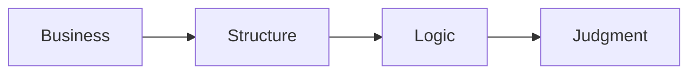

# 🗄️🤖 SQL & GenAI Course
**🎯 Quality Education for Anyone, Anywhere, Anytime — 💫 with Comfort, Convenience at no Cost**

---

# 🎭 🌍 SQLVerse: The Quantum Multiverse

## The Business Multiverse Manifesto

This document establishes the **constitution of enterprise data judgment**. It governs every query, every decision, and every business universe in the SQLVerse. Read it once. Internalise it. Return to it whenever you need to remember *why* you are learning what you are learning.

## 🚀 The Threshold Crossed

If you are reading this, your execution cycles in the foundational layer are frozen. You have proven that you can **write valid SQL queries**, manipulate filters, and handle structural operators without breaking the syntax parser.

But writing syntax is no longer the destination. **Business reasoning is.**

In the real world, you are not paid by the line of code you type; you are paid for the strategic decisions your data empowers. 

Welcome to **PRODUCTION REALITY.** 

From this moment forward, we stop treating SQL as a computer language and start treating it as an executive decision engine.

---

### 🏛️ The Constitution of Enterprise Data Judgment

 **"In ACQUIRE, you learned to ask *which rows*. In ACCELERATE, you learn to ask *what they mean*."**

From this point onward, SQL syntax is a given. The goal is **business reasoning**.

| Phase | Function |
|-------|----------|
| **ACQUIRE** | How SQL works – mechanics, syntax, and structure |
| **ACCELERATE** | Why businesses care – translating queries into business value |
| **ANALYZE** | What exactly a business needs – diagnosing problems, defining requirements |
| **ARCHITECT** | How to deploy SQL for the business – designing systems, owning outcomes |


---

## 🧠 The Shift

| FOUNDATION | PRODUCTION THINKING |
|---------|---------|
| Learn SQL syntax | Learn business reasoning |
| "How do I write this?" | "What does this mean for the business?" |
| Correct queries | Defensible decisions |
| Syntax errors | Judgment errors |
| The vehicle | The destination |

 **Law #4 in action:** *"The Syntax Is the Vehicle. The Judgment Is the Destination."*

---

## 🏛️ The SQLVerse Laws

These four principles govern everything you will learn in Level 1 and beyond. They are not SQL rules. 

They are our **core operational principles**.

### Law #1 — Business Before SQL

You are paid to solve business problems, not to write SQL.

A correct query that answers the wrong question is useless. The stakeholder defines the problem. Your SQL is the tool to solve it. Always translate messy, human prose into a clear business intent before touching the keyboard.

### Law #2 — Structure Before Syntax

Find where the information lives before deciding how to retrieve it.

Understanding the schema, relationships, and granularity is more important than knowing every function. Mapping relationships across schemas will save you from writing beautiful queries against the wrong tables.

### Law #3 — Logic Outlives Vocabulary

Business names change. SQL logic survives.

The underlying analytical footprints remain completely stable whether you are auditing retail transactions, hospital beds, or sovereign wealth funds. The SQL patterns remain the same. The nouns change. The logic does not.

### Law #4 — The Syntax Is the Vehicle. The Judgment Is the Destination.

SQL gets you to the answer. Professional judgment determines whether it is the right answer.

The syntax is how you travel. The judgment is where you arrive.  A query with zero syntax errors is merely operational; a query that delivers unassailable business truth to the boardroom is successful.



**Business first. Data model second. SQL third.**

---

## 🌍 SQLVerse, our Business Multiverse

Unlike ACQUIRE, where you learned SQL using a small number of carefully controlled datasets, ACCELERATE introduces you to **multiple business universes**.

Each universe has its own:
- Tables
- Column names
- Business vocabulary
- Stakeholders

But they all share the same SQL patterns.

You are not learning new datasets. You are learning that **SQL is domain-invariant**.

###  Why New Business Universes?

Professional data architects are not hired because they memorized the table names of a single database. They are hired because they can step into *any* corporate boardroom on Earth, isolate the metrics that matter, and deploy the invariant patterns of SQL to extract them.

We do not switch universes  to confuse you. We cycle through these *"parallel universes"* to **discover one architectural truth:**

> **The nouns change. The logic does not.**

The **Multiverse traversal** proves that the **same SQL** survives **different businesses.**

### The Business Universes You Will Explore

Over the course of **ACCELERATE,** you will encounter multiple business universes. Each one is designed to teach you the same SQL patterns through different business languages.

| Universe | Domain | Purpose |
|----------|--------|---------|
| **Training Institution** | Education | Foundation – the dataset you already know |
| **E‑Store** | Retail | Home turf – the dataset you mastered in ACQUIRE |
| **FinVERSE** | Digital Banking | KPI thinking, revenue metrics, customer analytics |
| **Hospital Planet** | Healthcare | Patient volumes, treatment costs, appointment analytics |
| **Real Estate Planet** | Property | Deal counts, price averages, agent performance |

Apart from these, **mini‑universes** may be introduced for certain specialised topics and the above universes may be extended by adding more tables to cater to advanced SQL concepts as you progress through **Level 2** and **Level 3**. For example, **Credit Cards**, **Fraud Detection**, and **International Money Transfer** may be added to FinVERSE at Level 2 or Level 3.

The **SQLVerse Business Multiverse** is open to vertical scaling (adding specialized domains) and horizontal schema growth (adding complex tables like Fraud/Transfers) in future.

---

## 🧠 New Operational Checklist

From this file onward, every single lab challenge requires you to process your thoughts through **The Professional Pipeline** before you write a single line of SQL:

```text
  [1] Business Question  ──> What does the executive actually want to know?
         ↓
  [2] The One-Row Rule   ──> What must ONE single row represent when the query finishes?
         ↓
  [3] The Blueprint      ──> Isolate the Dimension (Group By) vs. the Metric (Aggregate).
         ↓
  [4] Domain Invariance  ──> Strip away the industry nouns to find the skeletal pattern.
         ↓
  [5] The Vehicle        ──> Type the execution code.
```

### Supporting Practices

| Practice | Why |
|----------|-----|
| **Think before writing SQL** | Understand the problem before typing. |
| **Explain your assumptions** | Every query is built on assumptions. Document them. |
| **Identify the KPI** | What business metric does this query answer? |
| **Translate business language** | Business users don't speak SQL. You must translate. |
| **Defend your choices** | There is rarely one correct query. Justify yours. |
| **Extract gemstones** | Capture insights, not just syntax. |

---

## Integration Notes

| Element | How It Connects |
|---------|-----------------|
| **The Professional Pipeline** | The sequence of thinking that happens **before** writing SQL. |
| **Supporting Practices** | The habits that guide each step of the pipeline. |
| **Pipeline + Practices** | Together, they form the operational discipline for every challenge. |

---

## 🪜 The Aggregation Ladder

The CFO will not be interested in looking at monthly transactions spanning 700 rows and manually calculating revenue for each product category. They need a **business report**—summarised into 10 lines, one line per product category—to find out: 

Did we **hit, beat, or miss** the monthly revenue goal?

That is the purpose of aggregation.

```text
Level 1: Filter
        ↓
   Which rows are relevant?

Level 2: Group
        ↓
   Which buckets do I need?

Level 3: Aggregate
        ↓
   One number per bucket.

Level 4: Present
        ↓
   Executive-ready output.
```

**The Elevation:** Filtering is about *reducing rows*. Aggregation is about *creating meaning*. A business executive doesn't need to see every transaction—they need to see the story the transactions tell.

The CFO **focuses** on just three questions:
- Which product categories have **met the target?**
- Which product categories have **underperformed?**
- Which product categories have **outperformed?**

The raw numbers tell you what happened. The **aggregation** tells you what it means. **Executives** don't need more data—they need the right **answers** to **drive** the **right decisions.**

An executive-level report exists to **answer the questions** that truly matter.

---

## Why This Matters

| Concept | Business Application |
|---------|----------------------|
| **Filter** | Focus on relevant data (e.g., current year, active customers) |
| **Group** | Organise by categories (e.g., product, region, department) |
| **Aggregate** | Measure performance (e.g., total revenue, average order value, count of customers) |
| **Present** | Prioritise and order results to support decisions |

The Aggregation Ladder is not a SQL sequence. It is a **thinking framework** for turning raw data into executive decisions.

---

## 🎭 The Final Lens: Look at the Bones

When a tourist walks into a bank, a hospital, or a massive retail warehouse, they see marble floors, surgical lights, or rows of inventory shelves. They see the surface.

When an architect walks into those same buildings, they don't see the decoration. They see the load-bearing pillars. They see the structural steel. They see how gravity is being managed.

From this moment on, you are no longer a tourist in the database.

When you step into FinVERSE or Hospital Planet, strip away the **facade**. Stop looking at the paint on the walls. **Look at the bones.** A `GROUP BY` is a load-bearing pillar whether it is supporting a financial ledger or a patient register.

**Train your eyes to see the steel. The rest is just noise.**

---

*Part of our mission for 🎯 Quality Education for Anyone, Anywhere, Anytime — 💫 with Comfort, Convenience at no Cost.*

**SQLVerse | Business Multiverse | Worldview**