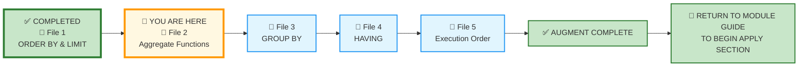

# 🗄️🤖 SQL & GenAI Course
**🎯 Quality Education for Anyone, Anywhere, Anytime — 💫 with Comfort, Convenience at no Cost**

---

## 📘 File 2: Aggregate Functions – Measuring What Matters (powered with AI Augmentation)

Welcome back to the Socratic Mirror. You have already completed the **ACQUIRE** phase for this file and mastered counting rows with `COUNT()`, calculating totals with `SUM()`, finding averages with `AVG()`, and identifying extremes with `MIN()` and `MAX()`. You understand the difference between `COUNT(*)` and `COUNT(column)`, and you know how NULLs affect aggregate functions.

You are now entering the **ACCELERATE structural sequencing phase**.

> 📐 **Scope Reminder:** This AUGMENT file covers only **Aggregate Functions** (`COUNT`, `SUM`, `AVG`, `MIN`, `MAX`, and their NULL handling rules). Do not introduce `GROUP BY`, `HAVING`, complex joins, or subqueries yet. Respect the spiral.

---

## 📍 Your Current Stage – AUGMENT Journey



---
## 🌀 Immersive Cognitive Traversal

ACCELERATE is not a linear syllabus. It is a **spiral chamber** where each phase strips away a different veil: preparation, vocabulary, execution.

| Chamber | What You Do Here | What Leaves Your System |
|---------|------------------|-------------------------|
| **🏁 Orientation Chamber** | Load toolkits, lock scope | Confusion about what is allowed |
| **🧠 ACCELERATE Operating System** | Absorb the mandate | Uncertainty about the rules of engagement |
| **⚡ Socratic Execution Chamber** | Interrogate AI scripts, analyse production echoes | Passive consumption – you become an active judge |

**You cannot interrogate what you have not prepared. You cannot judge what you have not named.**

Each chamber is a **gate**. Pass through all three. Descend with intention. Emerge with judgment.

**Start your SQLVerse Spiral Immersive journey.**

---

<div style="border: 2px solid #ff9800; border-radius: 10px; padding: 15px; margin: 20px 0; background: linear-gradient(135deg, #fff8e1 0%, #ffe0b2 100%);">

### 📘 Framework Reference

The complete **Phase 1 (Orientation Chamber)** and **Phase 2 (ACCELERATE Operating System)** – including Browser Office, Toolkits, Cognitive Compression Notice, Extraction Compass, Failure Classification, and all other framework content – has been compiled into a single reference document.

You do not need to read it every time. Keep it handy and refer to it whenever you need to revisit the ACCELERATE setup or terminologies.

📁 [`ACCELERATE_FRAMEWORK_REFERENCE.md`](../ACQUIRE-MODULE2/ACCELERATE_FRAMEWORK_REFERENCE.md)

</div>

---

# 🏁 Phase 1: Pre‑requisites and Preparation

## 🏁 Orientation Chamber

### ⚠️ REMINDER – ACQUIRE Foundation First

Before you enter this AUGMENT chamber, you must complete the ACQUIRE foundation for this concept:

1. **Read the ACQUIRE lesson file** – understand the syntax and examples.
2. **Extract ACQUIRE Gemstones** – collect skills, insights, and achievements from the ACQUIRE file into `GemstoneArray.md`.

> 🔁 **Spiral Rule:** ACQUIRE builds foundation. ACCELERATE builds judgment. Do not skip the foundation.

**Mirror Bridge Reference:** `Level-1-beginner/Module3-Sort-Aggregate-Group/1-sqlCommands/2-aggregate-functions.md`

---

### 🎯 Mirror Objective

By completing this Socratic Mirror, you will be able to:

- **Identify and bypass** the hidden logic trap of applying aggregate functions without questioning what the result *means* for the business.
- **Quantify** the cost of ignoring NULLs in production reports – how missing data can silently distort totals, averages, and counts.
- **Trace reporting defects** down to incorrect assumptions about `COUNT(*)` vs `COUNT(column)` or `AVG` behaviour.
- **Leverage Socratic reasoning prompts** to cross‑examine AI‑generated aggregate queries, exposing hidden assumptions about data completeness and business meaning.
- **Deconstruct AI-generated scripts** that treat all rows as equally meaningful, ignoring the production reality of incomplete data.

In **ACQUIRE**, you learned how to write aggregate functions.

In **AUGMENT**, your objective is different:
- detect hidden defects in AI‑generated summary logic,
- interrogate AI assumptions about what a "total" or "average" actually represents,
- evaluate production consequences of missing NULL handling in executive reports,
- and determine whether an aggregate query is architecturally trustworthy.

This chamber does not measure whether SQL executes.

It measures whether your reasoning survives pressure.

---

### 🔒 Scope Lock

This mirror is intentionally restricted to the conceptual boundaries of the ACQUIRE version.

This chamber explores:
- `COUNT(*)` – counting all rows
- `COUNT(column)` – counting non‑NULL values
- `SUM(column)` – adding values
- `AVG(column)` – averaging values
- `MIN(column)` – finding the smallest value
- `MAX(column)` – finding the largest value
- NULL handling in aggregate functions

Respect the spiral. **Master** one cognitive layer before descending deeper.

---

# 🧠 Phase 2: ACCELERATE Technical Terminologies

## 🧠 ACCELERATE Operating System

### 🚀 ACCELERATE MANDATE

**Socratic Guidance | No Code Generation | Strategy Over Syntax | Dialogue Logging**

**ACCELERATE GOLDEN RULE:**  
*You write every line of SQL manually. AI explains logic only. Never ask for code.*

---

## 🧩 High-Density Glossary – New Buzzwords

### Granularity Sensitivity

The awareness that aggregate functions collapse data to a single number, and that the *meaning* of that number depends entirely on the granularity of the underlying rows. A `SUM(amount)` across all transactions is different from a `SUM(amount)` across only completed transactions. The same function produces different business stories depending on what rows are included.

### NULL Propagation Risk

The danger that missing values in a column will be silently ignored by aggregates, producing results that appear accurate but are actually incomplete. `AVG(column)` ignores NULLs entirely—it does not treat them as zero. This means your average could be artificially high if you have missing data.

### Executive Metric Integrity

The principle that summary numbers presented to decision‑makers must be *defensible*—not just syntactically correct. A `SUM` or `AVG` should come with an understanding of what data was included, what was excluded, and what assumptions underlie the result.

---

# ⚡ Phase 3: Enter the AUGMENT Chamber and Execute

## ⚡ Socratic Execution Chamber

### 🌍 Business Universes: A glance

During **ACQUIRE,** you mastered **SQL fundamentals** by writing hundreds of SQL statements using the Training Institution and E-Store databases, while your capstone reports introduced you to multiple business domains. 

During **ACCELERATE CYCLE 1,** we revisited those same SQL concepts—not to learn new syntax, but to discover how identical SQL patterns solve completely different business problems across multiple industries through a business-first perspective. We will continue to do the same through **ACCELERATE CYCLE 2 and CYCLE 3** in our journey.

By now, you have already worked extensively with the **SQLVerse Business Universes** throughout the **APPLY** phase of CYCLE 1.

You have already travelled through the **SQLVerse Business Multiverse.**

**Now it is time to understand why it exists.**

You have written hundreds of SQL statements, explored multiple business domains, and begun constructing your **Skill Tree**. 

At this stage, it is time to step back and understand the **Architectural vision** behind everything you have been using.

The SQLVerse Business Universes were never created as isolated sample databases. They are part of a deliberately designed learning ecosystem called the **SQLVerse Business Multiverse**.

Before continuing with this lesson, read the following two documents in order:

1. **📖 SQLVerse Business Suite Guide** — your introduction to the SQLVerse ecosystem.
2. **📜 SQLVerse Business Multiverse Manifesto** — the philosophy and long-term vision behind every Business Universe, Blueprint, Schema Guide, Satellite, and Mini-Universe in this course.

These are **one-time readings**. They provide the architectural context for everything that follows throughout the remainder of SQLVerse.

Once you understand the Multiverse, every exercise stops being an isolated SQL problem and becomes part of a much larger learning architecture.

**Read once. Refer forever.**

* 📖 [SQLVerse Business Suite Guide →](../../../sqlverse-foundation/core/00-SQLVerse-Business-Suite-Guide.md)
* 📜 [SQLVerse Business Multiverse Manifesto →](../../../sqlverse-foundation/core/SQLVERSE_BUSINESS_MULTIVERSE.md)

---

All demonstration databases for the **SQLVerse Business Multiverse** are located in:

```text
Level-1-beginner/sqlverse-foundation/resources/data-models/flagship-universes/
```

> **Note:** The **Training Institution** database (`training_institution_sample.db`) remains in the Course Repository Resources folder used throughout ACQUIRE. Its location is documented in the **ACCELERATE Framework Reference**. The remaining flagship databases (E-Store, Hospital Planet, Real Estate Planet, and FinVERSE) are stored in the SQLVerse Resource Repository shown above.
> 
---

### 🔍 Cognitive Reorientation Layer

#### The Socratic Mirror for Aggregate Functions

Before you interrogate this query, run it through the **Professional Pipeline**:

```text
[1] Business Question  ──> What single number does the stakeholder actually need?
[2] The One-Row Rule   ──> What does one row represent before aggregation?
[3] The Blueprint      ──> Which table(s) provide the data? What granularity?
[4] Domain Invariance  ──> Does the same aggregate logic apply to other businesses?
[5] The Vehicle        ──> Now write the aggregate query.
```

In a small sandbox environment, aggregates seem trivial. You write `COUNT(*)`, and the database returns the number of rows.

But as an **SQLVerse Artisan**, you must interrogate the statistical and structural assumptions behind that calculation.

Consider this query:

```sql
SELECT COUNT(*) AS total_students
FROM students;
```

It returns the total number of students. In our database, it works perfectly.

But as an Artisan, you must ask:

- **What story is this number telling? Is a single global count business-meaningful?** Is this all students ever enrolled, or only currently active?
- **What if the stakeholder wanted to know how many students have completed at least one course?** Would `COUNT(*)` give them that?
- **What if they wanted to know the number of students enrolled for the current month?** Does `COUNT(column)` give a different picture?

The query is syntactically correct. But is it **architecturally responsible**?

> **Law #4 in action:** *"The Syntax Is the Vehicle. The Judgment Is the Destination."*

---

### 🔄 The NULL Boundary in Aggregates

A critical logical pitfall exists when aggregating fields that contain `NULL` values.

| Function | NULL Handling | Business Impact |
|----------|---------------|-----------------|
| `COUNT(*)` | Includes NULLs in row count | Gives total rows, not complete data |
| `COUNT(column)` | Excludes NULLs | May undercount if missing data is meaningful |
| `SUM(column)` | Excludes NULLs | Total may be understated if NULLs represent zero |
| `AVG(column)` | Excludes NULLs | Average may be overstated (missing values not counted as zero) |
| `MIN(column)` | Excludes NULLs | Ignores missing extremes |
| `MAX(column)` | Excludes NULLs | Ignores missing extremes |

**The Business Impact:** If a Finance Executive requests `AVG(account_balance)` and 10% of accounts have NULL balances (meaning the customer hasn't supplied their data), the average will only reflect the 90% who *have* supplied data. This could make the average appear higher than the true average across all customers.

**The Artisan's Judgment:** When `NULL` values carry meaning—even the meaning of "unknown" or "not provided"—you must decide whether to:
- Exclude them (default aggregate behaviour)
- Treat them as zero (using `COALESCE`)
- Report them separately (using `COUNT` with `IS NULL`)

> 💡 **Artisan's Insight:** *"An average that ignores missing data is not an average—it's a partial snapshot. Know what you're measuring before you measure it."*

####  🔄 NULL Handling in Practice: Two Critical Scenarios

Let's examine two production scenarios where this behaviour becomes critical.

#### 1. The `COUNT(*)` vs. `COUNT(column)` Divergence

-   `COUNT(*)` counts **every row** in the set, regardless of contents.
    
-   `COUNT(column)` counts **only non-NULL values** in that specific column.
    

**The Business Impact:** If a university has 1,000 enrolled students, but only 600 have filled in their `scholarship_amount` (the rest are `NULL`), `COUNT(*)` returns `1000` while `COUNT(scholarship_amount)` returns `600`. Confusing the two distorts key population metrics.

#### 2. The `AVG()` Denominator Distortion

`AVG(column)` calculates `SUM(column) / COUNT(column)`. It **does not** divide by `COUNT(*)`.

$$AVG = \frac{\sum \text{non-NULL values}}{\text{Count of non-NULL rows}}$$

Consider this Scenario :

If 10 patients incur medical charges of $100 each, and 10 patients incur charges recorded as `NULL` (let us say those 10 patients are Hospital staff and the Hospital Director has waived the treatment fee for them):

-   `AVG(charges)` evaluates to **$100** (ignores `NULL`s, divides by 10).
    
-   Average operational cost per patient across all treated patients is **\$50.** ($\$1000 / 20$ total patients).

> **Architect's insight:** *"In this scenario, the average calculated by SQL ($100) does not reflect the true operational cost ($50). The database did not make a mistake—it followed the rules of `AVG`. The question is whether those rules match the business reality."*
    
**The Artisan's Judgment:** Use `COALESCE(column,0)` only when a NULL genuinely represents a business value of zero. If NULL means "unknown", replacing it with zero introduces a different error.

---

### 🔍 Opening Reflection: The Autopilot Trap

An unguided AI assistant is asked to provide the total number of customers. It delivers this query:

```sql
SELECT COUNT(email) AS total_customers
FROM Customers;
```

The query runs. It returns a number. In a tiny training database, it works.

But as an **SQLVerse Artisan**, you notice something:

- **Is `email` the right column to count?** Some customers have NULL emails—they'll be excluded. The count will be lower than the actual number of customers.
- **What if the business definition of a "customer" includes all customers, regardless of email?** Then `COUNT(email)` is wrong; it should be `COUNT(*)`.
- **What if the stakeholder wanted to know how many customers have provided an email address?** Then `COUNT(email)` is correct, but it must be clearly communicated as such.

🔥 **Critical Business Insight:** Aggregations collapse thousands of individual granular transactions into a single metric. If the business logic driving that collapse is flawed, a single scalar value can misguide an entire C-suite strategy.

The AI gave you a working query. But it gave you a query that may not serve the user's actual need.

> 💡 **Artisan's Insight:** *"A working aggregate is not always the right aggregate. The difference is knowing what the number represents—and what it hides."*

### 🧠 Critical Cross‑Examination

- **The Core Defect:** What assumption did the AI make about the relationship between `email` and `customer`?
- **The Scale Penalty:** What happens when this query runs on production data where 10% of customers have NULL emails?
- **The AI Blindspot:** What did the AI assume about the stakeholder's definition of "total customers"?
- **The Syntactic Illusion:** Is this query syntactically perfect yet architecturally incomplete?

---

### 🛰️ Production Echo – Case 1

#### 🌍 Business Universe: Hospital Planet

**Business Scenario:** A hospital administrator requests the average cost of all treatments to prepare the annual budget.

**The Query:** The AI generated this:

```sql
SELECT AVG(cost) AS average_treatment_cost
FROM treatments;
```

**The Problem:** The `treatments` table includes both simple checkups ($120) and major surgeries ($4,500). The average is skewed by the extremes. The administrator needed a *typical* cost, but the AI delivered a mean that doesn't represent any real treatment.

**The Analysis:** The AI generated a syntactically correct query. It calculated the average correctly. But it failed to understand the **business context** – the administrator needed to understand the distribution, not just the mean.

**The Artisan's Edge:**

```sql
SELECT 
    COUNT(*) AS 'Total Treatments',
    AVG(cost) AS 'Average Cost',
    MIN(cost) AS 'Minimum Cost',
    MAX(cost) AS 'Maximum Cost'
FROM treatments;
```

**The Lesson:** A single aggregate number rarely tells the full story. Use `MIN`, `MAX`, and `COUNT` alongside `AVG` to provide context. The administrator needs **context** around the average—not merely the average itself.

---

### 🛰️ Production Echo – Case 2

#### 🌍 Business Universe: Real Estate Planet

**Business Scenario:** A real estate analyst requests the total value of all properties currently listed for sale.

**The Query:** The AI generated this:

```sql
SELECT SUM(list_price) AS total_market_value
FROM properties
WHERE status = 'Active';
```

**The Problem:** The query includes all active properties. But some properties have `list_price` values that are significantly inflated or have missing data. The total is correct mathematically, but may not reflect real market value.

**The Artisan's Edge:**

```sql
SELECT 
    COUNT(*) AS 'Total Active Listings',
    SUM(list_price) AS 'Total Value',
    AVG(list_price) AS 'Average Price',
    MAX(list_price) AS 'Highest Price',
    MIN(list_price) AS 'Lowest Price'
FROM properties
WHERE status = 'Active';
```

**The Lesson:** Aggregates work together. `SUM` tells you the total; `COUNT` tells you how many properties; `AVG` tells you the typical price; `MAX` tells you the upper bound. Together, they paint a complete picture.

---

### 🧩 Failure Evaluation Matrix

| Failure Type | Case 1 (Hospital) | Case 2 (Real Estate) | Explanation |
|--------------|-------------------|----------------------|-------------|
| **Syntax Failure** | ❌ No | ❌ No | Both queries compiled without errors |
| **Logical Failure** | ❌ No | ❌ No | Both returned the correct data for the query logic |
| **Architectural Failure** | ✅ Yes | ✅ Yes | Both used aggregates without providing context or considering NULLs |
| **Operational Failure** | ✅ Yes | ✅ Yes | Both caused potential misinterpretation—stakeholders may make wrong decisions based on incomplete context |

---

### 🛰️ Production Echo – Same Logic, Three Universes, Three Stories

**Same query pattern. Same filters. Same aggregates. Three different business worlds.**

That is the SQLVerse Artisan's power – recognising that the SQL never changes. Only the nouns change.

---

#### The Invariant Pattern

Across every business universe, the same three‑step logic applies:

1. **Filter** to the relevant status (`Paid`, `Accepted`, `Completed`)
2. **Filter** to the relevant time period (March 2025)
3. **Aggregate** using `SUM`, `COUNT`, and `AVG`

---

#### Case 1 – Hospital Planet

**Business Scenario:** The Hospital Administrator needs to know the total revenue from paid bills in March 2025.

```sql
SELECT 
    SUM(amount) AS 'Total Paid Bills',
    COUNT(*) AS 'Number of Paid Bills',
    AVG(amount) AS 'Average Bill Amount'
FROM bills
WHERE payment_status = 'Paid'
  AND bill_date BETWEEN '2025-03-01' AND '2025-03-31';
```

**Business Priority:** Understanding cash flow from completed payments.

---

#### Case 2 – Real Estate Planet

**Business Scenario:** The Real Estate Analyst needs to know the total value of accepted offers in March 2025.

```sql
SELECT 
    SUM(offer_amount) AS 'Total Accepted Offers',
    COUNT(*) AS 'Number of Accepted Offers',
    AVG(offer_amount) AS 'Average Offer Amount'
FROM offers
WHERE status = 'Accepted'
  AND offer_date BETWEEN '2025-03-01' AND '2025-03-31';
```

**Business Priority:** Understanding deal flow and market activity.

---

#### Case 3 – FinVERSE

**Business Scenario:** The Finance Executive needs to know the total volume of completed transactions in March 2025.

```sql
SELECT 
    SUM(amount) AS 'Total Completed Transactions',
    COUNT(*) AS 'Number of Completed Transactions',
    AVG(amount) AS 'Average Transaction Amount'
FROM transactions
WHERE status = 'Completed'
  AND transaction_date BETWEEN '2025-03-01' AND '2025-03-31';
```

**Business Priority:** Understanding revenue health and transaction activity.

---

### The Pattern Recognition

| Element | Hospital Planet | Real Estate Planet | FinVERSE |
|---------|-----------------|-------------------|----------|
| **Table** | `bills` | `offers` | `transactions` |
| **Amount Column** | `amount` | `offer_amount` | `amount` |
| **Status Column** | `payment_status` | `status` | `status` |
| **Filter Value** | `'Paid'` | `'Accepted'` | `'Completed'` |
| **Date Column** | `bill_date` | `offer_date` | `transaction_date` |
| **Time Period** | March 2025 | March 2025 | March 2025 |

Aggregate functions are not mathematical operations. They are **business summarization tools.**

**The SQL is identical.** Only the table and column names change.

---

> 💡 **Law #3 in action:** *"Logic Outlives Vocabulary."*
>
> Whether you're counting hospital bills, accepted offers, or completed transactions, the query never changes. The business names are different. The SQL logic is the same.

> 🔥 **Critical Business Insight:**
>
> Aggregations collapse thousands of individual granular transactions into a single metric. If the business logic driving that collapse is flawed, a single scalar value can misguide an entire C-suite strategy.

---

### 🔗 The Architectural Guardrail: Aggregates and Granularity

In ACQUIRE, you learned to write aggregates. Let's quantify the importance of understanding granularity.

#### The Granularity Matrix

| Metric | What It Tells You | What It Hides |
|--------|-------------------|---------------|
| **`COUNT(*)`** | Total rows | Which rows are meaningful vs. irrelevant |
| **`SUM(amount)`** | Total value | Whether some values are outliers or errors |
| **`AVG(amount)`** | Typical value | The distribution—skew, spread, extremes |
| **`MIN(amount)`** | Smallest value | Whether the minimum is realistic or an error |
| **`MAX(amount)`** | Largest value | Whether the maximum is realistic or an outlier |

> 💡 **Artisan's Insight:** *"Always question what a single aggregate number hides. If you only see the average, you don't see the outliers that may be more important."*

---

## 🎭 The Copilot's Script

### 🌍 Business Universe: E‑Store

The Product Manager requested a summary of product prices across all categories. The AI assistant generated this query:

```sql
-- Generated by AI assistant for price summary
SELECT 
    AVG(price) AS average_price,
    MIN(price) AS cheapest,
    MAX(price) AS most_expensive
FROM products;
```

**The Problem:** The Product Manager did not specify that they wanted to view aggregates **by category**.

As an **SQLVerse Artisan**, you are not expected to wait for perfect specifications. You are expected to **anticipate the business need**.

---

### 🧠 Business First Philosophy in Action

**Law #1 — Business Before SQL**

You are paid to solve business problems, not to write SQL.

A Product Manager looking at a product catalogue does not think in raw, global aggregates. They think in categories, hierarchies, and comparisons. They want to know:

- What is the average price of Electronics vs. Furniture?
- Which category has the cheapest product?
- Which category has the highest price spread?

A simple global `AVG(price)` gives them a single number—technically correct, but **business‑incomplete**. It forces the Product Manager to guess which categories drive the numbers.

The **Artisan** does not wait for the Product Manager to ask for category‑level aggregates. The Artisan anticipates that **categorical context matters**:

```sql
-- The Artisan's Edge: Contextual Aggregates
SELECT 
    category,
    COUNT(*) AS product_count,
    AVG(price) AS average_price,
    MIN(price) AS cheapest,
    MAX(price) AS most_expensive
FROM products
GROUP BY category
ORDER BY average_price DESC;
```

This query presents aggregates **by category**—immediately useful for comparison, planning, and decision‑making.

📌 **Note:** This query uses `GROUP BY`, which is covered in the next lesson file. Since you have already learned `GROUP BY` in the ACQUIRE module, you can easily understand how the query works. Focus only on the business reasoning. GROUP BY itself is the subject of the next AUGMENT file and will sharpen your judgment around it.

---

### A Panoramic View of the Copilot's Script

#### 🧠 Socratic Interrogation Loop

**Interrogation Question 1:** The AI query returns a single average, minimum, and maximum across all products. But what business question does this query *fail* to answer? What decisions become harder for the Product Manager?

**Interrogation Question 2:** How does adding `category` and `GROUP BY` change the *usability* of the report? What decisions become easier?

**Interrogation Question 3:** If the Product Manager later asks for the *average price of Electronics products over $500*, would the AI query help? If not, what would you propose?

---

> 💡 **Mirror Insight Callout**
>
> ```sql
> -- How the AI wrote it (syntactically correct, business‑thin):
> SELECT AVG(price), MIN(price), MAX(price) FROM products;
> 
> -- How an SQLVerse Artisan writes it (business‑aware, contextual):
> SELECT category, AVG(price), MIN(price), MAX(price) 
> FROM products 
> GROUP BY category;
> ```
>
> **Law #1 in action:** The syntactically correct query answered the literal request. The Artisan's query answered the *business need*.
>
> A Product Manager thinks in categories and comparisons—not a single global average. The Artisan translates that business logic into the aggregate structure.

---

> 💡 **Architect's Lens:**
>
> The AI gave you a syntactically correct query. It returned the right numbers—*globally*. But it missed the business context.
>
> A Product Manager does not think about a single average. They think about categories, comparisons, and outliers. The AI gave them a number. The Artisan gives them a **decision tool**.

**The nouns change. The logic does not. But the *granularity*—that is a business decision.**

The **granularity** is a **message**. The SQL is just the delivery mechanism.

---

### 🧩 Two Architectures, One Request

**The Business Request:** *"Show me the total revenue from students."*

**Architect A – Absolute Total:**
```sql
SELECT SUM(fees_paid) AS total_revenue
FROM students;
```

**Architect B – Granular Context:**
```sql
SELECT 
    COUNT(*) AS total_students,
    SUM(fees_paid) AS total_revenue,
    AVG(fees_paid) AS average_paid,
    MAX(fees_paid) AS highest_payment,
    SUM(total_fees - fees_paid) AS total_unpaid
FROM students;
```

**Architect's Reflection:** Both queries return numbers. But they tell different stories.

- **Architect A** gives a single number—total revenue. Useful, but limited.
- **Architect B** gives context—how many students, what's the average, what's the highest, what's still owed.

Neither is wrong. The difference is **judgment**.

> 💡 **The Artisan's Insight:** *"Another architect may choose to break it down by course track or enrollment year. Both are defensible if the assumptions are clearly documented."*

---

### 🔍 Probing Questions for Your AI Consultant (Tab 3)

Paste these investigative prompts into Tab 3 to deconstruct aggregate principles. **Do not ask for SQL code**; focus entirely on the architectural reasoning.

1. *"What is the difference between `COUNT(*)` and `COUNT(column)`? When would you use each in a production report?"*

2. *"How does `AVG` handle NULLs? What happens to the average if 10% of the data is missing?"*

3. *"Why is it important to understand the granularity of data before applying aggregates? What risks exist when you don't?"*

4. *"What assumptions does an AI make when generating an aggregate query? How would you audit those assumptions?"*

5. *"What is the difference between `SUM(column)` and `SUM(column)` with a `WHERE` clause? When would you use each?"*

6. *"Why is it important to use `MIN` and `MAX` alongside `AVG` and `SUM` in executive reports?"*

7. *"What happens to `SUM` if the column contains NULLs? What if it contains zeros? What's the difference?"*

8. *"How does `AVG` differ from `MEDIAN`? Why does SQL have `AVG` but not `MEDIAN` by default?"*

9. *"What business scenarios would require a `COUNT(DISTINCT column)`? Why is this different from a regular `COUNT`?"*

10. *"Why do production aggregate queries almost always include `COUNT` alongside `SUM` or `AVG`? What context does `COUNT` provide?"*

---

### 🧪 Socratic Reflection Probe

Before you cross the bridge to the next file, paste this exact **Golden Calibration Prompt** into your Consultant (Tab 3) to stress‑test your baseline mental models:

> **Golden Prompt:** *"I am evaluating aggregate function boundaries. Explain how a query that calculates `AVG(column)` without considering NULLs introduces a reporting defect in a production system. Detail how intentional NULL handling protects executive reports from incomplete data."*

---

### 💎 GEMSTONE EXTRACTION WINDOW

Before you proceed to the next file, capture your architectural insights into `EXTRACTION_BAY/SkillTree/GemstoneArray.md`.

| Extraction Field | Your Response |
|-----------------|---------------|
| **Skill Extracted** | Detecting aggregate functions that ignore NULLs or lack context |
| **Objective Mastered** | Designing aggregate queries that serve business priorities |
| **Viewpoint Shifted** | From "Does this query return the right number?" to "Does this number tell the right story?" |
| **Anti-pattern Defeated** | Applying aggregates without considering NULLs or granularity |
| **Production Constraint Validated** | Aggregates must be accompanied by context (COUNT, MIN, MAX) |

> 📎 **Gemstone Taxonomy:** `Skill` = diagnostic ability | `Objective` = structural capability | `Viewpoint` = mental model shift | `Anti-pattern` = dangerous assumption defeated | `Constraint` = production limitation validated

---

### 📝 Example Portfolio Entry – File 2: Aggregate Functions

Below is a concrete example of how to populate your Skill‑Tree tables from the insights and skills you extract in this file. Use this as a model when creating your own entries.

**Source File:** `2-aggregate-functions.md`

---

#### 💎 Insert into `skills_level1`

```sql
INSERT INTO skills_level1 (module_id, filename, skill_name, objective_text, student_viewpoint)
VALUES (
    3, '2-aggregate-functions.md',
    'Detecting aggregate functions that ignore NULLs or lack context',
    'Identify and question aggregate queries that present summaries without supporting context.',
    'I used to think aggregates were just numbers. Now I understand they tell stories—and missing data changes the story.'
);
```

#### 💡 Insert into `insights_level1`

```sql
INSERT INTO insights_level1 (module_id, source_filename, insight_text, student_viewpoint)
VALUES (
    3, '2-aggregate-functions.md',
    'A single aggregate number rarely tells the full story. COUNT, MIN, and MAX provide context that turns a number into insight.',
    'I realised that an average without context is just a number. With context—how many rows, what the range is—it becomes intelligence.'
);
```

#### 🏆 Insert into `achievements_level1`

```sql
INSERT INTO achievements_level1 (achievement_type, module_id, source_filename, score_or_status, student_viewpoint)
VALUES (
    'Simulation', 3, '2-aggregate-functions.md', 'Socratic Log Saved',
    'Successfully executed the Golden Calibration Prompt against the AI consultant. Calibrated my understanding of aggregate functions and NULL handling.'
);
```

#### 💎 Insert into `bonus_skills_level1`

```sql
-- Case 1: NULL Awareness
INSERT INTO bonus_skills_level1 (module_id, bonus_skill_name, source_filename)
VALUES (
    3,
    'Always include COUNT alongside AVG in production reports – the count tells you how many rows the average is based on.',
    '2-aggregate-functions.md'
);

-- Case 2: Granularity Awareness
INSERT INTO bonus_skills_level1 (module_id, bonus_skill_name, source_filename)
VALUES (
    3,
    'Understand the granularity of your data before applying aggregates—different granularities tell different business stories.',
    '2-aggregate-functions.md'
);
```

#### 📝 Insert into `socratic_logs_level1`

```sql
INSERT INTO socratic_logs_level1 (
    module_id, sub_module, cycle, filename,
    structural_question, ai_guidance, student_final_sql,
    initial_understanding, realised_insight
) VALUES (
    3, 'ACQUIRE-MODULE3', 'AUGMENT', '2-aggregate-functions.md',
    'What is the difference between calculating an average across all rows versus calculating it with NULL handling in production?',
    'Aggregates ignore NULLs by default. This means your average may be artificially high if you have missing data. Always consider whether NULLs represent missing data or zeros.',
    'SELECT COUNT(*) AS total_students, AVG(total_fees) AS avg_fee FROM students;',
    'I thought AVG automatically handled missing data correctly.',
    'AVG ignores NULLs—it does not treat them as zero. This can skew results in production. Understanding NULL handling is essential for accurate executive reporting.'
);
```

---

## ✅ Progress Check (AUGMENT)

Can you confidently answer the following before descending to the next layer?

- [ ] Do you look for aggregate functions that ignore NULLs in production data?
- [ ] Can you explain why `COUNT(*)` and `COUNT(column)` tell different business stories?
- [ ] Do you understand why a single aggregate number often needs context (`COUNT`, `MIN`, `MAX`)?
- [ ] Can you identify when an AI‑generated aggregate query is missing business context?
- [ ] Can you explain what business story an aggregate number actually represents?

**If yes → You're ready for File 3: GROUP BY.**

---

# 💎 DESIGNER'S PERIGON

<div style="border: 3px solid #9c27b0; border-radius: 10px; padding: 20px; margin: 25px 0; background: linear-gradient(135deg, #f3e5f5 0%, #e1bee7 100%);">

### *Look at the Bones*

You've just learned to **measure** your data – to count, sum, and average. But this skill extends far beyond SQL.

Aggregating is the art of summarization. It is taking thousands of noisy, individual details and reducing them down to a single actionable truth.

Think about how you evaluate your own health or finances. You don't make long-term life decisions based on a single day's bank transaction or a single night's sleep. You look at averages over time, monthly totals, and peak stress levels. You aggregate.

But if you leave out your biggest expenses because you paid cash, your "average monthly spending" is a complete lie. _In SQL, this is the NULL problem—and NULLs don't warn you. They just disappear from the calculation._

In SQL, every SUM(), AVG(), and COUNT() is a lens through which leadership views the organization. An AI will blindly calculate whatever numbers you feed it. An Artisan guards the integrity of the summary.

When you write an aggregate function, remember that behind that single output number are real patients, real transactions, real properties, and real financial commitments.

**Now think like an executive.**

When the Finance Director asks for "average transaction value," they're not curious about math. They're trying to understand customer behaviour, pricing effectiveness, and revenue health. The number itself is meaningless without context—how many transactions? What's the range? Are we seeing the same patterns across different customer segments?

**Every aggregate is a business decision in disguise.**

`COUNT` tells you volume.
`SUM` tells you scale.
`AVG` tells you typical behaviour.
`MIN` and `MAX` tell you the boundaries.

Together, they turn data into intelligence.

> *"A single aggregate number rarely tells the full story. The Artisan knows that COUNT, MIN, and MAX provide the context that turns a number into insight."*

The AI frequently generates a `SUM` or `AVG` and calls it a day. An artisan coordinates multiple aggregates—volume, scale, typicality, boundaries—to build a complete business picture.

**You're not just measuring data. You're measuring what matters to the business.**

---

### ⚡ The SQLVerse Witness

**Business Requirement:** Raj, the CFO of Library Planet, needs to know the average fine collected per member this month to assess whether the late fee policy is generating sufficient revenue.

**The Careless Query (Just Syntax):**
```sql
SELECT AVG(fine_amount) AS average_fine
FROM loan_details
WHERE return_date > due_date;
```
This query returns a single number. It tells Raj the average fine. But it hides everything else.

**The Artisan's Edge:**
```sql
SELECT 
    COUNT(*) AS 'Total Late Returns',
    SUM(fine_amount) AS 'Total Fine Revenue',
    AVG(fine_amount) AS 'Average Fine Amount',
    MAX(fine_amount) AS 'Highest Fine',
    MIN(fine_amount) AS 'Lowest Fine'
FROM loan_details
WHERE return_date > due_date;
```
Now Raj sees the full picture: how many books were returned late, how much revenue the fines generated, the typical fine, and the extremes. The report is complete, defensible, and board‑ready.

**The Reflection:** A careless query returns the right number. An Artisan's query returns the right **story**—with context, boundaries, and professional judgment.

---

**Treat your aggregate queries as executive briefings. They exist to inform decisions, not just to calculate numbers.**

</div>

---

## 🔁 Bridge Forward

You have interrogated `COUNT`, `SUM`, `AVG`, `MIN`, and `MAX`.

Next, you will move to the next AUGMENT lesson: **GROUP BY** – where you will learn to create categories and see patterns emerge across groups.

---

## 🧭 File Navigation

```mermaid
flowchart LR
    A["✅ COMPLETED<br/>📘 File 1<br/>ORDER BY & LIMIT"] --> B
    B["✅ COMPLETED<br/>📘 File 2<br/>Aggregate Functions"] --> C
    C["📘 File 3<br/>GROUP BY"] --> D
    D["📘 File 4<br/>HAVING"] --> E
    E["📘 File 5<br/>Execution Order"] --> F
    F["✅ AUGMENT COMPLETE"] --> G
    G["🔄 RETURN TO MODULE GUIDE"]
    
    style A fill:#c8e6c9,stroke:#2e7d32,stroke-width:4px
    style B fill:#c8e6c9,stroke:#2e7d32,stroke-width:4px
    style C fill:#e1f5fe,stroke:#2196f3,stroke-width:2px
    style D fill:#e1f5fe,stroke:#2196f3,stroke-width:2px
    style E fill:#e1f5fe,stroke:#2196f3,stroke-width:2px
    style F fill:#c8e6c9,stroke:#2e7d32,stroke-width:2px
    style G fill:#c8e6c9,stroke:#2e7d32,stroke-width:2px
```



| Previous Step | Next Step |
|:---:|:---:|
| [← Back to File 1: ORDER BY & LIMIT](./1-order-by.md) | [Continue to File 3: GROUP BY →](./3-group-by.md) |

---

*Part of our mission for 🎯 Quality Education for Anyone, Anywhere, Anytime — 💫 with Comfort, Convenience at no Cost.*

**Level 1 | ACCELERATE Phase | AUGMENT | Module 3 | File 2: Aggregate Functions | Next: [GROUP BY](./3-group-by.md)**
