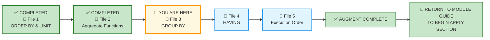

# 🗄️🤖 SQL & GenAI Course
**🎯 Quality Education for Anyone, Anywhere, Anytime — 💫 with Comfort, Convenience at no Cost**

---

## 📘 File 3: GROUP BY – The Art of Categorization (powered with AI Augmentation)

Welcome back to the Socratic Mirror. You have already completed the **ACQUIRE** phase for this file and mastered grouping rows with `GROUP BY`, using aggregate functions per category, grouping by multiple columns, and handling derived columns with `CASE` and date functions.

You are now entering the **ACCELERATE structural sequencing phase**.

> 📐 **Scope Reminder:** This AUGMENT file covers only **GROUP BY** and its supporting rules: the Golden Rule (non-aggregated columns in `GROUP BY`), grouping by multiple columns, grouping with `NULL`s, and grouping with derived columns using `strftime` and `CASE`. Do not introduce `HAVING`, complex joins, or subqueries yet. Respect the spiral.

---

## 📍 Your Current Stage – AUGMENT Journey



---

## 🌀 Immersive Cognitive Traversal

ACCELERATE is not a linear syllabus. It is a **spiral chamber** where each phase strips away a different veil: preparation, vocabulary, execution.

| Chamber | What You Do Here | What Leaves Your System |
|---------|------------------|-------------------------|
| **🏁 Orientation Chamber** | Load toolkits, lock scope | Confusion about what is allowed |
| **🧠 ACCELERATE Operating System** | Absorb the mandate | Uncertainty about the rules of engagement |
| **⚡ Socratic Execution Chamber** | Interrogate AI scripts, analyse production echoes | Passive consumption – you become an active judge |

**You cannot interrogate what you have not prepared. You cannot judge what you have not named.**

Each chamber is a **gate**. Pass through all three. Descend with intention. Emerge with judgment.

**Start your SQLVerse Spiral Immersive journey.**

---

<div style="border: 2px solid #ff9800; border-radius: 10px; padding: 15px; margin: 20px 0; background: linear-gradient(135deg, #fff8e1 0%, #ffe0b2 100%);">

### 📘 Framework Reference

The complete **Phase 1 (Orientation Chamber)** and **Phase 2 (ACCELERATE Operating System)** – including Browser Office, Toolkits, Cognitive Compression Notice, Extraction Compass, Failure Classification, and all other framework content – has been compiled into a single reference document.

You do not need to read it every time. Keep it handy and refer to it whenever you need to revisit the ACCELERATE setup or terminologies.

📁 [`ACCELERATE_FRAMEWORK_REFERENCE.md`](../ACQUIRE-MODULE2/ACCELERATE_FRAMEWORK_REFERENCE.md)

</div>

---


# 🏁 Phase 1: Pre‑requisites and Preparation

## 🏁 Orientation Chamber

### ⚠️ REMINDER – ACQUIRE Foundation First

Before you enter this AUGMENT chamber, you must complete the ACQUIRE foundation for this concept:

1. **Read the ACQUIRE lesson file** – understand the syntax and examples.
2. **Extract ACQUIRE Gemstones** – collect skills, insights, and achievements from the ACQUIRE file into `GemstoneArray.md`.

> 📌 **Prerequisite:** Study the core concept files in the **Architect's Ledger** (ACQUIRE Module) thoroughly before beginning AUGMENT:
>
> -   `1-RDBMS-Core-concepts.md`
> 
> -   `2-Domains-And-Entities.md`
>
> -   `3-Primary-Key.md`
>
>These establish foundational knowledge regarding granular entity records versus summarized domain dimensions—assumed knowledge in ACCELERATE.

> 🔁 **Spiral Rule:** ACQUIRE builds foundation. ACCELERATE builds judgment. Do not skip the foundation.

**Mirror Bridge Reference:** `Level-1-beginner/Module3-Sort-Aggregate-Group/1-sqlCommands/3-group-by.md`

---

### 🎯 Mirror Objective

By completing this Socratic Mirror, you will be able to:

- **Identify and bypass** the hidden logic trap of omitting non‑aggregated columns from `GROUP BY` – the Golden Rule violation that breaks grouping.
- **Quantify** the cost of grouping by too many columns – when granularity becomes noise, not signal.
- **Trace reporting defects** down to incorrect grouping granularity (e.g., grouping by `enrollment_date` when you meant `month`).
- **Leverage Socratic reasoning prompts** to cross‑examine AI‑generated grouping scripts, exposing hidden assumptions about what constitutes a category.
- **Deconstruct AI-generated scripts** that treat every distinct value as a meaningful group without considering business context.

In **ACQUIRE**, you learned how to write a `GROUP BY` clause.

In **AUGMENT**, your objective is different:
- detect hidden defects in AI‑generated aggregation logic,
- interrogate AI assumptions about the true business granularity (the "grain"),
- evaluate production consequences of grouping at the wrong granularity,
- and determine whether a grouped query is architecturally trustworthy.

This chamber does not measure whether SQL executes.

It measures whether your reasoning survives pressure.

---

### 🔒 Scope Lock

This mirror is intentionally restricted to the conceptual boundaries of the ACQUIRE version.

This chamber explores:
- `GROUP BY` with single and multiple columns
- The Golden Rule: every non-aggregated column in `SELECT` must be in `GROUP BY`
- Grouping with `NULL`s – they form their own group
- Grouping with derived columns using `strftime` and `CASE`
- The distinction between `WHERE` (filters rows before grouping) and `GROUP BY` (creates groups)

This chamber does NOT yet include:
- `HAVING` – covered in File 4
- Complex joins – covered in Module 4
- Subqueries – covered in Level 2

Respect the spiral. **Master** one cognitive layer before descending deeper.

---

# 🧠 Phase 2: ACCELERATE Technical Terminologies

## 🧠 ACCELERATE Operating System

### 🚀 ACCELERATE MANDATE

**Socratic Guidance | No Code Generation | Strategy Over Syntax | Dialogue Logging**

**ACCELERATE GOLDEN RULE:**  
*You write every line of SQL manually. AI explains logic only. Never ask for code.*

---

## 🧩 High-Density Glossary – New Buzzwords

### Granularity

The level of detail represented in a grouped result. A query grouped by `enrollment_date` has finer granularity (daily) than one grouped by `strftime('%Y-%m', enrollment_date)` (monthly). The choice of grouping column determines the pattern you reveal.

### The Golden Rule

Every column in the `SELECT` clause must either be **wrapped in an aggregate function** or **listed in the `GROUP BY` clause**. This is non‑negotiable and enforced by all SQL databases. Violating it produces an error or unpredictable results.

### Functional Dependency Exception

If a column is **functionally dependent** on a grouped column (e.g., `course_name` is dependent on `course_id`), some databases allow it without grouping – but this is risky and **not recommended**. Professional SQL always follows the Golden Rule explicitly.

### Grouping with NULLs

Rows with `NULL` in the grouping column are grouped together into a single group. This is often a surprise but is useful for identifying missing data.

### Derived Grouping

Grouping by an expression (like `strftime('%Y-%m', enrollment_date)`) rather than a raw column. This allows you to create arbitrary categories that are not stored in the schema.

### Cardinality Inflation

When you group by too many columns, the number of groups increases, and the summary loses meaning. For example, grouping by `course_track`, `instructor_id`, and `course_id` would produce one row per course – defeating the purpose of aggregation.

---

# ⚡ Phase 3: Enter the AUGMENT Chamber and Execute

## ⚡ Socratic Execution Chamber

### 🌍 SQLVerse Business Universes

By now, you should have completed the **SQLVerse Business Suite Guide** and the **SQLVerse Business Multiverse Manifesto** introduced earlier in this cycle.

These documents provide the architectural foundation for every Business Universe, Blueprint, and exercise you encounter throughout SQLVerse.

If you have not read them yet, please do so before continuing.

* 📖 **SQLVerse Business Suite Guide**
* 📜 **SQLVerse Business Multiverse Manifesto**

---

* 📖 [SQLVerse Business Suite Guide →](../../../sqlverse-foundation/core/00-SQLVerse-Business-Suite-Guide.md)
* 📜 [SQLVerse Business Multiverse Manifesto →](../../../sqlverse-foundation/core/SQLVERSE_BUSINESS_MULTIVERSE.md)

**Read once. Refer forever.**

---

All demonstration databases for the **SQLVerse Business Multiverse** are located in:

```text
Level-1-beginner/sqlverse-foundation/resources/data-models/flagship-universes/
```

> **Note:** The **Training Institution** database (`training_institution_sample.db`) remains in the Course Repository Resources folder used throughout ACQUIRE. Its location is documented in the **ACCELERATE Framework Reference**. The remaining flagship databases (E-Store, Hospital Planet, Real Estate Planet, and FinVERSE) are stored in the SQLVerse Resource Repository shown above.

---

### 🔍 Cognitive Reorientation Layer

#### The Socratic Mirror for GROUP BY

Before you interrogate this query, run it through the **Professional Pipeline**:

```text
[1] Business Question  ──> What categories does the stakeholder want to see?
[2] The One-Row Rule   ──> What does ONE row represent after grouping?
[3] The Blueprint      ──> Is there a natural dimension (category) to group by?
[4] Domain Invariance  ──> Does the same `GROUP BY` pattern apply to other tables?
[5] The Vehicle        ──> Now write the `GROUP BY` clause.
```

In a small sandbox environment, grouping seems simple. You write `GROUP BY course_track`, and the database returns summaries per track.

But as an **SQLVerse Artisan**, you must question the prudence behind the query.

Consider this query:

```sql
SELECT course_track, COUNT(*) AS course_count
FROM courses
GROUP BY course_track;
```

It returns the number of courses per track. In our database, it works perfectly.

But as an Artisan, you must ask:

- **What story is this grouping telling?** Is `course_track` the right dimension? What about `instructor_id` or `duration_weeks`?
- **What if the stakeholder wanted to know courses per instructor, not per track?** The grouping column would change.
- **What if they wanted both – courses per instructor within each track?** That would require multi‑column grouping.

The query is syntactically correct. But is it **architecturally responsible**?

> **Law #4 in action:** *"The Syntax Is the Vehicle. The Judgment Is the Destination."*

---

### 🔄 The Golden Rule in Action

The most important rule of `GROUP BY` is the **Golden Rule**: every column in the `SELECT` clause that is not an aggregate must appear in the `GROUP BY` clause.

Consider this AI‑generated query:

```sql
SELECT course_track, instructor_id, COUNT(*) AS course_count
FROM courses
GROUP BY course_track;
```

**The Problem:** `instructor_id` is in the `SELECT` but not in the `GROUP BY`. The database raises an error because it doesn't know which instructor to show when multiple instructors teach the same track.

**The Artisan's Fix:**

```sql
SELECT course_track, instructor_id, COUNT(*) AS course_count
FROM courses
GROUP BY course_track, instructor_id;
```

Now the grouping creates sub‑buckets: for each track, it groups by instructor, so the result shows the number of courses each instructor teaches within each track.

**The Lesson:** The Golden Rule is not just a syntax rule—it forces you to think about the **correct granularity** of your analysis. If you group by track only, you cannot show instructor‑level detail. The database is protecting you from ambiguity.

---

### 🔍 Opening Reflection: The Autopilot Trap

An unguided AI assistant is asked to provide the total fees paid per month. It delivers this query:

```sql
SELECT enrollment_date, SUM(fees_paid) AS total_paid
FROM students
GROUP BY enrollment_date;
```

The query runs. It returns totals per day. In a tiny training database, it works.

But as an **SQLVerse Artisan**, you notice something:

- **Why per day?** The user said "per month," not "per day." The AI defaulted to the raw date.
- **What if the user wanted monthly trends?** Grouping by full date produces a row for each day – too granular for monthly analysis.
- **What if multiple students enrolled on the same day?** That's fine, but the stakeholder wanted a month‑level summary.

**The AI made an assumption.** It assumed the raw column was the right grouping level.

The AI gave you a working query. But it gave you a query that may not serve the user's actual need.

> 💡 **Artisan's Insight:** *"A working GROUP BY is not always the right GROUP BY. The difference is knowing what granularity serves the business question."*

### 🧠 Critical Cross‑Examination

- **The Core Defect:** What assumption did the AI make about the desired granularity?
- **The Scale Penalty:** What happens when this query returns hundreds of daily rows when the user wanted monthly aggregates?
- **The AI Blindspot:** What did the AI assume about the stakeholder's need for summarization?
- **The Syntactic Illusion:** Is this query syntactically perfect yet architecturally incomplete?

**The Artisan's Edge:**

```sql
SELECT strftime('%Y-%m', enrollment_date) AS month, SUM(fees_paid) AS total_paid
FROM students
GROUP BY month;
```

The Artisan recognises that the stakeholder needs a higher‑level view. Using `strftime` to extract the month converts the granularity from day to month – revealing the pattern, not the noise.

---

## 🛰️ Production Echo – Case 1

#### 🌍 Business Universe: FinVERSE

**Business Scenario:** A Credit Risk Analyst wants to know the current outstanding balance by loan status.

**The Query:** The AI generated this:

```sql
SELECT 
    status, 
    SUM(outstanding_balance) AS total_outstanding_balance
FROM loans
ORDER BY status;
```

**The Problem:** The query looks plausible—but it contains a fundamental defect. `status` appears in the `SELECT` clause as a non‑aggregated column, yet there is no `GROUP BY status`.

**The Artisan immediately asks:** *"What does one output row represent?"*

That question connects directly to the **One-Row Rule**.

---

**The Artisan's First Correction (Status-Level Summary):**

```sql
SELECT 
    status,
    SUM(outstanding_balance) AS total_outstanding_balance
FROM loans
GROUP BY status
ORDER BY status;
```

**Now the query answers:** *"What is the total outstanding balance per loan status?"*

---

**The Artisan's Next Question:** *"What if the stakeholder wants to see this exposure by the loans' approval date?"*

**The Artisan's Second Correction (Adding the Time Dimension):**

```sql
SELECT 
    status,
    approval_date,
    SUM(outstanding_balance) AS total_outstanding_balance
FROM loans
GROUP BY status, approval_date
ORDER BY status, approval_date;
```

**Now the query answers:** *"How has the outstanding balance by status changed over time?"*

**Notice the distinction:** This gives us outstanding exposure by **approval date**. It does not show how outstanding balances **evolved over time**.

---

**The Lesson Progression:**

```text
Business Question (snapshot)
       ↓
What should ONE ROW represent?
       ↓
GROUP BY status
       ↓
Status-level summary
       ↓
New business question (trend)
       ↓
What should ONE ROW represent now?
       ↓
GROUP BY status, approval_date
       ↓
Status × approval-date analysis
```

**Fixing a SQL error does not necessarily fix the business question.**

---

#### 📋 The Analysis:

| Element | Why It's Effective |
|---------|-------------------|
| **AI Query → First Correction → Second Correction** | A clean, logical progression from defect to complete solution |
| **One-Row Rule** | Anchors the reasoning in a professional principle |
| **Business Question Evolution** | Demonstrates that SQL evolves with business needs |
| **Lesson Progression Diagram** | Visualises the cognitive journey |
| **Final Insight** | "Fixing a SQL error does not necessarily fix the business question" — the signature SQLVerse takeaway |

---


**The Lesson:** A single-column grouping answers *"What is the total outstanding balance per status?"* but it does not reveal how outstanding balances evolve over time.

Adding `approval_date` to the `GROUP BY` allows you to see **when loans were approved** and how outstanding balances cluster by approval period.

To truly track **how outstanding balances change over time**—month by month, quarter by quarter—you would need to join `loans` with `loan_payments` and group by `payment_date`. That analysis will be covered in **Module 4**, when joins become part of your toolkit.

> 🔭 **Preview:** In Module 4, you will learn to combine `loans` and `loan_payments` to track how outstanding balances evolve over time—revealing trends that static snapshots cannot.

---

## 🛰️ Production Echo – Case 2

#### 🌍 Business Universe: Real Estate Planet

**Business Scenario:** A real estate executive wanted to see total listing valuation and average days on market per city, categorized by property status (`Active`, `Pending`, `Sold`).

**The Query:** The AI generated this:

```sql
SELECT city, SUM(list_price), AVG(days_on_market)
FROM properties
GROUP BY city;
```

**The Problem:** The AI ignored the business requirement to break down listings by property status. It collapsed all active, sold, and pending properties into a single city-level number—mixing historical closed sales with active asking prices, and making it impossible to separate current market activity from completed transactions.

**The Analysis:** The AI generated a syntactically correct query. But it failed to recognise that the stakeholder needs to compare **active listings** (current pricing strategy) against **sold listings** (historical market outcomes). These are fundamentally different metrics that should not be aggregated together.

**The Corrected Query (Multi-Column Grouping Grain):**

```sql
SELECT 
    city,
    status,
    COUNT(property_id) AS property_count,
    ROUND(SUM(list_price), 2) AS total_valuation,
    ROUND(AVG(days_on_market), 1) AS avg_days_on_market
FROM properties
GROUP BY city, status
ORDER BY city, status;
```

**The Lesson:** Single-column grouping often hides crucial sub-dimension variations. When business logic involves multi-dimensional analysis—such as segmenting properties by both city and status—use multi-column `GROUP BY`. The `status` dimension is not a technical requirement; it is a business requirement.

---

### 🧠 What This Pair Achieves

| Case | Universe | Core Lesson |
|------|----------|-------------|
| **Case 1** | FinVERSE | Adding a time dimension to `GROUP BY` reveals trends hidden in static snapshots |
| **Case 2** | Real Estate | Multi-column grouping enables multi-dimensional business analysis |

**The Skeletal Pattern:**

```sql
SELECT 
    dimension_1,
    dimension_2,
    aggregate_1,
    aggregate_2
FROM table
WHERE filter_condition
GROUP BY dimension_1, dimension_2
ORDER BY dimension_1, dimension_2;
```

**The nouns change. The logic does not.**

---

### 🪞 Pattern Reflection

| Element | Case 1 (FinVERSE) | Case 2 (Real Estate) |
|---------|-------------------|----------------------|
| **Dimension 1** | `status` | `city` |
| **Dimension 2** | `approval_date` | `status` |
| **Aggregate** | `SUM(outstanding_balance)` | `COUNT(property_id)`, `SUM(list_price)`, `AVG(days_on_market)` |
| **Core Lesson** | Time dimension reveals trends | Sub-dimension reveals segmentation |

---
### 🧩 Failure Evaluation Matrix

| Failure Type | Case 1 – FinVERSE | Case 2 – Real Estate | Explanation |
|--------------|-------------------|----------------------|-------------|
| **Syntax Failure** | ⚠️ Database‑dependent (SQLite may execute) | ❌ No | SQLite may execute the query and return an arbitrary status value |
| **Logical Failure** | ✅ Yes | ❌ No | The query does not answer the requested status‑level grouping |
| **Architectural Failure** | ✅ Yes | ✅ Yes | The AI omitted a critical grouping dimension |
| **Operational Failure** | ✅ Yes | ✅ Yes | The query produces misleading or incomplete business intelligence |

---

### 🛰️ Production Echo – Same Data, Three Granularities, Three Stakeholders, Universal Appeal

**Same raw data. Different grouping dimensions. Different stakeholders. Different business stories.**

That is the SQLVerse Artisan's power – recognising that the choice of grouping dimension determines the story the data tells—and who it serves. 

The `GROUP BY` clause is a **dimensional prism**. It takes raw, undifferentiated data and splits it into meaningful categories—each revealing a different pattern, each serving a different stakeholder.

---

#### 📋 The Pattern Across All Three Universes

| Universe | Table | Entity Dimension | Dimension 2  | Dimension 3  |
|----------|-------|---------------------|-------------------------------|---------------------------|
| **Real Estate Planet** | `payments` | `contract_id` | `payment_date` | `payment_method` |
| **Hospital Planet** | `appointments` | `doctor_id` | `appointment_date` | `patient_id` |
| **FinVERSE** | `loan_payments` | `loan_id` | `payment_method` | `status` |

> **The dimensions themselves change by domain. What remains invariant is the analytical pattern: choose a dimension, define the resulting grain, aggregate within that grain, and interpret the result for a stakeholder.**

---

#### 🏛️ The Skeletal Pattern

```sql
SELECT 
    [dimension_column],
    COUNT(*) AS record_count,
    SUM(amount) AS total_value
FROM [table]
GROUP BY [dimension_column]
ORDER BY total_value DESC;
```
**Consistency Rule:**

```text
COUNT(*) → [metric]_count
SUM(amount) → total_[metric]
Alias pattern: [dimension]_[aggregate]
```

### 📋 Cross-Link to Phase 2 Glossary

| Term | Glossary Entry | Link Location |
|------|----------------|---------------|
| **Granularity** | `🧩 High-Density Glossary – New Buzzwords` | In the introductory paragraph before the first universe |
| **Cardinality Inflation** | `🧩 High-Density Glossary – New Buzzwords` | In the Pattern Reflection section |

> *"As you examine each granularity, recall the **Granularity** concept from the glossary—the level of detail represented in a grouped result determines the pattern you reveal."*


**The nouns change. The logic does not.**

---

### 🌍 Multi-Dimensional Analysis Across Universes

Modern business reports rarely look at data through a single lens. `GROUP BY` allows analysts to slice data by multiple categories simultaneously to uncover hidden intelligence. The `GROUP BY` clause acts as the primary analytical bridge in SQL, transforming raw operational logs into high-density, structured insights.

Let us look at how multi-layered grouping enables us to understand the nuances.

---

### 🏡 Universe 1: Real Estate Planet – Payments Table

**Raw Data:** Payments made against property contracts.

---

**Granularity 1 – Group by Contract (Deal-Level View)**

```sql
SELECT 
    contract_id,
    COUNT(*) AS payment_count,
    SUM(amount) AS total_payments
FROM payments
GROUP BY contract_id
ORDER BY total_payments DESC;
```

**What this reveals:** Which contracts have the highest total payment value.

**Business Question:** *"Which deals are generating the most revenue?"*

**Stakeholder:** Chief Investment Officer (CIO) – identifying high-value deals for portfolio strategy.

---

**Granularity 2 – Group by Payment Date (Timeline View)**

```sql
SELECT 
    payment_date,
    COUNT(*) AS payment_count,
    SUM(amount) AS total_payments_by_date
FROM payments
GROUP BY payment_date
ORDER BY payment_date;
```

**What this reveals:** Payment volume and value over time.

**Business Question:** *"When are payments concentrated? Are there seasonal patterns?"*

**Stakeholder:** Finance Director – forecasting cash flow and identifying revenue cycles.

---

**Granularity 3 – Group by Payment Method (Operational View)**

```sql
SELECT 
    payment_method,
    COUNT(*) AS payment_count,
    SUM(amount) AS total_payments_by_method
FROM payments
GROUP BY payment_method
ORDER BY total_payments_by_method DESC;
```

**What this reveals:** Which payment methods are most frequently used and generate the most value.

**Business Question:** *"Should we incentivise Wire transfers over Cash?"*

**Stakeholder:** Operations Manager – optimising settlement processes and fee structures.

---

### 🏥 Universe 2: Hospital Planet – Appointments Table

**Raw Data:** Patient appointments with doctors and treatments.

---

**Granularity 1 – Group by Appointment Date (Volume View)**

```sql
SELECT 
    appointment_date,
    COUNT(*) AS appointments_by_date
FROM appointments
GROUP BY appointment_date
ORDER BY appointment_date;
```

**What this reveals:** Patient volume by day.

**Business Question:** *"Which days have the highest patient volume?"*

**Stakeholder:** Operations Director – planning staffing and resource allocation.

---

**Granularity 2 – Group by Doctor (Workload View)**

```sql
SELECT 
    doctor_id,
    COUNT(*) AS appointments_by_doctor
FROM appointments
GROUP BY doctor_id
ORDER BY appointments_by_doctor DESC;
```

**What this reveals:** Which doctors are handling the most appointments.

**Business Question:** *"Are we overloading certain doctors?"*

**Stakeholder:** Medical Director – balancing doctor workloads and identifying training needs.

---

**Granularity 3 – Group by Patient (Visit Frequency View)**

```sql
SELECT 
    patient_id,
    COUNT(*) AS appointments_by_patient
FROM appointments
GROUP BY patient_id
ORDER BY appointments_by_patient DESC;
```

**What this reveals:** Which patients visit the most frequently.

**Business Question:** *"Which patients are chronic care candidates?"*

**Stakeholder:** Patient Care Coordinator – identifying high-risk patients for proactive care management.

---

### 💳 Universe 3: FinVERSE – Loan Payments Table

**Raw Data:** Payments made against loans.

---

**Granularity 1 – Group by Loan (Account-Level View)**

```sql
SELECT 
    loan_id,
    COUNT(*) AS payment_count,
    SUM(amount) AS total_payments
FROM loan_payments
GROUP BY loan_id
ORDER BY total_payments DESC;
```

**What this reveals:** Which loans are generating the most repayment volume.

**Business Question:** *"Which loans have generated the highest repayment volume?"*

**Stakeholder:** Credit Portfolio Manager – identifying high-performing loan products.

---

**Granularity 2 – Group by Payment Method (Channel View)**

```sql
SELECT 
    payment_method,
    COUNT(*) AS payment_count,
    SUM(amount) AS total_payments_by_method
FROM loan_payments
GROUP BY payment_method
ORDER BY total_payments_by_method DESC;
```

**What this reveals:** Which payment channels are most effective for loan repayment.

**Business Question:** *"Should we prioritise UPI or Bank Transfer channels?"*

**Stakeholder:** Payments Strategy Lead – optimising collection channels and reducing friction.

> **🔍 Curiosity Prompt:**
>
> The query above shows you the distribution of payments across `Completed`, `Pending`, and `Failed` statuses. However, if the business question asked was: *"What percentage of payments are failing or pending?"*
>
> This query does not calculate percentages—it calculates counts and sums.
>
> Ask your Socratic Consultant:
> *"How would you modify this query to calculate the percentage of payments in each status? What additional SQL concepts would you need to learn?"*
>
> This is a **Level 2** concept involving subqueries or window functions. For now, focus on understanding the grouping pattern. The percentage calculation will be covered when you return to FinVERSE at the next level.

---

**Granularity 3 – Group by Status (Risk/Health View)**

```sql
SELECT 
    status,
    COUNT(*) AS payment_count,
    SUM(amount) AS total_payments_by_status
FROM loan_payments
GROUP BY status
ORDER BY status;
```

**What this reveals:** Distribution of payment statuses (Completed, Pending, Failed).

**Business Question:** *"How are loan payments distributed across Completed, Pending, and Failed statuses?"*

**Stakeholder:** Risk Officer – identifying collection risks and early warning signals.

---

### 🪞 Pattern Reflection

| Universe | Table | Dimension 1 | Dimension 2 | Dimension 3 |
|----------|-------|-------------|-------------|-------------|
| **Real Estate Planet** | `payments` | `contract_id` | `payment_date` | `payment_method` |
| **Hospital Planet** | `appointments` | `doctor_id` | `appointment_date` | `patient_id` |
| **FinVERSE** | `loan_payments` | `loan_id` | `payment_method` | `status` |

**The SQL is identical in structure.** Only the table and column names change.

> 💡 **Law #3 in action:** *"Logic Outlives Vocabulary."*

The business vocabulary changes. The skeletal pattern remains invariant.

**The nouns change. The logic does not.**

---

### 📌 Key Takeaway

The same `GROUP BY` pattern serves three different stakeholders across three different industries:

- **Real Estate Planet** → CIO, Finance Director, Operations Manager
- **Hospital Planet** → Operations Director, Medical Director, Patient Care Coordinator
- **FinVERSE** → Credit Portfolio Manager, Payments Strategy Lead, Risk Officer

```text
🧠 The SQLVerse Artisan's Magic

Same Table 
    ↓
Same Raw Rows
    ↓
Three Different GROUP BY Clauses
    ↓
Three Different Data Grains
    ↓
Three Different Executive Insights
    ↓
Three Different Universes
    ↓
Extensible to any Universe
```

**GROUP BY is not a technical grouping tool. It is an analytical boundary definition.**

The choice of grouping dimension is not a syntax decision—it is a **business decision**. It determines what patterns are revealed, who the analysis serves, and what story the data tells.

**The SQL is the vehicle. The judgment—choosing the right granularity for the right stakeholder—is the destination.**

> *"A query that reveals the right pattern to the right stakeholder is not just SQL. It is business intelligence."*

---

### 🎭 The Copilot's Script

#### 🌍 Business Universe: E‑Store

The Product Manager wants to know the total revenue per product category. The AI assistant generated this query:

```sql
-- Generated by AI assistant for revenue per category
SELECT 
    category,
    SUM(oi.quantity * p.price) AS total_revenue
FROM products p
JOIN order_items oi ON p.product_id = oi.product_id
GROUP BY category;
```

**The Problem:** The Product Manager did not specify that they wanted to see revenue by category **and** product – but they might later ask for details about which product drives revenue within each category.

As an **SQLVerse Artisan**, you anticipate this:

```sql
-- The Artisan's Edge: Multi‑Column Grouping
SELECT 
    p.category,
    p.product_name,
    SUM(oi.quantity * p.price) AS product_revenue,
    ROUND(AVG(oi.quantity * p.price), 2) AS avg_line_item_value
FROM products p
JOIN order_items oi ON p.product_id = oi.product_id
GROUP BY p.category, p.product_name
ORDER BY p.category, product_revenue DESC;
```

**This query** shows the breakdown by both category and product – giving the Product Manager the granularity they may need.

---

**Architectural Observation:**

```sql
SUM(oi.quantity * p.price) AS product_revenue
```

This calculation multiplies the **quantity sold** by the **current price** stored in the `products` table. While this works today, it assumes that product prices never change—a dangerous assumption in production.

**What happens if a product price changes after an order is placed?**

Historical revenue reports would suddenly become inaccurate. The price at the time of the order should be frozen—not looked up dynamically from the product master table.

**This is not a flaw in your SQL—it is a gap in the schema design.**

---

> 🏛️ **Architect's Teaser — Module 4 Case Study**
>
> In a production e‑commerce system, the price of a product belongs in the transaction record itself—**not** in the product master table.
>
> In Module 4, you will encounter this exact scenario as a case study:
>
> **"The Price Freeze"**
>
> You will learn:
> - Why the current design fails when product prices change
> - How to evolve the schema to freeze prices at the time of order
> - When to denormalize for historical accuracy
>
> **For now, focus on the tools you have. In Module 4, you will extend your toolkit to handle this limitation.**

---

### 🧠 Socratic Interrogation Loop

**Interrogation Question 1:** The AI query groups by `category` only. If you group by both `category` and `product_name`, what happens to the number of rows? Is that better or worse for the Product Manager?

**Interrogation Question 2:** How would you modify the AI query to show only the top‑selling product in each category? (Hint: you'll need `ORDER BY` and `LIMIT` – but that's a later pattern.)

**Interrogation Question 3:** What if the Product Manager wants to see revenue by category, but only for categories with total revenue above $10,000? That requires `HAVING` – coming in File 4.

---

### 🔗 The Architectural Guardrail: The Golden Rule

As an Artisan, you must always verify that the `GROUP BY` clause contains every non‑aggregated column in the `SELECT`. This is not optional – it is a non‑negotiable rule.

#### The Cost of Violating the Golden Rule

| Database | Typical Behaviour |
|----------|-------------------|
| **SQLite** | May execute the query and return an arbitrary/non‑deterministic value for the non‑aggregated column — **dangerous** |
| **MySQL** | Behaviour depends on SQL mode; strict configurations reject it |
| **PostgreSQL** | Rejects it |
| **SQL Server** | Rejects it |

**The Professional Rule:**

> **Never interpret "the query ran" as evidence that the query is correct.**

**A working query is not necessarily a correct query.**

---

### 🔍 Probing Questions for Your AI Consultant (Tab 3)

Paste these investigative prompts into Tab 3 to deconstruct grouping principles. **Do not ask for SQL code**; focus entirely on the architectural reasoning.

1. *"What is the difference between grouping by a raw date column and grouping by a derived month expression? Why does granularity matter?"*

2. *"Explain the Golden Rule of `GROUP BY`. Why does every non‑aggregated column in `SELECT` have to appear in `GROUP BY`?"*

3. *"What happens when you group by a column that contains `NULL` values? How would you handle that in a production report?"*

4. *"When would you group by multiple columns? What does that reveal about the data that single‑column grouping cannot?"*

5. *"How does the AI decide which column to group by when the user says 'summarise by month'? What assumptions does it make?"*

6. *"What is the performance impact of grouping by a derived column like `strftime('%Y-%m', date)` compared to a raw column?"*

7. *"If a stakeholder wants to see total sales per product category but also wants the product name, what grouping granularity would you choose?"*

8. *"Why is `WHERE` not suitable for filtering groups? When would you use `HAVING` instead?"*

9. *"How can you detect an AI‑generated `GROUP BY` query that has chosen the wrong grouping granularity?"*

10. *"What business scenarios require grouping by multiple dimensions (e.g., product category and region)?"*

---

### 🧪 Socratic Reflection Probe

Before you cross the bridge to the next file, paste this exact **Golden Calibration Prompt** into your Consultant (Tab 3) to stress‑test your baseline mental models:

> **Golden Prompt:** *"I am evaluating grouping and granularity boundaries. Explain how a query that groups by the wrong dimension (e.g., day when month is needed) introduces a reporting defect in a production system. Detail how intentional grouping granularity protects strategic decision‑making."*

---

### 💎 GEMSTONE EXTRACTION WINDOW

Before you proceed to the next file, capture your architectural insights into `EXTRACTION_BAY/SkillTree/GemstoneArray.md`.

| Extraction Field | Your Response |
|-----------------|---------------|
| **Skill Extracted** | Detecting and correcting `GROUP BY` queries that violate grouping rules or reveal the wrong analytical grain |
| **Objective Mastered** |  Designing grouping logic that serves the business question and stakeholder priority |
| **Viewpoint Shifted** | From "Does this query run?" to "Does this grouping reveal the right pattern?" |
| **Anti-pattern Defeated** | Omitting non‑aggregated columns from `GROUP BY`; grouping at wrong granularity |
| **Production Constraint Validated** | Grouping dimensions affect result grain, report clarity, and potentially query performance |

---

### 📝 Example Portfolio Entry – File 3: GROUP BY

Below is a concrete example of how to populate your Skill‑Tree tables from the insights and skills you extract in this file. Use this as a model when creating your own entries.

**Source File:** `3-group-by.md`

---

#### 💎 Insert into `skills_level1`

```sql
INSERT INTO skills_level1 (module_id, filename, skill_name, objective_text, student_viewpoint)
VALUES (
    3, '3-group-by.md',
    'Detecting GROUP BY queries that group at the wrong granularity or violate the Golden Rule',
    'Identify and question grouping logic that produces ambiguous or overly granular results.',
    'I used to think GROUP BY was just about syntax. Now I understand it is about choosing the right level of detail to reveal patterns.'
);
```

#### 💡 Insert into `insights_level1`

```sql
INSERT INTO insights_level1 (module_id, source_filename, insight_text, student_viewpoint)
VALUES (
    3, '3-group-by.md',
    'A GROUP BY query is only as good as its grouping granularity. Group by day to see noise; group by month to see trends.',
    'I realised that grouping is a business decision – it defines what kind of story the data tells.'
);
```

#### 🏆 Insert into `achievements_level1`

```sql
INSERT INTO achievements_level1 (achievement_type, module_id, source_filename, score_or_status, student_viewpoint)
VALUES (
    'Simulation', 3, '3-group-by.md', 'Socratic Log Saved',
    'Successfully executed the Golden Calibration Prompt against the AI consultant. Calibrated my understanding of grouping and granularity.'
);
```

#### 💎 Insert into `bonus_skills_level1`

```sql
-- The Golden Rule
INSERT INTO bonus_skills_level1 (module_id, bonus_skill_name, source_filename)
VALUES (
    3,
    'Every non-aggregated column selected at the grouped result grain must be accounted for in the GROUP BY clause.',
    '3-group-by.md'
);

-- Granularity Awareness
INSERT INTO bonus_skills_level1 (module_id, bonus_skill_name, source_filename)
VALUES (
    3,
    'Choose grouping granularity based on the business question, not the raw column available.',
    '3-group-by.md'
);
```

#### 📝 Insert into `socratic_logs_level1`

```sql
INSERT INTO socratic_logs_level1 (
    module_id, sub_module, cycle, filename,
    structural_question, ai_guidance, student_final_sql,
    initial_understanding, realised_insight
) VALUES (
    3, 'ACQUIRE-MODULE3', 'AUGMENT', '3-group-by.md',
    'What is the difference between grouping by a raw date column and grouping by a derived month expression?',
    'Grouping by raw date produces a row per day; grouping by derived month produces a row per month. Choose based on the stakeholder`s need for summarization.',
    'SELECT strftime("%Y-%m", enrollment_date) AS month, COUNT(*) AS students FROM students GROUP BY month;',
    'I thought GROUP BY always grouped by whatever column I put in the clause.',
    'The granularity of the grouping column determines the pattern revealed. Group at the level that answers the business question, not the level of the raw data.'
);
```

---

## ✅ Progress Check (AUGMENT)

Can you confidently answer the following before descending to the next layer?

* [ ] Do you check whether every selected non-aggregated column is properly accounted for in the `GROUP BY`?
* [ ] Can you explain why grouping at the wrong granularity creates reporting defects?
* [ ] Do you understand that `NULL` values form their own group and how to handle them?
* [ ] Can you identify when an AI-generated `GROUP BY` query is missing a required grouping dimension?
* [ ] Can you explain what **one row represents** after grouping?

**If yes → You're ready for File 4: HAVING.**

---

# 💎 DESIGNER'S PERIGON

<div style="border: 3px solid #9c27b0; border-radius: 10px; padding: 20px; margin: 25px 0; background: linear-gradient(135deg, #f3e5f5 0%, #e1bee7 100%);">

### *Look at the Bones*


You've just learned to **group** raw records into aggregated summaries – to transform thousands of scattered rows into focused executive insight.

Think about how a post office sorts mail. Letters aren't left in a massive, chaotic pile. They are sorted into **bins by postal code**. Once inside the bin, individual addresses no longer matter to the long-haul truck driver—only the total weight of the bin and its destination code matter.

Think about how a bank teller handles cash at the end of a shift:

-   Loose bills are stacked by **denomination** ($10s, $20s, $100s).
    
-   Each denomination stack is counted and summed.
    
-   The manager doesn't look at serial numbers on every bill; they look at the **denomination summaries**.

**Every decision to group is a decision to see patterns.**

`GROUP BY` isn't just syntax – it's choosing the bin size for your data. When you group by `customer_id`, you're viewing the world through individual relationships. When you group by `account_type`, you're stepping back to view enterprise risk portfolio buckets.

An amateur sees a table of numbers and tries to write queries that throw everything onto the screen at once. 

An artisan defines the **grain** first, stripping away individual row noise so the underlying business pattern stands clear.

> **Before writing `GROUP BY`, define the grain: What should one output row represent?**

**GROUP BY → Grain → One-Row Rule**

The AI frequently generates grouping queries based on the **first column that looks categorical** – often `course_track` or `category`. An artisan chooses the grouping dimension based on the **business question**.

**You're not just grouping data. You're choosing what story to tell.**

---

### ⚡ The SQLVerse Witness

**Business Requirement:** Raj, the CFO of Library Planet, needs to understand how membership tiers are distributed across the library network. He wants to see which membership levels are most common, and whether premium members are concentrated in specific regions.

He asks you: *"Give me a breakdown of our members by tier. Show me the count and total annual fees per tier. And if you can, show me how they break down by city."*

---

**The Literal Query (Just Syntax):**

```sql
SELECT membership_tier, COUNT(*) AS member_count
FROM members
GROUP BY membership_tier;
```

This query returns the number of members per tier. It runs.  It answers the first part of the requirement but does not satisfy the requested city-level breakdown. It tells only part of the story.

---

**The Artisan's Edge:**

```sql
SELECT 
    city,
    membership_tier,
    COUNT(*) AS member_count,
    ROUND(SUM(annual_fee), 2) AS total_revenue
FROM members
GROUP BY city, membership_tier
ORDER BY city, membership_tier;
```

Now Raj sees the distribution of membership tiers **across cities**. He can identify which regions have the highest premium adoption, which cities might need targeted campaigns, and where revenue concentration lies.

**The Reflection:** A careless query returns the right rows. An Artisan's query returns the right **patterns** – with context, boundaries, and professional judgment.

---

**Treat your grouping queries as pattern‑finding tools. They exist to reveal what the business needs to see.**

</div>

---

## 🔁 Bridge Forward

You have interrogated `GROUP BY`, the Golden Rule, grouping granularity, and derived grouping.

Next, you will move to the next AUGMENT lesson: **HAVING** – where you will learn to filter the groups themselves, not just the rows.

---

## 🧭 File Navigation

```mermaid
flowchart LR
    A["✅ COMPLETED<br/>📘 File 1<br/>ORDER BY & LIMIT"] --> B
    B["✅ COMPLETED<br/>📘 File 2<br/>Aggregate Functions"] --> C
    C["✅ COMPLETED<br/>📘 File 3<br/>GROUP BY"] --> D
    D["📘 File 4<br/>HAVING"] --> E
    E["📘 File 5<br/>Execution Order"] --> F
    F["✅ AUGMENT COMPLETE"] --> G
    G["🔄 RETURN TO MODULE GUIDE"]
    
    style A fill:#c8e6c9,stroke:#2e7d32,stroke-width:2px
    style B fill:#c8e6c9,stroke:#2e7d32,stroke-width:2px
    style C fill:#c8e6c9,stroke:#2e7d32,stroke-width:4px
    style D fill:#e1f5fe,stroke:#2196f3,stroke-width:2px
    style E fill:#e1f5fe,stroke:#2196f3,stroke-width:2px
    style F fill:#c8e6c9,stroke:#2e7d32,stroke-width:2px
    style G fill:#c8e6c9,stroke:#2e7d32,stroke-width:2px
```



| Previous Step | Next Step |
|:---:|:---:|
| [← Back to File 2: Aggregate Functions](./2-aggregate-functions.md) | [Continue to File 4: HAVING →](./4-having.md) |

---

*Part of our mission for 🎯 Quality Education for Anyone, Anywhere, Anytime — 💫 with Comfort, Convenience at no Cost.*

**Level 1 | ACCELERATE Phase | AUGMENT | Module 3 | File 3: GROUP BY | Next: [HAVING](./4-having.md)**


