# 🗄️🤖 SQL & GenAI Course
**🎯 Quality Education for Anyone, Anywhere, Anytime — 💫 with Comfort, Convenience at no Cost**

---

## 📘 File 4: HAVING – Filtering the Forest, Not the Trees (powered with AI Augmentation)

Welcome back to the Socratic Mirror. You have already completed the **ACQUIRE** phase for this file and mastered filtering groups with `HAVING`, distinguishing `WHERE` from `HAVING`, and using aggregate conditions to focus on meaningful patterns.

### 🧠 From GROUP BY to HAVING: The Natural Progression

In File 3, you mastered `GROUP BY`—the engine that defines analytical boundaries and collapses individual rows into summary buckets.

But in real-world data analysis, forming groups is only half the battle. Executives rarely want to see every group; they want to see the groups that cross specific operational or financial thresholds:

- *"Show me customer segments that generated **more than $10,000** in total revenue."*

- *"Show me medical departments averaging **more than 45 minutes** per treatment."*

- *"Show me real estate listing agents with **fewer than 2 active listings**."*

- *"Show me financial accounts where total withdrawal volume **exceeds 80%** of total deposits."*

This is where **`HAVING`** enters the logical execution order.

While the `WHERE` clause filters individual raw rows **before** aggregation occurs, the `HAVING` clause filters collapsed summary groups **after** `GROUP BY` completes its work.

**The Artisan's Rule:** `WHERE` filters the ingredients. `HAVING` filters the soup.

---

You are now entering the **ACCELERATE structural sequencing phase**.

> 📐 **Scope Reminder:** This AUGMENT file covers only **HAVING**—filtering groups after aggregation, the logical sequence (`WHERE` → `GROUP BY` → `HAVING`), and the distinction between row-level and group-level filters. Do not introduce subqueries, complex joins, or window functions. Respect the spiral.

---

## 📍 Your Current Stage – AUGMENT Journey

```mermaid
flowchart LR
    A["✅ COMPLETED<br/>📘 File 1<br/>ORDER BY & LIMIT"] --> B
    B["✅ COMPLETED<br/>📘 File 2<br/>Aggregate Functions"] --> C
    C["✅ COMPLETED<br/>📘 File 3<br/>GROUP BY"] --> D
    D["📍 YOU ARE HERE<br/>📘 File 4<br/>HAVING"] --> E
    E["📘 File 5<br/>Execution Order"] --> F
    F["✅ AUGMENT COMPLETE"] --> G
    G["🔄 RETURN TO MODULE GUIDE<br/>TO BEGIN APPLY SECTION"]
    
    style A fill:#c8e6c9,stroke:#2e7d32,stroke-width:2px
    style B fill:#c8e6c9,stroke:#2e7d32,stroke-width:2px
    style C fill:#c8e6c9,stroke:#2e7d32,stroke-width:2px
    style D fill:#fff8e1,stroke:#ff9800,stroke-width:4px
    style E fill:#e1f5fe,stroke:#2196f3,stroke-width:2px
    style F fill:#c8e6c9,stroke:#2e7d32,stroke-width:2px
    style G fill:#c8e6c9,stroke:#2e7d32,stroke-width:2px
```



---

## 🌀 Immersive Cognitive Traversal

ACCELERATE is not a linear syllabus. It is a **spiral chamber** where each phase strips away a different veil: preparation, vocabulary, execution.

| Chamber | What You Do Here | What Leaves Your System |
|---------|------------------|-------------------------|
| **🏁 Orientation Chamber** | Load toolkits, lock scope | Confusion about what is allowed |
| **🧠 ACCELERATE Operating System** | Absorb the mandate | Uncertainty about the rules of engagement |
| **⚡ Socratic Execution Chamber** | Interrogate AI scripts, analyse production echoes | Passive consumption – you become an active judge |

**You cannot interrogate what you have not prepared. You cannot judge what you have not named.**

Each chamber is a **gate**. Pass through all three. Descend with intention. Emerge with judgment.

**Start your SQLVerse Spiral Immersive journey.**

---

<div style="border: 2px solid #ff9800; border-radius: 10px; padding: 15px; margin: 20px 0; background: linear-gradient(135deg, #fff8e1 0%, #ffe0b2 100%);">

### 📘 Framework Reference

The complete **Phase 1 (Orientation Chamber)** and **Phase 2 (ACCELERATE Operating System)** – including Browser Office, Toolkits, Cognitive Compression Notice, Extraction Compass, Failure Classification, and all other framework content – has been compiled into a single reference document.

You do not need to read it every time. Keep it handy and refer to it whenever you need to revisit the ACCELERATE setup or terminologies.

📁 [`ACCELERATE_FRAMEWORK_REFERENCE.md`](../ACQUIRE-MODULE2/ACCELERATE_FRAMEWORK_REFERENCE.md)

</div>

---

# 🏁 Phase 1: Pre‑requisites and Preparation

## 🏁 Orientation Chamber

### ⚠️ REMINDER – ACQUIRE Foundation First

Before you enter this AUGMENT chamber, you must complete the ACQUIRE foundation for this concept:

1. **Read the ACQUIRE lesson file** – understand the syntax and examples.
2. **Extract ACQUIRE Gemstones** – collect skills, insights, and achievements from the ACQUIRE file into `GemstoneArray.md`.

> 🔁 **Spiral Rule:** ACQUIRE builds foundation. ACCELERATE builds judgment. Do not skip the foundation.

**Mirror Bridge Reference:** `Level-1-beginner/Module3-Sort-Aggregate-Group/1-sqlCommands/4-having.md`

---

### 🎯 Mirror Objective

By completing this Socratic Mirror, you will be able to:

- **Identify and bypass** the hidden logic trap of filtering groups at the wrong stage—using `WHERE` when `HAVING` is required.
- **Quantify** the cost of filtering rows too late—performance degradation when `HAVING` is misused for row-level conditions.
- **Trace reporting defects** down to incorrect assumptions about execution order—`WHERE` runs before `GROUP BY`; `HAVING` runs after.
- **Leverage Socratic reasoning prompts** to cross‑examine AI‑generated group‑filtering logic, exposing hidden assumptions about what constitutes a meaningful group.
- **Deconstruct AI-generated scripts** that treat `HAVING` as a replacement for `WHERE`, or use it without understanding the logical sequence.

In **ACQUIRE**, you learned how to write a `HAVING` clause.

In **AUGMENT**, your objective is different:
- detect hidden defects in AI‑generated group‑filtering logic,
- interrogate AI assumptions about when to use `WHERE` vs `HAVING`,
- evaluate production consequences of filtering at the wrong stage,
- and determine whether a grouped query is architecturally trustworthy.

This chamber does not measure whether SQL executes.

It measures whether your reasoning survives pressure.

---

### 🔒 Scope Lock

This mirror is intentionally restricted to the conceptual boundaries of the ACQUIRE version.

This chamber explores:
- The distinction between `WHERE` (row-level filtering) and `HAVING` (group-level filtering)
- The logical sequence: `WHERE` → `GROUP BY` → `HAVING` → `SELECT` → `ORDER BY`
- Filtering groups with aggregate conditions
- Combining `WHERE` and `HAVING` in the same query
- `HAVING` without `GROUP BY` (treats the whole table as one group)
- Using aggregate expressions and understanding the portability risks of column aliases in `HAVING`

This chamber does NOT yet include:
- Subqueries – covered in Level 2
- Window functions – covered in Level 2
- Complex joins – covered in Module 4

Respect the spiral. **Master** one cognitive layer before descending deeper.

---

# 🧠 Phase 2: ACCELERATE Technical Terminologies

## 🧠 ACCELERATE Operating System

### 🚀 ACCELERATE MANDATE

**Socratic Guidance | No Code Generation | Strategy Over Syntax | Dialogue Logging**

**ACCELERATE GOLDEN RULE:**  
*You write every line of SQL manually. AI explains logic only. Never ask for code.*

---

## 🧩 High-Density Glossary – New Buzzwords

### Row-Level Filtering (`WHERE`)

Filters individual rows **before** they are grouped. It operates on raw data, not on aggregated results.

**Why it matters:** `WHERE` cannot see aggregates because they haven't been calculated yet.

### Group-Level Filtering (`HAVING`)

Filters groups **after** aggregation. It operates on the results of `GROUP BY` and aggregate functions.

**Why it matters:** In a grouped query, `HAVING` is the standard clause for filtering groups based on aggregate conditions.

### Logical Sequence

The order in which SQL clauses are logically evaluated:
1. `FROM` – Identify the table(s)
2. `WHERE` – Filter rows
3. `GROUP BY` – Create groups
4. `HAVING` – Filter groups
5. `SELECT` – Choose columns and compute expressions
6. `ORDER BY` – Sort results
7. `LIMIT` – Trim results

**Why it matters:** Understanding the logical sequence prevents errors like using column aliases in `WHERE` or `HAVING`.

### Stage Confusion

The most common `HAVING` mistake: using `HAVING` to filter non-aggregated columns (which should be in `WHERE`) or using `WHERE` to filter aggregates (which requires `HAVING`).

**Why it matters:** Stage confusion leads to syntax errors or, worse, logically incorrect queries that run silently.

---

# ⚡ Phase 3: Enter the AUGMENT Chamber and Execute

## ⚡ Socratic Execution Chamber

### 🌍 SQLVerse Business Universes

By now, you should have completed the **SQLVerse Business Suite Guide** and the **SQLVerse Business Multiverse Manifesto** introduced earlier in this cycle.

These documents provide the architectural foundation for every Business Universe, Blueprint, and exercise you encounter throughout SQLVerse.

If you have not read them yet, please do so before continuing.

- 📖 **SQLVerse Business Suite Guide**
- 📜 **SQLVerse Business Multiverse Manifesto**

---

- 📖 [SQLVerse Business Suite Guide →](../../../sqlverse-foundation/core/00-SQLVerse-Business-Suite-Guide.md)
- 📜 [SQLVerse Business Multiverse Manifesto →](../../../sqlverse-foundation/core/SQLVERSE_BUSINESS_MULTIVERSE.md)

**Read once. Refer forever.**

---

All demonstration databases for the **SQLVerse Business Multiverse** are located in:

```text
Level-1-beginner/sqlverse-foundation/resources/data-models/flagship-universes/
```

> **Note:** The **Training Institution** database (`training_institution_sample.db`) remains in the Course Repository Resources folder used throughout ACQUIRE. Its location is documented in the **ACCELERATE Framework Reference**. The remaining flagship databases (E-Store, Hospital Planet, Real Estate Planet, and FinVERSE) are stored in the SQLVerse Resource Repository shown above.

---

### 🔍 Cognitive Reorientation Layer

#### The Socratic Mirror for HAVING

Before you interrogate this query, run it through the **Professional Pipeline**:

```text
[1] Business Question  ──> What threshold defines a meaningful group?
[2] The One-Row Rule   ──> What does ONE row represent after grouping and filtering?
[3] The Blueprint      ──> Which aggregates define the group's significance?
[4] Domain Invariance  ──> Does the same `HAVING` pattern apply to other tables?
[5] The Vehicle        ──> Now write the `HAVING` clause.
```

In a small sandbox environment, `HAVING` seems simple. You write `HAVING COUNT(*) > 2`, and the database returns only the groups that meet the threshold.

But as an **SQLVerse Artisan**, you must question the prudence behind the query.

Consider this query:

```sql
SELECT course_track, COUNT(*) AS course_count
FROM courses
GROUP BY course_track
HAVING COUNT(*) > 2;
```

It returns only tracks with more than 2 courses. In our database, it works perfectly.

But as an Artisan, you must ask:

- **What story is this threshold telling?** Why "more than 2"? Who defined that threshold?
- **What if the stakeholder wanted tracks with average fee above $1,500?** The aggregate in `HAVING` would change.
- **What if the stakeholder wanted to filter individual courses before grouping?** That would require `WHERE`.

The query is syntactically correct. But is it **architecturally responsible**?

> **Law #4 in action:** *"The Syntax Is the Vehicle. The Judgment Is the Destination."*

---

### 🔄 The Logical Sequence: WHERE → GROUP BY → HAVING

The most important concept in `HAVING` is understanding **when** filtering happens.

Consider this AI‑generated query:

```sql
SELECT course_track, AVG(course_fee) AS avg_fee
FROM courses
WHERE AVG(course_fee) > 1500
GROUP BY course_track;
```

**The Problem:** `WHERE` cannot use aggregate functions because it runs **before** grouping. The database raises an error because `AVG(course_fee)` doesn't exist yet.

**The Artisan's Fix:**

```sql
SELECT course_track, AVG(course_fee) AS avg_fee
FROM courses
GROUP BY course_track
HAVING AVG(course_fee) > 1500;
```

Now the query runs correctly. `GROUP BY` creates the groups, `AVG(course_fee)` calculates the average per group, and `HAVING` filters the groups based on that average.

**The Lesson:** The logical sequence is not optional. It is the architecture of the query. Know it, or write broken queries.

---

### 🔍 Opening Reflection: The Autopilot Trap

**Business Scenario:** A brokerage firm wants to identify agents who are aggressively pursuing specific properties. They need to find agents who have submitted multiple offers on the same property (excluding rejected offers) to understand competitive bidding patterns.

**The AI-Generated Query:**

The AI assistant generates this query:

```sql
SELECT 
    agent_id, 
    property_id, 
    COUNT(*) AS offer_count
FROM offers
WHERE status != 'Rejected'
GROUP BY agent_id, property_id
HAVING COUNT(*) > 1
ORDER BY agent_id ASC, property_id ASC;
```

**The Problem:**

The query runs. It returns agents with multiple offers on the same property. In a small database, it works instantly.

But as an **SQLVerse Artisan**, you notice something:

- **Why exclude rejected offers?** The AI assumed the stakeholder didn't want them. But what if an agent submitting multiple rejected offers is a performance issue worth investigating?

- **What if the stakeholder wanted to include only accepted offers?** That would be a different filter (`status = 'Accepted'`).

- **What if the stakeholder wanted to see agents with multiple offers *across different properties*?** That would require a different `GROUP BY` (only `agent_id`).

**The AI made an assumption.** It gave you a working query—but it gave you a query that may not serve the user's actual need.

---

**The Artisan's Fix:**

The Artisan steps back and asks: *"What is the stakeholder actually trying to understand?"*

If the goal is to identify agents who are actively competing on properties, the query might need to include both active and rejected offers to capture the full picture.

```sql
SELECT 
    agent_id, 
    property_id, 
    COUNT(*) AS offer_count,
    COUNT(CASE WHEN status = 'Accepted' THEN 1 END) AS accepted_count,
    COUNT(CASE WHEN status = 'Rejected' THEN 1 END) AS rejected_count
FROM offers
GROUP BY agent_id, property_id
HAVING COUNT(*) > 1
ORDER BY agent_id ASC, property_id ASC;
```

**Now the query shows the full picture—not just the AI's filtered version.**

---

**The Lesson:**

> **A working query is not always the right query.**

The AI assumed a filter (`status != 'Rejected'`) that may not reflect the stakeholder's actual question. The Artisan's job is to **interrogate the assumption**—not just accept the query.

> 💡 **Artisan's Insight:** *"The difference between a working query and the right query is understanding what the stakeholder actually needs—not just what the AI generates."*

---

### 🧠 Critical Cross‑Examination

- **The Core Defect:** The AI assumed that excluding rejected offers (`status != 'Rejected'`) was the right way to identify "aggressive" agents. But what if rejected offers are the *best* indicator of an agent's persistence or bidding intensity? The AI made a filtering decision without understanding the business question.

- **The Business Context:** What if the stakeholder wanted to identify agents who are consistently losing competitive bids? Excluding rejected offers would hide exactly the behavior they wanted to investigate.

- **The AI Blindspot:** The AI did not ask *why* the stakeholder wanted to exclude rejected offers. It assumed the filter was necessary, but never validated the assumption.

- **The Syntactic Illusion:** The query is syntactically perfect, logically sound, and returns meaningful results—yet it may be architecturally wrong because it filters out data the stakeholder actually needs.

- **The Granularity Question:** What if the stakeholder wanted to see agents with *multiple offers on different properties* rather than the same property? The `GROUP BY agent_id, property_id` would miss that pattern entirely.

- **The Missing Context:** Without understanding the stakeholder's intent, the AI generated a query that answers *one interpretation* of the question—not necessarily the *correct* interpretation.

> 💡 **Artisan's Insight:** *"A query can be syntactically flawless and still fail the business test. The Artisan interrogates the assumptions behind the code, not just the code itself."*

---

### 🔭 Beyond This Lesson

What if the stakeholder wanted the output of **two** queries together for comparison?

What if they wanted to see:
- Agents with multiple offers on the **same** property
- Agents with multiple offers across **different** properties
- Side‑by‑side, in a single report?

The Artisan knows that **the question is not always answered by a single query**.

> 💡 **Preview:** In Level 2, you will learn how **Common Table Expressions (CTEs)** help you break complex analytical problems into named, readable stages—and then combine those stages when a single integrated report is genuinely required.
> 
> _"The goal is not to write one giant query. The goal is to organize complex logic so that each analytical step remains visible, testable, and purposeful."_

---

**Now consider a broader analytical view:**

- Agents with multiple offers on the **same** property
- Agents with multiple offers across **different** properties
- Agents with multiple offers and **consistently losing** competitive bids
- Agents with multiple offers but can only close **commercial properties**
- Agents with multiple offers but can only close **luxury properties**
- Agents with multiple offers but can only close **low-budget properties**
- Agents with multiple offers but can only close **multi-family properties**

---

**The Professional Approach:**

**Design** a **DASHBOARD** with 7 **purpose-focused queries**.

**Do not** force seven independent analytical views into one monolithic SQL statement merely because a CTE makes it technically possible. **Technical possibility does not automatically justify architectural choice.**

**WHY?**

- ❌ **It is not readable** — the unrelated analytical logic becomes a dense, unreadable wall of SQL
- ❌ **It is not maintainable** — a change in one view breaks the entire query
- ❌ **It is not scalable** — adding an eighth dimension means rewriting the entire query
-  ❌ **It is creating unnecessary coupling** — independent business questions become dependent on one query pipeline. 
- ❌ **It is limiting independent refresh and caching** — different views may need different operational treatment.

> 💡 **The Artisan's Rule:**
>
> One query for one analytical view. 
> 
> Seven queries for seven views. 
> 
> **A dashboard is not one query—it is a collection of purpose-built analytical tools.**

----

### 🛰️ Production Echo – Case 1

#### 🌍 Business Universe: FinVERSE

**Business Scenario:** A Credit Risk Analyst wants to identify loans with **high repayment activity**—loans where borrowers have made multiple completed payments. The goal is to understand which loans are being paid down aggressively versus those with infrequent payments.

**The Stakeholder's Question:**

> *"Show me loans that have had more than 2 completed payments. I want to see which loans are most active in repayment."*

**The Query:**

```sql
SELECT 
    loan_id, 
    COUNT(*) AS payment_count,
    ROUND(SUM(amount), 2) AS total_repaid
FROM loan_payments
WHERE status = 'Completed'
GROUP BY loan_id
HAVING COUNT(*) > 2
ORDER BY total_repaid DESC;
```

---

**The Problem — Not a Syntax Error, but a Judgment Question:**

The query runs. It returns loans with more than 2 completed payments. The results are accurate and meaningful—but they answer only *one* interpretation of the stakeholder's question.

The Artisan steps back and asks:

> *"What does the stakeholder actually want to understand?"*

---

**Possible Interpretations:**

| Interpretation                 | What It Reveals                             | SQL Modification                      |
| ------------------------------ | ------------------------------------------- | ------------------------------------- |
| **High repayment activity**    | Loans with many completed payments          | `HAVING COUNT(*) > 2`                 |
| **High repayment frequency**   | Loans with short intervals between payments | Analyze payment dates and intervals   |
| **Large total repayment**      | Loans with high cumulative repayment        | `ORDER BY SUM(amount) DESC`           |
| **Large average payment**      | Loans receiving larger payments on average  | Analyze `AVG(amount)`                 |
| **Irregular payment patterns** | Variation in amounts or timing              | Analyze payment amounts and intervals |

**The Artisan's Insight:**

A single `HAVING` condition identifies loans with multiple payments—but it doesn't tell you *why* those payments occurred. Are they:

- Regular monthly installments?
- Extra payments made to reduce principal faster?
- Partial payments due to financial difficulty?

The query is correct. The judgment lies in **interpreting what the result means**—and whether it serves the stakeholder's actual need.

---

**The Artisan's Edge — Adding Context:**

```sql
SELECT 
    loan_id,
    COUNT(*) AS payment_count,
    ROUND(SUM(amount), 2) AS total_repaid,
    ROUND(AVG(amount), 2) AS avg_payment,
    ROUND(MAX(amount), 2) AS largest_payment,
    ROUND(MIN(amount), 2) AS smallest_payment
FROM loan_payments
WHERE status = 'Completed'
GROUP BY loan_id
HAVING COUNT(*) > 2
ORDER BY payment_count DESC, total_repaid DESC;
```

**Now the analyst sees:**
* Which loans have the most completed payments
* The total amount repaid
* The average payment size
* The range between the smallest and largest completed payments
* Which loans have unusually large or small individual payments

> *To determine whether payments are consistent over time, the analyst would also need to examine payment dates and intervals between payments.*

**This transforms a single qualification metric into a broader analytical view.**

---

**The Lesson:**

> **A syntactically correct query is not the same as a valuable analytical insight.**

The `HAVING` clause did exactly what it was told—it filtered groups with more than 2 payments. But the Artisan's job is to ask:

> *"Does this answer the business question? What else does the stakeholder need to know?"*

**`COUNT(*)`** tells you how many events occurred.
**`SUM(amount)`** tells you how much money moved.
**`AVG(amount)`** tells you the typical event size. 

**None of them, by themselves, tells you how quickly events occurred.**


> 💡 **Artisan's Insight:** *"The HAVING clause is a tool. 
> 
> The judgment—choosing the right threshold, the right context, and the right interpretation—is the destination."*

---

### 🛰️ Production Echo – Case 2

#### 🌍 Business Universe: Hospital Planet

**Business Scenario:** A Revenue Cycle Manager wants to identify patients with **multiple billing events** — patients who have been billed more than once. The goal is to understand which patients have complex care journeys requiring multiple billable encounters.

**The Stakeholder's Question:**

> *"Show me patients who have more than 1 bill. I want to see which patients have had multiple billing events."*

**The Query:**

```sql
SELECT 
    patient_id, 
    COUNT(*) AS bill_count,
    ROUND(SUM(amount), 2) AS total_billed
FROM bills
GROUP BY patient_id
HAVING COUNT(*) > 1
ORDER BY total_billed DESC;
```

---

**The Problem — Not a Syntax Error, but a Judgment Question:**

The query runs. It returns patients with more than one bill. The results are accurate and meaningful — but they answer only *one* interpretation of the stakeholder's question.

The Artisan steps back and asks:

> *"What does the stakeholder actually want to understand?"*

**Possible Interpretations:**

| Interpretation | What It Reveals | SQL Modification |
|----------------|-----------------|------------------|
| **Patients with multiple billing events** | Patients with repeated billing activity | Current query — `HAVING COUNT(*) > 1` |
| **Patients with high total billing** | Patients with significant care costs | Sort by `SUM(amount)` — the current query does this |
| **Patients with many small bills** | Patients with fragmented billing events | Filter by average bill size — `HAVING AVG(amount) < 1000` |
| **Patients with insurance-related bills** | Patients where insurance claims are involved | Filter by `payment_status = 'Insurance Pending'` or `JOIN` with insurance-related tables (if available) |

**The Artisan's Insight:**

A single `HAVING` condition identifies patients with multiple bills — but it doesn't tell you *why* those bills exist. Are they:

- Multiple separately billed services or billing events?
- A single hospital stay with multiple service bills?
- A primary bill plus follow‑up adjustments?

The query is correct. The judgment lies in **interpreting what the result means** — and whether it serves the stakeholder's actual need.

---

**The Artisan's Edge — Adding Context:**

```sql
SELECT 
    patient_id,
    COUNT(*) AS bill_count,
    ROUND(SUM(amount), 2) AS total_billed,
    ROUND(AVG(amount), 2) AS avg_bill,
    ROUND(MAX(amount), 2) AS largest_bill,
    ROUND(MIN(amount), 2) AS smallest_bill,
    GROUP_CONCAT(DISTINCT payment_status) AS statuses
FROM bills
GROUP BY patient_id
HAVING COUNT(*) > 1
ORDER BY total_billed DESC;
```

**Now the analyst sees:**
- Which patients have the most bills
- What the average bill size is
- Whether bills are consistent or erratic
- Which patients have unusually large or small bills
- What payment statuses are associated with each patient

This transforms a simple `HAVING` query into a **richer patient billing activity report**.

---

**The Lesson:**

> **A syntactically correct query is not the same as a valuable analytical insight.**

The `HAVING` clause did exactly what it was told — it filtered patients with more than one bill. But the Artisan's job is to ask:

> *"Does this answer the business question? What else does the stakeholder need to know?"*

> 💡 **Artisan's Insight:** *"The HAVING clause is a tool. The judgment — choosing the right threshold, the right context, and the right interpretation — is the destination."*

---

### 🛰️ Production Echo – Same Entity,  Three Stakeholders, Three Universes

**Same SQL pattern.** 

Different aggregates. 

Different thresholds. 

Three different stakeholders. 

Three different business universes.

**Three different business actions.**

That is the SQLVerse Artisan's power — recognizing that the same `HAVING` logic serves multiple business functions.

---

#### 🏥 Hospital Planet — Top Doctors by Appointment Volume

**Entity:** Doctors
**Aggregate:** `COUNT(*)` (appointments handled)
**Threshold:** `HAVING COUNT(*) > 15`

**The Query:**

```sql
SELECT 
    d.first_name || ' ' || d.last_name AS doctor_name,
    COUNT(a.appointment_id) AS appointment_count
FROM appointments a
JOIN doctors d ON a.doctor_id = d.doctor_id
GROUP BY d.doctor_id
HAVING COUNT(*) > 15
ORDER BY appointment_count DESC;
```

**Three Stakeholders, Three Actions:**

| Stakeholder | Business Action |
|-------------|-----------------|
| **Staffing Manager** | Assign junior clinical trainees to top doctors to ease their workload |
| **CEO** | Deploy these high-throughput doctors as lead trainers for a new branch in another metropolitan city |
| **Chief Medical Officer (CMO)** | Nominate high-volume physicians for International Medical Conference. |

**The Artisan's Insight:** The same `HAVING` condition identifies the top doctors. The business action depends on who is looking at the report.

---

#### 🏘️ Real Estate Planet — Top Agents by Sales Volume

**Entity:** Agents
**Aggregate:** `SUM(sale_price)` (total sales value)
**Threshold:** `HAVING SUM(sale_price) > 350000`

**The Query:**

```sql
SELECT 
    a.first_name || ' ' || a.last_name AS agent_name,
    SUM(sale_price) AS total_sales
FROM contracts c
JOIN agents a ON c.agent_id = a.agent_id
WHERE status = 'Sold'
GROUP BY a.agent_id
HAVING SUM(sale_price) > 350000
ORDER BY total_sales DESC;
```

**Three Stakeholders, Three Actions:**

| Stakeholder | Business Action |
|-------------|-----------------|
| **CFO** | Authorize performance bonuses and luxury travel packages for top-performing agents. |
| **Chief Operating Officer (COO)** | Enroll top agents in advanced regulatory paperwork and closing compliance training. |
| **Marketing Manager** | Feature top agents in high-net-worth client acquisition campaigns. |

**The Artisan's Insight:** The same `HAVING` condition identifies top agents. Different stakeholders act on it differently.

---

#### 💳 FinVERSE — High-Value Customers by Spending

**Entity:** Customers
**Aggregate:** `SUM(amount)` (completed transactions)
**Threshold:** `HAVING SUM(amount) > 500000`

**The Query:**

```sql
SELECT 
    c.first_name || ' ' || c.last_name AS customer_name,
    ROUND(SUM(t.amount), 2) AS total_transaction_volume
FROM customers c
JOIN accounts a ON c.customer_id = a.customer_id
JOIN transactions t ON a.account_id = t.account_id
WHERE t.status = 'Completed'
GROUP BY c.customer_id
HAVING SUM(t.amount) > 500000
ORDER BY total_transaction_volume DESC
LIMIT 50;
```

**Three Stakeholders, Three Actions:**

| Stakeholder | Business Action |
|-------------|-----------------|
| **Chief Operating Officer (COO)** |Issue priority debit cards with low forex markups and airport lounge access. |
| **Chief Product Officer (CPO)** | Offer Petrocards with PetroMiles and cashback on fuel purchases at partner stations. |
| **Chief Credit Officer (CCO)** | Prioritize eligible customers for elevated credit ceilings, subject to validated deposit stability. |

**The Artisan's Insight:** High transaction volume is a measure of customer financial activity and value, while static balances measure a point-in-time account position. The same `HAVING` condition identifies high-spending customers—each product team uses it to target their offerings.

---

### 🪞 Pattern Reflection

A query does not make a decision. A query produces evidence. The stakeholder's context determines the decision.

```text
SQL
  ↓
Identifies a qualifying group
  ↓
Business context
  ↓
Determines the action
```

We often unconsciously think:

> **SQL query → one obvious business decision.**

That is not true.

> **SQL query → multiple business decisions where stakeholder supplies the decision context.**

---
#### 🔭 Temporal Boundaries — Adding a Time Lens

Adding temporal boundaries transforms the pattern into a **time‑sensitive analytical lens**—which is exactly how production dashboards work.**

The queries in this section demonstrate qualification using static thresholds—`> 15` appointments, `> 350000` in sales, and `> 500000` in transaction volume.

In production analytics, however, **a threshold is rarely meaningful without a defined analytical period**.

Executives don't simply ask:

> *"Which doctors have the most appointments?"*

They ask:

> *"Which doctors had the most appointments **this week**?"*

The same pattern applies—but a **temporal boundary** defines which rows enter the analysis:

```sql
WHERE appointment_date >= '2025-01-01'
  AND appointment_date < '2025-01-08'
```

 - The **entity** mutates.
 - The **metric** mutates.
 - The **threshold** mutates.
 - The **analytical time window** mutates.

**But the underlying skeletal pattern survives.**

---

#### Law #3: Logic Outlives Vocabulary

Across Business Universes:

- The nouns mutate: **Doctors** → **Agents** → **Customers**
- The metric mutates: **Appointment count** → **Sales value** → **Transaction volume**
- The threshold mutates: **> 15** → **> 350000** → **> 500000**
- The **time window** mutates: **1 week** → **1 quarter** → **1 month**

But the underlying pattern survives:

```sql
WHERE time_column >= [start]
  AND time_column < [end]
GROUP BY entity
HAVING aggregate(metric) > threshold
```

That is **Law #3: Logic Outlives Vocabulary** demonstrated.

---

| Universe | Entity | Metric | Threshold | Time Window | Stakeholders |
|----------|--------|--------|-----------|-------------|--------------|
| **Hospital Planet** | Doctors | `COUNT(*)` | `> 15` | **1 week** | Staffing Manager, CEO, CMO |
| **Real Estate Planet** | Agents | `SUM(sale_price)` | `> 350000` | **1 quarter** | CFO, COO, Marketing Manager |
| **FinVERSE** | Customers | `SUM(amount)` | `> 500000` | **1 month** | COO, CPO, CCO |

---

**The skeletal structure is identical.** Only the entity, metric, threshold, and time window change.

> 💡 **Law #3 in action:** *"Logic Outlives Vocabulary."*

The business vocabulary changes. The skeletal pattern remains invariant.

**The nouns change. The logic does not.**

---

### 🎭 The Copilot's Script

#### 🌍 Business Universe: E‑Store

The Product Manager wants to know which product categories have generated more than $10,000 in revenue.

The AI assistant generated this:

```sql
-- Generated by AI assistant for high-revenue categories
SELECT 
    p.category,
    SUM(oi.quantity * p.price) AS total_revenue
FROM products p
JOIN order_items oi ON p.product_id = oi.product_id
GROUP BY p.category
HAVING total_revenue > 10000;
```

**The Problem:** The AI used a column alias (`total_revenue`) in `HAVING`—which is not reliable across all databases.

**The Artisan's Edge:**

```sql
-- Professional approach: repeat the aggregate expression
SELECT 
    p.category,
    ROUND(SUM(oi.quantity * p.price), 2) AS total_revenue,
    COUNT(*) AS order_item_count
FROM products p
JOIN order_items oi ON p.product_id = oi.product_id
GROUP BY p.category
HAVING SUM(oi.quantity * p.price) > 10000
ORDER BY total_revenue DESC;
```

---

### 🧠 Socratic Interrogation Loop

**Interrogation Question 1:** Why did the AI use a column alias in `HAVING`? What assumption did it make about the database's behavior?

**Interrogation Question 2:** How would you modify the AI query to filter *rows* before aggregation? What would change?

**Interrogation Question 3:** If you wanted to show only categories with revenue between $10,000 and $50,000, how would you modify the `HAVING` clause?

**Interrogation Question 4:** What happens if you use `WHERE total_revenue > 10000` instead of `HAVING`? Why does it fail?

---

### 🔗 The Architectural Guardrail: WHERE vs HAVING

The distinction between `WHERE` and `HAVING` is not just syntax—it is a **logical discipline**.

| Clause | When It Runs | What It Filters | Can Use Aggregates? |
|--------|--------------|-----------------|---------------------|
| `WHERE` | Before `GROUP BY` | Individual rows | ❌ No |
| `HAVING` | After `GROUP BY` | Groups (buckets) | ✅ Yes |

**The Professional Rule:** Use `WHERE` to filter the ingredients. Use `HAVING` to filter the soup.

---

### 🔍 Probing Questions for Your AI Consultant (Tab 3)

Paste these investigative prompts into Tab 3 to deconstruct group-filtering principles. **Do not ask for SQL code**; focus entirely on the architectural reasoning.

1. *"What is the difference between `WHERE` and `HAVING`? At what stage does each run?"*

2. *"Why can't `WHERE` use aggregate functions? What does the logical sequence look like?"*

3. *"When should you use `WHERE` vs `HAVING`? What is the deciding factor?"*

4. *"What happens if you use `HAVING` without `GROUP BY`? When would that be useful?"*

5. *"Why is using column aliases in `HAVING` considered risky? What databases allow it?"*

6. *"How does the AI decide whether to use `WHERE` or `HAVING` when the user says 'filter'?"*

7. *"What performance implications exist for filtering in `WHERE` vs `HAVING`?"*

8. *"Can you use both `WHERE` and `HAVING` in the same query? What would that look like?"*

9. *"How can you detect an AI‑generated `HAVING` query that should have used `WHERE`?"*

10. *"What business scenarios require filtering groups based on aggregate conditions?"*

---

### 🧪 Socratic Reflection Probe

Before you cross the bridge to the next file, paste this exact **Golden Calibration Prompt** into your Consultant (Tab 3) to stress‑test your baseline mental models:

> **Golden Prompt:** *"I am evaluating group-filtering boundaries. Explain the difference between filtering rows with `WHERE` and filtering groups with `HAVING`. How does understanding the logical sequence (`WHERE` → `GROUP BY` → `HAVING`) prevent `HAVING`-related errors in production?"*

---

### 💎 GEMSTONE EXTRACTION WINDOW

Before you proceed to the next file, capture your architectural insights into `EXTRACTION_BAY/SkillTree/GemstoneArray.md`.

| Extraction Field | Your Response |
|-----------------|---------------|
| **Skill Extracted** | Detecting `HAVING` queries that filter at the wrong stage or misuse column aliases |
| **Objective Mastered** | Designing group-filtering logic that serves business thresholds |
| **Viewpoint Shifted** | From "Does this query run?" to "Does this query filter the right stage?" |
| **Anti-pattern Defeated** | Using `WHERE` for group filters; using `HAVING` for row filters |
| **Production Constraint Validated** | `HAVING` runs after `GROUP BY`—understanding the logical sequence prevents errors |

---

### 📝 Example Portfolio Entry – File 4: HAVING

Below is a concrete example of how to populate your Skill‑Tree tables from the insights and skills you extract in this file. Use this as a model when creating your own entries.

**Source File:** `4-having.md`

---

#### 💎 Insert into `skills_level1`

```sql
INSERT INTO skills_level1 (module_id, filename, skill_name, objective_text, student_viewpoint)
VALUES (
    3, '4-having.md',
    'Detecting HAVING queries that filter at the wrong stage or misuse column aliases',
    'Identify and question group-filtering logic that uses WHERE for aggregates or relies on database-specific quirks.',
    'I used to think HAVING was just a fancy WHERE. Now I understand it runs at a different stage—and using the wrong one breaks the query.'
);
```

#### 💡 Insert into `insights_level1`

```sql
INSERT INTO insights_level1 (module_id, source_filename, insight_text, student_viewpoint)
VALUES (
    3, '4-having.md',
    'WHERE filters the noise before grouping. HAVING filters the meaning after grouping. Use the right tool at the right stage.',
    'I realised that HAVING is not a replacement for WHERE—it is a filter for groups, not rows.'
);
```

#### 🏆 Insert into `achievements_level1`

```sql
INSERT INTO achievements_level1 (achievement_type, module_id, source_filename, score_or_status, student_viewpoint)
VALUES (
    'Simulation', 3, '4-having.md', 'Socratic Log Saved',
    'Successfully executed the Golden Calibration Prompt against the AI consultant. Calibrated my understanding of WHERE vs HAVING and the logical sequence.'
);
```

#### 💎 Insert into `bonus_skills_level1`

```sql
-- WHERE vs HAVING Distinction
INSERT INTO bonus_skills_level1 (module_id, bonus_skill_name, source_filename)
VALUES (
    3,
    'Use WHERE for row-level filters and HAVING for group-level conditions. Know which stage of the query contains the information you need to filter.',
    '4-having.md'
);

-- Avoid Aliases in HAVING
INSERT INTO bonus_skills_level1 (module_id, bonus_skill_name, source_filename)
VALUES (
    3,
    'Do not rely on column aliases in HAVING. Repeat the aggregate expression for cross-platform reliability.',
    '4-having.md'
);
```

#### 📝 Insert into `socratic_logs_level1`

```sql
INSERT INTO socratic_logs_level1 (
    module_id, sub_module, cycle, filename,
    structural_question, ai_guidance, student_final_sql,
    initial_understanding, realised_insight
) VALUES (
    3, 'ACQUIRE-MODULE3', 'AUGMENT', '4-having.md',
    'What is the difference between filtering rows with WHERE and filtering groups with HAVING?',
    'WHERE runs before GROUP BY and cannot see aggregates. HAVING runs after GROUP BY and filters groups based on aggregate conditions. Understanding the logical sequence is essential.',
    'SELECT course_track, COUNT(*) AS course_count FROM courses GROUP BY course_track HAVING COUNT(*) > 2;',
    'I thought WHERE and HAVING were interchangeable.',
    'WHERE filters rows. HAVING filters groups. They serve different purposes and run at different stages. The logical sequence is not optional.'
);
```

---

## ✅ Progress Check (AUGMENT)

Can you confidently answer the following before descending to the next layer?

- [ ] Do you know when to use `WHERE` vs `HAVING`?
- [ ] Can you explain why `WHERE` cannot see aggregate functions?
- [ ] Do you understand the logical sequence: `WHERE` → `GROUP BY` → `HAVING`?
- [ ] Can you identify when an AI‑generated `HAVING` query is using the wrong clause?

**If yes → You're ready for File 5: Execution Order.**

---

# 💎 DESIGNER'S PERIGON

<div style="border: 3px solid #9c27b0; border-radius: 10px; padding: 20px; margin: 25px 0; background: linear-gradient(135deg, #f3e5f5 0%, #e1bee7 100%);">

### *Look at the Bones*

You've just learned to **filter the buckets** – to look beyond individual rows and focus on the groups that matter. But this skill extends far beyond SQL.

Think about how you make decisions in life. You don't evaluate every single expense—you look at categories: rent, groceries, entertainment. Which categories are overspending? Which are under budget? You filter the categories, not the transactions.

Think about how you manage your time. You don't evaluate every minute—you look at blocks: work, sleep, exercise. Which blocks are too small? Which are too large? You filter the blocks, not the minutes.

**Every decision to filter a group is a decision to focus on what matters.**

In SQL, `HAVING` is the tool that focuses your analysis. Without it, you see all groups. With it, you see only the groups that matter.

The AI frequently generates `HAVING` queries based on the **first threshold that appears in the user's request**. An artisan chooses the threshold based on the **business question**—what defines a meaningful group?

**You're not just filtering groups. You're defining what matters.**

### 🧠 The Artisan's Lens: Pre‑selection vs Post‑evaluation

`WHERE` and `HAVING` represent two distinct stages of judgment: **Pre‑selection** and **Post‑evaluation**.

Think of an elite university admissions process. First, the university sets basic eligibility criteria — minimum age, high school graduation, completed applications. This is the **`WHERE` clause**. It happens at the door. Anyone who doesn't qualify is filtered out immediately.

Next, the remaining applicants are evaluated as cohorts — grouped by target majors or departments. The university looks at aggregate metrics: *"Does this department's cohort average an SAT score above 1450? Do we have at least 50 incoming engineering students?"* This is the **`HAVING` clause**. It operates only on the aggregated summary of those who passed through the initial gate.

> `WHERE` filters the raw data at the perimeter. `HAVING` filters the meaning at the boardroom.
>
> Use `WHERE` to eliminate noise early. Use `HAVING` to evaluate strategic patterns after grouping.

---

### ⚡ The SQLVerse Witness

**Business Requirement:** Annie, CEO of Celebrate India, is preparing for a quarterly board review. She wants to understand which event categories are driving the most billing volume — and which are underperforming.

She asks you: *"Show me the event categories that have generated more than ₹50,00,000 in total billed amount this quarter. I want to focus on our high‑impact segments."*

**The Careless Query (Just Syntax):**

```sql
SELECT event_category, SUM(billed_amount) AS total_billed
FROM events
WHERE total_billed > 5000000
GROUP BY event_category;
```

The query fails. `WHERE` cannot see `total_billed` — it is an aggregate that doesn't exist until after grouping.

**The Artisan's Edge:**

```sql
SELECT 
    event_category,
    COUNT(*) AS event_count,
    ROUND(SUM(billed_amount), 2) AS total_billed,
    ROUND(AVG(billed_amount), 2) AS avg_billed
FROM events
WHERE event_date BETWEEN '2025-01-01' AND '2025-03-31'
GROUP BY event_category
HAVING SUM(billed_amount) > 5000000
ORDER BY total_billed DESC;
```

Now Annie sees only the categories that matter — high‑impact segments that exceed the threshold. She can focus her board presentation on the drivers of growth, not the noise.

**The Reflection:**

A careless query filters rows at the wrong stage. An Artisan's query filters groups after aggregation — revealing only the patterns that matter.

> *"Annie is not just looking at event categories. She is deciding where to invest marketing resources for the next quarter."*

The SQL is the vehicle. The judgment — choosing the right threshold, the right time window, and the right interpretation — is the destination.

---

**Treat your `HAVING` clauses as filters for meaning. They exist to focus the business on what truly matters.**

</div>

---

## 🔁 Bridge Forward

You have interrogated `HAVING`, the logical sequence (`WHERE` → `GROUP BY` → `HAVING`), and the distinction between row-level and group-level filtering.

Next, you will move to the final AUGMENT lesson: **Execution Order** – where you will learn how the database processes your query from start to finish.

---

## 🧭 File Navigation

```mermaid
flowchart LR
    A["✅ COMPLETED<br/>📘 File 1<br/>ORDER BY & LIMIT"] --> B
    B["✅ COMPLETED<br/>📘 File 2<br/>Aggregate Functions"] --> C
    C["✅ COMPLETED<br/>📘 File 3<br/>GROUP BY"] --> D
    D["✅ COMPLETED<br/>📘 File 4<br/>HAVING"] --> E
    E["📘 File 5<br/>Execution Order"] --> F
    F["✅ AUGMENT COMPLETE"] --> G
    G["🔄 RETURN TO MODULE GUIDE"]
    
    style A fill:#c8e6c9,stroke:#2e7d32,stroke-width:2px
    style B fill:#c8e6c9,stroke:#2e7d32,stroke-width:2px
    style C fill:#c8e6c9,stroke:#2e7d32,stroke-width:2px
    style D fill:#c8e6c9,stroke:#2e7d32,stroke-width:4px
    style E fill:#e1f5fe,stroke:#2196f3,stroke-width:2px
    style F fill:#c8e6c9,stroke:#2e7d32,stroke-width:2px
    style G fill:#c8e6c9,stroke:#2e7d32,stroke-width:2px
```



| Previous Step | Next Step |
|:---:|:---:|
| [← Back to File 3: GROUP BY](./3-group-by.md) | [Continue to File 5: Execution Order →](./5-execution-order.md) |

---

*Part of our mission for 🎯 Quality Education for Anyone, Anywhere, Anytime — 💫 with Comfort, Convenience at no Cost.*

**Level 1 | ACCELERATE Phase | AUGMENT | Module 3 | File 4: HAVING | Next: [Execution Order](./5-execution-order.md)**
