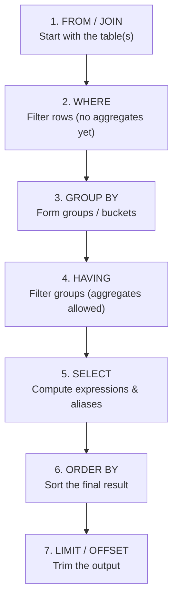

# 🗄️🤖 SQL & GenAI Course
**🎯 Quality Education for Anyone, Anywhere, Anytime — 💫 with Comfort, Convenience at no Cost**

---

## 📘 File 5: Execution Order – The Choreography Behind Every Query (powered with AI Augmentation)

### 📘 Lesson 5A — Understanding SQL’s Logical Control Flow

> **📁 This file is split into two parts:**
>
> - **📁 Lesson 5A — Understanding SQL's Logical Control Flow**  
>   *Teaches the mechanics of execution order, alias lifecycle, and stage mismatch.*
>
> - **📁 Lesson 5B — The Final Chamber: Controlled SQL Judgment**  
>   *Applies execution order through controlled experiments — the Crown Jewel Trilogy.*
>
> **You are currently in Lesson 5A.**

Welcome to the final Socratic Mirror of Module 3. You have already completed the **ACQUIRE** phase for this file and mastered the logical execution order—`FROM` → `WHERE` → `GROUP BY` → `HAVING` → `SELECT` → `ORDER BY` → `LIMIT`. You understand why aliases work in `ORDER BY` but not in `WHERE`, and you can trace a query step by step through its hidden life cycle.

You are now entering the **ACCELERATE structural sequencing phase**.

> 📐 **Scope Reminder:** This AUGMENT file covers only **Execution Order**—the logical sequence of SQL clauses (`FROM` → `WHERE` → `GROUP BY` → `HAVING` → `SELECT` → `ORDER BY` → `LIMIT`), alias visibility, and debugging by mental trace. Do not introduce subqueries, window functions, or complex joins. Respect the spiral.

---

## 📍 Your Current Stage – AUGMENT Journey

```mermaid
flowchart LR
    A["✅ COMPLETED<br/>📘 File 1<br/>ORDER BY & LIMIT"] --> B
    B["✅ COMPLETED<br/>📘 File 2<br/>Aggregate Functions"] --> C
    C["✅ COMPLETED<br/>📘 File 3<br/>GROUP BY"] --> D
    D["✅ COMPLETED<br/>📘 File 4<br/>HAVING"] --> E
    E["📍 YOU ARE HERE<br/>📘 File 5A<br/>Logical Control Flow"] --> F
    F["⏳ File 5B<br/>Crown Jewels"] --> G
    G["✅ AUGMENT COMPLETE"] --> H
    H["🔄 RETURN TO MODULE GUIDE<br/>TO BEGIN APPLY SECTION"]
    
    style A fill:#c8e6c9,stroke:#2e7d32,stroke-width:2px
    style B fill:#c8e6c9,stroke:#2e7d32,stroke-width:2px
    style C fill:#c8e6c9,stroke:#2e7d32,stroke-width:2px
    style D fill:#c8e6c9,stroke:#2e7d32,stroke-width:2px
    style E fill:#fff8e1,stroke:#ff9800,stroke-width:4px
    style F fill:#fff8e1,stroke:#ff9800,stroke-width:2px
    style G fill:#c8e6c9,stroke:#2e7d32,stroke-width:2px
    style H fill:#c8e6c9,stroke:#2e7d32,stroke-width:2px
```



---

## 🌀 Immersive Cognitive Traversal

ACCELERATE is not a linear syllabus. It is a **spiral chamber** where each phase strips away a different veil: preparation, vocabulary, execution.

| Chamber | What You Do Here | What Leaves Your System |
|---------|------------------|-------------------------|
| **🏁 Orientation Chamber** | Load toolkits, lock scope | Confusion about what is allowed |
| **🧠 ACCELERATE Operating System** | Absorb the mandate | Uncertainty about the rules of engagement |
| **⚡ Socratic Execution Chamber** | Interrogate AI scripts, analyse production echoes | Passive consumption – you become an active judge |

**You cannot interrogate what you have not prepared. You cannot judge what you have not named.**

Each chamber is a **gate**. Pass through all three. Descend with intention. Emerge with judgment.

**Start your SQLVerse Spiral Immersive journey.**

---

<div style="border: 2px solid #ff9800; border-radius: 10px; padding: 15px; margin: 20px 0; background: linear-gradient(135deg, #fff8e1 0%, #ffe0b2 100%);">

### 📘 Framework Reference

The complete **Phase 1 (Orientation Chamber)** and **Phase 2 (ACCELERATE Operating System)** – including Browser Office, Toolkits, Cognitive Compression Notice, Extraction Compass, Failure Classification, and all other framework content – has been compiled into a single reference document.

You do not need to read it every time. Keep it handy and refer to it whenever you need to revisit the ACCELERATE setup or terminologies.

📁 [`ACCELERATE_FRAMEWORK_REFERENCE.md`](../ACQUIRE-MODULE2/ACCELERATE_FRAMEWORK_REFERENCE.md)

</div>

---

# 🏁 Phase 1: Pre‑requisites and Preparation

## 🏁 Orientation Chamber

### ⚠️ REMINDER – ACQUIRE Foundation First

Before you enter this AUGMENT chamber, you must complete the ACQUIRE foundation for this concept:

1. **Read the ACQUIRE lesson file** – understand the syntax and examples.
2. **Extract ACQUIRE Gemstones** – collect skills, insights, and achievements from the ACQUIRE file into `GemstoneArray.md`.

> 🔁 **Spiral Rule:** ACQUIRE builds foundation. ACCELERATE builds judgment. Do not skip the foundation.

**Mirror Bridge Reference:** `Level-1-beginner/Module3-Sort-Aggregate-Group/1-sqlCommands/5-execution-order.md`

---

### 🎯 Mirror Objective

By completing this Socratic Mirror, you will be able to:

- **Identify and bypass** the hidden logic trap of assuming SQL runs in the order it is written.
- **Quantify** the cost of execution‑order ignorance—debugging time wasted on "magic" errors.
- **Trace reporting defects** down to incorrect assumptions about alias visibility and clause timing.
- **Leverage Socratic reasoning prompts** to cross‑examine AI‑generated queries that violate execution order.
- **Deconstruct AI-generated scripts** that use aliases in `WHERE` or `HAVING` before they exist.

In **ACQUIRE**, you learned the execution order sequence.

In **AUGMENT**, your objective is different:
- detect hidden defects in AI‑generated queries that violate execution order,
- interrogate AI assumptions about when aliases become available,
- evaluate production consequences of execution‑order ignorance,
- and determine whether a query is architecturally trustworthy by mental trace.

This chamber does not measure whether SQL executes.

It measures whether your reasoning survives pressure.

---

### 🔒 Scope Lock

This mirror is intentionally restricted to the conceptual boundaries of the ACQUIRE version.

This chamber explores:
- The logical execution order: `FROM` → `WHERE` → `GROUP BY` → `HAVING` → `SELECT` → `ORDER BY` → `LIMIT`
- Alias visibility: why aliases work in `ORDER BY` but not in `WHERE` or `HAVING`
- Why aggregates cannot be used in `WHERE`
- Step‑by‑step query tracing
- Debugging by mental trace

This chamber does NOT yet include:
- Subqueries – covered in Level 2
- Window functions – covered in Level 2
- Complex joins – covered in Module 4

Respect the spiral. **Master** one cognitive layer before descending deeper.

---

# 🧠 Phase 2: ACCELERATE Technical Terminologies

## 🧠 ACCELERATE Operating System

### 🚀 ACCELERATE MANDATE

**Socratic Guidance | No Code Generation | Strategy Over Syntax | Dialogue Logging**

**ACCELERATE GOLDEN RULE:**  
*You write every line of SQL manually. AI explains logic only. Never ask for code.*

---

## 🧩 High-Density Glossary – New Buzzwords

### Logical Execution Order

The order in which a SQL query is logically evaluated by the database engine: `FROM` → `WHERE` → `GROUP BY` → `HAVING` → `SELECT` → `ORDER BY` → `LIMIT`.

**Why it matters:** Understanding this order prevents errors like using aliases in `WHERE` or `HAVING` before they exist.

### Written Order vs Execution Order

The order in which a human writes SQL clauses (`SELECT` first) vs the order in which the database processes them (`FROM` first). The gap between them is the source of many common errors.

**Why it matters:** The way you write is for humans. The way it runs is for the machine. To be an Artisan, you must speak to both.

### Alias Visibility

The rule that column aliases created in the `SELECT` clause are only available to clauses that execute **after** `SELECT` (i.e., `ORDER BY` and `LIMIT`). They are **not** available to clauses that execute **before** `SELECT` (i.e., `WHERE`, `GROUP BY`, `HAVING`).

**Why it matters:** Attempting to use an alias in `WHERE` or `HAVING` is one of the most common SQL mistakes.

### Mental Trace

The ability to walk through a query step by step, applying the logical execution order, and predicting the intermediate result sets at each stage.

**Why it matters:** Mental tracing is the primary debugging tool for complex queries. If you can trace it, you can debug it.

---

# ⚡ Phase 3: Enter the AUGMENT Chamber and Execute

## ⚡ Socratic Execution Chamber

### 🌍 SQLVerse Business Universes

By now, you should have completed the **SQLVerse Business Suite Guide** and the **SQLVerse Business Multiverse Manifesto** introduced earlier in this cycle.

These documents provide the architectural foundation for every Business Universe, Blueprint, and exercise you encounter throughout SQLVerse.

If you have not read them yet, please do so before continuing.

- 📖 **SQLVerse Business Suite Guide**
- 📜 **SQLVerse Business Multiverse Manifesto**

---

- 📖 [SQLVerse Business Suite Guide →](../../../sqlverse-foundation/core/00-SQLVerse-Business-Suite-Guide.md)
- 📜 [SQLVerse Business Multiverse Manifesto →](../../../sqlverse-foundation/core/SQLVERSE_BUSINESS_MULTIVERSE.md)

**Read once. Refer forever.**

---

All demonstration databases for the **SQLVerse Business Multiverse** are located in:

```text
Level-1-beginner/sqlverse-foundation/resources/data-models/flagship-universes/
```

> **Note:** The **Training Institution** database (`training_institution_sample.db`) remains in the Course Repository Resources folder used throughout ACQUIRE. Its location is documented in the **ACCELERATE Framework Reference**. The remaining flagship databases (E-Store, Hospital Planet, Real Estate Planet, and FinVERSE) are stored in the SQLVerse Resource Repository shown above.

---
### 🔍 Cognitive Reorientation Layer

#### I. The Hidden Sequence — Written vs Logical Order

When you write a SQL query, you arrange clauses in a specific order that feels natural to humans:

```sql
SELECT   ...   -- 1. What to show
FROM     ...   -- 2. Where to get it
WHERE    ...   -- 3. Which rows to keep
GROUP BY ...   -- 4. How to group
HAVING   ...   -- 5. Which groups to keep
ORDER BY ...   -- 6. How to sort
LIMIT    ...   -- 7. How many to show
```

However, the database follows a **logical execution order** that is quite different.



**Logical execution model:** `SELECT` is evaluated after `WHERE`, `GROUP BY`, and `HAVING`. Therefore, a `SELECT` alias is not generally available to `WHERE`.

> 💡 **Artisan's Insight:** *"The way you write SQL is for humans. The way it runs is for the machine. To be an Artisan, you must speak to both."*

---

### 🔍 Opening Reflection: The Autopilot Trap

#### II. Query Autopsy — Diagnose the Broken Stage

An unguided AI assistant is asked to identify high-net-worth customers with total account balances exceeding 100,000. It delivers this query:

```sql
SELECT 
    customer_id,
    SUM(balance) AS total_wealth
FROM accounts
WHERE total_wealth > 100000
GROUP BY customer_id;
```

The query fails.

**Your Task — Diagnose Before You Repair**

Answer these questions before touching the code:

1. **At what execution stage does the problem occur?**
2. **What exists at that point?**
3. **What does not exist yet?**
4. **Why does the query fail?**
5. **What is the smallest defensible correction?**

**Expected Reasoning:**

**The failure is exposed at:** `WHERE` stage (Step 2)

The engine encounters the invalid reference during `WHERE`, but the deeper mistake is a **stage mismatch**: the question asks about an aggregated customer-level value, while `WHERE` operates **before** those customer-level aggregates exist.

**What exists at that point:** The database has opened the `accounts` table. It has access to the raw columns: `customer_id`, `account_id`, `balance`, `account_type`, `status`, etc.

**What does not exist yet:** `total_wealth` is an alias created in the `SELECT` clause (Step 5). At the `WHERE` stage, the alias has not been computed yet.

**Why the query fails:** `WHERE` attempts to filter by `total_wealth > 100000`, but `total_wealth` does not exist in the database at that point. The engine cannot evaluate the condition because the alias hasn't been born yet.

**The smallest defensible correction:**

```sql
SELECT 
    customer_id,
    SUM(balance) AS total_wealth
FROM accounts
GROUP BY customer_id
HAVING SUM(balance) > 100000;
```

**Alternative correction (using HAVING with alias — dialect-dependent):**

```sql
-- Works in some databases, not recommended
SELECT 
    customer_id,
    SUM(balance) AS total_wealth
FROM accounts
GROUP BY customer_id
HAVING total_wealth > 100000;
```

**Professional rule:** Repeat the aggregate expression in `HAVING` for cross-platform reliability.

> 💎 **Gemstone:** *Alias Lifecycle Awareness*
>
> **Aliases are created in SELECT — which runs fifth. 
> 
> WHERE runs second. The alias is invisible to WHERE. 
> 
> The logical sequence is non-negotiable.**

---

### 🛰️ Production Echo – Case 1

#### III. The Data Fate Challenge — WHERE vs HAVING Placement

**🌍 Business Universe: FinVERSE**

A Credit Risk Analyst wants to identify high-value customers. They run these two queries and notice different results.

**Query A:**

```sql
SELECT 
    customer_id,
    SUM(amount) AS total_spend
FROM transactions
WHERE amount > 1000
GROUP BY customer_id;
```

**Query B:**

```sql
SELECT 
    customer_id,
    SUM(amount) AS total_spend
FROM transactions
GROUP BY customer_id
HAVING SUM(amount) > 1000;
```

**The Challenge:**

Both queries filter by `> 1000`, but they do it at different stages.

**Your Task:**

1. **Which individual rows survive in each case?**
2. **Which groups survive in each case?**
3. **Can the same customer appear in one result but not the other? Why?**

**Analysis:**

| Query | Filter Stage | What It Does | Result |
|-------|--------------|--------------|--------|
| **Query A** | `WHERE` (before grouping) | Removes individual transactions under $1000 before grouping | A customer appears if their *remaining transactions* sum to any value (they are not filtered as a group) |
| **Query B** | `HAVING` (after grouping) | Keeps all transactions, then groups, then removes customers whose total spend is under $1000 | A customer appears only if their *total across all transactions* exceeds $1000 |

**The Data Fate Insight:**

A customer could appear in Query B but not Query A if their only transactions were under $1000. Or they could appear in Query A but not Query B if they had many small transactions that were removed before grouping.

**A filter placed earlier changes the data available to every later stage.**

> 💎 **Gemstone:** *Filter Placement Changes Metric Meaning*

---

### 🛰️ Production Echo – Case 2

#### IV. Query X-Ray — Build Intermediate States

**🌍 Business Universe: Real Estate Planet**

A real estate analyst runs this query:

```sql
SELECT 
    city,
    ROUND(AVG(list_price), 2) AS avg_price,
    COUNT(*) AS property_count
FROM properties
WHERE status = 'Active'
GROUP BY city
HAVING AVG(list_price) > 500000
ORDER BY avg_price DESC
LIMIT 3;
```

**Your Task:**

Construct the intermediate states at each stage of execution using the data provided.

| Stage | What Happened to the Data? |
|-------|---------------------------|
| **FROM** | All rows from `properties` table (all statuses, all cities) |
| **WHERE** | Filtered to only `status = 'Active'` |
| **GROUP BY** | Rows grouped by `city` |
| **HAVING** | Kept only cities where `AVG(list_price) > 500000` |
| **SELECT** | Computed `avg_price` and `property_count` aliases |
| **ORDER BY** | Sorted by `avg_price DESC` |
| **LIMIT** | Kept only the top 3 rows |

**The Insight:**

Execution order is not academic—it is a **debugging instrument**. If you can trace the query, you can debug it.

> 💎 **Gemstone:** *Query Execution Tracing*

---

### 🎭 The Copilot's Script

#### V. The Execution Order Debugger — Diagnose then Repair

**🌍 Business Universe: E‑Store**

The Product Manager asks:

> *"Show me product categories whose total revenue exceeds 15,000, sorted by revenue descending."*

The AI assistant generates this query:

```sql
SELECT 
    p.category,
    SUM(oi.quantity * p.price) AS total_revenue
FROM order_items oi
JOIN products p ON oi.product_id = p.product_id
WHERE oi.quantity * p.price > 15000
GROUP BY p.category
ORDER BY total_revenue DESC;
```

**Your Task — Diagnose Before Repairing**

1. **What does `WHERE` actually remove?**
2. **What does the business request actually want filtered?**
3. **At what stage does total category revenue exist?**
4. **Which clause should own the threshold?**
5. **What changed in the metric meaning?**

**Analysis:**

- `WHERE oi.quantity * p.price > 15000` removes individual order items under $15,000.
- The business request wants categories with total revenue exceeding $15,000—a group-level condition.
- Total category revenue exists **after** `GROUP BY` completes.
- The threshold belongs in `HAVING`, not `WHERE`.
- **Metric meaning changes:** `WHERE` filters row-level values; `HAVING` filters group-level aggregates.

**The Repair:**

```sql
SELECT 
    p.category,
    ROUND(SUM(oi.quantity * p.price), 2) AS total_revenue
FROM order_items oi
JOIN products p ON oi.product_id = p.product_id
GROUP BY p.category
HAVING SUM(oi.quantity * p.price) > 15000
ORDER BY total_revenue DESC;
```

> 💎 **Gemstone:** *Execution-Order Debugging*
>
> When the condition refers to a value that exists only after grouping, the condition belongs after grouping.

---

### 🔗 The Architectural Guardrail

#### VI. Alias Court — Where Do Aliases Exist?

Aliases are created in the `SELECT` clause—which runs **fifth**. Therefore, they are only available to clauses that execute **after** `SELECT`.

**Your Task:**

Classify each case below:

| Case | Valid? | Reasoning |
|------|--------|-----------|
| `WHERE total > 1000` | ❌ Alias does not exist yet | `WHERE` runs before `SELECT` |
| `GROUP BY total` | ❌ Alias does not exist yet | `GROUP BY` runs before `SELECT` |
| `HAVING total > 1000` | ⚠️ Dialect-dependent | Some databases allow it, some don't. Professional practice: repeat the expression. |
| `ORDER BY total DESC` | ✅ Alias is available | `ORDER BY` runs after `SELECT` |
| `LIMIT 5` | ✅ Alias not needed | `LIMIT` runs after `SELECT` but doesn't reference the alias |

**The Professional Rule:**

> **When in doubt, repeat the expression. Never rely on database-specific quirks.**

> 💎 **Gemstone:** *Alias Lifecycle Reasoning + SQL Dialect Awareness Begins*

---

#### VII. Grain Meets Choreography — Unifying Module 3 Concepts

At which stage does the analytical grain change?

```sql
FROM orders
JOIN order_items ...
WHERE ...
GROUP BY customer_id
HAVING ...
```

| Stage | Grain | What Exists |
|-------|-------|-------------|
| Before `GROUP BY` | Row-level grain | Individual order items |
| At `GROUP BY` | Customer-level grain | One row per customer |
| After aggregation | Group-level metrics | Aggregates are available |
| `HAVING` | Group-level grain | Filters groups at the new grain |

**The Module 3 Master Insight:**

| Concept | Structural Question |
|---------|---------------------|
| `ORDER BY` | How should results be prioritized? |
| `LIMIT` | How much output is needed? |
| Aggregates | What summary metric matters? |
| `GROUP BY` | At what grain should we analyze? |
| `HAVING` | Which groups meet the threshold? |
| Execution Order | When does each transformation become possible? |

> 💎 **Gemstone:** *Analytical Grain Can Change During the Execution Pipeline*

---

### 🔍 Probing Questions for Your AI Consultant (Tab 3)

Paste these investigative prompts into Tab 3 to deconstruct execution order principles. **Do not ask for SQL code**; focus entirely on the architectural reasoning.

1. *"What is the difference between written order and logical execution order? Why does the gap matter?"*

2. *"Why can't column aliases be used in `WHERE` or `GROUP BY` but can be used in `ORDER BY`?"*

3. *"What is the mental trace template? How does it help with debugging?"*

4. *"How does filter placement change the metric meaning? What is the Data Fate Challenge?"*

5. *"What does `HAVING` do that `WHERE` cannot? Why can't `WHERE` handle aggregate conditions?"*

6. *"At what stage does the analytical grain change in a query? What does that mean for the data?"*

7. *"What assumptions does an AI make when generating a query with a `WHERE` filter on an alias?"*

8. *"Why do some databases allow aliases in `HAVING` while others don't? What is the professional rule?"*

9. *"How does execution order relate to the `GROUP BY` concept of grain?"*

10. *"What is the one rule that would prevent most execution-order errors?"*

---

### 🧪 Socratic Reflection Probe

#### VIII. The Conductor's Challenge

**The Business Question:**

> *"Show me the top 3 product categories whose completed-order revenue exceeds 15,000, ranked from highest to lowest revenue."*

**Part 1 — The Architecture (Before SQL)**

Complete this table before writing a single line of SQL:

| Question | Your Answer |
|----------|-------------|
| Source tables | |
| Starting grain | |
| Row-level condition | |
| Grouping dimension | |
| Aggregate metric | |
| Group-level condition | |
| Presentation columns | |
| Sorting rule | |
| Output limit | |
| Logical execution order | |

**Part 2 — The SQL**

Write the query. Then trace it step by step through the execution order.

**Part 3 — The Trace**

| Stage | What Happened to the Data? |
|-------|---------------------------|
| FROM | |
| WHERE | |
| GROUP BY | |
| HAVING | |
| SELECT | |
| ORDER BY | |
| LIMIT | |

---

> 💡 **The Artisan's Rule:** *"Think first. Query second. Trace third."*

---

### 💎 GEMSTONE EXTRACTION WINDOW

Before you proceed to the bridge, capture your architectural insights into `EXTRACTION_BAY/SkillTree/GemstoneArray.md`.

| Extraction Field | Your Response |
|-----------------|---------------|
| **Skill Extracted** | Detecting execution-order violations in AI-generated queries |
| **Objective Mastered** | Tracing queries step by step to debug alias and aggregate errors |
| **Viewpoint Shifted** | From "Does this query run?" to "Can I trace this query step by step?" |
| **Anti-pattern Defeated** | Referencing aliases or aggregate results before the logical execution stage where they become available |
| **Production Constraint Validated** | Execution order is non-negotiable—know it or debug broken queries |

---

### 📝 Example Portfolio Entry – File 5: Execution Order

Below is a concrete example of how to populate your Skill‑Tree tables from the insights and skills you extract in this file. Use this as a model when creating your own entries.

**Source File:** `5-execution-order.md`

---

#### 💎 Insert into `skills_level1`

```sql
INSERT INTO skills_level1 (module_id, filename, skill_name, objective_text, student_viewpoint)
VALUES (
    3, '5-execution-order.md',
    'Detecting execution-order violations in AI-generated queries',
    'Identify and question SQL queries that use aliases in WHERE or HAVING before they exist.',
    'I used to think SQL ran in the order I wrote it. Now I know the logical execution order—and it changed everything.'
);
```

#### 💡 Insert into `insights_level1`

```sql
INSERT INTO insights_level1 (module_id, source_filename, insight_text, student_viewpoint)
VALUES (
    3, '5-execution-order.md',
    'The way you write SQL is for humans. The way it runs is for the machine. To be an Artisan, you must speak to both.',
    'I realised that execution order is not academic—it is the difference between a working query and a broken one.'
);
```

#### 🏆 Insert into `achievements_level1`

```sql
INSERT INTO achievements_level1 (achievement_type, module_id, source_filename, score_or_status, student_viewpoint)
VALUES (
    'Simulation', 3, '5-execution-order.md', 'Socratic Log Saved',
    'Successfully executed the Conductor\'s Challenge. Calibrated my understanding of execution order and alias visibility.'
);
```

#### 💎 Insert into `bonus_skills_level1`

```sql
-- Alias Visibility
INSERT INTO bonus_skills_level1 (module_id, bonus_skill_name, source_filename)
VALUES (
    3,
    'Never use a column alias in WHERE or GROUP BY. The alias does not exist until SELECT runs.',
    '5-execution-order.md'
);

-- Mental Trace
INSERT INTO bonus_skills_level1 (module_id, bonus_skill_name, source_filename)
VALUES (
    3,
    'Before running a query, trace it step by step through the execution order. If you can trace it, you can debug it.',
    '5-execution-order.md'
);
```

#### 📝 Insert into `socratic_logs_level1`

```sql
INSERT INTO socratic_logs_level1 (
    module_id, sub_module, cycle, filename,
    structural_question, ai_guidance, student_final_sql,
    initial_understanding, realised_insight
) VALUES (
    3, 'ACQUIRE-MODULE3', 'AUGMENT', '5-execution-order.md',
    'Why can a column alias be used in ORDER BY but not in WHERE?',
    'WHERE runs before SELECT—the alias has not been created yet. ORDER BY runs after SELECT—the alias exists. Understanding the logical execution order is essential.',
    'SELECT total_fees - fees_paid AS balance FROM students ORDER BY balance DESC;',
    'I thought aliases were available everywhere.',
    'Aliases are created in SELECT—which runs fifth. WHERE runs second. The alias is invisible to WHERE. The logical sequence is non-negotiable.'
);
```

---

## ✅ Progress Check (AUGMENT)

Can you confidently answer the following before descending to the next layer?

- [ ] Can you trace a query step by step through the execution order?
- [ ] Can you explain why aliases work in `ORDER BY` but not in `WHERE`?
- [ ] Can you diagnose a query defect by identifying the broken execution stage?
- [ ] Can you explain how filter placement changes metric meaning?
- [ ] Can you identify when an AI-generated query violates execution order?

**If yes → You have completed all AUGMENT files for Module 3. Return to the Module Guide to begin the APPLY phase.**

---

## 🔁 Bridge to Lesson 5B — The Final Chamber

### 🛑 End of Lesson 5A — Mechanics Mastered

You now understand the internal execution pipeline: how data enters through `FROM`, gets filtered by `WHERE`, grouped by `GROUP BY`, checked by `HAVING`, projected by `SELECT`, and ordered by `ORDER BY`.

You have diagnosed execution-order defects, traced queries stage by stage, and repaired AI-generated mistakes.

You have seen how `WHERE`, `HAVING`, and `ORDER BY` each play a distinct role in the execution pipeline.

But you have not yet seen them **in controlled comparison**.

What happens when you hold everything constant and change **one clause at a time**?

That is the **Crown Jewel Trilogy** — the final chamber of Module 3.

**Next Up in Lesson 5B:**
We enter the final chamber: **The Crown Jewel Trilogy** — where you will hold everything constant and change one clause at a time to see how the story transforms. Now that you know how the engine reads your query, you will learn how changing a single control gate completely rewrites the strategic story for executive stakeholders.

**Proceed to 📁 Lesson 5B — The Final Chamber: Controlled SQL Judgment.**


---

## 🧭 File Navigation


| Previous Step | Next Step |
|:---:|:---:|
| [← Back to File 4: HAVING](./4-having.md) | [Continue to File 5B: Crown Jewels →](./5B-execution-order-crown-jewels.md) |

---

*Part of our mission for 🎯 Quality Education for Anyone, Anywhere, Anytime — 💫 with Comfort, Convenience at no Cost.*

**Level 1 | ACCELERATE Phase | AUGMENT | Module 3 | File 5A: Execution Order | Next: [Continue to File 5B: Crown Jewels](./5B-execution-order-crown-jewels.md)**
