# 🗄️🤖 SQL & GenAI Course
**🎯 Quality Education for Anyone, Anywhere, Anytime — 💫 with Comfort, Convenience at no Cost**

---

## 📘 File 5: Execution Order – The Choreography Behind Every Query (powered with AI Augmentation)

### 📘  Lesson 5B — The Final Chamber: Controlled SQL Judgment

Welcome to the Crown Jewel Trilogy.

You have mastered the mechanics of execution order. You have diagnosed defects, traced queries, and repaired AI-generated mistakes.

Now you enter the controlled experiment.

**In File 5B, we hold the analytical environment constant and change one clause at a time.**

- **Crown Jewel 1:** Change `WHERE` — watch the population shift.
- **Crown Jewel 2:** Change `HAVING` — watch the segments emerge.
- **Crown Jewel 3:** Change `ORDER BY` — watch the priorities change.

**Population → Qualification → Attention.**

This is the final chamber of Module 3.

---
## 📍 Your Current Stage – AUGMENT Journey

```mermaid
flowchart LR
    A["✅ COMPLETED<br/>📘 File 1<br/>ORDER BY & LIMIT"] --> B
    B["✅ COMPLETED<br/>📘 File 2<br/>Aggregate Functions"] --> C
    C["✅ COMPLETED<br/>📘 File 3<br/>GROUP BY"] --> D
    D["✅ COMPLETED<br/>📘 File 4<br/>HAVING"] --> E
    E["✅ COMPLETED<br/>📘 File 5A<br/>Logical Control Flow"] --> F
    F["📍 YOU ARE HERE<br/>📘 File 5B<br/>Crown Jewels"] --> G
    G["✅ AUGMENT COMPLETE"] --> H
    H["🔄 RETURN TO MODULE GUIDE<br/>TO BEGIN APPLY SECTION"]
    
    style A fill:#c8e6c9,stroke:#2e7d32,stroke-width:2px
    style B fill:#c8e6c9,stroke:#2e7d32,stroke-width:2px
    style C fill:#c8e6c9,stroke:#2e7d32,stroke-width:2px
    style D fill:#c8e6c9,stroke:#2e7d32,stroke-width:2px
    style E fill:#c8e6c9,stroke:#2e7d32,stroke-width:2px
    style F fill:#fff8e1,stroke:#ff9800,stroke-width:4px
    style G fill:#c8e6c9,stroke:#2e7d32,stroke-width:2px
    style H fill:#c8e6c9,stroke:#2e7d32,stroke-width:2px
```



---

## 🏛️ The Crown Jewel Trilogy — Filters, Segments, and Priorities

In the Production Echoes of the previous four lesson files, you witnessed the same SQL patterns survive across different universes, different stakeholders, and different granularities.

Now we enter the final chamber.

**Within each Crown Jewel, we hold the analytical environment constant and change one control point at a time.**

> We keep the domain, stakeholder, tables, grain, and core metric stable within each experiment.
> Then we change **one clause**—and watch how the meaning of the analysis transforms.

We just change **one clause at a time**—and observe how a single control point changes the **analytical story.**

---

**Crown Jewel 1** holds `HAVING` constant and varies `WHERE`.

The data that enters the pipeline changes. The groups that emerge change. The CFO sees a different story from the same skeleton.

**Crown Jewel 2** holds the input scope constant and varies `HAVING`.

The data that enters is the same. The groups that emerge change. The Marketing Manager sees different market segments from the same time window. The January viewing window remains constant across all four queries. `HAVING` is the clause that changes, producing four different business segments.

**Crown Jewel 3** holds both `WHERE` and `HAVING` constant and varies `ORDER BY`.

The data that enters is the same. The groups that emerge are the same. But the Chief Medical Officer sees a different priority depending on how the results are sorted.

---


### 🔍 What This Trilogy Achieves

| Crown Jewel | Variable | Constant | Domain | Core Lesson |
|-------------|----------|----------|--------|-------------|
| **1** | `WHERE` | `HAVING` | FinVERSE | Filter placement changes the data available to every later stage |
| **2** | `HAVING` | `WHERE` | Real Estate | Group-level filtering reveals different business patterns |
| **3** | `ORDER BY` | `WHERE` + `HAVING` | Hospital Planet | Presentation order prioritizes what matters to the stakeholder |

---

### 💎 Crown Jewel 1 — FinVERSE: Same Tables, Three Filters, Three CFO Stories

**Same tables. Same joins. Same aggregates. Three different WHERE clauses. Three different business questions.**

That is the SQLVerse Artisan's power — recognizing that **changing the row-level filter changes the data available to every later stage of execution.**

---

#### The Query Skeleton

```sql
SELECT 
    l.customer_id,
    lp.loan_id,
    SUM(lp.amount) AS total_payments
FROM loan_payments lp
JOIN loans l ON lp.loan_id = l.loan_id
WHERE [FILTER CONDITION]
GROUP BY l.customer_id, lp.loan_id
HAVING COUNT(lp.amount) > 2;
```

The skeleton is identical. Only the `WHERE` clause changes.

---

#### Query 1 — High-Interest Borrowers

**The Filter:** `l.interest_rate > 8.5`

```sql
SELECT 
    l.customer_id,
    lp.loan_id,
    SUM(lp.amount) AS total_payments
FROM loan_payments lp
JOIN loans l ON lp.loan_id = l.loan_id
WHERE l.interest_rate > 8.5
GROUP BY l.customer_id, lp.loan_id
HAVING COUNT(lp.amount) > 2;
```

**What the CFO learns:** *"Which high-cost loans are generating the most repayment activity?"*

**Business Action:** Identify high-interest loans with strong repayment behaviour. These are profitable customers—consider cross-selling premium products.

---

#### Query 2 — January Loan Performance

**The Filter:** Loans approved in January

```sql
SELECT 
    l.customer_id,
    lp.loan_id,
    SUM(lp.amount) AS total_payments
FROM loan_payments lp
JOIN loans l ON lp.loan_id = l.loan_id
WHERE strftime('%Y-%m', l.approval_date) = '2025-01'
GROUP BY l.customer_id, lp.loan_id
HAVING COUNT(lp.amount) > 2;
```

**What the CFO learns:** *"Which early-year loans are performing well?"*

**Business Action:** Evaluate the effectiveness of January loan campaigns. If these loans are performing well, replicate the strategy in future months.

---

#### Query 3 — Overall Repayment Volume

**The Filter:** None

```sql
SELECT 
    l.customer_id,
    lp.loan_id,
    SUM(lp.amount) AS total_payments
FROM loan_payments lp
JOIN loans l ON lp.loan_id = l.loan_id
GROUP BY l.customer_id, lp.loan_id
HAVING COUNT(lp.amount) > 2;
```

**What the CFO learns:** *"Which loans have the highest overall repayment volume?"*

**Business Action:** Identify the most active loans across the entire portfolio. These are high-value relationships worth nurturing.

---

#### 🧠 The Execution Order X-Ray

| Stage | Query 1 (High Interest) | Query 2 (January) | Query 3 (All Loans) |
|-------|-------------------------|-------------------|---------------------|
| **FROM** | loan_payments JOIN loans | loan_payments JOIN loans | loan_payments JOIN loans |
| **WHERE** | Filters to interest_rate > 8.5 | Filters to January approvals | **No filter — all rows survive** |
| **GROUP BY** | Groups by customer_id, loan_id | Groups by customer_id, loan_id | Groups by customer_id, loan_id |
| **HAVING** | Keeps loans with >2 payments | Keeps loans with >2 payments | Keeps loans with >2 payments |
| **SELECT** | customer_id, loan_id, SUM | customer_id, loan_id, SUM | customer_id, loan_id, SUM |

**The Insight:**

The same query skeleton produces completely different business intelligence depending on which row-level filter is applied.

**Filter placement changes the data available to every later stage.**

---

#### 📌 The CFO's Dashboard

| Query | Question | Action |
|-------|----------|--------|
| **Query 1** | *"Which high-cost loans are generating the most repayment activity?"* | Cross-sell premium products |
| **Query 2** | *"Which early-year loans are performing well?"* | Replicate successful loan campaigns |
| **Query 3** | *"Which loans have the highest overall repayment volume?"* | Nurture high-value relationships |

---
### 📊 Experimental Control Summary

```text
Query 1 → Same HAVING → high-interest loans
Query 2 → Same HAVING → January approvals
Query 3 → Same HAVING → all loans
```

**Same HAVING clause. Same tables. Same joins. Only WHERE changes.**

The data that enters changes. The groups that emerge change based on what survives the WHERE filter.

| Controlled Element | Status |
|-------------------|--------|
| Domain | FinVERSE |
| Tables | `loan_payments`, `loans` |
| HAVING clause | `COUNT(lp.amount) > 2` |
| GROUP BY | `customer_id`, `loan_id` |
| **VARIABLE** | **WHERE** — `interest_rate > 8.5`, `approval_date IN (January)`, no filter |

**The Insight:**

> **Same HAVING condition. Same grouping. Different WHERE filters change the data available to every later stage.**

---

### 🪞 Pattern Reflection

| Element | Query 1 | Query 2 | Query 3 |
|---------|---------|---------|---------|
| **Filter** | Interest rate | Approval date | None |
| **Grain** | Customer × Loan | Customer × Loan | Customer × Loan |
| **Metric** | SUM(amount) | SUM(amount) | SUM(amount) |
| **Threshold** | >2 payments | >2 payments | >2 payments |
| **Business Question** | High-cost repayment | January performance | Overall volume |

**The execution order is identical.** Only the data that enters the pipeline changes.

The business vocabulary changes. The skeletal pattern remains invariant.

**The nouns change. The logic does not.**

---
### 💎 Crown Jewel 2 — Real Estate:  Same tables, Three HAVING Clauses, Three Market Segments

**Same January viewing window. Same tables. Same joins. Three different HAVING clauses. Three different market segments.**

The Marketing Manager wants to understand the January funnel—properties that were viewed and received offers during the same month.

1. **Segment 1** — Properties with no January viewings
2. **Segment 2** — Properties with January viewings but no January offers
3. **Segment 3** — Properties with January viewings and a single January offer
4. **Segment 4** — Properties with January viewings and multiple January offers

**The January viewing scope remains constant. The join structure remains constant. Only the HAVING condition changes.**

---

#### The Query Skeleton

```sql
SELECT 
    p.property_id,
    p.address,
    COUNT(DISTINCT v.viewing_id) AS view_count,
    COUNT(DISTINCT o.offer_id) AS offer_count
FROM properties p
LEFT JOIN viewings v 
    ON p.property_id = v.property_id
   AND v.viewing_date BETWEEN '2025-01-01' AND '2025-01-31'
LEFT JOIN offers o 
    ON p.property_id = o.property_id
   AND o.offer_date BETWEEN '2025-01-01' AND '2025-01-31'
GROUP BY p.property_id
HAVING [CONDITION];  -- Only this changes
```

---

#### Query 1 — Properties Without Any Viewings

```sql
SELECT 
    p.property_id,
    p.address,
    COUNT(DISTINCT v.viewing_id) AS view_count,
    COUNT(DISTINCT o.offer_id) AS offer_count
FROM properties p
LEFT JOIN viewings v 
    ON p.property_id = v.property_id
   AND v.viewing_date BETWEEN '2025-01-01' AND '2025-01-31'
LEFT JOIN offers o 
    ON p.property_id = o.property_id
   AND o.offer_date BETWEEN '2025-01-01' AND '2025-01-31'
GROUP BY p.property_id
HAVING COUNT(DISTINCT v.viewing_id) = 0;
```

**What the Marketing Manager learns:** *"Which properties are not attracting any interest?"*

**Business Action:** Review marketing strategy for these properties. Consider price adjustments or enhanced listings.

---

#### Query 2 — Properties with Viewings but No Offers

```sql
SELECT 
    p.property_id,
    p.address,
    COUNT(DISTINCT v.viewing_id) AS view_count,
    COUNT(DISTINCT o.offer_id) AS offer_count
FROM properties p
LEFT JOIN viewings v 
    ON p.property_id = v.property_id
   AND v.viewing_date BETWEEN '2025-01-01' AND '2025-01-31'
LEFT JOIN offers o 
    ON p.property_id = o.property_id
   AND o.offer_date BETWEEN '2025-01-01' AND '2025-01-31'
GROUP BY p.property_id
HAVING COUNT(DISTINCT v.viewing_id) > 0 
   AND COUNT(DISTINCT o.offer_id) = 0;

```

**What the Marketing Manager learns:** *"Which properties are getting interest but not converting to offers?"*

**Business Action:** Investigate why viewings are not converting. Is the price too high? Is the presentation inadequate?

---

#### Query 3 — Properties with Viewings and a Single Offer

```sql
SELECT 
    p.property_id,
    p.address,
    COUNT(DISTINCT v.viewing_id) AS view_count,
    COUNT(DISTINCT o.offer_id) AS offer_count
FROM properties p
LEFT JOIN viewings v 
    ON p.property_id = v.property_id
   AND v.viewing_date BETWEEN '2025-01-01' AND '2025-01-31'
LEFT JOIN offers o 
    ON p.property_id = o.property_id
   AND o.offer_date BETWEEN '2025-01-01' AND '2025-01-31'
GROUP BY p.property_id
HAVING COUNT(DISTINCT v.viewing_id) > 0 
   AND COUNT(DISTINCT o.offer_id) = 1;
```

**What the Marketing Manager learns:** *"Which properties have attracted a single offer?"*

**Business Action:** These properties are close to a deal. Prioritise negotiation support.

---

#### Query 4 — Properties with Viewings and Multiple Offers

```sql
SELECT 
    p.property_id,
    p.address,
    COUNT(DISTINCT v.viewing_id) AS view_count,
    COUNT(DISTINCT o.offer_id) AS offer_count
FROM properties p
LEFT JOIN viewings v 
    ON p.property_id = v.property_id
   AND v.viewing_date BETWEEN '2025-01-01' AND '2025-01-31'
LEFT JOIN offers o 
    ON p.property_id = o.property_id
   AND o.offer_date BETWEEN '2025-01-01' AND '2025-01-31'
GROUP BY p.property_id
HAVING COUNT(DISTINCT v.viewing_id) > 0 
   AND COUNT(DISTINCT o.offer_id) > 1;
```

**What the Marketing Manager learns:** *"Which properties are in high demand with multiple offers?"*

**Business Action:** These are competitive listings. Consider raising the price or accelerating the closing process.

---
#### 🏛️ The Architectural Guardrail — ON vs WHERE

Notice the difference:

```sql
-- ❌ This defeats the LEFT JOIN
LEFT JOIN viewings v ON p.property_id = v.property_id
WHERE v.viewing_date BETWEEN '2025-01-01' AND '2025-01-31'

-- ✅ This preserves the LEFT JOIN
LEFT JOIN viewings v 
    ON p.property_id = v.property_id
   AND v.viewing_date BETWEEN '2025-01-01' AND '2025-01-31'
```

When a condition is placed in `WHERE`, it filters rows **after** the join — which removes `NULL` rows from a `LEFT JOIN`.

When a condition is placed in `ON`, it filters rows **during** the join — which preserves `NULL` rows for the outer table.

This is a subtle but critical distinction. It is a preview of **Module 4**, where you will master join mechanics and their execution order.

> 💡 **Artisan's Insight:** *"Moving a condition between ON and WHERE can change the meaning of an outer join."*
>
> 💡 **Metric Guardrail:** When two one-to-many relationships are joined to the same parent, joined rows can multiply. `COUNT(DISTINCT ...)` protects each metric from counting the multiplication.
---

#### 🧠 The Execution Order X-Ray

| Stage | Query 1 (No Viewings) | Query 2 (Viewings, No Offers) | Query 3 (Single Offer) | Query 4 (Multiple Offers) |
|-------|-----------------------|-------------------------------|------------------------|---------------------------|
| **FROM / JOIN** | Same LEFT JOIN structure | Same LEFT JOIN structure | Same LEFT JOIN structure | Same LEFT JOIN structure |
| **WHERE**       | No additional row filter              | No additional row filter                           | No additional row filter                    | No additional row filter                    |
| **GROUP BY**    | Groups by property_id                 | Groups by property_id                              | Groups by property_id                       | Groups by property_id                       |
| **HAVING**      | `0` viewings                          | Viewings, `0` offers                               | Viewings, `1` offer                         | Viewings, `>1` offers                       |
| **SELECT**      | Project metrics                       | Project metrics                                    | Project metrics                             | Project metrics                             |

**The Insight:** The `WHERE` clause defines the time window. The `HAVING` clause defines the business segment. The same time window reveals different market behaviours depending on the group-level filter.

---

#### 📌 The Marketing Manager's Dashboard

| Segment | Insight | Action |
|---------|---------|--------|
| **No Viewings** | Properties are not attracting interest | Review marketing strategy |
| **Viewings, No Offers** | Interest but no conversion | Investigate conversion barriers |
| **Single Offer** | Close to a deal | Prioritise negotiation support |
| **Multiple Offers** | High demand | Consider price adjustment |

---
### 📊 Experimental Control Summary

```text
Query 1 → Same FROM/JOIN structure → no viewings
Query 2 → Same FROM/JOIN structure → viewings, no offers
Query 3 → Same FROM/JOIN structure → single offer
Query 4 → Same FROM/JOIN structure → multiple offers
```

**Same January viewing window. Same January offer window. Same WHERE clause. Only HAVING changes.**

| Controlled Element | Status |
|-------------------|--------|
| Domain | Real Estate Planet |
| Tables | `properties`, `viewings`, `offers` |
| FROM/JOIN | `LEFT JOIN viewings` + `LEFT JOIN offers` (identical across all) |
| WHERE clause | Current month filter (in `ON` clause of `LEFT JOIN`) |
| GROUP BY | `property_id` |
| **VARIABLE** | **HAVING** — `COUNT(viewings) = 0` / `> 0 AND COUNT(offers) = 0` / `= 1` / `> 1` |

**The Insight:**

> **Same FROM structure. Same time window. Same data scope. Different HAVING filters reveal different market segments.**

---

### 🪞 Pattern Reflection

| Business Request | Skeletal Pattern |
|------------------|------------------|
| No Viewings | `COUNT(viewings) = 0` |
| Viewings, No Offers | `COUNT(viewings) > 0 AND COUNT(offers) = 0` |
| Single Offer | `COUNT(viewings) > 0 AND COUNT(offers) = 1` |
| Multiple Offers | `COUNT(viewings) > 0 AND COUNT(offers) > 1` |

**Architect's Observation:** The `WHERE` clause defines the time window. The `HAVING` clause defines the business segment. The same time window reveals different market behaviours depending on the group-level filter.

The business vocabulary changes. The skeletal pattern remains invariant.

**The nouns change. The logic does not.*

---

### 💎 Crown Jewel 3 — Hospital Planet: Same tables, Three ORDER BY Rules, Three Priorities

**Same WHERE clause. Same HAVING clause. Same tables. Same joins. Same GROUP BY. Only ORDER BY changes.**

The Chief Medical Officer wants to understand **doctor workload and performance** — but needs to view the same data through three different lenses:

1. **Burnout Risk** — Who has the heaviest workload?
2. **Utilization Review** — Who is underutilized?
3. **Team Roster** — How does the full team compare?

---

#### The Query Skeleton (Identical for All Three)

```sql
SELECT 
    d.doctor_id,
    d.first_name || ' ' || d.last_name AS doctor_name,
    COUNT(a.appointment_id) AS appointment_count,
    COUNT(DISTINCT a.patient_id) AS unique_patients_seen,
    ROUND(AVG(CASE WHEN a.status = 'Cancelled' THEN 1 ELSE 0 END) * 100, 1) AS cancellation_rate
FROM appointments a
JOIN doctors d ON a.doctor_id = d.doctor_id
WHERE a.appointment_date BETWEEN '2025-01-01' AND '2025-01-31'
GROUP BY d.doctor_id
HAVING COUNT(a.appointment_id) > 0
ORDER BY [VARIABLE];  -- Only this changes
```

---

#### Query 1 — Burnout Risk: Busiest Doctors First (Workload Pressure Review)

```sql
SELECT 
    d.doctor_id,
    d.first_name || ' ' || d.last_name AS doctor_name,
    COUNT(a.appointment_id) AS appointment_count,
    COUNT(DISTINCT a.patient_id) AS unique_patients_seen,
    ROUND(AVG(CASE WHEN a.status = 'Cancelled' THEN 1 ELSE 0 END) * 100, 1) AS cancellation_rate
FROM appointments a
JOIN doctors d ON a.doctor_id = d.doctor_id
WHERE a.appointment_date BETWEEN '2025-01-01' AND '2025-01-31'
GROUP BY d.doctor_id
HAVING COUNT(a.appointment_id) > 0
ORDER BY appointment_count DESC;  -- Who is busiest?
```

**What the CMO learns:** *"Which doctors have the highest appointment workload?"*

**Business Action:**  Review these doctors for potential workload pressure and determine whether additional support or redistribution is needed.

---

#### Query 2 — Utilization Review: Least Busy Doctors First

```sql
SELECT 
    d.doctor_id,
    d.first_name || ' ' || d.last_name AS doctor_name,
    COUNT(a.appointment_id) AS appointment_count,
    COUNT(DISTINCT a.patient_id) AS unique_patients_seen,
    ROUND(AVG(CASE WHEN a.status = 'Cancelled' THEN 1 ELSE 0 END) * 100, 1) AS cancellation_rate
FROM appointments a
JOIN doctors d ON a.doctor_id = d.doctor_id
WHERE a.appointment_date BETWEEN '2025-01-01' AND '2025-01-31'
GROUP BY d.doctor_id
HAVING COUNT(a.appointment_id) > 0
ORDER BY appointment_count ASC;  -- Who is least utilized?
```

**What the CMO learns:** *"Which doctors have the lowest appointment volume?"*

**Business Action:** Investigate whether low volume reflects underutilization, schedule gaps, patient preferences, specialty demand, or other capacity factors.

---

#### Query 3 — Team Roster: Alphabetical Order

```sql
SELECT 
    d.doctor_id,
    d.first_name || ' ' || d.last_name AS doctor_name,
    COUNT(a.appointment_id) AS appointment_count,
    COUNT(DISTINCT a.patient_id) AS unique_patients_seen,
    ROUND(AVG(CASE WHEN a.status = 'Cancelled' THEN 1 ELSE 0 END) * 100, 1) AS cancellation_rate
FROM appointments a
JOIN doctors d ON a.doctor_id = d.doctor_id
WHERE a.appointment_date BETWEEN '2025-01-01' AND '2025-01-31'
GROUP BY d.doctor_id
HAVING COUNT(a.appointment_id) > 0
ORDER BY doctor_name ASC;  -- How do we review the team?
```

**What the CMO learns:** *"What is the complete roster with performance metrics?"*

**Business Action:** Use for team reviews, performance appraisals, and capacity planning.

---

#### 🧠 The Execution Order X-Ray

| Stage | All Queries (Identical) |
|-------|-------------------------|
| **FROM** | appointments JOIN doctors |
| **WHERE** | Current month filter |
| **GROUP BY** | Groups by doctor_id |
| **HAVING** | COUNT(appointments) > 0 |
| **SELECT** | doctor_name, appointment_count, unique_patients, cancellation_rate |
| **ORDER BY** | **Varies** — appointment_count DESC / ASC / doctor_name ASC |

**The Insight:**

> **Same surviving result set. Same data. Same groups. Different presentation order. Different attention.**

---

#### 📌 The CMO's Dashboard

| Priority | ORDER BY | Question | Action |
|----------|----------|----------|--------|
| **1** | `appointment_count DESC` | *"Who is most overloaded?"* | Support overworked doctors |
| **2** | `appointment_count ASC` | *"Who is underutilized?"* | Investigate schedule gaps |
| **3** | `doctor_name ASC` | *"How do we review the team?"* | Team review and appraisals |

---
### 📊 Experimental Control Summary

```text
Query 1 → Same result set → busiest first
Query 2 → Same result set → least busy first
Query 3 → Same result set → alphabetical first
```

**Same query. Same rows. Same groups. Only `ORDER BY` changes.**

The data that enters is the same. The groups that emerge are the same. The only difference is what the stakeholder sees first.

| Controlled Element | Status |
|-------------------|--------|
| Domain | Hospital Planet |
| Tables | `appointments`, `doctors` |
| WHERE clause | Current month filter (`BETWEEN '2025-01-01' AND '2025-01-31'`) |
| HAVING clause | `COUNT(appointments) > 0` |
| GROUP BY | `doctor_id` |
| SELECT | doctor_name, appointment_count, unique_patients, cancellation_rate |
| **VARIABLE** | **ORDER BY** — `DESC` / `ASC` / `doctor_name ASC` |

**The Insight:**

> **Same surviving result set. Same data. Same groups. Different presentation order. Different attention.**

---

### 🪞 Pattern Reflection

| Business Request | Skeletal Pattern |
|------------------|------------------|
| Busiest Doctors First | `ORDER BY appointment_count DESC` |
| Least Busy Doctors First | `ORDER BY appointment_count ASC` |
| Alphabetical Roster | `ORDER BY doctor_name ASC` |

**Architect's Observation:** The data is the same. The groups are the same. Only the presentation order changes—but that changes what the stakeholder sees first, and therefore what they act on.

The business vocabulary changes. The skeletal pattern remains invariant.

**The nouns change. The logic does not.**

---

### 📋 The Crown Jewel Trilogy — Unified Insight

| Crown Jewel | Variable | Constant | Domain | Core Lesson |
|-------------|----------|----------|--------|-------------|
| **1** | `WHERE` | `HAVING` | FinVERSE | Filter placement changes the data available to every later stage |
| **2** | `HAVING` | `WHERE` | Real Estate | Group-level filtering reveals different business patterns |
| **3** | `ORDER BY` | `WHERE` + `HAVING` | Hospital Planet | Presentation order prioritizes what matters to the stakeholder |

---

### 🧠 The Clause-Control Framework

| Clause | Controls | Changes |
|--------|----------|---------|
| `WHERE` | **Population** | Which rows enter the pipeline |
| `HAVING` | **Qualification** | Which groups survive aggregation |
| `ORDER BY` | **Attention** | What appears first to the stakeholder |

---


### 🔬 The Three Crown Jewels — A Controlled Experiment

| Crown Jewel | Experiment | What Changes | Constant | Domain |
|-------------|------------|--------------|----------|--------|
| **CJ1** | **Population Experiment** | `WHERE` | `HAVING` + `GROUP BY` + `FROM` | FinVERSE |
| **CJ2** | **Qualification Experiment** | `HAVING` | `WHERE` + `GROUP BY` + `FROM` | Real Estate |
| **CJ3** | **Attention Experiment** | `ORDER BY` | `WHERE` + `HAVING` + `GROUP BY` + `FROM` | Hospital Planet |

**Population → Qualification → Attention**

---

| Clause | SQL Role | Analytical Control | Business Effect |
|--------|----------|-------------------|-----------------|
| `WHERE` | Filters rows before grouping | **Population** | Changes what enters the analysis |
| `HAVING` | Filters groups after aggregation | **Qualification** | Changes which patterns survive |
| `ORDER BY` | Sorts the final result | **Attention** | Changes what the stakeholder sees first |

---

### 🔄 The Execution Pipeline — Three Gates

```text
[ RAW DATA ]
        │
        ▼
 ─── CJ 1 ───►  [ WHERE Gate ]      ──> (Filters Raw Rows)
        │
        ▼
        [ GROUP BY ]                ──> (Aggregates Buckets)
        │
        ▼
 ─── CJ 2 ───►  [ HAVING Gate ]     ──> (Filters Aggregated Buckets)
        │
        ▼
        [ SELECT ]                  ──> (Projects Columns)
        │
        ▼
 ─── CJ 3 ───►  [ ORDER BY Gate ]   ──> (Prioritizes Output Display)
        │
        ▼
        [ STAKEHOLDER ]
```

**The Artisan's Insight:**

> `WHERE` controls what enters the pipeline.
> `HAVING` controls what emerges from the pipeline.
> `ORDER BY` controls what the stakeholder sees first.

**The SQL is the vehicle.**

**The judgment—choosing the right filter, threshold, and priority—is the destination.**

---

# 💎 DESIGNER'S PERIGON

<div style="border: 3px solid #9c27b0; border-radius: 10px; padding: 20px; margin: 25px 0; background: linear-gradient(135deg, #f3e5f5 0%, #e1bee7 100%);">

### *Look at the Bones*

You've just learned the hidden choreography — the final piece of the Module 3 puzzle.

Think about how you read a book. You start at the beginning and read to the end. That's the **written order**. But the story doesn't work that way — the plot twists, flashbacks, and revelations follow a different logic. The author knows the **execution order** of the story, even if you don't see it until the final page.

Think about how you cook a meal. You follow a recipe from top to bottom. That's the **written order**. But the kitchen doesn't work that way — you prep ingredients, start the long‑cooking items first, and finish with the plating. The chef knows the **execution order** of the kitchen.

**Every process has a written order and an execution order. The gap between them is where mastery lives.**

In SQL:

 - The **written order** puts `SELECT` first.
 - The **execution order** puts `FROM` first.
 - The **gap between them** is the source of most errors — and the source of true power.

**What Power?**

### THE ANALYTICAL POWER

**The power to diagnose, design, and decide.**

- **Diagnose** a query by walking backward through its execution life cycle.
- **Design** controlled experiments where only one clause changes — and watch the story transform.
- **Decide** which filter, which threshold, which priority, and which grain serves the stakeholder.

**The power is not in writing SQL. The power is in choosing what matters.**

The Artisan does not just write queries. The Artisan **conducts** them.

---

### 🧠 The Module 3 Symphony

```text
File 1: ORDER BY        → What should the stakeholder see first?
File 2: Aggregates      → What should we measure?
File 3: GROUP BY        → At what grain should we analyze?
File 4: HAVING          → Which groups meet the threshold?
File 5: Execution Order → When does each transformation become possible?
Lesson 5A               → Logical Control Flow 
Lesson 5B               → Controlled Judgment
```

Each file added a new instrument to the orchestra. Now you understand the conductor's role — the sequence that brings everything together.

> **Every SQL clause is not merely a piece of syntax. It is a transformation stage in the life of data.**

---


### ⚡ The Logical Execution Hierarchy

To avoid the single most common mistake in SQL analysis—trying to filter aggregate functions inside a `WHERE` clause—you must internalize the exact order in which the database engine processes your code:

1. `FROM`       ──> Identifies source tables
2. `JOIN`       ──> Links related tables together
3. `WHERE`      ──> Filters individual RAW rows (BEFORE aggregation)
4. `GROUP BY`   ──> Collapses rows into dimensional buckets
5. `HAVING`     ──> Filters SUMMARY buckets (AFTER aggregation)
6. `SELECT`     ──> Projects requested columns & calculates expressions
7. `ORDER BY`   ──> Sorts the final filtered summary output
8. `LIMIT`      ──> Trims the output to the requested number of rows

---

### 🏛️ The Module 3 Arc — From Syntax to Decision System

Each file in Module 3 planted a jewel. Each Production Echo taught a distinct architectural lesson. Together, they form a progression from syntax to judgment.

---

#### File 1 — ORDER BY: Attention

**Production Echo:** *Same Data, Three Lenses, Three Stories*

The same data can answer different questions. `ORDER BY` changes **what the stakeholder sees first**.

**Ordering determines attention.**

The CFO, the Fraud Analyst, and the Analytics Team look at the same transactions. Each sees a different story because the data is ordered differently. The SQL is the same. The judgment—choosing what to highlight—is the destination.

---

#### File 2 — Aggregate Functions: Reusable Operators

**Production Echo:** *Same Logic, Three Universes, Three Stories*

The same logic solves different businesses. `SUM`, `AVG`, `MIN`, `MAX`, `COUNT` are **reusable analytical operators**.

**The business changes. The analytical operation survives.**

Whether you are counting hospital bills, summing real estate offers, or averaging banking transactions, the aggregate functions never change. The nouns mutate. The logic survives.

---

#### File 3 — GROUP BY: Analytical Grain

**Production Echo:** *Same Data, Three Granularities, Three Stakeholders*

> *"A query that reveals the right pattern to the right stakeholder is not just SQL. It is business intelligence."*

The grouping dimension determines the **analytical grain** of the result—and therefore determines the **business story**.

```text
                    RAW RECORDS
                         │
              ┌──────────┼──────────┐
              ▼          ▼          ▼
           ENTITY     TIME      CATEGORY
              │          │          │
              ▼          ▼          ▼
          Deal/Loan    Day       Method/Status
              │          │          │
              └──────────┼──────────┘
                         ▼
                  DIFFERENT STORY
                         │
                         ▼
                   DIFFERENT
                   STAKEHOLDER
```

---

#### File 4 — HAVING: Decision System

**Production Echo:** *Same Entity, Three Stakeholders, Three Universes*

**Same SQL pattern.** Different aggregates. Different thresholds. Three different stakeholders. Three different business actions.

The same `HAVING` logic identifies something. **The stakeholder determines what to do about it.**

Students often unconsciously think: *SQL query → one obvious business decision.* 

The three examples destroy that misconception. 

SQL is part of a **decision system**, not merely a syntax exercise.

---

#### File 5 — The Crown Jewel Trilogy: Controlled Judgment

Now, in the final chamber, the Crown Jewels complete the progression:

- **Crown Jewel 1 — Population Experiment:** Change `WHERE` → watch the population shift. Different rows enter the pipeline. Different groups emerge. The CFO sees a different story from the same skeleton.

- **Crown Jewel 2 — Qualification Experiment:** Change `HAVING` → watch the segments emerge. Same input. Different groups survive. The Marketing Manager sees different market segments from the same time window.

- **Crown Jewel 3 — Attention Experiment:** Change `ORDER BY` → watch the priorities change. Same rows. Same groups. Different order. The Chief Medical Officer sees a different priority depending on how the results are sorted.

**Population → Qualification → Attention.**

---

### 🧠 The Unified Insight

```text
File 1 — ORDER BY           → Attention
File 2 — Aggregates         → Reusable Operators
File 3 — GROUP BY           → Analytical Grain
File 4 — HAVING             → Decision System
Lesson 5A — Execution Order → Logical Control Flow 
Lesson 5B — Crown Jewels    → Controlled Judgment
```
```text
Attention
+ Measurement
+ Grain
+ Qualification
+ Sequence
= Controlled Judgment
```
```text
WHERE    → Controls what enters the pipeline
HAVING   → Controls what emerges from the pipeline
ORDER BY → Controls what the stakeholder sees first
```

**The SQL is the vehicle. The judgment—choosing the right filter, threshold, priority, and grain—is the destination.**

---

> 💎 **Ledger Insight:** *"Written order is what you think; execution order is what the database does. Master the gap between them, and you master SQL."*

---

### ⚡ The SQLVerse Witness

**Business Requirement:** Arjun, the CTO of a tolling authority, needs to identify the top 3 toll plazas by total revenue, but only for plazas that have processed more than 10,000 transactions in the last quarter.

**The Careless Query (Syntax Without Stage Awareness):**
```sql
SELECT plaza_id, SUM(amount) AS total_revenue
FROM transactions
WHERE total_revenue > 1000000
GROUP BY plaza_id
ORDER BY total_revenue DESC
LIMIT 3;
```
This query fails. `WHERE` cannot see `total_revenue` — it is an aggregate that doesn't exist until after grouping.

**The Artisan's Edge:**
```sql
SELECT 
    plaza_id,
    COUNT(transaction_id) AS transaction_count,
    ROUND(SUM(amount), 2) AS total_revenue
FROM transactions
WHERE transaction_date >= DATE('now', '-3 months')
GROUP BY plaza_id
HAVING COUNT(transaction_id) > 10000
ORDER BY total_revenue DESC
LIMIT 3;
```
Now the query runs correctly. Each clause runs at the right time, in the right sequence.

**The Reflection:** A careless query can fail—or worse, run successfully while answering the wrong business question. An Artisan's query respects execution order and metric meaning: each clause operates at the stage where its condition becomes valid.

> *"Arjun is not just counting transactions. He is deciding where to invest in infrastructure."*

The SQL is the vehicle. The execution order is the road map.

---

### 🧠 The Artisan's Truth

> *"The way you write SQL is for humans. The way it runs is for the machine. To be an Artisan, you must speak to both."*

> *"Once you master the sequence, the 'Logic Errors' vanish, leaving only the clarity of the data."*

> *"The orchestra awaits your baton."*

---

**The business vocabulary changes.** 

**The skeletal pattern remains invariant.**

**The nouns change. The logic does not.**

---

**Treat execution order as your compass.**

**It tells you where you are in the query's journey—and where you can go next.**

</div>

---

## 🧭 File Navigation


| Previous Step | Next Step |
|:---:|:---:|
| [← Back to File 5A: Logical Control Flow](./5A-execution-order-logical-control-flow.md) | [Return to Module Guide →](../MODULE3_GUIDE.md) |

---

*Part of our mission for 🎯 Quality Education for Anyone, Anywhere, Anytime — 💫 with Comfort, Convenience at no Cost.*

**Level 1 | ACCELERATE Phase | AUGMENT | Module 3 | File 5B: Execution Order | Next: [Return to Module Guide](../MODULE3_GUIDE.md)**
