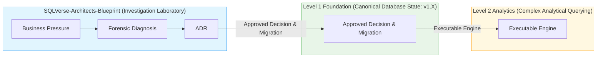

# 🗄️🤖 SQL & GenAI Course
**🎯 Quality Education for Anyone, Anywhere, Anytime — 💫 with Comfort, Convenience at no Cost**

---

# BLUEPRINT CHARTER

## SQLVerse-Architects-Blueprint — Investigation Laboratory

**Document Type:** System Charter  
**Version:** 1.0  
**Status:** FROZEN  
**Domain:** SQLVerse Foundation — Level 1, Module 4  
**Governing Standard:** `SQLVERSE-ARCH-FW-001`  

---

## 📌 Purpose

The `SQLVerse-Architects-Blueprint` is the official **investigation laboratory** for Level 1, Module 4. It provides the structured runtime environment where learners transition from basic SQL syntax to Principal Data Architecture, forensic query execution, and schema evolution.

This charter establishes the laboratory contract — the rules, boundaries, and expectations that govern every investigation performed inside the Blueprint.

---

## 🎯 Why the Blueprint Exists

The Blueprint exists to teach students how to:

1. **Diagnose** data model limitations through forensic query analysis.
2. **Evaluate** architectural trade-offs using the 11‑step reasoning pipeline.
3. **Evolve** database schemas to meet real business requirements.
4. **Document** architectural decisions in a professional Decision Ledger.
5. **Hand off** approved schema evolutions to the canonical Foundation.

**The goal is not to write more SQL. The goal is to think like a Data Architect.**

---

## 🏛️ What the Blueprint IS

| Aspect | Description |
|--------|-------------|
| **Investigation Laboratory** | A sandbox where data model deficits are identified, diagnostic queries are executed, alternatives are weighed, and Architectural Decision Records (ADRs) are logged. |
| **Forensic Workspace** | Students interrogate business pressure, diagnose structural model failures, evaluate trade-offs, and make defensible schema design decisions. |
| **Grain-First Environment** | Every investigation begins with the grain question: *"What does ONE row represent?"* |
| **Decision Registry** | Every approved evolution is logged in the central `ARCHITECTURAL_DECISION_LEDGER.md`. |
| **Framework-Compliant** | All investigations follow the 11‑step pipeline defined in `SQLVERSE-ARCH-FW-001`. |

---

## ❌ What the Blueprint IS NOT

| Aspect | Description |
|--------|-------------|
| **Canonical Schema Repository** | The Blueprint does not hold the canonical schemas. Canonical database states live exclusively in the **Level 1 Foundation** (`sqlverse-foundation`). |
| **Syntax Drill Room** | The Blueprint is not for practicing SQL syntax. Students entering the Blueprint must already be proficient in `SELECT`, `FROM`, `WHERE`, `GROUP BY`, `HAVING`, `ORDER BY`, and basic `JOIN`s. |
| **Production Environment** | Investigations are conducted in a controlled laboratory setting. Schema evolutions are proposed, not deployed. |
| **Duplicate Repository** | The Blueprint does not duplicate the Foundation. The Foundation is the single source of truth for approved schema state. |

---

## 🔗 Relationship to the SQLVerse Architecture



| Layer | Role |
|-------|------|
| **Blueprint** | Investigation Laboratory — where gaps are diagnosed and solutions are proposed |
| **Foundation** | Canonical State — where approved schema evolutions are stored |
| **Levels 2 & 3** | Execution & Consumption — where evolved schemas are consumed for advanced analytics |

---

## 📋 Governing Standard

Every investigation performed inside the Blueprint must execute the **11‑step reasoning pipeline** defined in `SQLVERSE-ARCH-FW-001`:

```
 01. BUSINESS PRESSURE       ──► Identify operational/financial friction
 02. BUSINESS QUESTION       ──► Define the specific stakeholder query
 03. REQUIRED FACT           ──► Isolate the required physical measurement
 04. REQUIRED GRAIN          ──► Determine the exact entity/event level
 05. CURRENT MODEL ANALYSIS  ──► Inspect DDL, PKs, FKs, constraints
 06. AVAILABLE FACT & GRAIN  ──► Isolate facts currently stored
 07. GAP DIAGNOSIS           ──► Calculate the precise delta
 08. FORENSIC PROOF          ──► Execute SQL proving schema failure
 09. SOLUTION OPTIONS        ──► Evaluate minimum 2‑3 architectural paths
 10. ARCHITECTURAL JUDGMENT  ──► Select winning path with trade‑off rationale
 11. DECISION & HAND‑OFF     ──► Write ADR entry and migration DDL/View
```

**The Blueprint does not redefine the Framework. It applies it.**

---

## 🏛️ The Grain-First Principle

Every investigation inside the Blueprint begins with the same foundational question:

> **"What does ONE row represent in this table?"**

This is the **Grain Invariant**. All analysis, diagnosis, and evolution decisions flow from this question.

```text
GRAIN QUESTION
      ↓
Table Grain = The real-world entity/event represented by ONE row
      ↓
Available Fact + Available Grain
      ↓
Required Fact + Required Grain
      ↓
GAP ANALYSIS
      ↓
ARCHITECTURAL JUDGMENT
```

**No investigation proceeds without first establishing grain.**

---

## 📂 Case Study Contracts

Case studies inside the Blueprint follow one of two standardized contracts defined in `SQLVERSE-ARCH-FW-001`:

### Contract Type A — Schema Evolution Case (DDL Modifying)

```text
case-study-folder/
├── 01-business-question.md
├── 02-current-schema-analysis.md
├── 03-data-gap-diagnosis.md
├── 04-solution-options.md
├── 05-architectural-decision.md
└── 06-schema-evolution-proposal.sql
```

### Contract Type B — Requirement Clarification Case (Non-DDL)

```text
case-study-folder/
├── 01-business-question.md
├── 02-current-model-analysis.md
├── 03-requirement-gap-diagnosis.md
├── 04-interpretation-options.md
├── 05-requirement-decision.md
└── 06-approved-business-rule.md
```

---

## 🏛️ Structural Hand‑Off Principles

| Principle | Description |
|-----------|-------------|
| **1. Non‑Destructive Baselines** | Baseline `v1.0` schemas are never altered. Schema modifications are written as forward migrations. |
| **2. Contract Strictness** | Case Studies 01–06 output Contract Type A. Case Study 07 outputs Contract Type B. |
| **3. Ledger Integrity** | Every case study resolution must log an entry in `ARCHITECTURAL_DECISION_LEDGER.md` matching `SQLVERSE-ARCH-FW-001` Section 6. |

---

## 📋 Student Workflow

1. **Study** the Blueprint Charter and Grain Foundations.
2. **Investigate** each case study following the 11‑step pipeline.
3. **Diagnose** the data model gap and write forensic proof queries.
4. **Evaluate** solution options and document trade‑offs.
5. **Make** an architectural decision and log it in the Decision Ledger.
6. **Propose** a schema evolution (DDL) or approved business rule (View).
7. **Hand off** the approved decision to the Foundation.

---

## 📌 Endnote

The `SQLVerse-Architects-Blueprint` is the investigation laboratory. The `sqlverse-foundation` is the canonical memory. The two are distinct, connected, and mutually reinforcing.

**The Blueprint proves why. The Foundation stores what. Level 2 inherits the evolved universe.**

---

*Part of our mission for 🎯 Quality Education for Anyone, Anywhere, Anytime — 💫 with Comfort, Convenience at no Cost.*

**SQLVerse | Architecture | Blueprint Charter | Level 1 | Module 4**