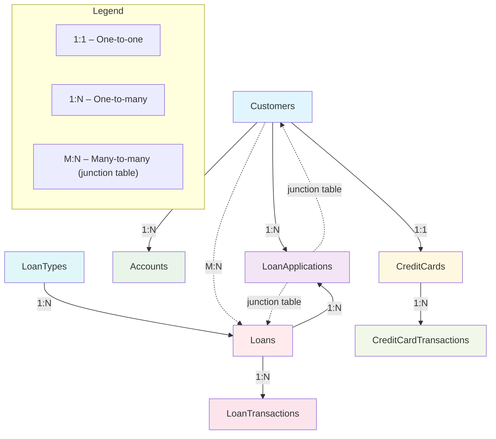

# 🗄️🤖 SQL & GenAI Course
**🎯 Quality Education for Anyone, Anywhere, Anytime — 💫 with Comfort, Convenience at no Cost**

---

# 03A — Grain + Joins: Foundations

## What Happens When Different Grains Meet

**Document Type:** Grain Foundations — Part 3A of 3  
**Version:** 1.0  
**Status:** FROZEN  
**Domain:** FinVERSE / ACQUIRE Banking Core  
**Level:** Production Skills & Mathematical Execution Principles  
**Location:** `SQLVerse-Architects-Blueprint/01-GRAIN-FOUNDATIONS/`  
**Governing Standard:** `SQLVERSE-ARCH-FW-001`

---

## 🔗 From the Architect's Blueprint

In **ACQUIRE File 4 (Normalization in Practice)** , you built a Banking domain with customers, accounts, debit cards, loans, and transactions. You learned how to normalize entities and establish relationships.

In **Grain 1**, you asked: *"What does ONE ROW represent?"*

In **Grain 2**, you asked: *"What grain do I HAVE, and what grain do I NEED?"*

**Now we ask the question that changes everything:**

> **What happens when different grains meet in a JOIN?**

---

## 📌 Purpose

This is the third and final document of the Grain Triad.

**This document bridges data modeling, SQL execution, and analytical correctness.**

You will learn:

- Why **1:1 relationships** are safe — and when they are not.
- How **1:N relationships** can distort measures when joined.
- Why **parallel 1:N relationships** cause multiplicative fan‑out.
- How **M:N relationships** create association grains and double‑counting risk.
- Why **temporal grain** adds a time dimension to analytical reasoning.
- How to **fix** grain mismatches before they produce wrong results.

### 🧠 The Central Question

In real-world data environments, business metrics rarely live inside a single table. You are required to join tables representing entirely different business concepts, operating at different levels of detail, created at different points in time.

**The central goal of File 03 is to answer one fundamental question:**

> **What happens to the row set—and the business meaning of its numbers—when different table grains meet across a `JOIN`?**

By the end of this investigation, you will understand why queries execute without syntax errors yet produce **wildly distorted financial metrics**—and how to mathematically safeguard your calculations before a single join occurs.

**This is where Grain + Joins becomes the rubber-meets-the-road moment.**

---

## 🏛️ The Banking Domain — A Forensic Laboratory

We will use the Banking domain from ACQUIRE File 4. It is ideal because:

- The relationships are familiar.
- The financial stakes are obvious.
- Fan‑out errors are not just "weird numbers" — they are **financial disasters**.

---

## 🏦 The Banking Domain — Foundation

A bank has customers, each with one or more accounts (Savings, Current, etc.), possibly one credit card, and possibly one or more loans. 

The bank tracks EMI payments for loans. A loan is linked to a specific account for auto‑debit. 

A loan may have multiple customers (e.g., a joint loan), and a customer may take multiple loans – a **many‑to‑many** relationship.


We must understand the key components: **entities**, **attributes**, and **relationships** before we proceed with our investigation.

---

### 🧩 Core Banking Entities & Attributes

- **Customer** – Individuals or entities holding accounts.  
  *Attributes:* `Name`, `Address`, `Phone`

- **Account** – Financial containers within the bank.  
  *Attributes:* `Account_Type` (Savings/Current), `Balance`, `Opening_Date`, `Overdraft_Limit` (only for Current accounts)

- **Loan** – Funds provided to customers for a specific purpose.  
  *Attributes:* `Loan_Type`, `Amount`, `Interest_Rate`, `EMI_Amount`

- **Credit Card** – Financial tool that allows customers to borrow funds up to a pre‑approved limit.  
  *Attributes:* `Card_Limit`, `Outstanding_Payment`, `Credit_Rating`

- **Loan Application** – A record linking a customer to a loan they are part of.  
  *Attributes:* `Application_Date`, `Role` (Primary/Co‑applicant), `Status`

- **Credit Card Transaction** – Movement of funds on a credit card.  
  *Attributes:* `Transaction_Date`, `Amount`, `Type` (Purchase/Cash Advance)

- **Loan Transaction** – EMI payments on a loan.  
  *Attributes:* `Payment_Date`, `Amount`

---

### 📋 Relationship Summary



- **One‑to‑One (To Be Verified):**  
  - One `Customer` → one `CreditCard` — **requires `UNIQUE` constraint on `customer_id` in `CreditCards` to be enforced**
  
> 📌 **Business Policy Note:** Different banks employ different policies. Some banks restrict customers to a single credit card (true 1:1). Other banks permit multiple credit cards (1:N). Even if the relationship is intended as 1:1 at the time of schema design, the bank may later change the policy and allow multiple cards — silently transforming the relationship into 1:N **unless the `UNIQUE` constraint protects the schema.**

- **One‑to‑Many:**  
  - One `Customer` → many `Accounts`  
  - One `Customer` → many `CreditCardTransactions` (through `CreditCards`)  
  - One `Loan` → many `LoanTransactions`  
  - One `LoanType` → many `Loans`  
  - One `Customer` → many `LoanApplications`  
  - One `Loan` → many `LoanApplications`

- **Many‑to‑Many:**  
  - `Customers` ↔ `Loans` (via `LoanApplications`)

---

### 📋 Core Transaction Types

| Transaction Type | Description |
|------------------|-------------|
| **PURCHASE** | Standard transaction where goods or services are bought. |
| **CASH_ADVANCE** | Withdrawing cash at an ATM or bank branch using the credit card. |
| **BALANCE_TRANSFER** | Moving debt from another credit card to this account. |
| **SETTLEMENT** | Finalizing a pre‑authorized transaction. |
| **REFUND** | Reversal of a sale, returning money to the cardholder's balance. |
| **CHARGEBACK** | A disputed charge that is reversed. |
| **VERIFICATION** | A zero‑dollar transaction to verify the card is active. |

---

## 📋 Meet Your Banking Dataset

To understand the Banking domain, you need to know the **entities**, their **relationships**, and the **grain of each table** — not memorise every DDL statement. The table below captures the essential facts you will need for the investigations ahead.

| Table | Grain | Key Columns | What It Tells Us |
|-------|-------|-------------|------------------|
| **`customers`** | One row = one customer | `customer_id`, `name`, `address`, `phone` | Customer identity and contact details |
| **`accounts`** | One row = one account | `account_id`, `customer_id`, `account_type`, `balance`, `opening_date`, `overdraft_limit` | Customer accounts with balances and types |
| **`credit_cards`** | One row = one credit card | `card_id`, `customer_id`, `card_limit`, `outstanding`, `credit_rating` | Credit cards linked to customers |
| **`loans`** | One row = one loan | `loan_id`, `loan_type_id`, `amount`, `emi_amount`, `auto_debit_account` | Loan products with repayment terms |
| **`loan_types`** | One row = one loan type | `loan_type_id`, `loan_type_name`, `interest_rate` | Loan type definitions and rates |
| **`loan_applications`** | One row = one customer–loan association | `customer_id`, `loan_id`, `application_date`, `loan_role` | Junction table linking customers and loans (M:N) |
| **`loan_transactions`** | One row = one loan payment | `transaction_id`, `loan_id`, `transaction_date`, `amount` | Installment payments against loans |
| **`card_transactions`** | One row = one credit card transaction | `transaction_id`, `card_id`, `transaction_date`, `amount`, `transaction_type` | Purchases, cash advances, refunds, etc. |

---

### 🔑 Key Relationships

| Relationship | Type | Evidence |
|--------------|------|----------|
| `customers` → `credit_cards` | ❓ To be investigated | Check for `UNIQUE` on `customer_id` |
| `customers` → `accounts` | 1:N | `accounts.customer_id` is a foreign key |
| `customers` ↔ `loans` | M:N | `loan_applications` junction table |
| `loans` → `loan_transactions` | 1:N | `loan_transactions.loan_id` is a foreign key |
| `credit_cards` → `card_transactions` | 1:N | `card_transactions.card_id` is a foreign key |

> 💡 **Artisan's Tip:** The relationship between `customers` and `credit_cards` is the focus of Investigation I. The table shows that `credit_cards.customer_id` is a foreign key — but the critical question is whether it is enforced as `UNIQUE`. That will determine whether the relationship is truly 1:1 or 1:N in disguise.

---

### 🔍 How to Verify Constraints (Quick Reference)

| Database | Command |
|----------|---------|
| **PostgreSQL** | `SELECT constraint_name, constraint_type FROM information_schema.table_constraints WHERE table_name = 'credit_cards';` |
| **SQLite** | `PRAGMA index_list(credit_cards);` |

---

## 🔬 Investigation I — 1:1 Relationships & Evidence Verification

### 1. Business Claim vs. Database Evidence

Analyst teams frequently make implicit assumptions based on business documentation or verbal descriptions.

In the Banking domain:

- **Business Claim:** "Every Customer has exactly one Credit Card."
- **System Design Goal:** A 1:1 relationship between `Customers` and `CreditCards`.

Consider the following setup query:

```sql
SELECT 
    c.customer_id,
    c.customer_name,
    cc.card_id,
    cc.card_limit,
    cc.outstanding
FROM customers c
INNER JOIN credit_cards cc 
    ON c.customer_id = cc.customer_id;
```

If the business claim holds true, this join retains the exact grain of `Customers`: **1 row = 1 Customer**.

**But is the claim true?**

---

### 2. Forensic Verification of Database Constraints

To determine if a join preserves grain, you must inspect database constraints rather than trusting data claims.

> **Forensic Principle:** Cardinality is a business claim; constraints provide structural evidence.

To verify whether a relationship is genuinely 1:1, inspect the schema definition for a `UNIQUE` constraint or a `PRIMARY KEY` on the foreign key column.

---

#### PostgreSQL Version

```sql
-- Querying schema constraints (PostgreSQL)
SELECT 
    tc.constraint_name, 
    tc.constraint_type,
    kcu.column_name
FROM information_schema.table_constraints AS tc
JOIN information_schema.key_column_usage AS kcu
  ON tc.constraint_name = kcu.constraint_name
WHERE tc.table_name = 'credit_cards' 
  AND kcu.column_name = 'customer_id';
```

**Expected Output (Without UNIQUE):**

```text
+-----------------------+-----------------+---------------+
| constraint_name       | constraint_type | column_name   |
+-----------------------+-----------------+---------------+
| credit_cards_pkey     | PRIMARY KEY     | card_id       |
| fk_customer_id        | FOREIGN KEY     | customer_id   |
+-----------------------+-----------------+---------------+
```

**Observation:** There is **no `UNIQUE` constraint** on `customer_id`.

This means the database **does not enforce** the 1:1 relationship. Multiple credit cards can exist for the same customer.

---

#### SQLite Version

```sql
-- SQLite: Verify 1:1 relationship enforcement
-- Step 1: Check table structure
PRAGMA table_info(credit_cards);

-- Step 2: List all indexes on the table
PRAGMA index_list(credit_cards);
-- Look for a UNIQUE index (unique = 1) on customer_id

-- Step 3: Inspect the specific index (replace with actual index name)
PRAGMA index_info(idx_credit_cards_customer_id);
```

**Expected Output:**

```text
-- PRAGMA table_info(credit_cards)
+-----+-------------+---------+---------+------------+----+
| cid | name        | type    | notnull | dflt_value | pk |
+-----+-------------+---------+---------+------------+----+
| 0   | card_id     | INTEGER | 1       | NULL       | 1  |
| 1   | customer_id | INTEGER | 1       | NULL       | 0  |
| 2   | card_limit  | REAL    | 1       | NULL       | 0  |
| 3   | outstanding | REAL    | 0       | 0.0        | 0  |
| 4   | credit_rating| INTEGER| 0       | NULL       | 0  |
+-----+-------------+---------+---------+------------+----+

-- PRAGMA index_list(credit_cards)
+-----+----------------------+----------+--------+
| seq | name                 | unique   | origin  |
+-----+----------------------+----------+--------+
| 0   | sqlite_autoindex_credit_cards_1 | 1 | pk   |
| 1   | idx_credit_cards_customer_id    | 0 | c     |
+-----+----------------------+----------+--------+

-- PRAGMA index_info(idx_credit_cards_customer_id)
+-----+----------+-------------+
| seq | cid      | name        |
+-----+----------+-------------+
| 0   | 1        | customer_id |
+-----+----------+-------------+
```

**Observation:** There is **no `UNIQUE` index** on `customer_id`. Only the PRIMARY KEY index on `card_id` is unique.

---

### 3. Data Pattern vs. Business Policy

Some customers will have a single credit card, and in those cases, the **data pattern** appears to be 1:1.

But that is an observation, not a guarantee.

**The distinction is critical:**

| Observation | Conclusion |
|-------------|------------|
| One customer → one credit card (in the data) | ❌ Does NOT prove 1:1 |
| `UNIQUE` constraint on `customer_id` | ✅ PROVES 1:1 |

**Why does this matter?**

- **Bank A** restricts customers to a single credit card. The schema has a `UNIQUE` constraint on `customer_id`. ✅ The relationship is genuinely 1:1.
- **Bank B** permits multiple credit cards. The schema has **no** `UNIQUE` constraint. ❌ The relationship is  not guaranteed to be 1:1 or 1:N. The database permits 1:N cardinality; current data must be inspected to determine whether multiple cards actually exist.

---
**One critical nuance:**

If the `UNIQUE` constraint is **not available** in the current schema, it does **not** mean the original design was 1:N.

Originally, the `UNIQUE` constraint may have been added at design time, and the database design documentation may confirm that the relationship was intended to be 1:1.

But over time — perhaps after 7 or 8 years — the bank may have decided to revise its policy to compete with other banks. The constraint may have been **dropped**, and the existing data may have been **migrated** to support multiple credit cards per customer.

---
### 🔍 Schema Evolution Over Time in Real-time

| Element | What It Means |
|---------|---------------|
| **Schema Evolution** | The schema design is not static — constraints may be added or dropped over time |
| **Business Policy Drift** | A bank may revise its policy after years of operation |
| **Data Migration** | Existing data may be migrated to conform to the new policy |
| **Historical Evidence** | The original design documentation may differ from the current schema |
| **Forensic Principle** | The current schema is the authoritative source for what the database guarantees today. Historical documentation provides evidence of what was intended or enforced in the past. |

---

**The lesson:**

> ** Business policies evolve. Constraints can be added or removed. Always verify the current schema state before assuming cardinality.**

---

**The Artisan's Rule:**

> **Do not confuse observed cardinality with guaranteed cardinality. Use data to observe what exists; use schema constraints to determine what is guaranteed.**

---

### 4. The Reality — Duality, Not Guarantee

Because the `UNIQUE` constraint is missing, the join behaves as a **1:N relationship** in the general case:

```text
Customers (1) ──── (N) CreditCards
```

**But this is not the full story.**

The schema **does not enforce** 1:1. It also **does not require** 1:N.

It supports **both possibilities**:

| Possibility | Condition |
|-------------|-----------|
| **1:1** | A customer with exactly one credit card |
| **1:N** | A customer with multiple credit cards |

**The schema permits both. Current data determines observed cardinality**

**What this means:**

- One customer can have multiple credit cards — the relationship is observed as 1:N.
- Another customer can have only one card — the relationship is observed as 1:1.
- Both are valid. Neither is guaranteed.
- The join result now has **one row per credit card**, not one row per customer.
- The grain of the result has silently transformed from `Customer Grain` to `Credit Card Grain`.

**The Artisan's Insight:**

```text
Schema Evidence
        ↓
1:1 NOT guaranteed
        ↓
Data Investigation
        ↓
Multiple cards observed?
        ├── YES → observed 1:N
        └── NO  → currently observed 1:1,
                  but structurally unprotected
```

**Key Takeaway:**

> **The absence of a `UNIQUE` constraint does not mean the relationship is 1:N. 
> 
> It means the relationship is not guaranteed to be 1:1. 
> 
> The data may show 1:1, 1:N, or a mix. 
> 

 - **The schema provides the container;** the data provides the content.
-  **Trust the constraints** for guarantees. 
-  **Trust the data for observations** — but never confuse the two.**

---

### 5. The Silent Failure

```sql
SELECT 
    c.customer_id,
    c.customer_name,
    COUNT(cc.card_id) AS card_count,
    SUM(cc.card_limit) AS total_credit_limit
FROM customers c
INNER JOIN credit_cards cc 
    ON c.customer_id = cc.customer_id
GROUP BY c.customer_id, c.customer_name;
```

If a customer has 3 credit cards, the `SUM(cc.card_limit)` correctly calculates the total credit limit across all cards. This is **correct** for the query's purpose.

**But the danger emerges when joining to other tables:**

```sql
-- WRONG: Double-counting account balance when joining through multiple credit cards
SELECT 
    c.customer_id,
    c.customer_name,
    COUNT(cc.card_id) AS card_count,
    SUM(a.balance) AS total_balance  -- 🚨 DANGER ZONE!
FROM customers c
INNER JOIN credit_cards cc ON c.customer_id = cc.customer_id
INNER JOIN accounts a ON c.customer_id = a.customer_id
GROUP BY c.customer_id, c.customer_name;
```

**What happens:** Each account balance is repeated across every credit card row.

**Result:** If a customer has 3 credit cards and 1 account with balance $10,000, the sum becomes $30,000 ❌

**Expected:** $10,000 ✅

---

### 6. The Forensic Finding

| Element | Status |
|---------|--------|
| **Business Claim** | 1:1 (One Customer → One Credit Card) |
| **Database Evidence (PostgreSQL)** | ❌ No `UNIQUE` constraint on `customer_id` |
| **Database Evidence (SQLite)** | ❌ No `UNIQUE` index on `customer_id` |
| **Actual Relationship** | 1:N (One Customer → Many Credit Cards) |
| **Grain of Join** | `Credit Card Grain` |

> **The absence of a `UNIQUE` constraint on a foreign key does not mean the relationship is 1:N. It means the database does not guarantee that it is 1:1. That uncertainty is the silent failure waiting to happen.**

---

### 🔍 Key Takeaways

| Element | Why It's Effective |
|---------|-------------------|
| **Business Policy Variability** | Different banks employ different policies — some restrict to one card, others allow multiple |
| **Schema Evolution** | The schema design is not static — constraints may be added or dropped over time |
| **The Silent Failure** | If the `UNIQUE` constraint is missing, the schema does not protect against the policy change |
| **Forensic Principle Reinforced** | *"Cardinality is a business claim; constraints provide structural evidence."* — only constraints guarantee the relationship |

- **For guarantees,** trust the schema constraints. 
- **For observations,** trust the current data. 
- **For historical intent,** consult historical evidence. 

Never confuse the three.

**The tables are not merely being joined. Their grains are meeting.**

---
##  🔬 Investigation II — 1:N Relationships & Single-Branch Fan-Out

**Business Question:**

> *"Show me each customer, their total outstanding loan balance, and the number of loans they have."*

**The Tables:**

| Table | Grain | Example Data |
|-------|-------|--------------|
| `Customers` | One row = one customer | `cust_101`, `cust_102` |
| `Loans` | One row = one loan | `loan_201` ($50,000), `loan_202` ($30,000), `loan_203` ($20,000) — all linked to `cust_101` |

**The Relationship:**

```text
Customers (1) ──── (N) Loans
```

---

### 1. Business Context

In the Banking domain:

- **Business Rule:** "A customer can have multiple loans."
- **Schema Design:** `Loans.customer_id` is a foreign key referencing `Customers.customer_id`.

**The Naive Query:**

```sql
SELECT 
    c.customer_id,
    c.customer_name,
    l.loan_id,
    l.amount AS loan_amount
FROM customers c
INNER JOIN loans l ON c.customer_id = l.customer_id;
```

If a customer has 3 loans, this query returns 3 rows — one per loan. The customer information is repeated across each loan row.

---

### 2. The Aggregation Trap

**Business Question (Aggregated):**

> *"Show me each customer, the total outstanding loan balance, and the number of loans they have."*

**The Naive Query (The Trap):**

```sql
SELECT 
    c.customer_id,
    c.customer_name,
    COUNT(l.loan_id) AS loan_count,
    SUM(l.amount) AS total_loan_balance  -- 🚨 DANGER ZONE!
FROM customers c
INNER JOIN loans l ON c.customer_id = l.customer_id
GROUP BY c.customer_id, c.customer_name;
```

**Why This Works (In This Case):**

Unlike the Account + CreditCard example where the balance was repeated, this query correctly calculates the **total loan balance** across all loans. The `SUM(l.amount)` aggregates the loan amounts correctly because the measure (`loan_amount`) belongs to the **loan grain**, not the customer grain.

**Result:**

| customer_id | loan_count | total_loan_balance |
|-------------|------------|-------------------|
| cust_101    | 3          | 100,000           |
| cust_102    | 1          | 15,000            |

This is **correct** because the measure (`loan_amount`) is defined at the loan grain.

---

### 3. The Danger — When the Measure Belongs to the Customer Grain

**Now consider a different business question:**

> *"Show me each customer, their total credit limit, and the total outstanding loan balance."*

| Measure | Grain | Source Table |
|---------|-------|--------------|
| Total Loan Balance | Loan Grain | `Loans` |
| **Credit Limit** | **Customer Grain** | **`Customers`** |

**The Naive Query (The Trap):**

```sql
SELECT 
    c.customer_id,
    c.customer_name,
    c.credit_limit,  -- Customer‑grain measure
    COUNT(l.loan_id) AS loan_count,
    SUM(l.amount) AS total_loan_balance
FROM customers c
INNER JOIN loans l ON c.customer_id = l.customer_id
GROUP BY c.customer_id, c.customer_name, c.credit_limit;
```

**What Happens:**

The `credit_limit` (defined at the customer grain) is replicated across every loan row.

| customer_id | credit_limit | loan_count | total_loan_balance |
|-------------|--------------|------------|-------------------|
| cust_101    | 50,000       | 3          | 100,000           |

**Observation:** The `credit_limit` appears once in the result because of `GROUP BY`. But consider what happens **before aggregation**.

**The Underlying Join (Before GROUP BY):**

| customer_id | credit_limit | loan_id | loan_amount |
|-------------|--------------|---------|-------------|
| cust_101    | 50,000       | loan_201 | 50,000      |
| cust_101    | 50,000       | loan_202 | 30,000      |
| cust_101    | 50,000       | loan_203 | 20,000      |

**Key Insight:** The `credit_limit` is replicated across every loan row. While `GROUP BY` hides the replication, the measure is still present multiple times in the intermediate row set. This becomes dangerous when **joining to multiple detail tables** (Investigation III) or when **using window functions** (Level 2).

---

### 4. The Correct Aggregation at This Grain

**Correct Query:**

```sql
SELECT 
    c.customer_id,
    c.customer_name,
    c.credit_limit,
    COUNT(l.loan_id) AS loan_count,
    SUM(l.amount) AS total_loan_balance
FROM customers c
INNER JOIN loans l ON c.customer_id = l.customer_id
GROUP BY c.customer_id, c.customer_name, c.credit_limit;
```

**Why This Works:**

- `credit_limit` is in the `GROUP BY` clause.
- The `SUM(l.amount)` aggregates loans correctly.
- No double counting occurs.

---

### 5. The Silent Failure

**Now consider joining to another detail table:**

```sql
-- WRONG: Adding loan_transactions to the mix
SELECT 
    c.customer_id,
    c.customer_name,
    c.credit_limit,
    COUNT(DISTINCT l.loan_id) AS loan_count,
    SUM(l.amount) AS total_loan_balance,
    SUM(lt.amount) AS total_payments  -- 🚨 DANGER ZONE!
FROM customers c
INNER JOIN loans l ON c.customer_id = l.customer_id
INNER JOIN loan_transactions lt ON l.loan_id = lt.loan_id
GROUP BY c.customer_id, c.customer_name, c.credit_limit;
```

**What Happens:**

Each loan row is repeated across every loan transaction. The `credit_limit` is replicated across the entire result set.

**Example:**

- 1 customer
- 3 loans
- 5 transactions for each loan
- **Result:** **1 customer, 3 loans, and 5 transactions for each loan → 3 × 5 = 15 rows**

**Key Finding:** When you join a table at a coarser grain (Customers) to a detail table (Loans), the coarser‑grain measure is replicated. `GROUP BY` can hide the replication, but the intermediate row set contains duplicates — which become dangerous when joining to **additional detail tables**.

---

### 6. The Artisan's Fix

```sql
-- CORRECT: Aggregate loans to customer grain first
WITH loan_summary AS (
    SELECT 
        customer_id,
        COUNT(loan_id) AS loan_count,
        SUM(amount) AS total_loan_balance
    FROM loans
    GROUP BY customer_id
)
SELECT 
    c.customer_id,
    c.customer_name,
    c.credit_limit,
    COALESCE(ls.loan_count, 0) AS loan_count,
    COALESCE(ls.total_loan_balance, 0) AS total_loan_balance
FROM customers c
LEFT JOIN loan_summary ls ON c.customer_id = ls.customer_id;
```
> **Note:** Once `loan_transactions` is joined, even `SUM(l.amount)` becomes distorted because the loan amount is replicated across each transaction row.
>
> **Example:**
>
> - Loan 201 = $50,000, with 5 transactions
> - Loan 202 = $30,000, with 5 transactions
> - Loan 203 = $20,000, with 5 transactions
>
> The join produces:
>
> | loan_id | loan_amount | transaction_id |
> |---------|-------------|----------------|
> | loan_201 | 50,000 | tx_1 |
> | loan_201 | 50,000 | tx_2 |
> | ... | ... | ... |
> | loan_203 | 20,000 | tx_5 |
>
> Therefore:
>
> ```text
> SUM(l.amount)
> =
> 50,000×5
> +30,000×5
> +20,000×5
> =
> 500,000
> ```
>
> instead of `100,000`.

---

**Why This Works:**

- Loans are aggregated to the customer grain first.
- The `JOIN` is between tables at the same grain.
- No row multiplication occurs.
- The `credit_limit` is represented once at Customer Grain.

---

### 7. The Forensic Finding

| Element | Status |
|---------|--------|
| **Relationship** | 1:N (Customers → Loans) |
| **Measure at Customer Grain** | `credit_limit` |
| **Measure at Loan Grain** | `loan_amount` |
| **Risk** | Customer‑grain measures are replicated across loan rows |
| **Mitigation** | Aggregate loans to customer grain before joining |

> **Key Finding:** In a 1:N join, measures defined at the parent (1) grain are replicated across child (N) rows. While `GROUP BY` can hide the replication, the intermediate row set contains duplicates — which become dangerous when joining to **additional detail tables** or using **window functions**.

---

### 🔍 Key Takeaways

| Element | Why It's Effective |
|---------|-------------------|
| **Measure Grain Awareness** | The danger depends on which grain the measure belongs to |
| **Safe Aggregation** | Aggregating loan amounts to customer grain works correctly |
| **Replication** | Customer‑grain measures are replicated across loan rows |
| **Silent Failure** | The intermediate row set contains duplicates; `GROUP BY` hides them |

---
### 🧾 Conclusion — Investigation II

**What did we discover?**

Joining a table at the **Customer Grain** (`customers`) to a table at the **Loan Grain** (`loans`) produces a row set at the **Loan Grain**.

| Element | Status |
|---------|--------|
| **Relationship** | 1:N (Customers → Loans) |
| **Customer‑Grain Measures** | Replicated across every loan row |
| **Loan‑Grain Measures** | Correctly aggregatable |
| **Row-Set Grain** | Loan Grain |

---

**The Quantitative Impact:**

| Scenario | Actual | Reported | Overstatement |
|----------|--------|----------|---------------|
| **Customer Credit Limit (Replicated)** | $10,000 | $50,000 | **$40,000 / 400% ❌**  |
| **Loan Balance (Correctly Aggregated)** | $100,000 | $100,000 |  **$0 / 0% ✅** |

**What happened:**

- The `credit_limit` was evaluated at the **Loan Grain** rather than the **Customer Grain**.
- The row set underwent a **1:N fan-out**.
- The customer‑grain measure was replicated across every loan row.

**The Signature Finding:**

> **A measure is not merely a number. It has a grain.**
>
> Joining to a finer‑grained table does not change the physical measure. It changes the **context in which that measure is observed**.
>
> If you sum a measure at the wrong grain, the database will faithfully calculate a **mathematically correct answer to the wrong business question.**

**The JOIN is not the problem. Observing or aggregating a measure at the wrong resulting grain is the problem.**

---

**The Artisan's Rule for 1:N Joins:**

> **Identify the measure's grain. Then decide whether that grain is valid at the result grain.**
>
> - If the measure belongs to the **parent grain** (e.g., Customer), it will be replicated across child rows.
> - If the measure belongs to the **child grain** (e.g., Loan), it will aggregate correctly.
>
> **Always verify the grain of each measure before aggregating.**

---

**Bridge to Investigation III:**

What happens when **two independent 1:N branches** meet the same anchor table?

```text
Accounts
   │
   ├── CreditCards (1:N)
   └── Transactions (1:N)
```

The replication becomes **multiplicative**.

**Proceed to Investigation III — Parallel 1:N Relationships & Multiplicative Fan-Out.**

---
### 🔁 Bridge to 03B — Fan-Out

You have now completed the foundational investigations:

| Investigation | Relationship | Key Finding |
|---------------|--------------|-------------|
| **I** | 1:1 (Unenforced) | Cardinality is a business claim; constraints provide structural evidence |
| **II** | 1:N (Single Branch) | Parent‑grain measures are replicated across child rows |

**The Row-Set Transformation so far:**

```text
1:1 Unenforced → Grain Drift
1:N → Parent Measure Replication
```

Now we escalate.

What happens when **two independent 1:N branches** meet the same anchor table?

```text
Accounts
   │
   ├── CreditCards (1:N)
   └── Transactions (1:N)
```

The replication becomes **multiplicative**.

**Proceed to 📁 03B — Grain + Joins: Fan-Out.**

- Investigation III — Parallel 1:N Relationships & Multiplicative Fan-Out
- Investigation IV — M:N Relationships & Association Bridge Grains
- Investigation V — Temporal Grain & History Preservation

---

*Part of our mission for 🎯 Quality Education for Anyone, Anywhere, Anytime — 💫 with Comfort, Convenience at no Cost.*

**SQLVerse | Architecture | Grain Foundations | 03A — Grain + Joins: Foundations**

