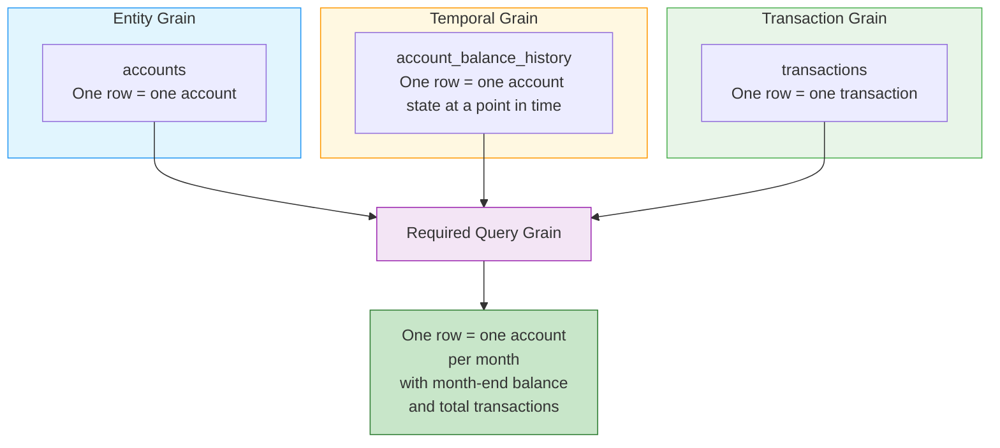
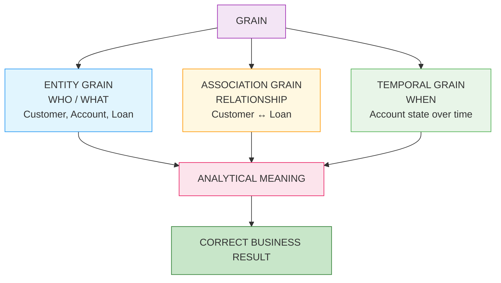

# 🗄️🤖 SQL & GenAI Course
**🎯 Quality Education for Anyone, Anywhere, Anytime — 💫 with Comfort, Convenience at no Cost**

---

# 03B — Grain + Joins: Temporal

## Time as a Dimension of Grain

**Document Type:** Grain Foundations — Part 3B (2 of 2)  
**Version:** 1.0  
**Status:** FROZEN  
**Domain:** FinVERSE / ACQUIRE Banking Core  
**Level:** Production Skills & Mathematical Execution Principles  
**Location:** `SQLVerse-Architects-Blueprint/01-GRAIN-FOUNDATIONS/`  
**Governing Standard:** `SQLVERSE-ARCH-FW-001`

---

## ⏳ Investigation V — Temporal Grain & History Preservation

### 1. The Final Investigation

You have now completed four investigations into what happens when different grains meet through a JOIN:

- **Investigation I** — 1:1 relationships and evidence verification
- **Investigation II** — 1:N relationships and single-branch fan-out
- **Investigation III** — Parallel 1:N relationships and multiplicative fan-out
- **Investigation IV** — M:N relationships and association bridge grains

Each investigation taught you that **relationships can change the row set.** 

**In those four investigations, the central question was structural:**

> **What happens to the row set when different cardinalities meet?**

We observed entities multiply, parent measures replicate across child branches, and association bridge tables introduce new relational boundaries.

**Investigation V introduces a fundamentally different challenge.**

Temporal grain is not merely about row multiplication. It is about **time itself as a dimension of grain**.

It introduces a dimensional split of a single entity across time.

In Investigation V, we pose a fundamentally different question:

> **What happens to the meaning of a fact when TIME becomes part of the grain?**

---

### 🔍 2. Why Temporal Grain Is Different

| Investigation | Core Question | Nature |
|---------------|---------------|--------|
| **I — 1:1** | Is the relationship truly 1:1? | Cardinality |
| **II — 1:N** | What happens when a parent measure meets child rows? | Multiplicity |
| **III — Parallel 1:N** | What happens when two 1:N branches meet? | Result‑Set Explosion |
| **IV — M:N** | What happens when the bridge table introduces a new grain? | Association |
| **V — Temporal** | What happens when the same entity has different states across time? | **Time** |

**Temporal grain is not about structural row multiplication. It is about representing the state of an entity across time.**

---

### 🧠 3.  The Core Conceptual Shift

In Investigations I–IV, each table had a defined structural grain: an entity, association, event, or transaction represented by one row.

In Investigation V, **time becomes an additional dimension of that grain.**

-   **Structural Grain (Investigations I–IV):**
    
    $$1 \text{ Row} = 1 \text{ Entity}$$
    
-   **Temporal Grain (Investigation V):**
    
    $$1 \text{ Row} = 1 \text{ State of an Entity at a defined temporal grain. } $$

```text
INVESTIGATIONS I–IV
        │
        ▼
   CARDINALITY
"What happens when rows meet?"
        │
        ▼
  INVESTIGATION V
        │
        ▼
     TIME
"What does this row mean at a particular point in time?"
```

**The key transition is:**

> **Grain is not only about WHO or WHAT a row represents. It can also include WHEN that fact is true.**

---

### 🕰️ 4. Temporal Grain Across Domains

Temporal grain is not unique to Banking. It is a universal analytical pattern that appears across every SQLVerse universe.

Consider these three case studies that you will investigate in detail in the next module:

| Universe | Case Study | Temporal Grain Question |
|----------|------------|-------------------------|
| **E‑Store** | The Price Freeze | What price did the customer actually pay at the time of the order? |
| **Real Estate Planet** | The Time‑to‑Sale Gap | How long was a property listed before it sold? |
| **Hospital Planet** | The Inpatient Blackhole | When was the patient admitted, and when were they discharged? |

**Each case study confronts the same fundamental limitation:**

```text
Current State Model
       │
       └── Reflects the LATEST state

Historical State Model
       │
       └── Captures state at a POINT IN TIME
```
> **A current-state-only schema stores the latest state.**
>
> **Without historical state or event history, it cannot answer questions about the past.**


**The difference is temporal grain.**

> **Temporal grain is a universal property of analytical data, regardless of industry.**
>
> **Whenever historical meaning matters, temporal grain becomes part of the data model.**

**In the next module:**

- We will **investigate these case studies** in full detail.
- We will also **design schemas** that capture historical state at the correct grain.

**For now, we continue with our Banking forensic investigation.**

---

### 📋 5. The Banking Domain Connection

In the Banking domain, temporal grain appears naturally:

| Table | Grain | Temporal Dimension |
|-------|-------|-------------------|
| `Accounts` | One row = one account | Balance changes over time |
| `Loans` | One row = one loan | Outstanding balance changes over time |
| `Customers` | One row = one customer | Address, credit limit may change over time |

**The question changes from:**

> **WHO?** → **WHO + WHEN?**

---

### 📋 6. The Current-State Dataset — Account Example

Consider a standard current-state table:

```text
accounts

+------------+---------+
| account_id | balance |
+------------+---------+
| ACC-101    | 13,500  |
| ACC-102    | 15,000  |
| ACC-103    | 26,500  |
+------------+---------+
```

**Today:** For ACC-101, the current balance is $13,500.

**January 1:** For ACC-101, what was the balance on January 1?

**Answer:** We don't know.

The current row tells us the current state—not necessarily historical state.

> **A current-state table can answer "What is true now?" without being able to answer "What was true then?"**

**Let us ask the fundamental question:**

> **What does ONE ROW represent in a temporal grain?**

**Normally:**

```text
accounts table

ONE ROW =
one account
```

**In temporal grain this becomes:**

```text
account_balance_history

ONE ROW =
one account's balance
at a particular point in time
```

**Now the grain becomes:**

```text
Account
      ↓
Account + Time
```

- The temporal grain is **not** merely one balance.
- The temporal grain is **one account balance at a defined point or period in time**.

---

### 📋 7. The Historical Dataset 

#### Account Balance History

**To preserve history across time, the schema must evolve its grain.**

Let us introduce a controlled Banking dataset and look at the grains of current-state dataset and historical dataset.

#### Current-State Table

```text
accounts

+------------+---------+
| account_id | balance |
+------------+---------+
| ACC-101    | 12,500  |
+------------+---------+
```
```text
Table Grain
= Account 
```

#### Historical Events/State

```text
account_balance_history

+------------+------------+---------+
| account_id | as_of_date | balance |
+------------+------------+---------+
| ACC-101    | 2025-01-01 | 10,000  |
| ACC-101    | 2025-03-01 | 11,500  |
| ACC-101    | 2025-06-30 | 12,000  |
| ACC-101    | 2025-08-31 | 12,500  |
+------------+------------+---------+
```

**Now:**

```text
Table Grain
= Account + As-of Date
```

We can immediately see the balances date-wise

```text
ACC-101
   │
   ├── Jan 01 → $10,000
   ├── Mar 01 → $11,500
   ├── Jun 30 → $12,000
   └── Aug 31 → $12,500
```
Notice the critical distinction:

**The account hasn't multiplied because of a JOIN.**

**Time has created multiple legitimate rows.**


---

#### Loan History

Consider the `loans` table:

| loan_id | amount | outstanding_balance |
|---------|--------|-------------------|
| LOAN-801 | $200,000 | $150,000 |
| LOAN-802 | $50,000 | $30,000 |
| LOAN-803 | $30,000 | $20,000 |

**Today:** For LOAN-801, the current outstanding balance is $150,000.

**Question:** What was the outstanding balance on January 1?

**Answer:** We don't know.

The current row tells us the current state—not necessarily historical state.

> **A current-state table can answer "What is true now?" without being able to answer "What was true then?"**

Let us introduce a historical table:

```text
loan_balance_history

+---------+------------+---------------------+
| loan_id | as_of_date | outstanding_balance |
+---------+------------+---------------------+
| LOAN-801| 2025-01-01 | 180,000             |
| LOAN-801| 2025-04-01 | 165,000             |
| LOAN-801| 2025-07-01 | 150,000             |
| LOAN-802| 2025-01-01 | 40,000              |
| LOAN-802| 2025-04-01 | 35,000              |
| LOAN-802| 2025-07-01 | 30,000              |
+---------+------------+---------------------+
```

**Now the grain becomes:**

```text
Loan
      ↓
Loan + As-of Date
```

**The loan hasn't multiplied because of a JOIN. Time has created multiple legitimate rows.**

**The temporal grain is not:** merely one balance.

**The temporal grain is:** one loan's outstanding balance at a defined point or period in time.

---

### 🔬 8. The Central Forensic Question — State or Event?

This is one of the critical question in this investigation.

There are two fundamentally different temporal representations in database design:


#### Event Grain

```text
ONE ROW = one balance-changing event
```

Example:

```text
2025-06-30
Withdrawal
$500
```

#### State Grain

```text
ONE ROW = account state at a point in time
```

Example:

```text
2025-06-30
Balance = $12,000
```
```text
EVENT GRAIN
ONE ROW = One balance-changing action
Example: 2025-06-30 | Withdrawal | -$500.00

STATE GRAIN
ONE ROW = Account status at a point in time / window
Example: 2025-06-30 | Balance = $12,000.00

```

#### Event Grain ≠ State Grain

> **An event tells us what happened. A state tells us what was true.**

**These are not interchangeable.**

---

#### Key Takeaways:

- Events are additive flows.
- States are static point-in-time snapshots. 
- Both events and states cannot be queried or aggregated under the same mathematical rules.

---

### 🧮 9. The Historical Reconstruction Problem

Consider the historical state record for `ACC-101`:

```text
Jun 01 → $11,500
Jun 30 → $12,000
```
**Business Question:** What was ACC-101's balance on June 15?

Can we answer this from the available data?

**NO.**

This evolves our core foundational principle:

> **You cannot recover detail that was never stored.**

### **Temporal version:**

> **You cannot reconstruct historical state at a temporal grain that the model never preserved.**

---

### 📋 10. Temporal Grain Types

To analyze time accurately, you must categorize the available temporal grain:


```text
Point-in-Time Grain
    └── One entity state at a specific timestamp

Daily Grain
    └── One entity state per day

Monthly Snapshot Grain
    └── One entity state per entity per month

Event Grain
    └── One state-changing action
```

Then ask:

> **Which one answers the business question?**

This connects directly to the already-frozen **Required Grain vs Available Grain** framework from 02A.

```text
Required Grain
      ↓
Account + Day
      ↓
Available Grain
      ↓
Account + Month
```

Then:

> **Can monthly snapshots answer a daily historical question?**

**No — not exactly.**

Unless the business explicitly defines an acceptable approximation.

**That is temporal grain alignment.**

---

### 📋 Practical Use Case — The Four Temporal Grains

Consider a Banking scenario where we need to analyse **Account ACC-101's balance** across four different temporal lenses.

```text
TEMPORAL REPRESENTATIONS
│
├── STATE GRAIN
│   ├── Point-in-Time
│   ├── Daily
│   └── Monthly Snapshot
│
└── EVENT GRAIN
    └── State-changing action
```

---

### 1. Point-in-Time Grain

**Definition:** One entity state at a specific timestamp.

**Business Question:**

> *"What was ACC-101's balance at exactly 2025-06-15 14:30:00?"*

**The Data:**

```text
account_balance_history

+------------+---------------------+---------+
| account_id | as_of_timestamp     | balance |
+------------+---------------------+---------+
| ACC-101    | 2025-06-15 10:00:00 | 11,500  |
| ACC-101    | 2025-06-15 14:30:00 | 11,800  |
| ACC-101    | 2025-06-15 18:00:00 | 12,000  |
+------------+---------------------+---------+
```

**The Query:**

```sql
SELECT 
    account_id,
    as_of_timestamp,
    balance
FROM account_balance_history
WHERE account_id = 'ACC-101'
  AND as_of_timestamp = '2025-06-15 14:30:00';
```

**Result:**

| account_id | as_of_timestamp | balance |
|------------|-----------------|---------|
| ACC-101 | 2025-06-15 14:30:00 | 11,800 |

**Grain:** One row = one account state at one timestamp.

---

### 2. Daily Grain

**Definition:** One entity state per day.

**Business Question:**

> *"What was ACC-101's balance at the end of each day in June?"*

**The Data:**

```text
account_balance_daily

+------------+------------+---------+
| account_id | as_of_date | balance |
+------------+------------+---------+
| ACC-101    | 2025-06-01 | 11,500  |
| ACC-101    | 2025-06-02 | 11,600  |
| ACC-101    | 2025-06-03 | 11,700  |
| ...        | ...        | ...     |
| ACC-101    | 2025-06-30 | 12,000  |
+------------+------------+---------+
```

**The Query:**

```sql
SELECT 
    account_id,
    as_of_date,
    balance
FROM account_balance_daily
WHERE account_id = 'ACC-101'
  AND as_of_date BETWEEN '2025-06-01' AND '2025-06-30'
ORDER BY as_of_date;
```

**Result:** 30 rows — one for each day in June.

**Grain:** One row = one account state per day.

---

### 3. Monthly Snapshot Grain

**Definition:** One entity state per entity per month.

**Business Question:**

> *"What was ACC-101's balance at the end of each month in Q2 2025?"*

**The Data:**

```text
account_balance_monthly

+------------+------------+---------+
| account_id | as_of_month | balance |
+------------+-------------+---------+
| ACC-101    | 2025-04    | 10,800  |
| ACC-101    | 2025-05    | 11,200  |
| ACC-101    | 2025-06    | 12,000  |
+------------+------------+---------+
```

**The Query:**

```sql
SELECT 
    account_id,
    as_of_month,
    balance
FROM account_balance_monthly
WHERE account_id = 'ACC-101'
  AND as_of_month BETWEEN '2025-04' AND '2025-06'
ORDER BY as_of_month;
```

**Result:**

| account_id | as_of_month | balance |
|------------|-------------|---------|
| ACC-101 | 2025-04 | 10,800 |
| ACC-101 | 2025-05 | 11,200 |
| ACC-101 | 2025-06 | 12,000 |

**Grain:** One row = one account state per month.

---

### 4. Event Grain

**Definition:** One state-changing action.

**Business Question:**

> *"What balance-changing events occurred on ACC-101 in June 2025?"*

**The Data:**

```text
account_events

+---------+---------------------+------------+---------+
| event_id| event_timestamp     | event_type | amount  |
+---------+---------------------+------------+---------+
| EVT-001 | 2025-06-01 09:00:00 | DEPOSIT    | +2,000  |
| EVT-002 | 2025-06-05 14:00:00 | WITHDRAWAL | -500    |
| EVT-003 | 2025-06-15 10:00:00 | DEPOSIT    | +1,000  |
| EVT-004 | 2025-06-30 18:00:00 | WITHDRAWAL | -200    |
+---------+---------------------+------------+---------+
```

**The Query:**

```sql
SELECT 
    event_id,
    event_timestamp,
    event_type,
    amount
FROM account_events
WHERE account_id = 'ACC-101'
  AND event_timestamp BETWEEN '2025-06-01' AND '2025-06-30'
ORDER BY event_timestamp;
```

**Result:**

| event_id | event_timestamp | event_type | amount |
|----------|-----------------|------------|--------|
| EVT-001 | 2025-06-01 09:00:00 | DEPOSIT | +2,000 |
| EVT-002 | 2025-06-05 14:00:00 | WITHDRAWAL | -500 |
| EVT-003 | 2025-06-15 10:00:00 | DEPOSIT | +1,000 |
| EVT-004 | 2025-06-30 18:00:00 | WITHDRAWAL | -200 |

**Grain:** One row = one balance-changing event.

---

### 📋 The Four Grains Compared

| Grain Type | One Row Represents | Example Row | Business Use Case |
|------------|-------------------|-------------|-------------------|
| **Point-in-Time** | One state at one timestamp | `2025-06-15 14:30:00 → $11,800` | Audit trails, regulatory snapshots |
| **Daily** | One state per day | `2025-06-15 → $11,800` | Daily reconciliation |
| **Monthly Snapshot** | One state per month | `2025-06 → $12,000` | Monthly reporting, trend analysis |
| **Event** | One state-changing action | `2025-06-15 → +$1,000 deposit` | Transaction logs, audit trails |

---

### 🧠 Which Grain Answers the Business Question?

| Business Question | Required Grain | Available Grain | Can Answer? |
|-------------------|----------------|-----------------|-------------|
| *"What was the balance on June 15 at 2:30 PM?"* | Point-in-Time | Point-in-Time | ✅ Yes |
| *"What was the balance on June 15?"* | Daily | Daily | ✅ Yes |
| *"What was the month-end balance for June?"* | Monthly Snapshot | Monthly Snapshot | ✅ Yes |
| *"What events changed the balance in June?"* | Event | Event | ✅ Yes |
| *"What was the balance on June 15?"* | Daily | Monthly Snapshot | ❌ No — cannot disaggregate |
| *"What was the month-end balance for June?"* | Monthly Snapshot | Daily | ✅ Yes — can aggregate upward |

---

### 🎯 The Key Insight

> **The same entity can be represented at four different temporal grains.**
>
> **The required grain determines which table can answer the business question.**
>
> **Finer temporal observations may support a coarser temporal question, but the transformation may require selection rather than arithmetic aggregation.**

---

###  11. 🧠 History Preservation as a Modeling Decision

**Historical analysis isn't something SQL can magically manufacture later if the facts are not captured.**

```text
MODEL A: Current State Only
accounts (account_id, balance)
  ├── Answers: "What is the balance now?"
  └── Fails:   "What was the balance on June 30?"

MODEL B: Historical State Preservation
account_balance_history (account_id, as_of_date, balance)
  ├── Answers: "What was the balance at the preserved temporal grain?"
  └── Enables: Point-in-time reporting and historical auditing

```
> **History preservation is an explicit architectural modeling decision.** 
> 
> Historical state cannot be manufactured by SQL after the fact if the underlying schema only recorded current state.

---

### 🧠 12. Temporal Ambiguity & Snapshot Selection

Consider the historical snapshot table for `ACC-101`:

```text
ACC-101 | 2025-06-01 | $11,500
ACC-101 | 2025-06-30 | $12,000
ACC-101 | 2025-08-31 | $12,500
```
**A  Business query asking:**

> **"Show me the balance for June."**

**must define what  exactly June means.**

**June can represent any one of the following:**

- June 1?
- June 30?
- Average balance?
- Month-end balance?
- Every recorded state change within June?

**When a business question names a period, which temporal state does that period require?**

**Same table.**

**Different query grains.**

The table contains valid temporal rows, but the **Query Grain** must explicitly restrict the **Table Grain** to a single point-in-time boundary.

---

### ⚠️ 13. The Forensic Failure

An analyst is asked to calculate the **balance for June across accounts** and writes:

 **Business Question:** Show the total account balance for June.

#### The Naive Query (The Trap)

**SQL:**

```sql
-- 🚨 DANGER ZONE: Summing multiple temporal snapshots within the same month
SELECT 
    account_id,
    SUM(balance) AS total_june_balance
FROM account_balance_history
WHERE as_of_date BETWEEN '2025-06-01' AND '2025-06-30'
GROUP BY account_id;

```

#### Execution Chain

For `ACC-101`:

```text
  $11,500.00 (June 01)
+ $11,800.00 (June 15)
+ $12,000.00 (June 30)
----------------------
  $35,300.00 ❌

```
**Result:** $35,300.00 ❌ _(The actual month-end balance was $12,000.00)._

#### What Happened

- The query engine executed valid arithmetic, but the analyst committed **Temporal Grain Misalignment**. 
- **Sequential point-in-time snapshot states** were treated as if they were additive transaction flows.

The database has done exactly what SQL instructed.

But $35,300 is **not the account's June-end balance**.

The mistake is not arithmetic.

**It is temporal grain misalignment.**

---

#### The Key Takeaway

> **SQL will faithfully aggregate a mathematically valid set of rows into a business-invalid answer when the temporal grain is misunderstood.**

---

### 🔗 14. The Grand Finale — JOINs Return Differently

#### The Practical Synthesis

You have now completed five investigations into grain behaviour. Each one revealed a different way that grain can be transformed, replicated, or distorted when tables meet through a JOIN.

Now we bring them together.

**The Business Question:**

> *"Show each account's month-end balance and total transactions during that month."*

---

#### The Three Grains

This single question requires data from three tables, each with a different grain:

| Table | Grain | What One Row Represents |
|-------|-------|------------------------|
| `accounts` | Account Grain | One account |
| `account_balance_history` | Account + Date Grain | One account's balance at a point in time |
| `transactions` | Transaction Grain | One transaction |

**The Required Query Grain:**

> One row = one account's month-end balance + total transactions during that month
>
> Keys: `(account_id, month)`

---

#### The Grain Convergence



When entity grains, temporal grains, and event grains meet in a single query, grain alignment determines the validity of the metric.

---

#### The Temporal Binding Equation

For **interval-based historical models,** temporal binding may be expressed as:

```text
Transaction Date ∈ [Effective Date, Expiration Date)
```

**The two failure modes:**

| Failure Mode | What Happens |
|--------------|--------------|
| **Cartesian Replication Across Time** | Transaction is joined to every historical state, multiplying rows |
| **Historical Misattribution** | Transaction is joined only to current state, evaluating past events using today's state |

---

#### The Trap

```sql
-- WRONG: Both temporal failure modes are present
SELECT 
    a.account_id,
    abh.balance AS month_end_balance,
    SUM(t.amount) AS total_transactions
FROM accounts a
JOIN account_balance_history abh ON a.account_id = abh.account_id
JOIN transactions t ON a.account_id = t.account_id
WHERE abh.as_of_date = LAST_DAY_OF_MONTH
  AND t.transaction_date BETWEEN ...
GROUP BY a.account_id, abh.balance;
```

**What goes wrong:**

| Element | Problem |
|---------|---------|
| `abh.balance` | Replicated across every transaction row |
| `SUM(t.amount)` | Replicated across every balance history row |
| **The result** | Neither measure is correct |

---

#### The Level 1 Strategy — Subquery

```sql
SELECT 
    a.account_id,
    mes.balance AS month_end_balance,
    COALESCE(ts.total_transactions, 0) AS total_transactions
FROM accounts a
LEFT JOIN (
    SELECT 
        account_id,
        balance
    FROM account_balance_history
    WHERE as_of_date = (
        SELECT MAX(as_of_date)
        FROM account_balance_history abh2
        WHERE abh2.account_id = account_balance_history.account_id
          AND strftime('%Y-%m', abh2.as_of_date) = '2025-06'
    )
) mes ON a.account_id = mes.account_id
LEFT JOIN (
    SELECT 
        account_id,
        strftime('%Y-%m', transaction_date) AS month,
        SUM(amount) AS total_transactions
    FROM transactions
    WHERE strftime('%Y-%m', transaction_date) = '2025-06'
    GROUP BY account_id, strftime('%Y-%m', transaction_date)
) ts ON a.account_id = ts.account_id
WHERE ts.month = '2025-06' OR ts.month IS NULL;
```

**Why This Works:**

- The month-end balance is filtered to a **single snapshot per account**.
- Transactions are **aggregated to the account + month grain**.
- Both results are joined at the same grain.
- No row multiplication occurs.

> 🔭 **Level 2 Preview:** Advanced temporal techniques — CTEs, `LEAD()`/`LAG()`, range-based non-equi joins, and Slowly Changing Dimensions (SCD Type 2) — will be mastered in Level 2.

---

### The Grand Finale Insight

You are no longer merely asking:

> *"Will this JOIN multiply rows?"*

You are asking:

> **"Which temporal state does this transaction belong to, and at what grain should the final answer exist?"**

That is architecture-level thinking.

---

### 🎯 15. The Signature Sentence for Investigation V

> **Temporal grain does not measure what an entity *is*, but what an entity *was* during a precise interval of time.**
>
> **When fact events are joined without interval bounds, time collapses—either inflating past facts through replication or misattributing historical events to present states.**

To sum it up :

> **A fact is not fully defined merely by what it describes. It may also be defined by when that description is true.**

---

### 🏛️ 16. The Architect's Question

Investigation V has shown us that current-state tables cannot answer historical questions. It has shown us that temporal grain must be preserved if historical state matters.

**Now we ask the deeper architectural question:**

> **If history matters, should the analytical architecture itself be designed to preserve temporal grain?**

The answer is yes.

But how?

```text
OLTP
  ↓
Read Replicas
  ↓
Analytics
  ↓
Historical / Snapshot Models
  ↓
Dimensional Models
  ↓
Star Schema
```

**Fact tables, dimensions, snapshots, and historical models all depend on one fundamental question:**

> **What does one row represent, and when is that fact true?**

This is the question that production analytics architecture must answer. And it is the question we will explore in the next file.


---

### 🧾 17. Conclusion — Investigation V

**What did we discover?**

| Element | Status |
|---------|--------|
| **Temporal Grain** | One row = one state of an entity for a specific time window |
| **Historical State** | Cannot be reconstructed if the model never preserved it |
| **State vs Event** | They are not interchangeable |
| **The Forensic Failure** | $35,300 — mathematically valid, business-invalid |

**The Signature Finding:**

> **Temporal grain does not measure what an entity is, but what an entity was during a precise interval of time.**

**Investigation V has taught us that time can change the meaning of the row itself.**

---

### 🧭 18. The Grain Triad Synthesis

You have now completed all five investigations. Each one revealed a different dimension of grain.



**The Grain Triad:**

| Dimension | Question | Learned In |
|-----------|----------|------------|
| **Entity Grain** | WHO or WHAT does one row represent? | Investigations I–II |
| **Association Grain** | What RELATIONSHIP does one row represent? | Investigation IV |
| **Temporal Grain** | WHEN is the fact in this row true? | Investigation V |

**Investigations I–IV taught the learner that relationships can change the row set.**

**Investigation V taught the learner that time can change the meaning of the row itself.**

---

### 🔭 19. Curtain Raiser — Preventing Fan-Out at the Schema Level

The investigations in Grain 3 focused on **detecting and correcting** fan‑out in queries.

But the deeper architectural question is:

> **Can analytical architecture be designed to reduce and control fan-out risk at the schema level?**

The answer is **YES— dimensional modeling provides one important architectural approach.**

---

#### The Relational Garden

Do you remember the **SQLVerse Artisan's Garden** from Module 3?

```text
RELATIONAL GARDEN
        ↓
We learned how to grow the structure.
        ↓
GRAIN
        ↓
We learned how to inspect the structure.
        ↓
FAN-OUT
        ↓
We discovered where the garden can become dangerous.
        ↓
DIMENSIONAL MODELING
        ↓
A future landscaped garden designed specifically
for analytical consumption.
```

---

#### Production Analytics

```text
OLTP
Operational Database
      ↓
Read Replicas
      ↓
Analytics / Reporting
      ↓
Dashboards
      ↓
Dimensional Models
      ↓
Star Schema
```

**The three pillars of dimensional modeling:**

| Pillar | Purpose |
|--------|---------|
| **Star Schema** | Fact tables hold measures at an explicit grain; dimension tables provide descriptive context |
| **Bridge Tables** | M:N relationships require an explicit structure for association grain |
| **Fact/Dimension Grain Alignment** | The analytical model makes the intended grain and relationship paths explicit |

---

#### The Student's Takeaway

> **"I now understand why analytical databases sometimes look different from the operational databases I started with."**

---
## 🔁 Bridge to 03C — Mathematics

You have now completed all five investigations.

| Investigation | Core Question | Nature |
|---------------|---------------|--------|
| **I** | Is the relationship truly 1:1? | Cardinality |
| **II** | What happens when a parent measure meets child rows? | Multiplicity |
| **III** | What happens when two 1:N branches meet? | Result‑Set Explosion |
| **IV** | What happens when the bridge table introduces a new grain? | Association |
| **V** | What happens when the same entity has different states across time? | **Time** |

**Each investigation changed your mental model.**

Now we step back and ask:

> **What are the underlying mathematical laws that govern these patterns?**

**➡️ Proceed to [03C — Grain + Joins: Mathematics](./03C-grain-joins-mathematics.md)**

---

*Part of our mission for 🎯 Quality Education for Anyone, Anywhere, Anytime — 💫 with Comfort, Convenience at no Cost.*

**SQLVerse | Architecture | Grain Foundations | 03B (2 of 2) — Temporal | Next: [03C — Mathematics →](./03C-grain-joins-mathematics.md)**
