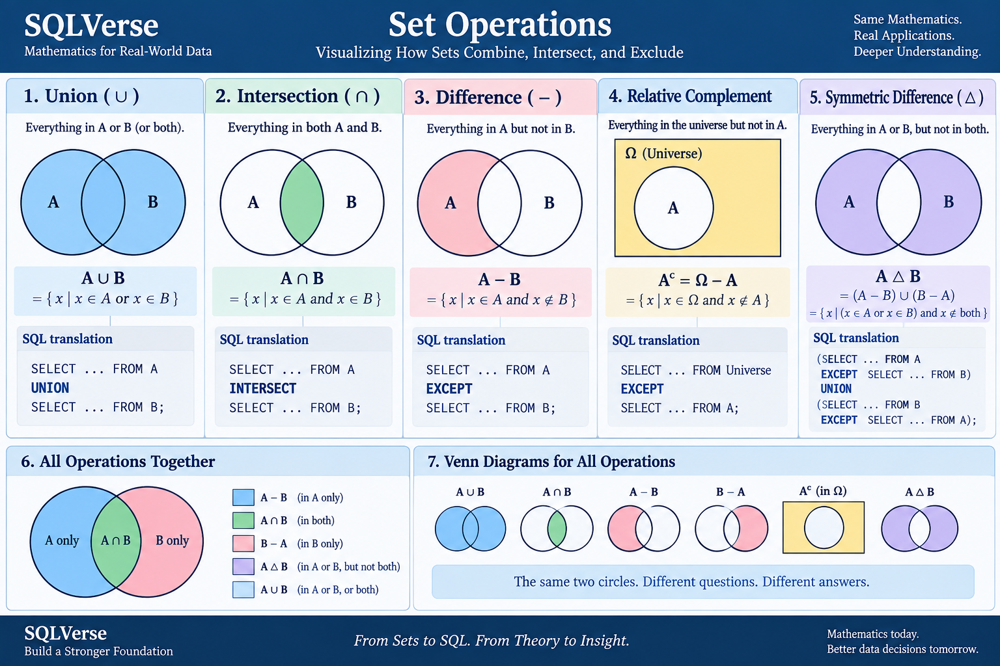
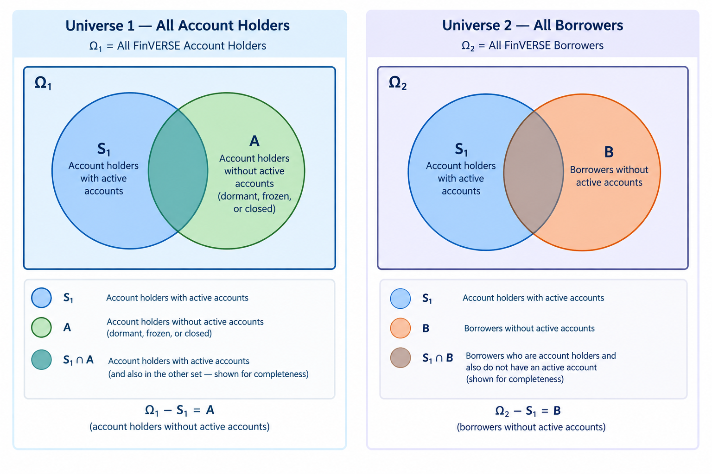
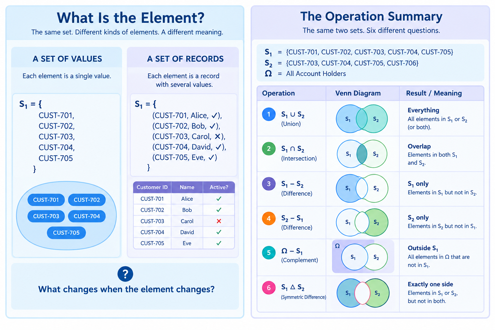

# 🗄️🤖 SQL & GenAI Course
**🎯 Quality Education for Anyone, Anywhere, Anytime — 💫 with Comfort, Convenience at no Cost**

---

# 03C — Mathematics Prerequisite

## Part 2 — Set Operations

**Sections:** §3.1 – §3.11

**Document Type:** Mathematical Prerequisite — Part 2 of 4  
**Version:** 1.0  
**Status:** FROZEN  
**Location:** `SQLVerse-Architects-Blueprint/01-GRAIN-FOUNDATIONS/03C-MATHEMATICS-PREREQUISITE/`  
**Governing Standard:** `SQLVERSE-ARCH-FW-001`

---

> **Every row has meaning.**
> **Every meaning has a law.**
> **Every law is based on mathematics.**

---

*This is Part 2 of the Mathematics Prerequisite. It continues from [`01-foundations.md`](01-foundations.md) — Part 1.*

*Part 1 established the vocabulary of sets, elements, membership, and subsets. Part 2 develops the vocabulary of set operations: how sets combine, intersect, exclude, and complement one another — and how those operations map to SQL, to identities, and to business investigations.*

*The numbering and conventions established in Part 1 continue throughout.*

---

### Notation carried forward

- `Ω` — the universe
- `S₁`, `S₂`, `S₃` — sample sets, each defined by a business rule
- `A`, `B` — generic sets, used for identities

---

## 3. Set Operations

### How Sets Combine, Intersect, and Exclude

Set operations allow us to combine, isolate, and compare collections of elements within a universe `Ω`.

The reader has already performed set operations — often without naming them. Every `UNION`, every `INTERSECT`, and every `EXCEPT` expresses a set-theoretic operation — even though SQL itself can operate under bag semantics in other contexts. This section gives those operations their mathematical names and their precise definitions.

Before we work through each operation, look at the landscape.

### 🧭 The Set Operations Map



**The same two circles. Different questions. Different answers.**

Each operation below zooms into one panel of that map.

---

## 3.1 Enter the Set Laboratory

We begin with a concrete universe.

```
Ω = All FinVERSE Customers
```
Three sets are drawn from that universe — each defined by a different business rule.

- **S₁ = Customers with Active Accounts**
- **S₂ = Customers with Loans**
- **S₃ = Customers with Credit Cards**

Therefore:

```
S₁ ⊆ Ω
S₂ ⊆ Ω
S₃ ⊆ Ω
```
>**Each set is a subset of `Ω`, containing the customers who satisfy its business rule. A subset is not just an abstract containment relationship — here, each business-defined customer population is a subset of the working universe `Ω`.**

For the demonstrations that follow, the sets are:

```
S₁ = {CUST-701, CUST-702, CUST-703, CUST-704, CUST-705}
S₂ = {CUST-703, CUST-704, CUST-705, CUST-706}
S₃ = {CUST-702, CUST-703, CUST-705, CUST-707}
```

The reader has met these customers before. `CUST-701` through `CUST-705` appeared in the Investigation IV dataset. `CUST-706` and `CUST-707` extend the universe slightly, so the sets overlap in ways that will make every operation meaningful.

For now, every element in these sets is a single value — an ID. The sets are collections of such elements.

Later in this file, we will ask a harder question about what an "element" can be. We will return to that question.

---

**SQL translation**

The universe and the three sets are each produced by a simple `SELECT`:

```sql
-- The universe
SELECT customer_id FROM customers;

-- S₁ — Customers with active accounts
SELECT DISTINCT customer_id FROM accounts WHERE status = 'Active';

-- S₂ — Customers with loans
SELECT DISTINCT customer_id FROM loans;

-- S₃ — Customers with credit cards
SELECT DISTINCT customer_id FROM cards;
```

Every set is a subset of `Ω`. For our set-theoretic demonstrations, each `SELECT DISTINCT` produces the corresponding set of customer IDs.

> We now have our universe, our sets, and their members.
> The question is no longer **what belongs to each set?**
> The question becomes:
>
> **What can we ask when two sets meet?**

The operations begin in §3.2.

---

## 3.2 Union

A union combines everything that belongs to **either** set.

```
S₁ ∪ S₂
```

Read: *"S₁ union S₂."*

The union contains every element that belongs to `S₁`, every element that belongs to `S₂`, and every element that belongs to both. An element that appears in both sets appears **only once** in the result — sets contain no duplicates.

---

### The question union answers

> *Which customers have an active account OR a loan — or both?*

---

### The calculation

```
S₁ = {CUST-701, CUST-702, CUST-703, CUST-704, CUST-705}
S₂ = {CUST-703, CUST-704, CUST-705, CUST-706}

S₁ ∪ S₂ = {CUST-701, CUST-702, CUST-703, CUST-704, CUST-705, CUST-706}
```

`CUST-703`, `CUST-704`, and `CUST-705` appear in both sets. They appear once in the union.

`CUST-701` and `CUST-702` belong only to `S₁`. `CUST-706` belongs only to `S₂`. All three appear in the union.

The union's cardinality: `|S₁ ∪ S₂| = 6`.

>**The symbol `|S|` denotes the cardinality — the number of distinct elements in set `S`.**

---

### SQL translation

```sql
SELECT customer_id
FROM accounts
WHERE status = 'Active'

UNION

SELECT customer_id FROM loans;
```

>*`UNION` performs duplicate elimination across the combined result. If a customer appears in both branches, they appear once in the final output. This matches the mathematical definition of union — sets contain no duplicates.*

The SQL `UNION` operator matches the mathematical union — **except** for one subtlety that is worth naming now.

SQL provides two variants:

```
UNION          — distinct values only (set semantics)
UNION ALL      — all values preserved (bag semantics)
```

`UNION` collapses duplicates. `UNION ALL` preserves them.

Mathematically, a set cannot contain duplicates. `A ∪ A = A` — unioning a set with itself changes nothing and demonstrates **idempotence**.

But SQL's `UNION ALL` can preserve repeated occurrences. This is because SQL operates on **bags** — multiset structures that permit duplicates. We will return to bags and their consequences in §8.

For the remainder of §3, we work with set semantics — `UNION` without `ALL`.

---

### Union across another universe

The same operation applies in every universe. In Hospital Planet:

```
H₁ = {John Smith, Emma Wilson, Michael Brown}   -- patients with appointments
H₂ = {Emma Wilson, Sarah Davis}                 -- patients with bills

H₁ ∪ H₂ = {John Smith, Emma Wilson, Michael Brown, Sarah Davis}
```

Same operation. Same mathematics. Different domain.

---

```
┌─────────────────────────────────────────────┐
│ 🔎 MATHEMATICAL DISCOVERY                   │
├─────────────────────────────────────────────┤
│                                             │
│  Union does not create new elements.        │
│                                             │
│  It combines membership from two sets       │
│  while preserving distinctness.             │
│                                             │
│  Every element in the result was already    │
│  an element of at least one of the          │
│  original sets.                             │
│                                             │
└─────────────────────────────────────────────┘
```
---
## 3.3 Intersection

An intersection keeps only what the two sets share.

```
S₁ ∩ S₂
```

Read: *"S₁ intersection S₂."*

The intersection contains every element that belongs to `S₁` **and** to `S₂`. An element that belongs to only one of the two sets is not included.

---

### The question intersection answers

> *Which customers have an active account AND a loan?*

---

### The calculation

```
S₁ = {CUST-701, CUST-702, CUST-703, CUST-704, CUST-705}
S₂ = {CUST-703, CUST-704, CUST-705, CUST-706}

S₁ ∩ S₂ = {CUST-703, CUST-704, CUST-705}
```

Three customers appear in both sets: `CUST-703`, `CUST-704`, and `CUST-705`. Every other element — `CUST-701`, `CUST-702`, `CUST-706` — belongs to only one of the two sets and is therefore excluded.

The intersection's cardinality: `|S₁ ∩ S₂| = 3`.

---

### SQL translation

```sql
SELECT customer_id
FROM accounts
WHERE status = 'Active'

INTERSECT

SELECT customer_id
FROM loans;
```

The SQL `INTERSECT` operator directly expresses the mathematical intersection. It returns only the rows that appear in **both** result sets.

Like `UNION`, `INTERSECT` performs duplicate elimination across the combined result. If a customer appears in both branches, they appear **once** in the output — matching the set-theoretic definition.

---

### A note on intersection and join

`INTERSECT` is not the only way to produce an intersection in SQL. A well-formed `INNER JOIN` — filtered by the join condition — can express the same result.

```sql
SELECT DISTINCT a.customer_id
FROM accounts a
INNER JOIN loans l ON a.customer_id = l.customer_id
WHERE a.status = 'Active';
```

The `DISTINCT` keyword is needed here because the join itself may produce duplicate rows — one for each matching pair of accounts and loans for the same customer. The intersection of the two sets is the **distinct projection** of that join result.

> **Primary-key uniqueness in the base `customers` table does not guarantee uniqueness of `customer_id` after a join.**

We will return to this relationship between `INTERSECT` and `INNER JOIN` in §7, where the joins-to-set-operations mapping is developed in full.

---
### Intersection across other universes

The same operation applies in every universe.

**E-Store:**

```
E₁ = {Alice Smith, Bob Johnson, Charlie Lee}   -- customers with orders
E₂ = {Bob Johnson, Charlie Lee, David Kim}     -- customers with reviews

E₁ ∩ E₂ = {Bob Johnson, Charlie Lee}
```

Two customers are both buyers and reviewers. The intersection identifies them.

**Real Estate Planet:**

```
RE₁ = {Property_001, Property_003, Property_007}   -- properties with viewings
RE₂ = {Property_003, Property_007, Property_011}   -- properties with offers

RE₁ ∩ RE₂ = {Property_003, Property_007}
```

Two properties have been both viewed and offered. The intersection identifies them.

E-Store's intersection was between customer activities; Real Estate's is between property activities. 

Same mathematics, different objects. 

**Intersection is domain-agnostic.**

---

```
┌─────────────────────────────────────────────┐
│ 🔎 MATHEMATICAL DISCOVERY                   │
├─────────────────────────────────────────────┤
│                                             │
│  Intersection does not create new elements. │
│                                             │
│  It identifies the elements that satisfy    │
│  membership in both sets simultaneously.    │
│                                             │
│  Every element in the result was already    │
│  an element of both original sets.          │
│                                             │
│  A ∩ A = A                                  │
│                                             │
└─────────────────────────────────────────────┘
```

Like union, intersection is **idempotent**. The same set intersected with itself returns the same set — for the same reason: sets do not contain duplicates.

---
#### Three operations. Two behaviors.

Three SQL set operations have just passed through this section — `UNION`, `INTERSECT`, and `UNION ALL`. Two of them behave one way. One behaves another.

| Operation | Duplicate behavior |
|-----------|-------------------|
| `UNION` | Removes duplicates |
| `INTERSECT` | Removes duplicates |
| `UNION ALL` | Preserves duplicates |

**What a curious contrast!**

The mathematics of sets is uniform. The SQL operations are not.

We will return to this in §8.

---

```
┌─────────────────────────────────────────────┐
│ 🎬 CURTAIN RAISER                           │
├─────────────────────────────────────────────┤
│                                             │
│  Intersection extends beyond two sets.      │
│                                             │
│  What if we want to find the customers      │
│  who appear in all three of our FinVERSE    │
│  sets — with an active account AND a loan   │
│  AND a credit card?                         │
│                                             │
│    S₁ ∩ S₂ ∩ S₃                             │
│                                             │
│  We will answer that question in §3.8.      │
│                                             │
└─────────────────────────────────────────────┘
```
---
## 3.4 Difference

A difference keeps what belongs to one set but not the other.

```
S₁ − S₂
```

Read: *"S₁ minus S₂."*

The difference contains every element that belongs to `S₁` **but not** to `S₂`. Elements that belong to `S₂` are removed — whether or not they also belong to `S₁`.

---

### The question difference answers

> *Which customers have an active account but no loan?*

---

### The calculation

```
S₁ = {CUST-701, CUST-702, CUST-703, CUST-704, CUST-705}
S₂ = {CUST-703, CUST-704, CUST-705, CUST-706}

S₁ − S₂ = {CUST-701, CUST-702}
```

Three customers — `CUST-703`, `CUST-704`, `CUST-705` — belong to both sets. They are removed from `S₁ − S₂`.

Only `CUST-701` and `CUST-702` remain. They belong exclusively to `S₁` not to `S₂`.

The difference's cardinality: `|S₁ − S₂| = 2`.

---

### The reverse — `S₂ − S₁`

The difference is **directional**. Reversing the two sets produces a different result.

```
S₂ − S₁ = {CUST-706}
```

`CUST-706` belongs to `S₂` but not to `S₁`. It is the only customer that survives the reverse.

```
S₁ − S₂ ≠ S₂ − S₁
```

This is worth pausing on. Union and intersection are **symmetric** — order does not matter. Difference is not. It answers a question **about one set relative to another**, and the answer depends on which set is which.

---

#### Difference is directional.

**Union** asks *"what belongs to either?"* — **a question with no direction.**
**Intersection** asks *"what belongs to both?"* — **a question with no direction.**
**Difference** asks *"what belongs to S₁ but not to S₂?"* — a question whose answer depends entirely on **which set is being subtracted from which.**

```
A ∪ B = B ∪ A
A ∩ B = B ∩ A

A − B ≠ B − A
```
**This is the first structural contrast in the section.**

---

### SQL translation

```sql
SELECT customer_id
FROM accounts
WHERE status = 'Active'

EXCEPT

SELECT customer_id
FROM loans;
```

The SQL `EXCEPT` operator matches the mathematical difference. It returns the rows that appear in the first result set but not in the second.

Like `UNION` and `INTERSECT`, `EXCEPT` performs duplicate elimination. The output contains only distinct rows from the first set that do not appear in the second.

---

### Difference across another universe

The same operation applies in every universe. In Real Estate Planet:

```
RE₁ = {Property_001, Property_003, Property_007, Property_009}   -- properties with viewings
RE₂ = {Property_003, Property_007}                                -- properties with offers

RE₁ − RE₂ = {Property_001, Property_009}
```

Two properties were viewed but never offered. The difference identifies them.

Reverse it:

```
RE₂ − RE₁ = ∅
```

Every property that received an offer was also viewed. The reverse difference is empty — and the emptiness itself is informative. It tells us that in this dataset, offers never happen without a prior viewing.

Same operation. Same mathematics. Different domain.

---

```
┌─────────────────────────────────────────────┐
│ 🔎 MATHEMATICAL DISCOVERY                   │
├─────────────────────────────────────────────┤
│                                             │
│  Difference is directional.                 │
│                                             │
│  It is the first set operation in this      │
│  section whose result depends on the        │
│  order of its operands.                     │
│                                             │
│  A − B ≠ B − A                              │
│                                             │
│  A − A = ∅                                  │
│                                             │
└─────────────────────────────────────────────┘
```
---

Look again at the elements that survived the difference. Each is a single value — a customer ID. The difference operation does not care what kind of value the element is; it operates according to membership.

What if an element were not a single value?

We will return to that question.

---
## 3.5 Relative Complement

 ### Choosing the working universe

 In §3.1, we established `Ω` as **All FinVERSE Customers**.

 For this particular business question, however, we want a narrower population: customers who hold or have held an account.

 **So, for this demonstration, we deliberately narrow the working universe:**

 ```text
 Ω = All FinVERSE Account Holders
 ```

**This choice is not a technical detail. It changes what the complement means.**

---

Difference subtracts one set from another. **Relative complement** subtracts a set from the universe itself.

```
Ω − S₁
```

Read: *"the universe minus S₁."*

The relative complement of `S₁` is the set of every element in `Ω` that does **not** belong to `S₁`.

---

### The question relative complement answers

> *Which account holders have no active account?*

---

### What "no active account" means

Before we compute the complement, we need to be precise about what the subset represents.

An account is not simply **open** or **closed**. Between those two states sit several others — each representing a different relationship between the customer and the bank.

>*Status terminology and transition rules can vary somewhat across banks and jurisdictions; the classifications below represent a common banking convention used for this demonstration.*

| Account status | Meaning |
|----------------|---------|
| **Active** | Transactions are permitted. The customer is using the account. |
| **Dormant** | No transactions for a defined period — commonly 2, 6, or 12 months. Transactions may be restricted until the customer re-engages. |
| **Frozen** | All transactions are prohibited. Typically after an investigation, KYC lapse, or regulatory hold. The account returns to active status only after the customer contacts the bank and the issue is resolved. |
| **Closed** | The account has been permanently terminated. |

**A customer with no active account is not a customer without an account.** They are a customer whose accounts have moved past active status.

- A **dormant** account is a waiting state.
- A **frozen** account is a restricted state.
- A **closed** account is a terminal state.

The customer remains a customer. The account remains an account. But the **state** has changed.

This is why the relative complement is meaningful. The complement does not remove customers from the universe — it identifies those whose accounts are not currently active.

---

### The calculation

```
Ω  = All FinVERSE Account Holders
S₁ = Account holders with Active Accounts

Ω − S₁ = Account holders without active accounts
        (their accounts are dormant, frozen, or closed)
```

We cannot write `Ω − S₁` as a literal list unless we know the full contents of `Ω`. This is the first time an operation's result depends on data we have not shown.

For the demonstration, we assume `Ω` contains `S₁` and a small number of additional account holders with non-active accounts:

```
Ω  = {CUST-701, CUST-702, CUST-703, CUST-704,
      CUST-705, CUST-706, CUST-707, CUST-708}
S₁ = {CUST-701, CUST-702, CUST-703, CUST-704, CUST-705}

Ω − S₁ = {CUST-706, CUST-707, CUST-708}
```

For this demonstration, we assume these three account holders have only non-active accounts — dormant, frozen, or closed.

The complement's cardinality: `|Ω − S₁| = 3`.

---

### What the complement answers in business

The complement identifies a business population the bank may care about: customers whose accounts are no longer active, whether because they are dormant, frozen, or closed. The same population can support operational, compliance, re-engagement, and reporting questions.

---

### SQL translation

```sql
SELECT customer_id FROM account_holders

EXCEPT

SELECT customer_id
FROM accounts
WHERE status = 'Active';
```

The first query returns the entire universe of account holder IDs. The second returns those with active accounts. `EXCEPT` removes the second set from the first.

The result is the set of account holders whose accounts are not currently active.

---

### The universe is not neutral

Every complement depends on the universe against which it is taken. Change the universe, and the complement can change with it.

Take the same set `S₁` — account holders with active accounts.

**Universe 1 — All Account Holders:**

```text
Ω₁ = All Account Holders

Ω₁ − S₁ = account holders without active accounts
         (dormant, frozen, or closed)
```

**Universe 2 — All Borrowers:**

```text
Ω₂ = All Borrowers

Ω₂ − S₁ = borrowers who do not have an active account
```


> *The same subset. Two universes. Different complements.*

The two universes are genuinely distinct business populations. Some customers may belong to both populations; others may belong to only one.

The same `S₁` is being considered against two different declared universes. Therefore, the business meaning of the complement changes with the universe.

In `Ω₁`, the complement identifies **account holders without active accounts**.

In `Ω₂`, the complement identifies **borrowers without active accounts**.

```text
Ω₁ − S₁  can differ from  Ω₂ − S₁
```

The important point is not which population is larger or whether one contains the other. The important point is that **the declared universe determines who is eligible to appear in the complement**.

This matters to the business as well. The first complement answers an account-management question:

> Which account holders are not currently active?

The second can answer a risk-oriented question:

> Which borrowers do not currently have an active account?

A borrower with an outstanding loan but no active account may represent a population that a collections or risk team wants to investigate further.

A complement has no meaning without a declared universe.

**The universe is not neutral — it is a choice.**

---

#### The universe is not neutral.

Union and intersection do not depend on the universe.
Difference depends on the direction of subtraction.
Complement depends on the **scope** of the universe against which it is taken.

```
A ∪ B      — no universe required
A ∩ B      — no universe required
A − B      — two sets required
Ω − A      — a universe required
```

The relative complement is the first operation in this section that **requires an explicitly declared universe** to produce a meaningful answer.

---

### Relative complement across another universe

The same operation applies in every universe. In Hospital Planet:

```
Ω  = All Patients Currently Admitted
H₁ = {John Smith, Emma Wilson}   -- patients who have been seen by a doctor

Ω − H₁ = patients admitted but not yet seen
```

The complement identifies the gap between admission and consultation — a real operational metric for hospital flow.

Reverse it in a different universe:

```
Ω  = All Patients Registered
H₁ = {John Smith, Emma Wilson, Michael Brown}   -- patients with appointments

Ω − H₁ = registered patients who have not been seen
```

Same operation. Different universe. Different meaning.

---

```
┌─────────────────────────────────────────────┐
│ 🔎 MATHEMATICAL DISCOVERY                   │
├─────────────────────────────────────────────┤
│                                             │
│  A complement is always relative.           │
│                                             │
│  The result depends on the universe         │
│  against which the complement is taken.     │
│                                             │
│  Ω₁ − A  need not equal  Ω₂ − A,            │
│  even when A is the same set.               │
│                                             │
│  The universe is not a convenience —        │
│  it is part of the operation.               │
│                                             │
└─────────────────────────────────────────────┘
```

---

Look again at the universe we declared. Every element in it is a single value — a customer ID.

The universe itself is a set of values.

Later in this file, we will ask what happens when the universe is not a set of values, but a set of something else.

We will return to that question.

---
## 3.6 Symmetric Difference

Symmetric difference keeps what belongs to **exactly one** of the two sets.

```
S₁ △ S₂
```

Read: *"S₁ symmetric difference S₂."*

The symmetric difference contains every element that belongs to `S₁` or to `S₂`, but **not** to both. Elements shared by the two sets are removed; elements unique to either set are kept.

---

### The question symmetric difference answers

> *Which customers have an active account or a loan, but not both?*

---

### The calculation

```
S₁ = {CUST-701, CUST-702, CUST-703, CUST-704, CUST-705}
S₂ = {CUST-703, CUST-704, CUST-705, CUST-706}

S₁ △ S₂ = {CUST-701, CUST-702, CUST-706}
```

Three customers — `CUST-703`, `CUST-704`, `CUST-705` — belong to both sets. They are removed.

Three customers remain: `CUST-701` and `CUST-702` belong only to `S₁`; `CUST-706` belongs only to `S₂`.

The symmetric difference's cardinality: `|S₁ △ S₂| = 3`.

---

### The composition demo

Symmetric difference is not a primitive operation. It can be built from operations the reader already knows.

The elements unique to `S₁` are `S₁ − S₂`. The elements unique to `S₂` are `S₂ − S₁`. Their union is the symmetric difference.

```
S₁ △ S₂ = (S₁ − S₂) ∪ (S₂ − S₁)
```

Check against the sets:

```
S₁ − S₂ = {CUST-701, CUST-702}
S₂ − S₁ = {CUST-706}

(S₁ − S₂) ∪ (S₂ − S₁) = {CUST-701, CUST-702, CUST-706}
```

The result matches `S₁ △ S₂`. The operation is not new — it is a **composition** of two operations the reader has already met.

There is a second equivalent form:

```
S₁ △ S₂ = (S₁ ∪ S₂) − (S₁ ∩ S₂)
```

The union of the two sets minus their intersection. The composition reveals the same result through a different path.

```
S₁ ∪ S₂ = {CUST-701, CUST-702, CUST-703, CUST-704, CUST-705, CUST-706}
S₁ ∩ S₂ = {CUST-703, CUST-704, CUST-705}

(S₁ ∪ S₂) − (S₁ ∩ S₂) = {CUST-701, CUST-702, CUST-706}
```

Same result. Two compositions. Same operation.

---

### SQL translation

SQL does not provide a native `SYMMETRIC DIFFERENCE` operator. But the operation can be expressed by composing the operators SQL does provide.

```sql
(SELECT customer_id
 FROM accounts
 WHERE status = 'Active'
 EXCEPT
 SELECT customer_id FROM loans)

UNION

(SELECT customer_id
 FROM loans
 EXCEPT
 SELECT customer_id
 FROM accounts
 WHERE status = 'Active');
```

The first `EXCEPT` produces `S₁ − S₂`. The second produces `S₂ − S₁`. The `UNION` combines them.

This is the SQL form of the composition identity:

```
S₁ △ S₂ = (S₁ − S₂) ∪ (S₂ − S₁)
```

---

### Symmetric difference across another universe

The same operation applies in every universe. In E-Store:

```
E₁ = {Alice Smith, Bob Johnson, Charlie Lee}     -- customers with orders
E₂ = {Bob Johnson, Charlie Lee, David Kim}       -- customers with reviews

E₁ △ E₂ = {Alice Smith, David Kim}
```

Two customers have **one** interaction with the store but not both. Alice places orders but does not review; David reviews but does not order.

The symmetric difference identifies the customers who interact with the store through **exactly one channel** — a natural population for a targeted re-engagement campaign.

Same operation. Same mathematics. Different domain.

---

```
┌─────────────────────────────────────────────┐
│ 🔎 MATHEMATICAL DISCOVERY                   │
├─────────────────────────────────────────────┤
│                                             │
│  Symmetric difference is a composition,     │
│  not a primitive operation.                 │
│                                             │
│  It can be built from difference and        │
│  union:                                     │
│                                             │
│    A △ B = (A − B) ∪ (B − A)                │
│                                             │
│  Or equivalently:                           │
│                                             │
│    A △ B = (A ∪ B) − (A ∩ B)                │
│                                             │
│  The same result, reached from two          │
│  different compositions.                    │
│                                             │
└─────────────────────────────────────────────┘
```
---

Look again at the sets in this section.

```
S₁ = {CUST-701, CUST-702, CUST-703, CUST-704, CUST-705}
```

Each element is a single value — a customer ID.

But a customer is not only an ID. A customer has a name, a status, a KYC verification date, perhaps a phone number, an email. All of these belong to the same customer.

What would happen if we put a customer's full record into a set, rather than just the customer's ID?

What would intersection mean then?

We will return to that question.

---

## 3.7 The Venn Diagram Laboratory

The six operations are behind us. This section views them together.

Return to the Set Operations Map at the start of this section.

```
┌─────────────────────────────────────────────┐
│ 🧭 REFERENCE — THE SET OPERATIONS MAP       │
├─────────────────────────────────────────────┤
│                                             │
│   See the master diagram at the top of §3.  │
│                                             │
│   The same two circles.                     │
│   Six operations.                          │
│   The question changes — not the sets.      │
│                                             │
└─────────────────────────────────────────────┘
```

The map showed each operation in isolation. Here, we view the same two sets under every operation, side by side.

---

### 📊 The Set Operations Laboratory



> *The same set. Different kinds of elements. A different meaning.*
> *The same two sets. Six different questions.*

The laboratory uses the same FinVERSE sets from §3.1.

```
S₁ = {CUST-701, CUST-702, CUST-703, CUST-704, CUST-705}
S₂ = {CUST-703, CUST-704, CUST-705, CUST-706}
Ω  = All Account Holders
```

The **right panel** shows all six operations applied to these sets. Every operation produces a different result — not because the sets change, but because the question changes. Each row corresponds to one operation the reader has already met. The set operations do not compete — they are **different ways of asking the same two sets what they contain**.

The **left panel** shows two ways of constructing a set from the same customer population. On the left, the elements are single values — customer IDs. On the right, the elements are records carrying several values, including a customer ID, a name, and an account status.

The underlying customer population is familiar. But the elements placed into the set are no longer the same kind of mathematical object.

---

### What the laboratory reveals

Three observations emerge from seeing the operations together.

**First — the operations partition the space.** For any two sets, every element belongs to exactly one of four regions:

- In `S₁` but not `S₂`
- In `S₂` but not `S₁`
- In both
- In neither

The operations we have studied select different combinations of those regions. Union takes everything except the outside. Intersection takes only the overlap. Difference takes one side. Symmetric difference takes both sides but not the overlap.

**Second — the operations are not isolated.** Difference and union, combined, produce symmetric difference. Complement, combined with union or intersection, produces the De Morgan transformations we will see in §3.8. The operations **compose**, and their compositions are mathematically lawful.

**Third — the operations are not domain-specific.** The same mathematics applied to customer IDs applies to property IDs, patient names, and product codes. The domain changes; the operations do not.

---

### A quiet glimpse

Look once more at the left panel.

What would intersection mean if the elements were records instead of values? What would difference mean? What would union mean?

We will return to that question.

---
## 3.8 Set Identities

The operations do not act randomly. They obey rules — consistent, provable, and reusable. This section names them.

Each identity below holds for **any** sets `A`, `B`, and `C` drawn from a universe `Ω`. The identities are not about specific customer sets or specific FinVERSE data. They are about the operations themselves.

---

### Commutativity

Union and intersection are **order-independent**.

```
A ∪ B = B ∪ A
A ∩ B = B ∩ A
```

The order in which the two sets are presented does not affect the result.

Difference is directional, not commutative.

```
A − B ≠ B − A
```
---

### Associativity

When three or more sets are combined, the **grouping** does not matter.

```
(A ∪ B) ∪ C = A ∪ (B ∪ C)
(A ∩ B) ∩ C = A ∩ (B ∩ C)
```

These identities explain why repeated mathematical union or intersection can be regrouped without changing the set result. Mathematically, the result is the same either way.

SQL syntax introduces its own precedence and duplicate-handling rules, so parentheses may still be important when expressing the intended query.

**Mathematics is theory;  SQL is implementation; There will always be a variation.**

---

### Distributivity

Union and intersection **distribute** over each other.

```
A ∪ (B ∩ C) = (A ∪ B) ∩ (A ∪ C)
A ∩ (B ∪ C) = (A ∩ B) ∪ (A ∩ C)
```

The first says: *"everything in A, plus the overlap of B and C"* equals *"the overlap of A-with-B and A-with-C."* The second is its dual.

These identities show that equivalent set expressions can sometimes be rewritten into different but mathematically equivalent forms.

---

### Idempotence

Applying an operation to a set that is already the result changes nothing.

```
A ∪ A = A
A ∩ A = A
```

Unioning a set with itself returns the set. Intersecting a set with itself returns the set. Sets contain no duplicates — so the repeated occurrence is not preserved.

This is where **set semantics** begins to differ from **bag semantics**. Under bag semantics, `A ∪ A` may not equal `A` — because bags permit duplicates. We will return to this in §8.

---

### Self-difference

A set subtracted from itself is empty.

```
A − A = ∅
```

The symbol `∅` denotes the **empty set** — the set containing no elements. Nothing in `A` can be in `A` but not in `A`.

---

### De Morgan's Laws

Complement flips unions into intersections and intersections into unions.

```
Ω − (A ∪ B) = (Ω − A) ∩ (Ω − B)
Ω − (A ∩ B) = (Ω − A) ∪ (Ω − B)
```

The first says: *"what is outside the union of A and B"* equals *"what is outside A **and** outside B."* The second says: *"what is outside the intersection of A and B"* equals *"what is outside A **or** outside B."*

The two laws express the same idea from opposite directions: **negation distributes across the binary operators, exchanging `∪` for `∩` and `∩` for `∪`.**

---


Every reader has met De Morgan's Laws already — without knowing it.

De Morgan's Laws also provide the mathematical foundation for familiar Boolean rewrites in SQL predicates.

```
┌─────────────────────────────────────────────┐
│ 🔎 MATHEMATICAL DISCOVERY                   │
├─────────────────────────────────────────────┤
│                                             │
│  De Morgan's Laws explain the Boolean       │
│  transformation behind familiar SQL         │
│  predicate rewrites:                        │
│                                             │
│  NOT (status='Active' OR status='Pending')  │
│                 ≡                           │
│  status != 'Active' AND status != 'Pending' │
│                                             │
│  The rewrite is not a SQL convention.       │
│  It is a consequence of a mathematical law. │
│                                             │
└─────────────────────────────────────────────┘
```

*The equivalence above holds when the values involved are not NULL. SQL's handling of NULL introduces a three-valued logic in which the classical form of De Morgan's Laws must be qualified. We do not develop that here; §8 introduces the broader SQL/set-theory distinction. For the remainder of this section, we treat all values as non-NULL.*

---

### The identity catalog

The identities are not many. They form a small, reusable catalog of laws that govern these operations.

| Identity | Statement |
|----------|-----------|
| Commutativity | `A ∪ B = B ∪ A`  ·  `A ∩ B = B ∩ A` |
| Associativity | `(A ∪ B) ∪ C = A ∪ (B ∪ C)`  ·  `(A ∩ B) ∩ C = A ∩ (B ∩ C)` |
| Distributivity | `A ∪ (B ∩ C) = (A ∪ B) ∩ (A ∪ C)`  ·  `A ∩ (B ∪ C) = (A ∩ B) ∪ (A ∩ C)` |
| Idempotence | `A ∪ A = A`  ·  `A ∩ A = A` |
| Self-difference | `A − A = ∅` |
| De Morgan's Laws | `Ω − (A ∪ B) = (Ω − A) ∩ (Ω − B)`  ·  `Ω − (A ∩ B) = (Ω − A) ∪ (Ω − B)` |

Each identity describes how the operations behave **regardless of what the sets contain**.

Whether the elements are customer IDs, product codes, patient names, or property types — the operations obey the same laws. The identities are properties of the operations, not of the data.

---

The identities hold for any set of elements. Customer IDs, property IDs, values, names — the laws do not care.

But what happens to these laws when the elements become **records**?

If two records share the same `customer_id` but differ in another field — are they equal? Does `A ∪ A` still equal `A`?

What does `A − A = ∅` mean when elements carry structure?

We will return to that question.

---
## 3.9 SQLVerse Translation

The mathematics is now complete. Every set operation has a name, a definition, and a place in the family. The identities have been catalogued. The laboratory has shown them together.

This section returns to SQL — not to teach SQL, but to name what SQL has been doing all along.

---

### The translation table

| Mathematics | SQL / relational interpretation |
|-------------|--------------------------------|
| Set | A collection of distinct values |
| Element | A single value, as in `CUST-701` |
| Membership (`∈`) | `WHERE column = value`, `IN` |
| Subset (`⊆`) | Containment between two query results |
| Union (`∪`) | `UNION` |
| Intersection (`∩`) | `INTERSECT` |
| Difference (`−`) | `EXCEPT` |
| Relative complement (`Ω − A`) | `EXCEPT` with the universe as the first set |
| Symmetric difference (`△`) | Constructed from `EXCEPT` and `UNION` |

Every row of the table names a mathematical concept the reader has met in this file — and its SQL representation.

*(What an element can be — beyond a single value — is a question we will return to later in this file.)*


---

### The correspondence is conceptual, not literal

The translation is a **map**, not an identity.

- A mathematical set contains **no duplicates**. A SQL table may contain duplicates unless a key constraint forbids them.
- A mathematical complement is well-defined relative to a universe. A SQL `EXCEPT` is well-defined only if the first query's result is exactly the universe.
- A mathematical union is deterministic. A SQL `UNION` and `UNION ALL` produce different results.

The mathematics describes the **ideal** form. SQL often operates with **bag semantics**, permitting duplicates where the mathematics does not.

We will return to this distinction in §8.

---

### What the translation reveals

Three observations.

**First — the operations were always mathematical.** `UNION`, `INTERSECT`, `EXCEPT` — every reader has written them. Very few have seen them as set operations. The translation names what was already being done.

**Second — SQL is a language, not a mathematics.** SQL expresses set operations; it does not define them. The mathematics exists independently, and SQL provides one implementation. Other languages express the same operations differently.

**Third — the mapping runs both ways.** The mathematics helps the reader understand SQL. The SQL helps the reader recognize the mathematics. Each illuminates the other.

---

### The reader's position

The reader has now seen:

- Sets and membership (§1)
- Subsets (§2)
- Set operations (§3.1–§3.6)
- The visual laboratory (§3.7)
- The identities (§3.8)
- The SQL translation (§3.9)

The reader has walked the full landscape of classical set theory as it appears inside a relational database.

But one question remains open. It has been open since §3.1.

Every set the reader has worked with has contained **single values** — customer IDs, property IDs, patient names, product codes. Every operation applied to those values has behaved as expected.

What happens when the elements of a set are **not** single values?

We will return to that question in the sections ahead.

---
## 3.10 The Business Investigation

The operations have been taught. The identities have been catalogued. The translation has been named.

This section does not teach a new operation. It uses the operations the reader already knows — composed, in service of a real question.

---

### The scenario

The Chief Risk Officer of FinVERSE has a concern.

The bank has three populations of customers:

- Customers with **active accounts**
- Customers with **loans**
- Customers with **credit cards**

The Risk team wants to know three things:

1. **Which customers have at least one product with the bank?** — an engagement question.
2. **Which customers have a loan but no active account?** — a risk question.
3. **Which customers have exactly one product?** — a re-engagement question.

Each question is a set operation — or a composition of set operations — the reader has already met.

---

### The sets

The three FinVERSE sets — as declared in §3.1:

```
S₁ = {CUST-701, CUST-702, CUST-703, CUST-704, CUST-705}   -- active accounts
S₂ = {CUST-703, CUST-704, CUST-705, CUST-706}             -- loans
S₃ = {CUST-702, CUST-703, CUST-705, CUST-707}             -- credit cards
```

---

### Question 1 — Which customers have at least one product?

The Risk Officer wants to know the total engaged population — everyone who has any product with the bank.

```
S₁ ∪ S₂ ∪ S₃
```

The union of all three sets.

```
S₁ ∪ S₂ = {CUST-701, CUST-702, CUST-703, CUST-704, CUST-705, CUST-706}
S₁ ∪ S₂ ∪ S₃ = {CUST-701, CUST-702, CUST-703, CUST-704, CUST-705, CUST-706, CUST-707}
```

Seven customers have at least one of these three FinVERSE products.

**SQL translation**

```sql
(SELECT customer_id FROM accounts WHERE status = 'Active')
UNION
(SELECT customer_id FROM loans)
UNION
(SELECT customer_id FROM cards);
```

---

### Question 2 — Which customers have a loan but no active account?

This is the risk question. A customer with a loan but no active account is a population the Risk team may want to investigate — the bank has exposure, but the customer's transactional presence is limited.

```
S₂ − S₁
```

The difference of `S₂` minus `S₁`.

```
S₂ − S₁ = {CUST-706}
```

One customer — `CUST-706` — has a loan but no active account.

The set operation establishes **membership**. The business interpretation — *is this a risk?* — is a separate matter. The Risk team may treat this population as a signal requiring further investigation.

**SQL translation**

```sql
(SELECT customer_id FROM loans)
EXCEPT
(SELECT customer_id FROM accounts WHERE status = 'Active');
```

---

### Question 3 — Which customers have exactly one product?

This is the re-engagement question.

The Risk Officer first tries the symmetric difference.

```
S₂ △ S₃
```

That answer — customers with a loan or a credit card, but not both — is **not** the same as customers with exactly one product across all three populations. A customer with a loan and an active account is a two-product customer, but they are not in `S₂ △ S₃` if they have no credit card.

**Symmetric difference works for two populations. The business question involves three.**

The single operation is insufficient. Composition is required.

A customer with exactly one product is a customer who appears in the union of all three sets **but does not appear in any pairwise intersection**.

```
Exactly one = (S₁ ∪ S₂ ∪ S₃)
            − [(S₁ ∩ S₂) ∪ (S₁ ∩ S₃) ∪ (S₂ ∩ S₃)]
```

Compute each part:

```
S₁ ∪ S₂ ∪ S₃ = {CUST-701, CUST-702, CUST-703, CUST-704, CUST-705, CUST-706, CUST-707}

S₁ ∩ S₂ = {CUST-703, CUST-704, CUST-705}
S₁ ∩ S₃ = {CUST-702, CUST-703, CUST-705}
S₂ ∩ S₃ = {CUST-703, CUST-705}

Pairwise overlaps = {CUST-702, CUST-703, CUST-704, CUST-705}

Exactly one = {CUST-701, CUST-706, CUST-707}
```

Three customers hold exactly one FinVERSE product.

**SQL translation**

The full multi-branch SQL for *"Exactly One Product"* is not shown here. The purpose of this section is to make the **mathematical composition** visible before translating it into SQL.

*(The complete multi-branch SQL query for "Exactly One Product" is explored as a guided exercise in the Module 4 Lab.)*

---

### What the investigation reveals

The Risk Officer's questions were not mathematics. They were business questions.

Each was answered by composing set operations the reader already knew.

- *"Who is engaged?"* — Union
- *"Who is a risk?"* — Difference
- *"Who is exactly one product deep?"* — Union, Intersection, and Difference, composed

The operations did not need to change. The questions did.

This is what the file has been building toward — not the ability to name operations, but the ability to **compose** them into **answers**.

> **The mathematics has stopped being the subject. It has become the language of the investigation.**

---

### The business population, viewed four ways

The three questions, viewed together, reveal a business population stratified by product count.

| Product count | Customers |
|---------------|-----------|
| **3 products** | CUST-703, CUST-705 |
| **2 products** | CUST-702, CUST-704 |
| **1 product** | CUST-701, CUST-706, CUST-707 |
| **0 products** | Not determinable from these three sets alone |

**The last row matters.** 

- The zero-product population **cannot be inferred** from `S₁`, `S₂`, and `S₃` — because those sets only tell us who has products. 
- To find the customers who hold **no product**, we would need to declare a **customer universe** and take its complement.
- That boils down to creating a Universe of **customers of other banks** which does not make business sense.
- The Business only cares about **its own customers** — not the competitor's customers.

The 0-products row is **mathematically possible** — the empty set is a legitimate mathematical object. But it is not a **business object** in FinVERSE.

A person with zero FinVERSE products is not a FinVERSE customer. They therefore do not belong to the FinVERSE customer universe represented by the database. They are outside the scope of this investigation.

### The deeper discipline

 A mathematical object does not always have real-world relevance.

 **Takeaway:** Mathematics describes the structure; business determines what is real.  The **empty set** has no value in the database.

---

### The operation composition

The three questions together reveal something important about the operations themselves.

**Question 1** was a single operation: Union.

**Question 2** was a single operation: Difference.

**Question 3** was a **composition**: Union, Intersection, Difference — combined.

The complexity of the answer depends on the complexity of the question. Some questions map directly to one operation. Others require a sequence.

Composition is where set theory becomes **analytical thinking**.

---
## 3.11 The Element Reconsidered

The section began with sets. It ends with a question.

Every set the reader has worked with has contained **single values** — customer IDs, property IDs, patient names, product codes. Every operation applied to those values has behaved as expected. Every identity has held. Every SQL correspondence has landed.

But the elements were always simple. A `CUST-701` is one thing. A `Property_003` is one thing. A `'Condo'` is one thing.

What if an element were not one thing?

---

Look again at the sets from the laboratory.

```
S₁ = {CUST-701, CUST-702, CUST-703, CUST-704, CUST-705}
```

Each element is a single value. This is what set theory has assumed throughout — every element is atomic.

Now consider what a customer actually is.

A customer is not only an ID. A customer has a name, a status, a KYC verification date, a phone number, an email. All of these belong to the same customer.

```
(CUST-701, Alice, Active)
```

The parentheses hold three values. They belong together. They describe one customer.

Is this a single element? Or is it three elements bound together?

---

A SQL table stores rows.

```
| customer_id | name  | status |
|-------------|-------|--------|
| CUST-701    | Alice | Active |
| CUST-702    | Bob   | Active |
```

Each row carries several values. Each row belongs to one customer. The reader has been writing queries against tables like this since the first `SELECT`.

**A row is not a single value.** It is a structured collection of values — ordered, cohesive, and treated as a unit.

The mathematics the reader has learned in this section has been about sets of **values**.

The mathematics introduced in this section has worked with sets whose elements were single values. But relational theory asks us to consider a richer kind of element: a structured collection of values.

---

### The question

The gap between "sets of values" and "sets of rows" is not a technicality. It is the foundation of the relational model.

- What **is** a row mathematically?
- Is it a single element, or a collection?
- If a set contains rows, does union still work the same way?
- Does intersection? Does difference?
- What does `A − A = ∅` mean when the elements have internal structure?

None of these questions were answerable in the vocabulary the reader had before §3. Every operation has so far been demonstrated with simple, single-value elements.

The relational model operates on something richer.

---

### Where we are

The reader has:

- Learned the mathematical vocabulary of sets (§1)
- Understood subsets and their constraints (§2)
- Mastered the five set operations (§3.1–§3.6)
- Seen them together (§3.7)
- Discovered their identities (§3.8)
- Translated them to SQL (§3.9)
- Applied them to a business investigation (§3.10)

The vocabulary is complete.

But the vocabulary describes operations on **values** — and the database operates on **rows**.

The reader has been doing relational mathematics since the first `SELECT`. What the reader has not yet had is the **vocabulary for what a row actually is**.

That vocabulary comes next.

---

### The bookend

Section 1 closed with a line:

> *"The reader has been using sets since the first `SELECT`. The word is new. The concept is not."*

That was true — then.

The reader had been using sets without knowing the word. The vocabulary of §1 gave them the name.

But the vocabulary of §3 has revealed how deep that vocabulary goes. The operations, the identities, the translations — they were always there. The reader was using them, without the mathematics.

The next section begins with the question that has been open since §3.1.

**What is an element?**

More precisely — what is an element when the element is not a single value, but something a database actually stores?

The answer is a **tuple** — and in a relational database, a tuple has another name: a **row**. 

**What a tuple is, precisely, is the subject of the sections that follow.**

---

*Part of our mission for 🎯 Quality Education for Anyone, Anywhere, Anytime — 💫 with Comfort, Convenience at no Cost.*

**SQLVerse | Architecture | Mathematics Prerequisite | Part 2 — Set Operations | Next: [Part 3 — Tuples and Relations →](03-tuples-relations.md)**
