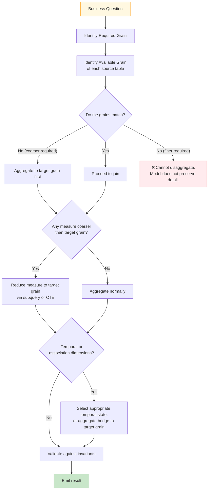

# 🗄️🤖 SQL & GenAI Course
**🎯 Quality Education for Anyone, Anywhere, Anytime — 💫 with Comfort, Convenience at no Cost**

---

# 03C — Grain + Joins: Mathematics

## The Mathematical Extraction Layer of the Grain Triad

**Document Type:** Grain Foundations — Part 3C  
**Version:** 1.0  
**Status:** FROZEN  
**Domain:** FinVERSE / ACQUIRE Banking Core  
**Level:** Production Skills & Mathematical Execution Principles  
**Location:** `SQLVerse-Architects-Blueprint/01-GRAIN-FOUNDATIONS/`  
**Governing Standard:** `SQLVERSE-ARCH-FW-001`

---

> **Every row has meaning.**
> **Every meaning has a law.**
> **Every law is based on mathematics.**

---

> **SQLVerse Acknowledgment**
>
> SQLVerse recognises the foundational contributions of mathematicians and logicians whose work underpins relational databases — Codd, Date, Codd's theorem, relational algebra. Every query you write stands on their shoulders.

---

## 🔗 From the Architect's Blueprint

You have spent the previous investigations watching rows multiply, measures replicate, associations create new grains, and time change the meaning of facts.

You have seen a single account's balance counted ten times. You have seen a customer's credit limit replicated across association paths. You have seen sequential snapshots summed into a number no business ever owned.

Each investigation left you with a lesson. Each lesson left you with a question.

**Now step away from the SQL.**

The next pages ask a different kind of question:

> **What mathematical structures are hiding underneath these behaviors?**

The investigations were never accidental. They were never bugs. They were never "tricky edge cases."

They were the **visible surface of a mathematical structure** that has been quietly operating underneath every row, every join, and every aggregation you have ever written.

03C is where we bring that structure into the light.

---

## 📌 Purpose

This is the final document of the Grain Triad.

It does not introduce new investigations.
It does not propose new schema evolutions.
It does not add new SQL techniques.

**It extracts the mathematics that was always there.**

By the end of this document, you will have moved through:

```
OBSERVATION
    ↓
QUESTION
    ↓
ABSTRACTION
    ↓
MATHEMATICAL MODEL
    ↓
TEST
    ↓
INVARIANT
    ↓
PATTERN
    ↓
ARCHITECTURAL PRINCIPLE
```

This is the journey. This is the mission.

**03C discovers the mathematics hiding behind every grain and join.**

---

## 🔬 Part 1 — The Five Investigations Revisited

Before we introduce notation, let us return to what we actually saw.

Each investigation is not summarized. Each is **revisited** — as a journey you have already walked, now seen from a higher elevation.

---

### 1.1 — The Silent Ambiguity (Investigation I)

A business team said: *"Every customer has exactly one credit card."*

The schema agreed. Or seemed to.

A query joined Customers to CreditCards. The rows multiplied without warning. A customer who "should" have had one card suddenly appeared three times. The credit limit was summed three times. The number was wrong — and nothing in the SQL had complained.

**The Surprise:** *The schema permitted what the business claim forbade.*

**The Question:** *What mathematical property makes one relationship safe and another dangerous?*

**The Discovery:** *The business statement expresses a cardinality claim. The schema must provide structural constraints that enforce that claim. Cardinality is therefore both a business relationship property and a mathematical/structural property.*

**Forward Link:** If cardinality is mathematical, what happens when cardinality itself is *multiple*?

---

### 1.2 — The Parent's Echo (Investigation II)

A customer had one credit limit and three loans. When the customer's row was joined to their loans, the credit limit was repeated — three times in the intermediate row set. `GROUP BY` hid the repetition. The result *looked* fine. The number was fine.

But the echo was still there. Waiting.

The moment a second detail table joined the query, the echo multiplied. The credit limit was no longer repeated three times — it was repeated fifteen.

**The Surprise:** *A measure can be correct in one query and catastrophically wrong in the next — without changing.*

**The Question:** *What determines whether a measure survives a join?*

**The Discovery:** *A measure carries its own grain. When that grain is coarser than the joined row set, the measure is replicated.*

**Forward Link:** If one branch can echo, what happens when two branches echo *at the same time*?

---

### 1.3 — The Multiplier (Investigation III)

One account. Two debit cards. Five transactions. Ten joined rows.

The balance was $10,000. The observed sum was $100,000.

The database had done nothing wrong. It had faithfully executed the arithmetic it was told to perform. It had done exactly what the analyst had asked.

**The Surprise:** *The error happened before the arithmetic. The SQL was correct. The result was not.*

**The Question:** *How do independent multiplicities combine?*

**The Discovery:** *When two independent 1:N branches meet at the same anchor and their matching multiplicities combine independently in the joined row set, their multiplicities compose multiplicatively. `2 × 5 = 10`. The row set did not grow linearly. It grew as a product.*

**Forward Link:** If two branches multiply, what happens when the relationship itself has an identity — a bridge with its own grain?

---

### 1.4 — The Bridge (Investigation IV)

A customer appeared once. A loan appeared once. But between them sat a `LoanApplications` row — an association. That association was neither the customer nor the loan. It was the **relationship** — and it had its own grain.

The customer's credit limit was repeated across every association path. The loan's amount was observed once per association. A fact about the customer had become an observation *through* the bridge.

**The Surprise:** *The bridge table is not merely a connector. The bridge represents an association with its own grain. When that association carries business attributes, it can also constitute a distinct business entity.*

**The Question:** *What is being counted when a measure is observed through a relational path?*

**The Discovery:** *A measure observed through a relationship is conditioned by the paths through which that measure is reached. The association grain introduces its own observation multiplicity.*

**Forward Link:** We have examined structure. But facts also exist in **time** — and time, too, has a grain.

---

### 1.5 — The Time-Warp (Investigation V)

An account had three states across June:

```
June 1   → $11,500
June 15  → $11,800
June 30  → $12,000
```

A query asked for "the June balance." It summed. It returned $35,300.

The database had done nothing wrong. It had added the numbers correctly. But the numbers were **states**, not **flows**. They were never meant to be added.

**The Surprise:** *A measure that is correct in one temporal context can be meaningless in another — without changing.*

**The Question:** *What happens when time becomes part of the grain?*

**The Discovery:** *Temporal grain does not imply arithmetic aggregation. A temporal transformation may require selection of the appropriate state, rather than arithmetic aggregation. Finer observations may support coarser questions — but the transformation is not always summation.*

**Forward Link:** Five phenomena. Five insights. What single mathematical structure explains them all?

---

## 🧮 Part 2 — Mathematical Discoveries

Now we step fully away from SQL. The investigations have spoken. Their language is now mathematics.

---
### 2.1 — Grain as a Structural Coordinate

We have repeatedly said:

> *"Every row has meaning."*

But meaning is not one thing. It is a **shape** — an intersection of dimensions.

An `Account` row represents one account at the grain defined by the table. When **time, association, or another dimension** becomes part of the row's meaning, the grain changes. 

As soon as temporal state, association, or branch multiplicity enters the picture, **the meaning of the row changes.**

**Grain** is not a number. 

**Grain** is not a scalar.

**Grain is a coordinate.**

```
G = (entity, association, time, …)
```

- `G(Account)` — one row, one account, no other dimensions
- `G(Account × Month)` — one row, one account, one month
- `G(Customer × Loan)` — one row, one customer-loan relationship
- `G(Branch × MenuItem × Month)` — one row, one branch, one item, one month

These are not points on a number line. They are **coordinates in a multidimensional space**.

---

```
┌─────────────────────────────────────────────┐
│ 📂 FROM THE INVESTIGATIONS                  │
│ The Multiplier — Investigation III          │
├─────────────────────────────────────────────┤
│                                             │
│  You have already visited a grain           │
│  coordinate without naming it.              │
│                                             │
│  When you joined Accounts to DebitCards     │
│  and Transactions, the row set you got      │
│  back was not "one row per account."        │
│                                             │
│  It was:                                    │
│                                             │
│     G(Account × DebitCard × Transaction)    │
│                                             │
│  A three-dimensional coordinate. Every      │
│  row of the joined set was identified by    │
│  one account, one card, and one             │
│  transaction — simultaneously.              │
│                                             │
│  You didn't call it that at the time.       │
│  But that is what it was.                   │
│                                             │
│  ─── Abstraction Bridge ───                 │
│  Grain is not a scalar. It is a coordinate. │
│                                             │
└─────────────────────────────────────────────┘
```

---

A single row from the FinVERSE `accounts` table is easy to picture. But the same business entity — **ACC-101** — can be represented at **three different grain coordinates** — and its meaning shifts with each one.

```
┌─────────────────────────────────────────────┐
│ 📊 DEMO — One Account, Three Coordinates    │
├─────────────────────────────────────────────┤
│                                             │
│  Take one FinVERSE account:                 │
│                                             │
│     ACC-101   balance = $13,500             │
│                                             │
│  Same account. Three coordinates.           │
│                                             │
│  ─── Coordinate 1:  G(Account) ───          │
│                                             │
│     | account_id | balance |                │
│     |------------|---------|                │
│     | ACC-101    | 13,500  |                │
│                                             │
│     Meaning: "One row = one account."       │
│                                             │
│  ─── Coordinate 2:  G(Account × Month) ───  │
│                                             │
│     | account_id | month | balance |        │
│     |------------|-------|---------|        │
│     | ACC-101    | Jan   | 12,000  |        │
│     | ACC-101    | Feb   | 12,800  |        │
│     | ACC-101    | Mar   | 13,500  |        │
│                                             │
│     Meaning: "One row = one account         │
│     state at one month."                    │
│                                             │
│  ─── Coordinate 3:                          │
│      G(Account × DebitCard) ───             │
│                                             │
│     | account_id | card_id | balance |      │
│     |------------|---------|---------|      │
│     | ACC-101    | card_A  | 13,500  |      │
│     | ACC-101    | card_B  | 13,500  |      │
│                                             │
│     Meaning: "One row = one account-card    │
│     pair, carrying the account's current    │
│     balance."                               │
│                                             │
│  ─── Abstraction Bridge ───                 │
│  Each dimension added is a new axis.        │
│  Grain is a point in that multi-dimensional │
│  space.                                     │
│                                             │
└─────────────────────────────────────────────┘
```

---

**These coordinates are not unique to Banking. They exist in every universe.**

| Universe | Grain coordinates in play |
|---|---|
| FinVERSE | `G(Account)`, `G(Account × Month)`, `G(Account × DebitCard)` |
| E-Store | `G(Customer)`, `G(Customer × Order)`, `G(Customer × Order × Item)` |
| Hospital Planet | `G(Patient)`, `G(Patient × Appointment)`, `G(Patient × Bill × Month)` |
| Real Estate Planet | `G(Property)`, `G(Property × Viewing)`, `G(Property × Month)` |


**The dimensions change. The structure does not.**

The first mathematical discovery of 03C is this:

> **Grain is a structured object — a coordinate — describing the dimensions that determine one row's meaning.**

This single reframing explains why the previous investigations felt *different* from each other. They were not different bugs. They were different **dimensions** entering the grain.

---

### 2.2 — Multiplicity Composes

If grain is a coordinate, then a natural question follows: **what happens mathematically when two coordinates meet?**

When two tables are joined, something happens to their grains. Not always the same thing. Not always benign. This section observes what that something is — without yet naming the mathematical object behind it.

---

From Investigation III, we already have a concrete answer — one we didn't have vocabulary for at the time.

```
┌─────────────────────────────────────────────┐
│ 📂 FROM THE INVESTIGATIONS                  │
│ The Multiplier — Investigation III          │
├─────────────────────────────────────────────┤
│                                             │
│  One account. Two debit cards. Five         │
│  transactions.                              │
│                                             │
│  The join produced ten rows.                │
│                                             │
│  2 × 5 = 10                                 │
│                                             │
│  Nothing in the SQL declared a              │
│  multiplication. But the row set grew       │
│  as a product.                              │
│                                             │
│  You felt it before you could name it.      │
│                                             │
│  ─── Abstraction Bridge ───                 │
│  Multiplicity does not add when two         │
│  independent branches meet. It composes.    │
│                                             │
└─────────────────────────────────────────────┘
```

---

To see this composition cleanly — without the layered complexity of three branches — let us use a smaller, controlled setting.

The **SpiceRoute Restaurant Chain** returns. Branch → Bills → Bill Items. The same domain you met in 02B.

```
┌─────────────────────────────────────────────┐
│ 📊 DEMO — The Multiplier at the Restaurant  │
├─────────────────────────────────────────────┤
│                                             │
│  ─── bills (grain: one row = one bill) ───  │
│   | bill_id | branch_id | total_amount |    │
│   |---------|-----------|--------------|    │
│   | 101     | B1        | 500          |    │
│   | 102     | B1        | 300          |    │
│   | 103     | B2        | 700          |    │
│                                             │
│  ─── bill_items (grain: one row = one       │
│      line item) ───                         │
│   | bill_id | item_id | line_total |        │
│   |---------|---------|------------|        │
│   | 101     | 1       | 400        |        │
│   | 101     | 2       | 100        |        │
│   | 102     | 1       | 200        |        │
│   | 102     | 2       | 100        |        │
│   | 103     | 1       | 600        |        │
│   | 103     | 2       | 100        |        │
│                                             │
└─────────────────────────────────────────────┘
```

**The join:**

```sql
SELECT *
FROM bills b
JOIN bill_items bi
  ON b.bill_id = bi.bill_id;
```
**The result:**

| bill_id | branch_id | total_amount | item_id | line_total |
|---|---|---|---|---|
| 101 | B1 | 500 | 1 | 400 |
| 101 | B1 | 500 | 2 | 100 |
| 102 | B1 | 300 | 1 | 200 |
| 102 | B1 | 300 | 2 | 100 |
| 103 | B2 | 700 | 1 | 600 |
| 103 | B2 | 700 | 2 | 100 |

**In the Resultset:**

3 bills × up to 2 items each = **6 rows.** 

- **Bill 101** appears twice. 
- **Bill 102** appears twice. 
- **Bill 103** appears twice.

---

What just happened, mathematically?

Consider each distinct key — each `bill_id`. In the `bills` table, it appears exactly once. In the `bill_items` table, it appears some number of times. When we join, the two sides **meet** at that key.

Let us name what is happening.

```
┌─────────────────────────────────────────────┐
│ 🧮 THE PER-KEY COMPOSITION                  │
├─────────────────────────────────────────────┤
│                                             │
│  For any join on a shared key k:            │
│                                             │
│    n_A(k) = rows in table A with key k      │
│    n_B(k) = rows in table B with key k      │
│                                             │
│  The join produces:                         │
│                                             │
│    result_rows(k) = n_A(k) × n_B(k)         │
│                                             │
│  For bill 101:  1 × 2 = 2                   │
│  For bill 102:  1 × 2 = 2                   │
│  For bill 103:  1 × 2 = 2                   │
│                                             │
│  The full result: 6 rows.                   │
│                                             │
│  ─── Abstraction Bridge ───                 │
│  The join does not add the two sides.       │
│  It multiplies them, key by key.            │
│                                             │
└─────────────────────────────────────────────┘
```
---
The multiplication is **not a coincidence.** 

The multiplication is **not an artefact of SQL.** 

The multiplication is the **mathematical consequence of forming matching row pairs between the two sides.** When every row on one side can match every qualifying row on the other side for that key, the number of pairs is the product of their multiplicities.

When the multiplicities on both sides are greater than one — as in Investigation III — the product grows accordingly. When both sides have `n = 1` — as in a clean 1:1 join — the product stays `1`. The formula holds in every case.

**But there is an important qualification.**

This composition is **potential**, not guaranteed. The actual joined cardinality depends on:

- Whether the join predicates are correct
- Whether the multiplicities are truly independent
- Whether the relationship structure permits the multiplication

In Investigation III the branches were independent — two cards, five transactions — and the composition was realized. In other settings, join predicates can prevent the multiplication, or filter it partway. 

**The formula is a model of the controlled case; the general case requires the join predicates to be checked before the composition can be assumed.**

This is the second mathematical discovery:

> **Multiplicity composes multiplicatively when independent branches meet at a common anchor.**

Not *"always"*. Not *"universally"*. But *"when the conditions permit"* — and those conditions are exactly what the Artisan's Guardrail will later formalize.

---

The composition does not belong to any one universe. Any two tables that meet at a shared coordinate — whether branches and bills, or accounts and cards, or patients and appointments — will compose the same way. 

| Universe | Where branches meet |
|---|---|
| FinVERSE | Accounts × DebitCards × Transactions |
| Hospital Planet | Patients × Appointments × Treatments |
| E-Store | Orders × Order_Items × Products |
| Real Estate Planet | Properties × Viewings × Offers |

**Every matching pair meets at a shared coordinate.** 

Every meeting composes. 

The dimensions change. 

**The operation does not.**

---

We now have an answer to the question that opened this section:

> **If grain is a coordinate, what happens mathematically when two coordinates meet?**

They **compose multiplicatively** — key by key — when the two grains are independent and the join predicates permit.

The composition determines the **multiplicity of the joined row set** — and therefore helps us identify its resulting row-set grain.

But we have not yet asked what happens to the **values** carried by those rows — to the measures that lived at the original grains. That is the question of the next section.

---

### 2.3 — Measure Replication as Multiplication

Multiplicity tells us how many observations exist in the joined row set. But the observations carry values. What happens to those values when the joined row set has a shape the original measures did not anticipate?

Not every measure behaves the same way. For this investigation, we will distinguish three analytical kinds of measures. Each behaves differently under join composition.

| Kind | Example | Behavior under join fan-out | Safe aggregation |
|---|---|---|---|
| **Stock** (state) | Account balance, credit limit, inventory count | Replicates across matching rows | `AVG`/`MIN`/`MAX`, or aggregate before joining |
| **Flow** (event) | Transaction amount, revenue, units sold | Additive at its natural event/detail grain; can be replicated when the joined row set is finer or contains parallel multiplicity | `SUM` — at its natural grain |
| **Ratio** (derived) | Interest rate, conversion %, debt-to-income | Cannot be summed | Recompute from appropriately aggregated base measures, e.g. `SUM(a) / SUM(b)` |

---

Investigation III introduced us to the danger — but only as a number. Now we can say **which kind of measure** was in danger, and **why**.

```
┌─────────────────────────────────────────────┐
│ 📂 FROM THE INVESTIGATIONS                  │
│ The Multiplier — Investigation III          │
├─────────────────────────────────────────────┤
│                                             │
│  The measure under attack was balance.      │
│                                             │
│  Balance is a Stock measure.                │
│                                             │
│  Its native grain is Account.               │
│                                             │
│  Native value:    $10,000                   │
│  Reported value:  $100,000                  │
│                                             │
│  The distortion was 10× — exactly the       │
│  joined multiplicity.                       │
│                                             │
│  You saw the number. Now you can name       │
│  the kind of measure that produced it.      │
│                                             │
│  ─── Abstraction Bridge ───                 │
│  Stock measures survive the join as         │
│  values — but they are replicated across    │
│  the finer-grain observations.              │
│                                             │
└─────────────────────────────────────────────┘
```

---
To see the distortion and its remedy cleanly — on a dataset small enough to verify by hand — we return to the SpiceRoute Restaurant Chain.

```
┌─────────────────────────────────────────────┐
│ 📊 DEMO — When a Measure Replicates         │
├─────────────────────────────────────────────┤
│                                             │
│  Business question: "Total revenue per      │
│  branch."                                   │
│                                             │
│  SELECT                                     │
│      b.branch_id,                           │
│      SUM(b.total_amount) AS wrong_revenue   │
│  FROM bills b                               │
│  JOIN bill_items bi                         │
│      ON b.bill_id = bi.bill_id              │
│  GROUP BY b.branch_id;                      │
│                                             │
│   | branch | wrong_revenue | true_revenue|  │
│   |--------|---------------|-------------|  │
│   | B1     | 1600          | 800         |  │
│   | B2     | 1400          | 700         |  │
│                                             │
│  Wrong by exactly the factor of items       │
│  per bill. Every branch doubled.            │
│                                             │
└─────────────────────────────────────────────┘
```
####  ACT 2 — The Math of the Error

Why did B1 report 1600 instead of 800? Bill 101's `total_amount` (500) is carried by two joined rows, once per item. So is bill 102's (300). Summing B1's observed values gives `500 + 500 + 300 + 300 = 1600` — double the true 800.

In general

**for each bill *i* in branch *B*:**

```
wrong_revenue(B) = Σ ( m_i × t_i )
```
**where**

 **`m_i` = number of items in bill *i*** 
 **`t_i` = total_amount of bill i**

#### Distortion Analysis:

**Actual Revenue = 800**

Reported Revenue = 1600

Revenue Distortion = Reported − Actual = 800

Overstatement = 800

Relative overstatement =  (Reported − Actual) / Actual = 800 / 800 = 100%

**Every branch overstated by exactly 100%.**

---
```
┌─────────────────────────────────────────────┐
│ 🧮 THE MEASURE REPLICATION LAW              │
├─────────────────────────────────────────────┤
│                                             │
│  A measure defined at key k's grain,        │
│  when carried into a joined row set         │
│  where key k appears r(k) times,            │
│  appears r(k) times.                        │
│                                             │
│  If those observations are summed as        │
│  though they were independent               │
│  measurements, the resulting contribution   │
│  is:                                        │
│                                             │
│    Observed(M) = M × Multiplicity(k)        │
│                                             │
│  Where Multiplicity(k) is the number of     │
│  matching rows for key k in the target      │
│  grain.                                     │
│                                             │
│  The error did not occur in the             │
│  arithmetic. The error occurred in the      │
│  grain.                                     │
│                                             │
└─────────────────────────────────────────────┘
```

```
┌─────────────────────────────────────────────┐
│ ✅ THE REMEDY (Pattern A)                   │
├─────────────────────────────────────────────┤
│                                             │
│  total_amount is a measure at bill          │
│  grain; the target is branch grain. The     │
│  join to bill_items is unnecessary.         │
│                                             │
│  SELECT                                     │
│      branch_id,                             │
│      SUM(total_amount) AS true_revenue      │
│  FROM bills                                 │
│  GROUP BY branch_id;                        │
│                                             │
│  Correct. Two more patterns — aggregate     │
│  the fine measure, or pre-aggregate         │
│  before joining — appear in Section 4.1.    │
│                                             │
└─────────────────────────────────────────────┘
```
---

What happened here is not an arithmetic mistake. It is not a bug in SQL. It is not a rare edge case.

It is the **mathematical consequence** of a measure defined at a coarser grain being carried into a finer-grain row set.

The **replication mechanism is governed by the joined grain**, not by the business domain of the measure.

Every Stock measure — balance, credit limit, inventory count, patient count, property list price — can be replicated. Every Flow measure — transaction amount, payment, order line total — can be replicated. Derived ratios can be distorted. The correct treatment depends on the measure's native grain and mathematical meaning.

The **kind** of measure determines the **kind** of failure.

| Universe | What replicates |
|---|---|
| FinVERSE | balance, across debit cards |
| Hospital Planet | patient count, across appointments |
| E-Store | order total, across order items |
| Real Estate Planet | list price, across viewings |

**The measure** changes. 

**The Universe** changes. 

**The Law** does not.

---

The second mathematical discovery of 03C is not about rows. It is about the values those rows carry.

> **A measure carries its own grain, and when that grain is coarser than the joined row set, the measure is replicated — mathematically — before aggregation.**
>
> **The error did not occur in the arithmetic. The error occurred in the grain.**

---

### 2.4 — Measure Grain

Section 2.3 ended with a statement about measures:

> *A measure carries its own grain, and when that grain is coarser than the joined row set, the measure is replicated — mathematically — before aggregation.*

That statement did its work: it explained **what happens** to a measure when grains meet. But it did not yet explain **why** a measure behaves that way.

The answer lies in a question that sounds almost too simple:

> **What does ONE value of this measure actually belong to?**

---

### A Measure Has an Owner

A measure is not free-floating information. Every measure belongs to something. It has an **owner** — the entity, event, or transaction whose value it describes.

Consider the measures you have already met across the investigations:

| Measure | Owner |
|---------|-------|
| `account.balance` | Account |
| `customer.credit_limit` | Customer |
| `bill.total_amount` | Bill |
| `bill_item.line_total` | Bill Item |
| `transaction.amount` | Transaction |
| `property.list_price` | Property |
| `patient.visit_count` | Patient |

Each measure belongs to exactly one kind of thing. The balance belongs to the account — not to the customer, not to the branch, not to the transaction. The transaction amount belongs to the transaction — not to the account it debits, not to the merchant it pays.

**The owner of a measure is determined by its grain.**

This is the reason a measure can be replicated when it is carried into a joined row set. The measure still belongs to its owner. But the row set no longer represents only the owner. The row set represents a **finer coordinate** — one that includes additional dimensions the measure never claimed.

The measure is not wrong. It is simply **observed more than once**.

---

```
┌─────────────────────────────────────────────┐
│ 📂 FROM THE INVESTIGATIONS                  │
│ The Multiplier — Investigation III          │
├─────────────────────────────────────────────┤
│                                             │
│  In Investigation III, the balance          │
│  carried into the joined row set was        │
│  $10,000.                                    │
│                                             │
│  It was observed 10 times.                   │
│                                             │
│  The sum appeared as $100,000.               │
│                                             │
│  But there was only ever ONE $10,000.        │
│                                             │
│  The join did not create more money.         │
│  It created more observations of the         │
│  same money.                                 │
│                                             │
│  The measure had an owner — the account      │
│  — and the account never became ten          │
│  accounts. The row set did.                  │
│                                             │
│  ─── Abstraction Bridge ───                 │
│  A measure does not merely have a value.    │
│  It has an owner.                            │
│                                             │
└─────────────────────────────────────────────┘
```

---

#### The Three Grains

To reason clearly about measures, we need to distinguish three coordinates that are often confused for one another.

| Grain | Definition |
|-------|-----------|
| **Row Grain** | What does ONE row of a source table represent? |
| **Measure Grain** | What does ONE value of this measure belong to? |
| **Query Grain** | What does ONE row of the query result represent? |

Consider the SpiceRoute Restaurant Chain:

```
bill_items           →   Row Grain:   Bill × Item
bill.total_amount    →   Measure Grain: Bill
query result          →   Query Grain:  Branch
```

Three different grains, in one query. The **row** is at the item level. The **measure** is at the bill level. The **result** is at the branch level.

The fan-out problem arises when the **measure grain** is coarser than the **query grain** — because in that case, the same measure value will be observed once for every matched row in the joined set.

The mismatch is what produces the distortion. Not `SUM`. Not the join. **The grain relationship.**

---

#### The Three Measure Movements

Every measure, when evaluated against a query grain, has one of three fundamental grain relationships with that query.

```
                    MEASURE GRAIN
                         │
              ┌──────────┼──────────┐
              ↓          ↓          ↓
           COARSER     SAME       FINER
              │          │          │
              ↓          ↓          ↓
         Aggregation  Native   Replication
```
These labels describe the controlled cases explored here. Because grain is a coordinate rather than a scalar, more complex relationships can exist when the dimensions of the measure grain and query grain differ. Those cases will be explored as the mathematical model develops.

##### A — Measure grain is coarser than query grain

The measure belongs to a **larger** entity than the query result. Multiple observations of the measure are combined to produce a single value at the query grain.

```
Transaction → Account
Many transaction amounts become one account total.
```

**Aggregation is legitimate.** This is what `SUM`, `COUNT`, and `AVG` are designed to do.

##### B — Measure grain equals query grain

The measure is observed at its **native** coordinate. No transformation is required.

```
Transaction → Transaction
Each transaction amount is observed once.
```

**No grain transformation occurs.** The measure is native to the result.

##### C — Measure grain is finer than query grain

The measure belongs to a **smaller** entity than the query result. The measure is observed multiple times — once for each matched row at the finer coordinate.

```
Account → Account × DebitCard
The account balance appears on every card row.
```

**Replication occurs.** This is the mechanism behind every distortion we have examined.

---

```
┌─────────────────────────────────────────────┐
│ 📊 DEMO — Two Measures at Three Coordinates │
├─────────────────────────────────────────────┤
│                                             │
│  Take two measures from FinVERSE:           │
│                                             │
│     balance              (Stock)            │
│     transaction.amount   (Flow)             │
│                                             │
│  Observe each at three query grains.        │
│                                             │
│  ─── MEASURE: balance ───                  │
│                                             │
│   Native grain:   Account                   │
│   Type:           Stock                     │
│                                             │
│   Query grain = Account:                    │
│     Observed once. Native. ✅               │
│                                             │
│   Query grain = Account × DebitCard:        │
│     Observed once per card.                 │
│     Replicated. ⚠️                          │
│                                             │
│   Query grain = Customer:                   │
│     Cannot be summed.                       │
│     Balances from multiple accounts         │
│     are not additive.                       │
│     ❌ Invalid aggregation.                 │
│                                             │
│  ─── MEASURE: transaction.amount ───       │
│                                             │
│   Native grain:   Transaction               │
│   Type:           Flow                      │
│                                             │
│   Query grain = Transaction:                │
│     Observed once. Native. ✅               │
│                                             │
│   Query grain = Account:                    │
│     Summed across transactions.             │
│     Legitimate aggregation. ✅              │
│                                             │
│   Query grain = Account × Merchant:         │
│     Observed once per merchant.             │
│     Replicated across parallel branch. ⚠️   │
│                                             │
│  ─── Abstraction Bridge ───                 │
│  The movement is universal.                 │
│  What differs is the KIND of measure.       │
│                                             │
└─────────────────────────────────────────────┘
```

---

#### Replication Is Not Aggregation

The three movements give us a clean separation between two operations that students often conflate:

- **Aggregation** combines multiple observations of a measure at a **finer** native grain into a single value at a **coarser** query grain. The measure is transformed — legitimately — from many to one.
- **Replication** exposes a single observation of a measure at a **coarser** native grain to multiple rows at a **finer** query grain. The measure is not transformed. It is observed repeatedly.

**Replication increases observations. It does not create new business facts.**

This distinction matters because the SQL that performs replication and the SQL that performs aggregation look identical:

```sql
SUM(measure)
```

The function is the same. The grain relationship is what determines whether the function is meaningful or distorted.

---

#### The Measure Passport

Every measure can be described by its properties — the facts that determine its behavior under joins.

Here is the passport for `balance`:

```
┌─────────────────────────────────┐
│        MEASURE PASSPORT         │
├─────────────────────────────────┤
│ Name:        balance            │
│ Owner:       Account            │
│ Native Grain: Account           │
│ Type:        Stock              │
│ Additive:    Not generally      │
│              additive — may be  │
│              over mutually      │
│              exclusive          │
│              accounts, by       │
│              business rule      │
│ Replicable:  Yes                │
│ Rollup:      Depends on grain   │
│              and dimension      │
└─────────────────────────────────┘
```

Here is the passport for `transaction.amount`:

```
┌─────────────────────────────────┐
│        MEASURE PASSPORT         │
├─────────────────────────────────┤
│ Name:        transaction.amount │
│ Owner:       Transaction        │
│ Native Grain: Transaction       │
│ Type:        Flow               │
│ Additive:    Yes — at           │
│              transaction grain  │
│ Replicable:  Yes under fan-out  │
│ Rollup:      Sums to account    │
│              grain, customer    │
│              grain, branch grain│
└─────────────────────────────────┘
```

A passport does not change the mathematics. It makes the mathematics **tangible**. Before writing `SUM(measure)`, the reader can consult the passport and ask: does this measure support what I am about to do?

---

#### Aggregation Is a Grain Transformation

This is worth pausing on, because it reframes something from Module 3.

When you write:

```sql
SELECT account_id, SUM(amount) AS total
FROM transactions
GROUP BY account_id;
```

You are not merely "adding values." You are performing a **grain transformation** — from Transaction grain to Account grain.

```
G(Transaction)  ──SUM──▶  G(Account)
```

**Many rows at one coordinate become one row at a coarser coordinate.**   When aggregation is performed with GROUP BY, the grouping columns establish the grain of the result, while the aggregate function determines how the measure is transformed across that grouping. Together they enact the aggregation.

**This reframing matters because it makes clear that:**

- The **target grain** of a query must be chosen deliberately.
- The **measure's native grain** must be compatible with the target.
- The **aggregation function** must be appropriate to the measure type.

These three conditions — grain, measure, function — determine the correctness of every `SUM`, `COUNT`, and `AVG` in any query.

---

#### The Measure Grain Matrix

Here is the full matrix of the three movements, applied to the measures you have met.

##### Coarser movement — Aggregation (with exceptions)

| Measure | Native Grain | Query Grain | Valid? |
|---------|--------------|-------------|--------|
| `transaction.amount` | Transaction | Account | ✅ Sum |
| `transaction.amount` | Transaction | Customer | ✅ Sum |
| `transaction.amount` | Transaction | Branch | ✅ Sum |
| `bill_item.line_total` | Bill Item | Bill | ✅ Sum |
| `bill_item.line_total` | Bill Item | Branch | ✅ Sum |
| `payment.amount` | Payment | Contract | ✅ Sum |
| `account.balance` | Account | Customer | ⚠️ Conditionally valid — only if accounts are mutually exclusive and balance is additive across that dimension |

##### Same movement — Native

| Measure | Native Grain | Query Grain | Valid? |
|---------|--------------|-------------|--------|
| `account.balance` | Account | Account | ✅ Native |
| `transaction.amount` | Transaction | Transaction | ✅ Native |
| `bill.total_amount` | Bill | Bill | ✅ Native |

##### Finer movement — Replication

| Measure | Native Grain | Query Grain | Valid? |
|---------|--------------|-------------|--------|
| `account.balance` | Account | Account × DebitCard | ⚠️ Replicated |
| `account.balance` | Account | Account × Transaction | ⚠️ Replicated |
| `customer.credit_limit` | Customer | Customer × Loan | ⚠️ Replicated |
| `bill.total_amount` | Bill | Bill × Item | ⚠️ Replicated |
| `property.list_price` | Property | Property × Viewing | ⚠️ Replicated |

The three movements cover the fundamental cases developed in this section. They provide the first practical classification for reasoning about a measure's relationship to query grain.

---

#### The Measure Grain Is Universal

The three movements apply in every universe. The measures differ. The coordinates differ. The behavior does not.

| Universe | Measure | Native Grain | Behavior under finer query grain |
|----------|---------|--------------|----------------------------------|
| FinVERSE | balance | Account | Replicated |
| Hospital Planet | patient count | Patient | Replicated |
| E-Store | order total | Order | Replicated |
| Real Estate Planet | list price | Property | Replicated |

**The measure changes. The universe changes. The grain relationship does not.**

---

#### The Final Discovery

Every measure carries a grain. That grain is the coordinate at which the measure's value is defined.

This section has shown why that statement is true.

> **A measure does not merely have a value. It has an owner.**

> **Every measure carries a grain — the coordinate at which its value is defined.**

> **The grain of a measure is not optional knowledge. It is the condition for correctness.**

When the measure's grain is coarser than the query grain, replication occurs — and the analyst must guard against naïve aggregation.

When the measure's grain equals the query grain, the measure is observed natively — and no transformation is required.

When the measure's grain is finer than the query grain, aggregation is legitimate — and its correctness depends on the measure being additive across the aggregation's dimension.

The mathematics does not merely describe what happens to a measure. It tells the analyst what to do.

---

Section 2.4 has established that measures have grain.

It has not yet asked what happens when the "thing" carrying a measure is not an entity, but a **relationship**.

In Investigation IV, the bridge table introduced a grain that was neither Customer nor Loan — it was the association itself. That grain carried its own measures. Its own multiplicities. Its own mathematics.

**What is the grain of an association?**

That is the question of Section 2.5.

---

### 2.5 — Association as a Mathematical Structure

Section 2.4 ended with a question about measures. A measure has an owner. But not every owner is an entity. Some values belong to a relationship — to the space between two things rather than to either thing itself.

What does that mean mathematically? What is the grain of a relationship?

---

#### Relationships Under the Lens

Before we answer that question, let us put relationships themselves under the lens. Relationships between two entity sets are not all the same. Three cardinalities survive between them — and each one behaves differently when we ask what a row represents.

| Cardinality | What it means | Banking example |
|-------------|---------------|-----------------|
| **1:1** | Each A matches at most one B, and vice versa | **Customer ↔ Primary Account** (if the bank enforces one primary account) |
| **1:N** | Each A matches many B; each B matches one A | **Account → Transactions** (an account has many transactions) |
| **M:N** | Each A matches many B; each B matches many A | **Customer ↔ Loan** (via `LoanApplications`) |

The three cardinalities are all relationships. They all connect entity sets. But they do not survive the same way in a database.

**1:1 relationships** can be represented inline — as a foreign key on either side, often constrained by a `UNIQUE` clause.

**1:N relationships** can be represented inline as well — as a foreign key on the "many" side, pointing back to the "one" side.

**M:N relationships** cannot be represented by a single foreign key. There is no single FK that can express "many-to-many." The relationship must therefore be represented explicitly, typically through an association or bridge table whose rows represent the individual associations.

When that happens, the relationship acquires its own grain — a coordinate that is neither the grain of A nor the grain of B, but a third coordinate that exists between them.

The bridge table is not the reason M:N relationships exist. The bridge table is the physical form that the relationship's grain takes when the relationship cannot be stored in either entity.

> **An association is not the same as M:N. An association is a mathematical structure. M:N is one cardinality pattern that makes it necessary to store that structure explicitly.**

---

```
┌─────────────────────────────────────────────┐
│ 📂 FROM THE INVESTIGATIONS                  │
│ The Bridge — Investigation IV               │
├─────────────────────────────────────────────┤
│                                             │
│  You have already met this structure.       │
│                                             │
│  In Investigation IV, the bridge table      │
│  LoanApplications carried three columns     │
│  that belonged to no entity:                │
│                                             │
│    role             (PRIMARY / JOINT)       │
│    application_date                         │
│    approval_status                          │
│                                             │
│  A customer did not have a role.            │
│  A loan did not have a role.                │
│                                             │
│  The role belonged to the customer's        │
│  relationship with that specific loan.      │
│                                             │
│  The relationship itself was carrying       │
│  information that belonged to neither       │
│  endpoint.                                  │
│                                             │
│  ─── Abstraction Bridge ───                 │
│  The relationship was not empty space.      │
│  The relationship had a grain.              │
│                                             │
└─────────────────────────────────────────────┘
```

---

#### Entity Grain versus Association Grain

An entity grain identifies a thing. An association grain identifies a relationship between things.

| | Entity Grain | Association Grain |
|--|--------------|-------------------|
| Question it answers | *"What thing is this?"* | *"What relationship exists between these things?"* |
| Example | `G(Customer)`, `G(Loan)` | `G(Customer × Loan)` |
| Row identifies | One customer, one loan | One Customer–Loan association |
| Carries | Attributes of the entity | Attributes of the relationship |

An association grain is not a weaker version of an entity grain. It is a **different coordinate** — a new point in the same coordinate space 2.1 established.

```
G(Customer)          → one row, one customer
G(Loan)              → one row, one loan
G(Customer × Loan)   → one row, one Customer–Loan association
```

**The association coordinate is not reducible to either endpoint coordinate. It exists because the relationship itself has business meaning.**

---

#### The Association as a Subset

Here is where the mathematics becomes precise.

Let `C` be the set of all customers, and `L` the set of all loans.

The **space of possible** Customer–Loan pairs is:

```
C × L
```

Every customer paired with every loan. In principle, that space contains `|C| × |L|` pairs.

But the business does not record every possible pair. It records only the pairs that actually exist — the customers who actually hold a given loan.

The **actual** associations form a subset:

```
A ⊆ C × L
```

`A` is the association relation. It contains exactly the ordered pairs `(c, l)` that exist in the business.

Let us make this concrete with the Investigation IV dataset.

```
C = {701, 702, 703, 704, 705}              (5 customers)

L = {801, 802, 803, 804, 805, 806}         (6 loans)

|C × L| = 5 × 6 = 30                       (possible pairs)
```

But the business has only nine actual associations:

```
A = { (701, 801),  (702, 801),  (703, 802),
      (701, 803),  (704, 804),  (705, 804),
      (702, 805),  (703, 805),  (704, 806) }

|A| = 9                                     (actual associations)
```

Therefore:

```
A ⊆ C × L

|A| ≤ |C| × |L|

9 ≤ 30
```

The database does not materialize the entire Cartesian product. It stores only the associations that actually exist — nine out of thirty possible pairs.

---

Each ordered pair `(c, l)` represents one Customer–Loan association.

The association may carry additional attributes that describe that relationship — such as `role`, `application_date`, or `approval_status`.

**The pair identifies which entities are related. The attributes describe how that relationship exists in the business.**

This distinction matters. An attribute like `role = 'JOINT_HOLDER'` is not a property of the customer, and it is not a property of the loan. It is a property of the relationship between them — the association itself.

---

The `LoanApplications` table is a **materialization** of the relation `A`. Every row corresponds to a member of `A`, and the table may carry additional columns that describe each member. Mathematically, `A` is the relation; the table is one physical way of storing it.

```
LoanApplications
────────────────────────────────
customer_id        ← part of the pair
loan_id            ← part of the pair
role               ← attribute of the association
application_date   ← attribute of the association
approval_status    ← attribute of the association
```

In the current schema, the pair `(customer_id, loan_id)` is the primary key of `LoanApplications`. The schema enforces that each Customer–Loan association is recorded exactly once.

**The mathematical relation `A` contains no duplicate tuples.** The composite primary key on `LoanApplications` enforces the same discipline in the database — as the prerequisite established, **mathematics defines the structure, and constraints protect it.**

 If the business needed to track multiple roles over time, it would extend the primary key with a temporal or role dimension — a design decision we will explore in Level 2.

---

#### Three Measures, Three Grains, One Row

A joined row that includes `Customers`, `LoanApplications`, and `Loans` does not merely carry columns from three tables. It carries **values whose meanings belong to three different grains**.

```
┌─────────────────────────────────────────────┐
│ 📊 DEMO — Three Grains in One Row           │
├─────────────────────────────────────────────┤
│                                             │
│  Consider one row of the joined set:        │
│                                             │
│    customer_id:      CUST-701               │
│    credit_limit:     50,000                 │
│    application_role: JOINT_HOLDER           │
│    application_date: 2025-01-15             │
│    loan_amount:      200,000                │
│                                             │
│  Which value belongs to which grain?        │
│                                             │
│  ─── G(Customer) ───                       │
│    credit_limit = 50,000                    │
│    Belongs to the customer alone.           │
│                                             │
│  ─── G(Customer × Loan) ───                │
│    application_role = JOINT_HOLDER          │
│    application_date = 2025-01-15            │
│    Belongs to the specific association      │
│    between this customer and this loan.     │
│                                             │
│  ─── G(Loan) ───                           │
│    loan_amount = 200,000                    │
│    Belongs to the loan alone.               │
│                                             │
│  ─── Abstraction Bridge ───                 │
│  Three values. Three owners. Three grains.  │
│  Carried by one row of the joined set.      │
│                                             │
└─────────────────────────────────────────────┘
```

The reader can now see what 2.4 could not yet show: **an association can own a measure just as naturally as an entity can**.

An entity measure is a function of an entity. An association measure is a function of a relationship. The two are not the same mathematical object, and they do not behave the same way in a join.

---

#### The Path Multiplicity Law

In Section 2.3 we established the **Measure Replication Law**: a measure observed through a joined row set at a finer grain is replicated as `Observed(M) = M × Multiplicity(k)`.

But that law was stated for a simple case — a measure carried into a joined row set through one or more branches. The bridge adds a subtlety that the earlier law did not address.

**The replication factor is not the number of related entities. It is the number of matching association paths.**

Consider two scenarios.

**Scenario A — A customer with three loan associations:**

```
CUST-701
   ├── LOAN-801
   ├── LOAN-803
   └── LOAN-805
```

Three members of `A` involve CUST-701. Three association paths.

```
Multiplicity_A(CUST-701) = 3
```

**Scenario B — A loan with three customer associations:**

```
LOAN-801
   ├── CUST-701
   ├── CUST-702
   └── CUST-703
```

Three members of `A` involve LOAN-801. Three association paths — but only **one loan**.

```
Multiplicity_A(LOAN-801) = 3
```

In Scenario B, the number of paths (3) does not equal the number of loans involved (1). A measure owned by the loan, observed through this joined row set, would be replicated three times — once per association path, not once per loan.

```
┌─────────────────────────────────────────────┐
│ 🧮 THE PATH MULTIPLICITY LAW                │
├─────────────────────────────────────────────┤
│                                             │
│  A measure owned by an endpoint of an       │
│  association replicates once per matching   │
│  association path — not once per matching   │
│  entity.                                    │
│                                             │
│  The replication factor is determined by    │
│  the number of matching association         │
│  tuples in A, not by the number of          │
│  entities in the related entity set.        │
│                                             │
│  This generalizes the Measure Replication   │
│  Law of Section 2.3 to associations.        │
│                                             │
└─────────────────────────────────────────────┘
```

The Path Multiplicity Law is the third mathematical discovery of 03C:

> **A measure owned by an endpoint of an association replicates once per matching path through the association — not once per matching entity.**

It is not a different phenomenon from 2.3. It is 2.3's law, stated with the correct counting dimension for associations.

---
Scenario A and Scenario B together demonstrate a distinction that the Measure Replication Law of 2.3 could not make by itself:

```
Scenario A
3 associations → 3 loans

Scenario B
3 associations → 1 loan
```

In Scenario A, the number of association paths equals the number of loans. In Scenario B, the number of association paths exceeds the number of loans.

**association multiplicity ≠ entity multiplicity**

> **Association multiplicity is not the same as entity multiplicity.**

This is the distinction that gives the Path Multiplicity Law its content. A measure owned by an endpoint of an association does not replicate once per related entity — it replicates once per **matching tuple in `A`**. When the bridge is well-behaved, these counts coincide. When the bridge is not, they diverge — and the law tells us which count governs.


---

#### The Measure Passport — Extended

In Section 2.4 we introduced the Measure Passport — a compact description of a measure's properties. It has been extended to accommodate measures whose owner is an association.

Here is the passport for `credit_limit`, extended to show that its replication is not affected by its own nature — only by the number of paths through any association that carries it:

```
┌─────────────────────────────────┐
│        MEASURE PASSPORT         │
├─────────────────────────────────┤
│ Name:        credit_limit       │
│ Owner:       Customer           │
│ Native Grain: Customer          │
│ Type:        Stock              │
│ Additive:    Not generally      │
│              additive           │
│              (may be additive   │
│               over mutually     │
│               exclusive         │
│               customers, by     │
│               business rule)    │
│ Replicable:  Yes                │
│ Rollup:      Depends on grain   │
│              and dimension      │
└─────────────────────────────────┘
```

And here is the passport for a measure whose owner is the association itself:

```
┌─────────────────────────────────┐
│        MEASURE PASSPORT         │
├─────────────────────────────────┤
│ Name:        application_fee    │
│ Owner:       Association        │
│              (Customer × Loan)  │
│ Native Grain: Customer × Loan   │
│ Type:        Flow               │
│ Additive:    Yes, at            │
│              association grain  │
│ Replicable:  Yes — when carried │
│              into a finer       │
│              joined grain       │
│ Rollup:      Sums to Customer   │
│              or Loan grain      │
└─────────────────────────────────┘
```

The second passport demonstrates something important: an association-owned measure is native at the association coordinate. It can be **aggregated upward** — to Customer grain, Loan grain, or another coarser target — and it can be replicated when exposed to a finer joined grain. Its behavior is governed by its native grain, just as the behavior of an entity-owned measure is.

This extends the passport's original design. The passport now covers:

- Entity owners (Customer, Loan, Account, etc.)
- Association owners (`Customer × Loan`, `Patient × Doctor`, etc.)

The mathematics is uniform across both.

---

####  A First Glance at Dimensional Modeling

We have now seen that:

- Entities have grain.
- Measures have grain.
- Associations have grain.

Every joined row carries values belonging to different coordinates. Every aggregation must be careful about which coordinate is being transformed to which.

This raises a larger architectural question — one that the current file will not answer, but will plant as a seed.

**Is there a way to design the schema itself so that fan-out and replication become structurally unlikely?**

The answer is yes. The discipline is called **dimensional modeling**, and its central idea is that analytical schemas should make their intended grain — fact grain, dimension grain, and the paths between them — explicit at design time rather than discovered at query time.

Three elements define the discipline:

- **Star schema** — facts and dimensions, each with an explicit declared grain.
- **Bridge tables** — M:N relationships stored as first-class structures, so association grain has a home.
- **Fact/dimension grain alignment** — every measure declared to a grain at design time, so query-time grain mismatch is caught before it produces a wrong number.

We will not develop these here. The relational garden we have been tending is the correct soil. The analytical garden is what grows from it.

But the reader should leave this section with a new intuition — that the mathematics discovered in 03C, the mathematics of grain and multiplicity and association, is not merely a diagnostic for bad queries. It is the foundation on which an entire analytical architecture is built.

**The full architecture of this garden — its fact tables, its dimension tables, its bridge structures, and the grain alignment that holds them together — awaits at the close of this file. In the Curtain Raiser, we will return to this seed and see what it grows into.**

---

#### The Grain Is Universal

The mathematics holds across every universe. The association differs. The coordinate differs. The law does not.

| Universe | Association | Grain of the association |
|----------|-------------|--------------------------|
| FinVERSE | Customer ↔ Loan | `G(Customer × Loan)` |
| Hospital Planet | Patient ↔ Appointment | `G(Patient × Appointment)` |
| E-Store | Order ↔ Product | `G(Order × Product)` |
| Real Estate Planet | Buyer ↔ Property | `G(Buyer × Property)` |

**The entities change. The universe changes. The grain of the relationship does not.**

---
#### The Mathematical Extraction

```
┌─────────────────────────────────────────────┐
│ 🧮 THE MATHEMATICAL EXTRACTION              │
│    OF ASSOCIATION                           │
├─────────────────────────────────────────────┤
│                                             │
│  Entity Sets            (C, L)              │
│       ↓                                     │
│  Cartesian Product      (C × L)             │
│       ↓                                     │
│  Association Relation   (A ⊆ C × L)         │
│       ↓                                     │
│  Association Grain      G(C × L)            │
│       ↓                                     │
│  Association Attributes (Role, Date)        │
│       ↓                                     │
│  Association Measures   (Application Fee)   │
│       ↓                                     │
│  Path Multiplicity      Multiplicity_A(k)   │
│       ↓                                     │
│  Measure Replication    Observed(M)         │
│                                             │
└─────────────────────────────────────────────┘

```

> **Two entity sets define a space of possible pairs.**  
> **The association relation identifies the pairs that actually exist.**  
> **Those pairs establish an association grain.**  
> **The association may carry attributes and measures.**  
> **When those associations participate in joins, their path multiplicity determines how endpoint or association measures are observed.**


#### The Final Discovery

We began this section with two entities — Customer and Loan — and a bridge table that appeared to connect them.

We thought the bridge merely connected. Investigation IV showed that it carried information of its own.

Section 2.5 has shown why that information belongs to neither endpoint.

> **The relationship is not empty space between two entities.**
>
> **The relationship is itself a mathematical structure.**

Every relationship has an association coordinate. Every relationship can carry attributes. Every relationship can own measures. Every relationship participates in multiplicity and replication exactly as entity grains do.

The association is a relation in the mathematical sense: a subset of the Cartesian product of the entity sets it connects. It is a distinct mathematical structure defined over those entities. It has its own grain.

And now the question this section naturally leads to:

> **If a measure can belong to an entity, an association, or a temporal state — what transformation is valid when it moves between them?**

That is the question of Section 2.6.


---

### 2.6 — Additive vs Selection Transformations

Not all aggregations are the same kind of operation. The temporal investigation revealed the distinction.

**Additive transformations** operate on **flows**:

```
SUM(transaction_amount)     ← correct
SUM(loan_payment_amount)    ← correct
```

**Selection transformations** operate on **states**:

```
state WHERE date = MAX(date) within June    ← correct
SELECT last_snapshot_of_month                ← correct
```

The error in Investigation V was treating a **state** as if it were a **flow**:

```
SUM(June snapshots) = $35,300  ✗   — This is a selection problem treated as addition.
```

**The sixth mathematical discovery:**

> **Finer temporal observations may support a coarser temporal question — but the transformation may require selection rather than arithmetic aggregation.**

This distinction is universal. It appears wherever time, status, or state enters the grain.

---

## 🛡️ Part 3 — The Five Invariants

The discoveries are descriptive. They tell us what happens.

Invariants are prescriptive. They tell us what must remain true.

An invariant is not a rule. A rule says *"do this."* An invariant says *"if you did not violate this, your answer is valid."*

If any invariant is violated, the analysis is mathematically invalid — regardless of whether the SQL ran.

---

### Invariant I — The Grain Invariant

> **Every output row must have one unambiguous business meaning.**

If a query result contains rows whose grain is not clearly defined, the result cannot be trusted. The analyst must be able to state, in one sentence, what one row of the output represents.

This is the foundation. Without it, no other invariant can be checked.

---

### Invariant II — The Measure Invariant

> **A measure must not be counted at a grain that causes unintended replication.**

If a measure's native grain is coarser than the joined row set, and the measure is aggregated without first reducing it to the target grain, the invariant is violated — and the result is mathematically wrong.

---

### Invariant III — The Cardinality Invariant

> **A JOIN must not introduce multiplicity that the business question did not intend.**

Cardinality is a property of the relationship between the tables. If the relationship permits 1:N, or M:N, or independent parallel branches, the join will produce multiplicity. That multiplicity is correct only if the business question *wanted* it.

---

### Invariant IV — The Temporal Meaning Invariant

> **A state must be evaluated at the temporal boundary required by the question.**

If the business question asks for "the balance on June 30," the answer is a **selected state**, not a **summed sequence**. Confusing the two violates the invariant.

---

### Invariant V — The Conservation Invariant

> **Detail total = correctly aggregated higher-level total — *only when the measure is additive across that dimension*.**

This is the invariant that ties everything together. If a measure is additive — like transaction amounts, payments, or events — then the sum of the details must equal the aggregate at any coarser grain.

If a measure is **not** additive — like balances, limits, or states — then conservation does **not** hold, and treating the measure as if it were additive is a violation.

**The caveat is not a footnote. It is the invariant.**

---

## 🧠 Part 4 — Pattern Discovery

The invariants are universal. The question now is:

> **Did our investigations reveal a reusable mathematical procedure?**

They did.

---

### 4.1 — PATTERN-001 — Structured Grain Analysis

We have called this pattern **"Structured Grain Analysis"** in the Framework. Until now, it may have seemed like a checklist.

Now — after the mathematics — it appears for what it always was: **an algorithmic consequence of the invariants.**

```
Business Question
    ↓
Required Grain          (What must ONE output row represent?)
    ↓
Available Grain         (What does ONE row of each source table represent?)
    ↓
Join Structure          (What multiplicities does each path introduce?)
    ↓
Multiplicity            (How do those multiplicities compose?)
    ↓
Measure Grain           (Which measures are coarser than the target?)
    ↓
Aggregation             (At what grain must aggregation occur?)
    ↓
Validation              (Does the result satisfy the invariants?)
```

Each step is not a rule someone invented. Each step is a **mathematical necessity** — a checkpoint against the invariants.

The pattern is not prescriptive pedagogy. It is **derived procedure**.

---

### 4.2 — Derivation from the Mathematics

Let us trace the derivation explicitly:

| Step | Mathematical Justification |
|------|----------------------------|
| Required Grain | Invariant I — Grain must be unambiguous |
| Available Grain | Invariant I — the source tables must be understood |
| Join Structure | Invariant III — cardinality determines multiplicity |
| Multiplicity | Discovery 2 — multiplicities compose |
| Measure Grain | Discovery 4 — measures carry their own grain |
| Aggregation | Invariant II — avoid unintended replication |
| Validation | Invariant V — conservation confirms correctness |

The pattern is the **sequence of invariant checks** that the mathematics requires.

---

### 4.3 — The Algorithmic Consequence

Because the pattern is derived, it is **not optional**.

An analyst who skips a step is not "taking a shortcut" — they are **skipping a mathematical checkpoint**. The result is not "probably fine." The result is **provably wrong** if any invariant is violated.

This is why the pattern must be applied *before* the query is written, not after.

---

## 🛡️ Part 5 — The Artisan's Guardrail

The Guardrail is not a motto. It is not a checklist someone decided to add at the end.

**It is the derived principle that emerges from the mathematics.**

---

### 5.1 — The Derived Principle

From the investigations, the mathematics, and the invariants:

> **Reduce each measure to a grain compatible with the target result before exposing it to multiplicative joins.**

This is the principle. It is not a suggestion. It is the **necessary condition** for Invariant II and Invariant V to hold.

Every fan-out error we examined in Investigations I–V was a violation of this principle.

Every correct query we wrote was a satisfaction of it.

---

### 5.2 — The 5-Question Checklist

Before writing any query that joins tables or aggregates measures:

**1. What does ONE row of the target result represent?**
   — *Required Grain*

**2. What does ONE row of each source table represent?**
   — *Available Grain*

**3. What is the cardinality of each join path?**
   — *Multiplicity*

**4. Does any measure carry a grain coarser than the joined row set?**
   — *Measure Grain*

**5. Do temporal, association, or parallel dimensions multiply the row set?**
   — *Dimensional Check*

**If any answer reveals a mismatch, aggregate first.**

---

### 5.3 — The Guardrail Decision Tree



---

### 5.4 — Application to the Case Studies

The Guardrail is not confined to the Banking domain. It is universal. It will be applied — explicitly — in each of the seven case studies that follow.

| Case Study | Domain | Grain Challenge |
|-----------|--------|-----------------|
| **01 — Price Freeze** | E-Store | Historical price vs. current price — a temporal grain problem |
| **02 — Order Status Gap** | E-Store | Current status vs. status history — a temporal grain problem |
| **03 — Valuation Gap** | Real Estate | Static valuation vs. valuation timeline |
| **04 — Time-to-Sale Gap** | Real Estate | Listing date, sale date — a temporal span problem |
| **05 — Inpatient Blackhole** | Hospital | Admission and discharge — a temporal boundary problem |
| **06 — Liquidity Illusion** | FinVERSE | Current balance vs. transaction flow — additive vs selection |
| **07 — Risk-Ticket Ambiguity** | FinVERSE | Requirement ambiguity — a grain definition problem |

Each case study is a **new domain**. Each will require the same Guardrail.

This is the universality of the mathematics. The domains change. The law does not.

---

## 🌐 Part 6 — The Culminating Realization

We can now draw the full picture.

The investigations, the discoveries, the invariants, the pattern, and the guardrail all describe the same underlying structure.

```
                     GRAIN
                       │
          ┌────────────┼────────────┐
          ▼            ▼            ▼
       ENTITY     ASSOCIATION    TEMPORAL
          │            │            │
          └────────────┼────────────┘
                       ▼
             RELATIONSHIP MULTIPLICITY
                       │
                       ▼
                  ROW-SET SHAPE
                       │
                       ▼
                  MEASURE GRAIN
                       │
                       ▼
                  AGGREGATION
                       │
                       ▼
                BUSINESS RESULT
```

**Grain** is the starting coordinate — entity, association, time.

**Relationship multiplicity** is the mathematical operator that transforms the row set.

**Row-set shape** is the result of applying that operator.

**Measure grain** is the property of the measure that must be aligned with the row set.

**Aggregation** is the transformation of measures from their native grain to the target grain.

**Business result** is the final answer — correct if and only if every invariant held.

Now — the closing line:

> **SQL is the language through which these mathematical relationships are executed.**

SQL does not create the mathematics. SQL **expresses** it. Every `JOIN`, every `GROUP BY`, every `SUM`, every `WHERE` is a syntactic manifestation of a mathematical operation whose behavior is fully determined by the grain structure underneath.

The analyst who understands the mathematics writes SQL **knowing** what the result will be.

The analyst who does not writes SQL and **hopes**.

---

## 🎯 The Signature Sentence

After five investigations. After six discoveries. After five invariants. After the pattern. After the guardrail.

The signature of 03C is this:

> **Fan-out is not a bug. It is mathematics.**
>
> **The Artisan's Guardrail is the pre-join discipline that turns mathematics into correctness.**

---

## 🧭 The Grain Triad + Mathematics

The full structure of the Grain Foundations now closes:

| Dimension | Question | Where Learned |
|-----------|----------|---------------|
| **Entity Grain** | WHO or WHAT does one row represent? | Investigations I–II |
| **Association Grain** | What RELATIONSHIP does one row represent? | Investigation IV |
| **Temporal Grain** | WHEN is the fact true? | Investigation V |
| **Mathematical Grain** | What LAW governs the transformation? | **03C** |

The mathematics is the fourth and final dimension — the one that unifies the other three.

---

## 🔁 Bridge to Case Studies (04)

You have now completed the entire Grain Foundations series.

You can:

- **See** grain (01)
- **Diagnose** grain alignment (02A, 02B)
- **Observe** fan-out in 1:1, 1:N, M:N, temporal relationships (03A, 03B)
- **Understand** the mathematics underneath (03C)

What remains is to **apply** this understanding to real schema evolution problems.

The **7 Case Studies** that follow each present:

- A business pressure
- A schema whose grain does not match the required answer
- A gap that must be diagnosed
- A solution that must be designed, documented, and handed off

Every case study will use the Guardrail. Every case study will reference the invariants. Every case study will be an act of **mathematical judgment**.

**You are no longer learning SQL.**

**You are reasoning about the mathematics that makes SQL predictable.**

**➡️ Proceed to [04 — Case Studies](./02-CASE-STUDIES/)**

---

*Part of our mission for 🎯 Quality Education for Anyone, Anywhere, Anytime — 💫 with Comfort, Convenience at no Cost.*

**SQLVerse | Architecture | Grain Foundations | 03C — Grain + Joins: Mathematics**


-------------------------------

----------------------

----------------------


