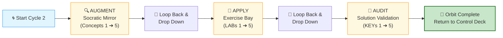

# 🗄️🤖 SQL & GenAI Course
**🎯 Quality Education for Anyone, Anywhere, Anytime — 💫 with Comfort, Convenience at no Cost**

---

## 🔄 ACCELERATE Cycle 2 Guide: Module 3 (Spiral Chamber)

You have entered the spiral. This is a self‑contained spiral traversal chamber. Work through the three phases in order. After completing all three, return to the Navigation Guide to log your Lap 2 Black Box Feedback.

> **Browser Office:** Your four tabs are already configured. Tab 3 is set up according to `BROWSER-OFFICE-ACCELERATE.md` – Socratic Mentor mode, no code generation.

---

## 🎯 Cycle 2 Learning Objectives

By completing this cycle, you will be able to:
- Apply Socratic questioning to all Module 3 concepts (ORDER BY, GROUP BY, HAVING, aggregate functions)
- Diagnose and fix broken AI‑generated queries involving aggregation and grouping (5 LABs)
- Validate your reasoning against golden prompts (5 KEYs)
- Extract gemstones for your Skill‑Tree from both ACQUIRE and ACCELERATE

---

### 🧮 The Aggregation Compressor

Module 2 was about **filtering rows** – keeping or discarding individual records.  
Module 3 is about **compressing rows** – collapsing many rows into summary aggregates (totals, averages, counts).

This shift from row‑level to set‑level thinking is the cognitive leap of **Cycle 2**. The three passes (Augment → Apply → Audit) remain the same, but the **mental model** changes fundamentally.

---

## 🗺️ The Spiral Flight Path

> **Flight Rule:** Complete an entire Pass horizontally across all concepts before dropping down to the next vertical layer. Never cross‑thread or jump ahead.

---

 ## 📎 **Mirror Bridge Convention**
This section explains the underlying **file system symmetry** between ACQUIRE and ACCELERATE — the structural foundation of the **Mirror Bridge Architecture.**
 
### **Folder Mapping**
 | ACQUIRE folder | ACCELERATE folder |
 |----------------|-------------------|
 | `1-sqlCommands` | `01-The-Socratic-Mirror` |
 | `2-practiceExercises` | `02-Exercises` |
 | `4-exerciseAndQuizSolutions` | `03-Solutions` |

 ### **File Naming Rules**
 
 - **AUGMENT files** are exact 1:1 mirrors of ACQUIRE concept files (same filename as in `1-sqlCommands`).
 - **APPLY files** mirror ACQUIRE practice exercises files with `-LAB` appended (e.g., `4-like-and-null.md` → `4-like-and-null-LAB.md`).
 - **AUDIT files** mirror ACQUIRE exercises and solution files with `-KEY` substituted instead of `-solutions` (e.g., `4-like-and-null-solutions.md` → `4-like-and-null-KEY.md`).

This ensures isomorphic mapping between **ACQUIRE** and **ACCELERATE** while clearly distinguishing the three passes.

---

## 🔍 AUGMENT – The Socratic Mirror

**Cognitive Goal:** abstraction & logic formation

**Base path:** `01-The-Socratic-Mirror/ACQUIRE-MODULE3/`

| Concept Focus | Mirror Bridge File (1:1 mapping with ACQUIRE) |
|---------------|------------------------------------------------|
| Ordering Results (ORDER BY) | `1-order-by.md` |
| Summary Calculations (Aggregate Functions) | `2-aggregate-functions.md` |
| Bucketing Rows (GROUP BY) | `3-group-by.md` |
| Filtering Groups (HAVING) | `4-having.md` |
| Hidden Logic (Execution Order) | `5-execution-order.md` |

> 💡 After completing each concept, extract gemstones (skill, objective, viewpoint) into `EXTRACTION_BAY/SkillTree/GemstoneArray.md`.

✅ **After completing all 5 concepts**, return here and proceed to **APPLY**.

---

## 🧪 APPLY – The Exercise Bay

**Cognitive Goal:** struggle & implementation

**Base path:** `02-Exercises/MODULE3/`

**Tab 2:** Load `training_institution_sample.db` or `level1_estore_basic.db` as needed

| LAB Focus | Mirror Bridge File (1:1 mapping with ACQUIRE) |
|-----------|------------------------------------------------|
| Sorting Basics Debugging | `1-sorting-basics-LAB.md` |
| Aggregate Function Defects | `2-aggregate-basics-LAB.md` |
| GROUP BY Structural Failures | `3-group-by-practice-LAB.md` |
| HAVING vs WHERE Confusion | `4-having-practice-LAB.md` |
| Mixed Aggregation Logic Errors | `5-mixed-practice-LAB.md` |

> 💡 After completing each LAB, extract any anti‑pattern gemstones into `GemstoneArray.md`.

✅ **After completing all 5 LABs**, return here and proceed to **AUDIT**.

---

## 🔑 AUDIT – Solution Validation

**Cognitive Goal:** validation & calibration

**Base path:** `03-Solutions/MODULE3/`

| KEY Focus | Mirror Bridge File (1:1 mapping with ACQUIRE) |
|-----------|------------------------------------------------|
| Sorting Correctness Check | `1-sorting-basics-KEY.md` |
| Aggregate Function Validation | `2-aggregate-basics-KEY.md` |
| GROUP BY Golden Alignment | `3-group-by-practice-KEY.md` |
| HAVING Filter Audit | `4-having-practice-KEY.md` |
| Mixed Aggregation Reasoning Baseline | `5-mixed-practice-KEY.md` |

> 💡 After completing each KEY, extract final validation gemstones into `GemstoneArray.md`.

✅ **After completing all 5 KEYs**, your Cycle 2 spiral is complete.

---

## 🏁 MISSION CLEARED: RETURN RUNWAY

**🔒 CYCLE 2 COMPLETE**

All horizontal passes are executed, and all internal cognitive checkpoints have been verified. Your orbit around Module 3 data domains is officially complete.

# [▶️ **RETURN TO FLIGHT CONTROL DECK**](../MODULE5_NAVIGATION_GUIDE.md)

**Log your Lap 2 Black Box Telemetry**

---

*Part of our mission for 🎯 Quality Education for Anyone, Anywhere, Anytime — 💫 with Comfort, Convenience at no Cost.*

**Level 1 | ACCELERATE Phase | Cycle 2 Guide (Module 3) | Next: Return to Navigation Guide**

