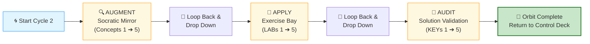
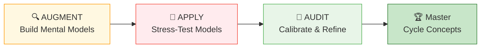

# 🗄️🤖 SQL & GenAI Course
**🎯 Quality Education for Anyone, Anywhere, Anytime — 💫 with Comfort, Convenience at no Cost**

---

## 🔄 ACCELERATE Cycle 2 Guide: Module 3 (Spiral Chamber)

You have entered the spiral. This is a self‑contained **spiral traversal chamber.** Work through the three phases in order. After completing all three, return to the Navigation Guide to log your Lap 2 Black Box Feedback.

> **Browser Office:** Your four tabs are already configured. Tab 3 is set up according to `BROWSER-OFFICE-ACCELERATE.md` – Socratic Mentor mode, no code generation.

---

## 🎯 Cycle 2 Learning Objectives

By completing this cycle, you will be able to:
- Apply Socratic questioning to all Module 3 concepts
- Diagnose and fix broken AI‑generated queries (5 LABs)
- Validate your reasoning against golden prompts (5 KEYs)
- Extract gemstones for your Skill‑Tree from both ACQUIRE and ACCELERATE

---

## 🗺️ The Spiral Flight Path

> **Flight Rule:** Complete an entire Pass horizontally across all concepts before dropping down to the next vertical layer. Never cross‑thread or jump ahead.

---

## 📎 Mirror Bridge Convention

This section explains the underlying **file system symmetry** between ACQUIRE and ACCELERATE — the structural foundation of the **Mirror Bridge Architecture.**

### Folder Mapping

| ACQUIRE folder | ACCELERATE folder |
|----------------|-------------------|
| `1-sqlCommands` | `01-The-Socratic-Mirror` |
| `2-practiceExercises` | `02-Exercises` |
| `4-exerciseAndQuizSolutions` | `03-Solutions` |

### File Naming Rules

- **AUGMENT files** are exact 1:1 mirrors of ACQUIRE concept files (same filename as in `1-sqlCommands`).
- **APPLY files** mirror ACQUIRE practice exercises files with `-LAB` appended.
- **AUDIT files** mirror ACQUIRE exercises and solution files with `-KEY` substituted instead of `-solutions`.

This ensures isomorphic mapping between **ACQUIRE** and **ACCELERATE** while clearly distinguishing the three passes.

---

## 🧭 The Three Phases of the Spiral

### The Operational View – What You Do

Each phase has a distinct operational role in the spiral:

| Phase | What You Do | Cognitive Goal |
|-------|-------------|----------------|
| **AUGMENT** | Socratic Mirror – abstraction & logic formation | Understand the *why* before the *how* |
| **APPLY** | Exercise Bay – struggle & implementation | Diagnose and fix broken AI queries |
| **AUDIT** | Solution Validation – calibration & comparison | Validate reasoning against golden prompts |

### The Cognitive Depth View – How Your Engagement Changes

Across the same concepts, your cognitive depth increases with each phase:

| Phase | What Changes |
|-------|---------------|
| **AUGMENT** | You build mental models |
| **APPLY** | You stress‑test those models |
| **AUDIT** | You calibrate and refine those models |

This is not repetition – it is **spiral deepening**. The same concepts, viewed from progressively deeper cognitive layers.

---

## 🔍 AUGMENT: THE SOCRATIC MIRROR

### **Entering the Augment Layer**

You are entering the abstraction layer. This is where you build mental models, challenge assumptions, and interrogate AI reasoning – without rushing toward answers or writing production queries. Traverse all 5 concepts horizontally before descending.

**This is where judgment begins.**

### Mirror Bridge Mapping: ACQUIRE ↔ ACCELERATE

**Base path:** `01-The-Socratic-Mirror/ACQUIRE-MODULE3/`

| Concept Focus | Mirror Bridge File (1:1 mapping with ACQUIRE) |
|---------------|------------------------|
| Ordering Results (ORDER BY) | `1-order-by.md` |
| Summary Calculations (Aggregate Functions) | `2-aggregate-functions.md` |
| Bucketing Rows (GROUP BY) | `3-group-by.md` |
| Filtering Groups (HAVING) | `4-having.md` |
| Hidden Logic (Execution Order) | `5-execution-order.md` |

> 💡 After completing each concept, extract gemstones (skill, objective, viewpoint) into `EXTRACTION_BAY/SkillTree/GemstoneArray.md`.

### Begin Your AUGMENT Journey

➡️ [Start with Concept 1: Ordering Results](./01-The-Socratic-Mirror/ACQUIRE-MODULE3/1-order-by.md)

✅ **After completing all 5 concepts**, return here.

> 🔁 **Spiral Rule:** Complete the entire horizontal pass before descending to the next layer.

### 📝 Pause & Reflect – AUGMENT

Before dropping to the next phase, answer this single question:

**One question:** What was the single most valuable logical insight you gained from the Socratic Mirror that you did not have before?

*Write your answer in your Vault (e.g., `META_VAULT/cycle2_reflections.md`).*

---

## 🧪 APPLY: THE EXERCISE BAY

### **Entering the Apply Layer**

The mirror phase is over. You now operate under implementation pressure. The LABs are intentionally imperfect – broken AI queries, hidden assumptions, structural defects, misleading outputs. Your goal is diagnosis, not speed. Struggle is expected.

### Mirror Bridge Mapping: ACQUIRE ↔ ACCELERATE

**Base path:** `02-Exercises/MODULE3/`

**Tab 2:** Load `training_institution_sample.db` or `level1_estore_basic.db` as needed

| LAB Focus | Mirror Bridge File (1:1 mapping with ACQUIRE) |
|-----------|------------------------|
| Sorting Basics Debugging | `1-sorting-basics-LAB.md` |
| Aggregate Function Defects | `2-aggregate-basics-LAB.md` |
| GROUP BY Structural Failures | `3-group-by-practice-LAB.md` |
| HAVING vs WHERE Confusion | `4-having-practice-LAB.md` |
| Mixed Aggregation Logic Errors | `5-mixed-practice-LAB.md` |

> 💡 After completing each LAB, extract any anti‑pattern gemstones into `GemstoneArray.md`.

### Begin Your APPLY Journey

➡️ [Start with LAB 1: Sorting Basics Debugging](./02-Exercises/MODULE3/1-sorting-basics-LAB.md)

✅ **After completing all 5 LABs**, return here.

> 🔁 **Spiral Rule:** Complete the entire horizontal pass before descending to the next layer.

### 📝 Pause & Reflect – APPLY

Before dropping to the next phase, answer this single question:

**One question:** Which LAB forced you to rethink your understanding of the concept, and why?

*Write your answer in your Vault.*

---

## 🔑 AUDIT: THE CALIBRATION CHAMBER

### **Entering the Audit Layer**

Implementation alone is not mastery. You must now compare your reasoning against golden solutions, alternative interpretations, structural baselines, and AI‑generated approaches. Do not merely check correctness – calibrate your assumptions, efficiency, readability, and architectural judgment.

### Mirror Bridge Mapping: ACQUIRE ↔ ACCELERATE

**Base path:** `03-Solutions/MODULE3/`

| KEY Focus | Mirror Bridge File (1:1 mapping with ACQUIRE) |
|-----------|------------------------|
| Sorting Correctness Check | `1-sorting-basics-KEY.md` |
| Aggregate Function Validation | `2-aggregate-basics-KEY.md` |
| GROUP BY Golden Alignment | `3-group-by-practice-KEY.md` |
| HAVING Filter Audit | `4-having-practice-KEY.md` |
| Mixed Aggregation Reasoning Baseline | `5-mixed-practice-KEY.md` |

> 💡 After completing each KEY, extract final validation gemstones into `GemstoneArray.md`.

### Begin Your AUDIT Journey

➡️ [Start with KEY 1: Sorting Correctness Check](./03-Solutions/MODULE3/1-sorting-basics-KEY.md)

✅ **After completing all 5 KEYs**, your Cycle 2 spiral is complete.

> 🔁 **Spiral Rule:** Complete the entire horizontal pass before descending to the next layer.

### 📝 Pause & Reflect – AUDIT

Wrap up your internal audit loop with a final check:

**One question:** What is one assumption you made during AUGMENT or APPLY that the KEY file corrected?

*Write your answer in your Vault.*

---

## 🏁 MISSION CLEARED: RETURN RUNWAY

**🔒 CYCLE 2 COMPLETE**

All horizontal passes are executed, and all internal cognitive checkpoints have been verified. Your orbit around Module 3 data domains is officially complete.

Click below to close out your cycle.

# [▶️ **RETURN TO FLIGHT CONTROL DECK**](../MODULE5_NAVIGATION_GUIDE.md)

**Log your Lap 2 Black Box Telemetry**

---

*Part of our mission for 🎯 Quality Education for Anyone, Anywhere, Anytime — 💫 with Comfort, Convenience at no Cost.*

**Level 1 | ACCELERATE Phase | Cycle 2 Guide (Module 3) | Next: Return to Navigation Guide**

