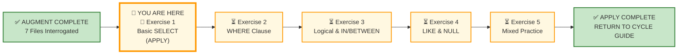
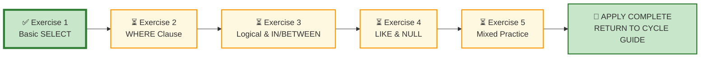

# 🗄️🤖 SQL & GenAI Course
**🎯 Quality Education for Anyone, Anywhere, Anytime — 💫 with Comfort, Convenience at no Cost**

---

## 🧠 Exercise 1: Basic SELECT (Apply Augmented skills and deliver)

Welcome to the **APPLY Phase**. In the previous modules, you judged, analyzed, and audited SQL queries written by others. Now, the critic's chair is gone. You are the practitioner, and you are entirely responsible for producing clean, syntactically sound, and business-accurate outcomes.

**ACQUIRE → AUGMENT → APPLY**  
🔧 **ACQUIRE:** Learn syntax  
⚖️ **AUGMENT:** Judge correctness  
🚀 **APPLY:** Deliver outcome

---

## 🌌 SQLVerse Check-In

<div style="border-left: 4px solid #9c27b0; background-color: #f3e5f5; padding: 15px; margin: 20px 0; border-radius: 0 8px 8px 0;">

You have completed **ACQUIRE and AUGMENT.** You have interrogated AI logic and judged query trustworthiness.

Now you enter APPLY – **Stop judging and start building.**

### ⚠️ THE ILLUSION OF SYMMETRY

**Your APPLY exercise filenames share a perfect symmetry with ACQUIRE exercises – the similarity ends there.**

Do not let the filenames deceive you. The file **title** identifies the **anchor concept,** not the boundary.

In **AUGMENT**, you operated under a strict, unyielding **SCOPE LOCK**. In **APPLY**, that safety net is completely gone. 

The filename `1-basic-select-LAB.md` does **not** mean your scope is restricted to the `SELECT` clause. The scope of *every single APPLY file* encompasses the entire gamut of the 7 concept files in this spiral—from Basic SELECT to NULL Handling, DISTINCT, and the Query Execution Order.

* **50% of this floor** is reserved for the anchor concept (SELECT).
* **The other 50% is a wildcard zone** and can draw from any concept in the spiral. You will be forced to reach forward or backward across the entire cycle to deliver the outcome.

A manager never walks up to your desk and says, "Hey, please pull this data, but only use concepts from Chapter 1." They just ask for the data.

**Prepare to use your entire toolkit.**

The engine doesn't care what chapter you are on. It only cares if your logic holds water. 

**The critic's chair is gone. Welcome to production.**

The SQLVerse is waiting. 

**The difference between a coder and an Artisan is Production awareness.**

Your portfolio is calling.

</div>

---

## 📍 Your Current Stage – APPLY Journey



---

## 🔧 Browser Office for APPLY

**🚀 Kickstart: Any Computer, Any Browser, Anytime.**  
**🌍 Destination: Any country, Any city, Any Platform.**

| Tab | Purpose | What to Do |
| :--- | :--- | :--- |
| **1: The Map** | Open this exercise file | You are here – reading this file. Complete the business requests below. |
| **2: The Factory** | Understand the data model and execute SQL | 1. Study the **ER Diagram & Schema Guide** (60 seconds is enough).<br>2. Identify the **entities** and their **relationships.**<br>3. Load the database **referenced** in the exercise section.<br>4. Write and execute your SQL queries. |
| **3: The Consultant** | Socratic questioning (no code generation) | Configured with [`BROWSER-OFFICE-ACCELERATE.md`](../../BROWSER-OFFICE-ACCELERATE.md) – Persona prompt, SQLVerse characters, and relevant schema anchor. Explains logic, suggests strategies, validates reasoning – **never writes SQL code**. Follow the **3‑Attempt Rule**: try from memory, check your notes, then ask for a conceptual hint. |
| **4: The Vault** | Save your work | Save each completed business deliverable in your Vault under: `Learning/Level-1-beginner/ACCELERATE/02-Exercises/MODULE2/`.<br><br>If you spot AI hallucinations or edge cases, log them in `Learning/Level-1-beginner/ACCELERATE/Socratic_Journals/` as separate files (e.g., `hallucination_log_1.md`). |

> 📌 **Note:** The **ER Diagram & Schema Guide** and the corresponding database for each exercise are specified in the **Workshop Floor** and **Production Echo** sections. For the full resource structure, refer to **🏛️ Meet Your APPLY Repository** below.

> **Professional Habit:** Understand the data model before you query it – **Professional SQL developers** do that.


---

## 🏛️ Meet Your APPLY Resource Repository

The **APPLY Resource Repository** is your central hub for all databases, ER diagrams, and schema guides used throughout the **APPLY cycle.** Each time you begin a new exercise, you will return here to load the required database and study its blueprint.

### 🗄️ Repository Artifacts

**All resources** used throughout this **APPLY cycle** are located in the APPLY Resource Repository:

1. **Customized E-Store database** – `level1_estore_apply.db` (extended dataset with NULLs, bulk orders, new categories)
2. **Production Echo databases** – domain-specific datasets (e.g., `hospital_planet.db`, `real_estate_planet.db`, `fintech_planet.db`)
3. **ER Diagrams and Schema Guides** – Blueprint files for every database (e.g., `E-Store_APPLY_Blueprint.md`, `Hospital_Planet_Blueprint.md`)

### 📂 APPLY Resource Repository Location
```
Module5-GenAI-Walkthrough/02-Exercises/MODULE2/Module2-Schemas/
```

Each **APPLY exercise** will explicitly specify which database(s) you need to load from this repository – both for the **Workshop Floor** and **Production Echo** sections.

> 💡 **Tip:** Browse the repository before you begin. **Familiarise** yourself with the available databases and schema guides. You will **revisit** this repository throughout the **APPLY phase.**


### Why does APPLY use a different E-Store database `level1_estore_apply.db`?

The **APPLY** uses the same schema but a richer dataset because production work is driven by realistic data rather than simplified classroom examples.

 - **ACQUIRE:** The E-Store database was designed for learning SQL syntax. It intentionally avoided NULL values, edge cases, and production-style data anomalies.
 - **APPLY:** The same E-Store has been extended to simulate realistic business environments while keeping the database schema unchanged.
   
To simulate production environments more realistically, the APPLY version of the E-Store extends the original dataset with additional business scenarios, including:

* Customers with missing (`NULL`) email addresses
* Additional cities for more meaningful filtering and `DISTINCT` operations
* New product categories
* Additional orders across different dates
* Bulk purchase scenarios
* Richer datasets for business-oriented reporting

The database schema remains unchanged. Only the data has evolved.

**This reflects real software systems, where the database structure often remains stable while the data grows richer and more complex over time.**

This allows you to practise production-style problem solving without affecting the clean instructional dataset used throughout the ACQUIRE phase.

**Same schema. Different data. Different business outcomes.**

---

## ⚠ APPLY Rule

The business request will not tell you:
- which SQL command to use
- which operator to use
- which concept to use

Part of APPLY is identifying the correct SQL tool yourself.

---

## 📋 Business Use Case

**Business Context:** You have joined a Software Consultancy firm as a junior data analyst. Today is your first day. Requests arrive throughout the day.

Your consultancy firm has been engaged by two clients this quarter.

**Client 1 – E‑Store Platform:** The operations team needs a clean, uncluttered list of active retail users to run an email validation sync.

**Client 2 – Regional Healthcare Facility:** Our newly acquired corporate client needs an identical structural operational extraction to audit its primary patient triage queues.

Two clients. Two domains. Same SQL patterns.

---

## 🛒 Section 1: Workshop Floor – E‑Store

Before solving the requests, spend a few minutes understanding the business model, workflow, ER diagram, and table schemas.

**Business first. Data model second. SQL third.**

**📁 Database:** Load [`level1_estore_apply.db`](./Module2-Schemas/level1_estore_apply.db) in **Tab 2 (The Factory)** before starting this section.

**🗺️ ER Diagram & Schema Guide:** Study [`E-Store_APPLY_Blueprint.md`](./Module2-Schemas/E-Store_APPLY_Blueprint.md) before writing any SQL.

### 📋 Meet Your Dataset: E‑Store – Your Home Turf

| Table | Columns | What It Tells Us |
|-------|---------|------------------|
| `customers` | `customer_id`, `name`, `email`, `city`, `phone` | Retail consumer profile data |
| `products` | `product_id`, `product_name`, `price`, `category` | Complete store stock inventory |
| `orders` | `order_id`, `customer_id`, `order_date` | Transaction timeline events |
| `order_items` | `order_item_id`, `order_id`, `product_id`, `quantity` | Itemized invoice lines |


---

### Business Request #1 – Missing Email Addresses

The Marketing Director wants a list of customers whose email addresses are missing. She is planning a data cleanup campaign and needs to identify which records need updating.

**Deliverable:** A list of customers with no email address.

---

### Business Request #2 – Electronics Catalog Snapshot

The Procurement Manager wants all products belonging to the Electronics category. They are reviewing the current Electronics inventory for a supplier negotiation.

**Deliverable:** A two‑column report showing `product_name` and `price` for Electronics.

---

### Business Request #3 – Unique Customer Cities

The CEO wants a unique list of cities where customers currently reside. She is planning regional expansion.

**Deliverable:** A single‑column list of distinct customer cities.

---

### Business Request #4 – Custom Contact Order

The sales team needs a contact list with email addresses first, followed by customer names. They are preparing a personalised outreach campaign.

**Deliverable:** A two‑column report showing `Email Address` and `Customer Name`.

---

### Business Request #5 – Orders in First Week of October

The Operations Manager wants all orders placed during the first week of October 2025 (October 1–7). They are analysing weekly order volume.

**Deliverable:** A list of orders with `order_id`, `customer_id`, and `order_date`.

---

### Business Request #6 – Complete Order Items Audit

The logistics team needs a complete audit of the `order_items` table. They want to verify all line‑item records.

**Deliverable:** A full extract of all columns from the `order_items` table.

---

### Business Request #7 – Customers with "e" in Name

Customer Support wants a list of customers whose names contain the letter "e". They are running a targeted satisfaction survey.

**Deliverable:** A list of customer names and emails.

---
### Business Request #8 – Customers with Names Starting with A or Ending with a

The Marketing Team wants a list of customers whose names start with the letter `'A'` or end with the letter `'a'`. They are running a campaign targeting specific name patterns.

**Deliverable:** A list of customer names and emails.

---

## 🏥 Section 2: Production Echo – Hospital Planet

**Domain Context:** You are deployed to a new client – **Hospital Planet**. The nouns have changed, but the data patterns are identical. Welcome to your first domain leap. You are stepping completely outside of the retail environment and entering a Hospital Information System (HIS). The physical entities are completely different, but notice the structural mirror: patients map to customers, and admission queues map to user account status tracks.

> 📋 **Hospital Planet Policy:** Patients must settle all outstanding bills before discharge. For reporting purposes, bill settlement is treated as completion of the discharge process.

> 💡 **Architect's Note:** Not every business event has its own dedicated column. In real production systems, organizations often use operational proxies. At Hospital Planet, a settled bill is used as the reporting proxy for a completed discharge.
---

Before solving the requests, spend a few minutes understanding the business model, workflow, ER diagram, and table schemas.

**Business first. Data model second. SQL third.**

**📁 Database:** Load [`hospital_planet.db`](./Module2-Schemas/hospital_planet.db) in **Tab 2 (The Factory)** before starting this section.

**🗺️ ER Diagram & Schema Guide:** Study [`Hospital_Planet_Blueprint.md`](./Module2-Schemas/Hospital_Planet_Blueprint.md) before writing any SQL.

### 📋 Meet Your Dataset: Hospital Planet – New Landscape

| Table | Columns | What It Tells Us |
|-------|---------|------------------|
| `patients` | `patient_id`, `name`, `email`, `phone`, `status` | Patient admission rosters |
| `treatments` | `treatment_id`, `treatment_name`, `cost`, `category` | Clinical medical services catalog |
| `appointments` | `appointment_id`, `patient_id`, `appointment_date`, `treatment_id` | Outpatient slot bookings with treatment performed |
| `bills` | `bill_id`, `patient_id`, `amount`, `bill_date` | Financial medical ledger entries |

> 💡 **Notice the pattern:** The tables in Hospital Planet mirror the E‑Store structure. `patients` = `customers`, `treatments` = `products`, `appointments` = `orders`, `bills` = `order_items`. The nouns change. The SQL stays the same.


---

### Business Request #9 – Missing Phone Numbers

The hospital administrator needs a list of patients whose phone numbers are missing. They are updating patient records for emergency contact verification.

**Deliverable:** A list of patients with no phone number.

---

### Business Request #10 – Treatment Catalog

The billing department needs a list of all treatment names and their costs for a pricing review.

**Deliverable:** A two‑column report showing `Treatment Name` and `Cost`.

---

### Business Request #11 – Unique Treatment Categories

The Chief Medical Officer wants a unique list of treatment categories offered by the hospital. They are evaluating service diversity.

**Deliverable:** A single‑column list of distinct treatment categories.

---

### Business Request #12 – Custom Patient Contact Order

Patient Relations needs a contact list with email addresses first, followed by patient names. They are preparing a health awareness campaign.

**Deliverable:** A two‑column report showing `Email Address` and `Patient Name`.

---

### Business Request #13 – Financial Ledger Reconciliation

The hospital's finance team is reconciling billing records with the accounting ledger. Before beginning the reconciliation, they require a complete export of every billing transaction exactly as recorded in the system.

**Deliverable:** A full extract of all columns from the `bills` table. 

---

### Business Request #14 – Bills from a Specific Month

The finance team wants to verify all bills issued in **April 2025**. They are preparing for the quarterly audit.

**Deliverable:** A list of `bill_id`, `patient_id`, and `amount` for bills issued in April 2025.

---

### Business Request #15 – Patients Discharged and Billed during the first week of March 2025.

The Hospital Administrator wants a list of patients who completed the discharge process by settling their bills during the first week of March 2025 (between **March 1, 2025** and **March 7, 2025**). The hospital is tracking discharge efficiency and billing turnaround.

**Deliverable:** A two‑column report showing:

 - `patient_id` aliased as **"Patient ID"** 
 -  `amount` aliased as **"Bill Amount"**

---

## 📋 Section 3: Executive Desk – Integrated Challenge

**The CEO wants:** A localized "Treatment Cost Variance Index" report extracted from the medical catalog. The executive board does not want to see technical database column terms; they require pristine, consumer‑facing column labels.

**Requirements:**
- Extract the `treatment_name`, the raw `cost`, and the `category` from the `treatments` table.
- The columns must be explicitly aliased exactly as follows:
    - `treatment_name` → `"Hospital Service Provided"`
    - `cost` → `"Base Strategic Rate"`
    - `category` → `"Clinical Department"`
- Reorder the output matrix so that the `"Clinical Department"` is projected as the very first column on the left.

> No hints. No syntax templates. Just a business outcome.

---

### ✅ A Day at Work for a Junior Analyst

**Congratulations!** You have completed all business requests for the day on your very first day in office. Review your deliverables before logging off.

| Time | Deliverable | Status |
|------|-------------|--------|
| 09:00 AM | Missing Email Addresses (E‑Store) | ☐ |
| 10:00 AM | Electronics Catalog Snapshot (E‑Store) | ☐ |
| 11:30 AM | Unique Customer Cities (E‑Store) | ☐ |
| 01:00 PM | Custom Contact Order (E‑Store) | ☐ |
| 02:30 PM | Orders in First Week of October (E‑Store) | ☐ |
| 04:00 PM | Complete Order Items Audit (E‑Store) | ☐ |
| 05:00 PM | Customers with "e" in Name (E‑Store) | ☐ |
| 06:00 PM | Customers with Names Starting with A or Ending with a (E‑Store) | ☐ |
| 09:30 AM | Missing Phone Numbers (Hospital) | ☐ |
| 11:00 AM | Treatment Catalog (Hospital) | ☐ |
| 01:30 PM | Unique Treatment Categories (Hospital) | ☐ |
| 03:00 PM | Custom Patient Contact Order (Hospital) | ☐ |
| 04:30 PM | Financial Ledger Reconciliation (Hospital) | ☐ |
| 06:00 PM | Bills from a Specific Month (Hospital) | ☐ |
| 07:00 PM | Patients Discharged and Billed during First Week of March 2025 (Hospital) | ☐ |
| 09:00 PM | Executive Desk – Treatment Cost Variance Index | ☐ |

**Reflection:** What was the most valuable takeaway from your first day as a junior analyst?

---

## 🔁 Bridge Forward

You have applied `SELECT` to E‑Store and Hospital Planet. The nouns changed – the SQL stayed the same.

Next, you will add `WHERE` filters to your toolkit.

➡️ [Proceed to Exercise 2: WHERE Clause →](./2-where-operators-LAB.md)

---

## 🧭 File Navigation




| Previous Step | Next Step |
|:---:|:---:|
| [← Return to Cycle Guide](../../01-The-Socratic-Mirror/CYCLE1_GUIDE.md) | [Continue to Exercise 2: WHERE Clause →](./2-where-operators-LAB.md) |

---

*Part of our mission for 🎯 Quality Education for Anyone, Anywhere, Anytime — 💫 with Comfort, Convenience at no Cost.*

**Level 1 | ACCELERATE Phase | APPLY | Module 2 | File 1**


