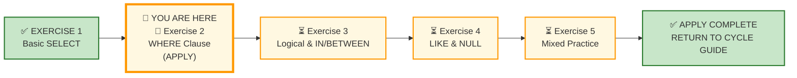
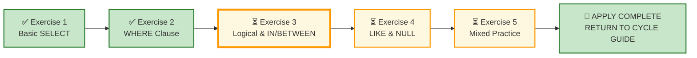

# 🗄️🤖 SQL & GenAI Course
**🎯 Quality Education for Anyone, Anywhere, Anytime — 💫 with Comfort, Convenience at no Cost**

---

## 🧪 Exercise 2: The WHERE Clause (Apply Augmented skills and deliver)

Welcome to your second **APPLY Phase** challenge. You have already mastered simple column projections, deduplication, and basic pattern matches.  Now, the stakes rise. 

 The clients are demanding **precision.** The requests become more specific, more conditional, and more demanding. You are no longer just pulling raw levers—you are cutting through noise to isolate high-value target data.

**ACQUIRE → AUGMENT → APPLY**  

🔧 **ACQUIRE:** Learn syntax  
⚖️ **AUGMENT:** Judge correctness  
🚀 **APPLY:** Deliver outcome

---

## 🌌 SQLVerse Check-In

You delivered your business requests across E‑Store and Hospital Planet in the previous LAB. You survived the Day 1 onboarding. The training wheels are entirely gone. 

Now you begin **EXERCISE 2** – where the requests ask for **specific operational conditions**, not just blanket extracts.

### ⚠️ THE ILLUSION OF SYMMETRY

The title of this file is **WHERE Clause**. This confirms your _milestone theme_, not your boundary limits. The scope of *every single APPLY file* encompasses the entire the entire **cumulative gamut** of your toolkit—from Basic SELECT to NULL Handling, DISTINCT, and the Query Execution Order.

 - **60% of this floor** is anchored in the conditional  `WHERE` clause. 
 -  **The other 40% is a wildcard zone** and can draw from any concept in the spiral.

**New Mantra: ANCHOR CONCEPT ≠ DOMINANT CONCEPT**

A manager never walks up to your desk and says, "Hey, please pull this data, but only use concepts from Chapter 2." They just say: *"Give me the customers who haven't provided a phone number but ordered premium stock."* If you assume that every request can be solved with a simple, single-condition `WHERE` filter, you will fail production verification.

**Prepare to use your entire toolkit.** The engine only cares if your logic holds water at scale.

**The critic's chair is gone. Welcome to production reality.**

---

## 📍 Your Current Stage – APPLY Journey

---

## 🔧 Browser Office for APPLY

| Tab | Purpose | What to Do |
| :--- | :--- | :--- |
| **1: The Map** | Open this exercise file | You are here – reading this file. Complete the business requests below. |
| **2: The Factory** | Run queries | Load the relevant database for each section. |
| **3: The Consultant** | Socratic questioning (no code) | Configured with persona prompt. Explains logic – **never writes SQL code**. Follow the **3‑Attempt Rule**. |
| **4: The Vault** | Save your work | Save each completed deliverable. Log any AI hallucinations. |

---

## 🏛️ Meet Your Datasets

For this lab, you remain anchored across your twin **foundational landscapes.** The structural symmetry remains unbroken for one final sprint before the un-mirroring phase begins.

### Dataset 1: E‑Store – Your Home Turf

| Table | Columns | What It Tells Us |
|-------|---------|------------------|
| `customers` | `customer_id`, `name`, `email`, `city`, `phone` | Retail consumer profile data |
| `products` | `product_id`, `product_name`, `price`, `category` | Complete store stock inventory |
| `orders` | `order_id`, `customer_id`, `order_date` | Transaction timeline events |
| `order_items` | `order_item_id`, `order_id`, `product_id`, `quantity` | Itemized invoice lines |

### Dataset 2: Hospital Planet – Familiar Landscape

| Table | Columns | What It Tells Us |
|-------|---------|------------------|
| `patients` | `patient_id`, `name`, `email`, `phone`, `status` | Patient admission rosters |
| `treatments` | `treatment_id`, `treatment_name`, `cost`, `category` | Clinical medical services catalog |
| `appointments` | `appointment_id`, `patient_id`, `appointment_date` | Outpatient slot bookings |
| `bills` | `bill_id`, `patient_id`, `amount`, `bill_date` | Financial medical ledger entries |

---

## 📋 Business Use Case

Two clients. Two domains. Same SQL patterns.

---

## 🛒 Section 1: Workshop Floor – E‑Store 

### Business Request #1 – High-Value Electronics Drilldown

The Inventory Director is auditing luxury stock lines. She wants a clean list of all products in the 'Electronics' category that are priced strictly greater than 500 credits.

**Deliverable:** A filtered list showing `product_name`,  `category` and `price`.

---

### Request 2 – Out-of-Hub Regional Cleanout

The CRM manager is running an SMS outreach campaign targeting customers who reside outside of our primary hub, which is `New York`. Identify these specific accounts.

**Deliverable:** A list of customer names and cities, who do not reside in `New York`.

---

### Request 3 – Date bound orders

The logistics team wants all orders placed **on or after** March 1, 2025.

**Deliverable:** A filtered list of `order_id`, `customer_id`, and `order_date` .

---

### Request 4 – Bulk Order Quantity Anomaly

The Logistics team suspects either a system anomaly or an enterprise bulk purchase and wants to inspect unusually small and unusually large shipments. Identify records in the `order_items` table that may represent either **trial purchases (1 unit)** or **bulk procurement (5 or more units)**.

**Deliverable:** A full-column extract from the `order_items` table containing only these **volume extremes.**

---

### Request 5 – Mid-Tier Strategic Inventory

The Promotions Team wants to run an experimental campaign on items that represent steady mid-market value. Extract a unique list of categories that contain products priced inside the inclusive range of **100 to 300 credits**.

**Deliverable:** A single-column, completely deduplicated list of matching categories.

---

## 🏥 Section 2: Production Echo – Hospital Planet

**📁 Database:** Load [`hospital_planet.db`](../../../Module5-GenAI-Walkthrough/02-Exercises/MODULE2/Module2-Schemas/hospital_planet.db) in **Tab 2 (The Factory)** before starting this section.

### Request 6 – High-Risk Care Tier Tracking

The Medical Director needs an immediate operational summary. Identify all medical services under the `Cardiology` or `Neurology` categories where the cost is strictly greater than 1,500 credits.

**Deliverable:** A clinical report showing `treatment_name`, `category`, and `cost`.

---

### Request 7 – Low-Cost Treatments

The billing department needs a list of treatments costing **less than** 200 credits for a pricing review.

**Deliverable:** A filtered two‑column report showing `treatment_name` and `cost`.

---

### Request 8 – Critical Financial Ledger Deviations

The Finance Auditor suspects a billing system rounding discrepancy. Find all records in the bills table where the invoice amount is strictly **less than 50 credits**, OR **strictly greater than 5,000 credits**.

**Deliverable:** A complete ledger extract of matching outlier bill rows.

---

### Request 9 – Clinical Data Integrity Footprint

The Database Administrator noticed an ingestion anomaly. Find all patient files where the tracking status is recorded as `Admitted` **BUT** the critical phone communication record is completely missing or unpopulated.

**Deliverable:** A targeted array showing `patient_id`, `name`, and `phone`.

---

### Request 10 – Appointments Before a Specific Date

The scheduling team wants a list of all appointments before February 10, 2025 since a Medical camp is scheduled for Doctors and they want to rearrange the appointments.

**Deliverable:**A filtered list of `appointment_id`, `patient_id`, and `appointment_date`.

---

## 📋 Section 3: Executive Desk – Integrated Challenge

**The Strategic Request:** The Chief Operating Officer is preparing an executive performance audit across operational units. She needs a unified portfolio report that extracts premium or vulnerable operational segments.

For the **Hospital Planet** framework, isolate all treatments that fall under the `Surgery` category **OR** have a baseline cost matching exactly **2,500 credits, provided that the overall treatment cost is strictly greater than 1,000 credits.**

The board requires clean, completely non-technical column layouts to present at the quarterly review.

**Requirements:**

 - Extract the `treatment_name`, `category`, and `cost` from the treatments table.  
 - Alias the output columns exactly as follows:
	 - `treatment_name` → "Hospital Service Provided"
	 - `category` → "Clinical Department"
	 - `cost` → "Strategic Base Rate"
 - Project "Strategic Base Rate" as the very first leftmost column in your output matrix.

---

### ✅ A Day at Work for a Junior Analyst

Review your engineering output before committing queries to your repository log tracker.

| Time | Deliverable | Domain | Status |
|------|-------------|--------|--------|
| 09:00 AM | Request #1 – High-Value Electronics Drilldown | E‑Store | ☐ |
| 10:00 AM | Request #2 – Out-of-Hub Regional Cleanout | E‑Store | ☐ |
| 11:00 AM | Request #3 – Date Bound Orders | E‑Store | ☐ |
| 12:00 PM | Request #4 – Bulk Order Quantity Anomaly | E‑Store | ☐ |
| 01:00 PM | Request #5 – Mid-Tier Strategic Inventory | E‑Store | ☐ |
| 02:30 PM | Request #6 – High-Risk Care Tier Tracking | Hospital Planet | ☐ |
| 03:30 PM | Request #7 – Low-Cost Treatments | Hospital Planet | ☐ |
| 04:30 PM | Request #8 – Critical Financial Ledger Deviations | Hospital Planet | ☐ |
| 05:30 PM | Request #9 – Clinical Data Integrity Footprint | Hospital Planet | ☐ |
| 06:30 PM | Request #10 – Appointments Before a Specific Date | Hospital Planet | ☐ |
| 07:30 PM | Request #11 – Executive Desk – Strategic Request | Integrated | ☐ |

**Reflection:** Why do raw conditional clauses output incorrect row counts if you fail to respect that the database engine naturally evaluates `AND` operators before processing `OR` operators?

---

## 🔁 Bridge Forward

You have executed precision conditional logic across matching retail and clinical structures.

Next, you will step into **Exercise 3**, where we permanently break the comfort of this 1:1 mirror mapping by dropping you directly into **Real Estate Planet**.

➡️ [Proceed to Exercise 3: Logical & IN/BETWEEN →](./3-logical-and-in-between-LAB.md)

---

| Previous Step | Next Step |
|:---:|:---:|
| [← Return to Exercise 1: Basic SELECT](./1-basic-select-LAB.md) | [Continue to Exercise 3: Logical & IN/BETWEEN →](./3-logical-and-in-between-LAB.md) |

---

*Part of our mission for 🎯 Quality Education for Anyone, Anywhere, Anytime — 💫 with Comfort, Convenience at no Cost.*

**Level 1 | ACCELERATE Phase | APPLY | Module 2 | File 2**

