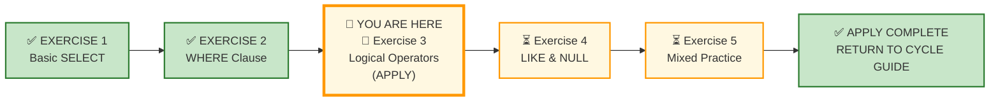
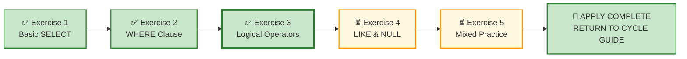

# 🗄️🤖 SQL & GenAI Course
**🎯 Quality Education for Anyone, Anywhere, Anytime — 💫 with Comfort, Convenience at no Cost**

---

## 🧪 Exercise 3: Logical Operators & Multi‑Condition Filters (Apply Augmented skills and deliver)

Welcome to your third **APPLY Phase** challenge. You have mastered conditional logic across E‑Store and Hospital Planet. Now, your consultancy has just onboarded a new client. 

Until now, you have had the structural comfort of a perfect 1:1 domain mirror. Today, that **cushion** is permanently **removed.** You are stepping onto a brand-new landscape: **Real Estate Planet**.

You are being dropped into a completely different **operational landscape:** high-stakes property markets and agent distribution ledgers. The entity shapes, transaction cycles, and table relationships will look entirely new.

You must rely purely on the **abstract mathematical invariance** of SQL. The industry nouns change; your logical engine does not.

**ACQUIRE → AUGMENT → APPLY**  
🔧 **ACQUIRE:** Learn syntax  
⚖️ **AUGMENT:** Judge correctness  
🚀 **APPLY:** Deliver outcome

---

## 🌌 SQLVerse Check-In

<div style="border-left: 4px solid #9c27b0; background-color: #f3e5f5; padding: 15px; margin: 20px 0; border-radius: 0 8px 8px 0;">

You have delivered conditional logic across E‑Store and Hospital Planet. Now you step into a **new landscape** – Real Estate Planet. The nouns are changing, the table shapes are fracturing, and a demanding stakeholder is about to hand you a highly ambiguous ticket. You must rely purely on abstract structural logic to survive.

### 💥 THE STRUCTURAL FRACTURE

The structural 1:1 mirror comfort zone is officially breaking.  Take a close look at your new domain. The comfortable layout of "Customers, Products, Orders" is gone. **Real Estate** operates on property types, agents, listings, and multi-tiered price bounds and **business logic** becomes **layered** and **nuanced**. You still have **E‑Store** as your **home turf.** 

### ⚠️ ANCHOR CONCEPT ≠ DOMINANT CONCEPT

Do not fall victim to the illusion of **boundary limits.** You are expected to draw fluidly from your entire accumulated toolkit: `SELECT`, `DISTINCT`, `WHERE` inequalities, `NULL` checking, and column aliasing.

Prepare to use your entire arsenal.

### THE SCHEMA SHATTERS, THE LOGIC REMAINS

If you understand the geometry of a range or a set, it does not matter if the database is tracking shampoo bottles, patient heart rates, or luxury penthouses.

**New Mantra: LOGIC IS DOMAIN-INVARIANT**

A production data engineer does not freeze when moved from an inventory tracking database to an escrow account ledger. You read the ERD, identify the primary and foreign scalar keys, map the numeric/textual boundaries, and execute.

**Welcome to your first true production landscape shift.**

</div>

---

## 📍 Your Current Stage – APPLY Journey



---

## 🔧 Browser Office for APPLY

| Tab | Purpose | What to Do |
| :--- | :--- | :--- |
| **1: The Map** | Open this exercise file | You are here – reading this file. Complete the business requests below. |
| **2: The Factory** | Run queries | Load **E‑Store** (`level1_estore_basic.db`) for Section 1. Load **Real Estate** (`real_estate.db`) for Section 2. |
| **3: The Consultant** | Socratic questioning (no code) | Explains logic, suggests strategies – **never writes SQL**. Follow the **3‑Attempt Rule**. |
| **4: The Vault** | Save your work | Save each deliverable. Log any AI hallucinations. |

> **Professional Habit:** Understand the data model before you query it – **Professional SQL developers** do that.

---

## 🏛️ Meet Your APPLY Resource Repository

The **APPLY Resource Repository** is your central hub for all databases, ER diagrams, and schema guides used throughout the **APPLY cycle.** Each time you begin a new exercise, you will return here to load the required database and study its blueprint.

### 🗄️ Repository Artifacts

**All resources** used throughout this **APPLY cycle** are located in the APPLY Resource Repository:

1. **Customized E-Store database** – `level1_estore_apply.db` (extended dataset with NULLs, bulk orders, new categories)
2. **Production Echo databases** – domain-specific datasets (e.g., `hospital_planet.db`, `real_estate_planet.db`, `fintech_planet.db`)
3. **ER Diagrams and Schema Guides** – Blueprint files for every database (e.g., `E-Store_APPLY_Blueprint.md`, `Hospital_Planet_Blueprint.md`)

### 📂 APPLY Resource Repository Location
```
Module5-GenAI-Walkthrough/02-Exercises/MODULE2/Module2-Schemas/
```
---

## 📋 Business Use Case

Your consultancy has just landed a **major new client**—a property brokerage that operates across multiple states. They need help extracting insights from their operational data: property listings, agent performance, client activity, and deal pipelines.

This is not E‑Store. There are no product categories, customer orders, or shopping carts.

Instead, you are dealing with:

- **Agents** who list properties and close deals.
- **Clients** who view properties, submit offers, and sign contracts.
- **Properties** with statuses, price points, and types.
- **Viewings, offers, contracts, and payments**—a complete lifecycle from listing to sale.

The schema is richer. The relationships are more layered. The business logic is unfamiliar.

**This is your first true production landscape shift.**

Two clients. Two domains. Same SQL patterns.

The challenge is not the syntax. The challenge is Understanding the Business model.

---

## 🛒 Section 1: Workshop Floor – E‑Store

Before solving the requests, spend a few minutes understanding the business model, workflow, ER diagram, and table schemas.

**Business first. Data model second. SQL third.**

**📁 Database:** Load [`level1_estore_apply.db`](./Module2-Schemas/level1_estore_apply.db) in **Tab 2 (The Factory)** before starting this section.

**🗺️ ER Diagram & Schema Guide:** Study [`E-Store_APPLY_Blueprint.md`](./Module2-Schemas/E-Store_APPLY_Blueprint.md) before writing any SQL.

### 📋 Meet Your Dataset: E‑Store – Your Home Turf

| Table | Columns | What It Tells Us |
|-------|---------|------------------|
| `customers` | `customer_id`, `name`, `email`, `city`, `phone` | Retail consumer profile data |
| `products` | `product_id`, `product_name`, `price`, `category` | Complete store stock inventory |
| `orders` | `order_id`, `customer_id`, `order_date` | Transaction timeline events |
| `order_items` | `order_item_id`, `order_id`, `product_id`, `quantity` | Itemized invoice lines |

---

### Request #1 –  Multi-City Targeted Inventory Hubs

The Regional Logistics Director wants to extract a profile report of all customers living inside our primary shipping hubs: 'New York', 'Chicago', or 'Boston'.

**Deliverable:** A list showing `name`, `city`, and `email` .

**Constraint:** **Do not chain** multiple OR statements together; use a cleaner set inclusion vector.

---


### Request #2 – Mid-Tier Electronics and Furniture

The procurement team wants a list of products in the **Electronics** or **Furniture** categories that are priced between **100 and 800 credits**. They are evaluating mid‑tier inventory.

**Deliverable:** A two‑column report showing `product_name` and `price`.

---

### Request #3 – Customers with complete Contact Data

The CRM manager needs a list of customers who have **both** an email address **and** a phone number. They are preparing a complete‑contact outreach campaign.

**Deliverable:** A list of `name`, `email`, and `phone` for customers with both fields populated.

---

### Request #4 – Loyalty Program Candidates

The Marketing Director wants a list of customers who qualify for the "loyalty program."  The criteria are **ambiguous.**

**Deliverable:** Your best interpretation of what qualifies a customer for loyalty status. Justify your filter logic.

**Hint:** "Loyalty" is a common business term with no universal definition – Consider multiple orders, high spend, long tenure or some other criteria and decide.

---

### Request #5 – Name Pattern and City Match

The CRM manager wants a list of customers whose names contain either the letter 'b' or the letter 'n', and who are located in 'Boston'. They are running a hyper‑targeted local event.

**Deliverable:** A list of `name` and `email`.

---

## 🏘️ Section 2: Production Echo – Real Estate Planet

In the previous exercise, you operated under the comfort of a perfect **1:1 structural mirror** between retail and healthcare. Now the **mirror** is **completely broken.** 

You are being dropped into a completely different operational landscape: **Real Estate Planet.**  From just 4 tables in E-Store you are expected to handle  7 tables in Real estate planet exactly mirroring the **Production database.** This is going to be a **roller-coaster ride.** Study your Real estate planet blueprint and understand the relationships thoroughly before attempting this section. 

---
Before solving the requests, spend a few minutes understanding the business model, workflow, ER diagram, and table schemas.

**Business first. Data model second. SQL third.**

**📁 Database:** Load [`real_estate_planet`](./Module2-Schemas/real_estate_planet.db) in **Tab 2 (The Factory)** before starting this section.

**🗺️ ER Diagram & Schema Guide:** Study [`RealEstate_Planet_Blueprint.md`](./Module2-Schemas/RealEstate_Planet_Blueprint.md) before writing any SQL.

### 📋 Meet Your Dataset: Real Estate Planet – Fresh Landscape (The Cushions are Gone)

Notice that the names, prefixes, and tracking loops no longer copy E-Store.

| Table | Columns | What It Tells Us |
|-------|---------|------------------|
| `agents` | `agent_id`, `first_name`, `last_name`, `email`, `phone`, `brokerage` | Licensed real estate professionals |
| `clients` | `client_id`, `first_name`, `last_name`, `email`, `phone`, `client_type` | Buyers, sellers, or both |
| `properties` | `property_id`, `agent_id`, `address`, `city`, `state`, `zip`, `property_type`, `list_price`, `status` | Real estate inventory |
| `viewings` | `viewing_id`, `property_id`, `client_id`, `viewing_date`, `feedback` | Scheduled property tours |
| `offers` | `offer_id`, `property_id`, `client_id`, `agent_id`, `offer_amount`, `offer_date`, `status` | Purchase offers made by clients |
| `contracts` | `contract_id`, `offer_id`, `property_id`, `client_id`, `agent_id`, `sale_price`, `closing_date` | Binding agreements after offer acceptance |
| `payments` | `payment_id`, `contract_id`, `payment_date`, `amount`, `payment_method` | Payments made against contracts |

> 💡 **Notice the pattern:** Real Estate Planet is *not* a 1:1 mirror of E‑Store. It has 7 tables, not 4. You cannot rely on structural memory. **Read the blueprint. Understand the workflow. Then query.**

---

### Request #6 – Strategic Portfolio Identification

The Sales Director needs to audit specific property groupings. Extract a list of all properties that are classified as either a **'Condo'** or a **'Single-Family'**.


**Deliverable:** A list of `address`, `property_type`, and `list_price`.

---

### Request #7 – Brokerage and Contact Availability


The regional VP wants a list of agents from **Premier Realty** or **Summit Homes** who have a phone number on file. They are planning a brokerage‑specific training.

**Deliverable:** A list of `first_name`, `last_name`, `brokerage`, and `phone` for agents in those brokerages with a non‑NULL phone number.

---

### Request #8 – Properties in Preferred Cities


The market analyst wants a list of properties located in either **Austin** or **Miami**. They are evaluating regional market performance.

**Deliverable:** A list of `address`, `city`, and `list_price` for properties in Austin or Miami.

---

### Request #9 – Properties with Specific Price Range


The finance team wants a list of properties with a list price between **$300,000 and $700,000**. They are evaluating middle‑market investment opportunities.

**Deliverable:** A report showing `address`, `city`, `list_price`, and `property_type`.

---

### Request #10 – Client Type Filter

The sales team wants a list of clients who are either **Buyers** or **Both** (Buyer & Seller). They are preparing a targeted outreach list.

**Deliverable:** A list of `first_name`, `last_name`, `email`, and `phone` for clients who are not purely Sellers.

---

## 📋 Section 3: Executive Desk – Integrated Challenge

### Request #11 – High-Impact Corporate Asset Exposure Report

**📁 Database:** real_estate_planet.db

The Strategic Prompt **From the CFO**: "I need a clean report of our premium available real estate assets to present to investors at the board meeting this afternoon."

#### 🛑 THE PRODUCTION VACUUM

Notice that the CFO did not specify:

 - Which **columns** to project. 
 - What exact numeric **value** defines a property as **"premium".** 
 - How the output should be **ordered** to make business sense. 
 - How to **filter** for availability based on schema states.

#### 🚀 Your Mandate: Design Defensively

You cannot ask the CFO for clarification; she is in a closed-door briefing. You must step into the Architect's chair, make solid, business-justified engineering assumptions, and write defensive SQL that protects the user from messy data or confusing formats.

**Requirements:**

 1. **Determine** a logical definition of "premium" using an inclusive or
    one-sided price boundary based on the schema data.
 2. **Select** only columns that provide immediate business meaning to an investor.
 3. **Apply** professional, human-readable column aliases.
 4. **Order** the data deliberately so that the most high-impact information commands the viewer's attention first.
   
 In your saved file, add a short comment block (--) stating the business assumptions you made to justify your structural choices.   
  
---

## ✅ A Day at Work – Progress Check

Review your engineering output before committing queries to your repository log tracker.

| Time | Deliverable | Domain | Status |
|------|-------------|--------|--------|
| 09:00 AM | Request #1 – Multi-City Targeted Inventory Hubs | E‑Store | ☐ |
| 10:00 AM | Request #2 – Mid-Tier Electronics and Furniture | E‑Store | ☐ |
| 11:00 AM | Request #3 – Customers with Complete Contact Data | E‑Store | ☐ |
| 12:00 PM | Request #4 – Loyalty Program Candidates | E‑Store | ☐ |
| 01:00 PM | Request #5 – Name Pattern and City Match | E‑Store | ☐ |
| 02:30 PM | Request #6 – Strategic Portfolio Identification | Real Estate | ☐ |
| 03:30 PM | Request #7 – Brokerage and Contact Availability | Real Estate | ☐ |
| 04:30 PM | Request #8 – Properties in Preferred Cities | Real Estate | ☐ |
| 05:30 PM | Request #9 – Properties with Specific Price Range | Real Estate | ☐ |
| 06:30 PM | Request #10 – Client Type Filter | Real Estate | ☐ |
| 07:30 PM | Request #11 – Executive Desk – High-Impact Corporate Asset Exposure Report | Integrated | ☐ |


**Reflection:** Which request required the most defensible interpretation? What did you learn from defining your own filter logic?

---

## 💎 DESIGNER'S PERIGON

### The Fracture Was Intentional

You may have noticed something unsettling in this exercise. The comfortable 1:1 mirror between E‑Store and Hospital Planet—`customers` → `patients`, `orders` → `appointments`, `products` → `treatments`—is **gone.**

Real Estate Planet does not follow that pattern. It has **7 tables**, not 4. The workflow is different. The business logic is different. The relationships are more layered and nuanced.

**This was not an accident. It was a deliberate architectural decision.**

---

### Why the Symmetry Had to Break

| Reason | Why It Matters |
|--------|----------------|
| **Real-world domains are not mirrors** | In production, you will rarely encounter two databases with identical structures. The comfort of symmetry is a classroom illusion. |
| **Pattern recognition, not pattern matching** | Symmetry teaches you to match patterns. Fracture teaches you to *recognise* patterns beneath surface differences. |
| **Consultants don't get a mirror** | On day one at a new client, you are handed an unfamiliar schema. You cannot rely on "what it looked like last time." You must read, understand, and adapt. |
| **SQL is domain-agnostic** | The `SELECT` and `WHERE` you wrote for E‑Store work exactly the same way on Real Estate Planet. The nouns change. The logic does not. |

---

### The Realisation

If you found yourself struggling in this exercise, it was **not** because SQL is hard. It was because you were forced to **think**, not just **recognise.**

- You could not rely on structural memory.
- You had to read the blueprint.
- You had to understand the workflow.
- You had to map the business logic to the schema.

That is **the consultant's skill.**

---

### What You Gained

| Before (Symmetry) | After (Fracture) |
|-------------------|------------------|
| Relied on 1:1 mapping | Read schemas independently |
| Assumed familiar patterns | Identify new patterns |
| Comfortable with mirror | Confident with unfamiliar terrain |
| Matches structures | Understands workflows |

> *"The SQLVerse does not reward memorisation. It rewards adaptability."*

The fracture was not a punishment. It was a **promotion**—from pattern matcher to pattern recogniser. From student to consultant.

---

**Carry this lesson forward.** Fintech Planet will be even more unfamiliar. You will survive that too—because now you know the method: **Business first. Data model second. SQL third.**

---

## 🔁 Bridge Forward


You have survived the shattering of the structural mirror and designed an autonomous solution under production ambiguity.

Next, you will step into **Exercise 4**, where we will test your control over partial data and data absence patterns using advanced pattern matching and null validation matrices.

➡️ [Proceed to Exercise 4: LIKE & NULL →](./4-like-and-null-LAB.md)

---

## 🧭 File Navigation



| Previous Step | Next Step |
|:---:|:---:|
| [← Return to Cycle Guide](../CYCLE1_GUIDE.md) | [Continue to Exercise 4: LIKE & NULL →](./4-like-and-null-LAB.md) |

---

*Part of our mission for 🎯 Quality Education for Anyone, Anywhere, Anytime — 💫 with Comfort, Convenience at no Cost.*

**Level 1 | ACCELERATE Phase | APPLY | Module 2 | File 3**