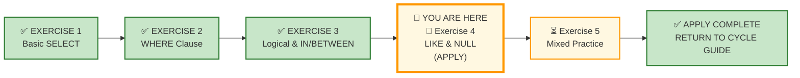
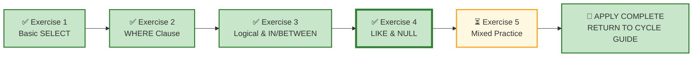

# 🗄️🤖 SQL & GenAI Course
**🎯 Quality Education for Anyone, Anywhere, Anytime — 💫 with Comfort, Convenience at no Cost**

---

## 🧪 Exercise 4: Pattern Matching & NULL Handling (Apply Augmented skills and deliver)

Welcome to your fourth **APPLY Phase** challenge. You have mastered logical operators, range filters, and set membership across two domains. 

Now you are stepping into a **consulting role** where you'll begin learning how real **analysts** think. For this exercise, you will remain entirely within Real Estate Planet, allowing you to concentrate on the decisions rather than the vocabulary.

**ACQUIRE → AUGMENT → APPLY**  
🔧 **ACQUIRE:** Learn syntax  
⚖️ **AUGMENT:** Judge correctness  
🚀 **APPLY:** Deliver outcome

---

## 🌌 SQLVerse Check-In

<div style="border-left: 4px solid #9c27b0; background-color: #f3e5f5; padding: 15px; margin: 20px 0; border-radius: 0 8px 8px 0;">

You **successfully** crossed SQLVerse's first **major bridge**. By **navigating** the **structural fracture** introduced by Real Estate Planet, you proved that your **SQL logic** survives even when the business vocabulary changes completely. You can now apply `AND`, `OR`, `IN`, and `BETWEEN` confidently across **unfamiliar schemas.**

Now you enter **EXERCISE 4** where there is a paradigm shift - you step into the role of a Consultant with a **business-first** approach. Consultants don't jump industries every thirty minutes. They spend weeks—or even months—inside one client's world. Staying **entirely** inside **Real Estate** allows you to stop translating industries and start thinking like a consultant inside a single business.

### The One Thing That Makes SQLVerse Distinctive

> *"No course teaches what you do when the client forgot to tell you half the requirements."*

That is the defining feature of SQLVerse.

Every course teaches `LIKE`. Every course teaches `IS NULL`. Very few courses teach the professional skill of handling ambiguity.

Real business users rarely hand you perfectly written requirements. They omit details, use business language instead of database language, and expect you to bridge the gap.

That bridge is where professionals are made.

---

### Why This Exercise Looks Different

Until now, you have deliberately worked across multiple business domains to prove a foundational SQLVerse principle:

> **Logic is domain-invariant.**

Whether the business was an online store, a hospital, or a real estate company, the SQL patterns remained the same.

Mission accomplished.

From this point onward, repeatedly switching domains adds little educational value. Instead, SQLVerse now shifts its focus from **translating between businesses** to **thinking like a consultant inside one business.**

Appropriately, the SQL concepts in this exercise naturally support this transition. `LIKE` requires you to think about how business users describe information, while `IS NULL` forces you to reason about missing or incomplete data—two situations consultants encounter every day.

For this exercise, you will remain entirely within **Real Estate Planet**, allowing you to concentrate on the decisions rather than the vocabulary.

---

### The SQLVerse Transformation

#### Product → Consulting Progression

| Stage | What You'll Experience |
|-------|------------------------|
| **Product Stage** | Clear, structured business requests that build confidence with `LIKE` and `NULL` patterns. |
| **Consulting Stage** | Less structured requests that require interpretation instead of simple translation. |
| **Ambiguity Chamber** | Intentionally incomplete business problems where multiple defensible solutions exist. |
| **Executive Desk** | High-stakes executive requests where you own the assumptions, design, and presentation. |

---

### What SQLVerse Teaches That Other SQL Courses Don't

| Traditional SQL Course | SQLVerse |
|------------------------|----------|
| Teaches syntax | Teaches **judgment** |
| Tests memory | Tests **interpretation** |
| One correct answer | **Multiple defensible answers** |
| "Write this query" | "**What does the client actually need?**" |
| Confidence in syntax | **Confidence in professional decision-making** |

---

### The Career Progression Parallel

| Career Stage | SQLVerse Stage |
|--------------|----------------|
| **Junior Analyst** | Product Stage – follows clear instructions |
| **Senior Analyst** | Consulting Stage – interprets vague requests |
| **Lead Analyst** | Ambiguity Chamber – makes defensible business decisions |
| **Data Architect** | Executive Desk – owns the final outcome |

---

> **From this point onward, success is measured not only by writing correct SQL, but by making sound business decisions when the requirements are incomplete.**

</div>

---

## 📍 Your Current Stage – APPLY Journey



---

## 🔧 Browser Office for APPLY

| Tab | Purpose | What to Do |
| :--- | :--- | :--- |
| **1: The Map** | Open this exercise file | You are here – reading this file. Complete the business requests below. |
| **2: The Factory** | Run queries |  Load [`real_estate_planet.db`](./Module2-Schemas/real_estate_planet.db)  |
| **3: The Consultant** | Socratic questioning (no code) | Explains logic, suggests strategies – **never writes SQL**. Follow the **3‑Attempt Rule**. |
| **4: The Vault** | Save your work | Save each deliverable. Log any AI hallucinations. |

> **Professional Habit:** Understand the data model before you query it – **Professional SQL developers** do that.

---

## 🏛️ Meet Your APPLY Resource Repository

The **APPLY Resource Repository** is your central hub for all databases, ER diagrams, and schema guides used throughout the **APPLY cycle.** Each time you begin a new exercise, you will return here to load the required database and study its blueprint.

### 🗄️ Repository Artifacts

**All resources** used throughout this **APPLY cycle** are located in the APPLY Resource Repository:

1. **Customized E-Store database** – `level1_estore_apply.db` (extended dataset with NULLs, bulk orders, new categories)
2. **Production Echo databases** – domain-specific datasets (e.g., `hospital_planet.db`, `real_estate_planet.db`, `fintech_planet.db`)
3. **ER Diagrams and Schema Guides** – Blueprint files for every database (e.g., `E-Store_APPLY_Blueprint.md`, `Hospital_Planet_Blueprint.md`)

### 📂 APPLY Resource Repository Location
```
Module5-GenAI-Walkthrough/02-Exercises/MODULE2/Module2-Schemas/
```
---
## 📋 Business Use Case

Your consultancy has been embedded with a **Real Estate Planet** brokerage. The client has engaged you to extract insights from their operational data.

You will receive a mix of requests:

- **Clear, structured** – product-style tasks that build confidence with `LIKE` and `NULL`.
- **Vague, ambiguous** – consulting-style tasks that require interpretation.
- **Executive-level** – high-stakes reports where you own the assumptions.

The client is not a database expert. They speak in business language. Your job is to translate that into SQL.

---

## 📊 Real Estate Planet Analytics

Before you begin solving requests, take a moment to understand the landscape you are working with. This exercise is divided into four stages, each designed to progressively build your consulting skills:

| Stage | What You'll Experience |
|-------|------------------------|
| **🏢 Product Stage** | Clear, structured business requests that build confidence. |
| **🎭 Consulting Stage** | Less structured requests that require interpretation instead of simple translation. |
| **🧠 Ambiguity Chamber** | Intentionally incomplete business problems where multiple defensible solutions exist. |
| **📐 Executive Desk** | High-stakes executive requests where you own the assumptions, design, and presentation. |

---
### Real Estate Data Model

**📁 Database:** Load [`real_estate_planet.db`](./Module2-Schemas/real_estate_planet.db) in **Tab 2 (The Factory)** before starting this section.

**🗺️ ER Diagram & Schema Guide:** Study [`Real_Estate_Planet_Blueprint.md`](./Module2-Schemas/Real_Estate_Planet_Blueprint.md) before writing any SQL.

### 📋 Meet Your Dataset: Real Estate Planet – The Only Landscape

| Table | Columns | What It Tells Us |
|-------|---------|------------------|
| `agents` | `agent_id`, `first_name`, `last_name`, `email`, `phone`, `brokerage` | Licensed real estate professionals |
| `clients` | `client_id`, `first_name`, `last_name`, `email`, `phone`, `client_type` | Buyers, sellers, or both |
| `properties` | `property_id`, `agent_id`, `address`, `city`, `state`, `zip`, `property_type`, `list_price`, `status` | Real estate inventory |
| `viewings` | `viewing_id`, `property_id`, `client_id`, `viewing_date`, `feedback` | Scheduled property tours |
| `offers` | `offer_id`, `property_id`, `client_id`, `agent_id`, `offer_amount`, `offer_date`, `status` | Purchase offers made by clients |
| `contracts` | `contract_id`, `offer_id`, `property_id`, `client_id`, `agent_id`, `sale_price`, `closing_date` | Binding agreements after offer acceptance |
| `payments` | `payment_id`, `contract_id`, `payment_date`, `amount`, `payment_method` | Payments made against contracts |

Before solving the requests, spend a few minutes understanding the business model, workflow, ER diagram, and table schemas.

**Business first. Data model second. SQL third.**

---

## 🏢 Product Stage – Guided Implementations (The Engine Room)

### ⚙️ SQLVerse Execution Focus

### Request 1 – Targeted Zip Code Marketing Group

**Business Context:** The marketing department is launching a direct-mail flyer campaign. They want to target every single property located in any ZIP code starting with `902` (e.g., `90210`, `90212`).

- **Task:** Write a query to retrieve the `address`, `city`, and `zip` for these target properties.
- **Expected Output Structure:**

| address | city | zip |
| :--- | :--- | :--- |

---

### Request 2 – Properties with Missing ZIP Code

**Business Context:** The operations team wants a list of properties that are missing ZIP codes. They are investigating data entry gaps.

- **Task:** List properties where `zip` is missing.
- **Expected Output Structure:**

| address | city | zip |
| :--- | :--- | :--- |

---

## 🎭 Consulting Stage – The Interpretation Zone
### 🧩 SQLVerse Translation Focus

*In production, clients don't speak in SQL operators. Translate these real-world scenarios into defensive queries.*

---
### Request 3 – Street Type Analysis

**Business Context:** An urban planning consultancy is studying property values specifically along broad avenues. They need a list of all properties whose street addresses contain the word "Avenue" or its abbreviation "Ave".

**Why This Matters:** The consultancy will use this list to evaluate property values along major urban corridors. They will need to identify the property location and its current market value.

**Your Deliverable:** Write a query that returns the relevant details. Ensure the output is appropriate for a property valuation study.

---

### Request 4 – Verified Data Quality

**Business Context:** The sales desk wants an internal list of properties that have complete address data, specifically a populated ZIP code.

**Why This Matters:** This list will be used for marketing materials where complete address data is required. The sales team needs to know which properties can be confidently included.

**Your Deliverable:** Write a query that returns the relevant property details.

---

### Request 5 – Agents with Names Starting with 'B' and Complete Contact

**Business Context:** The brokerage owner wants a list of agents whose first names start with the letter 'B' and who have a complete phone number on file. They are preparing a personalised outreach.

**Why This Matters:** The owner wants to contact this specific group for a targeted recognition program. They need accurate contact details.

**Your Deliverable:** Write a query that returns the relevant agent details.

---

### Request 6 – High-Value Contracts

**Business Context:** The finance team is reviewing closed deals to identify high‑value contracts. They want to see all contracts with a final sale price above $800,000.

**Why This Matters:** These high‑value contracts may require additional reporting and executive review. The finance team needs a clean list to prepare for the quarterly board meeting.

**Your Deliverable:** Write a query that returns the relevant contract details.

---

### Request 7 – Payment Methods Audit

**Business Context:** The accounting Team Lead is auditing payment methods used across closed contracts. They want to see which contracts have payments recorded and how those payments are being made.

**Why This Matters:** Understanding payment method distribution helps the accounting team prepare for reporting and identify any unusual patterns that might require further investigation.

**Your Deliverable:** Write a query that returns the relevant contract and payment details. Ensure the output helps the accounting team understand which contracts have payments and the methods used.

---

## 🧠 Ambiguity Chamber – The Decision Lab

### 🎯 SQLVerse Judgment Focus

*In production, clients don't give you complete requirements. They give you vague business problems. You must interpret, decide, and defend.*

---

### Request 8 – The Lost Multi-Family Listing

> **Internal Slack from Senior Broker:** *"Hey, I'm trying to find an older listing in our database. I can't remember the exact type, but I know it had the word 'Family' in it. Also, the agent forgot to enter the ZIP code when they created the draft, so that field is completely empty. Can you track it down?"*

**Deliverable:** Write the code to find this exact record.

---

### Request 9 – Top-Performing Agents

**Business Context:** The Sales Director wants a list of agents who are "top performers." The criteria are **ambiguous.**

**Deliverable:** Your best interpretation of what "top performer" means in this context. Define your criteria, write the query, and document your assumptions in a comment block.

> 💡 **Considerations:** Think about what metrics define a top performer. Is it total commission? Number of deals closed? Average sale price? Highest total payments? Your choice must be defensible.

---

## 📐 Executive Desk – Design Room

### 🏛️ SQLVerse Design Focus

### Request 10 – Complete Address Data Report

**Context:** The COO is preparing a quarterly review of property listings. She wants to understand which properties have complete address data and are ready for marketing materials.

**The Prompt:**

> *"I need a clean, professional report of our properties with the most complete address information. Show me what we can confidently include in marketing materials."*

**Key Considerations:**
- Choose the columns that really matter for marketing team and the intended clients.
- Filter records that match the term 'complete address information'.
- Arrange the results in the relevant order.
- Present the Report in a readable format to the COO and the Marketing team.

**Deliverable:** A clean report showing complete address data.

**Architectural Reflection:** Your assumptions about what constitutes "complete address data" will shape your query. Defend your choices.


---

## ✅ A Day at Work – Progress Check

Review your engineering output before committing queries to your repository log tracker.

| Time | Deliverable | Stage | Status |
|------|-------------|-------|--------|
| 09:00 AM | Request 1 – Targeted Zip Code Marketing Group | Product | ☐ |
| 10:00 AM | Request 2 – Properties with Missing ZIP Code | Product | ☐ |
| 11:00 AM | Request 3 – Street Type Analysis | Consulting | ☐ |
| 12:00 PM | Request 4 – Verified Data Quality | Consulting | ☐ |
| 01:00 PM | Request 5 – Agents with Names Starting with 'B' and Complete Contact | Consulting | ☐ |
| 02:00 PM | Request 6 – High-Value Contracts | Consulting | ☐ |
| 03:00 PM | Request 7 – Payment Methods Audit | Consulting | ☐ |
| 04:00 PM | Request 8 – The Lost Multi-Family Listing | Ambiguity | ☐ |
| 05:00 PM | Request 9 – Top-Performing Agents | Ambiguity | ☐ |
| 06:00 PM | Request 10 – Complete Address Data Report | Executive | ☐ |

**Reflection:** Which scenario required the most careful interpretation? What did you learn about handling ambiguous requests?

---
## 💎 DESIGNER'S PERIGON

<div style="border: 3px solid #9c27b0; border-radius: 10px; padding: 20px; margin: 25px 0; background: linear-gradient(135deg, #f3e5f5 0%, #e1bee7 100%);">

### The Art of Reading Between the Columns

In the Product Stage, you wrote SQL with clear instructions. The filters were given. The columns were specified. The task was to execute.

In the Consulting Stage, that comfort disappeared. You received business language instead of SQL conditions. You had to translate. You had to decide which columns mattered. You had to choose.

In the Ambiguity Chamber, even the business language became vague. "Top-performing agents." No definition. No threshold. No context. You had to interpret—and defend.

In the Executive Desk, there were no more guardrails. No hints. No expected output. Just a business problem and a waiting COO.

---

### What You Actually Learned

`LIKE` and `IS NULL` were never the point.

The point is that in the real world:

- Clients don't speak in operators.
- Requirements are often incomplete.
- "Complete address data" means different things to different people.
- "Top-performing agents" depends on who you ask.

A junior analyst waits for clear instructions.

A consultant makes assumptions and justifies them.

An architect owns the outcome.

---

### A Final Reflection

> *"Anyone can write a `LIKE` query once they know the pattern. The real skill is recognising the pattern in a messy, human request—and knowing when you need to decide for yourself."*

The SQLVerse does not teach you to memorise syntax. It teaches you to navigate ambiguity.

The syntax will change. The tools will evolve. The ability to interpret, decide, and defend will always separate the operator from the artisan.

**Your journey into consulting has begun.**
**The path forward is not about typing faster. It is about thinking clearer.**

</div>

---

## 🔁 Bridge Forward

You have applied `LIKE` and `NULL` handling across Real Estate Planet. You have identified missing data, pattern-matched names, and defined ambiguous criteria.

Next, you will step into **Exercise 5**, where you are permanently removed from your home turf and dropped into an entirely new domain with no mirror.

➡️ [Proceed to Exercise 5: Mixed Practice →](./5-mixed-practice-LAB.md)

---

## 🧭 File Navigation



| Previous Step | Next Step |
|:---:|:---:|
| [← Return to Exercise 3: Logical & IN/BETWEEN](./3-logical-and-in-between-LAB.md) | [Continue to Exercise 5: Mixed Practice →](./5-mixed-practice-LAB.md) |

---

*Part of our mission for 🎯 Quality Education for Anyone, Anywhere, Anytime — 💫 with Comfort, Convenience at no Cost.*

**Level 1 | ACCELERATE Phase | APPLY | Module 2 | File 4**