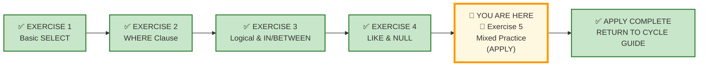
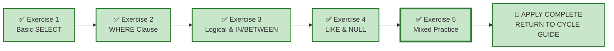

# 🗄️🤖 SQL & GenAI Course
**🎯 Quality Education for Anyone, Anywhere, Anytime — 💫 with Comfort, Convenience at no Cost**

---

## 🧪 Exercise 5: Mixed Practice (Apply Augmented skills and deliver)

Welcome to your final **APPLY Phase** challenge. You have mastered every concept across multiple domains. Now, you step into **FinVERSE** – a modern digital banking ecosystem.

All your skills are on the table: `SELECT`, `WHERE`, `LIKE`, `NULL`, `IN`, `BETWEEN`, logical operators, and more. The training wheels are gone. From this point forward, every business problem expects both technical correctness and professional judgment. There is no mirror. There is no home turf. There is only a **new consulting engagement** inside a financial organisation.

**ACQUIRE → AUGMENT → APPLY**  
🔧 **ACQUIRE:** Learn syntax  
⚖️ **AUGMENT:** Judge correctness  
🚀 **APPLY:** Deliver outcome

---

## 🌌 SQLVerse Check-In

<div style="border-left: 4px solid #9c27b0; background-color: #f3e5f5; padding: 15px; margin: 20px 0; border-radius: 0 8px 8px 0;">

You have navigated E‑Store, Hospital Planet, and Real Estate Planet. You have survived structural fractures, ambiguous requests, and executive‑level design challenges.

Now you enter **FinVERSE** – the financial universe inside SQLVerse.

This is not a bank. This is a **digital‑first** ecosystem where customers hold accounts, transact with merchants, use cards, take loans, and raise support tickets. Every request comes from a real department: Fraud, Risk, Credit, Finance, Support, or the Executive Office.

**This is the pinnacle of your APPLY journey.**

Every concept you have learned – pattern matching, NULL detection, range filtering, set membership, logical operators – will be tested in a single, cohesive domain.

**The domain is new. The logic is not.**

### 🔁 The Progression

| Stage | What You'll Experience |
|-------|------------------------|
| **Product Stage** | Clear, structured requests to build confidence in FinVERSE. |
| **Consulting Stage** | Interpret business language and select the right columns. |
| **Ambiguity Chamber** | Vague requests where multiple defensible solutions exist. |
| **Executive Desk** | A high‑stakes, open‑ended report where you own every assumption. |

**From this point onward, success is measured not only by writing correct SQL, but by making sound business decisions when the requirements are incomplete.**

</div>

---

## 📍 Your Current Stage – APPLY Journey



---

## 🔧 Browser Office for APPLY

| Tab | Purpose | What to Do |
| :--- | :--- | :--- |
| **1: The Map** | Open this exercise file | You are here – reading this file. Complete the business requests below. |
| **2: The Factory** | Run queries | Load [`finverse.db`](./Module2-Schemas/finverse.db) for all sections. |
| **3: The Consultant** | Socratic questioning (no code) | Explains logic, suggests strategies – **never writes SQL**. Follow the **3‑Attempt Rule**. |
| **4: The Vault** | Save your work | Save each deliverable. Log any AI hallucinations. |

> **Professional Habit:** Understand the data model before you query it – **Professional SQL developers** do that.

---

## 🏛️ Meet Your APPLY Resource Repository

The **APPLY Resource Repository** is your central hub for all databases, ER diagrams, and schema guides used throughout the **APPLY cycle.** Each time you begin a new exercise, you will return here to load the required database and study its blueprint.

### 🗄️ Repository Artifacts

**All resources** used throughout this **APPLY cycle** are located in the APPLY Resource Repository:

1. **Customized E-Store database** – `level1_estore_apply.db` (extended dataset with NULLs, bulk orders, new categories)
2. **APPLY exercise databases** – domain‑specific datasets (e.g., `hospital_planet.db`, `real_estate_planet.db`, `finverse.db`)
3. **ER Diagrams and Schema Guides** – Blueprint files for every database (e.g., `E-Store_APPLY_Blueprint.md`, `FinVERSE_Blueprint.md`)

### 📂 APPLY Resource Repository Location
```
Module5-GenAI-Walkthrough/02-Exercises/MODULE2/Module2-Schemas/
```

---

## 🏦 A Day in FinVERSE

Your consultancy has been embedded with **FinVERSE** – a modern digital banking ecosystem. The client has engaged you to extract insights from their operational data.

You will receive a mix of requests from different departments:
- **Customer Success**
- **Fraud Detection**
- **Credit Team**
- **Finance**
- **Support**
- **Executive Office**

The client does not speak in SQL operators. They speak in business language. Your job is to translate that into clean, defensive SQL.

Before solving the requests, spend a few minutes understanding the business model, workflow, ER diagram, and table schemas.

---

### FinVERSE Data model

**📁 Database:** Load [`finverse.db`](./Module2-Schemas/finverse.db) in **Tab 2 (The Factory)** before starting this section.

**🗺️ ER Diagram & Schema Guide:** Study [`FinVERSE_Blueprint.md`](./Module2-Schemas/FinVERSE_Blueprint.md) before writing any SQL.

**Business first. Data model second. SQL third.**

### 📋 Meet Your Dataset: FinVERSE – Digital Banking Ecosystem

| Table | Columns | What It Tells Us |
|-------|---------|------------------|
| `customers` | `customer_id`, `first_name`, `last_name`, `email`, `phone`, `kyc_status`, `risk_score`, `onboarding_date`, `status` | Customer identity, verification, and risk profile |
| `accounts` | `account_id`, `customer_id`, `account_type`, `balance`, `status` | Customer accounts with balances and types |
| `transactions` | `transaction_id`, `account_id`, `merchant_id`, `amount`, `transaction_type`, `transaction_date`, `status`, `is_fraud` | Money movement – payments, transfers, purchases |
| `cards` | `card_id`, `account_id`, `card_type`, `card_number`, `expiry_date`, `status` | Debit and credit cards linked to accounts |
| `loans` | `loan_id`, `customer_id`, `principal`, `interest_rate`, `tenure_months`, `outstanding_balance`, `status`, `approval_date` | Loan products with repayment tracking |
| `loan_payments` | `payment_id`, `loan_id`, `amount`, `payment_date`, `payment_method`, `status` | Installment payments against loans |
| `merchants` | `merchant_id`, `name`, `category`, `settlement_type`, `status` | Businesses that accept payments |
| `support_tickets` | `ticket_id`, `customer_id`, `employee_id`, `ticket_type`, `status`, `created_date`, `resolved_date` | Customer support issues |
| `employees` | `employee_id`, `first_name`, `last_name`, `role`, `manager_id`, `branch_id` | FinVERSE staff |
| `branches` | `branch_id`, `name`, `city`, `state`, `status` | Physical or virtual service locations |

---

## 🏢 Product Stage – Guided Implementations (The Engine Room)

### ⚙️ SQLVerse Execution Focus

### Request 1 – Customers with Incomplete KYC

**Business Context:** The Compliance Team needs a list of customers whose KYC status is either `Pending` or `Incomplete`. They are prioritising follow‑up.

**Your Deliverable:** Write a query that returns the relevant customer details.

---

### Request 2 – High‑Risk Customers

**Business Context:** The Risk Team wants to monitor customers with a `High` risk score. They need to review these accounts.

**Your Deliverable:** Write a query that returns the relevant customer details.

---

## 🎭 Consulting Stage – The Interpretation Zone
### 🧩 SQLVerse Translation Focus

*In production, clients don't speak in SQL operators. Translate these real‑world scenarios into defensive queries.*

---
### Challenge 3 – The Ghost Accounts

**Business Context:** The Risk Team is running an audit for Know Your Customer (KYC) compliance. They need to flag active or dormant accounts that are missing **both** an email address **and** a phone number so the account managers can freeze them.

**Why This Matters:** Incomplete contact records are a compliance risk. Identifying these ghost accounts allows the Risk Team to freeze them before they are used for unauthorised activity.

**Your Deliverable:** Write a query that returns all customer details for customers whose `status` is either `Active` or `Dormant` with **missing contact details.**

---

### Challenge 4 – The High-Risk Merchant Clean-up

**Business Context:** The Payments Team wants to audit vendors in high-frequency consumer sectors. They are tracking down merchants in the **Food** or **Retail** categories whose accounts are fully operational, but are excluded from the streamlined "Daily" settlement schedule.

**Why This Matters:** Merchants on non-daily settlement schedules carry higher operational risk. Understanding which active vendors are excluded from Daily settlement helps the Payments Team prioritise reconciliation efforts.

**Your Deliverable:** Write a filtered query that returns the relevant merchant details.

> 💡 **Production Insight:** Your query may legitimately return zero rows. In production, this often answers the business question just as effectively as returning hundreds of rows. An empty result set is evidence that no current records satisfy the requested conditions—not that your SQL is incorrect.

---

### Challenge 5 – The Q1 High-Value Alert

**Business Context:** The Fraud Analytics team noticed a pattern of high-dollar asset shifting at the start of 2025. They need a list of all successful transactions over **$1,000.00** that occurred during the first two months of the year.

**Why This Matters:** Early‑year transaction patterns often indicate emerging fraud vectors. This list will help the Fraud Analytics team identify suspicious accounts for immediate investigation.

**Your Deliverable:** Write a filtered query to extract the necessary transactions. 

---

### Challenge 6 – The Shadow Pipeline

**Business Context:** The Credit Team wants to evaluate high-exposure risk. They are looking for active loans with an outstanding balance between **$200,000 and $800,000** that carry an interest rate higher than **9%**, ensuring they capture accounts generating major yield but carrying high volatility.

**Why This Matters:** Loans in this range represent the Credit Team's highest‑exposure portfolio segment. Identifying them allows the team to monitor for early default signals and adjust risk provisioning.

**Your Deliverable:** Write a filtered query to fetch the necessary details.

**Expected Result Preview:**

| loan_id | principal | interest_rate | outstanding_balance |
|---------|-----------|---------------|---------------------|
| 1 | 500000.00 | 10.5 | 380000.00 |
| 2 | 300000.00 | 12.0 | 220000.00 |
| 6 | 400000.00 | 11.0 | 350000.00 |
| 8 | 600000.00 | 9.5 | 540000.00 |
| 9 | 250000.00 | 13.0 | 230000.00 |

---

### Challenge 7 – Escalation Bottleneck

**Business Context:** The Support Center is swamped. The Support Director needs a clean dashboard view of all unresolved customer tickets that haven't been claimed by an agent yet, sorted so the oldest high‑priority items can be manually pushed to managers.

**Why This Matters:** Unassigned open tickets represent a bottleneck in the customer support workflow. Identifying the oldest unassigned tickets allows the Support Director to escalate them before they breach service‑level agreements.

**Your Deliverable:** Write a filtered query to return the unresolved support tickets.

---

## 🧠 Ambiguity Chamber – The Decision Lab

### 🎯 SQLVerse Judgment Focus

*In production, clients don't give you complete requirements. They give you vague business problems. You must interpret, decide, and defend.*

---

### Request 8 – "Inactive but Active" Accounts

> **Email from Relationship Manager:** *"We have some accounts that show as 'Active' but haven't had any transactions in months. Can you find those? I'm not sure exactly how long is too long – just give me a list that makes sense for our branch review."*

**Your Deliverable:** Write a query that returns your interpretation of "inactive but active" accounts. Define your criteria, write the query, and document your assumptions in a comment block.

---

### Request 9 – "High‑Potential Customers"

> **Memo from Sales Director:** *"I need a list of our most promising customers – the ones who are really driving value. Just send me the list."*

**Your Deliverable:** Write a query that returns your interpretation of "high‑potential" customers. Define your criteria, write the query, and document your assumptions in a comment block.

---

## 📐 Executive Desk – Design Review Room

### 🏛️ SQLVerse Design Focus

### Request 10 – Executive Loan Portfolio Report

**Context:** The Chief Revenue Officer (CRO) is preparing a quarterly review of the loan portfolio. She wants to identify loans with **good revenue generating potential** – loans that are delivering strong yield while maintaining acceptable risk exposure.

**The Prompt:**

> *"I need a clean, professional report of our loan portfolio that highlights the best revenue-generating opportunities. Show me which loans are worth keeping on the books and which ones we should reconsider. I need this for the revenue review meeting."*

**Key Considerations:**
- Define what "good revenue generating potential" means in the context of a loan portfolio.
- Choose columns that matter for revenue analysis.
- Decide which loan attributes indicate strong revenue potential.
- Decide which attributes indicate risk or low potential.
- Apply appropriate filters.
- Sort the results to highlight the most attractive opportunities first.
- Use clear, business‑friendly aliases.
- Add a comment block explaining your assumptions.

**Deliverable:** A clean report showing your interpretation of "good revenue generating potential" loans.

**Architectural Reflection:** Your assumptions about what defines revenue potential – whether it's high interest rate, large principal, low risk, or a combination of factors – will shape your query. Defend your choices.

---

## ✅ A Day at Work – Progress Check

Review your engineering output before committing queries to your repository log tracker.

| Time | Deliverable | Stage | Status |
|------|-------------|-------|--------|
| 09:00 AM | Request 1 – Customers with Incomplete KYC | Product | ☐ |
| 10:00 AM | Request 2 – High‑Risk Customers | Product | ☐ |
| 11:00 AM | Challenge 3 – The Ghost Accounts | Consulting | ☐ |
| 12:00 PM | Challenge 4 – The High-Risk Merchant Clean-up | Consulting | ☐ |
| 01:00 PM | Challenge 5 – The Q1 High-Value Alert | Consulting | ☐ |
| 02:00 PM | Challenge 6 – The Shadow Pipeline | Consulting | ☐ |
| 03:00 PM | Challenge 7 – Escalation Bottleneck | Consulting | ☐ |
| 04:00 PM | Request 8 – "Inactive but Active" Accounts | Ambiguity | ☐ |
| 05:00 PM | Request 9 – "High‑Potential Customers" | Ambiguity | ☐ |
| 06:00 PM | Request 10 – Executive Loan Portfolio Report | Executive | ☐ |

**Reflection:** Which assumption had the greatest impact on your final SQL, and how might another analyst reasonably reach a different conclusion?

---

## 🔁 Bridge Forward

You have completed all APPLY exercises for Module 2. You have applied every concept from the ACQUIRE phase across multiple domains, and you have handled and aced ambiguity like a consulting professional.

Now, return to the Cycle Guide to begin the AUDIT phase for these exercises.

➡️ [Return to Cycle Guide](../CYCLE1_GUIDE.md)

---

## 🧭 File Navigation



| Previous Step | Next Step |
|:---:|:---:|
| [← Return to Exercise 4: LIKE & NULL](./4-like-and-null-LAB.md) | [Return to Cycle Guide →](../CYCLE1_GUIDE.md) |

---

*Part of our mission for 🎯 Quality Education for Anyone, Anywhere, Anytime — 💫 with Comfort, Convenience at no Cost.*

**Level 1 | ACCELERATE Phase | APPLY | Module 2 | File 5**
