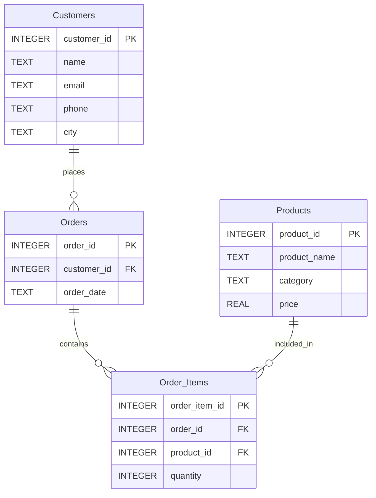

# 🗄️🤖 SQL & GenAI Course
**🎯 Quality Education for Anyone, Anywhere, Anytime — 💫 with Comfort, Convenience at no Cost**

---

# 🗄️📊 E-Store APPLY Blueprint

## 📌 Purpose

This document describes the **customized E‑Store database** used throughout the **APPLY phase** of the SQLVerse course.

The schema is identical to the ACQUIRE version. Only the data has evolved – introducing NULLs, bulk orders, new categories, and production‑style edge cases.

**Same schema. Different data. Different business outcomes.**

---

## 📊 Entity Relationship Diagram (ERD)

---

## 🗂️ Table Schemas

### `customers`

| Column | Type | Nullable | Description |
|--------|------|----------|-------------|
| `customer_id` | INTEGER | No | Primary key – unique customer identifier |
| `name` | TEXT | No | Customer full name |
| `email` | TEXT | Yes | Customer email address – **some NULLs for production realism** |
| `phone` | TEXT | Yes | Customer phone number – **some NULLs for production realism** |
| `city` | TEXT | No | Customer city of residence |

---

### `products`

| Column | Type | Nullable | Description |
|--------|------|----------|-------------|
| `product_id` | INTEGER | No | Primary key – unique product identifier |
| `product_name` | TEXT | No | Product display name |
| `category` | TEXT | No | Product category – `Electronics`, `Appliances`, `Books`, `Furniture` |
| `price` | REAL | No | Product price in USD |

---

### `orders`

| Column | Type | Nullable | Description |
|--------|------|----------|-------------|
| `order_id` | INTEGER | No | Primary key – unique order identifier |
| `customer_id` | INTEGER | No | Foreign key to `customers.customer_id` – who placed the order |
| `order_date` | TEXT | No | Order date in `YYYY-MM-DD` format |

**Foreign Key:** `customer_id` → `customers(customer_id)`

---

### `order_items`

| Column | Type | Nullable | Description |
|--------|------|----------|-------------|
| `order_item_id` | INTEGER | No | Primary key – unique line item identifier |
| `order_id` | INTEGER | No | Foreign key to `orders.order_id` – which order |
| `product_id` | INTEGER | No | Foreign key to `products.product_id` – which product |
| `quantity` | INTEGER | No | Number of units purchased |

**Foreign Keys:**
- `order_id` → `orders(order_id)`
- `product_id` → `products(product_id)`

---

## 🔗 Key Relationships

| Relationship | Cardinality | Explanation |
|--------------|-------------|-------------|
| `customers` → `orders` | One‑to‑Many | One customer can place many orders |
| `orders` → `order_items` | One‑to‑Many | One order can contain many line items |
| `products` → `order_items` | One‑to‑Many | One product can appear in many orders |

---

## 📊 Sample Data Highlights

| Feature | Example | Purpose |
|---------|---------|---------|
| **NULL emails** | Frank Turner, Grace Martin | Enables `IS NULL` / `IS NOT NULL` exercises |
| **NULL phones** | Bob Johnson, David Kim | Creates rich NULL combinations |
| **Duplicate cities** | Boston (2x), Chicago (3x), New York (2x) | Enables meaningful `DISTINCT` exercises |
| **Bulk orders** | Quantity 5 (Alice), Quantity 6 (Henry) | Enables `>=` comparison exercises |
| **Furniture category** | Desk, Chair | Enables category‑based filtering beyond Electronics |
| **Date spread** | Orders across October 1–15 | Enables `BETWEEN` date range exercises |

---

## 🧠 Pedagogical Design Notes

- **NULL handling** – Customers 6 (Frank) and 7 (Grace) have NULL emails; Customers 2 (Bob) and 4 (David) have NULL phones.
- **DISTINCT** – Cities repeated intentionally to make `SELECT DISTINCT city` meaningful.
- **Comparison operators** – Prices (45–1200) and quantities (1–6) support `>`, `>=`, `<`, `<=`, `=`, `<>` exercises.
- **BETWEEN** – Dates span October 1–15, supporting date range exercises.
- **LIKE** – Names include varied patterns (Alice, Bob, Charlie, etc.).
- **Aliases** – Column names support `AS` alias exercises.
- **JOINs** – Additional products and orders enable multi‑table JOIN exercises.

---

## 🎯 SQLVerse Architect's Checklist

Before writing SQL, professional developers usually answer three questions:

1. **Where does this information live?**
   Identify the table that owns the requested business data.

2. **Will one table be sufficient?**
   Decide whether the business request requires relationships across multiple tables.

3. **What exactly is the business asking to see?**
   Separate the required output from the business story.

> **Blueprint Reminder:** This document helps you understand the data model before you begin querying it. Understanding the structure first usually leads to simpler and more accurate SQL.

---

*Part of our mission for 🎯 Quality Education for Anyone, Anywhere, Anytime — 💫 with Comfort, Convenience at no Cost.*

**SQLVerse customized E-store blueprint | Level 1 | ACCELERATE Phase | APPLY Cycle**
