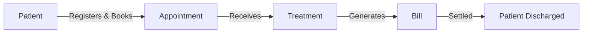
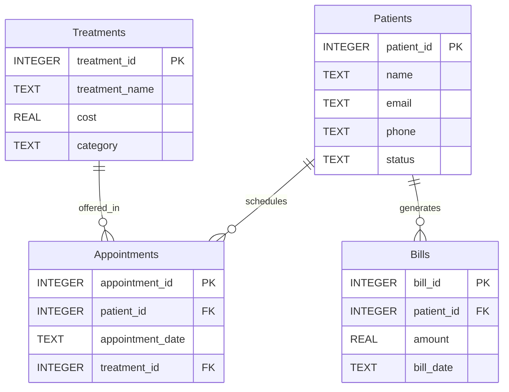

# 🗄️🤖 SQL & GenAI Course
**🎯 Quality Education for Anyone, Anywhere, Anytime — 💫 with Comfort, Convenience at no Cost**

---

# 🗄️📊 Hospital Planet Blueprint

## 📌 Purpose

This document describes the **Hospital Planet database** – the first Production Echo domain introduced in the APPLY phase.

Hospital Planet mirrors the E‑Store structure with domain‑specific entities: patients, appointments, treatments, and bills. The SQL patterns remain identical – only the nouns change.

**This is your first domain leap. The SQL stays the same.**

---

## 🌍 Business Landscape Through a Consultant's Lens

Unlike E‑Store, Hospital Planet does not follow a "customer → order → item" pattern. The hospital lifecycle involves patient registration, appointments, treatments, billing, and discharge – a sequential process that mirrors real‑world healthcare operations.

### 🏢 Meet the Business

**Hospital Planet is a hospital information system.**

Here is how the business operates:

- **Patients register** when they first visit the hospital.
- **Patients book appointments** with doctors.
- **Doctors perform treatments** (consultations, tests, surgeries).
- **The finance department generates bills** for treatments.
- **Once bills are settled, the patient is considered discharged.**



> 💡 **Your responsibility is not to understand medical procedures.** Your responsibility is to understand how information flows through the hospital system.

---

**The Core Stakeholders:**

| Entity | Role |
|--------|------|
| **Patients** | Individuals receiving medical care. They register, book appointments, undergo treatments, and settle bills. |
| **Appointments** | Scheduled interactions between a patient and a healthcare provider. They mark the start of a treatment episode and link to the treatment performed. |
| **Treatments** | Medical services provided to patients – consultations, diagnostic tests, surgeries, or therapies. |
| **Bills** | Financial records generated after treatment. Settlement of bills completes the discharge process. |

---

### 🌊 Typical Business Events

| Event | Explanation & Actors |
|-------|----------------------|
| **Patient Registers** | A new patient is added to the system with their contact details. *(Actor: Patient)* |
| **Appointment Booked** | A patient schedules a visit with a doctor. *(Actor: Patient, Receptionist)* |
| **Treatment Performed** | A medical service is delivered – consultation, test, or surgery. *(Actor: Doctor)* |
| **Bill Generated** | The finance department creates an invoice for the treatment(s). *(Actor: Finance)* |
| **Discharge Completed** | The patient settles the bill and is formally discharged. *(Actor: Finance, Patient)* |

---

### 📖 Business Vocabulary

| Term | Meaning |
|------|---------|
| **Patient** | An individual receiving medical care at the hospital. |
| **Appointment** | A scheduled booking for a patient to see a doctor. Each appointment is linked to a specific treatment. |
| **Treatment** | A medical service provided – consultation, diagnostic test, surgery, or rehabilitation. |
| **Bill** | An invoice generated for treatments received by a patient. |
| **Discharge** | The formal release of a patient after their bill is settled. |
| **Status** | Indicates whether a patient is `Active`, `Inactive`, or `Admitted` – used to track patient state. |
| **Category** | The clinical department of a treatment – `Primary Care`, `Diagnostic`, `Surgical`, `Rehabilitation`, `Pharmacy`, `Preventative`, `Cardiology`, `Neurology`, or `Surgery`. |

> **📌 Design Note – Discharge Proxy:**
>
> In this model, **bill settlement is used as the operational proxy for discharge**. A patient is considered discharged when their bill is fully settled. This is a common pattern in real‑world systems where a single business event (bill payment) signals completion of a broader process.

---

### 🔄 Observe the Business Workflow

A patient's journey flows through the system in a specific sequence:

```text
Patient Registers
        ↓
Appointment Booked
        ↓
Treatment Performed
        ↓
Bill Generated
        ↓
Discharge Completed (Bill Settled)
```

Each step in this workflow is represented by one or more tables in the database.

---

### 🧠 Before Looking at the Tables

Ask yourself three business questions:

1. **Where does a patient first enter the system?**
   → What table stores patient registration?

2. **How are patient visits and services recorded?**
   → Which tables track appointments and treatments?

3. **What business event signals the end of the patient journey?**
   → What table records bill settlement and discharge?

---

### 🔍 Now Start Reading the Blueprint

With these questions in mind, study the ER diagram and table schemas below. The database is designed to mirror the hospital workflow you just traced. Your task is to identify which table stores each business event.

**Business first. Data model second. SQL third.**

---

## 📊 Entity Relationship Diagram (ERD)



---

## 🗂️ Table Schemas

### `patients`

| Column | Type | Nullable | Description |
|--------|------|----------|-------------|
| `patient_id` | INTEGER | No | Primary key – unique patient identifier |
| `name` | TEXT | No | Patient full name |
| `email` | TEXT | No | Patient email address |
| `phone` | TEXT | Yes | Patient phone number – **some NULLs for realism** |
| `status` | TEXT | No | Current patient status – `Active`, `Inactive`, or `Admitted` |

---

### `treatments`

| Column | Type | Nullable | Description |
|--------|------|----------|-------------|
| `treatment_id` | INTEGER | No | Primary key – unique treatment identifier |
| `treatment_name` | TEXT | No | Name of the medical service |
| `cost` | REAL | No | Cost of the treatment in credits |
| `category` | TEXT | No | Clinical department – `Primary Care`, `Diagnostic`, `Surgical`, `Rehabilitation`, `Pharmacy`, `Preventative`, `Cardiology`, `Neurology`, or `Surgery` |

---

### `appointments`

| Column | Type | Nullable | Description |
|--------|------|----------|-------------|
| `appointment_id` | INTEGER | No | Primary key – unique appointment identifier |
| `patient_id` | INTEGER | No | Foreign key to `patients.patient_id` – who booked the appointment |
| `appointment_date` | TEXT | No | Appointment date in `YYYY-MM-DD` format |
| `treatment_id` | INTEGER | Yes | Foreign key to `treatments.treatment_id` – which treatment was performed |

**Foreign Keys:**
- `patient_id` → `patients(patient_id)`
- `treatment_id` → `treatments(treatment_id)`

---

### `bills`

| Column | Type | Nullable | Description |
|--------|------|----------|-------------|
| `bill_id` | INTEGER | No | Primary key – unique bill identifier |
| `patient_id` | INTEGER | No | Foreign key to `patients.patient_id` – who was billed |
| `amount` | REAL | No | Bill amount in credits – **includes outliers (< 50 and > 5000)** |
| `bill_date` | TEXT | No | Bill date in `YYYY-MM-DD` format |

**Foreign Key:** `patient_id` → `patients(patient_id)`

---

## 🔗 Key Relationships

| Relationship | Cardinality | Explanation |
|--------------|-------------|-------------|
| `patients` → `appointments` | One‑to‑Many | One patient can have many appointments |
| `patients` → `bills` | One‑to‑Many | One patient can have many bills |
| `treatments` → `appointments` | One‑to‑Many | One treatment can be offered in many appointments |

---

## 📊 Sample Data Highlights 

| Feature | Example | Purpose |
|---------|---------|---------|
| **NULL phones** | Patients 3, 6, 11, 12 | Enables `IS NULL` exercises |
| **Status: Admitted** | Patients 11, 12 | Enables status‑based filtering with `Admitted` |
| **Cardiology/Neurology** | Cardiology Consultation, Neurology Consultation | Supports high‑cost specialty filtering |
| **Surgery category** | Surgery - Minor, Surgery - Major | Supports `Surgery` category filtering |
| **Outlier bills** | Bill #13 (25.00), Bill #14 (6000.00) | Supports `< 50` or `> 5000` exercises |
| **Date‑range bills** | Bills across Jan–May, including March 1‑7 | Supports `BETWEEN` date range exercises |
| **Multiple bills per patient** | Patient 1 (2 bills), Patient 2 (2 bills), Patient 13 (2 bills) | Supports `GROUP BY`, `SUM`, `COUNT`, `HAVING` |
| **Multiple appointments per patient** | Patient 1, 2, 13 have 2 appointments each | Supports `GROUP BY`, `COUNT` |
| **Appointments linked to treatments** | `treatment_id` FK in appointments | Supports `JOIN` between appointments and treatments |

---

## 🧠 Pedagogical Design Notes

- **Mirror structure** – Hospital Planet mirrors E‑Store: `patients` → `customers`, `treatments` → `products`, `appointments` → `orders`, `bills` → `order_items`.
- **NULL handling** – Patients 3, 6, 11, 12 have NULL phones; practise `IS NULL`.
- **Status filtering** – `Active`, `Inactive`, `Admitted` – supports `=`, `!=`, `IN`.
- **Category filtering** – `Cardiology`, `Neurology`, `Surgery`, plus existing categories – supports category‑based filtering.
- **Comparison operators** – Costs range from 25 to 6000; supports `>`, `>=`, `<`, `<=`, `=`, `<>`.
- **BETWEEN** – Dates span Jan–May; supports date range exercises.
- **LIKE** – Names include varied patterns; `LIKE '%th'` returns at least 2 rows (John Smith, Elizabeth).
- **Aliases** – Column names support `AS`.
- **JOIN readiness** – `appointments` now has a foreign key to `treatments`, enabling multi‑table joins across patients, appointments, treatments, and bills.
- **Aggregation readiness** – Multiple bills per patient and multiple appointments per patient support `GROUP BY`, `SUM`, `COUNT`, `HAVING` in later modules.

---

## 🎯 SQLVerse Architect's Checklist

Before writing SQL, professional developers usually answer three questions:

1. **Where does this information live?**
   Identify the table that owns the requested business data – patients, appointments, treatments, or bills.

2. **Will one table be sufficient?**
   Decide whether the business request requires relationships across multiple tables.

3. **What exactly is the business asking to see?**
   Separate the required output from the business story.

> **Blueprint Reminder:** This document helps you understand the data model before you begin querying it. Understanding the structure first usually leads to simpler and more accurate SQL.

---

*Part of our mission for 🎯 Quality Education for Anyone, Anywhere, Anytime — 💫 with Comfort, Convenience at no Cost.*

**SQLVerse Hospital Planet Blueprint | Level 1 | ACCELERATE Phase | APPLY Cycle**