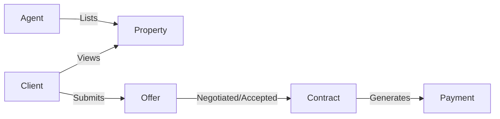
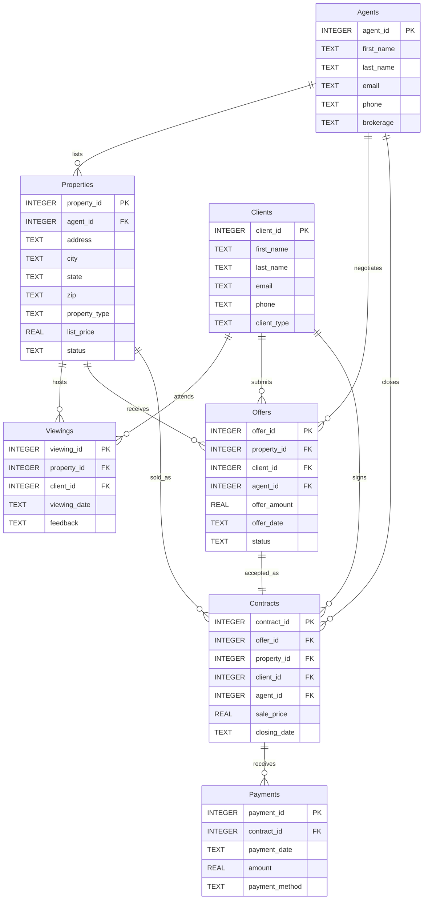

# 🗄️🤖 SQL & GenAI Course
**🎯 Quality Education for Anyone, Anywhere, Anytime — 💫 with Comfort, Convenience at no Cost**

---

# 🗄️📊 Real Estate Planet Blueprint

## 📌 Purpose

This document describes the **Real Estate Planet database** – the first domain that completely breaks the 4‑table E‑Store mirror.

Real estate workflows are naturally richer: properties, clients, agents, viewings, offers, contracts, and payments. The student cannot rely on structural memory – they must read the schema, understand the business workflow, and identify relationships independently.

**This is where the mirror disappears. From this point onward, every new planet must be understood before it can be queried. Welcome to your first consulting engagement.**

---

## 🌍 Business Landscape Through a Consultant's Lens

Unlike E‑Store or Hospital Planet, Real Estate Planet does not follow a simple "customer → order → item" pattern. The real estate lifecycle involves multiple stakeholders, sequential events, and independent business entities.

### 🏢 Meet the Business

**Real Estate Planet is a property brokerage organization.**

Here is how the business operates:

- **Properties are listed by agents.**
- **Clients visit properties** before deciding whether to purchase.
- **Interested clients submit offers.**
- **Accepted offers become legally binding contracts.**
- **Payments are made** according to the signed contract.



> 💡 **Your responsibility is not to sell houses.** Your responsibility is to understand how information flows through the business.

---

**The Core Stakeholders:**

| Entity | Role |
|--------|------|
| **Agents** | Licensed professionals who list properties, negotiate offers, and close contracts. Each property is managed by one listing agent. |
| **Clients** | Buyers, sellers, or both. They view properties, make offers, and ultimately sign contracts. |
| **Properties** | The physical asset being bought or sold. Each property is listed by one agent and has a status (Active, Pending, Sold, Withdrawn). |

---

### 🌊 Typical Business Events

| Event | Explanation & Actors |
|-------|----------------------|
| **Property Listed** | An agent registers a new property on the market. *(Actor: Agent)* |
| **Client Views Property** | A potential buyer visits a property in person. *(Actors: Client, Agent)* |
| **Offer Submitted** | A client makes a formal purchase offer through their agent. *(Actors: Client, Agent)* |
| **Offer Negotiated** | The seller's agent responds to the offer—accepted, rejected, or countered. *(Actor: Agent)* |
| **Contract Signed** | An accepted offer becomes a legally binding sales contract. *(Actors: Client, Agent)* |
| **Payments Received** | The buyer makes payments (earnest deposit, closing funds) against the contract. *(Actors: Client, Payment System)* |

---

### 📖 Business Vocabulary

| Term | Meaning |
|------|---------|
| **Listing** | A property that is actively available for sale. |
| **Viewing** | A scheduled appointment for a client to tour a property. |
| **Offer** | A formal proposal from a buyer to purchase a property at a specified price. |
| **Contract** | A legally binding agreement that finalises the sale after an offer is accepted. |
| **Closing** | The final step of a real estate transaction—ownership transfers and payments are settled. |
| **Commission** | The fee paid to the agent (typically a percentage of the sale price) for facilitating the deal. |
| **Mortgage** | Bank financing used by the buyer to fund the purchase. (Not stored in the database but appears in business language.) |

> **📌 Design Note – Commission:**
>
> In this simplified model, we assume the seller pays the commission directly to the listing agent. This is a real‑world scenario often seen in desperate seller situations.
>
> We are deliberately not modelling buyer's agent commissions, split commissions, or multi‑agent payouts in Level 1. These complexities will be introduced in **Level 2** after you have covered **Window Functions**, where we can handle them cleanly without overcomplicating the current schema.
>
> For now, commission is treated as a business cost borne by the seller and reflected in the `sale_price`. We do not store it as a separate column or table.

---

### 🔄  Observe the Business Workflow

A deal flows through the system in a specific sequence:

```text
Property Listed
        ↓
Client Views Property
        ↓
Offer Submitted
        ↓
Offer Negotiated
        ↓
Contract Signed
        ↓
Payments Received
```

Each step in this workflow is represented by one or more tables in the database.

---

### 🧠 Before Looking at the Tables

Ask yourself three business questions:

1. **Where does a property first enter the system?**
   → What table stores a new listing?

2. **Who interacts with the property throughout the process?**
   → Which tables track client interest, agent involvement, and property status?

3. **Which business event ultimately produces revenue?**
   → What table records the final sale and payments?

---

### 🔍 Now Start Reading the Blueprint

With these questions in mind, study the ER diagram and table schemas below. The database is designed to mirror the business workflow you just traced. Your task is to identify which table stores each business event.

**Business first. Data model second. SQL third.**

---

## 📊 Entity Relationship Diagram (ERD)



---

## 🗂️ Table Schemas

### `agents`

| Column | Type | Nullable | Description |
|--------|------|----------|-------------|
| `agent_id` | INTEGER | No | Primary key – unique agent identifier |
| `first_name` | TEXT | No | Agent's first name |
| `last_name` | TEXT | No | Agent's last name |
| `email` | TEXT | Yes | Email address – **some NULLs for realism** |
| `phone` | TEXT | Yes | Phone number – **some NULLs for realism** |
| `brokerage` | TEXT | No | Brokerage firm name |

---

### `clients`

| Column | Type | Nullable | Description |
|--------|------|----------|-------------|
| `client_id` | INTEGER | No | Primary key – unique client identifier |
| `first_name` | TEXT | No | Client's first name |
| `last_name` | TEXT | No | Client's last name |
| `email` | TEXT | Yes | Email address – **some NULLs for realism** |
| `phone` | TEXT | Yes | Phone number – **some NULLs for realism** |
| `client_type` | TEXT | No | Type – `Buyer`, `Seller`, or `Both` |

---

### `properties`

| Column | Type | Nullable | Description |
|--------|------|----------|-------------|
| `property_id` | INTEGER | No | Primary key – unique property identifier |
| `agent_id` | INTEGER | No | Foreign key to `agents.agent_id` – listing agent |
| `address` | TEXT | No | Street address |
| `city` | TEXT | No | City of the property |
| `state` | TEXT | No | State (e.g., CA, TX, NY) |
| `zip` | TEXT | Yes | Postal code – **some NULLs for realism** |
| `property_type` | TEXT | No | Type – `Single-Family`, `Condo`, `Multi-Family`, `Land`, `Commercial` |
| `list_price` | REAL | No | Current asking price |
| `status` | TEXT | No | Listing status – `Active`, `Pending`, `Sold`, `Withdrawn` |

**Foreign Key:** `agent_id` → `agents(agent_id)`

---

### `viewings`

| Column | Type | Nullable | Description |
|--------|------|----------|-------------|
| `viewing_id` | INTEGER | No | Primary key – unique viewing appointment |
| `property_id` | INTEGER | No | Foreign key to `properties.property_id` – which property |
| `client_id` | INTEGER | No | Foreign key to `clients.client_id` – who viewed it |
| `viewing_date` | TEXT | No | Date of the viewing (YYYY-MM-DD) |
| `feedback` | TEXT | Yes | Client feedback – **some NULLs for realism** |

**Foreign Keys:**
- `property_id` → `properties(property_id)`
- `client_id` → `clients(client_id)`

---

### `offers`

| Column | Type | Nullable | Description |
|--------|------|----------|-------------|
| `offer_id` | INTEGER | No | Primary key – unique offer identifier |
| `property_id` | INTEGER | No | Foreign key to `properties.property_id` – which property |
| `client_id` | INTEGER | No | Foreign key to `clients.client_id` – who made the offer |
| `agent_id` | INTEGER | No | Foreign key to `agents.agent_id` – which agent handled it |
| `offer_amount` | REAL | No | Amount offered in USD |
| `offer_date` | TEXT | No | Date the offer was made (YYYY-MM-DD) |
| `status` | TEXT | No | Offer status – `Pending`, `Accepted`, `Rejected`, `Withdrawn` |

**Foreign Keys:**
- `property_id` → `properties(property_id)`
- `client_id` → `clients(client_id)`
- `agent_id` → `agents(agent_id)`

---

### `contracts`

| Column | Type | Nullable | Description |
|--------|------|----------|-------------|
| `contract_id` | INTEGER | No | Primary key – unique contract identifier |
| `offer_id` | INTEGER | No | Foreign key to `offers.offer_id` – accepted offer |
| `property_id` | INTEGER | No | Foreign key to `properties.property_id` – property sold |
| `client_id` | INTEGER | No | Foreign key to `clients.client_id` – buyer |
| `agent_id` | INTEGER | No | Foreign key to `agents.agent_id` – closing agent |
| `sale_price` | REAL | No | Final agreed sale price |
| `closing_date` | TEXT | No | Date the contract closed (YYYY-MM-DD) |

**Foreign Keys:**
- `offer_id` → `offers(offer_id)`
- `property_id` → `properties(property_id)`
- `client_id` → `clients(client_id)`
- `agent_id` → `agents(agent_id)`

---

### `payments`

| Column | Type | Nullable | Description |
|--------|------|----------|-------------|
| `payment_id` | INTEGER | No | Primary key – unique payment identifier |
| `contract_id` | INTEGER | No | Foreign key to `contracts.contract_id` – which contract |
| `payment_date` | TEXT | No | Date payment was received (YYYY-MM-DD) |
| `amount` | REAL | No | Payment amount in USD |
| `payment_method` | TEXT | No | Method – `Wire`, `Cash`, `Check`, `ACH` |

**Foreign Key:** `contract_id` → `contracts(contract_id)`

---

## 🔗 Key Relationships

| Relationship | Cardinality | Explanation |
|--------------|-------------|-------------|
| `agents` → `properties` | One‑to‑Many | One agent can list many properties |
| `agents` → `offers` | One‑to‑Many | One agent can negotiate many offers |
| `agents` → `contracts` | One‑to‑Many | One agent can close many contracts |
| `clients` → `viewings` | One‑to‑Many | One client can attend many viewings |
| `clients` → `offers` | One‑to‑Many | One client can submit many offers |
| `clients` → `contracts` | One‑to‑Many | One client can sign many contracts (as buyer) |
| `properties` → `viewings` | One‑to‑Many | One property can host many viewings |
| `properties` → `offers` | One‑to‑Many | One property can receive many offers |
| `properties` → `contracts` | One‑to‑Many | One property can be sold once (in a contract) |
| `offers` → `contracts` | One‑to‑One | One accepted offer becomes one contract |
| `contracts` → `payments` | One‑to‑Many | One contract can have multiple payments |

---

## 📊 Sample Data Highlights (Planned)

| Feature | Example | Purpose |
|---------|---------|---------|
| **NULL emails/phones** | Agents 2, 5; Clients 3, 6 | Enables `IS NULL` exercises |
| **NULL zip** | Properties 4, 7 | Enables `IS NULL` exercises |
| **Property status** | Active, Pending, Sold, Withdrawn | Enables status‑based filtering |
| **Offer status** | Pending, Accepted, Rejected, Withdrawn | Enables logical operator exercises |
| **Property types** | Single-Family, Condo, Multi‑Family, Land, Commercial | Enables category‑based exercises |
| **List prices** | Ranging from $150,000 to $2,500,000 | Enables numeric comparison operators |
| **Viewing feedback** | Some NULL, some text | Enables `IS NULL` and `LIKE` exercises |
| **Date spread** | Viewings, offers, contracts across Q1‑Q3 2025 | Enables `BETWEEN` date range exercises |
| **Multiple payments per contract** | Contract #1 has 3 payments | Enables aggregation in future modules |
| **Agents with no properties** | One agent exists but has no listings | Enables `LEFT JOIN` + `IS NULL` detection |

---

## 🧠 Pedagogical Design Notes

- **Complete Un‑Mirroring** – This is not E‑Store. There is no 1:1 mapping. The student must read the schema and understand the workflow.
- **Multi‑table workflow** – Properties are listed → viewed → offered → contracted → paid. This enables progressive complexity across Modules 2–4.
- **NULL handling** – Email, phone, zip, feedback – multiple NULL combinations for `IS NULL` exercises.
- **Logical operators** – Combine `property_type`, `status`, `list_price`, `offer_amount` for `AND`/`OR` exercises.
- **Range filtering** – `list_price`, `offer_amount`, `sale_price` support `BETWEEN`, `>`, `<`.
- **Pattern matching** – Names, cities, property types, feedback support `LIKE` exercises.
- **JOIN readiness** – All foreign keys are in place. This schema supports `INNER JOIN`, `LEFT JOIN`, and multi‑table joins for Module 4.
- **Aggregation readiness** – Multiple payments per contract support `SUM`, `GROUP BY`, `HAVING` in later modules.
- **Self‑join potential** – `clients` could have referrals, `properties` could have parent‑child (not included but possible).

---

## 🎯 SQLVerse Architect's Checklist

Before writing SQL, professional developers usually answer three questions:

1. **Where does this information live?**
   Identify the table that owns the requested business data – agents, clients, properties, viewings, offers, contracts, or payments.

2. **Will one table be sufficient?**
   Decide whether the business request requires relationships across multiple tables.

3. **What exactly is the business asking to see?**
   Separate the required output from the business story.

> **Blueprint Reminder:** This document helps you understand the data model before you begin querying it. Understanding the structure first usually leads to simpler and more accurate SQL.

---

*Part of our mission for 🎯 Quality Education for Anyone, Anywhere, Anytime — 💫 with Comfort, Convenience at no Cost.*

**SQLVerse Real Estate Planet Blueprint | Level 1 | ACCELERATE Phase | APPLY Cycle**


