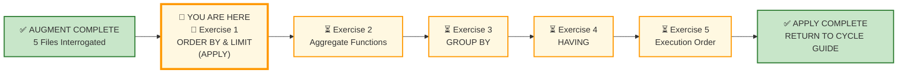
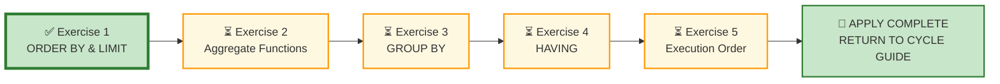

# 🗄️🤖 SQL & GenAI Course
**🎯 Quality Education for Anyone, Anywhere, Anytime — 💫 with Comfort, Convenience at no Cost**

---

## 🧪 Exercise 1: ORDER BY & LIMIT – Putting Things in Order (Apply Augmented skills and deliver)

Welcome to your first **APPLY Phase** challenge for Module 3. You have interrogated sorting logic in the Socratic Mirror. Now you step into the role of a consultant who must translate business priorities into precise ordering.

**ACQUIRE → AUGMENT → APPLY**  
🔧 **ACQUIRE:** Learn syntax  
⚖️ **AUGMENT:** Judge correctness  
🚀 **APPLY:** Deliver outcome

---

## 🌌 SQLVerse Check-In

<div style="border-left: 4px solid #9c27b0; background-color: #f3e5f5; padding: 15px; margin: 20px 0; border-radius: 0 8px 8px 0;">

Welcome to the **APPLY Phase** for **Ordering & Pagination Mechanics.**

You have completed **AUGMENT** for ORDER BY. You have interrogated AI logic, diagnosed sorting defects, and learned that **sorting is prioritisation**.

Now you enter APPLY – **Stop judging. Start building.**

### 🧠 The Professional Pipeline

Before writing a single line of SQL, run every request through the **Professional Pipeline**:

```text
[1] Business Question  ──> What does the executive actually want to know?
         ↓
[2] The One-Row Rule   ──> What must ONE single row represent when the query finishes?
         ↓
[3] The Blueprint      ──> Isolate the Dimension (Group By) vs. the Metric (Aggregate).
         ↓
[4] Domain Invariance  ──> Strip away the industry nouns to find the skeletal pattern.
         ↓
[5] The Vehicle        ──> Type the execution code.
```
You will write clean, production-grade SQL queries to answer critical stakeholder requests across our business universes. Your datasets are pre-loaded—your task is to bring the analytical judgment.

**The SQLVerse Mandate:**  Your syntax is the vehicle; your judgment is the destination.

### ⚠️ THE ILLUSION OF SYMMETRY

The filename `1-order-by.md` does **not** mean your scope is restricted to `ORDER BY`. The scope of *every single APPLY file* encompasses your entire toolkit.

- **60% of this floor** is anchored in sorting (`ORDER BY`, `LIMIT`, multi‑column sorting).
- **The other 40% is a wildcard zone** and can draw from any concept in the spiral.

**ANCHOR CONCEPT ≠ DOMINANT CONCEPT**

**Prepare to use your entire toolkit.**

</div>

---

## 📍 Your Current Stage – APPLY Journey



---

## 🔧 Browser Office for APPLY

| Tab | Purpose | What to Do |
| :--- | :--- | :--- |
| **1: The Map** | Open this exercise file | You are here – reading this file. Complete the business requests below. |
| **2: The Factory** | Understand the data model and execute SQL | 1. Study the **ER Diagram & Schema Guide** (60 seconds is enough).<br>2. Identify the **entities** and their **relationships.**<br>3. Load the database **referenced** in the exercise section.<br>4. Write and execute your SQL queries. |
| **3: The Consultant** | Socratic questioning (no code generation) | Explains logic, suggests strategies – **never writes SQL**. Follow the **3‑Attempt Rule**. |
| **4: The Vault** | Save your work | Save each completed business deliverable in your Vault under: `Learning/Level-1-beginner/ACCELERATE/02-Exercises/MODULE3/`.<br><br>If you spot AI hallucinations or edge cases, log them in `Learning/Level-1-beginner/ACCELERATE/Socratic_Journals/` as separate files. |

> **Professional Habit:** Understand the data model before you query it – **Professional SQL developers** do that.

---

## 🏛️ Meet Your APPLY Resource Repository

The **APPLY Resource Repository** is your central hub for all databases, ER diagrams, and schema guides used throughout the **APPLY cycle.** Each time you begin a new exercise, you will return here to load the required database and study its blueprint.

### 🗄️ Repository Artifacts

**All resources** used throughout this **APPLY cycle** are located in the APPLY Resource Repository:

1. **Customized E-Store database** – `level1_estore_apply.db` (extended dataset with NULLs, bulk orders, new categories)
2. **Production Echo databases** – domain-specific datasets (e.g., `hospital_planet.db`, `real_estate_planet.db`, `finverse.db`)
3. **ER Diagrams and Schema Guides** – Blueprint files for every database (e.g., `E-Store_APPLY_Blueprint.md`, `FinVERSE_Blueprint.md`)

### 📂 APPLY Resource Repository Location
```
Module5-GenAI-Walkthrough/02-Exercises/MODULE2/Module2-Schemas/
```

### Why does APPLY use a different E-Store database `level1_estore_apply.db`?

The APPLY version of the E-Store extends the original ACQUIRE dataset with production-oriented data such as `NULL` values, additional records, and richer business scenarios. The schema remains unchanged; only the data has evolved.

**Same schema. Different data. Different business outcomes.**

> 💡 **Tip:** Before beginning the exercises, take your time **exploring the repository.** Professional developers understand the resources available before they begin solving the problem.

---

## 📋 Business Use Case

Your consultancy has been engaged by multiple clients this quarter. Each request comes from a different stakeholder with a different perspective on what "priority" means. Your job is to translate their business priority into the correct sort order.

Two clients. Two domains. Same SQL patterns.

---

## 🛒 Section 1: Workshop Floor – E‑Store

Before solving the requests, spend a few minutes understanding the business model, workflow, ER diagram, and table schemas.

**Business first. Data model second. SQL third.**

**📁 Database:** Load [`level1_estore_apply.db`](./Module2-Schemas/level1_estore_apply.db) in **Tab 2 (The Factory)** before starting this section.

**🗺️ ER Diagram & Schema Guide:** Study [`E-Store_APPLY_Blueprint.md`](./Module2-Schemas/E-Store_APPLY_Blueprint.md) before writing any SQL.

### 📋 Meet Your Dataset: E‑Store – Your Home Turf

| Table | Columns | What It Tells Us |
|-------|---------|------------------|
| `customers` | `customer_id`, `name`, `email`, `city`, `phone` | Retail consumer profile data |
| `products` | `product_id`, `product_name`, `price`, `category` | Complete store stock inventory |
| `orders` | `order_id`, `customer_id`, `order_date` | Transaction timeline events |
| `order_items` | `order_item_id`, `order_id`, `product_id`, `quantity` | Itemized invoice lines |

---

### Request #1 – Alphabetical Customer Directory

The Marketing Director wants an alphabetical list of customers by last name. They are preparing a direct-mail campaign and need a clean, organised list.

**Deliverable:** A list of customers sorted alphabetically by last name.

---

### Request #2 – Top 5 Most Expensive Products

The Procurement Manager wants to see the 5 most expensive products in the inventory. They are reviewing premium stock for a supplier negotiation.

**Deliverable:** A list of the 5 most expensive products.

---

### Request #3 – Most Recent Orders First

The Operations Manager wants to see the most recent orders first. They are analysing weekly order volume and need to see recent activity.

**Deliverable:** A list of orders with the most recent first.

---

### Request #4 – Orders Sorted by Customer and Date

The Logistics Team wants a list of orders sorted by customer first, and within each customer, by order date (most recent first). They are preparing a customer‑wise shipment report.

**Deliverable:** A list of orders showing customer_id and order_date, sorted by customer_id, then by order_date descending.

---

## 🏥 Section 2: Production Echo – FinVERSE

**Domain Context:** You are deployed to a new client – **FinVERSE**, a digital banking ecosystem. The nouns have changed, but the SQL patterns remain identical.

Before solving the requests, spend a few minutes understanding the business model, workflow, ER diagram, and table schemas.

**Business first. Data model second. SQL third.**

**📁 Database:** Load [`finverse.db`](./Module2-Schemas/finverse.db) in **Tab 2 (The Factory)** before starting this section.

**🗺️ ER Diagram & Schema Guide:** Study [`FinVERSE_Blueprint.md`](./Module2-Schemas/FinVERSE_Blueprint.md) before writing any SQL.

### 📋 Meet Your Dataset: FinVERSE – Digital Banking Ecosystem

| Table | Columns | What It Tells Us |
|-------|---------|------------------|
| `customers` | `customer_id`, `first_name`, `last_name`, `email`, `phone`, `kyc_status`, `risk_score`, `onboarding_date`, `status` | Customer identity, verification, and risk profile |
| `accounts` | `account_id`, `customer_id`, `account_type`, `balance`, `status` | Customer accounts with balances and types |
| `transactions` | `transaction_id`, `account_id`, `merchant_id`, `amount`, `transaction_type`, `transaction_date`, `status`, `is_fraud` | Money movement – payments, transfers, purchases |
| `cards` | `card_id`, `account_id`, `card_type`, `card_number`, `expiry_date`, `status` | Debit and credit cards linked to accounts |
| `loans` | `loan_id`, `customer_id`, `principal`, `interest_rate`, `tenure_months`, `outstanding_balance`, `status`, `approval_date` | Loan products with repayment tracking |
| `loan_payments` | `payment_id`, `loan_id`, `amount`, `payment_date`, `payment_method`, `status` | Installment payments against loans |
| `merchants` | `merchant_id`, `name`, `category`, `settlement_type`, `status` | Businesses that accept payments |
| `support_tickets` | `ticket_id`, `customer_id`, `employee_id`, `ticket_type`, `status`, `created_date`, `resolved_date` | Customer support issues |
| `employees` | `employee_id`, `first_name`, `last_name`, `role`, `manager_id`, `branch_id` | FinVERSE staff |
| `branches` | `branch_id`, `name`, `city`, `state`, `status` | Physical or virtual service locations |

---

### Request #5 – Largest Transactions First

The Fraud Analyst wants to see the largest transactions first. They are investigating suspicious activity and need to prioritise high‑value transactions.

**Deliverable:** A list of transactions sorted by amount (highest first).

---

### Request #6 – Most Recent Transactions First

The Finance Executive wants to see the most recent transactions first. They are preparing a daily transaction summary and need to see recent activity.

**Deliverable:** A list of transactions sorted by transaction date (most recent first).

---

### Request #7 – Customers Sorted by Onboarding Date

The Customer Success Team wants to see customers sorted by onboarding date (most recent first). They are planning a welcome campaign for new customers.

**Deliverable:** A list of customers sorted by onboarding date descending.

---

### Request #8 – Accounts Sorted by Balance

The Wealth Management Team wants to see accounts sorted by balance (highest first). They are identifying high‑value customers for personalised outreach.

**Deliverable:** A list of accounts sorted by balance descending.

---

## 📋 Section 3: Executive Desk – Integrated Challenge

### Request #9 – Executive Customer Priority Report

**The COO wants:** A clean, professional report of customers prioritised for engagement.

The request is deliberately open-ended:

> *"I need a list of our most important customers. Show me who we should prioritise for outreach."*

**Key Considerations:**
- Define what "most important" means in the context of FinVERSE.
- Decide which columns matter for the COO.
- Apply appropriate filters (KYC status, risk score, account status, etc.).
- Sort the results to highlight the highest‑priority customers first.
- Use clear, business‑friendly aliases.
- Add a comment block explaining your assumptions.

> No hints. No syntax templates. Just a business outcome.

---

## ✅ A Day at Work – Progress Check

Review your engineering output before committing queries to your repository log tracker.

| Time | Deliverable | Domain | Status |
|------|-------------|--------|--------|
| 09:00 AM | Request #1 – Alphabetical Customer Directory | E‑Store | ☐ |
| 10:00 AM | Request #2 – Top 5 Most Expensive Products | E‑Store | ☐ |
| 11:00 AM | Request #3 – Most Recent Orders First | E‑Store | ☐ |
| 12:00 PM | Request #4 – Orders Sorted by Customer and Date | E‑Store | ☐ |
| 01:00 PM | Request #5 – Largest Transactions First | FinVERSE | ☐ |
| 02:30 PM | Request #6 – Most Recent Transactions First | FinVERSE | ☐ |
| 03:30 PM | Request #7 – Customers Sorted by Onboarding Date | FinVERSE | ☐ |
| 04:30 PM | Request #8 – Accounts Sorted by Balance | FinVERSE | ☐ |
| 06:00 PM | Request #9 – Executive Customer Priority Report | Integrated | ☐ |

**Reflection:** How did you define "most important" in Request #9? What assumptions did you make about what matters to the COO?

---

## 🔁 Bridge Forward

You have applied `ORDER BY`, `LIMIT`, and multi‑column sorting across E‑Store and FinVERSE. You have translated business priorities into sort orders and designed a customer prioritisation report.

Next, you will add **Aggregate Functions** to your toolkit.

➡️ [Proceed to Exercise 2: Aggregate Functions →](./2-aggregate-functions.md)

---

## 🧭 File Navigation



| Previous Step | Next Step |
|:---:|:---:|
| [← Return to Cycle Guide](../../01-The-Socratic-Mirror/CYCLE2_GUIDE.md) | [Continue to Exercise 2: Aggregate Functions →](./2-aggregate-functions.md) |

---

*Part of our mission for 🎯 Quality Education for Anyone, Anywhere, Anytime — 💫 with Comfort, Convenience at no Cost.*

**Level 1 | ACCELERATE Phase | APPLY | Module 3 | File 1**