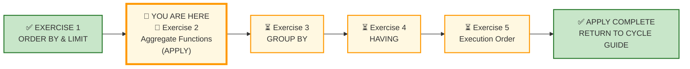
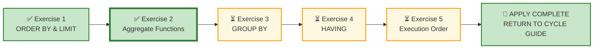

# 🗄️🤖 SQL & GenAI Course
**🎯 Quality Education for Anyone, Anywhere, Anytime — 💫 with Comfort, Convenience at no Cost**

---

## 🧪 Exercise 2: Aggregate Functions – Measuring What Matters (Apply Augmented skills and deliver)

Welcome to your second **APPLY Phase** challenge for Module 3. You have interrogated aggregation logic, `NULL` handling, and statistical reduction in the Socratic Mirror—understanding how `COUNT`, `SUM`, `AVG`, `MIN`, and `MAX` collapse thousands of granular transactions into single, meaningful metrics. 

Now you step into the role of a data consultant who must translate business questions into summary statistics.

**ACQUIRE → AUGMENT → APPLY**
🔧 **ACQUIRE:** Learn syntax
⚖️ **AUGMENT:** Judge correctness
🚀 **APPLY:** Deliver outcome

---

## 🌌 SQLVerse Check-In

<div style="border-left: 4px solid #9c27b0; background-color: #f3e5f5; padding: 15px; margin: 20px 0; border-radius: 0 8px 8px 0;">

Welcome to the **APPLY Phase** for **Aggregate Functions & Summary Statistics.**

You have completed **AUGMENT** for Aggregate Functions. You have interrogated AI logic, diagnosed calculating defects, and learned that **aggregates collapse data into decisions**.

Now you enter APPLY – **Stop judging. Start building.**

### 🧠 The Professional Pipeline

Before writing a single line of SQL, run every request through the **Professional Pipeline**:

```text
[1] Business Question  ──> What does the executive actually want to measure?
         ↓
[2] The Output-Shape Rule   ──> What must each row represent when the query finishes?
         ↓
[3] The Blueprint      ──> Isolate the Aggregates (SUM, AVG, COUNT, MIN, MAX) vs. Filters (WHERE).
         ↓
[4] Domain Invariance  ──> Strip away the industry nouns to find the skeletal pattern.
         ↓
[5] The Vehicle        ──> Type the execution code.
```

You will write clean, production-grade SQL queries using aggregate functions to answer critical stakeholder requests across two business universes. Your datasets are pre-loaded—your task is to bring the analytical judgment.

**The SQLVerse Mandate:** Your syntax is the vehicle; your judgment is the destination.

### ⚠️ THE ILLUSION OF SYMMETRY

The filename `2-aggregate-functions.md` does **not** mean your scope is restricted to `COUNT`, `SUM`, `AVG`, `MIN`, and `MAX`. The scope of *every single APPLY file* encompasses your entire toolkit.

- **60% of this floor** is anchored in aggregate functions.
- **The other 40% is a wildcard zone** and can draw from any concept in the spiral.

**ANCHOR CONCEPT ≠ DOMINANT CONCEPT**

**Prepare to use your entire toolkit.**

</div>

---

## 📍 Your Current Stage – APPLY Journey



---

## 🔧 Browser Office for APPLY

| Tab | Purpose | What to Do |
| :--- | :--- | :--- |
| **1: The Map** | Open this exercise file | You are here – reading this file. Complete the business requests below. |
| **2: The Factory** | Understand the data model and execute SQL | 1. Study the **ER Diagram & Schema Guide** (60 seconds is enough).<br>2. Identify the **entities** and their **relationships.**<br>3. Load the database **referenced** in the exercise section.<br>4. Write and execute your SQL queries. |
| **3: The Consultant** | Socratic questioning (no code generation) | Explains logic, suggests strategies – **never writes SQL**. Follow the **3‑Attempt Rule**. |
| **4: The Vault** | Save your work | Save each completed business deliverable in your Vault under: `Learning/Level-1-beginner/ACCELERATE/02-Exercises/MODULE3/`.<br><br>If you spot AI hallucinations or edge cases, log them in `Learning/Level-1-beginner/ACCELERATE/Socratic_Journals/` as separate files. |

> **Professional Habit:** Understand the data model before you query it – **Professional SQL developers** do that.

---
## 🌍 The SQLVerse Multiverse

### 🚀 One SQL Engine. Infinite Business Universes.

Real-world engineering is never confined to a single playground. The **SQLVerse Multiverse** is your flight simulator—a suite of production-grade business environments designed to develop one fundamental skill: 

**Recognising invariant SQL patterns beneath changing business vocabularies.**

A professional SQL developer does **not** learn a different SQL for banking, healthcare, retail, or real estate.

They learn to recognise the **same logical patterns** hidden beneath different business vocabularies.

That is the purpose of the **SQLVerse Multiverse**.

Each business universe presents different industries, stakeholders, terminology, and operational challenges—but the underlying SQL reasoning remains the same.

**The business vocabulary changes. The invariant SQL patterns remain.**

---

### 🌌 Meet Your Business Universes

One SQL engine. 

Four flagship universes.

Countless business stories.

Mini-universes to be air-dropped at different stages to **expand the SQLVerse.**


####  🚩 Flagship Universes

**You have already encountered the four flagship business universes in Module 2:**

- The familiar aisles of **E‑Store**
- The critical corridors of **Hospital Planet**
- The deal‑driven landscape of **Real Estate Planet**
- The precision‑focused ecosystem of **FinVERSE**

Beneath the surface of every universe lies the same invariant SQL architecture.

**Now let's visit each flagship universe and understand the business thinking it develops.**

---

### 🏠 Enhanced E-Store — Your Home Turf

You already know this universe from **ACQUIRE**.

In **ACCELERATE**, it returns with production-grade complexity—NULL values, bulk orders, new categories, and realistic edge cases.

**This is where familiar SQL becomes production-ready SQL.**

### 🏥 Hospital Planet

Think like a Healthcare Operations Manager.

Patients. Appointments. Treatments. Billing. Capacity planning.

**A universe where operational decisions depend on reliable data.**

### 🏘️ Real Estate Planet

Think like a Brokerage Director.

Properties. Agents. Clients. Deals. Payments.

**A complete property lifecycle—from listing to closing.**

### 💳 FinVERSE

Think like a Banking Analyst.

Loans. Accounts. Transactions. Cards. Fraud. Regulatory reporting.

**The flagship enterprise universe for KPI thinking and production analytics.**

---
### 🏛️ The Invariant Logic

**Each universe develops a different dimension of professional thinking.**

> They look different. 
 >
> They speak different business languages.
>
> They solve different business problems.

**Different domains. Different vocabularies. Same underlying SQL architecture.**

As you progress through SQLVerse, additional satellites will be deployed into orbit around these flagship universes, exposing you to an ever-growing range of business scenarios.

---

### 🗄️ SQLVerse Data Repository

The **SQLVerse Data Repository** is your central hub for all databases and related artifacts which reside in:

```
Level-1-beginner/sqlverse-foundation/resources/data-models/flagship-universes/
```

### 🏛️ The Artifacts You Will Use

| Artifact | What It Gives You |
|----------|-------------------|
| **Blueprint** | **The business story**—who the stakeholders are, what they value, how the business operates. |
| **Schema Guide** | **The technical architecture**—table layouts, primary/foreign keys, and data relationships. |
| **Database** | **The living world**—the physical `.db` file you will query, analyze, and transform. |

The SQLVerse Data Repository is the launch pad for every business universe used throughout **AUGMENT** and **APPLY**.

Before entering any universe, you will study its Blueprint, understand its business model, inspect its schema, and load its database.

**Business first. Data model second. SQL third.**

---

## 📋 Business Use Case

Your consultancy has been engaged by multiple clients this quarter. Each request comes from a different stakeholder asking for summary statistics—totals, averages, counts, and extremes. 

Your job is to translate their business questions into precise aggregate SQL functions.

**🎯 Core Theme:** Aggregates reduce multi-row detail into decision-grade KPIs.

---

### ⚙️ Universal Pre-Flight Protocol

Before tackling the requests in *any* section or business universe, execute this standard workflow:

1. **Read the Blueprint** to understand the **Business model** and operational domain.
2. **Read the Schema Guide** to understand the **Technical implementation** and table relationships.
3. **Explore the Database File** to inspect the **schema definition, data types, constraints, and data distribution**.

 The ACCELERATE Mandate: **Business first. Data model second. SQL third.**

---

As you move through the requests, focus on recognising the pattern rather than memorising the business scenario. 

The business vocabulary changes. The skeletal pattern remains invariant.

**Two clients. Two domains. Same core SQL patterns.**

---

## 🛒 Section 1: Workshop Floor – E‑Store

**📁 Database:** Load [`level1_estore_apply.db`](../../../sqlverse-foundation/resources/data-models/flagship-universes/1-e-store/level1_estore_apply.db) in **Tab 2 (The Factory)** before starting this section.

**🗺️ Blueprint:** Study [`E-Store_Blueprint.md`](../../../sqlverse-foundation/resources/data-models/flagship-universes/1-e-store/E-Store_Blueprint.md) before writing any SQL.

**📊 Schema Guide:** Refer to [`E-Store_Schema.md`](../../../sqlverse-foundation/resources/data-models/flagship-universes/1-e-store/E-Store_Schema.md) for detailed technical implementation.

---

### 📋 Meet Your Dataset: E‑Store – Your Home Turf

| Table | Columns | What It Tells Us |
|-------|---------|------------------|
| `customers` | `customer_id`, `name`, `email`, `city`, `phone` | Retail consumer profile data |
| `products` | `product_id`, `product_name`, `price`, `category` | Complete store stock inventory |
| `orders` | `order_id`, `customer_id`, `order_date` | Transaction timeline events |
| `order_items` | `order_item_id`, `order_id`, `product_id`, `quantity` | Itemized invoice lines |

---

### Request 1 – Total Number of Customers

The Marketing Director wants to know the total number of customers in the database. They are preparing a market size report.

**Deliverable:** A single number showing the total customer count.

---

### Request 2 – E‑Store Revenue & Order Performance

The VP of Retail Operations wants a macro summary showing overall store activity. They need key performance indicators across all historical orders.

**Deliverable:** A single-row executive summary featuring total order count, total gross revenue, average order value (AOV), smallest order total, and largest order total.

---

### Request 3 – Product Catalog Inventory Valuation


The Inventory Manager needs a financial audit of the current product catalog. They want to understand pricing extremes and average product valuation.

**Deliverable:** A single-row catalog valuation showing total count of unique products offered, average product price (rounded to 2 decimal places), minimum product price, and maximum product price.

---

### Request 4 – Active Customer Email Penetration & Contact Audit


The Marketing Director is preparing a digital campaign and needs an accurate count of total customers versus customers who have provided valid contact emails.

**Deliverable:** A summary row showing total customer records, count of customers with non-null emails, and total distinct cities represented in the customer database.

---

### Request 5 – Number of Customers per City

The Operations Team wants to know how many customers are located in each city. They are planning regional distribution.

**Deliverable:** A list showing each city and the number of customers in that city.

---

## 🏡 Section 2: Production Echo – Real Estate Planet

**📁 Database:** Load [`real_estate_planet.db`](../../../sqlverse-foundation/resources/data-models/flagship-universes/3-real-estate-planet/real_estate_planet.db) in **Tab 2 (The Factory)** before starting this section.

**🗺️ Blueprint:** Study [`Real_Estate_Planet_Blueprint.md`](../../../sqlverse-foundation/resources/data-models/flagship-universes/3-real-estate-planet/Real_Estate_Planet_Blueprint.md) before writing any SQL.

**📊 Schema Guide:** Refer to [`Real_Estate_Planet_Schema.md`](../../../sqlverse-foundation/resources/data-models/flagship-universes/3-real-estate-planet/Real_Estate_Planet_Schema.md) for detailed technical implementation.

---

### 📋 Meet Your Dataset: Real Estate Planet – Property Marketplace

| Table | Columns | What It Tells Us |
|-------|---------|------------------|
| `agents` | `agent_id`, `first_name`, `last_name`, `email`, `phone`, `brokerage` | Real estate agents and their brokerages |
| `clients` | `client_id`, `first_name`, `last_name`, `email`, `phone`, `client_type` | Buyers, sellers, or both |
| `properties` | `property_id`, `agent_id`, `address`, `city`, `state`, `zip`, `property_type`, `list_price`, `status` | Property listings with prices and statuses |
| `viewings` | `viewing_id`, `property_id`, `client_id`, `viewing_date`, `feedback` | Property viewings by clients |
| `offers` | `offer_id`, `property_id`, `client_id`, `agent_id`, `offer_amount`, `offer_date`, `status` | Offers made on properties |
| `contracts` | `contract_id`, `offer_id`, `property_id`, `client_id`, `agent_id`, `sale_price`, `closing_date` | Accepted offers that become contracts |
| `payments` | `payment_id`, `contract_id`, `payment_date`, `amount`, `payment_method` | Payments made against contracts |

---

### Request 6 – Total Number of Active Listings

The Chief Revenue Officer wants to know how many properties are currently listed for sale (`status = 'Active'`). They are assessing market inventory.

**Deliverable:** A single number showing the total active listings.

---

### Request 7 – Average List Price of Active Properties

The Pricing Analyst wants to know the average list price of active properties. They are benchmarking market positioning.

**Deliverable:** A single number showing the average list price.

---

### Request 8 – Total Value of Active Listings

The Investor Relations Team wants to know the total market value of all active listings (`SUM(list_price)`). They are preparing a market size report.

**Deliverable:** A single number showing the total value of active listings.

---

### Request 9 – Price Range of Properties by Property Type

The Product Team wants to understand how prices vary by property type. They need a clear picture of the pricing spectrum—minimum, average, and maximum list price—for each property type to inform market positioning and pricing strategy.

**Deliverable:** For each property type, show the lowest list price, average list price, and highest list price.

---

### Request 10 – Number of Offers per Status

The Sales Director wants to understand the distribution of offer statuses (`Pending`, `Accepted`, `Rejected`, `Withdrawn`). They are tracking deal pipeline health.

**Deliverable:** For each offer status, show the number of offers in that status.

---

## 📋 Section 3: Executive Desk – Integrated Challenge

### Request 11 – Executive Investment Report

**The Chief Investment Officer (CIO)  wants:** An executive summary evaluating market readiness for active residential assets.

The request is deliberately open-ended:

> *"Give me a high-level strategic overview of our active residential portfolio (properties with status = 'Active'). I need to know our total exposure, average property value, inventory age on market, and overall price per square foot baseline so we can set our Q3 acquiring targets."*

### 🔍 Can We Answer This Now?

**Partial Answer:** We can calculate total exposure and average property value.

**We Cannot Answer:** Average square footage, price per square foot, or average days on market.

**Why?**

| Required Metric | Field Needed | Status |
|-----------------|--------------|--------|
| Total exposure | `SUM(list_price)` | ✅ Available |
| Average property value | `AVG(list_price)` | ✅ Available |
| Inventory age on market | `listing_date` + current date| ❌ `listing_date` **Missing** |
| Price per square foot | `total_area_in_squarefeet` | ❌ **Missing** |


---

### 🚧 Architectural Boundary — Request Deferred

This request cannot be answered reliably using the current Real Estate schema. You could write SQL that produces numbers, but you could not guarantee that those numbers represent the business truth.

#### 🧠 The Architect's Reflection

This is not a failure—it is a **design insight**.

The current schema was built for **operational listing management**. It is technically sound for that purpose. But when the business demands **analytical metrics** like average days on market or price per square foot, the schema falls short.

A data architect must recognise when a schema is **operationally complete** but **analytically insufficient**.

> **Do not invent the missing facts. Do not infer them from unrelated events.**
>
> **Park this request.**

The architectural solution will be introduced in **Module 4: Schema Evolution & Production Data Modelling**.

**🔍 Curiosity Prompt:** Ask your Socratic Consultant why a schema that is "correct" for listing management cannot support this executive request without modification.

---

### **🧱**  Data Gap Audit (Professional Practice)

> Wondering what solution to write for the problem?
>
> No worries.
>
> You can always fallback on the SQLVerse mandate :

**Business first. Data model second. SQL third.** 

Write a **Data Deficit Note.**

---

### 📋 Data Deficit Note

**Business Requirement:** Vital data needed — property area, price per square foot, and average days on market.

**Data Model:** The required source attributes — `total_area_in_squarefeet` and `listing_date` — are missing from the database.

**SQL:** SQL cannot honestly produce the requested answer. The limitation is in the **data model**, not the SQL.

**Key Takeaway:** SQL can answer a business question only if the data model contains the required facts.

> **This request is not rejected. It is deferred.**
>
> **Return in Module 4 to discover what the business model is missing.**
>
> **_"The business vocabulary changes. The skeletal pattern remains invariant."_**

**For now, focus on the tools you have. In Module 4, you will extend your toolkit to handle requests like this.**


---

## ✅ A Day at Work – Progress Check

Review your engineering output before committing queries to your repository log tracker.

| Time     | Deliverable                                                            | Domain      |
| -------- | ---------------------------------------------------------------------- | ----------- |
| 09:00 AM | Request 1 – Total Number of Customers                                  | E-Store     |
| 10:00 AM | Request 2 – Revenue & Order Performance                                | E-Store     |
| 11:00 AM | Request 3 – Product Catalog Inventory Valuation                        | E-Store     |
| 12:00 PM | Request 4 – Active Customer Email Penetration & Contact Audit          | E-Store     |
| 01:00 PM | Request 5 – Number of Customers per City                               | E-Store     |
| 02:00 PM | Request 6 – Total Number of Active Listings                            | Real Estate |
| 03:00 PM | Request 7 – Average List Price of Active Properties                    | Real Estate |
| 04:00 PM | Request 8 – Total Value of Active Listings                             | Real Estate |
| 05:00 PM | Request 9 – Price Range by Property Type                               | Real Estate |
| 06:00 PM | Request 10 – Number of Offers per Status                               | Real Estate |
| 07:00 PM | Request 11 – Executive Investment Report *(Deferred – Data Gap Audit)* | Real Estate |

**Reflection:** Which aggregate function did you use most frequently across all requests? What pattern emerged across the E‑Store and Real Estate domains?

---

## 🔁 Bridge Forward

You have applied aggregate functions across E‑Store and Real Estate Planet. You have translated business questions into summary statistics and designed an executive investment report.

Next, you will add **GROUP BY** to your toolkit.

➡️ [Proceed to Exercise 3: GROUP BY →](./3-group-by-practice-LAB.md)

---

## 🧭 File Navigation



| Previous Step | Next Step |
|:---:|:---:|
| [← Return to Exercise 1: ORDER BY & LIMIT](./1-order-by-LAB.md) | [Continue to Exercise 3: GROUP BY →](./3-group-by-practice-LAB.md) |

---

*Part of our mission for 🎯 Quality Education for Anyone, Anywhere, Anytime — 💫 with Comfort, Convenience at no Cost.*

**Level 1 | ACCELERATE Phase | APPLY | Module 3 | File 2**


