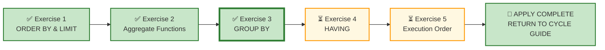

# 🗄️🤖 SQL & GenAI Course
**🎯 Quality Education for Anyone, Anywhere, Anytime — 💫 with Comfort, Convenience at no Cost**

---

## 🧪 Exercise 3: GROUP BY – The Art of Categorization (Apply Augmented skills and deliver)

Welcome to your third **APPLY Phase** challenge for Module 3. You have interrogated grouping logic in the Socratic Mirror—understanding the Golden Rule, grouping granularity, and how `GROUP BY` transforms raw data into categorical insights. Now you step into the role of a consultant who must translate business questions into grouped summaries.

**ACQUIRE → AUGMENT → APPLY**
🔧 **ACQUIRE:** Learn syntax
⚖️ **AUGMENT:** Judge correctness
🚀 **APPLY:** Deliver outcome

---

## 🌌 SQLVerse Check-In

<div style="border-left: 4px solid #9c27b0; background-color: #f3e5f5; padding: 15px; margin: 20px 0; border-radius: 0 8px 8px 0;">

Welcome to the **APPLY Phase** for **GROUP BY.**

You have completed **AUGMENT** for GROUP BY. You have interrogated AI logic, diagnosed grouping granularity defects, and learned that **GROUP BY is an analytical boundary definition**.

Now you enter APPLY – **Stop judging. Start building.**

### 🧠 The Professional Pipeline

Before writing a single line of SQL, run every request through the **Professional Pipeline**:

```text
[1] Business Question  ──> What categories does the stakeholder want to see?
         ↓
[2] The One-Row Rule   ──> What must ONE single row represent after grouping?
         ↓
[3] The Blueprint      ──> Is there a natural dimension to group by?
         ↓
[4] Domain Invariance  ──> Strip away the industry nouns to find the skeletal pattern.
         ↓
[5] The Vehicle        ──> Type the execution code.
```

You will write clean, production-grade SQL queries using `GROUP BY` to answer critical stakeholder requests across two business universes. Your datasets are pre-loaded—your task is to bring the analytical judgment.

**The SQLVerse Mandate:** Your syntax is the vehicle; your judgment is the destination.

### ⚠️ THE ILLUSION OF SYMMETRY

The filename `3-group-by-practice.md` does **not** mean your scope is restricted to `GROUP BY`. The scope of *every single APPLY file* encompasses your entire toolkit.

- **60% of this floor** is anchored in `GROUP BY`.
- **The other 40% is a wildcard zone** and can draw from any concept in the spiral.

**ANCHOR CONCEPT ≠ DOMINANT CONCEPT**

**Prepare to use your entire toolkit.**

</div>

---

## 📍 Your Current Stage – APPLY Journey


---

## 🔧 Browser Office for APPLY

| Tab | Purpose | What to Do |
| :--- | :--- | :--- |
| **1: The Map** | Open this exercise file | You are here – reading this file. Complete the business requests below. |
| **2: The Factory** | Understand the data model and execute SQL | 1. Study the **ER Diagram & Schema Guide** (60 seconds is enough).<br>2. Identify the **entities** and their **relationships.**<br>3. Load the database **referenced** in the exercise section.<br>4. Write and execute your SQL queries. |
| **3: The Consultant** | Socratic questioning (no code generation) | Explains logic, suggests strategies – **never writes SQL**. Follow the **3‑Attempt Rule**. |
| **4: The Vault** | Save your work | Save each completed business deliverable in your Vault under: `Learning/Level-1-beginner/ACCELERATE/02-Exercises/MODULE3/`.<br><br>If you spot AI hallucinations or edge cases, log them in `Learning/Level-1-beginner/ACCELERATE/Socratic_Journals/` as separate files. |

> **Professional Habit:** Understand the data model before you query it – **Professional SQL developers** do that.

---

## 📋 Business Use Case

Your consultancy has been engaged by multiple clients this quarter. Each request comes from a different stakeholder asking for categorical summaries—counts, totals, and averages grouped by meaningful dimensions.

Your job is to translate their business questions into precise grouping logic.

**🎯 Core Theme:** `GROUP BY` partitions data into categories, revealing patterns that raw data hides.

---

### ⚙️ Universal Pre-Flight Protocol

Before tackling the requests in *any* section or business universe, execute this standard workflow:

1. **Read the Blueprint** to understand the **Business model** and operational domain.
2. **Read the Schema Guide** to understand the **Technical implementation** and table relationships.
3. **Explore the Database File** to inspect the **schema definition, data types, constraints, and data distribution**.

The ACCELERATE Mandate: **Business first. Data model second. SQL third.**

---

As you move through the requests, focus on recognising the pattern rather than memorising the business scenario.

The business vocabulary changes. The skeletal pattern remains invariant.

**Two clients. Two domains. Same core grouping patterns.**

---

## 🌍 The SQLVerse Multiverse

### 🚀 One SQL Engine. Infinite Business Universes.

Real-world engineering is never confined to a single playground. The **SQLVerse Multiverse** is your flight simulator—a suite of production-grade business environments designed to develop one fundamental skill:

**Recognising invariant SQL patterns beneath changing business vocabularies.**

A professional SQL developer does **not** learn a different SQL for banking, healthcare, retail, or real estate.

They learn to recognise the **same logical patterns** hidden beneath different business vocabularies.

That is the purpose of the **SQLVerse Multiverse**.

Each business universe presents different industries, stakeholders, terminology, and operational challenges—but the underlying SQL reasoning remains the same.

**The business vocabulary changes. The invariant SQL patterns remain.**

---

### 🌌 Meet Your Business Universes

One SQL engine.

Four flagship universes.

Countless business stories.

Mini-universes to be air-dropped at different stages to **expand the SQLVerse.**

#### 🚩 Flagship Universes

**You have already encountered the four flagship business universes in Module 2:**

- The familiar aisles of **E‑Store**
- The critical corridors of **Hospital Planet**
- The deal‑driven landscape of **Real Estate Planet**
- The precision‑focused ecosystem of **FinVERSE**

Beneath the surface of every universe lies the same invariant SQL architecture.

**Now let's visit each flagship universe and understand the business thinking it develops.**

---

### 🏠 Enhanced E-Store — Your Home Turf

You already know this universe from **ACQUIRE**.

In **ACCELERATE**, it returns with production-grade complexity—NULL values, bulk orders, new categories, and realistic edge cases.

**This is where familiar SQL becomes production-ready SQL.**

### 🏥 Hospital Planet

Think like a Healthcare Operations Manager.

Patients. Appointments. Treatments. Billing. Capacity planning.

**A universe where operational decisions depend on reliable data.**

### 🏘️ Real Estate Planet

Think like a Brokerage Director.

Properties. Agents. Clients. Deals. Payments.

**A complete property lifecycle—from listing to closing.**

### 💳 FinVERSE

Think like a Banking Analyst.

Loans. Accounts. Transactions. Cards. Fraud. Regulatory reporting.

**The flagship enterprise universe for KPI thinking and production analytics.**

---

### 🏛️ The Invariant Logic

**Each universe develops a different dimension of professional thinking.**

> They look different.
>
> They speak different business languages.
>
> They solve different business problems.

**Different domains. Different vocabularies. Same underlying SQL architecture.**

As you progress through SQLVerse, additional satellites will be deployed into orbit around these flagship universes, exposing you to an ever-growing range of business scenarios.

---

### 🗄️ SQLVerse Data Repository

The **SQLVerse Data Repository** is your central hub for all databases and related artifacts which reside in:

```
Level-1-beginner/sqlverse-foundation/resources/data-models/flagship-universes/
```

### 🏛️ The Artifacts You Will Use

| Artifact | What It Gives You |
|----------|-------------------|
| **Blueprint** | **The business story**—who the stakeholders are, what they value, how the business operates. |
| **Schema Guide** | **The technical architecture**—table layouts, primary/foreign keys, and data relationships. |
| **Database** | **The living world**—the physical `.db` file you will query, analyze, and transform. |

The SQLVerse Data Repository is the launch pad for every business universe used throughout **AUGMENT** and **APPLY**.

Before entering any universe, you will study its Blueprint, understand its business model, inspect its schema, and load its database.

**Business first. Data model second. SQL third.**

---

## 🛒 Section 1: Workshop Floor – E‑Store

Before solving the requests, spend a few minutes understanding the business model, workflow, ER diagram, and table schemas.

**Business first. Data model second. SQL third.**

**📁 Database:** Load [`level1_estore_apply.db`](../../../sqlverse-foundation/resources/data-models/flagship-universes/1-e-store/level1_estore_apply.db) in **Tab 2 (The Factory)** before starting this section.

**🗺️ Blueprint:** Study [`E-Store_Blueprint.md`](../../../sqlverse-foundation/resources/data-models/flagship-universes/1-e-store/E-Store_Blueprint.md) before writing any SQL.

**📊 Schema Guide:** Refer to [`E-Store_Schema.md`](../../../sqlverse-foundation/resources/data-models/flagship-universes/1-e-store/E-Store_Schema.md) for detailed technical implementation.

---

### 📋 Meet Your Dataset: E‑Store – Your Home Turf

| Table | Columns | What It Tells Us |
|-------|---------|------------------|
| `customers` | `customer_id`, `name`, `email`, `city`, `phone` | Retail consumer profile data |
| `products` | `product_id`, `product_name`, `price`, `category` | Complete store stock inventory |
| `orders` | `order_id`, `customer_id`, `order_date` | Transaction timeline events |
| `order_items` | `order_item_id`, `order_id`, `product_id`, `quantity` | Itemized invoice lines |

---

### Request 1 – Number of Orders per Customer

The Customer Success Team wants to understand purchasing behaviour. They need to know how many orders each customer has placed to identify repeat buyers.

**Deliverable:** For each customer, show the `customer_id` and the number of orders they have placed.

---

### Request 2 – Total Revenue per Product Category

The Product Manager wants to know which product categories generate the most revenue. They are preparing a category performance review.

**Deliverable:** For each product category, show the total revenue (use `order_items` and `products`).

---

### Request 3 – Average Order Value per Customer

The Finance Team wants to understand customer spending patterns. They need the average order value per customer to segment customers by spending behaviour.

**Deliverable:** For each customer, show the `customer_id` and their average order value.

> 💡 **Hint:** Average order value = total revenue / number of orders per customer

---

## 🏥 Section 2: Production Echo – Hospital Planet

**Domain Context:** You are deployed to a new client – **Hospital Planet**, a healthcare operations universe. The nouns have changed, but the SQL patterns remain identical.

Before solving the requests, spend a few minutes understanding the business model, workflow, ER diagram, and table schemas.

**Business first. Data model second. SQL third.**

**📁 Database:** Load [`hospital_planet.db`](../../../sqlverse-foundation/resources/data-models/flagship-universes/2-hospital-planet/hospital_planet.db) in **Tab 2 (The Factory)** before starting this section.

**🗺️ Blueprint:** Study [`Hospital_Planet_Blueprint.md`](../../../sqlverse-foundation/resources/data-models/flagship-universes/2-hospital-planet/Hospital_Planet_Blueprint.md) before writing any SQL.

**📊 Schema Guide:** Refer to [`Hospital_Planet_Schema.md`](../../../sqlverse-foundation/resources/data-models/flagship-universes/2-hospital-planet/Hospital_Planet_Schema.md) for detailed technical implementation.

---

### 📋 Meet Your Dataset: Hospital Planet – Healthcare Operations

| Table | Columns | What It Tells Us |
|-------|---------|------------------|
| `patients` | `patient_id`, `name`, `email`, `phone`, `status` | Patient identity and status |
| `doctors` | `doctor_id`, `first_name`, `last_name`, `specialisation`, `status` | Doctor profiles and specialisations |
| `treatments` | `treatment_id`, `treatment_name`, `cost`, `category` | Treatment offerings and costs |
| `appointments` | `appointment_id`, `patient_id`, `treatment_id`, `doctor_id`, `appointment_date` | Patient appointments |
| `bills` | `bill_id`, `patient_id`, `amount`, `bill_date`, `payment_status` | Billing and payment records |

---

### Request 4 – Total Revenue per Payment Status

The Finance Director wants to understand revenue distribution across different payment statuses (`Paid`, `Pending`, `Insurance Pending`).

**Deliverable:** For each payment status, show the total revenue (`SUM(amount)`).

---

### Request 5 – Number of Patients per Status

The Operations Director wants to understand patient distribution by status (`Active`, `Inactive`, `Admitted`, `Discharged`).

**Deliverable:** For each patient status, show the number of patients.

---

### Request 6 – Total Appointments per Doctor

The Medical Director wants to understand doctor workload. They need the number of appointments handled by each doctor.

**Deliverable:** For each doctor, show the total number of appointments they have handled.

---

### Request 7 – Total Revenue per Treatment Category

The Revenue Cycle Manager wants to understand which treatment categories generate the most revenue.

**Deliverable:** For each treatment category, show the total revenue (`SUM(cost)`).

> 💡 **Hint:** You'll need to join `appointments` and `treatments`.

---

### Request 8 – Average Cost per Treatment Category

The Pricing Analyst wants to benchmark treatment costs by category.

**Deliverable:** For each treatment category, show the average treatment cost.

---

### Request 9 – Monthly Appointment Volume

The Operations Director wants to understand appointment volume trends by month.

**Deliverable:** For each month, show the total number of appointments.

> 💡 **Hint:** Use `strftime('%Y-%m', appointment_date)` to extract month.

---

### Request 10 – Monthly Revenue from Completed Payments

The Finance Director wants to track monthly revenue trends from completed payments.

**Deliverable:** For each month, show the total revenue from bills with `payment_status = 'Paid'`.

---

### 🔭 Beyond the Production Echo

You have now seen how `GROUP BY` can reveal different patterns from the same operational data.

But there is a deeper question an SQLVerse Artisan must learn to ask:

**What if the business question itself cannot be answered from the data model?**

> A query can have correct syntax.
> A `GROUP BY` can have the correct granularity.
> The database can return a perfectly valid result.

> And yet the answer can still be **financially wrong**.
>
> To understand why, step outside the hospital and enter **FinVERSE**.

---

## 🎬 THE LIQUIDITY ILLUSION

### _A Case Study in Financial Blind Spots and Silent Failures_

### 📽️ SCENE 1: THE ACCUSATION

_(The camera tracks rapidly down the center of a long mahogany conference table, stopping abruptly at ARTHUR—the Lead External Auditor—standing at the head. His tie is loosened, sleeves rolled up. Next to him sits MAYA, his brilliant young associate, quietly opening a leather notebook. Across the table: five sweaty, bewildered Board Members and the CFO, surrounded by cold espresso cups and crumpled spreadsheets.)_

**ARTHUR**

_(Slamming a red-marked printout onto the glass table)_

“Guys... do you have _any_ idea what you’ve done? You just landed this entire enterprise in deep, boiling soup!”

**CFO**

_(Wiping his forehead with a handkerchief)_

“Arthur, calm down! The Q1 numbers are unprecedented. Our Junior Architect generated that report this morning using a flawless, zero-error SQL script running straight against our core payment servers. Ten million dollars!”

**ARTHUR**

“Ten million dollars in *Revenue*?! Are you out of your mind?! It takes five full years of hard operations to recognize that kind of top-line performance! You took raw **Cash Collected**, slapped a **Revenue** label on it, and sent it to the press. You didn't discover a financial miracle—you just guaranteed a catastrophic public restatement!”

**BOARD MEMBER 1**

_(Slamming his fist on the table, leaning forward)_

“Forget your business jargon, Arthur! Cash, revenue, accruals, recognition—speak human language! Explain to us like real people what we actually did wrong!”

---

### 📽️ SCENE 2: THE REFRAME 

_(The room goes dead silent. The harsh, aggressive tension begins to dissolve. Arthur turns to Maya and gives a subtle nod. Maya steps forward to the floor-to-ceiling glass wall overlooking the city. She uncaps a black marker with a soft, distinct click. The morning sunlight catches the glass as she writes three simple figures.)_

**MAYA**

_(Softly, with complete clarity and warmth)_

“Let’s forget database scripts and accounting textbooks for a moment. Imagine a customer walks into our office on January 1st. He pays **$1,200 in cold, hard cash** upfront for a full 1-year subscription service.”

_(She turns to the Board, holding their gaze.)_

**MAYA**

“On Day 1, you hold $1,200 of physical green cash in your hand. But have you _earned_ it yet?”

**BOARD MEMBER 2**

“Well... we have the cash sitting in our bank account.”

**MAYA**

“You have the cash, but you haven’t delivered a single day of service. If our company goes bankrupt on Day 2, you owe that customer his $1,200 back. That money isn't earnings—it’s an **obligation**. In finance, an advance payment isn't income; it’s **Unearned Revenue**—a liability sitting on your back.

On the flip side, if you deliver a service today and bill the client later, that’s **Accounts Receivable**—revenue you've earned, even though the cash hasn't hit your bank yet. Cash collection records the movement of money; Revenue recognition records the completion of value.”

_(She writes **$100** next to Month 1 on the glass.)_

**MAYA**

“Thirty days pass. You deliver one month of service. _Now_ you’ve earned $100. That is your **Revenue Recognized**. You cannot eat the cash on Day 1 just because you hold it in your hands.”

---

### 📽️ SCENE 3: THE FINVERSE TRAP _(The Realization)_

_(Maya turns back to the center of the room.)_

**MAYA**

“Now let's talk about what happened in our building this morning. Our borrowers made $10,000,000 in total loan payments to FinVERSE during Q1. Your Junior Architect ran his script to answer the CFO’s core question: _'What is our total Q1 revenue?'_”

**MAYA**

“The script spat out `$10,000,000`. Mathematically? The script was perfect. It added up every single dollar that touched our bank account. But out of that $10 Million... **$8.5 Million was principal repayment**.”

_(The CFO’s eyes slowly widen. He lowers his pen.)_

**CFO**

“...Principal isn't revenue. Principal is just the borrower returning capital we already lent them.”

_We celebrated a number that didn't mean what we thought it meant._

**MAYA**

“Exactly. Returning money you lent someone isn't profit—it's just your own capital coming home. Principal repayment is not revenue. **Interest** and **applicable fees** may contribute to revenue, subject to the institution's accounting and recognition rules. 

Under the accounting assumptions of this case, the recognized revenue was $1.5 Million. Your report gave the Board an answer that was inflated by $8.5 Million.”

**BOARD MEMBER 1**

“Then why did the script work?! Why didn't the system throw an error?!”

---
### 📽️ SCENE 4: THE BOARD TURNS ON THE CTO

*(The board members turn away from the CFO and fixedly glare down the table at the **CTO**, who has been sitting silently behind an open laptop.)*

**BOARD MEMBER 1**

*(Slamming a palm onto the table, pointing directly at the CTO)*

“Forget the CFO’s spreadsheets for a minute—**CTO, look at us!** This happened in *your* house, on *your* servers, with *your* engineering team! How did a single script generate a ten-million-dollar bomb without a single system alarm going off?”

**CTO**

*(Clearing his throat, adjusting his glasses)*

“Look... the script didn't crash. It ran cleanly in milliseconds with zero errors. From a pure engineering standpoint, the code did exactly what it was told to do.”

**BOARD MEMBER 2**

*(Leaning forward, tone cold and unyielding)*

“If your script is flawless, **how did it generate a ten-million-dollar bomb?!** We don't want technical excuses. Find out what happened inside your database and tell us how you will fix it so this silent failure *never* recurs in this enterprise again!”

---

### 📽️ SCENE 5: THE ARCHITECTURAL CLIMAX

*(The room goes dead silent. The CFO sits frozen. The Board members stare at the CTO, waiting for an excuse. Instead, the CTO slowly closes his laptop, stands up, and faces the room with absolute moral and technical clarity.)*

**CTO**

*(Voice quiet, unhurried, carrying the weight of a painful realization)*

“You’re asking how a flawless script generated a ten-million-dollar bomb? I’ll tell you how.

Because the script didn't fail you. **My enterprise architecture failed you.**

Our reporting system was built to track *cash*, not *meaning*. We asked the system for 'Revenue', but we never engineered a system capable of understanding what revenue actually is. We gave our analyst a single lump bucket of numbers and got angry when he couldn’t magically separate the principal from the profit.

In software engineering, when code is broken, it crashes. It gives you a bright red error message. That’s a **Hard Failure**. Hard failures are easy—they protect us from our own mistakes.

This was a **Silent Failure**. The script ran flawlessly, handed you a lie wrapped in clean formatting, and let you walk right into an audit.

A report can only reflect the level of truth your underlying system was courageous enough to capture.”

*(The CTO pulls up a chair at the head of the table and opens a notebook.)*

**CTO**

“I will not patch this with another quick query. Before market close, I am submitting a complete **Technical Autopsy and Data Model Redesign** to this Board. Here is what happened inside our servers...”

_(Camera pans slowly across the silent Board members. The CFO stares at his reflection in the dark glass table. The realization settles into the room with absolute weight.)_

_(FADE TO BLACK)_

---

### From the boardroom to the database server room 

The board has identified the symptom. 

Now we investigate the architecture that allowed it.

---

## 🧠 TECHNICAL AUTOPSY: Know Your Business Jargon

Now that you've witnessed the boardroom crisis, let's step into the database server room and perform a forensic autopsy on **why** the Junior Architect's script failed silently.

We will start with understanding the Business terms used in the Conversation.

---

### 📚 Business Terms Breakdown

Before an Architect writes a single line of SQL, they must understand the core domain definitions governing the business.

| **Business Term** | **Financial Meaning** | **Accounting Classification** |
|-------------------|----------------------|-------------------------------|
| **Cash Collected** | Physical receipt of money from a customer or borrower. | **Cash → Asset** <br>`Cash Collected → Cash-flow / liquidity measure` |
| **Revenue Recognized** | Income earned when a product/service is actually delivered or interest accrues. | Income Statement (Performance) |
| **Unearned (Deferred) Revenue** | Money received *before* the service is delivered (e.g., upfront annual subscription). | **Liability** (You owe service/refund) |
| **Accounts Receivable** | Service delivered *before* cash is received (e.g., billed on credit). | **Asset** (Owed to you) |
| **Principal Repayment** | Return of original loaned capital in a credit facility. | **Not Revenue** (Balance Sheet asset exchange) |

---

### 📚 Business Lesson: Cash ≠ Revenue

**Cash collected** is the physical receipt of money from a customer.

**Revenue recognized** is the accounting record of income earned when a product or service is actually delivered, regardless of when the cash changes hands.

 Cash collection records the movement of money, while Revenue recognition records the completion of service.

#### Quick Comparison Table

| Metric | Cash Collected | Revenue Recognized |
|--------|----------------|-------------------|
| **Primary Focus** | Bank balance and liquidity | Business performance and earnings |
| **Timing Rule** | When cash arrives in the bank | When the service or product is delivered |
| **Accounting Method** | Cash Accounting | Accrual Accounting (GAAP / IFRS) |

---

### 🎬 Walkthrough — The Annual Netflix Subscription 

Imagine a customer buys an annual Netflix subscription for **$1,200 total**, paying the entire amount upfront on Day 1. The company delivers the service monthly over one year ($100 per month).

---

**Step 1: Day 1 (The Upfront Payment)**

| Metric | Amount |
|--------|--------|
| **Cash Collected** | **$1,200** — enters the bank account immediately |
| **Revenue Recognized** | **$0** — the company has not yet provided the service |
| **Balance Sheet Impact** | Cash increases by $1,200. A liability called **Deferred (Unearned) Revenue** increases by $1,200. |

**Deferred Revenue (Unearned Income Liability):** $1,200 — The company owes the customer 12 months of service.

---

**Step 2: End of Month 1 (First Month of Service)**

| Metric | Amount |
|--------|--------|
| **Cash Collected** | **$0** — no new money comes in |
| **Revenue Recognized** | **$100** ($1,200 ÷ 12 months) — one month of service is complete |
| **Balance Sheet Impact** | Deferred Revenue decreases by $100 (now $1,100). |

---

**Step 3: End of Month 2 (Second Month of Service)**

| Metric | Amount |
|--------|--------|
| **Cash Collected** | **$0** |
| **Revenue Recognized** | **$100** — another month of service is completed |
| **Balance Sheet Impact** | Deferred Revenue decreases by another $100 (now $1,000). |

---

**Summary at Month 12**

| Metric | Amount |
|--------|--------|
| **Cash Collected** | **$1,200** (unchanged from Day 1) |
| **Total Revenue Recognized** | **$1,200** (recognised $100/month over 12 months) |
| **Deferred Revenue Liability** | **$0** (fully recognised by the end of the year) |

---

**Key Takeaway:** `$1,200 collected ≠ $1,200 revenue recognised on Day 1.`

Cash is collected upfront. Revenue is recognised over time as the service is delivered.

---

### 💳 Where This Fits in FinVERSE

In FinVERSE, the same distinction appears in lending. A borrower may make a $1,000 payment, but that $1,000 does **not automatically mean $1,000 of revenue**. Part may represent principal repayment, while another portion may represent interest or applicable fees.

**The Business Context**

In FinVERSE, the `loan_payments` table tracks all cash received from borrowers.

But here is the question:

> *"What is the total revenue generated from loan payments in Q1 2025?"*

**The Current Schema**

```sql
CREATE TABLE loan_payments (
    payment_id INTEGER PRIMARY KEY,
    loan_id INTEGER NOT NULL,
    amount REAL NOT NULL,           -- ← This is the only amount column
    payment_date TEXT NOT NULL,
    payment_method TEXT NOT NULL,
    status TEXT NOT NULL,
    FOREIGN KEY (loan_id) REFERENCES loans(loan_id)
);

CREATE TABLE loans (
    loan_id INTEGER PRIMARY KEY,
    customer_id INTEGER NOT NULL,
    principal REAL NOT NULL,
    interest_rate REAL NOT NULL,
    tenure_months INTEGER NOT NULL,
    outstanding_balance REAL NOT NULL,
    status TEXT NOT NULL,  -- 'Active', 'Completed', 'Defaulted', 'Pending'
    approval_date TEXT NOT NULL,
    FOREIGN KEY (customer_id) REFERENCES customers(customer_id)
);

```
At first glance, this looks like a simple `SUM(amount)`.

But is every amount collected from a borrower actually revenue?

**That is the trap.**

---

### 🧠 The Deeper Trap

You might reasonably ask:

> *"Can't we calculate the interest from those fields?"*

This is where the case becomes even more powerful.

The answer is:

> **Not reliably enough to reconstruct the actual composition of each historical payment from the data currently stored.**

**The current model does not capture:**

- Payment-level allocation
- Amortization history
- Accrued-interest records
- Equivalent transaction-level detail

> **What is Amortization?**
>
> Amortization is the process of spreading out a loan's repayment over time through regular installments. Each payment is split into two parts:
> - **Interest** — the cost of borrowing, calculated on the outstanding balance
> - **Principal** — the portion that reduces the original loan amount
>
> **In a typical reducing-balance amortizing loan**, the interest portion is larger in the early stages because the outstanding balance is higher. As principal is repaid, the interest portion generally decreases and the principal portion increases.
>
> This means that a single `interest_rate` cannot tell you how much interest was paid on a particular repayment. The interest component depends on:
> - The outstanding balance at the time of payment
> - The number of days since the last payment
> - The amortization method used (e.g., reducing-balance amortization)
>
> **To calculate revenue accurately, you need the actual composition of each payment—not just the rate.**

So the architectural lesson becomes:

 **Having an interest rate is not the same as storing the interest component of a particular repayment.**

*"A rate tells you what could happen. A recorded fact tells you what did happen. SQL can calculate from either—but only a fact survives an audit."*

---

### 🧩 Architect's Puzzle — Can This Schema Answer the Business Question?

The current model records the payment amount—but not how that payment was allocated between principal, interest, and fees.

**The Query You Can Write**

```sql
SELECT 
    SUM(amount) AS total_cash_collected
FROM loan_payments
WHERE status = 'Completed'
  AND payment_date BETWEEN '2025-01-01' AND '2025-03-31';
```
Does this query answer the Business Question?

NO

**It is a Silent Failure**

-   **Hard Failure:** SQL error thrown by the engine (easy to spot).
    
-   **Silent Failure:** SQL returns `$10,000,000` to the CFO as "Revenue," when $8,500,000 of it was actually principal repayment. The CFO presents it to the board. The company gets audited.

---

**The Problem**

| Payment Component | Is It Revenue? |
|-------------------|----------------|
| **Principal Repayment** | ❌ No — it's a return of the loaned amount |
| **Interest Payment** | ✅ Yes — it's revenue from lending activity |
| **Late Fees** | ✅ Yes — it's revenue from non-compliance |

Interest and applicable fees may contribute to revenue, subject to the institution's accounting and recognition rules.

The stakeholder asked for revenue. The available schema can provide cash collected, but not revenue recognized.

---

### The Data Model Deficit

**The existing schema cannot answer the business question correctly.**

The `loan_payments` table stores a single `amount`. It does **not** distinguish between:

- `principal_portion`
- `interest_portion`
- `fee_portion`

**What This Means**

| Metric | Can SQL Calculate It? | Why? |
|--------|----------------------|------|
| **Total Cash Collected** | ✅ Yes | The `amount` column exists |
| **Total Revenue** | ❌ No | The schema does not separate principal from interest/fees |

Not only can you not calculate total revenue, but you also cannot run `GROUP BY revenue_type` (Principal vs. Interest vs. Fees). If the grain does not exist in the row structure, it cannot exist in your aggregated summary buckets.

We will investigate this—and other real-world FinVERSE business cases—in **Module 4**, where the schema will evolve to support the business requirements.

**Takeaways:**

SQL is not the source of truth. 

The data model is the single source of truth. 

SQL can only express what the model can represent.

---

#### 🧠 Architectural Insight

> **The limitation is in the data model—not the SQL.**

SQL can only calculate what the schema stores. Without `principal_portion`, `interest_portion`, and `fee_portion` columns, revenue cannot be distinguished from principal repayment.

**This case study will be revisited in Module 4**, where you will learn how to evolve the FinVERSE schema to support revenue recognition—a foundational concept in enterprise financial systems.

---

**The business vocabulary changes. The skeletal pattern remains invariant.**

**The nouns change. The logic does not.**

---

## 📋 Section 3: Executive Desk – Integrated Challenge

### Request 11 – Executive Hospital Revenue & Utilization Report

**The Chief Financial Officer (CFO) wants:** An executive summary evaluating hospital financial and operational performance.

The request is deliberately open-ended:

> *"Give me a high-level strategic overview of our hospital's performance. I need to understand revenue distribution by payment status, appointment volume by doctor, and monthly trends in revenue and appointments."*

**Key Considerations:**
- Decide which aggregates and groupings matter for executive reporting.
- Choose columns that support strategic decision-making.
- Use clear, business-friendly aliases.
- Sort the results to highlight the most important patterns first.
- Add a comment block explaining your assumptions.

> No hints. No syntax templates. Just a business outcome.

---

## ✅ A Day at Work – Progress Check

Review your engineering output before committing queries to your repository log tracker.

| Time | Deliverable | Domain | Status |
|------|-------------|--------|--------|
| 09:00 AM | Request 1 – Number of Orders per Customer | E‑Store | ☐ |
| 10:00 AM | Request 2 – Total Revenue per Product Category | E‑Store | ☐ |
| 11:00 AM | Request 3 – Average Order Value per Customer | E‑Store | ☐ |
| 01:00 PM | Request 4 – Total Revenue per Payment Status | Hospital | ☐ |
| 02:00 PM | Request 5 – Number of Patients per Status | Hospital | ☐ |
| 03:00 PM | Request 6 – Total Appointments per Doctor | Hospital | ☐ |
| 04:00 PM | Request 7 – Total Revenue per Treatment Category | Hospital | ☐ |
| 05:00 PM | Request 8 – Average Cost per Treatment Category | Hospital | ☐ |
| 06:00 PM | Request 9 – Monthly Appointment Volume | Hospital | ☐ |
| 07:00 PM | Request 10 – Monthly Revenue from Completed Payments | Hospital | ☐ |
| 08:00 PM | Request 11 – Executive Hospital Revenue & Utilization Report | Executive | ☐ |

**Reflection:** Which grouping dimension did you use most frequently across all requests? What pattern emerged across the E‑Store and Hospital domains?

---

## 🔁 Bridge Forward

You have applied `GROUP BY` across E‑Store and Hospital Planet. You have translated business questions into grouped summaries and designed an executive hospital performance report.

Next, you will add **HAVING** to your toolkit.

➡️ [Proceed to Exercise 4: HAVING →](./4-having-practice.md)

---

## 🧭 File Navigation



| Previous Step | Next Step |
|:---:|:---:|
| [← Return to Exercise 2: Aggregate Functions](./2-aggregate-functions-LAB.md) | [Continue to Exercise 4: HAVING →](./4-having-practice.md) |

---

*Part of our mission for 🎯 Quality Education for Anyone, Anywhere, Anytime — 💫 with Comfort, Convenience at no Cost.*

**Level 1 | ACCELERATE Phase | APPLY | Module 3 | File 3**