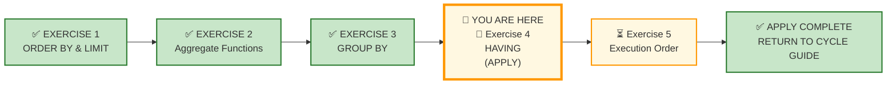
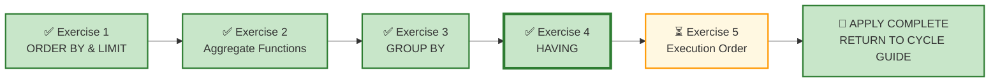

# 🗄️🤖 SQL & GenAI Course
**🎯 Quality Education for Anyone, Anywhere, Anytime — 💫 with Comfort, Convenience at no Cost**

---

## 🧪 Exercise 4: HAVING – Filtering the Buckets (Apply Augmented skills and deliver)

Welcome to your fourth **APPLY Phase** challenge for Module 3. You have interrogated group-filtering logic in the Socratic Mirror—understanding the difference between `WHERE` (row-level filtering) and `HAVING` (group-level filtering), and how to apply aggregate conditions to focus on meaningful groups. Now you step into the role of a consultant who must translate business thresholds into precise group filters.

**ACQUIRE → AUGMENT → APPLY**
🔧 **ACQUIRE:** Learn syntax
⚖️ **AUGMENT:** Judge correctness
🚀 **APPLY:** Deliver outcome

---

## 🌌 SQLVerse Check-In

<div style="border-left: 4px solid #9c27b0; background-color: #f3e5f5; padding: 15px; margin: 20px 0; border-radius: 0 8px 8px 0;">

Welcome to the **APPLY Phase** for **HAVING.**

You have completed **AUGMENT** for HAVING. You have interrogated AI logic, diagnosed group‑filtering defects, and learned that **HAVING filters the forest, not the trees**.

Now you enter APPLY – **Stop judging. Start building.**

### 🧠 The Professional Pipeline

Before writing a single line of SQL, run every request through the **Professional Pipeline**:

```text
[1] Business Question  ──> What threshold defines a meaningful group?
         ↓
[2] The One-Row Rule   ──> What must ONE single row represent after grouping and filtering?
         ↓
[3] The Blueprint      ──> Which aggregates define the group's significance?
         ↓
[4] Domain Invariance  ──> Strip away the industry nouns to find the skeletal pattern.
         ↓
[5] The Vehicle        ──> Type the execution code.
```

You will write clean, production-grade SQL queries using `HAVING` to answer critical stakeholder requests across two business universes. Your datasets are pre-loaded—your task is to bring the analytical judgment.

**The SQLVerse Mandate:** Your syntax is the vehicle; your judgment is the destination.

### ⚠️ THE ILLUSION OF SYMMETRY

The filename `4-having-practice.md` does **not** mean your scope is restricted to `HAVING`. The scope of *every single APPLY file* encompasses your entire toolkit.

- **60% of this floor** is anchored in `HAVING`.
- **The other 40% is a wildcard zone** and can draw from any concept in the spiral.

**ANCHOR CONCEPT ≠ DOMINANT CONCEPT**

**Prepare to use your entire toolkit.**

</div>

---

## 📍 Your Current Stage – APPLY Journey



---

## 🔧 Browser Office for APPLY

| Tab | Purpose | What to Do |
| :--- | :--- | :--- |
| **1: The Map** | Open this exercise file | You are here – reading this file. Complete the business requests below. |
| **2: The Factory** | Understand the data model and execute SQL | 1. Study the **ER Diagram & Schema Guide** (60 seconds is enough).<br>2. Identify the **entities** and their **relationships.**<br>3. Load the database **referenced** in the exercise section.<br>4. Write and execute your SQL queries. |
| **3: The Consultant** | Socratic questioning (no code generation) | Explains logic, suggests strategies – **never writes SQL**. Follow the **3‑Attempt Rule**. |
| **4: The Vault** | Save your work | Save each completed business deliverable in your Vault under: `Learning/Level-1-beginner/ACCELERATE/02-Exercises/MODULE3/`.<br><br>If you spot AI hallucinations or edge cases, log them in `Learning/Level-1-beginner/ACCELERATE/Socratic_Journals/` as separate files. |

> **Professional Habit:** Understand the data model before you query it – **Professional SQL developers** do that.

---

## 🌍 SQLVerse Multiverse — Quick Recall

**One SQL Engine. Infinite Business Universes.**

The SQLVerse Multiverse uses different business domains to train one professional capability:

> **Recognise invariant SQL patterns beneath changing business vocabularies.**

You have already encountered the flagship universes:

* 🛒 **E-Store**
* 🏥 **Hospital Planet**
* 🏘️ **Real Estate Planet**
* 💳 **FinVERSE**

Different industries. Different stakeholders. Different vocabulary.

**Same underlying SQL reasoning.**

Throughout this file, you may move between these universes to examine how the same SQL pattern survives changing business contexts.

> **The business vocabulary changes. The invariant logic remains.**

**Need a refresher?** Refer to the **SQLVerse Business Suite Guide** and **SQLVerse Business Multiverse Manifesto**.

---

* 📖 [SQLVerse Business Suite Guide →](../../../sqlverse-foundation/core/00-SQLVerse-Business-Suite-Guide.md)
* 📜 [SQLVerse Business Multiverse Manifesto →](../../../sqlverse-foundation/core/SQLVERSE_BUSINESS_MULTIVERSE.md)

---

## 📋 Business Use Case

Your consultancy has been engaged by multiple clients this quarter. Each request comes from a stakeholder who wants to see **only the groups that matter**—the ones that cross specific operational or financial thresholds.

Your job is to translate their business questions into precise group‑filtering logic.

**🎯 Core Theme:** `HAVING` filters groups after aggregation, revealing only the patterns that matter.

---

### ⚙️ Universal Pre-Flight Protocol

Before tackling the requests in *any* section or business universe, execute this standard workflow:

1. **Read the Blueprint** to understand the **Business model** and operational domain.
2. **Read the Schema Guide** to understand the **Technical implementation** and table relationships.
3. **Explore the Database File** to inspect the **schema definition, data types, constraints, and data distribution**.

The ACCELERATE Mandate: **Business first. Data model second. SQL third.**

---

As you move through the requests, focus on recognising the pattern rather than memorising the business scenario.

The business vocabulary changes. The skeletal pattern remains invariant.

**Two clients. Two domains. Same core filtering patterns.**

---

## 🛒 Section 1: Workshop Floor – E‑Store

**📁 Database:** Load [`level1_estore_apply.db`](../../../sqlverse-foundation/resources/data-models/flagship-universes/1-e-store/level1_estore_apply.db) in **Tab 2 (The Factory)** before starting this section.

**🗺️ Blueprint:** Study [`E-Store_Blueprint.md`](../../../sqlverse-foundation/resources/data-models/flagship-universes/1-e-store/E-Store_Blueprint.md) before writing any SQL.

**📊 Schema Guide:** Refer to [`E-Store_Schema.md`](../../../sqlverse-foundation/resources/data-models/flagship-universes/1-e-store/E-Store_Schema.md) for detailed technical implementation.

---

### 📋 Meet Your Dataset: E‑Store – Your Home Turf

| Table | Columns | What It Tells Us |
|-------|---------|------------------|
| `customers` | `customer_id`, `name`, `email`, `city`, `phone` | Retail consumer profile data |
| `products` | `product_id`, `product_name`, `price`, `category` | Complete store stock inventory |
| `orders` | `order_id`, `customer_id`, `order_date` | Transaction timeline events |
| `order_items` | `order_item_id`, `order_id`, `product_id`, `quantity` | Itemized invoice lines |

---

### Request 1 – High-Value Customers

The Customer Success Team wants to identify customers who have placed more than 3 orders. These are the repeat buyers who should be prioritised for loyalty programs.

**Deliverable:** Show each `customer_id` and their order count for the given condition.

---

### Request 2 – High-Performing Product Categories

The E-Commerce Director needs to identify product categories that are driving significant sales volume to allocate Q4 marketing budgets. They want to isolate categories with total sales exceeding **15,000**, considering only completed orders.

**Deliverable:** Show each category, its total revenue (rounded to 2 decimal places), and total orders, filtered for categories with total revenue greater than 15,000 from completed orders, sorted by total revenue in descending order.

---

### Request 3 – Product Categories with High Average Order Value

The Finance Team wants to identify product categories where the average order value exceeds **500**.

**Deliverable:** For each product category, show the average order value—but only for categories where the average is above 500.

---

## 💳 Section 2: Production Echo – FinVERSE

**📁 Database:** Load [`finverse.db`](../../../sqlverse-foundation/resources/data-models/flagship-universes/4-finverse/finverse.db) in **Tab 2 (The Factory)** before starting this section.

**🗺️ Blueprint:** Study [`FinVERSE_Blueprint.md`](../../../sqlverse-foundation/resources/data-models/flagship-universes/4-finverse/FinVERSE_Blueprint.md) before writing any SQL.

**📊 Schema Guide:** Refer to [`FinVERSE_Schema.md`](../../../sqlverse-foundation/resources/data-models/flagship-universes/4-finverse/FinVERSE_Schema.md) for detailed technical implementation.

---

### 📋 Meet Your Dataset: FinVERSE – Digital Banking Ecosystem

| Table | Columns | What It Tells Us |
|-------|---------|------------------|
| `customers` | `customer_id`, `first_name`, `last_name`, `email`, `phone`, `kyc_status`, `risk_score`, `onboarding_date`, `status` | Customer identity, verification, and risk profile |
| `accounts` | `account_id`, `customer_id`, `account_type`, `balance`, `status` | Customer accounts with balances and types |
| `transactions` | `transaction_id`, `account_id`, `merchant_id`, `amount`, `transaction_type`, `transaction_date`, `status`, `is_fraud` | Money movement – payments, transfers, purchases |
| `cards` | `card_id`, `account_id`, `card_type`, `card_number`, `expiry_date`, `status` | Debit and credit cards linked to accounts |
| `loans` | `loan_id`, `customer_id`, `principal`, `interest_rate`, `tenure_months`, `outstanding_balance`, `status`, `approval_date` | Loan products with repayment tracking |
| `loan_payments` | `payment_id`, `loan_id`, `amount`, `payment_date`, `payment_method`, `status` | Installment payments against loans |
| `merchants` | `merchant_id`, `name`, `category`, `settlement_type`, `status` | Businesses that accept payments |
| `support_tickets` | `ticket_id`, `customer_id`, `employee_id`, `ticket_type`, `status`, `created_date`, `resolved_date` | Customer support issues |
| `employees` | `employee_id`, `first_name`, `last_name`, `role`, `manager_id`, `branch_id` | FinVERSE staff |
| `branches` | `branch_id`, `name`, `city`, `state`, `status` | Physical or virtual service locations |

---

### Request 4 – High-Balance Customers

The Wealth Management Team wants to identify customers with a total account balance exceeding **50,000**. These customers are candidates for premium services.

**Deliverable:** For the selected customers, show the `customer_id` and total account balance.

---

### Request 5 – High-Transaction Accounts

The Fraud Analyst wants to identify accounts with more than 5 completed transactions. These accounts may require additional monitoring.

**Deliverable:** For each account, show the `account_id` and transaction count—but only for accounts with more than 5 completed transactions.

---

### Request 6 – High-Value Accounts by Transaction Volume

The Finance Executive wants to identify accounts where the total transaction volume exceeds **10,000**.

**Deliverable:** For the specified accounts, show the `account_id` and total transaction amount.

---

### Request 7 – High-Outstanding Loan Customers

The Credit Officer wants to identify customers whose total outstanding loan balance exceeds **100,000**. These customers represent significant credit exposure.

**Deliverable:** For the given customers, show the `customer_id` and total outstanding loan balance.

---

### Request 8 – High-Fraud Accounts

The Fraud Analyst wants to identify accounts with more than 1 fraudulent transaction.

**Deliverable:** For the selected accounts, show the `account_id` and fraud count.

---

### Request 9 – High-Volume Payment Methods

The Payments Strategy Lead wants to identify payment methods with more than 3 completed loan payments.

**Deliverable:** For each payment method, show the payment count for the given condition.

---

### Request 10 – High-Risk Customers with Open Support Tickets

The Support Director wants to identify customers with more than 1 open support ticket. These customers may need urgent attention.

**Deliverable:** For the selected customers, show the `customer_id` and open ticket count.

---
### 🔭 Beyond This Request

You have just identified customers with multiple open support tickets—a clear operational signal.

But consider a different kind of signal.

**What if the data model itself cannot represent a business event?**

In the next section, you will encounter a challenge that no `HAVING` clause can solve—because the business event you need to filter does not exist in the schema.

**The Hospital Planet Black Hole.**

> *"A patient arrives for an appointment. The doctor discovers a critical condition and admits them immediately.*
>
> *The hospital knows what happened.*
>
> *The doctors know what happened.*
>
> *The billing department knows what happened.*
>
> *But where does the database know what happened?"*

The schema has nowhere for that event to exist.

That is not a filtering problem. That is an **architectural problem**.

**Turn the page.**

---

## 🕳️ The Hospital Planet Black Hole

### When a Business Event Has Nowhere to Exist

### ✅ Walkthrough 1: The Routine Executive Checkup (Escalated Admission)

**The Context:** Arjun Mehta arrives at Hospital Planet at 9:00 AM for a scheduled _Corporate Executive Health Checkup_. He booked this slot two weeks in advance.

**Patient:** Mr. Arjun Mehta, 52, Corporate Executive  
**Hospital:** SQLVerse General Hospital  
**Package:** Corporate Executive Health Package  

#### The Workflow:

**9:00 AM — Routine Appointment**


Mr. Mehta arrives at the hospital for his scheduled health checkup. He is a busy professional; this is the only time he has set aside for his health this year.

He checks in at the reception, and the system records an **appointment**:

```text
appointment_id: 2025-03-15-001
patient_id: 452
doctor_id: 204 (Dr. Ananya Iyer — Internal Medicine)
appointment_date: 2025-03-15
reason: "Annual Executive Health Checkup"
status: "Arrived"
```

His vitals are recorded. Blood samples are drawn. ECG is performed. Everything appears normal so far.

**10:30 AM — Initial Consultation**

Dr. Iyer reviews his charts and conducts a physical examination. She notices mild tenderness in the lower right quadrant of his abdomen.

*"Arjun, have you been experiencing any abdominal pain recently?"*

*"Actually, yes—a bit of discomfort, but I thought it was just indigestion from all the business travel."*

Dr. Iyer is concerned. She orders an **abdominal ultrasound** immediately.

---

**11:45 AM — Ultrasound Results**

The ultrasound reveals **acute appendicitis**. The appendix is severely inflamed and at risk of rupture. Dr. Iyer calls the Gastroenterology specialist on duty.

**12:00 PM — Gastroenterology Consult**

*"Mr. Mehta, I'm Dr. Suresh Nair—Chief of Gastroenterology. Your appendix is inflamed. If we don't remove it today, there's a real risk of rupture and severe infection. I strongly recommend immediate surgery."*

*"Today? Surgery?"*

*"Yes. The condition is too advanced to wait. We need to admit you immediately."*

**12:15 PM — The Decision**

The doctor records the decision: **Patient admitted for emergency appendectomy.**


#### THE REALITY:

**🚨 Admitted**

**Patient:** Mr. Arjun Mehta  

**Reason:** Acute Appendicitis  

**Action:** Emergency Surgery  

**Status:** Admitted to Surgical Ward  

**1:00 PM — Surgery**

Mr. Mehta is wheeled into the operating room. The appendectomy is successful without complications.

**3:00 PM — Recovery**

He is moved to the post-op recovery unit with stable vitals.

**7:00 PM — Ward Admission**

He is shifted to a private room in the Surgical Ward for a 48-hour observation period.

**Day 2 — Post-Surgery Evaluation**

Dr. Nair visits him in the morning.

*"The surgery went well. We'll keep you here for one more day for monitoring. If everything looks good, you can go home tomorrow."*

**Day 3 — Discharge**

Mr. Mehta is discharged with prescriptions, a recovery plan, and a follow-up appointment in 10 days.

---

### ✅ Walkthrough 2: The Midnight ER Trauma (Direct Emergency Admission)

**The Context:** Priya Reddy falls from a step ladder at home at 11:15 PM. She suffers severe right leg pain, cannot bear weight, and is brought to the hospital by ambulance.

**Patient:** Ms. Priya Reddy, 28, Software Engineer  

**Hospital:** SQLVerse General Hospital

#### The Workflow:

**11:15 PM — The Incident**

Ms. Reddy falls hard from a step ladder, landing awkwardly on her right leg. The pain is immediate and severe. She cannot put any weight on her foot. A neighbor calls an ambulance.

**11:30 PM — Arrival at Emergency Ward**

The ambulance arrives at SQLVerse General Hospital. Ms. Reddy is wheeled directly into the emergency ward.

The receptionist opens the system to record her arrival. **There is no appointment.** This is not a scheduled visit.

She creates a new patient record:

```text
patient_id: 478
name: Priya Reddy
arrival_mode: Ambulance
arrival_time: 11:30 PM
reason_for_visit: "Suspected leg fracture — fall"
```
The system knows she arrived at the ER. But this is not an admission yet.

> The hospital records that Priya has arrived, but the current five-table model has no entity capable of representing the emergency encounter as a business event.

**11:40 PM — Triage & ER Assessment**

The triage nurse notes severe swelling, visible deformity, and an inability to bear weight. She is flagged as high priority. The duty doctor assesses her and orders emergency X-rays.

**11:55 PM — X-Ray Confirmation**

The X-ray reveals a **compound fracture of the right femur**. Dr. Arun Pillai, senior orthopedic surgeon, evaluates the scans.

_"This is a serious fracture, Priya. The bone has broken in two places. We need surgery to realign it and insert surgical pins. I am admitting you right now."_


**12:10 AM — 🚨 ADMITTED**

**Patient:** Ms. Priya Reddy

**Reason:** Compound fracture of right femur

**Action:** Emergency surgery (Femur realignment & fixation)

**Status:** Admitted to Orthopedic Ward

**1:30 AM — Surgery**

Ms. Reddy is wheeled into trauma surgery. Over 90 minutes, Dr. Pillai realigns the femur and secures it with surgical pins.

**3:30 AM — Recovery**

She is transferred to post-surgical recovery under continuous pain management.

**6:00 AM — Ward Admission**

She is shifted to Bed #12 in the Orthopedic Ward for multi-day inpatient recovery.

**Day 2 & 3 — Inpatient Care & Physical Therapy**

She undergoes daily orthopedic rounds, IV antibiotic courses, and initial physical therapy sessions.

**Day 4 — Discharge**

Ms. Reddy is discharged with crutches, an insurance clearance receipt, a care plan and a follow-up scheduled in 6 weeks.

---

### 🧾 The Evidence: What Happened vs. What the Database Remembers

| What Happened (Both Patients) | What the Database Remembers |
|-------------------------------|----------------------------|
| ✅ The patient arrived | ✅ Patient record created (`patients`) |
| ✅ The patient was examined by Doctor | ✅ Appointment recorded (`appointments`) — but only for Path 1 |
| ✅ **Emergency arrival occurs** | ⚠️ **No dedicated emergency-encounter entity** |
| ✅ **Emergency diagnosis made** | ❌ **No record of emergency intake assessment** |
| ✅ **Patient was admitted** | ❌ **No admission record** |
| ✅ Emergency surgery performed | ❌ No link showing who operated during the stay |
| ✅ Patient stayed multiple days in ward| ❌ **No admission or discharge dates** |
| ✅ Patient received daily inpatient care | ❌ **No link between daily care and the stay** |
| ✅ Insurance claim processed | ❌ **No insurance or coverage record** |
| ✅ **Patient was discharged** | ❌ **No discharge record** |

---

### 🚧 The Two Paths to the Blackhole

```text
Path 1 (Escalated):
   Outpatient Appointment ──> Clinical Emergency ──> Hospital Admission

Path 2 (Direct ER):
   Trauma Walk-in ─────────────────────────────────> Hospital Admission
```

**In Walkthrough 1**, an outpatient appointment *preceded* the hospitalization episode.

**In Walkthrough 2**, an outpatient appointment *never existed* at all.

**Yet in both cases, the hospital managed:**

 - an **inpatient stay**
 - performed **surgery**
 - administered **multi-day treatments**
 - processed **insurance claims**
 - logged a **discharge**

**Without recording any of the above in the database.**

Now look at your **5-table database schema:**

```text
patients          ← person
doctors           ← healthcare provider
appointments      ← scheduled encounter
treatments        ← treatment definition / catalog
bills             ← financial record

admissions        ← ❌ MISSING BUSINESS ENTITY
```
```text
What is missing?

          PATIENT
             │
             ▼
       ┌─────────────┐
       │  ADMISSION  │  ← 🕳️ BLACK HOLE
       └─────────────┘
          │   │   │
          ▼   ▼   ▼
      treatments
         tests
       surgery
      insurance
       discharge
```


 **The schema has no entity representing a hospitalization episode.**

---

### 💎 The Artisan's Discovery

> *"Something strange has happened."*

**Our patients arrived at the hospital.**

The hospital clearly knows what happened.

The doctors know what happened.

The billing department will eventually know what happened.

**But where does the database know what happened?**

There is no admission record.

There is no hospitalization episode.

There is no place to attach the patient's inpatient treatments, tests, surgery, insurance coverage, or discharge.

**This isn't a data gap.**

**It's a black hole in the data model.**

The patient entered the hospital's inpatient workflow and underwent a series of procedures.

**But the schema has nowhere for that event to exist.**

---

### 🔎 Architectural Investigation

The five-table model:

* `patients`
* `doctors`
* `appointments`
* `treatments`
* `bills`

can represent an **outpatient-centric workflow** reasonably well.

But an appointment is not the same thing as an admission.

Consider:

> Patient arrives for an appointment → doctor examines patient → patient is critically ill → doctor admits patient immediately.

And then...

**the Data model goes dark.**

At that moment, the business process has crossed a boundary:

**Appointment ≠ Hospital Admission**

The appointment records *why the patient came / was scheduled to come*.

The admission records *what happened after the clinical decision to hospitalize*.

**That distinction is architecturally significant.**

---

_Can you answer these critical business questions using the 5-table schema?_

-   **Question 1:** How many patients were admitted this month—and how many admissions originated from appointments versus emergency arrivals?
    
    -   🕳️ **DATA MISSING**
        
-   **Question 2:** What percentage of admitted patients required surgery?
    
    -   🕳️ **DATA MISSING**
        
-   **Question 3:** What was the average length of hospital stay?
    
    -   🕳️ **DATA MISSING**
        
-   **Question 4:** Which treatments and diagnostic tests were performed during each hospitalization?
    
    -   🕳️ **DATA MISSING**
        
-   **Question 5:** How much of the total hospitalization cost was covered by insurance?
    
    -   🕳️ **DATA MISSING**

---
## 🕳️ The critical realization

We failed to answer all five questions:

> Not because we forgot a column.
> 
> Not because SQL is too limited.
> 
> Not because the `GROUP BY` or `HAVING` query is too difficult.
> 
> **The hospitalization event exists in the real world—but does not exist in the data model. WHY?**
> 
> The patient entered an entirely new clinical workflow and underwent a series of procedures.
> 
> But the schema has nowhere for that hospitalization episode to exist.
> 
> **The patient has entered a black hole.**

---
> ###  THE ARCHITECT'S VERDICT
>
> **The SQL is not the problem.**
>
> **The missing business concept is.**


>  🧠 **THE SQLVERSE PRINCIPLE**
>
> **If a business event has no entity, the database cannot remember that event.**
>
> **And therefore:**
>
> **If the database cannot remember it, SQL cannot report it.**

 ## Business first. Data model second. SQL third.

### 📌 Endnote

> **The Architect has identified the root cause.** 
> 
> The full solution—including this blackhole and the other Module 4 case studies—awaits you in the next phase of your journey.

---

## 📋 Section 3: Executive Desk – Integrated Challenge

### Request 11 – Executive FinVERSE High-Impact Report

**The Chief Operating Officer (COO) wants:** An executive summary identifying high-impact customers, accounts, and activities across the FinVERSE ecosystem.

The request is deliberately open-ended:

> *"Give me a high-level strategic overview of our high-impact customers and accounts. I need to see customers with high balances, accounts with high transaction volume, and areas where we have significant fraud activity. I want to focus on the areas that need immediate attention."*

**Deliverable:** Produce the executive-level analysis you believe best answers the COO's request.

You may use **multiple SQL queries and multiple result sets** where appropriate.

Your goal is **not** to force everything into one result set.

Your goal is to **generate multiple result sets** if needed with each result set answering just one clearly identifiable executive question.

Your goal is to communicate the **business picture clearly and meaningfully**.

**Key Considerations:**
- Decide which groups matter—what thresholds define "high-impact"?
- Identify the appropriate analytical grain for each view.
- Choose columns that support strategic decision-making.
- Use clear, business-friendly aliases.
- Sort the results to highlight the most important patterns first.
- Add a comment block explaining your assumptions.
- Where different business questions require different result sets, **do not force them into a single query merely for the sake of producing one result set.**

> **No hints. No syntax templates. Just a business outcome.**

---

## ✅ A Day at Work – Progress Check

Review your engineering output before committing queries to your repository log tracker.

| Time | Deliverable | Domain | Status |
|------|-------------|--------|--------|
| 09:00 AM | Request 1 – High-Value Customers | E‑Store | ☐ |
| 10:00 AM | Request 2 – High-Performing Product Categories | E‑Store | ☐ |
| 11:00 AM | Request 3 – Product Categories with High Average Order Value | E‑Store | ☐ |
| 01:00 PM | Request 4 – High-Balance Customers | FinVERSE | ☐ |
| 02:00 PM | Request 5 – High-Transaction Accounts | FinVERSE | ☐ |
| 03:00 PM | Request 6 – High-Value Accounts by Transaction Volume | FinVERSE | ☐ |
| 04:00 PM | Request 7 – High-Outstanding Loan Customers | FinVERSE | ☐ |
| 05:00 PM | Request 8 – High-Fraud Accounts | FinVERSE | ☐ |
| 06:00 PM | Request 9 – High-Volume Payment Methods | FinVERSE | ☐ |
| 07:00 PM | Request 10 – High-Risk Customers with Open Support Tickets | FinVERSE | ☐ |
| 08:00 PM | Request 11 – Executive FinVERSE High-Impact Report | Executive | ☐ |

**Reflection:** Which thresholds did you use most frequently across all requests? How did you define "high-impact" in Request 11?

---

## 🔁 Bridge Forward

You have applied `HAVING` across E‑Store and FinVERSE. You have translated business thresholds into group-level filters and designed an executive FinVERSE performance report.

Next, you will master the **Execution Order** of a SQL query.

➡️ [Proceed to Exercise 5: Execution Order →](./5-mixed-practice-LAB.md)

---

## 🧭 File Navigation



| Previous Step | Next Step |
|:---:|:---:|
| [← Return to Exercise 3: GROUP BY](./3-group-by-practice-LAB.md) | [Continue to Exercise 5: Execution Order →](./5-mixed-practice-LAB.md) |

---

*Part of our mission for 🎯 Quality Education for Anyone, Anywhere, Anytime — 💫 with Comfort, Convenience at no Cost.*

**Level 1 | ACCELERATE Phase | APPLY | Module 3 | File 4**