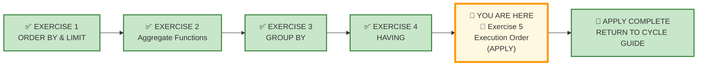
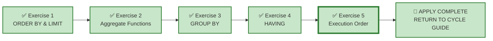

# 🗄️🤖 SQL & GenAI Course
**🎯 Quality Education for Anyone, Anywhere, Anytime — 💫 with Comfort, Convenience at no Cost**

---

## 🧪 Exercise 5: Execution Order – The Hidden Choreography (Apply Augmented skills and deliver)

Welcome to your final **APPLY Phase** challenge for Module 3. You have interrogated the hidden choreography of SQL in the Socratic Mirror—understanding the logical execution order (`FROM` → `WHERE` → `GROUP BY` → `HAVING` → `SELECT` → `ORDER BY` → `LIMIT`), why aliases fail in `WHERE` and succeed in `ORDER BY`, and how to diagnose stage‑mismatch defects. Now you step into the role of a consultant who must diagnose, repair, and trace broken queries across multiple business universes.

**ACQUIRE → AUGMENT → APPLY**
🔧 **ACQUIRE:** Learn syntax
⚖️ **AUGMENT:** Judge correctness
🚀 **APPLY:** Deliver outcome

---

## 🌌 SQLVerse Check-In

<div style="border-left: 4px solid #9c27b0; background-color: #f3e5f5; padding: 15px; margin: 20px 0; border-radius: 0 8px 8px 0;">

Welcome to the **APPLY Phase** for **Execution Order.**

You have completed **AUGMENT** for Execution Order. You have interrogated AI logic, diagnosed alias‑visibility defects, traced queries stage by stage, and learned that **the written order is for humans; the execution order is for the machine**.

Now you enter the final APPLY chamber – **Stop judging. Start building. Then diagnose and repair.**

### 🧠 The Professional Pipeline

Before writing a single line of SQL, run every request through the **Professional Pipeline**:

```text
[1] Business Question  ──> What does the stakeholder actually need to see?
         ↓
[2] The One-Row Rule   ──> What must ONE single row represent at the final output?
         ↓
[3] The Blueprint      ──> What tables and columns provide the data?
         ↓
[4] Domain Invariance  ──> Does the execution order pattern apply to all queries?
         ↓
[5] The Vehicle        ──> Write the SQL, then trace it step by step.
```

You will write clean, production-grade SQL queries, diagnose broken AI‑generated queries, and trace execution paths across all four flagship universes. Your datasets are pre‑loaded—your task is to bring the analytical judgment.

**The SQLVerse Mandate:** Your syntax is the vehicle; your judgment is the destination.

### ⚠️ THE ILLUSION OF SYMMETRY

The filename `5-execution-order.md` does **not** mean your scope is restricted to `ORDER BY`. The scope of *every single APPLY file* encompasses your entire toolkit.

- **60% of this floor** is anchored in execution‑order reasoning.
- **The other 40% is a wildcard zone** and can draw from any concept in the spiral.

**ANCHOR CONCEPT ≠ DOMINANT CONCEPT**

**Prepare to use your entire toolkit.**

</div>

---

## 📍 Your Current Stage – APPLY Journey



---

## 🔧 Browser Office for APPLY

| Tab | Purpose | What to Do |
| :--- | :--- | :--- |
| **1: The Map** | Open this exercise file | You are here – reading this file. Complete the business requests below. |
| **2: The Factory** | Understand the data model and execute SQL | 1. Study the **ER Diagram & Schema Guide** (60 seconds is enough).<br>2. Identify the **entities** and their **relationships.**<br>3. Load the database **referenced** in the exercise section.<br>4. Write and execute your SQL queries. |
| **3: The Consultant** | Socratic questioning (no code generation) | Explains logic, suggests strategies – **never writes SQL**. Follow the **3‑Attempt Rule**. |
| **4: The Vault** | Save your work | Save each completed business deliverable in your Vault under: `Learning/Level-1-beginner/ACCELERATE/02-Exercises/MODULE3/`.<br><br>If you spot AI hallucinations or edge cases, log them in `Learning/Level-1-beginner/ACCELERATE/Socratic_Journals/` as separate files. |

> **Professional Habit:** Understand the data model before you query it – **Professional SQL developers** do that.

---

## 🌍 SQLVerse Multiverse — Quick Recall

**One SQL Engine. Infinite Business Universes.**

The SQLVerse Multiverse uses different business domains to train one professional capability:

> **Recognise invariant SQL patterns beneath changing business vocabularies.**

You have already encountered the flagship universes:

* 🛒 **E-Store**
* 🏥 **Hospital Planet**
* 🏘️ **Real Estate Planet**
* 💳 **FinVERSE**

Different industries. Different stakeholders. Different vocabulary.

**Same underlying SQL reasoning.**

Throughout this file, you will move between these universes to examine how the same execution‑order principles survive changing business contexts.

> **The business vocabulary changes. The invariant logic remains.**

**Need a refresher?** Refer to the **SQLVerse Business Suite Guide** and **SQLVerse Business Multiverse Manifesto**.

---

* 📖 [SQLVerse Business Suite Guide →](../../../sqlverse-foundation/core/00-SQLVerse-Business-Suite-Guide.md)
* 📜 [SQLVerse Business Multiverse Manifesto →](../../../sqlverse-foundation/core/SQLVERSE_BUSINESS_MULTIVERSE.md)

---

## 📋 Business Use Case

Your consultancy has been engaged by multiple clients this quarter. Each request comes from a stakeholder who wants an answer—but the AI‑generated query they received is broken.

Your job is to **diagnose** the defect, **repair** the query, and **trace** the execution path.

**🎯 Core Theme:** Execution‑order reasoning is the final layer of SQL mastery—knowing when each clause runs is the difference between a working query and a broken one.

---

### ⚙️ Universal Pre-Flight Protocol

Before tackling the requests in *any* section or business universe, execute this standard workflow:

1. **Read the Blueprint** to understand the **Business model** and operational domain.
2. **Read the Schema Guide** to understand the **Technical implementation** and table relationships.
3. **Explore the Database File** to inspect the **schema definition, data types, constraints, and data distribution**.

The ACCELERATE Mandate: **Business first. Data model second. SQL third.**

---

As you move through the requests, focus on recognising the pattern rather than memorising the business scenario.

The business vocabulary changes. The skeletal pattern remains invariant.

**All four flagship universes. Same execution‑order principles.**

---

## 🛒 Section 1: Workshop Floor – E‑Store

Before solving the requests, spend a few minutes understanding the business model, workflow, ER diagram, and table schemas.

**Business first. Data model second. SQL third.**

**📁 Database:** Load [`level1_estore_apply.db`](../../../sqlverse-foundation/resources/data-models/flagship-universes/1-e-store/level1_estore_apply.db) in **Tab 2 (The Factory)** before starting this section.

**🗺️ Blueprint:** Study [`E-Store_Blueprint.md`](../../../sqlverse-foundation/resources/data-models/flagship-universes/1-e-store/E-Store_Blueprint.md) before writing any SQL.

**📊 Schema Guide:** Refer to [`E-Store_Schema.md`](../../../sqlverse-foundation/resources/data-models/flagship-universes/1-e-store/E-Store_Schema.md) for detailed technical implementation.

---

### 📋 Meet Your Dataset: E‑Store – Your Home Turf

| Table | Columns | What It Tells Us |
|-------|---------|------------------|
| `customers` | `customer_id`, `name`, `email`, `city`, `phone` | Retail consumer profile data |
| `products` | `product_id`, `product_name`, `price`, `category` | Complete store stock inventory |
| `orders` | `order_id`, `customer_id`, `order_date` | Transaction timeline events |
| `order_items` | `order_item_id`, `order_id`, `product_id`, `quantity` | Itemized invoice lines |

---

### Request 1 – Alias in WHERE (Alias Does Not Exist)

**Business Question:** The Product Manager wants to identify product categories whose **total listed product value** exceeds 15,000 credits.

**The AI‑Generated Query:**

```sql
SELECT 
    category,
    SUM(price) AS total_revenue
FROM products
WHERE total_revenue > 15000
GROUP BY category;
```

**Your Task:**

1. **Diagnose:** At what execution stage does the problem occur?
2. **Explain:** What exists at that point? What does not exist yet?
3. **Repair:** Write the corrected query.
4. **Trace:** Walk through the execution order of your corrected query.

---

### Request 2 – Alias in HAVING (Dialect‑Dependent)

**Business Question:** The Finance Team wants to identify product categories with an average price above 500 credits.

**The AI‑Generated Query:**

```sql
SELECT 
    category,
    AVG(price) AS avg_price
FROM products
GROUP BY category
HAVING avg_price > 500;
```

**Your Task:**

1. **Diagnose:** Is this query safe across all databases? Why or why not?
2. **Explain:** When does `avg_price` become available?
3. **Repair:** Write the corrected query using a cross‑platform safe approach.
4. **Trace:** Walk through the execution order of your corrected query.

---

### Request 3 – Aggregate in WHERE (Stage Mismatch)

**Business Question:** The Operations Manager wants to identify customers who have placed more than 5 orders.

**The AI‑Generated Query:**

```sql
SELECT 
    customer_id,
    COUNT(order_id) AS order_count
FROM orders
WHERE COUNT(order_id) > 5
GROUP BY customer_id;
```

**Your Task:**

1. **Diagnose:** Why does this query fail?
2. **Explain:** At what stage does the aggregate become available?
3. **Repair:** Write the corrected query.
4. **Trace:** Walk through the execution order of your corrected query.

---

## 🏥 Section 2: Production Echo – Hospital Planet

**Domain Context:** You are deployed to a new client – **Hospital Planet**, a healthcare operations universe. The nouns have changed, but the execution‑order principles remain identical.

Before solving the requests, spend a few minutes understanding the business model, workflow, ER diagram, and table schemas.

**Business first. Data model second. SQL third.**

**📁 Database:** Load [`hospital_planet.db`](../../../sqlverse-foundation/resources/data-models/flagship-universes/2-hospital-planet/hospital_planet.db) in **Tab 2 (The Factory)** before starting this section.

**🗺️ Blueprint:** Study [`Hospital_Planet_Blueprint.md`](../../../sqlverse-foundation/resources/data-models/flagship-universes/2-hospital-planet/Hospital_Planet_Blueprint.md) before writing any SQL.

**📊 Schema Guide:** Refer to [`Hospital_Planet_Schema.md`](../../../sqlverse-foundation/resources/data-models/flagship-universes/2-hospital-planet/Hospital_Planet_Schema.md) for detailed technical implementation.

---

### 📋 Meet Your Dataset: Hospital Planet – Healthcare Operations

| Table | Columns | What It Tells Us |
|-------|---------|------------------|
| `patients` | `patient_id`, `name`, `email`, `phone`, `status` | Patient identity and status |
| `doctors` | `doctor_id`, `first_name`, `last_name`, `specialisation`, `status` | Doctor profiles and specialisations |
| `treatments` | `treatment_id`, `treatment_name`, `cost`, `category` | Treatment offerings and costs |
| `appointments` | `appointment_id`, `patient_id`, `treatment_id`, `doctor_id`, `appointment_date` | Patient appointments |
| `bills` | `bill_id`, `patient_id`, `amount`, `bill_date`, `payment_status` | Billing and payment records |

---

### Request 4 – Alias in WHERE (Alias Does Not Exist)

**Business Question:** The Chief Medical Officer wants to identify doctors with more than 10 appointments.

**The AI‑Generated Query:**

```sql
SELECT 
    doctor_id,
    COUNT(appointment_id) AS appointment_count
FROM appointments
WHERE appointment_count > 10
GROUP BY doctor_id;
```

**Your Task:**

1. **Diagnose:** At what execution stage does the problem occur?
2. **Explain:** What exists at that point? What does not exist yet?
3. **Repair:** Write the corrected query.
4. **Trace:** Walk through the execution order of your corrected query.

---

### Request 5 – Multiple Aliases in SELECT and HAVING

**Business Question:** The Revenue Cycle Manager wants to identify patients with total billing above 10,000 credits.

**The AI‑Generated Query:**

```sql
SELECT 
    patient_id,
    SUM(amount) AS total_billed
FROM bills
GROUP BY patient_id
HAVING total_billed > 10000;
```

**Your Task:**

1. **Diagnose:** Is this query safe across all databases? Why or why not?
2. **Explain:** When does `total_billed` become available in `HAVING`?
3. **Repair:** Write the corrected query using a cross‑platform safe approach.
4. **Trace:** Walk through the execution order of your corrected query.

---

### Request 6 – Aggregate in WHERE (Stage Mismatch)

**Business Question:** The Medical Director wants to identify treatment categories with average cost above 1,500 credits.

**The AI‑Generated Query:**

```sql
SELECT 
    category,
    AVG(cost) AS avg_cost
FROM treatments
WHERE AVG(cost) > 1500
GROUP BY category;
```

**Your Task:**

1. **Diagnose:** Why does this query fail?
2. **Explain:** At what stage does the aggregate become available?
3. **Repair:** Write the corrected query.
4. **Trace:** Walk through the execution order of your corrected query.

---

## 🏘️ Section 3: Production Echo – Real Estate Planet

**Domain Context:** You are deployed to a new client – **Real Estate Planet**, a property and brokerage marketplace. The nouns have changed, but the execution‑order principles remain identical.

Before solving the requests, spend a few minutes understanding the business model, workflow, ER diagram, and table schemas.

**Business first. Data model second. SQL third.**

**📁 Database:** Load [`real_estate_planet.db`](../../../sqlverse-foundation/resources/data-models/flagship-universes/3-real-estate-planet/real_estate_planet.db) in **Tab 2 (The Factory)** before starting this section.

**🗺️ Blueprint:** Study [`Real_Estate_Planet_Blueprint.md`](../../../sqlverse-foundation/resources/data-models/flagship-universes/3-real-estate-planet/Real_Estate_Planet_Blueprint.md) before writing any SQL.

**📊 Schema Guide:** Refer to [`Real_Estate_Planet_Schema.md`](../../../sqlverse-foundation/resources/data-models/flagship-universes/3-real-estate-planet/Real_Estate_Planet_Schema.md) for detailed technical implementation.

---

### 📋 Meet Your Dataset: Real Estate Planet – Property Marketplace

| Table | Columns | What It Tells Us |
|-------|---------|------------------|
| `agents` | `agent_id`, `first_name`, `last_name`, `email`, `phone`, `brokerage` | Real estate agents and their brokerages |
| `clients` | `client_id`, `first_name`, `last_name`, `email`, `phone`, `client_type` | Buyers, sellers, or both |
| `properties` | `property_id`, `agent_id`, `address`, `city`, `state`, `zip`, `property_type`, `list_price`, `status` | Property listings with prices and statuses |
| `viewings` | `viewing_id`, `property_id`, `client_id`, `viewing_date`, `feedback` | Property viewings by clients |
| `offers` | `offer_id`, `property_id`, `client_id`, `agent_id`, `offer_amount`, `offer_date`, `status` | Offers made on properties |
| `contracts` | `contract_id`, `offer_id`, `property_id`, `client_id`, `agent_id`, `sale_price`, `closing_date` | Accepted offers that become contracts |
| `payments` | `payment_id`, `contract_id`, `payment_date`, `amount`, `payment_method` | Payments made against contracts |

---

### Request 7 – Alias in WHERE (Alias Does Not Exist)

**Business Question:** The Chief Revenue Officer wants to identify agents with total sales above $350,000.

**The AI‑Generated Query:**

```sql
SELECT 
    agent_id,
    SUM(sale_price) AS total_sales
FROM contracts
WHERE total_sales > 350000
GROUP BY agent_id;
```

**Your Task:**

1. **Diagnose:** At what execution stage does the problem occur?
2. **Explain:** What exists at that point? What does not exist yet?
3. **Repair:** Write the corrected query.
4. **Trace:** Walk through the execution order of your corrected query.

---

### Request 8 – Multiple Aliases in SELECT and HAVING

**Business Question:** The Brokerage Director wants to identify property types with average list price above $500,000.

**The AI‑Generated Query:**

```sql
SELECT 
    property_type,
    AVG(list_price) AS avg_price
FROM properties
WHERE status = 'Active'
GROUP BY property_type
HAVING avg_price > 500000;
```

**Your Task:**

1. **Diagnose:** Is this query safe across all databases? Why or why not?
2. **Explain:** When does `avg_price` become available in `HAVING`?
3. **Repair:** Write the corrected query using a cross‑platform safe approach.
4. **Trace:** Walk through the execution order of your corrected query.

---

### Request 9 – Aggregate in WHERE (Stage Mismatch)

**Business Question:** The Investment Team wants to identify cities with total active listing value above $1,000,000.

**The AI‑Generated Query:**

```sql
SELECT 
    city,
    SUM(list_price) AS total_value
FROM properties
WHERE status = 'Active'
  AND SUM(list_price) > 1000000
GROUP BY city;
```

**Your Task:**

1. **Diagnose:** Why does this query fail?
2. **Explain:** At what stage does the aggregate become available?
3. **Repair:** Write the corrected query.
4. **Trace:** Walk through the execution order of your corrected query.

---

## 💳 Section 4: Production Echo – FinVERSE

**Domain Context:** You are deployed to a new client – **FinVERSE**, a digital banking ecosystem. The nouns have changed, but the execution‑order principles remain identical.

Before solving the requests, spend a few minutes understanding the business model, workflow, ER diagram, and table schemas.

**Business first. Data model second. SQL third.**

**📁 Database:** Load [`finverse.db`](../../../sqlverse-foundation/resources/data-models/flagship-universes/4-finverse/finverse.db) in **Tab 2 (The Factory)** before starting this section.

**🗺️ Blueprint:** Study [`FinVERSE_Blueprint.md`](../../../sqlverse-foundation/resources/data-models/flagship-universes/4-finverse/FinVERSE_Blueprint.md) before writing any SQL.

**📊 Schema Guide:** Refer to [`FinVERSE_Schema.md`](../../../sqlverse-foundation/resources/data-models/flagship-universes/4-finverse/FinVERSE_Schema.md) for detailed technical implementation.

---

### 📋 Meet Your Dataset: FinVERSE – Digital Banking Ecosystem

| Table | Columns | What It Tells Us |
|-------|---------|------------------|
| `customers` | `customer_id`, `first_name`, `last_name`, `email`, `phone`, `kyc_status`, `risk_score`, `onboarding_date`, `status` | Customer identity, verification, and risk profile |
| `accounts` | `account_id`, `customer_id`, `account_type`, `balance`, `status` | Customer accounts with balances and types |
| `transactions` | `transaction_id`, `account_id`, `merchant_id`, `amount`, `transaction_type`, `transaction_date`, `status`, `is_fraud` | Money movement – payments, transfers, purchases |
| `cards` | `card_id`, `account_id`, `card_type`, `card_number`, `expiry_date`, `status` | Debit and credit cards linked to accounts |
| `loans` | `loan_id`, `customer_id`, `principal`, `interest_rate`, `tenure_months`, `outstanding_balance`, `status`, `approval_date` | Loan products with repayment tracking |
| `loan_payments` | `payment_id`, `loan_id`, `amount`, `payment_date`, `payment_method`, `status` | Installment payments against loans |
| `merchants` | `merchant_id`, `name`, `category`, `settlement_type`, `status` | Businesses that accept payments |
| `support_tickets` | `ticket_id`, `customer_id`, `employee_id`, `ticket_type`, `status`, `created_date`, `resolved_date` | Customer support issues |
| `employees` | `employee_id`, `first_name`, `last_name`, `role`, `manager_id`, `branch_id` | FinVERSE staff |
| `branches` | `branch_id`, `name`, `city`, `state`, `status` | Physical or virtual service locations |

---

### Request 10 – Alias in WHERE (Alias Does Not Exist)

**Business Question:** The Credit Officer wants to identify customers with total outstanding loan balance above $100,000.

**The AI‑Generated Query:**

```sql
SELECT 
    customer_id,
    SUM(outstanding_balance) AS total_balance
FROM loans
WHERE total_balance > 100000
GROUP BY customer_id;
```

**Your Task:**

1. **Diagnose:** At what execution stage does the problem occur?
2. **Explain:** What exists at that point? What does not exist yet?
3. **Repair:** Write the corrected query.
4. **Trace:** Walk through the execution order of your corrected query.

---

### Request 11 – Multiple Aliases in SELECT and HAVING

**Business Question:** The Fraud Analyst wants to identify accounts with more than 2 fraudulent transactions.

**The AI‑Generated Query:**

```sql
SELECT 
    account_id,
    COUNT(transaction_id) AS fraud_count
FROM transactions
WHERE is_fraud = 1
GROUP BY account_id
HAVING fraud_count > 2;
```

**Your Task:**

1. **Diagnose:** Is this query safe across all databases? Why or why not?
2. **Explain:** When does `fraud_count` become available in `HAVING`?
3. **Repair:** Write the corrected query using a cross‑platform safe approach.
4. **Trace:** Walk through the execution order of your corrected query.

---

### Request 12 – Aggregate in WHERE (Stage Mismatch)

**Business Question:** The Finance Executive wants to identify accounts with total transaction volume above $10,000.

**The AI‑Generated Query:**

```sql
SELECT 
    account_id,
    SUM(amount) AS total_volume
FROM transactions
WHERE status = 'Completed'
  AND SUM(amount) > 10000
GROUP BY account_id;
```

**Your Task:**

1. **Diagnose:** Why does this query fail?
2. **Explain:** At what stage does the aggregate become available?
3. **Repair:** Write the corrected query.
4. **Trace:** Walk through the execution order of your corrected query.

---

## 📋 Section 5: Executive Desk – Integrated Challenge

### Request 13 – Executive Multi‑Domain Audit

**The Chief Data Officer (CDO) wants:** A diagnostic review of the AI‑generated queries across all four flagship universes.

The request is deliberately open-ended:

> *"We have received AI‑generated queries from our E‑Store, Hospital Planet, Real Estate Planet, and FinVERSE teams. They all look plausible—but some of them may be broken. Identify which queries are broken, diagnose the execution‑stage defect, repair them, and trace the execution path of each repaired query.*

> *Present your findings in a structured audit report. For each query, explain:*
> - *The business question it was trying to answer*
> - *The execution‑stage defect*
> - *The corrected query*
> - *The execution path trace*

> *Your report should demonstrate that you understand execution order—not just syntax."*

**Your Task:**

You have been given the following AI‑generated queries (one from each universe). Some are broken. Some may be safe but not ideal. Your job is to audit them all.

**Query A — E‑Store:**

```sql
SELECT 
    customer_id,
    COUNT(order_id) AS order_count
FROM orders
WHERE order_count > 3
GROUP BY customer_id;
```

**Query B — Hospital Planet:**

```sql
SELECT 
    patient_id,
    SUM(amount) AS total_billed
FROM bills
GROUP BY patient_id
HAVING total_billed > 10000
ORDER BY total_billed DESC;
```

**Query C — Real Estate Planet:**

```sql
SELECT 
    agent_id,
    SUM(sale_price) AS total_sales
FROM contracts
WHERE total_sales > 350000
GROUP BY agent_id
ORDER BY total_sales DESC;
```

**Query D — FinVERSE:**

```sql
SELECT 
    customer_id,
    SUM(outstanding_balance) AS total_balance
FROM loans
GROUP BY customer_id
HAVING total_balance > 100000;
```

**For each query, provide:**

1. **Diagnosis:** Is the query broken? If so, at what execution stage?
2. **Explanation:** What is the defect? What exists/does not exist at that stage?
3. **Repair:** Write the corrected query (if needed).
4. **Trace:** Walk through the execution order of the corrected query.

**Your deliverable:** A structured audit report with all four queries diagnosed, repaired (where needed), and traced.

---

## ✅ A Day at Work – Progress Check

Review your engineering output before committing queries to your repository log tracker.

| Time | Deliverable | Domain | Status |
|------|-------------|--------|--------|
| 09:00 AM | Request 1 – Alias in WHERE (E‑Store) | E‑Store | ☐ |
| 10:00 AM | Request 2 – Alias in HAVING (E‑Store) | E‑Store | ☐ |
| 11:00 AM | Request 3 – Aggregate in WHERE (E‑Store) | E‑Store | ☐ |
| 01:00 PM | Request 4 – Alias in WHERE (Hospital) | Hospital | ☐ |
| 02:00 PM | Request 5 – Multiple Aliases (Hospital) | Hospital | ☐ |
| 03:00 PM | Request 6 – Aggregate in WHERE (Hospital) | Hospital | ☐ |
| 04:00 PM | Request 7 – Alias in WHERE (Real Estate) | Real Estate | ☐ |
| 05:00 PM | Request 8 – Multiple Aliases (Real Estate) | Real Estate | ☐ |
| 06:00 PM | Request 9 – Aggregate in WHERE (Real Estate) | Real Estate | ☐ |
| 07:00 PM | Request 10 – Alias in WHERE (FinVERSE) | FinVERSE | ☐ |
| 08:00 PM | Request 11 – Multiple Aliases (FinVERSE) | FinVERSE | ☐ |
| 09:00 PM | Request 12 – Aggregate in WHERE (FinVERSE) | FinVERSE | ☐ |
| 10:00 PM | Request 13 – Executive Multi‑Domain Audit | Executive | ☐ |

**Reflection:** What pattern did you notice across all three defect types (Alias in WHERE, Alias in HAVING, Aggregate in WHERE)? How does understanding execution order help you diagnose and repair these defects?

---

## 🔁 Bridge Forward

You have applied execution‑order reasoning across all four flagship universes. You have diagnosed, repaired, and traced broken queries—and audited a multi‑domain report.

**🎯 APPLY COMPLETE — RETURN TO CYCLE GUIDE.**

➡️ [Return to Cycle Guide →](../../01-The-Socratic-Mirror/CYCLE2_GUIDE.md)

---

## 🧭 File Navigation



| Previous Step | Next Step |
|:---:|:---:|
| [← Return to Exercise 4: HAVING](./4-having-practice-LAB.md) | [Return to Cycle Guide →](../../01-The-Socratic-Mirror/CYCLE2_GUIDE.md) |

---

*Part of our mission for 🎯 Quality Education for Anyone, Anywhere, Anytime — 💫 with Comfort, Convenience at no Cost.*

**Level 1 | ACCELERATE Phase | APPLY | Module 3 | File 5**