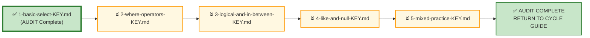

# 🗄️🤖 SQL & GenAI Course
**🎯 Quality Education for Anyone, Anywhere, Anytime — 💫 with Comfort, Convenience at no Cost**

---

## 🔑 File 1: `1-basic-select-KEY` (AUDIT Phase)

Welcome to the **Architect's Post‑Mortem**. The execution phase is over. Your outcomes have been delivered. Now, we step completely out of the execution layer and into the review room.

If you came here looking for a traditional answer key to copy‑paste, you are in the wrong room. In the **ACCELERATE** paradigm, **AUDIT is not an answer sheet** – it is a **reverse‑engineering laboratory**. We are here to dissect the thinking process behind the code, evaluate architectural trade‑offs, and map your demonstrated labor directly to your professional Skill‑Tree.

---

## 🌌 SQLVerse Check-In

<div style="border-left: 4px solid #9c27b0; background-color: #f3e5f5; padding: 15px; margin: 20px 0; border-radius: 0 8px 8px 0;">

**You have built. Now you reflect.**

In AUDIT, you will:
- Validate your solutions against a reference
- Extract the **gemstones** hidden inside each business request
- Convert your demonstrations into **permanent competencies**

### 🧠 The Core Philosophy: Requirement vs. Concept

A manager never walks up to your desk and says, *"Pull this data, but only use concepts from Chapter 1."* They give you messy business prose.

Your real value as an Artisan is your ability to **spot the hidden technical geometry buried inside that prose**.

**The critic's chair is gone. Welcome to the architect's review.**

</div>

---

## 📍 Your Current Stage – AUDIT Journey

```mermaid
flowchart LR
    A["✅ APPLY COMPLETE<br/>Exercise 1-5"] --> B
    B["📍 YOU ARE HERE<br/>🔑 1-basic-select-KEY.md<br/>(AUDIT)"] --> C
    C["⏳ 2-where-operators-KEY.md"] --> D
    D["⏳ 3-logical-and-in-between-KEY.md"] --> E
    E["⏳ 4-like-and-null-KEY.md"] --> F
    F["⏳ 5-mixed-practice-KEY.md"] --> G
    G["✅ AUDIT COMPLETE<br/>RETURN TO CYCLE GUIDE"]
    
    style A fill:#c8e6c9,stroke:#2e7d32,stroke-width:2px
    style B fill:#fff8e1,stroke:#ff9800,stroke-width:4px
    style C fill:#fff8e1,stroke:#ff9800,stroke-width:2px
    style D fill:#fff8e1,stroke:#ff9800,stroke-width:2px
    style E fill:#fff8e1,stroke:#ff9800,stroke-width:2px
    style F fill:#fff8e1,stroke:#ff9800,stroke-width:2px
    style G fill:#c8e6c9,stroke:#2e7d32,stroke-width:2px
```



---

## 🧪 Validation Protocol

Before you consult this AUDIT file:
- [ ] Have you completed all Business Requests in APPLY File 1?
- [ ] Have you saved your queries in your Vault?
- [ ] Have you tested each query and verified the results?

> 🔁 **Audit Rule:** The solutions below are a reference, not a shortcut. Compare your reasoning, not just your code.

---

# 💎 Phase 1: The Semantic Excavation (Requirement → Gemstone)

Let's dissect the client tickets you resolved on the workshop floor and see how real practitioners recognise the hidden gemstones inside raw business language.

---

## 🛒 Ticket Pair 1: State Absence Detection

| E‑Store Request | Hospital Planet Request |
|-----------------|-------------------------|
| Request #1 – Missing Email Addresses | Request #9 – Missing Phone Numbers |

### 🪵 The Surface Reading

The client needs to clean up user accounts where critical contact data profiles were left unpopulated.

### 💎 Gemstone Extraction

Look at the linguistic clues: `"missing"`, `"unavailable"`, `"unknown"`, `"not provided"`, or `"blank"`. When a business user utters these words, the hidden structural gemstone is **Void State Detection**.

### 🧭 Concept Mapping & Alternate Paths

- **Technical Translation:** `NULL` State Predication
- **The Absolute Path:** `WHERE column_name IS NULL`
- **❌ The Pitfall Trap:** `WHERE column_name = NULL`
- **The Post‑Mortem Lesson:** The database engine operates on Three‑Valued Logic (True, False, Unknown). `NULL` represents a completely missing or unknown state, not a concrete value. Comparing anything to an unknown using an equality operator (`=`) yields `UNKNOWN`, which causes the engine to discard the rows entirely.

### 🪞 Pattern Reflection

| E‑Store | Hospital Planet | Same SQL Pattern |
|---------|-----------------|------------------|
| Missing email addresses | Missing phone numbers | `IS NULL` |

**Insight:** The domain changes. The SQL pattern does not. This is the Mirror Bridge in action – recognising the same structural pattern across different business contexts.

---

## 🛒 Ticket Pair 2: Deduplication & Uniqueness

| E‑Store Request | Hospital Planet Request |
|-----------------|-------------------------|
| Request #3 – Unique Customer Cities | Request #11 – Unique Treatment Categories |

### 🪵 The Surface Reading

The executive board needs a clean overview of regional footprints or service branches without sorting through thousands of repeated entries.

### 💎 Gemstone Extraction

The business keywords are explicit: `"unique"` or `"distinct list"`. The hidden gemstone is **Cardinality Simplification**.

### 🧭 Concept Mapping & Alternate Paths

- **Technical Translation:** Row‑Set Deduplication
- **The Choice Pattern:** `SELECT DISTINCT city FROM customers;`
- **🔄 The Alternate Extraction Path:** You could technically achieve this using a `GROUP BY` clause. However, a Senior Architect rejects this because `GROUP BY` explicitly communicates *aggregation intent* (counting, summing, or grouping rows to compute statistics). `DISTINCT` cleanly communicates *uniqueness intent*. We choose our tools based on **readability and intent communication**, not just raw execution compatibility.

### 🪞 Pattern Reflection

| E‑Store | Hospital Planet | Same SQL Pattern |
|---------|-----------------|------------------|
| Unique customer cities | Unique treatment categories | `DISTINCT` |

**Insight:** Whether you are listing cities or treatment categories, the pattern is identical. The nouns change. The SQL stays the same.

---

## 🛒 Ticket Pair 3: Double‑Ended Boundary Isolation

| E‑Store Request | Hospital Planet Request |
|-----------------|-------------------------|
| Request #2 & #5 – Historical Surge Tracker / First Week of October | Request #13 – Appointments in First Week of February |

### 🪵 The Surface Reading

Isolate a subset of transactions to a strictly bounded chronological window.

### 💎 Gemstone Extraction

Keywords: `"during the first week"`, `"settled between X and Y"`. The hidden gemstone is **Inclusive Range Evaluation**.

### 🧭 Concept Mapping & Alternate Paths

- **Technical Translation:** Range Targeting
- **Path A (The Idiomatic Shape):** `WHERE order_date BETWEEN '2025-10-01' AND '2025-10-07'`
- **Path B (The Relational Shape):** `WHERE order_date >= '2025-10-01' AND order_date <= '2025-10-07'`
- **Architectural Reflection:** Both paths emit identical execution plans in the database engine. However, `BETWEEN` scales visually – it reads like spoken business English, significantly reducing cognitive drag during intensive code reviews.

### 🪞 Pattern Reflection

| E‑Store | Hospital Planet | Same SQL Pattern |
|---------|-----------------|------------------|
| Orders in first week of October | Appointments in first week of February | `BETWEEN` |

**Insight:** The dates change. The domain changes. The `BETWEEN` pattern does not. This is the **Range Invariance Pattern** – a timeless geometric shape in data engineering.

---

## 🛒 Ticket Pair 4: Pattern Matching & String Traversal

| E‑Store Request | Hospital Planet Request |
|-----------------|-------------------------|
| Request #7 & #8 – Customers with "e" in Name / Names Starting with A or Ending with a | Request #14 – Patients with "a" in Name |

### 🪵 The Surface Reading

Filter accounts based on partial textual cues or specific character placements.

### 💎 Gemstone Extraction

Keywords: `"contains"`, `"starting with"`, `"ending with"`. The hidden gemstone is **Textual Pattern Identification**.

### 🧭 Concept Mapping & Alternate Paths

- **Technical Translation:** Wildcard String Matching
- **The Choice Pattern:** `WHERE name LIKE '%e%'` or `WHERE name LIKE 'A%' OR name LIKE '%a'`
- **The Post‑Mortem Lesson:** The `%` wildcard is a powerful structural tool. Placing it at both ends searching for an element anywhere inside a field prevents the query from leveraging column indexes efficiently on massive tables, causing a full table scan. Use text matching purposefully.

### 🪞 Pattern Reflection

| E‑Store | Hospital Planet | Same SQL Pattern |
|---------|-----------------|------------------|
| Customers with "e" in name | Patients with "a" in name | `LIKE '%a%'` |

**Insight:** Pattern matching is pattern matching – whether you are searching for 'e' in customer names or 'a' in patient names. The same wildcard rules apply everywhere.

---

## 🛒 Individual Requests – Anchor Concepts

### Request #2 – Electronics Catalog Snapshot

**Business Language:** "all products belonging to the Electronics category"

**Gemstone Extraction:** The keyword `"Electronics"` signals a categorical filter.

**Technical Translation:** `WHERE category = 'Electronics'`

**The Choice Pattern:** Simple equality filter.

---

### Request #4 – Custom Contact Order

**Business Language:** "email addresses first, followed by names"

**Gemstone Extraction:** The keyword `"first"` signals column reordering, and `"addresses"` and `"names"` signal the need for business‑friendly column labels.

**Technical Translation:** Column reordering and aliases (`AS`)

**The Choice Pattern:** `SELECT email AS "Email Address", name AS "Customer Name"`

---

### Request #6 – Complete Order Items Audit

**Business Language:** "complete audit" – all columns needed

**Gemstone Extraction:** The keyword `"complete"` signals the need for a full extract.

**Technical Translation:** `SELECT *`

**The Choice Pattern:** `SELECT *` is acceptable for exploration and auditing, but should be used sparingly in production.

---

### Request #10 – Treatment Catalog

**Business Language:** "list of all treatment names and their costs"

**Gemstone Extraction:** Simple retrieval – no filters, no deduplication.

**Technical Translation:** `SELECT treatment_name, cost`

---

### Request #12 – Custom Patient Contact Order

**Business Language:** "email addresses first, followed by patient names"

**Gemstone Extraction:** Column reordering and aliases.

**Technical Translation:** `SELECT email AS "Email Address", name AS "Patient Name"`

---

### Request #15 – Patients Discharged and Billed in the Past Week

**Business Language:** "patients who have paid their bills and checked out in the past one week"

**Gemstone Extraction:** The keyword `"past one week"` signals a date filter. The keywords `"Patient ID"` and `"Bill Amount"` signal the need for aliases.

**Technical Translation:** `WHERE bill_date >= DATE('now', '-7 days')` with aliases

**The Choice Pattern:** `SELECT patient_id AS "Patient ID", amount AS "Bill Amount" FROM bills WHERE bill_date >= DATE('now', '-7 days')`

---

# 🌲 Phase 2: Skill‑Tree Update

Your portfolio isn't measured by the volume of lines you wrote; it is verified by the competencies you demonstrated. Below are the structural data matrices you have earned through this audit. Ensure your internal database registers have captured these updates.

```text
📦 [skills_level1]        ──> Unlocked: Void State Detection & Cardinality Simplification
💡 [insights_level1]      ──> Recorded: PERIGON‑RANGE‑01 & Intent‑Driven Syntax Communication
🏆 [achievements_level1]  ──> Certified: Sprint Milestone [L1‑M2‑EX1‑AUDIT] Complete
```

---

## The Gemstone Array Ledger

### 📂 Gemstone Array Entry 1: Competency Mapping (`skills_level1`)

This metadata profile confirms that you have successfully transitioned from basic syntax matching to semantic business translation.

| Skill Code | Skill Name | Description |
|------------|------------|-------------|
| `SKL‑L1‑M2‑001` | Void State Recognition | Discovered `NULL` condition constraints hidden under the ambiguous business requirement term *"missing"*. Verified structural execution rules using `IS NULL` predicates over relational equality markers (`=`). |
| `SKL‑L1‑M2‑002` | Set Cardinality Deduplication | Applied `DISTINCT` to extract unique cities and treatment categories. Demonstrated understanding of when `DISTINCT` is the right tool versus `GROUP BY`. |
| `SKL‑L1‑M2‑003` | String Pattern Composition | Used `LIKE` with `%` wildcards to match business patterns (`"contains"`, `"starts with"`, `"ends with"`). |
| `SKL‑L1‑M2‑004` | Range Filtering | Applied `BETWEEN` to date ranges in both retail and healthcare contexts. |
| `SKL‑L1‑M2‑005` | Alias Mapping | Used `AS` to transform technical column names into business‑readable labels, improving report clarity. |

---

### 📂 Gemstone Array Entry 2: Architectural Reflections (`insights_level1`)

This is the ultimate prize. You are stripping away the industry context to map the invariant geometric shapes of data engineering.

| Insight ID | Title | Extraction |
|------------|-------|------------|
| `INS‑L1‑M2‑P01` | The Range Invariance Pattern | `FROM [Entity_Matrix] WHERE [Chronological_Field] BETWEEN [Lower_Scalar] AND [Upper_Scalar]` |
| `INS‑L1‑M2‑P02` | Intent‑Driven Syntax Communication | `DISTINCT` communicates uniqueness; `GROUP BY` communicates aggregation. Choose based on intent, not just execution. |

### 🧠 The PERIGON Extraction – Cross‑Domain Invariance Proof

| Context | Query Shape |
|---------|-------------|
| **E‑Store Context** | `FROM orders WHERE order_date BETWEEN '2025-10-01' AND '2025-10-07'` |
| **Hospital Context** | `FROM appointments WHERE appointment_date BETWEEN '2025-02-01' AND '2025-02-07'` |
| **Architectural Shape** | `FROM Table T WHERE T.Chronological_Marker BETWEEN Point_A AND Point_B` |

**The insight:** The domain changes. The SQL pattern does not. This is the Mirror Bridge in action.

### 🏛️ Architectural Scale Lesson

Look at your solution for Request #3 (`DISTINCT customer_cities`). Today, the dataset holds records for 5 distinct cities. Tomorrow, the platform expands internationally, scaling to 5,000 cities across 2 million customer records. The query does not break because `DISTINCT` operates directly on the output projection pipeline, scaling deterministically with the cardinality of the underlying partition. **You built for scale on day one without knowing it.**

---

### 📂 Gemstone Array Entry 3: Milestone Certification (`achievements_level1`)

This log documents the official sign‑off certifying that your local sprint tasks are formally resolved.

| Achievement Code | Title | Verification Status |
|------------------|-------|---------------------|
| `ACH‑L1‑M2‑AUD01` | Master Architect Sign‑Off: Basic SELECT | Verified against logical, business, and operational correctness metrics. The lab execution cycle is formally declared frozen and production‑ready. |

> 📘 **Skill‑Tree Update Reminder:** Keep updating the Gemstone Array throughout this AUDIT cycle. After you complete the full AUDIT cycle (all 5 files), use the **ETL Workflow** provided in [`SKILL_TREE_ARCHITECTURE.md`](../../../Guides/SKILL_TREE_ARCHITECTURE.md) to persist your gemstones into your permanent Skill‑Tree database.

---

# 🏛️ Phase 3: The Vault Manifest (Verification Ledger)

Compare the skeletal structural patterns of your work against the verified production baseline. If your syntax achieved the exact same logical, business, and operational correctness, tick the verification box.

---

## 🛒 Section 1: Workshop Floor – E‑Store Solutions

```sql
-- Request 1: Missing Email Addresses
SELECT name, email
FROM customers
WHERE email IS NULL;

-- Request 2: Electronics Catalog Snapshot
SELECT product_name, price
FROM products
WHERE category = 'Electronics';

-- Request 3: Unique Customer Cities
SELECT DISTINCT city
FROM customers;

-- Request 4: Custom Contact Order
SELECT email AS "Email Address", name AS "Customer Name"
FROM customers;

-- Request 5: Orders in First Week of October
SELECT order_id, customer_id, order_date
FROM orders
WHERE order_date BETWEEN '2025-10-01' AND '2025-10-07';

-- Request 6: Complete Order Items Audit
SELECT * FROM order_items;

-- Request 7: Customers with "e" in Name
SELECT name, email
FROM customers
WHERE name LIKE '%e%';

-- Request 8: Customers with Names Starting with A or Ending with a
SELECT name, email
FROM customers
WHERE name LIKE 'A%' OR name LIKE '%a';
```

---

## 🏥 Section 2: Production Echo – Hospital Planet Solutions

```sql
-- Request 9: Missing Phone Numbers
SELECT name, phone
FROM patients
WHERE phone IS NULL;

-- Request 10: Treatment Catalog
SELECT treatment_name, cost
FROM treatments;

-- Request 11: Unique Treatment Categories
SELECT DISTINCT category
FROM treatments;

-- Request 12: Custom Patient Contact Order
SELECT email AS "Email Address", name AS "Patient Name"
FROM patients;

-- Request 13: Appointments in First Week of February
SELECT appointment_id, patient_id, appointment_date
FROM appointments
WHERE appointment_date BETWEEN '2025-02-01' AND '2025-02-07';

-- Request 14: Complete Bills Audit
SELECT * FROM bills;

-- Request 15: Patients Discharged and Billed in the Past Week
SELECT patient_id AS "Patient ID", amount AS "Bill Amount"
FROM bills
WHERE bill_date >= DATE('now', '-7 days');
```

---

## 📋 Section 3: Executive Desk – Integrated Challenge Solution

```sql
SELECT 
    category AS "Clinical Department",
    treatment_name AS "Hospital Service Provided",
    cost AS "Base Strategic Rate"
FROM treatments
ORDER BY category, cost DESC;
```

### 🏛️ Architectural Reflection – Executive Desk

Executive requests rarely ask for SQL. They ask for **presentation**. Aliases and projection order are not cosmetic formatting – they are part of delivering business value. When you rename `treatment_name` to `"Hospital Service Provided"`, you are not just renaming a column. You are translating data into a language the executive board can trust and act upon.

The CEO does not care about your `SELECT` statement. They care about the clarity of the report. **Your SQL is the engine; the aliases and column order are the steering wheel.**

---

## ✅ Verification Sign‑Off

- [ ] My queries returned the expected results
- [ ] My reasoning matched the gemstone extraction patterns
- [ ] I have updated my Skill‑Tree with the competencies demonstrated

---

## 🔁 Bridge Forward



You have audited **Basic SELECT**. The gemstones are extracted. Your Skill‑Tree grows.

Next, you will audit the **WHERE Clause** APPLY exercise:

➡️ [Proceed to 2-where-operators-KEY.md →](./2-where-operators-KEY.md)

| Previous Step | Next Step |
|:---:|:---:|
| [← Return to Cycle Guide](../CYCLE1_GUIDE.md) | [Continue to 2-where-operators-KEY.md →](./2-where-operators-KEY.md) |


---

*Part of our mission for 🎯 Quality Education for Anyone, Anywhere, Anytime — 💫 with Comfort, Convenience at no Cost.*

**Level 1 | ACCELERATE Phase | AUDIT | Module 2 | File 1**
