# 🗄️🤖 SQL & GenAI Course
**🎯 Quality Education for Anyone, Anywhere, Anytime — 💫 with Comfort, Convenience at no Cost**

---

## 🔑 File 2: `2-where-operators-KEY` (AUDIT Phase)

Welcome to the **Architect's Post‑Mortem**. The execution phase is officially frozen. Your queries are saved in your Vault. Now, we step out of the editor and pull back the curtain to reverse-engineer the logical machinery behind **Exercise 2**.

If you came here looking for a traditional answer key to copy‑paste, you are in the wrong room. In the **ACCELERATE** paradigm, **AUDIT is not an answer sheet** – it is a **reverse‑engineering laboratory**. We are here to dissect the thinking process behind the code, evaluate architectural trade‑offs, and map your demonstrated labor directly to your professional Skill‑Tree.

---

## 🌌 SQLVerse Check-In

<div style="border-left: 4px solid #9c27b0; background-color: #f3e5f5; padding: 15px; margin: 20px 0; border-radius: 0 8px 8px 0;">

**The execution dust has settled. Now you evaluate.**

In this AUDIT, you will:
- Dissect operator precedence landmines (`AND` vs. `OR`).
- Validate chronological text filters against deterministic metrics.
- Extract the **gemstones** hidden inside each business request.
- Engage in the **Looking Back** structural reflection framework.

### 🧠 The Core Philosophy: Requirement vs. Concept

Remember our paramount operating principle: **ANCHOR CONCEPT ≠ DOMINANT CONCEPT**. If you treated this lab like a mechanical exercise in typing simple `WHERE` filters, this audit is where we unmask the hidden traps and crystallize your labor into permanent engineering competencies.

**The critic's chair is gone. Welcome to the architect's review.**

</div>

---

## 📍 Your Current Stage – AUDIT Journey

```mermaid
flowchart LR
    A["✅ 1-basic-select-KEY.md<br/>(AUDIT Complete)"] --> B
    B["📍 YOU ARE HERE<br/>⏳ 2-where-operators-KEY.md"] --> C
    C["⏳ 3-logical-and-in-between-KEY.md"] --> D
    D["⏳ 4-like-and-null-KEY.md"] --> E
    E["⏳ 5-mixed-practice-KEY.md"] --> F
    F["✅ AUDIT COMPLETE<br/>RETURN TO CYCLE GUIDE"]
    
    style A fill:#c8e6c9,stroke:#2e7d32,stroke-width:2px
    style B fill:#fff8e1,stroke:#ff9800,stroke-width:4px
    style C fill:#fff8e1,stroke:#ff9800,stroke-width:2px
    style D fill:#fff8e1,stroke:#ff9800,stroke-width:2px
    style E fill:#fff8e1,stroke:#ff9800,stroke-width:2px
    style F fill:#c8e6c9,stroke:#2e7d32,stroke-width:2px
```




---

## 🧪 Validation Protocol

Before you consult this AUDIT file:
- [ ] Have you completed all Business Requests in APPLY File 2?
- [ ] Have you saved your queries in your Vault?
- [ ] Have you tested each query and verified the results?

> 🔁 **Audit Rule:** The solutions below are a reference, not a shortcut. Compare your reasoning, not just your code.

---

# 💎 Phase 1: The Semantic Excavation (Requirement → Gemstone)

Let's dissect the operational tickets you resolved on the workshop floor, exposing the structural geometry buried inside the prose.

## ⚖️ Core Theme: The Operator Precedence Landmine

### The Problem (`AND` Binds Tighter Than `OR`)

In mathematics, multiplication ($x \times y$) naturally executes before addition ($x + y$). If you write $2 + 3 \times 5$, the engine evaluates $3 \times 5$ first to get $15$, then adds $2$ to arrive at $17$.

The SQL database engine handles logical conjunctions with the exact same rigid hierarchy: **`AND` takes structural precedence over `OR`.**

---

## 🛒 Ticket Pair 1: Price & Category Combination

| E‑Store Request | Hospital Planet Request |
|-----------------|-------------------------|
| Request #1 – High‑Value Electronics Drilldown | Request #6 – High‑Risk Care Tier Tracking |

### 🪵 The Surface Reading

The client needs a filtered list of high‑cost items within a specific category, combining both a categorical and a numeric threshold.

### 💎 Gemstone Extraction

**Pattern Identified:** Compound Category‑Value Filtering

**E‑Store Keywords:** `"Electronics"`, `"strictly greater than 500"`
**Hospital Planet Keywords:** `"Cardiology"`, `"Neurology"`, `"strictly greater than 1,500"`

The hidden gemstone is applying two independent conditions on the same row set.

### 🧭 Concept Mapping & Alternate Paths

- **Technical Translation:** `WHERE category = 'Electronics' AND price > 500`

- **❌ The Pitfall Trap (The Naive Query):**
  ```sql
  SELECT treatment_name, category, cost 
  FROM treatments 
  WHERE category = 'Cardiology' OR category = 'Neurology' AND cost > 1500;
  ```
  ***Why this breaks production:*** Because `AND` binds tighter, the engine evaluates `category = 'Neurology' AND cost > 1500` as a single isolated block. It then returns every single Cardiology row in the entire table, regardless of how cheap it is, alongside only the premium Neurology rows. You have leaked low-cost records into a high-risk audit, invalidating the dataset.

- **💎 The Gemstone Solution: Explicit Logical Grouping**
  
  To force the database engine to evaluate the category options as a single unit before checking the price floor, you must build an explicit mathematical wall using parentheses `()` to alter the evaluation order:
  
  ```sql
  WHERE (category = 'Cardiology' OR category = 'Neurology') AND cost > 1500;
  ```

- **The Choice Pattern:** Explicit `AND` combination with parentheses for logical grouping. Do not use `IN` for a single category. Do not use `BETWEEN` for a one‑sided bound.

- **The Post‑Mortem Lesson:** The `AND` operator is not just a logical connector – it reduces the row set in both dimensions. The engine can use an index on `category` and then filter by price, or vice versa, depending on selectivity.

### 🪞 Pattern Reflection

| E‑Store | Hospital Planet | Same SQL Pattern |
|---------|-----------------|------------------|
| `category = 'Electronics' AND price > 500` | `category IN ('Cardiology','Neurology') AND cost > 1500` | Multi‑condition filtering with `AND` |

**Insight:** The domain changes – the pattern does not. This is the **Compound Filter Pattern**.

---

## 🛒 Ticket Pair 2: Inequality & Inclusion

| E‑Store Request | Hospital Planet Request |
|-----------------|-------------------------|
| Request #2 – Out‑of‑Hub Regional Cleanout | Request #8 – Critical Financial Ledger Deviations |

### 🪵 The Surface Reading

Exclude a specific value from a set, or include values that fall outside a normal band.

### 💎 Gemstone Extraction

**Pattern Identified:** Boundary Exclusion

**E‑Store Keywords:** `"outside"`, `"not"`
**Hospital Planet Keywords:** `"strictly less than 50 OR strictly greater than 5,000"`

The hidden gemstone is isolating records that fall outside a defined acceptable range.

### 🧭 Concept Mapping & Alternate Paths

- **Technical Translation (E‑Store):** `WHERE city != 'New York'`
- **Technical Translation (Hospital):** `WHERE amount < 50 OR amount > 5000`
- **The Choice Pattern:** `!=` for single exclusion; `OR` for multi‑condition range exclusion. Note that `NOT IN` would also work, but here we use explicit inequality.
- **The Post‑Mortem Lesson:** Loose exclusion (like `!=`) is dangerous when new values can appear. Explicit positive validation is safer, but for a clear single exclusion, `!=` is acceptable if you know the domain.

### 🪞 Pattern Reflection

| E‑Store | Hospital Planet | Same SQL Pattern |
|---------|-----------------|------------------|
| Exclude one city | Exclude normal bill range | `!=` or `OR` with inequalities |

**Insight:** Exclusion is a **core filtering pattern** – whether excluding a city or excluding normal bill amounts.

---

## 🛒 Ticket Pair 3: Date & Range Boundaries

| E‑Store Request | Hospital Planet Request |
|-----------------|-------------------------|
| Request #3 – Date Bound Orders | Request #10 – Appointments Before a Specific Date |

### 🪵 The Surface Reading

Filter by a specific date boundary – either from a date onward or before a date.

### 💎 Gemstone Extraction

**Pattern Identified:** Temporal Boundary Filtering

**E‑Store Keywords:** `"on or after"`
**Hospital Planet Keywords:** `"before"`

The hidden gemstone is isolating records relative to a fixed point in time.

SQL engines evaluate standard ISO date strings (`YYYY-MM-DD`) as **ordered chronological scalars.** Because they follow a fixed-width, largest-to-smallest hierarchy (Year → Month → Day), textual inequality operators (`<`, `>`, `<=`, `>=`) function perfectly for timeline boundaries.


### 🧭 Concept Mapping & Alternate Paths

- **Technical Translation (E‑Store):** `WHERE order_date >= '2025-03-01'`
- **Technical Translation (Hospital):** `WHERE appointment_date < '2025-02-10'`
- **The Choice Pattern:** `>=` for inclusive lower bound; `<` for exclusive upper bound.
- **The Post‑Mortem Lesson:** Date comparisons are sensitive to time zones and storage formats. In SQLite, date strings are compared lexicographically, but the `YYYY-MM-DD` format ensures correct ordering.

### 🪞 Pattern Reflection

| E‑Store | Hospital Planet | Same SQL Pattern |
|---------|-----------------|------------------|
| From March 1 onward | Before February 10 | Date comparison (`>=`, `<`) |

**Insight:** **Temporal boundaries are invariant** – the syntax is identical regardless of domain.

---

## 🛒 Individual Requests – Anchor Concepts

### Request #4 – Bulk Order Quantity Anomaly (E‑Store)

**Business Language:** "quantity ordered was at least 5 units, OR exactly 1 unit"

**Gemstone Extraction:** The keyword `"OR"` signals a logical union of two independent conditions on the same column.

**Technical Translation:** `WHERE quantity >= 5 OR quantity = 1`

**The Choice Pattern:** Use `OR` to include two disjoint sets. Note that `quantity >= 5` already includes 5 and above, while `quantity = 1` is a separate condition. This is an inclusive OR.

---

### Request #5 – Mid‑Tier Strategic Inventory (E‑Store)

**Business Language:** "products priced inside the inclusive range of 100 to 300 credits" – and then **deduplicate** the categories.

**Gemstone Extraction:** Range filter plus cardinality simplification.

**Technical Translation:** `SELECT DISTINCT category FROM products WHERE price BETWEEN 100 AND 300`

**The Choice Pattern:** `BETWEEN` is inclusive and communicates intent clearly. `DISTINCT` removes duplicates.

---

### Request #7 – Low‑Cost Treatments (Hospital)

**Business Language:** "treatments costing **less than** 200 credits"

**Gemstone Extraction:** Simple numeric inequality.

**Technical Translation:** `WHERE cost < 200`

**The Choice Pattern:** `>` is a scalar inequality.

---

### Request #9 – Clinical Data Integrity Footprint (Hospital)

**Business Language:** "status is `Admitted` **BUT** the phone record is missing"

**Gemstone Extraction:** Combined logical condition with `AND` – status equality and `NULL` detection.

**Technical Translation:** `WHERE status = 'Admitted' AND phone IS NULL`

**The Choice Pattern:** `IS NULL` is the only correct way to detect missing values. `= NULL` is a mistake.

---

### Request #11 – Executive Desk – Strategic Request (Integrated)

**Business Language:** "treatments under `Surgery` category **OR** cost exactly **2,500**, provided cost is strictly greater than 1,000"

**Gemstone Extraction:** Complex logic: `(category = 'Surgery' OR cost = 2500) AND cost > 1000`. Also requires column reordering and aliasing.

**Technical Translation:**
```sql
SELECT 
    cost AS "Strategic Base Rate",
    treatment_name AS "Hospital Service Provided",
    category AS "Clinical Department"
FROM treatments
WHERE (category = 'Surgery' OR cost = 2500) AND cost > 1000;
```

**The Choice Pattern:** Use parentheses to override operator precedence. `OR` has lower precedence than `AND`, so without parentheses the condition would be interpreted as `category = 'Surgery' OR (cost = 2500 AND cost > 1000)`, which is wrong. This is a critical architectural lesson.

---

# 🌲 Phase 2: Skill‑Tree Update

Your portfolio isn't measured by the volume of lines you wrote; it is verified by the competencies you demonstrated. Below are the structural data matrices you have earned through this audit. Ensure your internal database registers have captured these updates.

```text
📦 [skills_level1]        ──> Unlocked: Compound Category‑Value Filtering, Boundary Exclusion, Temporal Boundary Filtering
💡 [insights_level1]      ──> Recorded: PERIGON‑COMPOUND‑01 & Operator Precedence Awareness
🏆 [achievements_level1]  ──> Certified: Sprint Milestone [L1‑M2‑EX2‑AUDIT] Complete
```

---

## The Gemstone Array Ledger

### 📂 Gemstone Array Entry 1: Competency Mapping (`skills_level1`)

| Skill Code | Skill Name | Description |
|------------|------------|-------------|
| `SKL‑L1‑M2‑006` | Compound Category‑Value Filtering | Applied `AND` to combine a categorical filter with a numeric threshold in both retail and healthcare contexts. |
| `SKL‑L1‑M2‑007` | Boundary Exclusion | Used `!=` and `OR` with inequalities to exclude specific values or ranges. |
| `SKL‑L1‑M2‑008` | Temporal Boundary Filtering | Used `>=` and `<` to isolate records relative to a fixed date. |
| `SKL‑L1‑M2‑009` | Logical Union with `OR` | Applied `OR` to include two distinct conditions on the same column (Request #4). |
| `SKL‑L1‑M2‑010` | Range Filtering with `BETWEEN` | Combined with `DISTINCT` for a deduplicated category list. |
| `SKL‑L1‑M2‑011` | NULL Detection with `IS NULL` | Used with `AND` to find admitted patients missing phone numbers. |
| `SKL‑L1‑M2‑012` | Operator Precedence with Parentheses | Built a complex `AND/OR` condition and correctly overrode precedence using parentheses. |

---

### 📂 Gemstone Array Entry 2: Architectural Reflections (`insights_level1`)

| Insight ID | Title | Extraction |
|------------|-------|------------|
| `INS‑L1‑M2‑P05` | The Compound Filter Pattern | `WHERE [categorical condition] AND [numeric condition]` – reduces rows in both dimensions. |
| `INS‑L1‑M2‑P06` | Operator Precedence Awareness | `AND` evaluates before `OR`. Use parentheses to enforce logical grouping. Without them, your query will silently return wrong results. |
| `INS‑L1‑M2‑P07` | Inclusive Range Clarity | `BETWEEN` communicates "inclusive range" more clearly than `>=` and `<=` combined. |

### 🧠 The PERIGON Extraction – Cross‑Domain Invariance Proof

| Context | Query Shape |
|---------|-------------|
| **E‑Store Context** | `SELECT DISTINCT category FROM products WHERE price BETWEEN 100 AND 300` |
| **Hospital Context** | `SELECT DISTINCT category FROM treatments WHERE cost BETWEEN 100 AND 300` |
| **Architectural Shape** | `SELECT DISTINCT attribute FROM [Table] WHERE [numeric] BETWEEN X AND Y` |

**The insight:** The domain changes. The SQL pattern does not. This is the Mirror Bridge in action – you are now seeing the invariant shape.

---

### 📂 Gemstone Array Entry 3: Milestone Certification (`achievements_level1`)

| Achievement Code | Title | Verification Status |
|------------------|-------|---------------------|
| `ACH‑L1‑M2‑AUD02` | Master Architect Sign‑Off: WHERE Clause | Verified against logical, business, and operational correctness metrics. The lab execution cycle is formally declared frozen and production‑ready. |

> 📘 **Skill‑Tree Update Reminder:** Keep updating the Gemstone Array throughout this AUDIT cycle. After you complete the full AUDIT cycle (all 5 files), use the **ETL Workflow** provided in [`SKILL_TREE_ARCHITECTURE.md`](../../../Guides/SKILL_TREE_ARCHITECTURE.md) to persist your gemstones into your permanent Skill‑Tree database.

---

# 🏛️ Phase 3: The Vault Manifest (Verification Ledger)

Compare the skeletal structural patterns of your work against the verified production baseline. If your syntax achieved the exact same logical, business, and operational correctness, tick the verification box.

---

## 🛒 Section 1: Workshop Floor – E‑Store Solutions

```sql
-- Request 1: High-Value Electronics Drilldown
SELECT product_name, category, price
FROM products
WHERE category = 'Electronics' AND price > 500;

-- Request 2: Out-of-Hub Regional Cleanout
SELECT name, city
FROM customers
WHERE city != 'New York';

-- Request 3: Date Bound Orders
SELECT order_id, customer_id, order_date
FROM orders
WHERE order_date >= '2025-03-01';

-- Request 4: Bulk Order Quantity Anomaly
SELECT *
FROM order_items
WHERE quantity >= 5 OR quantity = 1;

-- Request 5: Mid-Tier Strategic Inventory
SELECT DISTINCT category
FROM products
WHERE price BETWEEN 100 AND 300;
```

---

## 🏥 Section 2: Production Echo – Hospital Planet Solutions

```sql
-- Request 6: High-Risk Care Tier Tracking
SELECT treatment_name, category, cost
FROM treatments
WHERE category IN ('Cardiology', 'Neurology') AND cost > 1500;

-- Request 7: Low-Cost Treatments
SELECT treatment_name, cost
FROM treatments
WHERE cost < 200;

-- Request 8: Critical Financial Ledger Deviations
SELECT *
FROM bills
WHERE amount < 50 OR amount > 5000;

-- Request 9: Clinical Data Integrity Footprint
SELECT patient_id, name, phone
FROM patients
WHERE status = 'Admitted' AND phone IS NULL;

-- Request 10: Appointments Before a Specific Date
SELECT appointment_id, patient_id, appointment_date
FROM appointments
WHERE appointment_date < '2025-02-10';
```

---

## 📋 Section 3: Executive Desk – Integrated Challenge Solution

```sql
-- Request 11: Executive Desk – Strategic Request
SELECT 
    cost AS "Strategic Base Rate",
    treatment_name AS "Hospital Service Provided",
    category AS "Clinical Department"
FROM treatments
WHERE (category = 'Surgery' OR cost = 2500) AND cost > 1000;
```

### 🏛️ Architectural Reflection – Executive Desk

This request is the pinnacle of the AUDIT. It requires:

- **Logical grouping** – overriding operator precedence with parentheses.
- **Aliasing** – translating technical column names into business language.
- **Column reordering** – placing the "Strategic Base Rate" first to satisfy executive preference.
- **Precise condition formulation** – `(category = 'Surgery' OR cost = 2500) AND cost > 1000` is not the same as `category = 'Surgery' OR (cost = 2500 AND cost > 1000)`. The parentheses are not optional – they change the meaning.

The CEO does not care about your `SELECT` statement and Architectural patterns. The CEO looks for financial highlights, operational updates and key performance indicators (KPIs) in a report. 

**Your SQL is the engine; the aliases and column order are the steering wheel.** 

What really matters is the business value you deliver.

---

## ✅ Verification Sign‑Off

- [ ] My queries returned the expected results.
- [ ] My reasoning matched the gemstone extraction patterns.
- [ ] I have updated my Skill‑Tree with the competencies demonstrated.

---
## 🧭 Looking Back

Stop writing code. Step completely out of the technical layer and answer these three architectural reflection questions inside your personal design log:

 **1. The Translator Layer:** What explicit business words inside Request #9 ("BUT the critical record is completely missing...") instantly signaled that an AND operator had to be coupled directly to an IS NULL condition rather than a standard equality filter?
 
 **2. The Architect Layer:** Look at your query for the Executive Desk challenge. If you entirely strip away the grouping parentheses () surrounding the category metrics, how does the underlying data output footprint change, and what threat does that pose to executive decision-making?
 
 **3. The Invariance Layer:** Look at how you targeted dates in Request #3 and Request #10. Why are ISO strings (YYYY-MM-DD) mathematically superior for text-based inequality sorting compared to localized formats like DD-MM-YYYY?

---

## 🔁 Bridge Forward

```mermaid
flowchart LR
    A["✅ 1-basic-select-KEY.md<br/>(AUDIT Complete)"] --> B
    B["✅ 2-where-operators-KEY.md<br/>(AUDIT Complete)"] --> C
    C["⏳ 3-logical-and-in-between-KEY.md"] --> D
    D["⏳ 4-like-and-null-KEY.md"] --> E
    E["⏳ 5-mixed-practice-KEY.md"] --> F
    F["✅ AUDIT COMPLETE<br/>RETURN TO CYCLE GUIDE"]
    
    style A fill:#c8e6c9,stroke:#2e7d32,stroke-width:4px
    style B fill:#c8e6c9,stroke:#2e7d32,stroke-width:4px
    style C fill:#fff8e1,stroke:#ff9800,stroke-width:2px
    style D fill:#fff8e1,stroke:#ff9800,stroke-width:2px
    style E fill:#fff8e1,stroke:#ff9800,stroke-width:2px
    style F fill:#c8e6c9,stroke:#2e7d32,stroke-width:2px
```



You have audited the **WHERE Clause**. The gemstones are extracted. Your Skill‑Tree grows. Your logical operator foundation is rock solid.

Next, we prepare to shatter the structural 1:1 mirror comfort zone by stepping straight into the asset flows of **Real Estate Planet** for Exercise 3.

➡️ [Proceed to 3-logical-and-in-between-KEY.md →](./3-logical-and-in-between-KEY.md)

| Previous Step | Next Step |
|:---:|:---:|
| [← Return to 1-basic-select-KEY.md](./1-basic-select-KEY.md) | [Continue to 3-logical-and-in-between-KEY.md →](./3-logical-and-in-between-KEY.md) |

---

*Part of our mission for 🎯 Quality Education for Anyone, Anywhere, Anytime — 💫 with Comfort, Convenience at no Cost.*

**Level 1 | ACCELERATE Phase | AUDIT | Module 2 | File 2**