# 🗄️🤖 SQL & GenAI Course
**🎯 Quality Education for Anyone, Anywhere, Anytime — 💫 with Comfort, Convenience at no Cost**

---

## 🔑 File 3: `3-logical-and-in-between-KEY` (AUDIT Phase)

Welcome back to the **Architect's Post‑Mortem**. The execution phase for Exercise 3 is officially frozen, and your deliverables are logged in your Vault. Now, we step completely out of the editor and pull back the curtain to **reverse-engineer** the logical machinery behind **Exercise 3**.

In this session, the safety net is gone. We are here to reverse-engineer how your logical structures held up when the perfect 1:1 schema mirror between retail and healthcare was shattered and you were forced to navigate **Real Estate Planet**. More importantly, we will step into the boardroom to audit your first engineering decisions under raw business ambiguity.

---

## 🌌 SQLVerse Check-In

<div style="border-left: 4px solid #9c27b0; background-color: #f3e5f5; padding: 15px; margin: 20px 0; border-radius: 0 8px 8px 0;">

**The schema shattered. Your logic endured.**

In this AUDIT, you will:
- Dissect set membership logic (`IN`) and range boundaries (`BETWEEN`).
- Validate NULL-handling patterns and multi‑condition filtering.
- Examine the trade-offs between implicit and explicit logical grouping.
- Step into the **Design Review Room** to break down the trade-offs of your Underspecified CFO report.
- Extract the **gemstones** hidden inside each business request.

### 🧠 The Core Philosophy: Logic Is Domain-Invariant

Remember our paramount operating principle: **LOGIC IS DOMAIN-INVARIANT**. The `IN` operator does not care whether you are searching for product categories, property types, or client roles. `BETWEEN` works on prices and list prices alike. 

Writing the SQL is the easy part. Designing the logic is the real work. The **architectural alignment** is everything.

**The nouns change. The SQL does not.**

</div>

---

## 📍 Your Current Stage – AUDIT Journey

```mermaid
flowchart LR
    A["✅ 1-basic-select-KEY.md<br/>(AUDIT Complete)"] --> B["✅ 2-where-operators-KEY.md<br/>(AUDIT Complete)"] --> C
    C["📍 YOU ARE HERE<br/>⏳ 3-logical-and-in-between-KEY.md"] --> D
    D["⏳ 4-like-and-null-KEY.md"] --> E
    E["⏳ 5-mixed-practice-KEY.md"] --> F
    F["✅ AUDIT COMPLETE<br/>RETURN TO CYCLE GUIDE"]
    
    style A fill:#c8e6c9,stroke:#2e7d32,stroke-width:2px
    style B fill:#c8e6c9,stroke:#2e7d32,stroke-width:2px
    style C fill:#fff8e1,stroke:#ff9800,stroke-width:4px
    style D fill:#fff8e1,stroke:#ff9800,stroke-width:2px
    style E fill:#fff8e1,stroke:#ff9800,stroke-width:2px
    style F fill:#c8e6c9,stroke:#2e7d32,stroke-width:2px
```



---

## 🧪 Validation Protocol

Before you consult this AUDIT file:
- [ ] Have you completed all Business Requests in APPLY File 3?
- [ ] Have you saved your queries in your Vault?
- [ ] Have you tested each query and verified the results?

> 🔁 **Audit Rule:** The solutions below are a reference, not a shortcut. Compare your reasoning, not just your code.

---

# 💎 Phase 1: The Semantic Excavation (Requirement → Gemstone)

Let's dissect the client tickets you resolved across E‑Store and Real Estate Planet, analyzing how abstract mathematical concepts map across completely separate business domains.

## ⚖️ Core Theme: Set Membership, Range Boundaries, and NULL Detection

In Exercise 3, you moved beyond simple equality filters into three distinct logical territories:

| Territory | SQL Tools | Business Translation |
|-----------|-----------|----------------------|
| **Set Membership** | `IN` | "any of these values" |
| **Range Boundaries** | `BETWEEN` | "between X and Y" |
| **NULL Detection** | `IS NOT NULL` | "has a value" |

These patterns are **domain-invariant** – they apply equally to cities, categories, prices, and contact information.

---

## 🛒 Ticket Pair 1: Set Membership vs. Boolean Chaining

| E‑Store Request | Real Estate Request |
|-----------------|---------------------|
| Request #1 – Multi-City Targeted Inventory Hubs | Request #8 – Properties in Preferred Cities |

### 🪵 The Surface Reading

Both requests ask for records that belong to a predefined set of locations – cities in E‑Store, cities in Real Estate. The business wants to isolate operations in specific geographic hubs.

### The Mechanism (`IN` vs. `OR` Chains)

When a business request demands that an attribute match any item out of an explicit list (e.g., Request #1's target hubs: `'New York'`, `'Chicago'`, or `'Boston'`), a developer faces a stylistic and structural choice:

- **Chaining individual equalities:**
  ```sql
  WHERE city = 'New York' OR city = 'Chicago' OR city = 'Boston'
  ```

- **Expressing a continuous set inclusion vector:**
  ```sql
  WHERE city IN ('New York', 'Chicago', 'Boston')
  ```

### 💎 Gemstone Extraction

**Pattern Identified:** Geographic Set Membership

While both patterns achieve logical equivalence in simple queries, the `IN` clause is fundamentally superior for production environments. It treats the criteria list as a single mathematical set. As the list grows, `IN` remains highly readable, scales cleanly, and allows database engines to compile the list internally into a lookup array rather than forcing the parser to evaluate a long, winding tree of sequential boolean `OR` expressions.

### 🪞 Pattern Reflection

| E‑Store | Real Estate | Same SQL Pattern |
|---------|-------------|------------------|
| Target cities: New York, Chicago, Boston | Target cities: Austin, Miami | `city IN (...)` |

**Insight:** The domain changes. The SQL pattern does not. This is the **Set Membership Invariance Pattern** – and the `IN` operator is your production‑grade tool for set membership.

---

## 🛒 Ticket Pair 2: Category Filtering with Range Conditions

| E‑Store Request | Real Estate Request |
|-----------------|---------------------|
| Request #2 – Mid-Tier Electronics and Furniture | Request #9 – Properties with Specific Price Range |

### 🪵 The Surface Reading

Both requests filter on a category/type and then apply a range condition. One combines two categories with a price band. The other applies a price range directly.

### 💎 Gemstone Extraction

**Pattern Identified:** Category + Range Combination

**E‑Store Keywords:** `"Electronics"`, `"Furniture"`, `"100 to 800"`
**Real Estate Keywords:** `"300,000"`, `"700,000"`

The hidden gemstone is **Compound Category‑Range Filtering** – combining set membership with a numeric boundary.

### 🧭 Concept Mapping & Alternate Paths

- **Technical Translation (E‑Store):** `WHERE category IN ('Electronics', 'Furniture') AND price BETWEEN 100 AND 800`
- **Technical Translation (Real Estate):** `WHERE list_price BETWEEN 300000 AND 700000`
- **❌ The Pitfall Trap (E‑Store only):**
  ```sql
  WHERE category = 'Electronics' OR category = 'Furniture' AND price BETWEEN 100 AND 800
  ```
  *Why this breaks production:* `AND` binds tighter than `OR`. The engine evaluates `category = 'Furniture' AND price BETWEEN 100 AND 800` as a single block, then returns *all* Electronics rows regardless of price alongside only the qualifying Furniture rows. You have leaked cheap Electronics into a mid‑tier audit.

- **💎 The Gemstone Solution:**
  ```sql
  WHERE category IN ('Electronics', 'Furniture') AND price BETWEEN 100 AND 800
  ```
  `IN` eliminates the precedence problem entirely, making the logic unambiguous.

- **The Choice Pattern:** `IN` + `BETWEEN` is a powerful combination for multi‑category range filters. Always use `IN` over multiple `OR` conditions when checking membership.

### 🪞 Pattern Reflection

| E‑Store | Real Estate | Same SQL Pattern |
|---------|-------------|------------------|
| Categories + price range | Price range only | `IN` + `BETWEEN` (E‑Store) or `BETWEEN` alone |

**Insight:** The range pattern (`BETWEEN`) is invariant. Whether it is applied with or without a category filter, the underlying mechanism is identical.

---

## 🛒 Ticket Pair 3: NULL Detection and Data Integrity

| E‑Store Request | Real Estate Request |
|-----------------|---------------------|
| Request #3 – Customers with Complete Contact Data | Request #7 – Brokerage and Contact Availability |

### 🪵 The Surface Reading

Both requests ask for records where contact information is present – complete email and phone in E‑Store, phone availability in Real Estate.

### 💎 Gemstone Extraction

**Pattern Identified:** NULL Detection and Completeness Filtering

**E‑Store Keywords:** `"both"`, `"email"`, `"phone"`
**Real Estate Keywords:** `"phone number on file"`

The hidden gemstone is **Completeness Filtering** – using `IS NOT NULL` to ensure data quality for outreach or reporting.

### 🧭 Concept Mapping & Alternate Paths

- **Technical Translation (E‑Store):** `WHERE email IS NOT NULL AND phone IS NOT NULL`
- **Technical Translation (Real Estate):** `WHERE brokerage IN ('Premier Realty', 'Summit Homes') AND phone IS NOT NULL`
- **❌ The Pitfall Trap:**
  ```sql
  WHERE email != NULL AND phone != NULL
  ```
  *Why this breaks production:* `NULL` is not a value – it is the absence of a value. Comparing anything to `NULL` using `!=` or `=` yields `UNKNOWN`, which causes the engine to discard the rows. The query will return zero rows—silently.

- **💎 The Gemstone Solution:**
  ```sql
  WHERE email IS NOT NULL AND phone IS NOT NULL
  ```
  `IS NOT NULL` is the only correct way to detect the presence of a value.

- **The Post‑Mortem Lesson:** `NULL` is not a value. Never use `= NULL` or `!= NULL`. Use `IS NULL` and `IS NOT NULL`.

### 🪞 Pattern Reflection

| E‑Store | Real Estate | Same SQL Pattern |
|---------|-------------|------------------|
| email + phone NOT NULL | phone NOT NULL | `IS NOT NULL` |

**Insight:** Data completeness filtering is identical across domains. The pattern does not change.

---

## 🛒 Individual Requests – Anchor Concepts

### Request #5 – Name Pattern and City Match (E‑Store)

**Business Language:** "names contain either 'b' or 'n', located in Boston"

**Gemstone Extraction:** Pattern matching with `LIKE` and logical combination.

**Technical Translation:** `WHERE (name LIKE '%b%' OR name LIKE '%n%') AND city = 'Boston'`

**The Choice Pattern:** Use parentheses to group the `OR` conditions, then `AND` with the city filter. Without parentheses, `AND` binds tighter and changes the logic.

---

### Request #6 – Strategic Portfolio Identification (Real Estate)

**Business Language:** "properties classified as 'Condo' or 'Single-Family'"

**Gemstone Extraction:** Set membership with `IN`.

**Technical Translation:** `WHERE property_type IN ('Condo', 'Single-Family')`

**The Choice Pattern:** `IN` communicates set membership clearly and avoids `OR` chaining.

---

### Request #10 – Client Type Filter (Real Estate)

**Business Language:** "clients who are either Buyers or Both"

**Gemstone Extraction:** Set membership with `IN`.

**Technical Translation:** `WHERE client_type IN ('Buyer', 'Both')`

**The Choice Pattern:** `IN` is cleaner than `client_type = 'Buyer' OR client_type = 'Both'`.

---

## 🧠 The Ambiguity Chamber

### Request #4 – Loyalty Program Candidates

**Business Language:** *"customers who qualify for the loyalty program"*

**The Ambiguity:** The Marketing Director did not tell you what qualifies a customer for loyalty status. Was it spend? Frequency? Recency? Contact completeness? All of the above? None of the above?

**Defensible Interpretations:**

| Interpretation | Criteria | Rationale |
|----------------|----------|-----------|
| **High spenders** | `total_spent > 1000` (requires aggregation) | Loyalty often correlates with total spend. High-value customers are natural loyalty candidates. |
| **Frequent buyers** | `order_count > 3` (requires `GROUP BY`) | Loyalty is about repeat business. Frequent engagement signals long‑term value. |
| **Complete contact data** | `email IS NOT NULL AND phone IS NOT NULL` | Loyalty requires reachability. A customer with missing contact details cannot receive loyalty communications. |
| **Recent activity** | `last_order_date >= '2025-01-01'` (requires date logic) | Active customers are more likely to respond to loyalty offers than dormant accounts. |

**Architectural Reflection:** There is no single correct answer. The best interpretation depends on business context. In production, you would validate your assumptions with the Marketing Director. Without that, your job is to make a **defensible, business‑justified choice** and document your reasoning.

**The Choice Pattern:** For this request, any of the above interpretations are logically acceptable as long as you document your assumptions. The mark of a professional is not guessing correctly—it is making a choice and justifying it.

> 💡 **Designer's Takeaway:** Ambiguity is not a flaw in the requirements—it is a signal that you must think like a consultant, not a clerk.

---

## 📐 Design Review Room

The Executive Desk request was intentionally underspecified. No business user handed you a clean set of requirements. You had to step into the Architect's chair, define the criteria yourself, and defend your choices.

This room is where we examine those decisions.

---
### 🛒 The CFO Prompt

#### Request #11 – Executive Desk: High-Impact Corporate Asset Exposure Report (Underspecified)

**Business Language:** "I need a clean report of our premium available real estate assets to present to investors at the board meeting this afternoon."

**The Ambiguity:** The CFO did not specify:
- Which columns to project
- What numeric value defines "premium"
- How the output should be ordered
- How to filter for availability

This request represents **Production Reality**. There are no columns listed, no exact thresholds defined, and no explicit sort orders provided. Let's look at how two different architectural approaches safely interpreted this business vacuum.

### 🏛️ Approach A: The High-Volume Luxury Roster (The Growth Model)

```sql
SELECT 
    address AS "Premium Asset Listing",
    property_type AS "Property Classification",
    list_price AS "Investor Purchase Price"
FROM properties
WHERE status = 'Available' AND list_price >= 750000
ORDER BY list_price DESC;
```

**Defensible Interpretation:** This architect defined "premium" as an absolute price floor ($\ge 750,000$ credits) based on luxury market tier data. They filtered explicitly for `'Available'` properties because an investor cannot buy a property that is already marked `'Sold'`. They sorted by `list_price DESC` to make sure the highest-impact numbers instantly caught the board's attention.

**Technical Translation:** A clean, investor‑focused projection with high‑value active properties, ordered by price descending to prioritise the most significant opportunities.

**Architectural Reflection:** This approach assumes the CFO wants to showcase the absolute crown jewels of the portfolio. It prioritises impact and scarcity. The risk is that the report may be too narrow if the investor is looking for volume or regional distribution.

---

### 🏛️ Approach B: The Diversified Strategic Portfolio (The Balanced Model)

```sql
SELECT 
    city AS "Target Market Hub",
    address AS "Property Location",
    property_type AS "Asset Class",
    list_price AS "Current Market Value"
FROM properties
WHERE status = 'Available' AND list_price BETWEEN 500000 AND 1000000
ORDER BY city ASC, list_price DESC;
```

**Defensible Interpretation:** This architect assumed the CFO wanted a broader look at the core premium market ($500,000$ to $1,000,000$). They grouped the output first by `city ASC` so the presentation looked cleanly segmented for regional expansion discussions, then sorted by price descending within each market pool to preserve commercial clarity.

**Technical Translation:** A segmented, regionally organised report that showcases premium opportunities across multiple markets while maintaining price prioritisation within each location.

**Architectural Reflection:** This approach assumes the CFO wants to demonstrate market reach and diversification. It is more comprehensive and may be better suited for investors evaluating geographic exposure. The risk is that the highest single asset might not stand out as prominently.

---

### 💡 The Takeaway

Both approaches are highly professional. They succeeded because they **defended the end-user**. They applied explicit titles, filtered out irrelevant non-available rows, and enforced deterministic sorting. They did not output raw database keys (`property_id`, `agent_id`) that would look like gibberish to a corporate board.

> 📐 **Designer's Takeaway:** In the absence of explicit requirements, the Artisan does not freeze. The Artisan makes a defensible choice, documents their assumptions, and delivers a report that serves the end‑user with clarity and purpose.

---

# 🌲 Phase 2: Skill‑Tree Update

Your portfolio isn't measured by the volume of lines you wrote; it is verified by the competencies you demonstrated. Below are the structural data matrices you have earned through this audit. Ensure your internal database registers have captured these updates.

```text
📦 [skills_level1]        ──> Unlocked: Set Membership Filtering, Compound Category‑Range Filtering, NULL Detection, Domain‑Invariant Logic
💡 [insights_level1]      ──> Recorded: PERIGON‑SET‑01 & Domain‑Invariant Pattern Recognition
🏆 [achievements_level1]  ──> Certified: Sprint Milestone [L1‑M2‑EX3‑AUDIT] Complete
```

---

## The Gemstone Array Ledger

### 📂 Gemstone Array Entry 1: Competency Mapping (`skills_level1`)

| Skill Code | Skill Name | Description |
|------------|------------|-------------|
| `SKL‑L1‑M2‑013` | Set Membership Filtering | Applied `IN` to target multiple cities, categories, and property types across domains. |
| `SKL‑L1‑M2‑014` | Compound Category‑Range Filtering | Combined `IN` with `BETWEEN` for multi‑category price filtering. |
| `SKL‑L1‑M2‑015` | NULL Detection with `IS NOT NULL` | Used `IS NOT NULL` to filter for complete contact data across domains. |
| `SKL‑L1‑M2‑016` | Domain‑Invariant Logic | Recognised that `IN`, `BETWEEN`, and `IS NOT NULL` work identically across E‑Store and Real Estate. |
| `SKL‑L1‑M2‑017` | Underspecified Request Interpretation | Made defensible, business-justified assumptions for ambiguous requests (#4 and #11). |

---

### 📂 Gemstone Array Entry 2: Architectural Reflections (`insights_level1`)

| Insight ID | Title | Extraction |
|------------|-------|------------|
| `INS‑L1‑M2‑P08` | The Set Membership Invariance Pattern | `WHERE [column] IN (value1, value2, ...)` – works identically across cities, categories, property types, and client roles. |
| `INS‑L1‑M2‑P09` | Compound Category‑Range Pattern | `WHERE category IN (...) AND price BETWEEN X AND Y` – combining set membership with range boundaries. |
| `INS‑L1‑M2‑P10` | NULL Completeness Pattern | `WHERE email IS NOT NULL AND phone IS NOT NULL` – data quality is domain-agnostic. |

### 🧠 The PERIGON Extraction – Domain‑Invariant Proof

| Context | Query Shape |
|---------|-------------|
| **E‑Store Context** | `WHERE city IN ('New York', 'Chicago', 'Boston')` |
| **Real Estate Context** | `WHERE city IN ('Austin', 'Miami')` |
| **Architectural Shape** | `WHERE [geographic_column] IN (set_of_cities)` |

**The insight:** The domain changes. The SQL pattern does not. `IN` is domain‑invariant. This is the core lesson of Exercise 3.

---

### 📂 Gemstone Array Entry 3: Milestone Certification (`achievements_level1`)

| Achievement Code | Title | Verification Status |
|------------------|-------|---------------------|
| `ACH‑L1‑M2‑AUD03` | Master Architect Sign‑Off: Logical Operators & IN/BETWEEN | Verified against logical, business, and operational correctness metrics. The lab execution cycle is formally declared frozen and production‑ready. |

> 📘 **Skill‑Tree Update Reminder:** Keep updating the Gemstone Array throughout this AUDIT cycle. After you complete the full AUDIT cycle (all 5 files), use the **ETL Workflow** provided in [`SKILL_TREE_ARCHITECTURE.md`](../../../Guides/SKILL_TREE_ARCHITECTURE.md) to persist your gemstones into your permanent Skill‑Tree database.

---

# 🏛️ Phase 3: The Vault Manifest (Verification Ledger)

Compare the skeletal structural patterns of your work against the verified production baseline. If your syntax achieved the exact same logical, business, and operational correctness, tick the verification box.

---

## 🛒 Section 1: Workshop Floor – E‑Store Solutions

```sql
-- Request 1: Multi-City Targeted Inventory Hubs
SELECT name, city, email
FROM customers
WHERE city IN ('New York', 'Chicago', 'Boston');

-- Request 2: Mid-Tier Electronics and Furniture
SELECT product_name, price
FROM products
WHERE category IN ('Electronics', 'Furniture') AND price BETWEEN 100 AND 800;

-- Request 3: Customers with Complete Contact Data
SELECT name, email, phone
FROM customers
WHERE email IS NOT NULL AND phone IS NOT NULL;

-- Request 4: Loyalty Program Candidates (Underspecified)
-- Defensible Interpretation: High-value customers with complete contact data
SELECT name, email, phone
FROM customers
WHERE email IS NOT NULL AND phone IS NOT NULL;

-- Request 5: Name Pattern and City Match
SELECT name, email
FROM customers
WHERE (name LIKE '%b%' OR name LIKE '%n%') AND city = 'Boston';
```

---

## 🏘️ Section 2: Production Echo – Real Estate Planet Solutions

```sql
-- Request 6: Strategic Portfolio Identification
SELECT address, property_type, list_price
FROM properties
WHERE property_type IN ('Condo', 'Single-Family');

-- Request 7: Brokerage and Contact Availability
SELECT first_name, last_name, brokerage, phone
FROM agents
WHERE brokerage IN ('Premier Realty', 'Summit Homes') AND phone IS NOT NULL;

-- Request 8: Properties in Preferred Cities
SELECT address, city, list_price
FROM properties
WHERE city IN ('Austin', 'Miami');

-- Request 9: Properties with Specific Price Range
SELECT address, city, list_price, property_type
FROM properties
WHERE list_price BETWEEN 300000 AND 700000;

-- Request 10: Client Type Filter
SELECT first_name, last_name, email, phone
FROM clients
WHERE client_type IN ('Buyer', 'Both');
```

---

## 📋 Section 3: Executive Desk – Integrated Challenge Solution

```sql
-- Request 11: High-Impact Corporate Asset Exposure Report
-- Assumptions:
--   1. "Premium" defined as list_price > 500000 (above median active list price)
--   2. Only Active properties are relevant for investors
--   3. Columns selected: address, city, list_price, property_type, status
--   4. Sorted by highest list price first

SELECT 
    address AS "Property Address",
    city AS "City",
    list_price AS "List Price",
    property_type AS "Property Type",
    status AS "Availability"
FROM properties
WHERE status = 'Available' AND list_price > 500000
ORDER BY list_price DESC;
```

### 🏛️ Architectural Reflection – Executive Desk

This request is the pinnacle of the AUDIT.  When a CFO issues a vague, high-stakes request like this, it requires:

- **Defensible assumption-making** – defining "premium" in a production vacuum.
- **Column selection** – choosing what an investor actually needs to see.
- **Aliasing** – translating technical column names into business language.
- **Filtering** – applying status and price boundaries.
- **Ordering** – presenting the highest-impact data first.

The CFO does not care about your `SELECT` statement. The CFO cares about the clarity of the report and whether your assumptions are precise and structured . **Your assumptions are as important as your syntax.**

---

## ✅ Verification Sign‑Off

- [ ] My queries returned the expected results.
- [ ] My reasoning matched the gemstone extraction patterns.
- [ ] I have updated my Skill‑Tree with the competencies demonstrated.

---

## 🧭 Looking Back

Stop writing code. Step completely out of the technical layer and answer these three architectural reflection questions inside your personal design log:

**1. The Translator Layer:** Look at Request #1 and Request #8. Why does the use of the `IN` operator make it easier to translate a verbal business request into a matching SQL filter compared to chaining multiple `OR` statements together as lists scale?

**2. The Architect Layer:** Request #4 (Loyalty Program Candidates) intentionally provided no criteria. What assumptions did you make? How did you justify your interpretation to yourself before writing the query?

**3. The Invariance Layer:** Now that you have broken the 1:1 symmetry cushion and jumped smoothly from `E-Store` to `Real Estate Planet`, what core mathematical properties must a data column have for it to be safely filtered using a `BETWEEN` operator, regardless of whether you are tracking consumer products or multi-million dollar real estate deals?

---

## 🔁 Bridge Forward

```mermaid
flowchart LR
    A["✅ 1-basic-select-KEY.md<br/>(AUDIT Complete)"] --> B["✅ 2-where-operators-KEY.md<br/>(AUDIT Complete)"] --> C["✅ 3-logical-and-in-between-KEY.md<br/>(AUDIT Complete)"] --> D
    D["⏳ 4-like-and-null-KEY.md"] --> E
    E["⏳ 5-mixed-practice-KEY.md"] --> F
    F["✅ AUDIT COMPLETE<br/>RETURN TO CYCLE GUIDE"]
    
    style A fill:#c8e6c9,stroke:#2e7d32,stroke-width:2px
    style B fill:#c8e6c9,stroke:#2e7d32,stroke-width:2px
    style C fill:#c8e6c9,stroke:#2e7d32,stroke-width:4px
    style D fill:#fff8e1,stroke:#ff9800,stroke-width:2px
    style E fill:#fff8e1,stroke:#ff9800,stroke-width:2px
    style F fill:#c8e6c9,stroke:#2e7d32,stroke-width:2px
```



You have audited **Logical Operators & IN/BETWEEN**. The gemstones are extracted. Your Skill‑Tree grows. You have proven that your SQL logic is domain-invariant.

Next, you will audit **LIKE & NULL Handling** – where pattern matching and missing data take centre stage.

➡️ [Proceed to 4-like-and-null-KEY.md →](./4-like-and-null-KEY.md)

| Previous Step | Next Step |
|:---:|:---:|
| [← Return to 2-where-operators-KEY.md](./2-where-operators-KEY.md) | [Continue to 4-like-and-null-KEY.md →](./4-like-and-null-KEY.md) |

---

*Part of our mission for 🎯 Quality Education for Anyone, Anywhere, Anytime — 💫 with Comfort, Convenience at no Cost.*

**Level 1 | ACCELERATE Phase | AUDIT | Module 2 | File 3**

