# 🗄️🤖 SQL & GenAI Course
**🎯 Quality Education for Anyone, Anywhere, Anytime — 💫 with Comfort, Convenience at no Cost**

---

## 🔑 File 4: `4-like-and-null-KEY` (AUDIT Phase)

Welcome to the **Architect's Post‑Mortem**. Now, we step completely out of the editor and pull back the curtain to reverse-engineer the logical machinery behind **Exercise 4**. In the **Product Stage**, the output was prescribed. In the **Consulting Stage**, you had to interpret. In the **Ambiguity Chamber**, you had to decide. In the **Executive Desk**, you had to own.

This AUDIT is not about whether you typed the correct `LIKE` pattern. It is about whether you understood the business context and made defensible choices.

**Stop typing. Start auditing.** 

You didn't just write queries in this module—you made **executive calls.** Anyone can memorize syntax, but an artisan knows how to handle the **messiness** of human requirements. This master key is your **looking glass**. As you audit your code, don't just check for green checkmarks in your database engine. Check your ***judgment***. Look at your assumptions. Ensure that every row of data you pulled directly serves the **stakeholder** waiting for your report. 

Let's see how cleanly you bridged the gap between human ambiguity and flawless database logic.

---

## 🌌 SQLVerse Check-In

<div style="border-left: 4px solid #9c27b0; background-color: #f3e5f5; padding: 15px; margin: 20px 0; border-radius: 0 8px 8px 0;">


### 🧠 The Core Philosophy: Judgment Over Syntax

In Exercise 3, you proved that your logical conditions could survive structural schema fractures. In **Exercise 4**, you took your first true steps as a Consultant. This answer key doesn't just evaluate your syntax—it evaluates your **business judgement**.

When reviewing these solutions, look beyond the keywords `LIKE` and `IS NULL`. Ask yourself: 
*Did my SQL output actively empower the stakeholder to make the exact decision they needed to make?*

In **Business Analytics,**  every request exists to support a business decision. Business users rarely think in SQL. They think in decisions. Your job is to translate those decisions into SQL. Every business request you solve should answer three invisible questions:

```text
Who is asking?
       ↓
Why are they asking?
       ↓
What decision will they make using my output?
```

When you know **who** is asking, **why**, and **what decision** hangs in the balance, you stop writing mechanical SQL  and start writing **SQL with business intent.**


#### The Answer Key Roadmap
As you verify your code against this key, you will see how requests transform from technical tasks into high-stakes corporate assets:
1. **Product Stage (Requests 1–2):** Verify your SQL foundations.
2. **Consulting Stage (Requests 3–7):** Validate your business interpretation.
3. **Ambiguity Chamber & Executive Desk (Requests 8–10):** Defend your analytical judgment.

> **The Key Standard:** A junior analyst grades their work by checking if the query ran without errors. A SQLVerse Consultant grades their work by checking if the data directly answers the **Who, Why, and What Decision** behind the request.

**The syntax is the vehicle. The judgment is the destination.**

</div>

---

## 📍 Your Current Stage – AUDIT Journey

```mermaid
flowchart LR
    A["✅ 1-basic-select-KEY.md<br/>(AUDIT Complete)"] --> B["✅ 2-where-operators-KEY.md<br/>(AUDIT Complete)"] --> C["✅ 3-logical-and-in-between-KEY.md<br/>(AUDIT Complete)"] --> D
    D["📍 YOU ARE HERE<br/>⏳ 4-like-and-null-KEY.md"] --> E
    E["⏳ 5-mixed-practice-KEY.md"] --> F
    F["✅ AUDIT COMPLETE<br/>RETURN TO CYCLE GUIDE"]
    
    style A fill:#c8e6c9,stroke:#2e7d32,stroke-width:2px
    style B fill:#c8e6c9,stroke:#2e7d32,stroke-width:2px
    style C fill:#c8e6c9,stroke:#2e7d32,stroke-width:2px
    style D fill:#fff8e1,stroke:#ff9800,stroke-width:4px
    style E fill:#fff8e1,stroke:#ff9800,stroke-width:2px
    style F fill:#c8e6c9,stroke:#2e7d32,stroke-width:2px
```



---

## 🧪 Validation Protocol

Before you consult this AUDIT file:
- [ ] Have you completed all Business Requests in APPLY File 4?
- [ ] Have you saved your queries in your Vault?
- [ ] Have you tested each query and verified the results?

> 🔁 **Audit Rule:** The solutions below are a reference, not a shortcut. Compare your reasoning, not just your code.

---

# 💎 Phase 1: The Semantic Excavation (Requirement → Gemstone)

Let's dissect the client tickets you resolved across Real Estate Planet, exposing the structural geometry buried inside the business prose.

---

## ⚖️ Core Theme: Pattern Matching and Missing Data

In Exercise 4, you moved beyond equality and range filters into two distinct logical territories:

| Territory | SQL Tools | Business Translation |
|-----------|-----------|----------------------|
| **Pattern Matching** | `LIKE` with `%` and `_` | "contains", "starts with", "ends with", "matches pattern" |
| **Missing Data** | `IS NULL` / `IS NOT NULL` | "has no value", "has a value" |

These patterns are **domain-invariant**. The same `LIKE '%Ave%'` that works on street addresses works on any text column.

---
## 🛒 Ticket Pair 1: Prefix and Contains Pattern Matching

| **🏢 Product Stage** | **🎭 Consulting Stage** |
|----------------------|-------------------------|
| Request 1 – Targeted Zip Code Marketing Group | Request 3 – Street Type Analysis |

---

### 🏢 Request 1 – Targeted Zip Code Marketing Group

#### 🪵 Business Language

> "Show me properties located in any ZIP code starting with `902`."

---

#### 🧠 Business Context (3-Question Alignment)

| Perspective                       | Explanation                                                                              |
| --------------------------------- | ---------------------------------------------------------------------------------------- |
| **Who is asking?**                | Marketing Department                                                                     |
| **Why are they asking?**          | Launching a direct-mail flyer campaign targeting specific ZIP code prefixes.             |
| **What decision will they make?** | Allocation of physical print-marketing budget to maximize local conversion.      |

---

#### 💎 Gemstone Extraction

**Pattern Identified:** Prefix Pattern Matching

The business does not want exact ZIP codes – it wants all codes that *start with* a specific prefix.

---

#### 🧭 Technical Translation

```sql
SELECT address, city, zip
FROM properties
WHERE zip LIKE '902%';
```

---

#### ⚙️ The Choice Pattern

Using `LIKE '902%'` captures all variations (`90210`, `90211`, `90212`…). A common pitfall is hard‑coding specific codes:

```sql
WHERE zip = '90210' OR zip = '90212'   -- misses other valid 902 codes
```

The `%` wildcard is the correct tool because the requirement is *prefix*‑based, not exact.

---

### 🎭 Request 3 – Street Type Analysis

#### 🪵 Business Language

> "List all properties whose street addresses contain 'Avenue' or its abbreviation 'Ave'."

---

#### 🧠 Business Context (3-Question Alignment)

| Perspective                       | Explanation                                                                                      |
| --------------------------------- | ------------------------------------------------------------------------------------------------ |
| **Who is asking?**                | External Urban Planning Consultancy                                                                       |
| **Why are they asking?**          | Assessing the property-value variations of main avenues versus residential streets.                                            |
| **What decision will they make?** | They will include these properties in a valuation study focused on major avenues.                |

---

#### 💎 Gemstone Extraction

**Pattern Identified:** Contains Pattern Matching

The business wants the substring `"Ave"` to appear anywhere in the address – at the beginning, middle, or end.

---

#### 🧭 Technical Translation

```sql
SELECT address, city, list_price, property_type
FROM properties
WHERE address LIKE '%Ave%';
```

---

#### ⚙️ The Choice Pattern

The `%` at both ends means "any characters before and after `Ave`." This captures `"Avenue"`, `"Ave"`, `"Ave."`, etc. It is the most flexible pattern for this requirement.

---

### 🪞 Pattern Reflection

| Request 1 | Request 3 | Same SQL Pattern |
|-----------|-----------|------------------|
| `zip LIKE '902%'` | `address LIKE '%Ave%'` | `LIKE` with `%` wildcard |

**Insight:** The domain changes – the SQL pattern does not. Pattern matching is domain-invariant.

---

## 🛒 Ticket Pair 2: NULL Detection (Inverse Conditions)

| **🏢 Product Stage** | **🎭 Consulting Stage** |
|----------------------|-------------------------|
| Request 2 – Properties with Missing ZIP Code | Request 4 – Verified Data Quality |

---

### 🏢 Request 2 – Properties with Missing ZIP Code

#### 🪵 Business Language

> "Show me properties where the ZIP code is missing."

---

#### 🧠 Business Context (3-Question Alignment)

| Perspective                       | Explanation                                                                     |
| --------------------------------- | ------------------------------------------------------------------------------- |
| **Who is asking?**                | Operations Team                                                                 |
| **Why are they asking?**          | Investigating data entry gaps to improve data quality.                         |
| **What decision will they make?** | Which records to temporarily flag/quarantine and which agents require data entry retraining.                 |

---

#### 💎 Gemstone Extraction

**Pattern Identified:** NULL Detection (Missing)

The business wants to find incomplete records.

---

#### 🧭 Technical Translation

```sql
SELECT address, city, zip
FROM properties
WHERE zip IS NULL;
```

---

#### ⚙️ The Choice Pattern

`IS NULL` is the only correct way to detect missing values. `= NULL` is a common pitfall – it never returns rows because `NULL` is not a value.

---

### 🎭 Request 4 – Verified Data Quality

#### 🪵 Business Language

> "Show me properties with a populated ZIP code."

---

#### 🧠 Business Context (3-Question Alignment)

| Perspective                       | Explanation                                                                          |
| --------------------------------- | ------------------------------------------------------------------------------------ |
| **Who is asking?**                | Sales Desk                                                                           |
| **Why are they asking?**          | To extract a safe, clean list of active properties for customer-facing distribution.                  |
| **What decision will they make?** | Ensuring no broker sends a premium property brochure to a high-value lead with broken or missing location data.|

---

#### 💎 Gemstone Extraction

**Pattern Identified:** NULL Detection (Present)

The inverse of Request 2 – find complete records.

---

#### 🧭 Technical Translation

```sql
SELECT address, city, list_price, zip
FROM properties
WHERE zip IS NOT NULL;
```

---

#### ⚙️ The Choice Pattern

`IS NOT NULL` is the correct way to filter for present values. A learner might mistakenly use `zip != NULL` – which is a logical error.

---

### 🪞 Pattern Reflection

| Request 2 | Request 4 | Same SQL Pattern |
|-----------|-----------|------------------|
| `zip IS NULL` | `zip IS NOT NULL` | `IS NULL` / `IS NOT NULL` |

**Insight:** NULL detection is the same regardless of column. The pattern is invariant.

---

## 🛒 Ticket Pair 3: Combined Pattern + NULL Filtering

| **🎭 Consulting Stage** | **🧠 Ambiguity Chamber** |
|-------------------------|--------------------------|
| Request 5 – Agents with Names Starting with 'B' and Complete Contact | Request 8 – The Lost Multi-Family Listing |

---

### 🎭 Request 5 – Agents with Names Starting with 'B' and Complete Contact

#### 🪵 Business Language

> "Show me agents whose first names start with 'B' and who have a phone number on file."

---

#### 🧠 Business Context (3-Question Alignment)

| Perspective                       | Explanation                                                                                      |
| --------------------------------- | ------------------------------------------------------------------------------------------------ |
| **Who is asking?**                | Brokerage Owner                                                                                  |
| **Why are they asking?**          | Preparing a personalised outreach for a recognition program.                                     |
| **What decision will they make?** | Who to personally call directly, ensuring zero outbound calls hit a broken database connection or blank string.         |

---

#### 💎 Gemstone Extraction

**Pattern Identified:** Prefix Pattern + NOT NULL

Two conditions: a prefix match and a completeness check.

---

#### 🧭 Technical Translation

```sql
SELECT first_name, last_name, phone, brokerage
FROM agents
WHERE first_name LIKE 'B%' AND phone IS NOT NULL;
```

---

#### ⚙️ The Choice Pattern

The `AND` combines the two filters. The prefix uses `'B%'` (starts with B). The phone check ensures only contactable agents are returned.

---

### 🧠 Request 8 – The Lost Multi-Family Listing

#### 🪵 Business Language

> "Find an older listing with 'Family' in the property type and a missing ZIP code."

---

#### 🧠 Business Context (3-Question Alignment)

| Perspective                       | Explanation                                                                         |
| --------------------------------- | ----------------------------------------------------------------------------------- |
| **Who is asking?**                | Senior Broker                                                                       |
| **Why are they asking?**          | Trying to locate a specific older listing they remember but cannot fully recall.    |
| **What decision will they make?** | Whether this inventory item is active enough to present to an investor immediately.                           |

---

#### 💎 Gemstone Extraction

**Pattern Identified:** Contains Pattern + NULL

The broker remembers the word "Family" and knows the ZIP was left empty.

---

#### 🧭 Technical Translation

```sql
SELECT property_id, address, city, property_type, zip, list_price
FROM properties
WHERE property_type LIKE '%Family%' AND zip IS NULL;
```

---

#### ⚙️ The Choice Pattern

This is an interpretive request. The learner must infer that "Family" appears in the `property_type` column and that "empty" means `NULL`. The `%` wildcards on both sides capture any variation (`"Single-Family"`, `"Multi-Family"`).

---

### 🪞 Pattern Reflection

| Request 5 | Request 8 | Same SQL Pattern |
|-----------|-----------|------------------|
| `first_name LIKE 'B%' AND phone IS NOT NULL` | `property_type LIKE '%Family%' AND zip IS NULL` | `LIKE` + `IS NULL`/`IS NOT NULL` |

**Insight:** Combining pattern matching with NULL detection is a powerful pattern for data quality and data retrieval.

---

## 🛒 Individual Requests – Anchor Concepts


### 🏢 Request 6 – High-Value Contracts

#### 🪵 Business Language

> "Show me contracts with a final sale price above $800,000."

---

#### 🧠 Business Context (3-Question Alignment)

| Perspective                       | Explanation                                                                                   |
| --------------------------------- | --------------------------------------------------------------------------------------------- |
| **Who is asking?**                | Finance Team                                                                                  |
| **Why are they asking?**          | Isolating high-impact luxury asset transitions for regular financial audits.                 |
| **What decision will they make?** | To determine which contracts require specialized executive monitoring and board‑level risk reviews. |

---

#### 💎 Gemstone Extraction

**Pattern Identified:** Numeric Threshold Filtering

The business wants to isolate records exceeding a specific financial boundary.

---

#### 🧭 Technical Translation

```sql
SELECT contract_id, offer_id, sale_price, closing_date
FROM contracts
WHERE sale_price > 800000;
```

---

#### ⚙️ The Choice Pattern

Use `>` for a strict threshold. The business said "above $800,000" – not "$800,000 or more." A common pitfall is using `>=` when `>` is required. The learner must also decide which columns best communicate the business story rather than writing `SELECT *`.

---

### 🎭 Request 7 – Payment Methods Audit

#### 🪵 Business Language

> "Show me which contracts have payments recorded and what payment methods were used."

---

#### 🧠 Business Context (3-Question Alignment)

| Perspective                       | Explanation                                                                                  |
| --------------------------------- | -------------------------------------------------------------------------------------------- |
| **Who is asking?**                | Accounting Team                                                                              |
| **Why are they asking?**          | Auditing payment method distribution to identify unusual patterns.                           |
| **What decision will they make?** | Adjusting corporate transaction protocols or flagging specific payment instruments for accounting review.      |

---

#### 💎 Gemstone Extraction

**Pattern Identified:** Complete Record Retrieval

The business needs visibility into all payment records associated with contracts.

---

#### 🧭 Technical Translation

```sql
SELECT contract_id, payment_id, payment_date, amount, payment_method
FROM payments;
```

---

#### ⚙️ The Choice Pattern

The learner must decide whether to include all payment records or filter by a specific method. A defensible choice is to show all payments with contract associations, giving the accounting team full visibility. The output includes enough detail to identify method patterns.

---

### 🧠 Request 9 – Top-Performing Agents (Underspecified)

#### 🪵 Business Language

> "I need a list of our top-performing agents for the quarterly awards."

---

#### 🧠 Business Context (3-Question Alignment)

| Perspective                       | Explanation                                                                          |
| --------------------------------- | ------------------------------------------------------------------------------------ |
| **Who is asking?**                | Sales Director                                                                       |
| **Why are they asking?**          | To evaluate business health, bonus allocations, and promotional distributions.                                  |
| **What decision will they make?** | Choosing which individuals deserve structural compensation adjustments or marketing spotlight features.          |

---
#### 💎 Gemstone Extraction

**Pattern Identified:** Row‑Level Threshold Filtering (no aggregation)

This is an underspecified request. The learner must define "top‑performing" using row‑level constraints, not summaries.

**Defensible Interpretations (Module 2):**

| Approach | Assumption | SQL Pattern |
|----------|------------|-------------|
| **A – Luxury Deal Benchmark** | A top performer secures a massive luxury‑tier offer (> $900,000). | `SELECT offer_id, agent_id, client_id, offer_amount, status FROM offers WHERE offer_amount > 900000;` |
| **B – Closed Mega‑Premium Contracts** | A top performer converts a contract over a high market threshold (> $850,000). | `SELECT contract_id, agent_id, sale_price, closing_date FROM contracts WHERE sale_price > 850000;` |

---

#### 🧭 Technical Translation (Defensible Interpretation)

```sql
-- Assumption: Top performance equals high-value, single-deal luxury generation (> $900k)
SELECT offer_id, agent_id, client_id, offer_amount, status
FROM offers
WHERE offer_amount > 900000;
```

OR

```sql
-- Assumption: True performance is realized contract revenue over $850,000
SELECT contract_id, agent_id, sale_price, closing_date
FROM contracts
WHERE sale_price > 850000;
```

---

#### ⚙️ The Choice Pattern

The learner must choose a defensible metric and document it. The mark of a professional is not guessing correctly – it is making a justified choice.

> 💡 **Curriculum Note:** Because we have not yet formally covered SQL aggregations (`COUNT`, `SUM`, `GROUP BY`), students are expected to make a defensible business choice using row‑level constraints. A great analyst makes assumptions and documents them clearly. Aggregations will be covered in **Module 3**.

---

### 📐 Request 10 – Complete Address Data Report (Executive Desk)

#### 🪵 Business Language

> "I need a clean, professional report of our properties with the most complete address information."

---

#### 🧠 Business Context (3-Question Alignment)

| Perspective                       | Explanation                                                                          |
| --------------------------------- | ------------------------------------------------------------------------------------ |
| **Who is asking?**                | Chief Operating Officer (COO)                                                                                  |
| **Why are they asking?**          | Preparing a quarterly review of property listings for marketing readiness.           |
| **What decision will they make?** | Deciding which properties are fully "market-ready" versus which listings are temporarily benched for internal data cleanup. |

---

#### 💎 Gemstone Extraction

**Pattern Identified:** Executive‑Level Report Design

This is the most open‑ended request. The learner must define "complete," choose columns, apply filters, sort, and present an elite designed Output.

---

#### 🧭 Technical Translation (Defensible Interpretation)

```sql
SELECT 
    address AS "Property Address",
    city AS "City",
    state AS "State",
    zip AS "ZIP Code",
    property_type AS "Property Type",
    list_price AS "List Price"
FROM properties
WHERE address IS NOT NULL
  AND city IS NOT NULL
  AND state IS NOT NULL
  AND zip IS NOT NULL
ORDER BY list_price DESC;
```
> 💡 **Curriculum Note:** You'll notice the use of `ORDER BY` in this solution. While sorting is formally mastered in Module 3, you've already unlocked this skill in your ACQUIRE phase! We are intentionally bringing it forward here to keep our real estate reports looking clean, structured, and professional for the C-suite.

---

#### ⚙️ The Choice Pattern

The learner's assumptions about what constitutes "complete address data" are as important as the query itself. A defensible choice is one that serves the COO's need for reliable marketing data. The use of aliases and sorting by price adds professionalism and business value.


---

# 🌲 Phase 2: Skill‑Tree Update

Your portfolio isn't measured by the volume of lines you wrote; it is verified by the competencies you demonstrated. Below are the structural data matrices you have earned through this audit. Ensure your internal database registers have captured these updates.

```text
📦 [skills_level1]        ──> Unlocked: Pattern Matching, NULL Detection, Combined Pattern + NULL Filtering, Interpretive Query Design
💡 [insights_level1]      ──> Recorded: PERIGON‑PATTERN‑01, NULL‑Completeness Pattern, Consulting Judgment Framework
🏆 [achievements_level1]  ──> Certified: Sprint Milestone [L1‑M2‑EX4‑AUDIT] Complete
```

---

## The Gemstone Array Ledger

### 📂 Gemstone Array Entry 1: Competency Mapping (`skills_level1`)

| Skill Code | Skill Name | Description |
|------------|------------|-------------|
| `SKL‑L1‑M2‑018` | Prefix Pattern Matching | Used `LIKE '902%'` to match ZIP codes starting with a specific prefix. |
| `SKL‑L1‑M2‑019` | Contains Pattern Matching | Used `LIKE '%Ave%'` to match strings containing a specific substring. |
| `SKL‑L1‑M2‑020` | NULL Detection | Used `IS NULL` and `IS NOT NULL` to find missing or present data. |
| `SKL‑L1‑M2‑021` | Combined Pattern + NULL Filtering | Combined `LIKE` with `IS NULL`/`IS NOT NULL` for multi‑condition filtering. |
| `SKL‑L1‑M2‑022` | Interpretive Query Design | Made defensible assumptions for ambiguous requests (#9 and #10). |
| `SKL‑L1‑M2‑023` | Executive Report Design | Designed a professional report with aliases, filters, and ordering (#10). |

---

### 📂 Gemstone Array Entry 2: Architectural Reflections (`insights_level1`)

| Insight ID | Title | Extraction |
|------------|-------|------------|
| `INS‑L1‑M2‑P11` | The Pattern Matching Invariance Pattern | `LIKE` works the same on ZIP codes, addresses, names – the wildcards are universal. |
| `INS‑L1‑M2‑P12` | The NULL‑Completeness Pattern | `IS NULL` and `IS NOT NULL` are the only correct ways to handle missing data. |
| `INS‑L1‑M2‑P13` | The Consulting Shift | Product Stage = prescribed output; Consulting Stage = interpreted output; Ambiguity Chamber = decided output; Executive Desk = owned output. |

### 🧠 The PERIGON Extraction – Cross‑Domain Invariance Proof

| Context | Query Shape |
|---------|-------------|
| **ZIP Code (Request 1)** | `WHERE zip LIKE '902%'` |
| **Address (Request 3)** | `WHERE address LIKE '%Ave%'` |
| **Agent Name (Request 5)** | `WHERE first_name LIKE 'B%'` |
| **Property Type (Request 8)** | `WHERE property_type LIKE '%Family%'` |
| **Architectural Shape** | `WHERE [text_column] LIKE [pattern]` |

**The insight:** Pattern matching is domain-invariant. `LIKE` works the same on ZIP codes, addresses, names, and property types. The pattern changes – the mechanism does not.

---

### 📂 Gemstone Array Entry 3: Milestone Certification (`achievements_level1`)

| Achievement Code | Title | Verification Status |
|------------------|-------|---------------------|
| `ACH‑L1‑M2‑AUD04` | Master Architect Sign‑Off: LIKE & NULL | Verified against logical, business, and operational correctness metrics. The lab execution cycle is formally declared frozen and production‑ready. |

> 📘 **Skill‑Tree Update Reminder:** Keep updating the Gemstone Array throughout this AUDIT cycle. After you complete the full AUDIT cycle (all 5 files), use the **ETL Workflow** provided in [`SKILL_TREE_ARCHITECTURE.md`](../../../Guides/SKILL_TREE_ARCHITECTURE.md) to persist your gemstones into your permanent Skill‑Tree database.

---

# 🏛️ Phase 3: The Vault Manifest (Verification Ledger)

Compare the skeletal structural patterns of your work against the verified production baseline. If your syntax achieved the exact same logical, business, and operational correctness, tick the verification box.

---

## 🏢 Product Stage – Solutions (Requests 1–2)

```sql
-- Request 1: Targeted Zip Code Marketing Group
SELECT address, city, zip
FROM properties
WHERE zip LIKE '902%';

-- Request 2: Properties with Missing ZIP Code
SELECT address, city, zip
FROM properties
WHERE zip IS NULL;
```

---

## 🎭 Consulting Stage – Solutions (Requests 3–7)

```sql
-- Request 3: Street Type Analysis
SELECT address, city, list_price, property_type
FROM properties
WHERE address LIKE '%Ave%';

-- Request 4: Verified Data Quality
SELECT address, city, list_price, zip
FROM properties
WHERE zip IS NOT NULL;

-- Request 5: Agents with Names Starting with 'B' and Complete Contact
SELECT first_name, last_name, phone, brokerage
FROM agents
WHERE first_name LIKE 'B%' AND phone IS NOT NULL;

-- Request 6: High-Value Contracts
SELECT contract_id, offer_id, sale_price, closing_date
FROM contracts
WHERE sale_price > 800000;

-- Request 7: Payment Methods Audit
SELECT contract_id, payment_id, payment_date, amount, payment_method
FROM payments;
```

---

## 🧠 Ambiguity Chamber – Solutions (Requests 8–9)

```sql
-- Request 8: The Lost Multi-Family Listing
SELECT property_id, address, city, property_type, zip, list_price
FROM properties
WHERE property_type LIKE '%Family%' AND zip IS NULL;

-- Request 9: Top-Performing Agents (Defensible Interpretation)
-- Assumption: Top performance equals high-value, single-deal luxury generation (> $900k)
SELECT offer_id, agent_id, client_id, offer_amount, status
FROM offers
WHERE offer_amount > 900000;
```

---

## 📐 Executive Desk – Design Room Solution (Request 10)

```sql
-- Request 10: Complete Address Data Report
-- Assumptions:
--   1. Complete address data means all four fields are populated
--   2. Columns chosen: address, city, state, zip, property_type, list_price
--   3. Sorted by list_price descending to highlight highest-value properties first
--   4. Aliases applied for readability

SELECT 
    address AS "Property Address",
    city AS "City",
    state AS "State",
    zip AS "ZIP Code",
    property_type AS "Property Type",
    list_price AS "List Price"
FROM properties
WHERE address IS NOT NULL
  AND city IS NOT NULL
  AND state IS NOT NULL
  AND zip IS NOT NULL
ORDER BY list_price DESC;
```

### 🏛️ Architectural Reflection – Executive Desk

This request is the pinnacle of the AUDIT. It requires:

- **Assumption-making** – defining what "complete" means.
- **Column selection** – choosing what matters for marketing.
- **Filtering** – applying `IS NOT NULL` to all address fields.
- **Aliasing** – translating technical column names into business language.
- **Ordering** – presenting the highest-value properties first.

The COO does not care about your `SELECT` statement. The COO cares about the clarity and defensibility of the report. **Your assumptions are as important as your syntax.**

---

## ✅ Verification Sign‑Off

- [ ] My queries returned the expected results.
- [ ] My reasoning matched the gemstone extraction patterns.
- [ ] I have updated my Skill‑Tree with the competencies demonstrated.

---

## 🧭 Looking Back

Stop writing code. Step completely out of the technical layer and answer these three architectural reflection questions inside your personal design log:

**1. The Pattern Layer:** In Request 3, you had to find properties containing "Ave" in the address. How did you decide whether to use `LIKE '%Ave%'` versus `LIKE 'Ave%'` or `LIKE '%Ave'`? What does the placement of the `%` wildcard tell you about the search intent?

**2. The NULL Layer:** In Request 2 and Request 4, you used `IS NULL` and `IS NOT NULL` on the `zip` column. Why is it important to use `IS NULL` rather than `= NULL`? What happens to the query if you mistakenly use `= NULL`?

**3. The Consulting Layer:** In Request 9 (Top-Performing Agents), you had to define "top-performing" yourself. What criteria did you choose, and why? How would your query change if the Sales Director had said "top-performing means highest total commission" instead of leaving it ambiguous?


---

## 🔁 Bridge Forward

```mermaid
flowchart LR
    A["✅ 1-basic-select-KEY.md<br/>(AUDIT Complete)"] --> B["✅ 2-where-operators-KEY.md<br/>(AUDIT Complete)"] --> C["✅ 3-logical-and-in-between-KEY.md<br/>(AUDIT Complete)"] --> D["✅ 4-like-and-null-KEY.md<br/>(AUDIT Complete)"] --> E
    E["⏳ 5-mixed-practice-KEY.md"] --> F
    F["✅ AUDIT COMPLETE<br/>RETURN TO CYCLE GUIDE"]
    
    style A fill:#c8e6c9,stroke:#2e7d32,stroke-width:2px
    style B fill:#c8e6c9,stroke:#2e7d32,stroke-width:2px
    style C fill:#c8e6c9,stroke:#2e7d32,stroke-width:2px
    style D fill:#c8e6c9,stroke:#2e7d32,stroke-width:4px
    style E fill:#fff8e1,stroke:#ff9800,stroke-width:2px
    style F fill:#c8e6c9,stroke:#2e7d32,stroke-width:2px
```



You have audited **Pattern Matching & NULL Handling** across Real Estate Planet. The gemstones are extracted, your Skill‑Tree is growing, and you have proven that your logic can handle messy text patterns and missing data with absolute confidence.

But a true consultant doesn't stay in one world forever. 

Prepare for a total environmental shift. In **Exercise 5: Mixed Practice**, you are leaving the real estate brokerage behind. You are about to be dropped into an entirely new, unmapped business domain—with zero training wheels and no mirror to guide you. Every skill you've built across Modules 1 to 4 will be tested at once.

🚀 **Next Destination:** The high-stakes, fast-moving world of **FinTech  Planet.**

➡️ [Proceed to 5-mixed-practice-KEY.md →](./5-mixed-practice-KEY.md)

| Previous Step | Next Step |
|:---:|:---:|
| [← Return to 3-logical-and-in-between-KEY.md](./3-logical-and-in-between-KEY.md) | [Continue to 5-mixed-practice-KEY.md →](./5-mixed-practice-KEY.md) |

---

*Part of our mission for 🎯 Quality Education for Anyone, Anywhere, Anytime — 💫 with Comfort, Convenience at no Cost.*

**Level 1 | ACCELERATE Phase | AUDIT | Module 2 | File 4**


